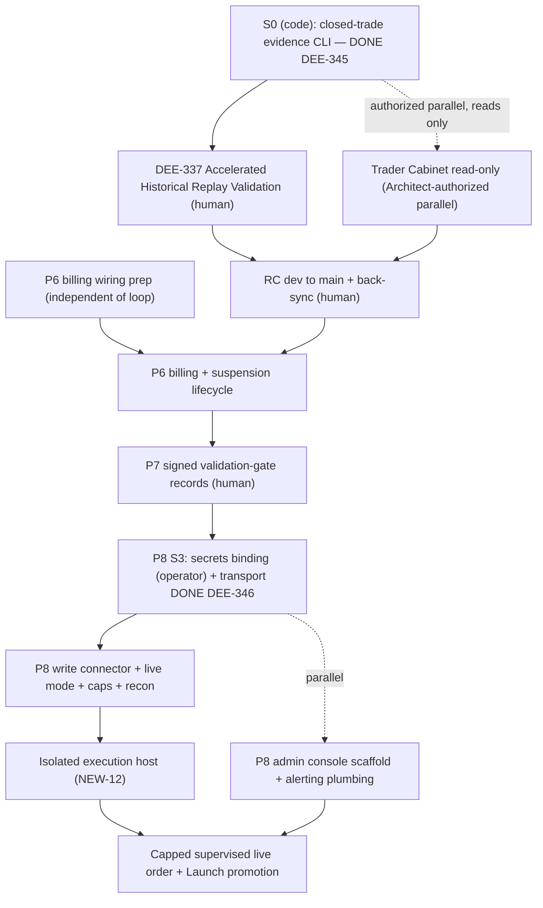

# AI-TRADER — Final Execution Blueprint (Authoritative)

This blueprint supersedes prior planning passes for the remainder of AI-TRADER MVP. Architecture stays frozen; only execution proceeds. It reconciles the **Opus Build Readiness Plan** (freeze-strict), the **Composer Build Readiness Plan** (parallel-accelerated), the **Final MVP Reality Audit**, and verified repository ground truth. Governing program: [`docs/ai-trader/AI-TRADER-MVP-EXECUTION-PROGRAM-v2.md`](docs/ai-trader/AI-TRADER-MVP-EXECUTION-PROGRAM-v2.md).

---

## 1. Current Reality (factual)

Pipelines P1–P4 are **Closed on `dev`**; P5 code gate **Closed** (S0/DEE-345 PR #298 @ `726352e`; replay validation tooling merged). P8 S3 transport foundation **partially merged** on `dev` at `77f86c0` (DEE-211 signed POST/write connector PR #300; DEE-221 credential security PR #301; DEE-346 HTX transport throttle/retry PR #302, merged 2026-06-27). The program-v2 dashboard still says "P5 Pending" — it is **stale**; git is authoritative.

- **Completed (real code + tests).** Read-only + write-foundation HTX spot connector ([`lib/trader/connectors/htx/`](lib/trader/connectors/htx/)) including signed GET/POST, `placeOrder`/`cancelOrder`/`getOrder`, BTC/ETH allowlist (DEE-211), credential security gates + redaction (DEE-221), deterministic throttle + 429/5xx retry + HTX rate-limit headers (DEE-346); MSV/CDE v0 + Feature Engine ([`lib/trader/intelligence/cde-v0.ts`](lib/trader/intelligence/cde-v0.ts)); two `PAPER`-lifecycle strategies (liquidity-sweep-reversal, mean-reversion) signal-only via CDE; Risk Engine + kill switches + idempotent orders + startup reconciliation ([`lib/trader/risk/`](lib/trader/risk/), [`lib/trader/execution/`](lib/trader/execution/)); mock paper loop + paper book/PnL ([`lib/trader/paper/`](lib/trader/paper/)); billing/HWM/30%-fee/manual-gate services ([`lib/trader/billing/`](lib/trader/billing/)); Payment Address Registry + USDT/Tron Payment Watcher + Settlement + exception reconciliation ([`lib/waia-core/payment-watcher/`](lib/waia-core/payment-watcher/), [`lib/trader/settlement/`](lib/trader/settlement/)); tenancy + `trader` entitlement + RLS + **CI tenant-isolation gate**; stdout JSON telemetry; closed-trade-per-strategy soak-evidence CLI (DEE-345).
- **Partial.** Paper loop deploy is env-gated OFF (`PAPER_LOOP_ENABLED`); observability is stdout-only (no alerting/health route for paper loop); account-suspension write path missing (`accountStatusEventTypeEnum` has only `REACTIVATED` in [`db/core-enums.ts`](db/core-enums.ts) — no code sets `SUSPENDED`); billing services exist but are **unwired** (no HTTP routes/worker); HTX write connector idempotency + live wiring not yet integrated; production **Secrets Store `AI_TRADER_MASTER_KEY` binding still commented out** in [`wrangler.jsonc`](wrangler.jsonc) → prod credential storage fails closed.
- **Missing.** Live execution mode (`LiveExecutionNotSupportedError`, [`lib/trader/execution/execution-service.ts`](lib/trader/execution/execution-service.ts) ~L476); live connector factory + worker credential decryption; live reconciliation; org live-enable gate + caps; isolated execution host; admin console UI; alerting; safe execution-path integration. Trader cabinet is a placeholder ([`app/(trader)/trader/page.tsx`](app/(trader)/trader/page.tsx)).
- **Operational (not engineering).** Accelerated Historical Replay Validation (DEE-337) not yet executed to PASS; production secrets/flags not provably set in Cloudflare.
- **Governance.** RC + Launch `dev→main` promotions pending; ADR-0009 remains **Accepted (Posture)** (external live prohibited by policy); P7 needs two human-signed promotion records (DEE-178).

---

## 2. Reconciliation of the Two Prior Plans

**What Opus got right (adopt):** freeze discipline and strict P5→P8 order; the single real codeable P5 gap is a **closed-trade-per-strategy soak-evidence CLI** (its WP-A); HTX live correctly sits at P8 behind the P7 gate; the prior DEE-170 soak (pre-P5 SHA `e7488dbc`) does **not** satisfy DEE-337; Pattern Memory is not in P1–P8 and needs scope ratification.

**What Composer got right (adopt):** it independently surfaced real paper-path **fidelity** observations (BTC-only polling; data-quality gate absent from the paper decision path; MSV not persisted during paper cycles) — the reality audit confirms these as genuine; its **parallelization instinct** (operator soak running alongside safe, non-soaked code work) is explicitly permitted by Execution-Contract clause 1 with Architect authorization; a **read-only Trader Cabinet** is a reasonable parallel.

**What to reject:**
- **Composer — Historical Replay deferred as Post-MVP (superseded 2026-06-27).** Reconciliation PR #299 ratified **Accelerated Historical Replay Validation** as the canonical MVP engineering validation strategy (replacing mandatory wall-clock 48h soak). Replay is now gate A for NEW-10/DEE-337; it is not a substitute for the P7 edge gate (ADR-0010).
- **Composer — Pattern Observation Ledger as an MVP slice with a new `trader_mi_pattern_observation` table.** Win/loss/stability/confidence are exactly the **LD-5a Hypothesis/Evidence Ledger's** job (already launched); the **LD-4** Pattern Registry firewall forbids tradeability claims. A new table is architectural duplication. Defer; if ever revived, route into LD-5a (see §9).
- **Composer — wiring real Fear & Greed / news ingestion now.** Reality audit confirms these are intentional MVP stubs; not blocking.
- **Opus — over-conservatism on paper fidelity.** Bundling nothing but WP-A is slightly too thin; but the fix is **not** to enlarge the pre-soak slice — it is to keep WP-A as the only required pre-soak code and treat fidelity items as an explicitly-optional Architect-authorized micro-slice (ETH/MSV) or P8 live-safety work (DQ-gate-in-decision-path), avoiding churn to code under soak.

**Merge result:** One required pre-RC code slice (WP-A), an explicitly-optional soak-fidelity micro-slice, then strict P6→P7→P8; Replay + Pattern Memory pushed to Post-MVP with Pattern redirected to LD-5a.

---

## 3. Launch Readiness Matrix

**Blocks first real AI-TRADER launch (Org-0 first live trade):**
- Secrets Store `AI_TRADER_MASTER_KEY` binding provisioned (credential storage stops failing closed) — *code gates merged (DEE-221); operator binding remaining*.
- ~~HTX signed POST transport + rate-limit/retry~~ — **merged** (DEE-211 + DEE-346 @ `77f86c0`); live-path wiring still required.
- ~~HTX `placeOrder`/`cancelOrder`/`getOrder` connector foundation~~ — **merged** (DEE-211); idempotency + live integration remain (S4).
- Live execution mode + live connector factory + worker credential decryption (replace mock).
- Org live-enable gate + notional caps (NEW-13); DQ gate wired **fail-closed** into the live decision path.
- Live reconciliation (`ReconcileTarget="live"`).
- Isolated execution host (NEW-12, off-Cloudflare per ADR-0006).
- P7 two signed promotion records (DEE-178); ADR-0009 posture confirmed (Org-0 only).
- Minimal admin **kill-switch + live-enable** surface; safety-critical alerting (kill-switch trip, recon mismatch, host offline).

**Blocks first external customer:** Out of MVP **by policy** — ADR-0009 stays `Accepted (Posture)`; external live is unlocked only by the documented legal-clearance transition to `Accepted (Cleared)`. This tier is a **non-engineering governance gate**, not code; nothing in MVP should target it.

**Blocks commercial operation (Org-0 productionized):** P6 billing wiring (HTTP/worker), account-**suspension write path**, invoice manual-gate approve/reject UI, fuller admin console, broader observability/alerting channels.

**Can be completed after launch (Post-MVP):** Historical replay automation; Pattern/MI observation layer; order-book depth + public trade tape feeds; real Fear&Greed/news ingestion; full RBAC; key rotation; SQLite removal; design-system polish; AI-Twin↔Trader integration; pgvector.

---

## 4. Remaining Engineering Backlog (dependency-ordered, not pipeline-ordered)

For each: **why it exists / why now / why not later.**

1. ~~**Closed-trade-per-strategy soak-evidence CLI**~~ — **DONE** (DEE-345 / PR #298 @ `726352e`).
2. **(Optional, Architect-gated) Soak-fidelity micro-slice** (ETH polling + paper MSV persistence) — *exists:* strengthens "both strategies" evidence + MI continuity; *now or never-before-soak:* must land before the soak SHA or not at all (don't modify code under soak); *not later:* only valuable pre-soak.
3. **P6 billing wiring + suspension write path** (DEE-217, DEE-215) — *exists:* services orphaned, suspend path missing; *now (after RC, can prep in parallel):* commercial-operation blocker, independent of trading loop; *not later:* required before charging Org-0 / productionizing.
4. **P7 validation-gate signed records** (DEE-178) — *exists:* ADR-0010 sufficiency condition; *now (post P5+P6):* human gate before any live capital; *not later:* live trade is unsafe without recorded edge judgment.
5. **Secrets Store master-key binding (operator)** — *exists:* prod credential storage fails closed; *now (remaining S3 step):* operator must provision binding; *not later:* foundational to every live capability.
6. ~~**HTX signed POST transport + throttle**~~ — **DONE** (DEE-211 signed POST/write foundation + DEE-346 throttle/retry @ `77f86c0`).
7. **HTX write connector idempotency + live wiring** — *exists:* connector methods merged (DEE-211); idempotency + live integration missing; *now (S4 after S3):* completes the order path; *not later:* no live trade without it.
8. **Live execution mode + connector factory + worker cred decryption** — *exists:* mode throws, worker uses mock creds; *now (after 5–7):* turns the spine live; *not later:* the core of P8.
9. **Org live-enable gate + caps (NEW-13) + DQ-gate-in-live-path** — *exists:* no org flag/caps; DQ gate skipped; *now (before first order):* enforces ADR-0009 Org-0-only + bounded downside; *not later:* required safety envelope.
10. **Live reconciliation** — *exists:* mock/paper only; *now (with live orders):* detects drift → kill switch; *not later:* unsupervised live is unsafe.
11. **Isolated execution host (NEW-12)** — *exists:* CF cron can't hold trade keys long-running; *now (before capped live):* key residency + restricted egress per ADR-0006; *not later:* live keys must never sit on CF cron.
12. **Minimal admin console + alerting (DEE-218/219/223)** — *exists:* no operator surface/alerts; *now (with live):* MVP criterion 12 + safety; *not later:* can't supervise live without it.
13. **Capped supervised live order + Launch promotion (NEW-13 final)** — *exists:* the MVP completion event; *now (last):* proves the whole chain; *not later:* it is the finish line.

---

## 5. HTX Completion Sequence

Current on `dev` @ `77f86c0`: HMAC-SHA256 v2 signed **GET + POST** ([`signing.ts`](lib/trader/connectors/htx/signing.ts)); `placeOrder`/`cancelOrder`/`getOrder` implemented at connector level (DEE-211); deterministic throttle + 429/5xx retry + HTX rate-limit headers (DEE-346); `live` mode still throws; read methods for balances/positions/open-orders/match-results exist but are **unwired** to any live loop.

**Required before first live trade (strictly serial within P8):**
1. **Secrets / safety foundation (operator + safe execution path).** Provision Secrets Store `AI_TRADER_MASTER_KEY` ([`wrangler.jsonc`](wrangler.jsonc)); verify [`lib/trader/security/credential-storage-gate.ts`](lib/trader/security/credential-storage-gate.ts) passes in prod tier — *code gates merged (DEE-221); binding + safe execution-path integration remain*. **Secrets:** decrypted creds only on the isolated host; never logged (redaction tests).
2. ~~**Signed POST transport + throttle.**~~ **DONE** — `signedPost` + POST body signing (DEE-211); token-bucket throttle + 429/5xx exponential backoff + HTX rate-limit headers (DEE-346 @ `77f86c0`, merged 2026-06-27).
3. **Write connector (idempotency + live wiring).** Foundation merged (DEE-211); **remaining:** idempotency via client order id + live-path integration; spot-only + BTC/ETH allowlist already enforced at connector.
4. **Execution (live).** Remove `LiveExecutionNotSupportedError` behind admin-enable + kill-switch + Org-0 + notional cap; `connectorForMode("live")` factory injecting decrypted creds on the isolated host; **error handling:** any HTX error → halt + kill-switch escalation telemetry.
5. **Operator controls / safety envelope (NEW-13).** Org live-enable column + migration; enforce `assertStrategyLiveAuthorized` + org gate + caps inside `submitOrder`; wire DQ gate **fail-closed** into the live decision path.
6. **Reconciliation.** Extend `ReconcileTarget`/`StartupExecutionMode` to `"live"`; reconcile DB orders/fills vs HTX `getOrder`/`getOpenOrders`/`getMatchResults`; mismatch → kill switch. Schedule the currently-unscheduled reconciliation sweeper for live.
7. **Isolated execution host (NEW-12).** Off-Cloudflare daemon running the capped, supervised live loop with per-batch KMS key residency and restricted egress (ADR-0006 + [`docs/ai-trader/AI-TRADER-SECURITY.md`](docs/ai-trader/AI-TRADER-SECURITY.md)).

**Can wait (post-first-trade / commercial):** broader alerting channels; full admin polish; order-book/tape; multi-symbol beyond BTC/ETH.

**Hard do-nots:** no external-client live (ADR-0009); no withdraw/transfer permissions; no futures/margin; never exceed caps; never log secrets; do not start any P8 item before P7 PASS.

---

## 6. Data Source Matrix

- **Implemented + wired:** HTX klines/OHLCV; ticker via merged-detail; balance snapshots (read); MSV/CDE decision inputs; Feature Engine. → No MVP work.
- **Implemented (read) but not wired to a live loop:** positions; open orders; trade history / match-results (private fills). → Wired during P8 for **live reconciliation** only.
- **Intentional MVP stubs (not blocking):** Fear & Greed (`null`), news sentiment (`"0"`), future-context (`"0"`) in [`lib/trader/intelligence/analytical-layers-v0.ts`](lib/trader/intelligence/analytical-layers-v0.ts). → Stay stubbed; strategies use OHLCV + spread.
- **Mock today (by design):** fill/execution price + paper book (MockExchangeConnector seed ticks). → Replaced by live connector at P8.
- **Missing (Post-MVP, do not block MVP):** order-book depth (Tier-B); public trade tape (note: `getMatchResults` is private user fills, not the public tape). → MVP runs on OHLCV + L1 spread; neither blocks Org-0 live.

**Conclusion:** no MVP-required data-source engineering remains; every "missing" source is Post-MVP and provably non-blocking.

---

## 7. Control Surfaces (minimum)

**Trader Cabinet (read-only).** Replace the placeholder with 2–3 server-component panels reading existing APIs/derive libs: connection + HTX account status (last sync, permission flags); balances; paper PnL; MSV/regime/reason-codes; strategies + lifecycle state; orders/fills; risk + kill-switch status; billing summary (draft period + HWM). **No trading actions.** May run as an Architect-authorized parallel during the P5 soak (reads only; does not touch soaked code), otherwise P8.

**Admin Console (P8, minimal — MVP criterion 12).** One `/admin/trader` route group, platform `admin` role ([`lib/trader/risk/kill-switch/authorization.ts`](lib/trader/risk/kill-switch/authorization.ts)), Single-Operator Governance (ADR-0011): kill-switch trip/recover; account live-enable/disable + caps; strategy pause + promotion status (reads DEE-178 records); reconciliation case queue + live-host health; invoice manual-gate approve/reject; alerts view. Tables + action buttons only — **no design-system rebuild, nothing more.**

---

## 8. Accelerated Historical Replay Validation — Canonical MVP Strategy (2026-06-27)

**Accelerated Historical Replay Validation is the canonical engineering validation strategy for AI-TRADER MVP** (reconciliation PR #299). It replaces the mandatory wall-clock 48h operator soak as gate A for NEW-10/DEE-337. Replay runs over historical market data reproducing realistic conditions; `--min-hours` is computed over replayed bar timestamps, not wall-clock elapsed time.

**Evidence tooling (S0/DEE-345, complete):** `pnpm trader:paper:soak:analyze` + `pnpm trader:paper:soak:evidence` are replay validation tools. **Not** authorization to go live — P7 Strategy Validation Gate (ADR-0010) remains the edge gate.

**Remaining:** Execute DEE-337 replay validation per runbook; closure report Verdict: PASS; then DEE-337 Done → unblocks DEE-338 RC.

---

## 9. Pattern Observation Memory — Recommendation

**Defer from MVP.** It is not in P1–P8 (freeze), and it blocks no launch tier.

**Architectural reconciliation (the key decision):** both prior plans proposed a new `trader_mi_pattern_observation` table carrying win/loss, stability score, and confidence band. Those are **edge/claim/evidence** artifacts — exactly the role of the **already-launched LD-5a Hypothesis/Evidence Ledger** ([`docs/ai-trader/AI-TRADER-HYPOTHESIS-EVIDENCE-LEDGER.md`](docs/ai-trader/AI-TRADER-HYPOTHESIS-EVIDENCE-LEDGER.md)). The **LD-4** Pattern Registry is deliberately inert and forbids any tradeability/edge claim. So a new outcome-bearing table is a **third overlapping store**.

**Why it does NOT conflict with LD-4 (and how to keep it that way):** the conflict is avoided by **not building a parallel structure at all**. LD-4 stays inert (no writes to `trader_mi_pattern`, no tradeability claims). If this capability is ever revived Post-MVP, the smallest correct implementation is a **read-only recorder that emits Evidence entries into the existing LD-5a ledger** after closed trades — append-only, PIT-pinned, tenant-scoped, fully auditable — which **never** modifies strategies, never bypasses CDE/Risk/Validation-Gate, and never feeds runtime strategy selection. This honors LD-4 (structure-only) and LD-5a (claims + evidence) without duplication. **No new table, no MVP slice.**

---

## 10. Parallelization

- **Safe during P5 validation (Architect-authorized only):** read-only Trader Cabinet and P6 billing wiring prep — neither touches the validation decision path. **Not** Pattern (deferred); **not** any change to code under validation.
- **Within P8:** S3 code slices (signed POST, credential gates, transport hardening) **merged** (DEE-211, DEE-221, DEE-346); remaining S3 operator secrets binding + safe execution-path integration; admin-console scaffold ∥ alerting plumbing may proceed as separate slices; **live-enable + capped live order is strictly serial last.**

---

## 11. Final Execution Program (execution contract)

Model convention: implementation = **Composer 2.5**, verification = **Sonnet 4.6**, Agent mode, `/implement → /test-and-fix → /prepare-pr`. Validation chain for every slice: `pnpm lint && pnpm typecheck && pnpm test --run && pnpm build` (+ Postgres integration on migrations; e2e on UI). Branch `dee-<NN>-<slug>` → squash to `dev`; only two `dev→main` merge-commits (RC after P5, Launch after P8) + mandatory back-sync.

- **S0 — P5 closed-trade evidence CLI** · Issue: **DEE-345** (parent DEE-170, sibling DEE-337) · branch `dee-345-paper-strategy-soak-evidence-cli` · Composer · Agent · **size S (1 PR)** · *Accept:* reads `trader_orders`/`trader_fills` over the replay window, emits per-strategy closed-trade counts + JSON artifact, exits non-zero if any strategy has 0 closed trades; unit tests (both-pass / one-zero-fail / boundary); runbook Phase 3 updated; no schema/loop/HTX/billing/UI change · **DONE** (PR #298 @ `726352e`).
- **S0′ (OPTIONAL, Architect-gated) — validation fidelity** · ETH polling + paper MSV persistence in [`lib/trader/paper/build-worker-deps.ts`](lib/trader/paper/build-worker-deps.ts) · Composer · Agent · **size S** · *Accept:* both instruments polled; MSV observations recorded per paper cycle (fail-open); no decision-path change · *Blocks on:* must merge **before** replay validation SHA or be skipped.
- **OPERATOR — DEE-337 Accelerated Historical Replay Validation** (human, no PR) · *Accept:* replay over historical market data for both strategies; `trader:paper:soak:analyze` PASS (critical=0); `trader:paper:soak:evidence` PASS (≥1 closed trade per strategy); closure report → PASS; DEE-337 Done.
- **RC — NEW-11 / DEE-338** `dev→main` + back-sync (human) · *Blocks on:* DEE-337 PASS.
- **S1 — P6 billing wiring + suspension lifecycle** · Issues **DEE-217, DEE-215** · branch `dee-217-billing-wiring` · Composer · Agent · **size M (2–3 PRs)** · *Accept:* billing/HWM/invoice exposed via routes/worker; suspension write path (`SUSPENDED` event + writer); unpaid→suspended→paid→reactivated proven; tenant-isolation green · *Blocks on:* RC.
- **S2 — P7 validation-gate records** · Issue **DEE-178** (human signatures) · *Accept:* two signed EFFECTIVE promotion records (ADR-0010/0011) · *Blocks on:* P5 + P6 closed.
- **S3 — P8 secrets + transport** · Issues **DEE-211, DEE-221, DEE-346** · branches `dee-211-*`, `dee-221-*`, `dee-346-*` · Composer · Agent · **size M** · *Accept:* Secrets Store binding live + storage gate passes; `signedPost` + signature vectors; throttle + 429/5xx backoff · **IN PROGRESS** — code slices **DONE**: DEE-211 (PR #300 @ `613709d`), DEE-221 (PR #301 @ `9e4a576`), DEE-346 (PR #302 @ `77f86c0`, merged 2026-06-27); **remaining:** operator Secrets Store binding, safe execution-path integration · *Blocks on:* P7 PASS for live; operator binding required before prod credential use.
- **S4 — P8 write connector idempotency + live wiring** · **DEE-211** foundation merged · **size S–M** · *Accept:* idempotency via client order id; live-path wiring · *Blocks on:* S3 complete.
- **S5 — P8 live mode + gate + caps** · **NEW-13** + DEE-212/211 area · **size L** · *Accept:* live mode behind admin-enable + kill-switch + Org-0 + caps; live connector factory + worker cred decryption; DQ gate fail-closed in live path · *Blocks on:* S4.
- **S6 — P8 live reconciliation** · **DEE-221** chain · **size M** · *Accept:* `ReconcileTarget="live"`; DB↔HTX reconcile; mismatch → kill switch; sweeper scheduled · *Blocks on:* S5.
- **S7 — Isolated execution host** · Issue **NEW-12** · **size L (infra)** · *Accept:* off-CF daemon, per-batch KMS key residency, restricted egress; runs capped live loop · *Blocks on:* S5 (parallel-startable with S6).
- **S8 — Admin console + alerting** · Issues **DEE-218/219/223** · branch `dee-218-admin-console-alerting` · Composer · Agent · **size M (3 PRs; scaffold parallel to S3–S6)** · *Accept:* kill-switch/live-enable/account-status controls; safety-critical alert dispatch · *Blocks on:* S5 for live-enable wiring.
- **S9 — Capped supervised live + Launch** · Issue **NEW-13** final + Launch promotion (human merge) · *Accept:* full 16-criterion MVP checklist green on `main`; Post-Merge PASS → **MVP COMPLETE** · *Blocks on:* S6, S7, S8.

**Post-MVP backlog (do not schedule):** Pattern/MI observation via LD-5a; order-book/tape; real Fear&Greed/news; RBAC (DEE-158); key rotation (DEE-235); SQLite removal (DEE-85); external pilot (DEE-179, gated by ADR-0009 clearance).

---

## 12. Final Decision (Chief Architect)

**I would keep the current execution strategy essentially unchanged.** The frozen `P1→…→P8` order is correct, HTX live belongs at P8 behind the P7 gate, and repository evidence shows the current ordering does **not** prevent MVP delivery — so HTX live must **not** move earlier (per the constraint). I would make only three precise, freeze-safe refinements, all already folded into this blueprint:

1. **Name the single real P5 code gap** (closed-trade-per-strategy evidence CLI, S0) so RC is evidenced honestly.
2. **Formally classify Historical Replay and Pattern Observation Memory as Post-MVP**, and **redirect any future Pattern/observation work into the existing LD-5a Evidence Ledger** rather than a new `trader_mi_pattern_observation` table — eliminating an architectural duplication both prior plans would have introduced.
3. **Permit narrow, Architect-authorized parallelism during the P5 soak** (read-only cabinet + billing-wiring prep only), capturing Composer's throughput benefit without touching soaked code or breaking the freeze.

Everything else — safety spine, ADRs, milestone gating, single-operator governance, Org-0-only posture — is sound and stays as-is. After acceptance, planning is finished: every slice above is directly assignable to Composer 2.5 and verifiable by Sonnet 4.6.