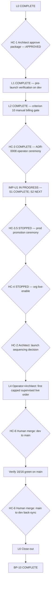

# BP-10 (DEE-340) — Canonical Execution Plan

> **Authoritative execution plan for BP-10 (DEE-340) under WAIA DEV OS.** L0–L2 **COMPLETE**. **IMP-U1 S1 COMPLETE** (2026-06-30). **IMP-U1 S2 NEXT**. **HC-3.5 STOPPED** (IMP-U1). **HC-4 STOPPED** (HC-3.5 + PF-6). **L4 unchanged.** **Do not repeat L0–L2.** Operator runbooks deferred to IMP-U1d — not an error.

---

## Execution state (canonical)

| Slice | Status |
|-------|--------|
| **L0** — Launch Operations Package | **COMPLETE** |
| **HC-1** — Architect L0 approval | **APPROVED** (2026-06-29) |
| **L1** — Pre-launch verification | **COMPLETE** (2026-06-29) |
| **L2** — Criterion 10 manual billing gate | **COMPLETE** — HC-3 **COMPLETE** (2026-06-29); criterion **10** **PASS** |
| **IMP-U1 S1** — Admin promotion Request API | **COMPLETE** — [DEE-353](https://linear.app/deepsense/issue/DEE-353) / PR #335 @ `7a0e791` (2026-06-30) |
| **IMP-U1 S2–S8** — Unified Postgres launch | **IN PROGRESS** — **S2 NEXT**; see [IMP-U1 program](imp-u1-implementation-program.plan.md) |
| **HC-3.5** — Production promotion ceremony | **STOPPED** — after IMP-U1 S1–S8 + Architect sign-off + PROC (IMP-U1d) |
| **L3 / HC-4** — Governed Org-0 live-enable | **STOPPED** — PF-6 fails (zero prod EFFECTIVE); resume after HC-3.5 + PF-6 9/9; [HC-4 checklist](docs/ops/DEE-340-BP10-L3-HC4-OPERATOR-CHECKLIST.md) published |
| **L4** — First capped supervised live order | **Pending** (unchanged — blocked until L3 / HC-4) |
| **L5** — Launch promotion + back-sync | Pending |
| **L6** — Close-out | Pending |

**Canonical `dev` HEAD:** `7a0e791d347fbf6a2113fe6bd717dfd325e9844c` (PR #335 IMP-U1 S1)

**Current phase:** **IMP-U1 S2 NEXT**. **Do not execute HC-3.5 or HC-4.** Nothing prior to IMP-U1 S1 should be repeated.

---

## Definition of Success

BP-10 succeeds when the architecturally-complete, scope-frozen AI-TRADER MVP is **sealed on `main` through one governed ceremony** — not through new capability. Concretely: a single capped, supervised Org-0 live spot order has been placed, filled, reconciled, and reported under the Single Operator Governance Model; the 16-criterion MVP checklist is green on `main`; the `dev→main` Launch promotion and the mandatory `main→dev` back-sync are merged as merge commits with ancestry intact; and DEE-340 and milestone M10 are closed with signed, secret-free evidence — all without adding a single line of product code or expanding MVP scope. The mental target for everyone executing this plan: **a launched, auditable MVP, proven on in-house capital — nothing more, nothing less.**

---

## Launch Principles

These principles summarize existing governance ([Ratification Charter](docs/ai-trader/AI-TRADER-MVP-RATIFICATION.md) §5–6, [Launch Readiness Review](docs/ops/DEE-352-LAUNCH-READINESS-REVIEW.md), MVP Scope Freeze, [AGENTS.md](AGENTS.md) merge posture). They introduce no new rule; where one appears to conflict with an authoritative source, the source wins.

1. **No new implementation (BP-10 ceremony).** BP-10 ships zero product code for launch authorization — **except** ratified **IMP-U1** (U1 Unified Postgres) per [hc-4_pf-6 ratification §15](hc-4_pf-6_ratification_54c05640.plan.md).
2. **No scope expansion.** The MVP Scope Freeze is active; any addition is new scope requiring its own authorization.
3. **Safety before launch.** Fail-closed everywhere; kill-switch armed; validation precedes promotion.
4. **Human authority over capital.** Non-custodial; READ + TRADE only; WITHDRAW/TRANSFER forbidden; a human is always above the system.
5. **Evidence before declaration.** No criterion is "green" without recorded, non-secret evidence.
6. **Promotion follows governance.** Live-enable and `dev→main` promotion obey ADR-0010/0011 and the merge-commit + back-sync posture; never squash a promotion.
7. **Production before celebration.** BP-10 is COMPLETE only when 16/16 are green on `main` and the back-sync is merged.
8. **Agents guide, humans act.** Composer records evidence and packages artifacts; humans provision secrets, enable live, execute the live order, and merge.

---

## Document Map

- [Execution state](#execution-state-canonical) · [Definition of Success](#definition-of-success) · [Launch Principles](#launch-principles)
- [1. PASS / FAIL](#1-pass--fail) · [2. BP-10 Mission](#2-bp-10-mission) · [3. Repository Readiness](#3-repository-readiness) · [4. Architecture Review](#4-architecture-review) · [5. Risks](#5-risks)
- [6. Work Decomposition (L0–L6)](#6-work-decomposition-launch-slices) · [7. Composer Stopping Points](#7-recommended-composer-stopping-points) · [8. Human Checkpoints](#8-human-checkpoints)
- [9. Exit Criteria](#9-exit-criteria--bp-10-complete) · [10. Final Execution Sequence](#10-final-execution-sequence) · [Next task](#next-composer-task)

---

## 1. PASS / FAIL

**PASS (through L2 / HC-3 + IMP-U1 S1).** L0–L2 **COMPLETE**. HC-3 **COMPLETE**. **IMP-U1 S1 COMPLETE** (PR #335). **IMP-U1 S2 NEXT**. **HC-3.5 STOPPED**. **HC-4 STOPPED**. L4–L6 pending. **Do not repeat L0–L2. Do not execute HC-3.5 or HC-4.**

---

## 2. BP-10 Mission

BP-10 is **launch authorization and ceremony — not a build phase** (per [AI-TRADER-MVP-RATIFICATION.md](docs/ai-trader/AI-TRADER-MVP-RATIFICATION.md) §6). It adds no feature, exchange, strategy, or runtime. It converts the architecturally-complete MVP (frozen on `dev`) into a launched MVP on `main` by:

- confirming the full 16-criterion MVP checklist is green;
- closing the one operator-required checklist item (criterion 10 — manual billing gate exercise) — **DONE at L2 / HC-3**;
- executing the **first capped, supervised Org-0 live spot order** under the Single Operator Governance Model ([ADR-0011](docs/adr/0011-single-operator-governance-model.md));
- promoting `dev → main` (merge commit) and performing the **mandatory back-sync** (`main → dev`);
- closing DEE-340 and milestone M10.

**Differentiation:**
- **vs Implementation** — closed at BP-9 (PR #317). BP-10 writes no product code. ADR-0009 stays `Accepted (Posture)`; launching does **not** unlock external/multi-tenant live.
- **vs Verification** — closed at BP-9A (DEE-352, 11/11 PASS). BP-10 re-confirms checklist state post-promotion; it does not re-verify the build.
- **vs Governance** — gates (ADR-0009/0010/0011, Ratification Charter, Launch Readiness Review) are already ratified. BP-10 *executes within* them, it does not define them.
- **vs Launch** — BP-10 **is** the launch: the governed live order + the `dev→main` promotion + back-sync are the launch acts themselves.

---

## 3. Repository Readiness

- Canonical `dev` = `7a0e791d347fbf6a2113fe6bd717dfd325e9844c` (PR #335). `main` behind `dev`.
- DEE-340 — **In Progress**; milestone **M10 — MVP Launch**.
- L0–L2 deliverables on `dev`; IMP-U1 S1 on `dev` (PR #335); HC-3 production evidence in [closure report §3](docs/ops/DEE-340-BP10-LAUNCH-CLOSURE-REPORT.md).
- **16/16 green on `dev`** after HC-3 (criterion 10 **PASS**); criterion 9 production attestation pending HC-3.5.
- **Next gate:** **IMP-U1 S2** per [IMP-U1 program](imp-u1-implementation-program.plan.md). **HC-3.5 and HC-4 STOPPED.**

---

## 4. Architecture Review

No deviation from Ratification Charter §5 for BP-10 ceremony scope. **IMP-U1** is ratified architecture correction (U1 Unified Postgres + Admin Request) — not BP-10 scope expansion. Operator runbook sync deferred to IMP-U1d.

---

## 5. Risks

Unchanged from ratified plan — see [DEE-340-BP10-LAUNCH-RUNBOOK.md](docs/ops/DEE-340-BP10-LAUNCH-RUNBOOK.md) §9 (abort/rollback).

---

## 6. Work Decomposition (launch slices)

### L0 — Launch Operations Package *(Composer)* — **COMPLETE**

Merged PR #322 @ `e19295e`. [Runbook](docs/ops/DEE-340-BP10-LAUNCH-RUNBOOK.md) + [closure report](docs/ops/DEE-340-BP10-LAUNCH-CLOSURE-REPORT.md) skeleton on `dev`.

### L1 — Pre-launch verification *(Composer records; Operator/Architect attest)* — **COMPLETE**

Read-only validation chain on `dev`; 16-criterion table populated. Evidence in [closure report §2](docs/ops/DEE-340-BP10-LAUNCH-CLOSURE-REPORT.md).

### L2 — Criterion 10 manual billing gate *(Operator, HC-3)* — **COMPLETE**

Successfully completed 2026-06-29 through ADR-0008 manual billing gate execution with production evidence recorded:

- Operator ceremony per [L2 HC-3 checklist](docs/ops/DEE-340-BP10-L2-HC3-OPERATOR-CHECKLIST.md) — Steps 0–6 **COMPLETE**
- Invoice id prefix `2cedeaa5` **ISSUED**; reporting period prefix `d926e5ff`; exchange account `htx-spot-1`
- Gate attestation count **6**; HWM ratchet prefix `6a182789` @ **100**
- Criterion **10** **PASS** — recorded in [closure report §3](docs/ops/DEE-340-BP10-LAUNCH-CLOSURE-REPORT.md)
- Post-MVP UX backlog only: [DEE-340-OPERATOR-CONSOLE-UX-BACKLOG.md](docs/ops/DEE-340-OPERATOR-CONSOLE-UX-BACKLOG.md)

**Do not re-execute L2 or HC-3.**

### L2.5 / IMP-U1 — Unified Postgres launch *(Composer, ratified)* — **IN PROGRESS**

Ratified per hc-4_pf-6 §15. Program: [IMP-U1 implementation program](imp-u1-implementation-program.plan.md).

| Slice | Status |
|-------|--------|
| **S1** — Admin promotion Request API | **COMPLETE** — PR #335 @ `7a0e791` (DEE-353) |
| **S2** — Admin GET pending/latest | **NEXT** |
| S3–S8 | Pending |

**STOP:** Do not execute HC-3.5 until S1–S8 + Architect IMP-U1 sign-off + PROC docs (IMP-U1d).

### L2.5b / HC-3.5 — Production promotion ceremony *(Operator)* — **STOPPED**

Drill strategy `mean_reversion_v0` @ `0.1.0` → Postgres EFFECTIVE. Blocked until IMP-U1 complete. Ops checklist deferred to IMP-U1d.

### L3 — Governed Org-0 live-enable *(Operator, ADR-0011, HC-4)* — **STOPPED**

Operator package published: [L3 HC-4 checklist](docs/ops/DEE-340-BP10-L3-HC4-OPERATOR-CHECKLIST.md) (PR #334). **HC-4 STOPPED** — PF-6 fails (zero prod EFFECTIVE); resume only after HC-3.5 + PF-6 9/9. **Do not execute HC-4.**

### L4 — First capped supervised live spot order *(Operator + Architect, HC-2 + HC-5)*

Single bounded `pnpm trader:live:cycle`; disable after. Blocked until L3 / HC-4 complete.

### L5 — Launch promotion + back-sync *(Human merge, HC-6)*

Merge-commit `dev→main` then `main→dev`. Composer packages PR bodies only.

### L6 — Close-out *(Operator/Architect, HC-7)*

DEE-340 **Done**; M10 closed; signed closure report; monitoring window.

---

## 7. Recommended Composer Stopping Points

1. **L0 COMPLETE** — yield to **HC-1** (Architect). ✓
2. After **L1** — yield to Operator L2 / HC-3. ✓
3. After **L2 / HC-3** — IMP-U1 program active; **STOP before HC-3.5 and HC-4**. ✓
4. After **IMP-U1 S1** — **S2 NEXT**; await Architect review before S2 implementation.
5. Before **HC-3.5** — IMP-U1 S1–S8 + sign-off + PROC docs required.
6. Before **HC-4 live-enable execution** — HC-3.5 complete + PF-6 9/9; Operator runs [L3 HC-4 checklist](docs/ops/DEE-340-BP10-L3-HC4-OPERATOR-CHECKLIST.md); **STOP after closure §4** before L4.
7. Before **L5** merges — human merges only.
8. After **L6** records — Architect/Operator sign closure.

**Hard rule:** L0–L2 are sealed. Do not repeat billing gate, pre-launch verification, or L0 package work.

---

## 8. Human Checkpoints

- **HC-1 (Architect):** Approve L0 Launch Operations Package — **COMPLETE**
- **HC-2 (Architect):** Launch sequencing before L4/L5 — pending
- **HC-3 (Operator):** Criterion 10 manual billing gate (L2) — **COMPLETE** (2026-06-29); criterion **10** **PASS**
- **IMP-U1 (Composer):** Unified Postgres launch — S1 **COMPLETE**; S2 **NEXT**
- **HC-3.5 (Operator):** Production promotion ceremony — **STOPPED** (IMP-U1)
- **HC-4 (Operator, ADR-0011):** Governed live-enable (L3) — **STOPPED** (HC-3.5 + PF-6)
- **HC-5 (Operator + Architect):** Supervise first capped live order (L4) — pending
- **HC-6 (Human merge):** Launch promotion + back-sync (L5) — pending
- **HC-7 (Architect):** Sign closure; declare COMPLETE (L6) — pending

---

## 9. Exit Criteria — "BP-10 COMPLETE"

All true:

1. 16-criterion MVP checklist **green on `main`**
2. First capped live order placed, filled, reconciled, reported; live-enable **DISABLED** after
3. `dev→main` Launch promotion merge commit; CI green on `main`
4. `main→dev` back-sync merge commit
5. DEE-340 **Done**; M10 closed
6. Closure report signed; monitoring window clean
7. ADR-0009 still `Accepted (Posture)`; no MVP scope added

---

## 10. Final Execution Sequence

---

## Next Composer Task

**IMP-U1 S2** — Admin GET pending/latest promotion by strategy. Branch from `dev` @ `7a0e791`. **Await Architect review before starting S2.**

**STOP:** Do not execute HC-3.5, HC-4, or L4. Do not run `pnpm trader:live:request` or any live-enable command. Operator runbook updates deferred to IMP-U1d.

---

> **This document is approved as the authoritative execution plan for BP-10 (DEE-340) under WAIA DEV OS.**
