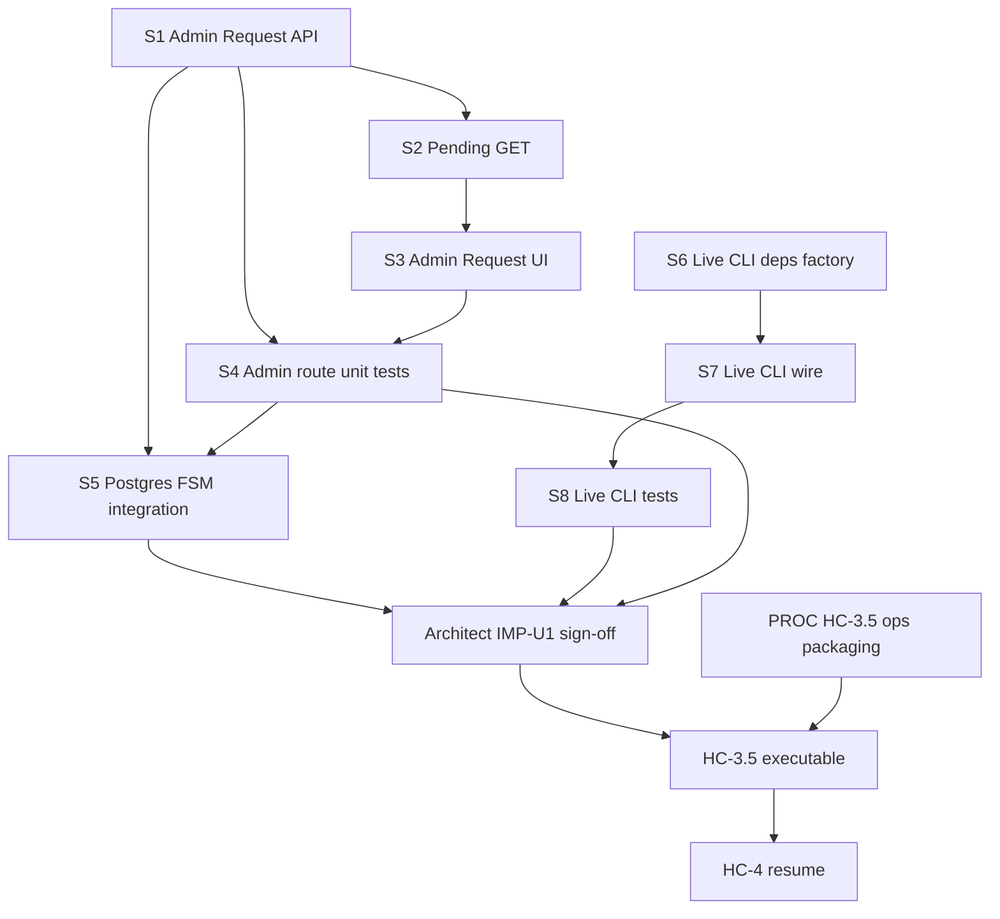

# IMP-U1 — Unified Postgres Launch Implementation Program

**Authority:** [hc-4_pf-6_ratification_54c05640.plan.md](./hc-4_pf-6_ratification_54c05640.plan.md) §15 (canonical — do not revisit)  
**Type:** Implementation program for Composer · **Not** architecture · **Not** ops execution  
**Date:** 2026-06-30 (S1 post-merge sync: 2026-06-30)  
**Linear epic suggestion:** `DEE-340` child or dedicated `DEE-NNN` per slice  
**Canonical `dev` HEAD:** `7a0e791` (PR #335 / DEE-353)

---

## Execution state (current)

| Slice | Status |
|-------|--------|
| **S1** — Admin promotion Request API | **COMPLETE** — PR #335 @ `7a0e791` (DEE-353) |
| **S2** — Admin GET pending/latest | **NEXT** |
| S3–S8 | Pending |
| Architect IMP-U1 sign-off | Pending (after S1–S8) |
| HC-3.5 ops | **STOPPED** — blocked by IMP-U1 + PROC |
| HC-4 | **STOPPED** — blocked by HC-3.5 + PF-6 |

---

## Executive summary

Ratified architecture requires **U1 Unified Postgres** for all governed launch state (HC-3.5, HC-4, L4) and **Admin UI** as the sole production **promotion Request** surface. Implementation is blocked into **eight Composer slices (S1–S8)** plus **Architect sign-off**. **`trader:gate` remains SQLite/replay-only** — out of scope for Postgres migration.

**HC-3.5 must not begin until:** S1–S7 merged on `dev`, full validation chain green, Architect IMP-U1 checkpoint passed.  
**HC-4 remains STOPPED** until HC-3.5 completes and PF-6 passes (ops — post-implementation).

| Phase | Slices | Delivers |
|-------|--------|----------|
| **IMP-U1a** | S1 → S2 → S3 → S4 | Admin Request API + UI + unit tests |
| **IMP-U1b** | S5 | Postgres FSM integration test |
| **IMP-U1c** | S6 → S7 → S8 | Postgres `trader:live:*` + `live:cycle` |
| **IMP-U1d** | (identification only) | Ops doc update list — after S1–S8 |

---

## Canonical assumptions (fixed — do not reopen)

From ratification §15:

- **U1** — production Postgres is the launch system of record
- **Request surface A** — Admin UI only for production promotion Request
- **HC-3.5 required** — drill strategy `mean_reversion_v0` @ `0.1.0` only before HC-4
- **Option B intact** — Worker control plane; execution host CLI for live dispatch
- **`trader:gate`** — replay/BP-5 process proof only; **no Postgres migration**

---

## Dependency graph



**Critical path:** S1 → S2 → S3 → S4 → S5 → S6 → S7 → S8 → Architect sign-off → PROC → HC-3.5

**Parallelizable:** S6 may start after S1 merges (no UI dependency). S5 may start after S1 merges (parallel with S2–S4 if API stable).

---

## Complete implementation roadmap

| Order | Slice | Branch | PR base | IMP phase | Status |
|-------|-------|--------|---------|-------------|--------|
| 1 | **S1** | `dee-353-imp-u1-admin-promotion-request-api` | `dev` | U1a | **COMPLETE** — PR #335 @ `7a0e791` |
| 2 | **S2** | `dee-NNN-imp-u1-promotion-pending-get` | `dev` | U1a | **NEXT** |
| 3 | **S3** | `dee-NNN-imp-u1-admin-promotion-request-ui` | `dev` | U1a | Pending |
| 4 | **S4** | `dee-NNN-imp-u1-admin-promotion-route-tests` | `dev` | U1a | Pending |
| 5 | **S5** | `dee-NNN-imp-u1-postgres-promotion-fsm` | `dev` | U1b | Pending |
| 6 | **S6** | `dee-NNN-imp-u1-live-cli-deps-postgres` | `dev` | U1c | Pending |
| 7 | **S7** | `dee-NNN-imp-u1-live-cli-postgres-wire` | `dev` | U1c | Pending |
| 8 | **S8** | `dee-NNN-imp-u1-live-cli-postgres-tests` | `dev` | U1c | Pending |

**Post-merge (each slice):** `pnpm lint && pnpm typecheck && pnpm test --run && pnpm build`  
**Post-S5 additionally:** `WAIA_PG_INTEGRATION=1` postgres-integration CI (migration-bearing if any — S5 adds test file only, no migration)

**Final IMP-U1 gate:** All S1–S8 on `dev` + Architect checkpoint → unlock HC-3.5 ops packaging and execution.

---

## Slice decomposition

### S1 — Admin promotion Request API (IMP-U1a core)

| Field | Value |
|-------|-------|
| **Objective** | Add production Postgres `request` command to admin strategy-promotion API |
| **Scope** | `command: "request"` in POST handler; parse evidence document + operator inputs JSON; call existing `requestPromotion` — **no new FSM logic** |
| **In scope** | `lib/trader/validation-gate/admin-route-handler.ts`; optional small `parseAdminPromotionRequestBody` helper colocated or in `operator-promotion-inputs.ts` |
| **Out of scope** | UI; GET changes; `trader:gate`; migrations; service-layer changes unless bugfix |
| **Affected modules** | `admin-route-handler.ts`, `commands/route.ts` (no route change if handler only), `operator-evidence.ts`, `operator-promotion-inputs.ts`, `promotion-service.ts` (call only) |
| **Acceptance criteria** | (1) POST `{ command: "request", organization_id, strategy_id, evidence, inputs, idempotency_key? }` returns `PENDING_CONFIRM` record on Postgres runtime. (2) Invalid evidence digest / missing inputs → 400 fail-closed. (3) Idempotency replay returns same record. (4) Audit `trader.strategy_promotion.requested` written. (5) Confirm/effective/cancel/demote unchanged. |
| **STOP boundary** | Do not implement UI. Do not add `trader:gate` Postgres. Do not touch `live-cli.ts`. |
| **Merge boundary** | Single PR; handler + helper + types only |
| **Dependencies** | None (service layer exists) |
| **Architect checkpoint** | None (merge to dev) |
| **Post-merge audit** | Standard `/test-and-fix`; verify admin auth on new command path |
| **Status** | **COMPLETE** — merged PR #335 @ `7a0e791` (2026-06-30) |

**Request body shape (canonical):**

```json
{
  "command": "request",
  "organization_id": "<uuid>",
  "strategy_id": "mean_reversion_v0",
  "idempotency_key": "<optional-uuid>",
  "evidence": { /* PaperEvaluationExportDocument */ },
  "inputs": { /* OperatorPromotionInputs */ }
}
```

Reuse `parsePaperEvaluationExportDocument`, `parseOperatorPromotionInputs`, `buildAssembleInput` — same validation as CLI.

---

### S2 — Admin GET pending / latest promotion by strategy (IMP-U1a enabler)

| Field | Value |
|-------|-------|
| **Objective** | Allow UI to discover in-flight promotion without manual `record_id` |
| **Scope** | Extend GET `?organization_id=&strategy_id=` to return `{ effective, latest }` or `{ effective, pending }` where `pending` is newest non-terminal record (`PENDING_CONFIRM`, `COOLING_OFF`) |
| **In scope** | `admin-route-handler.ts`; `repository-postgres.ts` + `repository-sqlite.ts` — `getLatestPromotionForStrategy` (or reuse list + filter); `admin-serialize.ts` if needed |
| **Out of scope** | UI; pagination; multi-strategy batch |
| **Acceptance criteria** | (1) GET returns effective record when present. (2) GET returns latest pending when no effective. (3) Fail-closed org scoping. (4) SQLite parity for unit tests. |
| **STOP boundary** | No UI. No Request command changes beyond S1. |
| **Merge boundary** | Single PR; may stack on S1 branch if preferred |
| **Dependencies** | S1 merged or same PR as S1 if small |
| **Architect checkpoint** | None |

---

### S3 — Admin UI promotion Request panel (IMP-U1a UI)

| Field | Value |
|-------|-------|
| **Objective** | Operator can originate production promotion Request from `/admin/strategy-promotions` |
| **Scope** | Request section: JSON textarea or file upload for `evidence.json` + `inputs.json`; strategy selector; submit → POST `request`; show returned `record_id` + state; surface validation errors |
| **In scope** | `app/(trader)/admin/strategy-promotions/page.tsx`; mirror patterns from `live-enable/page.tsx` and billing admin |
| **Out of scope** | Wizard UX backlog items; second strategy bulk; CLI |
| **Acceptance criteria** | (1) Request button visible when no blocking pending record. (2) Successful Request → `PENDING_CONFIRM` + record id displayed. (3) Confirm / Mark effective flow works on returned record without manual id paste (uses S2 pending or response id). (4) `REQUIRED_EFFECTIVE_ACK` phrase on Mark effective unchanged. (5) No secrets in client bundle. |
| **STOP boundary** | No `live-cli` changes. No ops doc edits. |
| **Merge boundary** | Single PR |
| **Dependencies** | S1 + S2 on `dev` |
| **Architect checkpoint** | Optional demo review before S5 if desired — not blocking |

---

### S4 — Admin route unit tests (IMP-U1a quality gate)

| Field | Value |
|-------|-------|
| **Objective** | Fail-closed auth + Request/Confirm/Effective path via handler |
| **Scope** | New `tests/unit/trader-admin-strategy-promotion-routes.test.ts` (or extend `trader-admin-route-auth.test.ts`) — SQLite runtime via `getWaiaRuntimeDb` with test backend |
| **In scope** | Auth 401; request → confirm → mark-effective happy path; invalid evidence; wrong ack |
| **Out of scope** | Postgres integration (S5); E2E Playwright |
| **Acceptance criteria** | (1) Unauthenticated → 401. (2) Full FSM via handler on test DB. (3) Tests run in `pnpm test --run`. |
| **STOP boundary** | No integration test file (S5). |
| **Merge boundary** | Single PR; may combine with S3 if small |
| **Dependencies** | S1 on `dev` |
| **Architect checkpoint** | None |

---

### S5 — Postgres integration test — full promotion FSM (IMP-U1b)

| Field | Value |
|-------|-------|
| **Objective** | CI-proven Postgres parity for Request → Confirm → Cooling-off → Effective → Authz → Audit |
| **Scope** | New `tests/integration/postgres-strategy-promotion-parity.test.ts` following `postgres-kill-switch-parity.test.ts` template |
| **In scope** | `createPostgresStrategyPromotionService`; full FSM; audit log assertions; `isLiveAuthorized` / version probe; idempotency; demote optional |
| **Out of scope** | Admin HTTP (covered S4); UI; migrations (tables exist) |
| **Acceptance criteria** | (1) Passes with `WAIA_PG_INTEGRATION=1`. (2) Skips cleanly without Postgres. (3) Asserts audit actions: `requested`, `confirmed`, `effective`. (4) `getEffectivePromotion` returns version-bound record. (5) Wrong version authz denied. |
| **STOP boundary** | No live-cli. No admin UI. |
| **Merge boundary** | Single PR |
| **Dependencies** | S1 merged (Request path validated at service level — test calls service directly OK without S1 if service-only) |
| **Architect checkpoint** | None |
| **Post-merge audit** | Confirm `postgres-integration.yml` runs green |

---

### S6 — Postgres live-cli deps factory (IMP-U1c foundation)

| Field | Value |
|-------|-------|
| **Objective** | Extract Postgres-capable `LiveCycleDeps` + org-live-enable service factory using `getWaiaRuntimeDb()` |
| **Scope** | New `lib/trader/live/build-live-cli-deps.ts` (or `lib/trader/live/live-cli-deps.ts`) — mirror `buildPaperLoopDepsFromEnv` / `build-worker-deps` patterns |
| **In scope** | Factory returns `{ deps, dispose }` with: `createPostgresOrgLiveEnableService`, `createPostgresStrategyPromotionService`, `createPostgresCredentialService`, `createPostgresOrderRepository`, `createPostgresReconciliationService`, billing bridges as needed for `runLiveCycleOnce`, `createExecutionLiveAuthorizationHook`, `writeTraderAuditLogPostgres` |
| **Out of scope** | Wiring `live-cli.ts` (S7); changing Option B boundaries; Worker-side execution |
| **Acceptance criteria** | (1) Factory compiles with strict TS. (2) Exported type matches `LiveCycleDeps` + org-live service needs. (3) Uses `DATABASE_URL_POSTGRES` / `getWaiaRuntimeDb()`. (4) `dispose()` in `finally` pattern documented. (5) Unit-testable with injected runtime mock or sqlite fallback for S8. |
| **STOP boundary** | Do not modify `live-cli.ts` entrypoints yet. Do not remove SQLite path from CLI (S7 adds branch). |
| **Merge boundary** | Single PR |
| **Dependencies** | None strict; logically after S5 |
| **Architect checkpoint** | None |

**Environment (canonical for execution host):**

| Var | Required | Purpose |
|-----|----------|---------|
| `DATABASE_URL_POSTGRES` | Yes | Supabase pooler URI |
| `WAIA_TRADER_CLI` | Yes | Safety gate |
| `WAIA_TRADER_ORG0_ORGANIZATION_ID` | Yes | Org-0 allowlist |
| `WAIA_TRADER_EXECUTION_HOST_URL` | Yes (cycle) | Host health probe |
| `AI_TRADER_MASTER_KEY` / Secrets Store | Yes (cycle) | Credential decrypt |

---

### S7 — Wire `trader:live:*` + `live:cycle` to Postgres (IMP-U1c)

| Field | Value |
|-------|-------|
| **Objective** | Execution-host CLI reads/writes governed launch state from Postgres |
| **Scope** | Refactor `scripts/trader/live-cli.ts`: replace `getDb()` with S6 factory when `DATABASE_URL_POSTGRES` set; **fail-closed** if launch mode env indicates production but only SQLite `DATABASE_URL` present (message directing to Postgres). Org-live subcommands + `cycle` use same runtime. |
| **In scope** | `live-cli.ts`; S6 factory; update CLI header comment / usage env list |
| **Out of scope** | `trader:gate` SQLite-only (explicitly remain replay); Admin UI; Worker |
| **Acceptance criteria** | (1) `pnpm trader:live:status` with Postgres env reads org enable from Postgres. (2) `live:cycle` composite gate reads promotion + org enable from Postgres. (3) Credential resolution uses Postgres `exchange_credentials` + secure resolver. (4) SQLite path still works for local BP-7 drills when only `DATABASE_URL` file set — **not** for production launch (documented in S8/IMP-U1d). (5) Option B unchanged: no Worker HTX dispatch. |
| **STOP boundary** | No ops runbook edits in this slice. No HC-4 execution. |
| **Merge boundary** | Single PR |
| **Dependencies** | S6 on `dev` |
| **Architect checkpoint** | **Recommended** — review env fail-closed matrix before merge |

---

### S8 — Live CLI Postgres path tests (IMP-U1c quality gate)

| Field | Value |
|-------|-------|
| **Objective** | Regression lock for Postgres live-cli wiring and composite gate |
| **Scope** | Extend `tests/unit/trader-live-authorization-gate.test.ts` patterns; add `tests/unit/trader-live-cli-postgres-deps.test.ts` or integration-style test with mocked runtime |
| **In scope** | Factory invocation; gate rejects missing EFFECTIVE; gate rejects missing org ENABLED; env guard behavior |
| **Out of scope** | Real HTX; real Postgres unless lightweight integration deemed necessary |
| **Acceptance criteria** | (1) Tests pass in CI without Postgres OR use existing integration harness. (2) Cover fail-closed when promotion missing. (3) No regression to SQLite BP-7 drill path. |
| **STOP boundary** | No production execution. |
| **Merge boundary** | Single PR; may stack on S7 |
| **Dependencies** | S7 on `dev` |
| **Architect checkpoint** | None |

---

## IMP-U1d — Operator documentation (identification only — no edits in IMP-U1 code slices)

Documents requiring update **after S1–S8 merge**, in **PROC** phase (separate PR(s) to `dev`):

| Document | Required changes |
|----------|------------------|
| [docs/ops/DEE-340-BP10-L3-HC4-OPERATOR-CHECKLIST.md](docs/ops/DEE-340-BP10-L3-HC4-OPERATOR-CHECKLIST.md) | PF-6 Postgres attestation query; Admin-primary HC-4; forbid SQLite launch; P-3 org prefix |
| [docs/ops/DEE-340-BP10-LAUNCH-RUNBOOK.md](docs/ops/DEE-340-BP10-LAUNCH-RUNBOOK.md) | Insert L2.5 HC-3.5; U1 persistence policy; execution host `DATABASE_URL_POSTGRES`; deprecate SQLite launch |
| [docs/ops/DEE-340-BP10-LAUNCH-CLOSURE-REPORT.md](docs/ops/DEE-340-BP10-LAUNCH-CLOSURE-REPORT.md) | §3.5 evidence slot; criterion 9 attestation note |
| **New:** `docs/ops/DEE-340-BP10-L2.5-HC3.5-OPERATOR-CHECKLIST.md` | HC-3.5 ceremony (Admin Request → Effective); drill strategy only |
| [docs/ops/DEE-178-OPERATOR-RUNBOOK.md](docs/ops/DEE-178-OPERATOR-RUNBOOK.md) | Banner: replay/BP-5 only — not production launch |
| [docs/ops/DEE-212-BP7-LIVE-EXECUTION-RUNBOOK.md](docs/ops/DEE-212-BP7-LIVE-EXECUTION-RUNBOOK.md) | Postgres env for production drills; SQLite = local only |
| [docs/ops/DEE-339-BP6-EXECUTION-HOST-RUNBOOK.md](docs/ops/DEE-339-BP6-EXECUTION-HOST-RUNBOOK.md) | Egress to Supabase pooler; env injection for live CLI |
| [docs/ops/DEE-352-BP9A-MVP-VERIFICATION-REPORT.md](docs/ops/DEE-352-BP9A-MVP-VERIFICATION-REPORT.md) | Criterion 9 footnote: production attestation = HC-3.5 not DEE-178 alone |
| [docs/ops/DEE-352-LAUNCH-READINESS-REVIEW.md](docs/ops/DEE-352-LAUNCH-READINESS-REVIEW.md) | HC-3.5 gate in launch sequence |
| [.cursor/plans/bp-10_launch_execution_plan_e2aa412c.plan.md](.cursor/plans/bp-10_launch_execution_plan_e2aa412c.plan.md) | HC-3.5 slice + U1 persistence (if plan file exists on branch) |
| `AGENTS.md` / subsystem AGENTS | Only if new env vars — add to `.env.example` in implementation PR if vars added |

**IMP-U1d is not a code slice** — PROC PR(s) follow Architect IMP-U1 sign-off.

---

## Governance per slice

| Slice | Implementation order | Depends on | PR required | Post-merge audit | Architect checkpoint |
|-------|---------------------|------------|-------------|------------------|---------------------|
| S1 | 1 | — | Yes → `dev` | test-and-fix | No |
| S2 | 2 | S1 | Yes → `dev` | test-and-fix | No |
| S3 | 3 | S1, S2 | Yes → `dev` | test-and-fix + manual UI smoke | Optional |
| S4 | 4 | S1 | Yes → `dev` | test-and-fix | No |
| S5 | 5 | S1 | Yes → `dev` | test-and-fix + postgres-integration CI | No |
| S6 | 6 | — (parallel after S1) | Yes → `dev` | test-and-fix | No |
| S7 | 7 | S6 | Yes → `dev` | test-and-fix | **Yes — env fail-closed review** |
| S8 | 8 | S7 | Yes → `dev` | test-and-fix | No |
| **IMP-U1 complete** | — | S1–S8 | — | Full chain on `dev` | **Yes — required** |
| **PROC** | 9 | IMP-U1 sign-off | Yes → `dev` | preflight-pr-governance | Before HC-3.5 ops |

**Branch naming:** `dee-<NN>-imp-u1-<slug>` per [AGENTS.md](../../AGENTS.md). Link Linear issue per slice or one parent IMP-U1 issue.

**Merge method:** squash → `dev` (feature/fix class).

---

## Risks

| Risk | Likelihood | Impact | Mitigation |
|------|------------|--------|------------|
| Evidence JSON too large for admin POST | Medium | HC-3.5 blocked | Size limit + operator compress; file upload if needed in S3 follow-up |
| Execution host pooler egress missing | Medium | L4 fail | BP-6 pre-flight probe in PROC docs; HC-4 PF-1 |
| S7 breaks local SQLite BP-7 drills | Medium | Dev friction | Keep SQLite branch when `DATABASE_URL_POSTGRES` unset |
| Admin Request validation drift from CLI | Low | Audit weakness | Shared parse functions only — no duplicate validation |
| Operator uses old SQLite launch path | Medium | PF-6 false pass | PROC runbooks forbid; PF-6 Postgres-only attestation |
| S6 scope creep into Worker execution | Low | Option B violation | STOP boundaries; no Worker `placeOrder` |

---

## Composer stopping points

| After | Composer stops and reports |
|-------|---------------------------|
| **S1 merge** ✓ | PR #335 merged; DEE-353 Done; **S2 NEXT** — await Architect review before S2 |
| Each slice merge | PR URL, CI status, Linear update, next slice ID |
| S4 complete | IMP-U1a code complete — notify human for optional UI review |
| S5 complete | IMP-U1b complete — postgres-integration CI link |
| S7 complete | **Wait for Architect env-matrix review** before S8 if checkpoint requested |
| S8 complete | IMP-U1c code complete — request **Architect IMP-U1 sign-off** |
| Architect sign-off | Hand off to PROC (ops docs) — **do not execute HC-3.5** until PROC published |

**Composer must NOT:** execute HC-3.5, HC-4, production changes, merge to `main`, or modify ratification plan.

---

## Exact point where HC-3.5 becomes executable

**HC-3.5 ops execution unlocks when ALL are true:**

1. **S1–S8** merged on canonical `dev`
2. `pnpm lint && pnpm typecheck && pnpm test --run && pnpm build` green on `dev`
3. `postgres-integration` CI green (S5)
4. **Architect IMP-U1 sign-off** recorded (date + SHA in closure report or Linear)
5. **PROC PR(s)** merged — HC-3.5 checklist + closure §3.5 + PF-6 Postgres text + runbook U1 policy (IMP-U1d list)

**Then** operator may begin HC-3.5 (Admin UI Request for `mean_reversion_v0` @ `0.1.0` on prod Org-0).

**HC-4 remains STOPPED** until HC-3.5 evidence recorded **and** PF-6 Step 0 passes (9/9).

---

## Exact point where BP-10 Execution Plan must be amended

**When:** PROC phase (same PR batch as HC-3.5 checklist), **after** Architect IMP-U1 sign-off, **before** HC-3.5 ops execution.

**What to amend:**

| Artifact | Amendment |
|----------|-----------|
| BP-10 Launch Runbook | L2.5 HC-3.5; U1 persistence; Admin Request; Postgres PF-6 |
| BP-10 Closure Report | §3.5 slot template; criterion 9 attestation source |
| HC-4 Checklist | PF-6 Postgres query; persistence policy reference |
| BP-10 canonical plan (`.cursor/plans/`) | HC-3.5 + IMP-U1 complete marker |

**Not before IMP-U1 sign-off** — ops docs must reflect merged code behavior (S7 env vars, Admin Request UX).

---

## Out of scope (explicit)

- `trader:gate` Postgres migration
- U2 Launch SQLite
- Governed seed of promotion records
- HC-3.5 / HC-4 / L4 ops execution
- Second strategy promotion before HC-4
- Worker-side live HTX dispatch
- Post-MVP UX backlog ([DEE-340-OPERATOR-CONSOLE-UX-BACKLOG.md](docs/ops/DEE-340-OPERATOR-CONSOLE-UX-BACKLOG.md))

---

## Validation commands (every slice)

```bash
pnpm lint
pnpm typecheck
pnpm test --run
pnpm build
```

**S5 additionally:**

```bash
WAIA_PG_INTEGRATION=1 DATABASE_URL_POSTGRES=... pnpm test --run tests/integration/postgres-strategy-promotion-parity.test.ts
```

---

## Summary checklist for Composer start

- [x] Read ratification §15 — do not revisit U1 / Admin Request / HC-3.5 scope
- [x] **S1** merged — PR #335 @ `7a0e791` (DEE-353)
- [ ] Start **S2** on fresh `dee-NNN-imp-u1-promotion-pending-get` from `dev` @ `7a0e791` (after Architect review)
- [ ] Follow slice STOP boundaries
- [ ] Stop at Architect checkpoints
- [ ] Do not execute HC-3.5 until § "HC-3.5 becomes executable" all true
