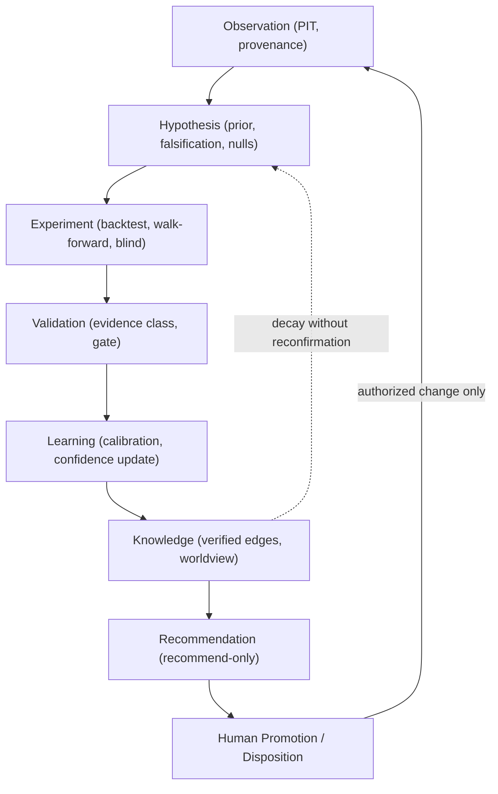

# AI-TRADER Product Constitution

> **Status:** Product Constitution — permanent product canon (product-level, non-implementation).
> **Scope:** Defines the *finished* AI-TRADER product, independent of implementation sequence.
> **Not:** a roadmap, a plan, an ADR, a specification, or a duplication of any of them.

---

## 0. Preamble

This document answers a single question:

> **When the entire Research Intelligence program is complete, what exactly must AI-TRADER be?**

It exists to evaluate future implementation, review completed work, guide architectural decisions, onboard contributors, keep executing agents aligned with the product vision, and prevent architectural drift over a horizon measured in years, not sprints.

It describes the product, never the implementation. Where the reader wants *how* and *when*, this document deliberately defers to the corpus it sits above.

### 0.1 Authority and precedence

This Constitution is subordinate to the WAIA platform and superior to the AI-TRADER technical corpus. The binding precedence order is:

```
WAIA Core Architecture
  > AI-TRADER Product Constitution   (this document)
    > AI-TRADER Master Spec v2
      > subject-owner docs (Security, Billing)
        > ratified doctrines (Market Intelligence, LD-5a Hypothesis/Evidence, Knowledge-to-Action, LD-6..LD-10)
          > ADRs (0005..0019)
            > implementation (code, comments — may lag)
```

On any conflict about *what the product is*, this document governs. On any conflict about *platform domains* (identity, tenancy, entitlements, payments, audit), [`docs/waia-core/WAIA-CORE-ARCHITECTURE.md`](docs/waia-core/WAIA-CORE-ARCHITECTURE.md) governs and this document yields.

### 0.2 What this document does not duplicate

- It does not restate the **Master Plan / Research Intelligence Program** ([`docs/ai-trader/AI-TRADER-RESEARCH-INTELLIGENCE-PROGRAM.md`](docs/ai-trader/AI-TRADER-RESEARCH-INTELLIGENCE-PROGRAM.md)) — that owns sequencing.
- It does not restate the **Master Spec** ([`docs/ai-trader/AI-TRADER-MASTER-SPEC-v2.md`](docs/ai-trader/AI-TRADER-MASTER-SPEC-v2.md)) — that owns contracts.
- It does not restate the **Vision** ([`docs/ai-trader/AI-TRADER-VISION.md`](docs/ai-trader/AI-TRADER-VISION.md)) — that owns philosophy and narrative.
- It does not restate the **ADRs** ([`docs/adr/README.md`](docs/adr/README.md)) — those own the incremental "why."

### 0.3 Activation-gating truth

AI-TRADER is architecturally real and specification-complete as a WAIA module. It is also **not yet greenlit as an unconditional engineering priority.** Governance canon holds AI-TRADER activation as a **Founders-Council-reserved allocation decision** ([`docs/waia-governance/NON-GOALS.md`](docs/waia-governance/NON-GOALS.md)), and platform sequencing makes WAIA Core Uplift a hard prerequisite ([`docs/waia-core/WAIA-CORE-ARCHITECTURE.md`](docs/waia-core/WAIA-CORE-ARCHITECTURE.md)).

This Constitution therefore describes the intended product *without* asserting that its full construction is scheduled. Defining the destination is not the same as scheduling the journey. Nothing here expands scope, alters sequencing, or authorizes work.

---

## 1. Product Identity

AI-TRADER is fundamentally an **AI Research Intelligence System whose primary output is validated knowledge, not trades.** Trading is one mechanism — the most demanding and the most honest — by which accumulated knowledge is validated against reality and then applied. Capital is the instrument through which a belief is tested and, occasionally, harvested; it is never the point.

The corollary is severe and load-bearing: **a period in which AI-TRADER places zero trades but strengthens, refutes, or calibrates its knowledge is a productive period.** A period of many profitable trades that leaves the knowledge base no more trustworthy has produced luck, not product.

### 1.1 What AI-TRADER is

- A **knowledge-first market intelligence system**: strategy is a derived, disposable artifact compiled from validated market knowledge; the source of truth is the knowledge stack, not the strategy.
- A **non-custodial** trading module: client funds remain on the client's own exchange account; AI-TRADER holds **READ + TRADE** permissions only. **WITHDRAW and TRANSFER are structurally forbidden.**
- An **engineering system, not a black box**: every recommendation and every capital action is reproducible from stored context.
- A **WAIA module**, not a standalone product: it attaches to WAIA Core for identity, tenancy, entitlements, payments, and the shared audit stream, and never redefines those domains.
- A system whose defining capability is **restraint**: it must always be able to choose *not to trade*, and correct abstention under insufficient evidence is a success, not an omission.

### 1.2 What AI-TRADER is not — and the distinctions that matter

AI-TRADER is frequently mistaken for adjacent product categories. The Constitution draws these boundaries explicitly and permanently:

- **Not an algorithmic trading system.** Algo systems optimize execution of pre-decided intent. AI-TRADER's core loop is epistemic — forming, testing, and calibrating beliefs — with execution as a downstream, heavily gated consequence.
- **Not a trading bot.** A bot runs a fixed rule set to place orders. AI-TRADER treats any given rule set as a disposable hypothesis that must continuously re-earn its right to touch capital.
- **Not a signal service.** A signal service sells opinions and externalizes all accountability. AI-TRADER internalizes accountability: every forecast is pre-registered and scored whether or not a trade follows, and predictions exist to be graded.
- **Not a portfolio optimizer.** Portfolio optimization assumes edge exists and allocates across it. AI-TRADER first *proves* edge net of costs across regimes; allocation is trivial until knowledge justifies more.
- **Not an autonomous hedge fund.** No machine self-promotes capital. Capital authority is human, single-operator, audited, and reversible.
- **Not general-purpose AI.** It is a bounded epistemic engine for markets. It does not pursue open-ended goals; the AI within it is recommend-only and fails closed.

### 1.3 The one-sentence identity

> AI-TRADER accumulates trustworthy, provenance-bearing knowledge about markets, proves that knowledge against reality under strict validation, and — only when a human authorizes it — applies a disposable slice of that knowledge to protected capital, always able to decline.

---

## 2. Mission

### 2.1 Operational mission

Detect market regimes, permit trading only when edge exceeds cost and risk, maintain a full audit trail and strategy-health view, and — where fees apply — charge only on net new realized profit above a high-water mark. The system can always choose not to trade.

### 2.2 Philosophical mission

Markets are repeating human behavior under uncertainty. AI-TRADER measures structure, not sentiment about structure. It **proves rather than predicts**: mathematics over narrative, evidence over conviction, and the discipline to discard whatever does not survive contact with reality. It adapts parameters, not core logic. Restraint is treated as a capability, not a failure state.

### 2.3 Social mission

Within the WAIA and DeepSense purpose, AI-TRADER is a **sustainability engine**, not an instrument of greed. Its long-term rationale is the redistribution of value in a world where automation displaces traditional employment — market intelligence as a foundation that can help finance and support people through that transition. This framing constrains behavior: the product optimizes for durability and trust, not for maximal extraction.

---

## 3. Product Principles

These principles must outlive every implementation, every strategy, and every model generation. They are the invariants an auditor should test any future version against.

1. **The machine researches; the human promotes.** No machine self-promotion to capital, ever.
2. **Absence of evidence is failure, never neutral.** A claim with no evidence earns neither capital nor confidence.
3. **Knowledge is the asset; strategies are consumables.** Strategies are compiled from knowledge and discarded without ceremony when they stop surviving.
4. **Conviction is non-amplifying.** No layer may increase size, confidence, or permission granted upstream. Risk may only clamp downward.
5. **Correlation is labeled, never asserted as certainty.** Causal language is reserved for causal evidence; most knowledge is explicitly correlational or conjectural.
6. **Determinism governs the capital path.** Everything between a decision and an order — validation, gate assembly, risk, execution — is deterministic and replayable. AI orchestrates process, never outcomes on the capital path.
7. **Reproducibility and provenance are first-class product properties.** If it cannot be reconstructed from stored context, it did not happen.
8. **Capital survival outranks return.** The optimization target across regimes and decades is survival of capital, auditability, and honesty — not maximal profit.
9. **Human agency is sovereign.** A human is always above the system, can always halt it, and is never subordinated to it. (Inherited from [`docs/waia-governance/WAIA-NORTH-STAR.md`](docs/waia-governance/WAIA-NORTH-STAR.md).)
10. **Platform boundaries are inviolable.** One identity, one tenancy model, one shared append-only audit stream; modules never read or write each other's tables. (Inherited from WAIA Core.)
11. **Reversible incrementalism.** Prefer changes whose rollback is obvious; prefer few durable rules over broad predictive process.

---

## 4. Functional Domains

Each domain is described at product level — what it is responsible for and why it exists — not how it is built.

### 4.1 Platform Attachment
AI-TRADER attaches to WAIA Core: it references organizations and users by foreign key, gates all functionality behind the `trader` entitlement, writes every sensitive action to the shared audit stream, and routes payer identity through Core. It never defines local identity or tenancy. The in-house fund and any partner deployment are simply organizations ("Org 0" is the first tenant).

### 4.2 Market Data and Feature Engine
Ingests market observations point-in-time, computes features with an explicit data-quality score, and guarantees backtest/live parity so that what is validated is what is run.

### 4.3 Market Intelligence and the Regime Gate
Classifies market regime and derives a trading permission and reason codes into a Market State Vector. The **Chief Decision Engine (CDE)** is this **regime/permission gate** — it decides *whether the environment is tradeable at all*. It stores every output and **does not place orders.**

> **Disambiguation (permanent):** The CDE is *not* the **Decision** doctrine layer (§4.8). "CDE / Chief Decision Engine" = regime admissibility gate. "Decision (LD-7)" = actionability layer that converts a forecast into auditable intent. These two must never be conflated in product or code.

### 4.4 Research Intelligence
The systematic validation substrate: historical market storage, sealed research datasets, backtesting with a versioned cost model, walk-forward evaluation with parameter freeze, and single-shot blind holdout. Its purpose is to convert ideas into evidence-bearing candidates or to kill them.

### 4.5 Market Knowledge Base (MKB)
A four-layer knowledge store: **Facts** (observations, bars), **Events** (observed market events), **Hypotheses** (confidence-weighted knowledge edges, correlation labeled), and **Verified Knowledge** (a read-model over repeatedly confirmed edges). It is the persistent memory of what the system believes and how strongly.

### 4.6 Market Memory
The learning loop: predictions are recorded, later resolved against outcomes, and the confidence on the relevant knowledge edges is adjusted deterministically (confirmation strengthens, rejection weakens, inconclusive decays). Predictions are single-verify and immutable once scored.

### 4.7 Strategy Lab and Strategy Lifecycle
Where disposable strategies are drafted, versioned, and moved through a lifecycle from idea to validated candidate to (upon human promotion) limited live and eventual retirement. Strategies are never the source of truth; they are hypotheses compiled from knowledge.

### 4.8 Knowledge-to-Action Chain
The layered path from belief to reality, each layer with a single responsibility:
- **Forecast** — probabilistic, pre-registered, immutable, and scored regardless of whether a trade follows. Owns *accuracy*.
- **Decision** — converts a forecast into auditable intent, including the explicit option to do nothing ("why not cash"). Owns *actionability and economics*.
- **Risk** — deterministic, fail-closed enforcement that may clamp, veto, restrict to close-only, or halt, and **never raises** size, conviction, or permission.
- **Execution** — places orders only within the Risk-granted allowance, off the platform's edge runtime.
- **Reality** — bitemporal post-execution truth: positions, fills, realized cashflows.

> **Two reconciliation senses (permanent):** *Reality reconciliation* constructs post-trade truth (what actually happened). *Risk-level enforcement reconciliation* enforces limits against that truth. These are distinct concerns and must never be merged into one.

### 4.9 Validation Gate
The mandatory boundary between paper and any live capital. No strategy — even for the in-house fund — goes live without a signed promotion record proving edge net of costs across regimes, not merely stable plumbing. Historical replay proves the pipeline; it does not prove edge. Absence of evidence is failure.

### 4.10 Operator Intelligence
A **recommend-only** AI operator that can read state, propose hypotheses and candidates, trigger deterministic evaluators, and draft gate packages. It can never promote, live-enable, trade, move funds, mutate risk or kill switches, mutate sealed evidence, score its own evidence, or bypass human attestation. On provider failure it fails closed — no recommendation.

### 4.11 Explainability and Evidence
Every recommendation and capital action carries reproducible, provenance-bearing evidence: sealed evidence documents with content digests, reason codes, and an append-only audit trail. (Expanded in §9.)

### 4.12 Risk, Kill Switches, and Safety
Layered, fail-closed risk enforcement with global, per-tenant, per-account, per-strategy, and per-instrument kill switches. Safety is monotone: it can only reduce exposure.

### 4.13 Billing and High-Water Mark
Where fees apply, they are charged only on net new **realized** profit above a high-water mark, and issuance passes through a manual reconciliation gate. Billing truth is grounded in realized closed-trade profit, never unrealized marks.

### 4.14 Administration and Observability
Cross-module operator oversight and control (see §8), plus structured logging and critical alerting as a baseline precondition for any capital activity.

### 4.15 Future domains (out of MVP scope, retained as destination)
- **World State** (§10) — a coherent, long-horizon world model. North Star only.
- **Blockchain / On-chain Intelligence** — on-chain knowledge sources. Deferred; retained as a direction, not as work.

---

## 5. Knowledge Model

Knowledge is the primary asset. This section defines what kinds of knowledge exist, how they relate, how confidence behaves, and how knowledge is verified and evolved.

### 5.1 The knowledge ladder
Knowledge is built in ascending order of trust and abstraction:

```
Source & Provenance
  -> Point-in-Time Observation
    -> Measurement / Feature
      -> Pattern
        -> Regime Knowledge
          -> Hypothesis
            -> Evidence Ledger
              -> Worldview
                -> Strategy (disposable)
                  -> Forecast
                    -> Decision Record
                      -> Calibration
```

Each rung is only as trustworthy as the provenance beneath it. Nothing enters the ladder without a source and a point-in-time context.

### 5.2 Three kinds of confidence (never one)
- **Research Confidence** — an *ordinal, human-authored* band (speculative → compelling). It is a judgment, **not** a probability, and only a human sets it.
- **Forecast Confidence** — a *machine* probability or distribution, continuously calibration-scored against outcomes.
- **Decision Confidence** — a *bounded posture* used to size intent. Not a probability.

**Non-amplifying invariant:** confidence never grows as it flows downstream. Risk may only clamp it down. No layer may launder a weak belief into a strong one.

### 5.3 Memory
Knowledge persists append-only. Beliefs are revised by appending, not overwriting. The Market Memory loop resolves predictions against reality and adjusts edge confidence deterministically; confirmation strengthens, rejection weakens, inconclusive decays. Confidence decays over time absent reconfirmation.

### 5.4 Verification
Knowledge earns trust through: **provenance** (timestamp and revision history as a precondition for being evidence), **point-in-time discipline** (values as knowable at event time, guarding against look-ahead), **null comparators** (a claim must beat always-flat, buy-and-hold, simple-trend, and random-entry baselines appropriate to its type), **forward-locked pre-registration** (parameters sealed before the evaluation window), and **single-shot blind holdout** (one immutable, sealed evaluation per candidate; re-runs are rejected).

### 5.5 Relationships and edges
Knowledge edges carry an explicit relationship type — *correlational*, *predictive*, or *causal-conjecture* — and a regime scope. Conflicting beliefs are held explicitly (A vs not-A) and never silently netted; a coherent worldview records its conflicts rather than hiding them.

### 5.6 Evolution
The system may detect its own limitations (a **Knowledge Need**) and may draft a remedy (an **Evolution Proposal**), but such proposals are **inert**: they describe, they do not act. Only human disposition actuates change. This keeps the learning loop closed but human-broken.

### 5.7 Knowledge Lifecycle
Knowledge is not merely created; it lives through a full lifecycle, and the Constitution governs every stage — not only birth.

- **Creation** — a belief enters as a hypothesis with a stated prior, provenance, and null comparators. It carries confidence but not trust.
- **Maturation** — repeated point-in-time observation and validation move a belief from conjecture toward verified knowledge; its confidence and its relationship type sharpen.
- **Reinforcement** — each confirmed prediction strengthens the relevant edges; trust compounds only through contact with reality, never through repetition of assertion.
- **Decay** — absent reconfirmation, confidence decays with time. Knowledge that stops being tested stops being trusted; staleness is a first-class signal, not an oversight.
- **Contradiction** — when new evidence opposes an existing belief, the contradiction is recorded, not suppressed (see §5.8).
- **Retirement** — a belief that reality has refuted, or that a superior belief subsumes, is retired from active use. Retirement removes influence over capital; it does not erase the record.
- **Archival** — retired and obsolete knowledge is archived with its full provenance and history intact.

**Knowledge is never silently deleted.** It either evolves, becomes obsolete, or is archived with provenance preserved. The reason a belief was once held — and the reason it was retired — must remain reconstructable forever. Deletion without record is forbidden, because it would destroy the audit trail on which all trust depends.

### 5.8 Knowledge Conflict Resolution
The system will routinely hold conflicting knowledge: two competing hypotheses, contradictory bodies of evidence, or a market whose behavior has changed beneath a previously reliable belief. The Constitution treats conflict as a normal, healthy state of an honest knowledge system — not an error to be hidden.

- **Conflicts are preserved, never netted.** Opposing beliefs (A vs not-A) are held explicitly with their respective evidence and confidence; they are never silently averaged into a false consensus.
- **Conflict is resolved only by evidence or by human disposition — never by suppression.** A conflict remains open until reality adjudicates it or a human explicitly disposes of it with recorded rationale.
- **Neither side is deleted while the conflict is live.** Both beliefs remain inspectable, and the conflict itself is a recorded object with its own provenance.
- **Recency is not authority.** A newer belief does not automatically defeat an older one; only evidence quality and calibration decide.
- **Intellectual honesty over artificial certainty.** The Constitution requires the product to prefer an openly unresolved conflict over a confident-sounding but unearned resolution. Manufacturing certainty to appear decisive is a violation of the product's purpose.

---

## 6. Research Lifecycle

Knowledge follows a complete lifecycle from raw observation to actionable recommendation. The loop is closed but deliberately broken at the point of action: only a human can actuate change to what touches capital.



- **Observation → Hypothesis:** patterns are promoted to falsifiable hypotheses with a stated prior and null comparators.
- **Hypothesis → Experiment:** deterministic evaluators test the hypothesis on sealed data.
- **Experiment → Validation:** evidence is assembled into an evidence class; the gate judges sufficiency.
- **Validation → Learning:** forecasts are scored; confidence is calibrated.
- **Learning → Knowledge:** repeatedly confirmed edges become verified knowledge.
- **Knowledge → Recommendation:** the AI operator may recommend, never act.
- **Recommendation → Human:** a human promotes, disposes, or declines. Only this rung can change capital behavior.

---

## 7. Operator Experience

The operator is a constitutional actor, not a user of a dashboard. The experience is defined by what they see, what they control, and what remains deterministically outside their moment-to-moment control.

### 7.1 What the operator sees
A read-first research surface: current market state and regime, candidate strategies and their evidence bundles, validation results, knowledge edges and their confidence, prediction/outcome history, and a **survival-first scorecard** in which correct abstention is scored positively. Evidence is always presented as inspectable, sealed documents — never opaque scores.

### 7.2 What the operator controls
- **Tenant envelope:** connect exchange, choose mode (paper/live), allocate capital, set risk profile, start/stop — never individual trades.
- **Promotion authority:** the operator alone attests edge and promotes a candidate to live, under cooling-off and explicit multi-step confirmation.
- **Kill authority:** the operator can always halt, at any granularity, immediately.

### 7.3 What remains deterministic (outside discretion)
Feature computation, regime classification, strategy evaluation, backtest/walk-forward/blind execution, regime-coverage assertions, evidence digest computation, gate assembly, promotion state transitions, risk enforcement, and order placement within allowance. The operator authorizes; the machine computes; neither overrides the other's role.

### 7.4 Authority matrix

- **Human Operator** — authors research confidence, sets policy, attests edge, promotes, and can kill. Sovereign.
- **User (tenant)** — sets their envelope (connect, mode, capital, risk, start/stop) and holds their own kill. Never selects individual trades.
- **AI Operator** — recommend-only research orchestration; never promotes, trades, or mutates state; fully audited.
- **Challenger** — advisory dissent only; it may argue against a belief but **never gates** anything.
- **Risk Engine** — may block, clamp, restrict, or kill; fail-closed; monotone downward.
- **Execution** — places orders only within the Risk-granted allowance.

### 7.5 Three firewalls
1. **Evidence / Narrative** — the research journal is narrative and can never be treated as evidence.
2. **Proposal / Action** — evolution proposals are inert until a human actuates them.
3. **Author / Approver** — the system authors; the operator approves; humans implement. No actor occupies two of these roles for the same change.

---

## 8. Administration Vision

The finished administration experience is an *operational control and inspection surface*, described here by capability rather than layout. Each center below states its purpose, responsibilities, primary information, and the operator actions it enables. (Current surfaces live under `app/(trader)/admin/`; this section describes the destination, not today's screens.)

### 8.1 Research Center
- **Purpose:** run and observe the systematic validation of ideas.
- **Responsibilities:** launch deterministic backtest / walk-forward / blind evaluations; track candidate lifecycle.
- **Primary information:** research runs, per-regime metrics, evidence digests, dataset seals.
- **Operator actions:** initiate evaluations, review evidence, advance or reject candidates.

### 8.2 Knowledge Explorer
- **Purpose:** inspect what the system believes and how strongly.
- **Responsibilities:** browse knowledge edges, relationships, regime scope, and confidence.
- **Primary information:** edges (correlational/predictive/causal-conjecture), confidence, verification status, failure cases.
- **Operator actions:** inspect provenance, flag edges for review, dispose of evolution proposals.

### 8.3 Memory Explorer
- **Purpose:** audit the learning loop over time.
- **Responsibilities:** show predictions, their outcomes, and the resulting confidence adjustments.
- **Primary information:** prediction/outcome pairs, verification results, confidence decay trajectories.
- **Operator actions:** inspect a belief's history; trace why confidence moved.

### 8.4 Strategy Laboratory
- **Purpose:** manage disposable strategies as hypotheses.
- **Responsibilities:** draft, version, and parameterize candidate strategies.
- **Primary information:** strategy versions, parameters, originating hypotheses, current lifecycle state.
- **Operator actions:** create/version candidates; retire strategies without ceremony.

### 8.5 Validation Center
- **Purpose:** judge evidence sufficiency against the validation gate.
- **Responsibilities:** aggregate the evidence class (real backtest, walk-forward with freeze, single blind, multi-regime coverage, versioned costs).
- **Primary information:** evidence bundles, regime coverage, null-comparator results, failure modes.
- **Operator actions:** accept, reject, or send back for more evidence.

### 8.6 Promotion Center
- **Purpose:** exercise capital authority under governance.
- **Responsibilities:** assemble and sign promotion records; enforce cooling-off and multi-step confirmation.
- **Primary information:** promotion record contents, attestation, FSM state, audit linkage.
- **Operator actions:** attest edge, promote to limited live, demote/revoke (reversible).

### 8.7 Market Observatory
- **Purpose:** situational awareness of current market state.
- **Responsibilities:** present regime, trading permission, reason codes, data quality.
- **Primary information:** Market State Vector, active permissions, abstention reasons.
- **Operator actions:** observe; correlate abstention with conditions.

### 8.8 Operator Recommendations
- **Purpose:** review recommend-only AI output.
- **Responsibilities:** surface proposed hypotheses, candidates, and drafted gate packages with rationale.
- **Primary information:** recommendation, rationale, suggested actions, provider confidence, audit entry.
- **Operator actions:** accept as input to human judgment; discard; never auto-apply.

### 8.9 System Health
- **Purpose:** confirm the safety and observability baseline before capital activity.
- **Responsibilities:** runtime health, alerting status, kill-switch state.
- **Primary information:** service health, critical alerts, kill-switch matrix.
- **Operator actions:** activate kill switches at any granularity; halt globally.

### 8.10 Audit Explorer
- **Purpose:** reconstruct any action from the append-only record.
- **Responsibilities:** expose the shared, tamper-evident audit stream for trader actions.
- **Primary information:** who/what/when for every sensitive action, with content digests.
- **Operator actions:** search, trace, and export for review; never mutate.

### 8.11 Billing
- **Purpose:** govern performance-fee issuance.
- **Responsibilities:** draft invoices from realized closed-trade profit above high-water mark; enforce the manual reconciliation gate.
- **Primary information:** reporting periods, HWM, realized profit, draft invoices, reconciliation status.
- **Operator actions:** verify and issue, waive (audited), or hold.

### 8.12 Tenant Management
- **Purpose:** administer organizations, users, connections, and entitlements.
- **Responsibilities:** cross-org oversight consistent with Core roles and scoped access.
- **Primary information:** tenants, accounts, exchange connections, entitlement state.
- **Operator actions:** manage entitlements and connection status within Core boundaries.

### 8.13 Configuration
- **Purpose:** manage operator-set parameters and thresholds.
- **Responsibilities:** record quantitative thresholds and cost-model versions used by deterministic evaluators.
- **Primary information:** current thresholds, cost-model versions, change history.
- **Operator actions:** adjust thresholds with audit; version cost models.

### 8.14 World Model (future)
- **Purpose:** inspect the long-horizon world state once it exists (§10).
- **Responsibilities:** present the coherent world model and its explicit conflicts.
- **Primary information:** world-state view, cross-context knowledge, conflict register.
- **Operator actions:** observe; this center remains inspection-first and out of MVP scope.

---

## 9. Explainability

Explainability is not a feature; it is a precondition for the product's right to exist. Because AI-TRADER touches real capital under human authority, **every recommendation and every capital action must remain inspectable and reproducible from stored context.**

- **Reproducibility:** any decision or recommendation can be reconstructed deterministically from the evidence, parameters, and market state stored at the time. If it cannot be replayed, it is not trusted.
- **Sealed evidence:** validation and promotion artifacts are content-addressed (digest-sealed) documents, not opaque scores; tampering is detectable.
- **Provenance everywhere:** every piece of knowledge traces to a source and a point-in-time context.
- **Reason codes:** the system records *why* it acted or abstained, in stable, inspectable codes.
- **Append-only audit:** every sensitive action writes to the shared, tamper-evident audit stream.

Inspectability is the mechanism by which operator trust *increases over time*: trust grows not because the system is persuasive, but because its reasoning is checkable. A recommendation that cannot be inspected is, by definition of this Constitution, not a valid recommendation.

---

## 10. World State

The long-term architectural destination is a **coherent world model** — a persistent, cross-market, cross-context representation of how the world relevant to markets is behaving, against which regimes, hypotheses, and forecasts are situated. This is the horizon toward which the knowledge model points.

World State is deliberately held **outside MVP scope** and is **not implementation work.** It is recorded here so that near-term decisions do not foreclose it, and it is firewalled so that its presence in this Constitution never becomes a pretext for expanding scope. When World State is eventually built, it changes what the system *knows*; it never changes who holds capital authority. Maturity in world modeling does not imply autonomy (see §12 and §14).

---

## 11. Acceptance Criteria

AI-TRADER is "complete" only when it satisfies both **functional** and **philosophical** acceptance. Functional completion without philosophical completion is a system that works but should not be trusted.

### 11.1 Functional completion
- The full knowledge chain (observation → calibration) is operational and forecasts are calibration-scored.
- Every live promotion carries a signed evidence-class record: real backtest on stored data net of a versioned cost model, walk-forward with parameter freeze, a single blind holdout, multi-regime coverage (at least one non-trending and one down regime), and no mock-only or zero-cost evidence.
- The AI operator is provably recommend-only and fails closed on error.
- Any decision, recommendation, or capital action can be deterministically replayed from stored context.
- Kill switches are fail-closed at every granularity.
- Where fees apply, they are computed only on realized closed-trade profit above the high-water mark, behind a manual reconciliation gate.
- Administration provides complete oversight and a complete, append-only audit trail.

### 11.2 Philosophical completion
The system is complete when:
- **Knowledge is more valuable than strategies** — strategies come and go while the knowledge base compounds in trustworthiness.
- **Explainability is treated as mandatory** — an unexplainable recommendation is treated as invalid, not merely undesirable.
- **Abstaining is a success** — declining to trade under insufficient evidence is recorded and scored as a correct decision.
- **Confidence is continuously calibrated** — beliefs are graded against reality and decay without reconfirmation.
- **Every recommendation is reproducible** — nothing is trusted that cannot be replayed.
- **Every piece of knowledge has provenance** — there is no orphaned belief.
- **Operator trust increases because reasoning is inspectable** — trust is earned through checkability, not fluency.

---

## 12. Product Maturity Model

Maturity measures how *trustworthy and self-aware* the product's knowledge is — not how autonomous it is. A critical, permanent constraint: **maturity does not increase autonomy.** Capital authority remains human, single-operator, audited, and reversible at every level, including the highest. The levels are implementation-agnostic and contain no packages, sequencing, or timelines; they are a yardstick for measuring the product years into the future.

### Level 0 — Deterministic Execution
- **Product capabilities:** deterministic pipeline (features → regime gate → rule-based strategies), paper and gated live execution, fail-closed kill switches.
- **Operator capabilities:** manual operation; direct control of envelope and kill.
- **Knowledge quality:** implicit, embedded in code; not independently inspectable.
- **Explainability maturity:** reason codes and audit trail present.
- **Research maturity:** manual and ad hoc.
- **Decision maturity:** rule-based signals, admissible only when the regime gate permits.

### Level 1 — Research Intelligence
- **Product capabilities:** systematic offline validation — backtest, walk-forward, single-shot blind — with versioned costs and sealed datasets.
- **Operator capabilities:** reviews evidence bundles; promotes only against an evidence class.
- **Knowledge quality:** candidate edges begin to be validated; evidence is sealed and reproducible.
- **Explainability maturity:** digest-sealed evidence documents.
- **Research maturity:** systematic and repeatable, still human-initiated.
- **Decision maturity:** promotion gated by proven edge net of costs across regimes.

### Level 2 — Knowledge Intelligence
- **Product capabilities:** four-layer Market Knowledge Base plus a live Market Memory learning loop; knowledge becomes the source of truth.
- **Operator capabilities:** explores knowledge and memory; traces how beliefs formed and changed.
- **Knowledge quality:** verified edges with calibrated, decaying confidence and explicit relationship types.
- **Explainability maturity:** full provenance chains from belief back to source.
- **Research maturity:** continuous predict → outcome → learn.
- **Decision maturity:** decisions derive from calibrated knowledge, not hand-tuned rules.

### Level 3 — Operator Intelligence
- **Product capabilities:** a recommend-only AI operator orchestrates research; adversarial challenger dissent; worldview coherence with explicit conflicts.
- **Operator capabilities:** supervises and adjudicates AI recommendations; attestation and promotion remain exclusively human.
- **Knowledge quality:** worldview-level coherence; conflicts surfaced, never netted.
- **Explainability maturity:** recommendation rationale is inspectable and audited; provider failures fail closed.
- **Research maturity:** AI proposes hypotheses and candidates (inert until human disposition).
- **Decision maturity:** forecast and decision layers active with monotone risk clamping.

### Level 4 — World Intelligence
- **Product capabilities:** a coherent, long-horizon world model contextualizes regimes and forecasts across markets and contexts.
- **Operator capabilities:** inspects the world model; capital authority is unchanged — still human, still reversible.
- **Knowledge quality:** cross-context, long-horizon knowledge with maintained provenance and calibration.
- **Explainability maturity:** decisions explainable against an explicit world model.
- **Research maturity:** the system can propose its own research agenda; proposals remain inert.
- **Decision maturity:** multi-horizon, world-contextualized decisions — still gated, still human-promoted.

> **Invariant across all levels:** the machine researches; the human promotes. Higher maturity means better knowledge and better explanations, never more unsupervised power over capital.

---

## 13. Non-Goals

Some boundaries are permanent identity constraints; others are scope decisions of the current era. The Constitution separates them so that lifting an era-bound limit never erodes a permanent one.

### 13.1 Permanent non-goals (identity)
AI-TRADER will never become:
- **High-frequency trading** or a latency-arbitrage system.
- **An AGI or general-purpose autonomous agent.**
- **An autonomous hedge fund** — no machine self-promotion to capital, ever.
- **An uncontrolled trading AI** — the AI is recommend-only and fails closed by construction.
- **A custodial service** — funds always remain on the client's exchange; WITHDRAW/TRANSFER are forbidden.
- **A signal service or black box** — accountability is internalized and everything is inspectable.
- **A self-modifying strategy generator** with authority to change its own capital behavior.

### 13.2 Era-bound non-goals (scope, may change only by governance)
Currently out of scope and not to be treated as work by this document:
- External-client live trading (prohibited by policy until regulatory clearance).
- Live trading beyond the in-house fund (Org 0) during MVP.
- Futures, margin, options; market making; cross-exchange arbitrage.
- Instruments beyond the MVP symbol set; multi-exchange in MVP.
- World State and on-chain intelligence as built systems.

---

## 14. Technical North Star

For the engineer making a decision a decade from now, this is the compass:

> **Knowledge is the product; strategies are disposable compilations of it. The capital path is deterministic and replayable end to end. Evidence is sealed and provenance is universal. The AI researches and explains; it never promotes itself to capital. Humans are sovereign over capital, always able to halt, always able to decline. The system's highest capability is restraint, and its measure of maturity is the trustworthiness of what it knows — never the breadth of what it is allowed to do unsupervised.**

Every future architectural choice should be testable against that paragraph. If a change increases what the machine may do to capital without a human, or makes reasoning less inspectable, or elevates a strategy above the knowledge it was compiled from, it is contrary to this Constitution.

---

## 15. Knowledge Quality

Because knowledge — not trades — is the primary product output (§1), the *quality* of accumulated knowledge is the primary measure of product health. This section defines quality at the level of constitutional principle, not algorithm; it says what must be measurable and honored, never how to compute it.

> **Knowledge itself is a measurable product asset.**

Knowledge quality is evaluated along enduring dimensions:

- **Calibration** — stated confidence matches realized outcomes. A belief held at 70% should be right about 70% of the time; systematic over- or under-confidence is a quality defect.
- **Stability** — knowledge that holds across time and regimes is worth more than knowledge that flickers with noise. Stability is prized, but never at the cost of ignoring genuine regime change.
- **Novelty** — knowledge that adds genuinely new, non-redundant understanding is more valuable than a restatement of what is already known.
- **Reproducibility** — a belief that cannot be re-derived from stored evidence and provenance has no quality, regardless of how plausible it sounds.
- **Evidence freshness** — knowledge supported only by stale evidence is discounted; freshness is tracked and decay is explicit (§5.7).
- **Contradiction rate** — the frequency and severity of unresolved conflicts a belief participates in (§5.8). A high contradiction rate lowers quality until evidence resolves it.
- **Confidence evolution** — the trajectory of a belief's confidence over time is itself informative; healthy knowledge shows confidence moving in response to evidence, not drifting untested.
- **Long-term trustworthiness** — the durable track record of a belief across many verification cycles and market conditions.

Two permanent principles govern quality:

1. **Low-quality knowledge must never be laundered into confidence or capital.** Poor calibration, staleness, or unresolved contradiction must reduce a belief's influence, and the reduction must be inspectable.
2. **Quality is itself a first-class, inspectable, and tracked property.** The system must be able to show not only what it believes, but how good that belief is and how its quality has changed over time.

---

## 16. Research Economy

Research is the process by which knowledge is created and validated, and **research is never free.** Every act of research consumes finite resources, and the Constitution requires the product to treat research as an economy to be spent wisely — not an infinite background process.

Research consumes:

- **Computation** — backtests, walk-forward evaluations, and blind validations are not costless.
- **Storage** — historical data, sealed datasets, evidence documents, and the append-only knowledge and audit records all accumulate.
- **Operator attention** — the scarcest and least scalable resource of all; every recommendation, evidence bundle, and conflict competes for finite human judgment.
- **Historical data** — a limited, non-renewable asset; a blind holdout, once spent, cannot be un-spent (§5.4), and data used carelessly loses its evidential value.
- **Validation resources** — the integrity budget of pre-registration, parameter freezes, and single-shot evaluations that cannot be reused without contamination.

The Constitution establishes an economic discipline:

- **Research quality should justify research cost.** Research that does not durably improve the knowledge base is an expense, not an achievement, regardless of how much activity it generates.
- **Knowledge should compound faster than research expenditure.** Over time, the trustworthiness and reach of the knowledge base should grow faster than the resources poured into producing it; a system whose costs outrun its knowledge gains is regressing.
- **Spend research where expected knowledge gain is highest, and abstain elsewhere.** Just as the product may decline to trade, it may — and should — decline to run low-yield research. Restraint applies to research as much as to capital.
- **Operator attention is protected.** Recommendations and surfaced conflicts must earn the operator's attention; flooding the operator with low-value output is a quality failure, not diligence.

---

## 17. Operator Learning

Over time, the product should make the *collaboration* between the AI and the human operator better. This is explicitly **not personalization** (the system does not reshape itself to an individual's preferences) and **not autonomous adaptation** (the system does not silently change its own behavior). It is the disciplined use of interaction history to make the system more *understandable*, so that the operator's judgment sharpens and their trust becomes better-founded.

The product supports this through inspectable, non-behavioral memory:

- **Operator interaction history** — a record of what the operator reviewed, promoted, declined, and killed, available for the operator's own reflection and audit.
- **Decision rationale history** — the recorded reasons behind operator decisions, so past judgment can inform future judgment and remain reconstructable.
- **Recommendation acceptance patterns** — visibility into which kinds of AI recommendations the operator tends to accept or reject, surfaced as insight rather than used to auto-tune the AI.
- **Learning transparency** — any use of interaction history is itself inspectable; the system never uses history to quietly alter capital behavior, thresholds, or authority.

**Operator understanding is part of product quality.** A system that is powerful but incomprehensible to its operator is, by this Constitution, a lower-quality product than one whose reasoning the operator understands deeply. The goal is a human who understands the system better every year — never a system that manages the human.

---

## 18. Success Definition

AI-TRADER has fulfilled its purpose not when it has traded profitably, but when it has become a durable, trustworthy engine of market knowledge under human authority. Success is defined by product outcomes, not implementation metrics:

- **Accumulated knowledge is more valuable than any individual strategy.** Strategies come and go; the knowledge base is the asset that endures and compounds.
- **Operator trust increases over time** — not because the system is persuasive, but because its reasoning has proven inspectable and its knowledge well-calibrated.
- **Explainability has become a competitive advantage** — the fact that every recommendation and capital action can be understood and reproduced is a strength others cannot easily match, not a compliance burden.
- **Capital protection consistently outweighs unnecessary activity** — the system reliably prefers not acting over acting on insufficient evidence, and this restraint is recognized as success.
- **Research continuously improves future decisions** — each cycle of observation, validation, and learning measurably raises the quality of what the system knows and how well it decides.

> **Intended legacy.** AI-TRADER is meant to prove that an AI system can touch real capital while remaining honest, inspectable, and subordinate to human judgment — that knowledge, patiently accumulated and rigorously validated, is a more durable foundation than any strategy or forecast. If, a decade from now, the knowledge is trusted, the reasoning is transparent, the human is still sovereign, and capital has been protected across regimes, then AI-TRADER has succeeded — whatever the profit of any single year.

---

## 19. Promotion into the WAIA Knowledge Canon

This document is intended to become a permanent constitutional document of WAIA DEV OS. Promotion is a documentation-governance act (no code, no scope change) and should, when a human elects to perform it:

- Register this file in the AI-TRADER corpus index ([`docs/ai-trader/README.md`](docs/ai-trader/README.md)) with its precedence position stated (below WAIA Core, above the Master Spec).
- Reference it in the architecture corpus table of [`AGENTS.md`](AGENTS.md) alongside WAIA Core Architecture and the Master Spec.
- Cross-link it from the governance index ([`docs/waia-governance/README.md`](docs/waia-governance/README.md)) as the product-level charter for the AI-TRADER module.
- Consider a short ADR recording the decision to elevate a *Product Constitution* document class, if this is the first of its kind in the canon.

These are recommendations for a human to enact, not actions taken by this document.

---

## 20. Constitution Amendment Policy

This Constitution defines permanent product behavior and is expected to change **exceptionally rarely.** Its stability is a feature; churn here signals either drift or immaturity elsewhere.

- **This document is permanent product canon.** It describes what AI-TRADER must be, not how or when it is built.
- **Architectural principles change rarely.** The invariants in §3, §12, §13.1, and §14 should be treated as near-immutable; changing them is a significant governance event.
- **Implementation details never belong here.** Sequencing, packages, schemas, timelines, and thresholds live in the Master Plan, Master Spec, and operator configuration — never in this document.
- **The Master Plan evolves frequently; the Constitution evolves exceptionally rarely.** A fast-moving implementation plan sitting beneath a slow-moving constitution is the intended relationship.
- **Amendments require Architect ratification.** No amendment is valid without explicit human architectural sign-off.
- **Constitutional changes that affect permanent product behavior should normally introduce a supporting ADR**, so the "why" is recorded in the incremental decision log.
- **Implementation packages must never silently redefine the Constitution.** If implementation reveals that the product *should* differ from this document, that is a STOP condition: surface the contradiction, propose the amendment, obtain ratification — never let code quietly become the new truth.
- **Distinguish era-bound scope from permanent identity.** Lifting an era-bound non-goal (§13.2) is a scope decision and does not touch identity; changing a permanent non-goal (§13.1) is a constitutional amendment of the highest order.

> The test of a good amendment: it makes the product *more* honest, *more* inspectable, and *more* protective of human capital authority. Amendments that trade any of those for capability or speed should be rejected.
