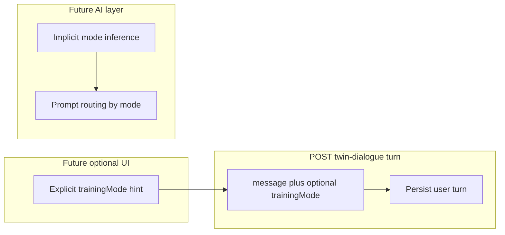

# WAIA AI-Twin — Twin dialogue training modes (v1)

**Status:** Conceptual specification for AI-Twin training. Does not modify code, APIs, or persistence in this document.

**Issue:** DEE-20 — Define v1 dialogue modes for AI-Twin training.

**Related product sources of truth:**

- [docs/product/ai-twin-user-flow.md](product/ai-twin-user-flow.md) (DEE-7) — dashboard workspaces (Twin / Diary / Society), readiness-driven unlocks.
- [docs/product/ai-twin-readiness-model.md](product/ai-twin-readiness-model.md) (DEE-22) — Signals from Twin dialogue and Diary; Evidence Types (Declaration, Corroboration, Behavioral Anchor); Target Indicator.

---

## 1. Terminology (read this first)

In WAIA product language, **Mode** usually means a **dashboard workspace** (Twin, Diary, Society). This document uses **Twin dialogue training mode** (or **dialogue training mode**) for the distinct concept defined here: the *kind of cognitive work* the user and Twin are doing inside **Twin workspace** dialogue.

Nothing in this document adds a fourth dashboard workspace or changes Diary/Society unlock rules.

---

## 2. Overview

Twin workspace dialogue is the primary channel for building the user’s AI-Twin before (and after) other surfaces unlock. **Dialogue training modes** are a small vocabulary for how each user turn is interpreted and routed in the **future** AI layer: what to prioritize in the assistant’s reply, which indicators and evidence types to emphasize when extracting **Signals**, and how to stay dialogical rather than form-like.

Modes are **pedagogical and operational** for Twin training. They are **not** readiness percentages and **do not** replace the readiness model in [ai-twin-readiness-model.md](product/ai-twin-readiness-model.md).

---

## 3. Mode catalog (v1)

v1 defines **five** dialogue training modes. Each has a stable **`trainingMode` id** (string) for future API and analytics use.

| `trainingMode` id | Short name        | Primary training contribution |
| ----------------- | ----------------- | ------------------------------ |
| `reflection`      | Reflection        | Declaration-weighted; Values, Thinking, Emotions |
| `clarification`   | Clarification     | Corroboration-weighted; precision, contradiction handling |
| `decision`        | Decision          | Goals, Behavior; tradeoffs and commitments |
| `pattern`         | Pattern detection | Behavioral Anchor–weighted; habits and triggers |
| `emotional`       | Emotional state   | Emotions indicator; affect labeling and context |

---

## 4. Definitions (per mode)

### 4.1 `reflection` — Reflection

| Field | Description |
| ----- | ----------- |
| **Purpose** | Deepen self-awareness: motives, identity, internal tension, meaning-making. |
| **User intent** | “Understand myself better” and surface what matters, often without a single factual correction. |
| **Input expected** | Open narrative, journaling-style paragraphs, philosophical or personal exploration. |
| **Response expected** | Mirror themes, ask one focused follow-up at a time, avoid interrogation; stay warm and non-judgmental. |
| **Twin training** | Produces **Declaration**-class Signals across **Values**, **Thinking**, and **Emotions** when credible. Same turn may yield multiple Signals with different target indicators (per readiness model). |
| **Memory (v1)** | No separate memory store per mode. User text is persisted as today in Twin dialogue turns; **mode** (once implemented) influences **extraction routing**, not a second copy of the message. Embeddings attach to persisted turns as implemented by persistence (see integration notes). |

### 4.2 `clarification` — Clarification

| Field | Description |
| ----- | ----------- |
| **Purpose** | Pin facts, resolve ambiguity, repair misunderstanding—**truth extraction** without turning chat into a deposition. |
| **User intent** | “Be precise” or “That’s not what I meant” or supply missing specifics. |
| **Input expected** | Corrections, clarifications, constraints (“actually…”, “to be clear…”), denials, timestamps, or concrete details. |
| **Response expected** | Short restatement of the agreed fact or boundary; optional one confirmation question; acknowledge correction explicitly. |
| **Twin training** | Emphasizes **Corroboration** and consistency with prior Signals; aligns conceptually with contradiction handling (DEE-29) when two statements conflict. |
| **Memory (v1)** | Same as §4.1: one persisted user turn; mode shapes downstream interpretation, not a duplicate row. |

### 4.3 `decision` — Decision

| Field | Description |
| ----- | ----------- |
| **Purpose** | Explore choices, tradeoffs, and consequences so the Twin learns how the user decides under uncertainty. |
| **User intent** | “What should I do?” or compare paths (career, relationship, habit change) with constraints. |
| **Input expected** | Options, worries, non-negotiables, and time horizon; may include “if / then” thinking. |
| **Response expected** | Conversational comparison (not a static form): pros/cons in the user’s vocabulary, one or two clarifying questions, no single “correct answer” unless user asks for a recommendation and product allows it later. |
| **Twin training** | Strengthens **Goals** and **Behavior**: commitments, priorities, and how the user acts (or avoids acting) after deciding. |
| **Memory (v1)** | Same persistence model as §4.1. |

### 4.4 `pattern` — Pattern detection

| Field | Description |
| ----- | ----------- |
| **Purpose** | Surface **recurring** themes: habits, triggers, situations that repeat—feeds pattern-aware Twin behavior over time. |
| **User intent** | “This keeps happening” or telling parallel stories across weeks. |
| **Input expected** | Narratives that imply repetition; user may not use the word “pattern.” |
| **Response expected** | Label a tentative pattern in neutral language; invite **one** counterexample or exception to avoid overfitting the user’s story. |
| **Twin training** | Biased toward **Behavioral Anchor** evidence for **Behavior** (and related indicators when the pattern is emotional or value-laden). |
| **Memory (v1)** | Same persistence; longitudinal patterning is an **engine** concern (out of scope for this doc’s implementation). |

### 4.5 `emotional` — Emotional state

| Field | Description |
| ----- | ----------- |
| **Purpose** | Name and situate affect: intensity, triggers, and regulation context—**narrow** so it does not subsume all of `reflection`. |
| **User intent** | “How I feel” in the foreground, not only reflective essay. |
| **Input expected** | Feeling-forward messages; bodily or situational cues; short emotional bursts or sustained mood description. |
| **Response expected** | Validate tone without cliché; probe context (“what triggered this”) lightly; do not diagnose or medicalize. |
| **Twin training** | Targets **Emotions** indicator progression; may combine with Declaration when user names new emotional facts about themselves. |
| **Memory (v1)** | Same as §4.1. |

**Overlap note:** Many real messages blend reflection and emotion. The future AI layer may assign **primary** vs **secondary** `trainingMode` internally; v1 only requires that the five IDs remain exhaustive enough for product discussion and routing design.

---

## 5. Selection and switching

### 5.1 Default: implicit selection

**v1 assumes implicit selection:** the Twin (future LLM + policy layer) infers the dialogue training mode from the **current user message** and a **short recent context window** (e.g. last few turns). No user action is required.

### 5.2 Optional explicit hint (non-normative for current MVP)

A later UX may expose an optional **composer hint** (e.g. chip or menu) that suggests a `trainingMode` for the next message. That hint is **advisory**: the server or model may still override it for safety or coherence. **DEE-20 does not specify UI.**

### 5.3 Mid-session switching

**Switching is allowed.** A single session may move from `reflection` to `clarification` to `decision` as the user’s intent shifts. Dialogue training mode is best thought of as **per user turn** (or per assistant planning step), **not** a lock-in session mode.

---

## 6. Minimal interface contract (forward-looking)

Today’s Twin dialogue submission is `POST /api/dashboard/twin-dialogue/turn` with a JSON body that includes **`message`** and optional **`idempotencyKey`**. This is **documentation only** until implemented elsewhere.

**Proposed optional field** (same JSON object, additive):

```ts
// Forward-looking — not implemented by DEE-20
trainingMode?:
  | "reflection"
  | "clarification"
  | "decision"
  | "pattern"
  | "emotional";
```

**Semantics:**

- **Omitted:** implicit selection only (once the AI layer exists).
- **Present:** explicit hint for routing/analytics; **must-ignore** if the server does not yet implement validation or storage (clients and proxies must not assume server persistence of this field until a dedicated issue ships).

Unknown values should be rejected or ignored per future API design; out of scope here.

---

## 7. Integration notes (current codebase)

| Topic | Today | After future implementation |
| ----- | ----- | ---------------------------- |
| **Endpoint** | [app/api/dashboard/twin-dialogue/turn/route.ts](../app/api/dashboard/twin-dialogue/turn/route.ts) persists the user message and returns a stub assistant reply. | Same route may accept optional `trainingMode` for logging and prompt routing. |
| **Client** | [lib/dashboard/submit-twin-dialogue-turn-client.ts](../lib/dashboard/submit-twin-dialogue-turn-client.ts) sends `message` and `idempotencyKey`. | Add optional `trainingMode` when product requires it. |
| **Persistence** | Twin dialogue turns stored with content and embeddings per existing persistence (e.g. loader layer). | Storing `trainingMode` per turn may require a migration or JSON-sidecar—**explicitly a future backend issue**, not part of DEE-20. |
| **Readiness** | Signals derived from dialogue per DEE-22; aggregation and gates unchanged. | Modes influence **which** evidence to extract first, not replace formulas. |



---

## 8. Usage examples (illustrative only)

These are **not** prompts or copy-deck text. They show user messages and the **kind** of Twin reply a mode suggests.

**`reflection` — user:** “I’m not sure why I keep choosing the harder path when an easier one is right there.”  
**Twin shape:** Mirror the tension; ask what “harder” costs them emotionally or in identity.

**`clarification` — user:** “When I said I travel a lot, I meant monthly for work, not vacation.”  
**Twin shape:** Restate the corrected fact; confirm scope (work trips, monthly).

**`decision` — user:** “I can stay stable in my role or take the startup offer—both have real downsides.”  
**Twin shape:** Surface tradeoffs in their words; ask one clarifying constraint (timeline, risk tolerance).

**`pattern` — user:** “Third time this year I burned out right after a big launch.”  
**Twin shape:** Name the post-launch crash pattern neutrally; ask for one counterexample (“was there a launch that went differently?”).

**`emotional` — user:** “I’m drained before the week even starts lately.”  
**Twin shape:** Acknowledge drain; lightly ask what “lately” correlates with (sleep, workload, people).

---

## 9. Constraints and non-goals (v1)

- **No** change to readiness math, thresholds, or indicator definitions (DEE-22 remains authoritative).
- **No** new dashboard workspace; Twin / Diary / Society semantics unchanged (DEE-7).
- **No** implementation of full dialogue engine, LLM prompts, or scoring in this document.
- **No** new API routes, database schema migrations, or dependencies required by DEE-20.
- **No** replacement of [Diary](product/ai-twin-user-flow.md) as the preferred behavioral memory channel when unlocked; dialogue modes apply to **Twin** conversation only in this spec (Diary entries may be covered by a separate taxonomy later).

---

## 10. Open questions (for follow-up issues)

1. **Primary + secondary mode:** Should the AI attach a secondary `trainingMode` when messages are mixed-type, or only a single label?
2. **Explicit UI priority:** Is composer-level mode selection P1 after the Twin replies with real model content, or deferred until usage data exists?
3. **Persistence:** Should `trainingMode` be stored on `twin_dialogue_turns` vs. derived-only in analytics—depends on privacy and retention policies.
4. **Alignment with DEE-23 / psychological contract:** Ensure mode definitions do not contradict clinical boundaries when that contract is updated.

---

## 11. Revision history

| Version | Date       | Notes |
| ------- | ---------- | ----- |
| v1      | 2026-05-05 | Initial DEE-20 definition: five modes, implicit default, optional future `trainingMode` field. |
