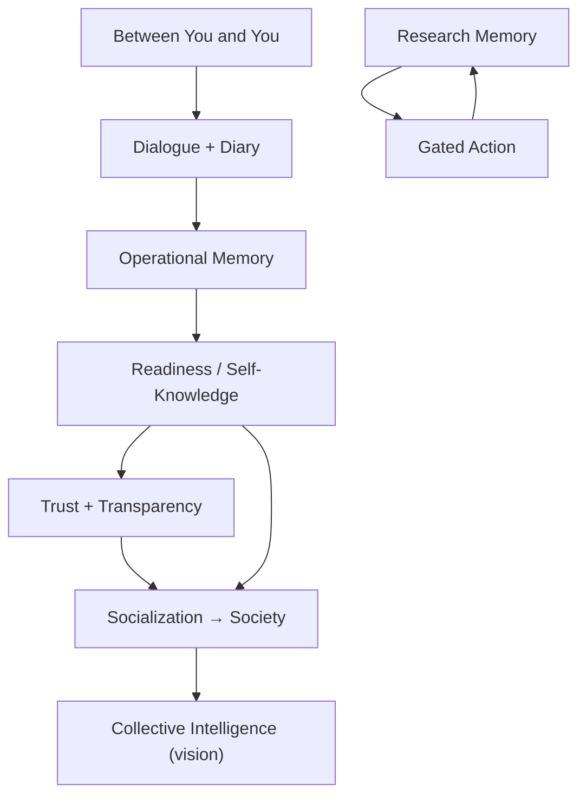
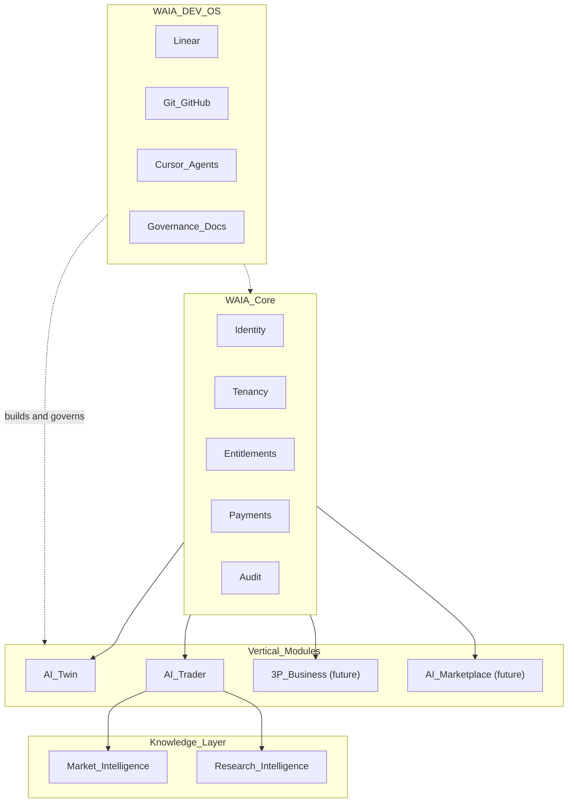
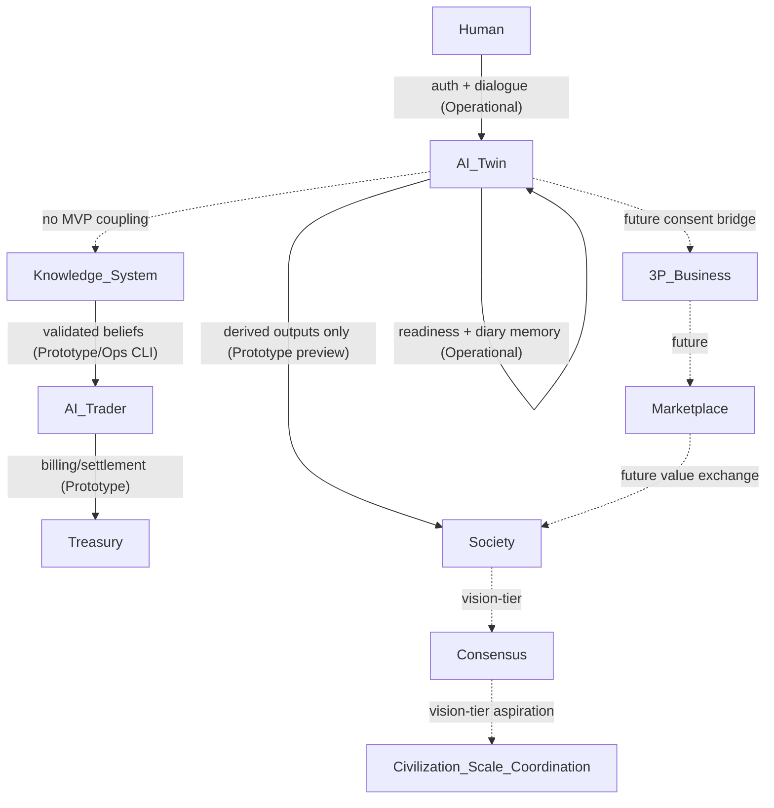
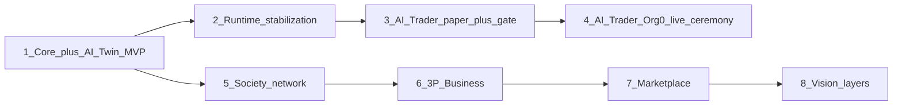
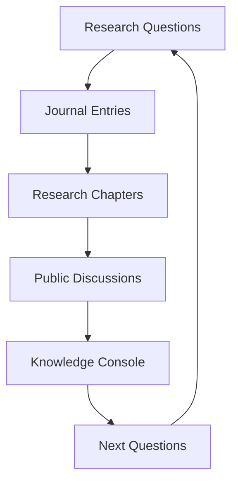
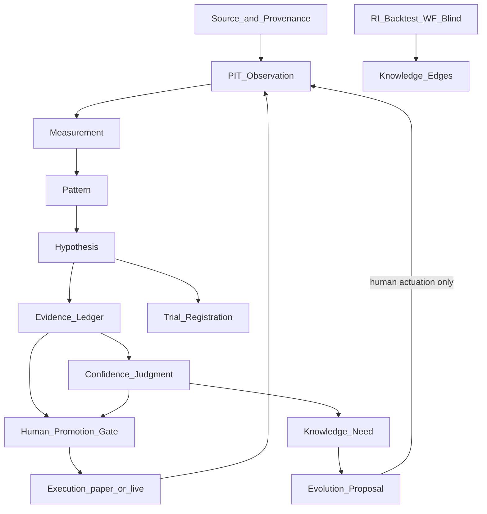

<!--
Status: CANONICAL REFERENCE (orientation + architecture synthesis)
Version: 1.0
Date: 2026-07-03
Authority: Human Architect–maintained. Subordinate to binding tiers on conflict — see §0.
-->

# WAIA Canonical Architecture Specification

## 0. Document status and authority

This document is the **first canonical architecture synthesis** of the WAIA project. It describes WAIA as it exists today and its long-term direction, grounded in repository documentation, architecture decisions, implementation history, and current code.

**Purpose:** Single reference from which the public WAIA page, module pages, documentation, investor materials, and future implementation planning can be derived.

**When guidance conflicts**, follow the recovery order in [`AGENTS.md`](../AGENTS.md):

1. Product specs (`docs/product/**`)
2. Governance + ADRs (`docs/waia-governance/**`, `docs/adr/**`)
3. Migration trackers (`docs/migrations/**`)
4. Active Linear issue
5. Code/comments (may lag)
6. **This document** — clarifies intent and topology; does not override binding specs

**Writing discipline applied throughout:**

- No invented features. Vision-tier ideas are labeled *Future direction (vision-tier)*.
- Maturity labels on every module: `Concept → Research → Prototype → Operational → Production`.
- Where this document's vocabulary differs from in-repo canon, an **In canon:** note maps the term.

**Human-first invariant (binding):**

> Humans define meaning. Agents may comment. Humans decide.

---

## Terminology reconciliation

| Term in this document | In canon (repository) | Current maturity |
|----------------------|------------------------|------------------|
| Between You and You | Tagline: `Между тобой. И тобой.` | **Operational** (landing canon) |
| Research Questions | **Research Question** (open interrogative) — distinct from **Hypothesis** and **Knowledge Need**; see [Strategy Evolution Loop](ai-trader/AI-TRADER-STRATEGY-EVOLUTION-LOOP.md) | **Research** (architectural canon v1.0) |
| Journal Entries | **Research Journal** (firewalled narrative; never evidence) | **Concept** (doctrine only) |
| Research Chapters | **Research Program** — MI Research Program Proposal + trial `researchProgram` field | **Research** (canon in Strategy Evolution Loop) |
| Knowledge Console | **Knowledge Explorer** / **Research Terminal** | **Concept** (partial read-models exist) |
| Research Workspace | **Research Center** / `/research` route (backtest run list) | **Prototype** |
| Deep Sense Coding | **SENSE CODING** (one paragraph in `GETTING-STARTED.md`); binding doctrine is **WAIA DEV OS** | DEV OS: **Operational**; SENSE CODING roadmap file: **absent** |
| WAIA Social | **Society mode** + **Socialization** action | **Prototype** (preview); social network: **Concept** |
| 3P / Business Twin | **3P (Business)** — Provision, Promotion, Production | **Concept** (+ landing placeholders) |
| Marketplace | **AI-Marketplace** | **Concept** (+ landing placeholders) |
| Treasury | Platform **Treasury** (Open Heart Economy) in governance backlog; AI-Trader has **billing/settlement** only | Treasury: **Concept**; Trader billing: **Prototype** |
| Consensus / DAO | **Agent consensus formation** — VISION-tier, engineering prohibited; **Founders Council** — human governance | Consensus module: **Concept (vision)**; Founders Council: **Operational (governance)** |
| Collective intelligence | Named in Agent Society Roadmap; **not engineering law** per North Star §6 | **Research (vision-tier)** |

---

## Maturity label legend

| Label | Meaning |
|-------|---------|
| **Concept** | Named in strategy or landing; no product spec or module implementation |
| **Research** | Ratified doctrine or vision documents; no production runtime |
| **Prototype** | Working code, tests, or partial UI; not a complete product surface |
| **Operational** | Runnable in dev/staging/production paths with operator evidence |
| **Production** | Deployed and serving intended end-user or operator purpose at scale |

Labels describe **current state**, not aspiration. A module may be architecturally complete in docs while remaining **Prototype** in runtime posture.

---

# 1. Executive Summary

## What is WAIA?

WAIA is a **human-centered modular AI ecosystem** whose first production module is **AI-Twin v1**: a system where a person creates a structured digital reflection of themselves through dialogue, diary, readiness progression, and eventual socialization.

WAIA is not a single AI product. It is a **living architecture** for human self-knowledge, digital reflection, trusted AI companionship, and—over a long horizon—coordination across personal, social, business, financial, and marketplace layers. Technology exists to support this purpose. **The human remains the center.**

The brand anchor expresses this inward-first orientation:

> **Между тобой. И тобой.** — *Between you and you.*

> WAIA соединяет тебя с тобой, чтобы ты был согласован с другими.

*(Canonical landing copy: [`docs/product/waia-landing.md`](product/waia-landing.md).)*

At platform level, WAIA attaches vertical modules to a shared **WAIA Core** (identity, tenancy, entitlements, payments, audit). Modules do not read each other's domain tables. Current modules in code or canon: **AI-Twin**, **AI-Trader**, with **3P (Business)** and **AI-Marketplace** named but deferred.

## Why does WAIA exist?

WAIA exists to help people **return to clarity**, **honest self-alignment**, **meaningful coordination** (consensual and legible, never coercive), and **grounded understanding** in environments of rising complexity—through tools that respect human agency rather than substituting for it.

The product North Star for AI-Twin v1:

> **Increase alignment over time** between a person's stated values, observed behavior, growing self-awareness, and long-term life trajectory—as modeled and refined through Twin dialogue, Diary, and governed product surfaces.

*( [`docs/product/WAIA-V1-MVP-SPEC.md`](product/WAIA-V1-MVP-SPEC.md) )*

## What problem does it solve?

Modern AI products optimize for engagement, fluency, and task completion. They rarely build **durable models of a specific person**, preserve **privacy boundaries between reflection and public presence**, or treat **abstention and refusal** as success.

WAIA addresses:

1. **Self-knowledge gap** — People lack structured, honest mirrors for values, behavior, thinking, emotions, interests, and goals.
2. **Alignment gap** — Personal intent, observed behavior, and social coordination often diverge without a governed progression path.
3. **Trust gap** — AI systems substitute judgment, obscure memory, and optimize opaquely.
4. **Modularity gap** — Personal, business, financial, and marketplace intelligence need shared identity and audit without unsafe coupling.

## Why is WAIA fundamentally different?

| Typical AI product | WAIA |
|--------------------|------|
| General assistant for tasks | **Personal digital reflection** built through dialogue |
| Engagement optimization | **Readiness progression** with explicit unlock gates |
| Opaque memory | **Operational memory** (Twin/Diary) vs **research memory** (Market Intelligence) with provenance |
| Autonomous action by default | **Human authority** at promotion, socialization, and capital boundaries |
| Single app | **Modular ecosystem** on shared Core; modules isolated by design |
| Content generation | **Research and validation** before action (especially in AI-Trader) |

WAIA explicitly rejects: coercion, inevitability rhetoric, "system knows best" oracle posture, agent supremacy, and civilization-scale prescription as product charter. Depth and long-horizon thinking are welcome; messianic framing is not.

*( [`docs/waia-governance/WAIA-NORTH-STAR.md`](waia-governance/WAIA-NORTH-STAR.md) §3, §6 )*

---

# 2. Core Philosophy

## Between You and You

WAIA begins **inward**. Before coordination with others, systems, or markets, a person must be able to see themselves clearly. The tagline *Between you and you* is not marketing—it is architectural: the first module (AI-Twin) builds a digital reflection **of** the user **for** the user, under their authority.

The closing landing narrative states the sequence:

> Сначала ты согласован с собой, затем с другими, затем с системой. WAIA выстраивает эту последовательность.

*First you are aligned with yourself, then with others, then with the system.*

## Human self-knowledge

AI-Twin models six readiness dimensions—**Values, Behavior, Thinking, Emotions, Interests, Goals**—each progressing from 0% to 100%. Total Readiness aggregates these indicators and gates product surfaces (Diary at ≥60%, Socialization at 100%).

Self-knowledge is **earned through dialogue**, not extracted through forms. The Twin asks, reflects, identifies patterns, and gradually builds a structured personality model. The user may refine, restrict, or redirect Twin behavior at any time.

## Research instead of content

WAIA treats **knowledge as validated belief**, not generated content. In AI-Trader this is explicit: strategy is a disposable artifact compiled from validated market knowledge. In AI-Twin, dialogue produces **structured readiness state**, not performative chat.

The epistemic posture:

> **Knowledge before content. Understanding before optimization.**

## Operational memory vs research memory

| Kind | Role | Examples in WAIA |
|------|------|------------------|
| **Operational memory** | Drives product behavior now; auditable; user-owned | Twin dialogue turns, diary entries, readiness state, session/profile |
| **Research memory** | Records beliefs, evidence, confidence; human-broken promotion | Market Intelligence (`trader_mi_*`), Research Intelligence substrate, knowledge edges |

Operational memory serves **the person**. Research memory serves **provable knowledge**—and must never silently override human-stated intent.

## Living knowledge

Knowledge in WAIA is not static. The Constitution defines a lifecycle: creation → maturation → reinforcement → decay → contradiction → retirement → archival. **Knowledge is never silently deleted.**

In Market Intelligence, confidence decays, hypotheses face falsification, and **Knowledge Needs** (when implemented) will detect limitations the system cannot yet resolve—without auto-remediating.

## Acceptance

Readiness percentages and gated modes serve **product semantics**, not shame or surveillance. Depth is opt-in. Friction must not be recoded as moral failure. Consent and exit are first-class: the user may refuse progression without being treated as backward.

## Dialogue

Dialogue is the primary AI-Twin creation interface—not a questionnaire disguised as chat. Modes (Twin training modes per [`docs/DIALOGUE_MODES_V1.md`](DIALOGUE_MODES_V1.md)) govern how the Twin engages. Register calibration (non-interpretive presence, social presence without compulsive analysis) is architecture doctrine, not prompt decoration.

## Trust

Trust requires:

- **Transparency** — Plain accuracy over performance of care
- **Auditability** — Git, Linear, PR, migration trackers, platform audit stream
- **Privacy invariants** — Raw diary text never appears in Society feeds
- **Non-custodial finance** — AI-Trader holds READ+TRADE only; WITHDRAW/TRANSFER forbidden

## Transparency

WAIA DEV OS makes development **repeatable and auditable**: bounded tasks, explicit approval boundaries, traced decisions. Product surfaces expose readiness state honestly. AI-Trader exposes promotion records, kill switches, and settlement reconciliation to operators.

## Collective intelligence

**Future direction (vision-tier).** The Agent Society Roadmap names negotiation, consensus formation, and collective intelligence as long-range DEV OS evolution. Constitutional acceptance **compresses these to VISION ONLY**—they are not engineering or product law.

Collective intelligence in the **product** sense (Society as a network of AI-Twins exchanging derived knowledge) is an **aspiration** gated behind AI-Twin completion and Socialization—not an autonomous multi-agent council.

## How these ideas connect



The loop is **human-broken** at every promotion boundary: socialization, capital deployment, knowledge promotion, governance mutation.

---

# 3. Overall Architecture

WAIA is **one organism** with a shared spine and vertical modules—not a bundle of independent products.

## WAIA Core (horizontal platform)

**WAIA Core** owns identity, tenancy, access control, entitlements, payer/billing identity, and the platform audit stream. Every module attaches by foreign key; modules never read each other's tables.

| Domain | Owner | Maturity |
|--------|-------|----------|
| Identity (`users`, `profiles`, Supabase Auth) | Core | **Operational** |
| Tenancy (`organizations`, `organization_members`) | Core | **Operational** |
| Entitlements & subscriptions | Core | **Operational** |
| Payments & audit | Core | **Operational** |
| Module domain tables | Respective module | Varies |

*( [`docs/waia-core/WAIA-CORE-ARCHITECTURE.md`](waia-core/WAIA-CORE-ARCHITECTURE.md) )*

Principles:

1. **Identity is horizontal** — One person, one identity across `waia.life`, `trader.waia.life`, and future domains.
2. **Tenancy is horizontal** — Organization is the isolation and billing boundary.
3. **Modules are vertical** — No cross-module table access.
4. **Audit is shared** — One append-only platform audit stream.

## Vertical modules



## Runtime topology

| Layer | Technology | Notes |
|-------|------------|-------|
| Presentation | Next.js 16 App Router, React 19, Tailwind v4, shadcn/ui | RSC by default |
| API | `app/api/**` REST routes | 63+ route handlers |
| Reasoning | `lib/reasoning/`, `lib/twin-dialogue/`, `lib/trader/intelligence/` | Twin engine + trader strategies |
| Persistence | Drizzle ORM; **SQLite** (local default) + **Postgres** (production) | Split runtime per `WAIA_DB_BACKEND` |
| Auth | Supabase Auth + session cookies | Dual-path when Supabase configured |
| AI inference | AI Gateway (`lib/ai-gateway/`) | Twin dialogue completion |
| Deploy | Cloudflare Workers/Pages via OpenNext | Cron: payment watcher, market brain, paper loop |
| Execution (live trading) | Isolated execution host | Off-Cloudflare; HTX spot |

## Host topology

| Host | Module surface |
|------|----------------|
| `waia.life` | Landing, auth, AI-Twin dashboard |
| `trader.waia.life` | AI-Trader workspace, research, admin |

Cross-host isolation enforced via middleware and `lib/hosts/`.

## WAIA DEV OS (meta-layer)

DEV OS is **infrastructure for safely building WAIA**—not the product itself. It coordinates Human Architect, Cursor agents, Linear, GitHub, docs, and migration trackers into a governed execution lifecycle.

*( [`docs/waia-governance/WAIA-DEV-OS.md`](waia-governance/WAIA-DEV-OS.md) )*

---

# 4. Module Overview

Each module follows the same template: **Purpose · Problem solved · Role inside WAIA · Current implementation state · Future evolution · Interactions · Dependencies · Expected readiness**.

---

## 4.1 AI-Twin

**Purpose.** Digital reflection of a living human—a structured personality model built through dialogue and diary, scored across six readiness dimensions, progressing toward governed socialization.

**Problem solved.** People lack a durable, private, intelligent mirror for self-knowledge and alignment between stated values and observed behavior.

**Role inside WAIA.** Heart of current delivery. First module every user enters. Gates access to Diary, Socialization, and Society. Personal intelligence layer of the ecosystem.

**Current implementation state.** **Operational** (core journey) / **Prototype** (avatar, predictions tab, socialization stub).

| Surface | State |
|---------|-------|
| Landing + auth | **Operational** — `app/page.tsx`, OAuth + email/password |
| Dashboard shell + mode tabs | **Operational** — Twin, Diary, Society tabs |
| Twin dialogue | **Operational** — AI Gateway, persistence, API |
| Readiness model (6 indicators) | **Operational** — `lib/readiness/`, gating logic |
| Diary | **Operational** — entries API + workspace |
| Society | **Prototype** — private preview; no social graph |
| Socialization action | **Prototype** — stub (DEE-53) |
| Avatar | **Prototype** — placeholder only |
| Predictions / Personality tabs | **Stub** |

**How it is created.** Visitor authenticates → enters dashboard in Twin mode → engages in dialogue → readiness indicators progress → Diary unlocks at ≥60% Total Readiness → at 100%, Socialization action appears → user performs Socialization → Society unlocks.

**How it evolves.** Dialogue and diary continuously refine the Twin model. Future: semi-autonomous Twin agency in Society, drawing on derived (not raw diary) behavioral outputs, within user-shaped boundaries.

**How it differs from ordinary AI assistants.** Not task-first; builds a **persistent structured model** of one person with explicit readiness semantics, privacy invariants, and gated modes—not open-ended chat.

**Future evolution.** Realistic animated avatar generation (separate feature); deeper autonomy in Society; cross-module consent bridges (future).

**Interactions.**

| Module | Relationship |
|--------|--------------|
| WAIA Core | Identity, profile, org provisioning |
| WAIA Social/Society | Unlocks after Socialization; derived outputs only |
| AI-Trader | **No behavioral coupling in MVP** — independent domains, shared identity only |
| 3P / Marketplace | Future; Twin data may inform matching with explicit consent |
| Knowledge System | Twin operational memory separate from trader research memory |
| DEV OS | Built and governed through Linear/Git workflow |

**Dependencies.** WAIA Core identity; AI Gateway for dialogue; persistence (SQLite/Postgres); readiness model spec (DEE-22).

**Expected readiness.** **Operational** for MVP partner-preview path; **Prototype** for Society network and avatar.

---

## 4.2 WAIA Social (Society)

**Purpose.** Network of living AI-Twins for relationship building, knowledge exchange, and—at maturity—collective intelligence among user-governed digital reflections.

**Problem solved.** Once a Twin is sufficiently formed, isolation limits the value of self-knowledge; structured social presence enables coordination without sacrificing privacy.

**Role inside WAIA.** Post-Socialization product mode. Receives **derived** Twin behavior and outputs—not raw diary content.

**Current implementation state.** **Prototype** (preview UI) / **Concept** (social network).

Society v1 contract (code):

> Society v1 is a private preview: your Twin profile stays private, with no public publishing, no discovery or matching between users, no social graph, and no external sharing.

*( `lib/dashboard/twin-society-api.types.ts` )*

Privacy invariant (product canon):

> Raw diary entries must never be exposed in Society mode. Society mode may use only derived AI-Twin behavior and outputs.

*( [`docs/product/ai-twin-user-flow.md`](product/ai-twin-user-flow.md) §8 )*

**Future evolution.** Multi-user social graph, Twin activity feeds, matches, recommendations, semi-autonomous Twin interactions consistent with user values and boundaries.

**Interactions.**

| Module | Relationship |
|--------|--------------|
| AI-Twin | Source of derived presence; gated by Socialization |
| Marketplace | Future value exchange between Twins and businesses |
| Consensus | Future collective decision surfaces (vision-tier) |

**Dependencies.** AI-Twin readiness = 100%; Socialization action completed; DEE-53 (Socialization contract), DEE-55 (Society UI).

**Expected readiness.** **Prototype** now; **Operational** when social graph and publishing ship.

**In canon:** DEE-122/DEE-125 "social presence" is **Twin dialogue register** (1:1 chat tone)—not the Society network module.

---

## 4.3 3P (Business)

**Purpose.** Business layer for companies and teams built on **Provision, Promotion, Production**—organizational process automation, operational business memory, and eventually **Business Twin** / AI employee concepts.

**Problem solved.** Organizations need AI-native business process intelligence aligned with WAIA's human-centered, auditable architecture—not generic SaaS automation disconnected from personal Twin identity.

**Role inside WAIA.** Second major ecosystem layer (after personal Twin). Connects organizational intelligence to marketplace and treasury layers at maturity.

**Current implementation state.** **Concept** (+ landing **Prototype** UI).

Landing canon:

> 3P (Business) — Business layer WAIA по логике Provision, Promotion, Production. Business layer для компаний и команд. Подключается позднее.

Platform placeholders: `waiaModuleEnum` includes `"3p"`; `organizationKindEnum` includes `"business"`. No module routes, services, or product specs for Business Twin, AI employees, or operational business memory exist in repository docs.

**Future evolution.** Business Twin mirroring organizational values/processes; AI employees for Provision/Promotion/Production workflows; operational business memory feeding marketplace matching.

**Interactions.**

| Module | Relationship |
|--------|--------------|
| WAIA Core | Future org-scoped tenancy and entitlements |
| AI-Twin | Future: personal Twin may relate to Business Twin with consent |
| Marketplace | Future supply/demand from business layer |
| AI-Trader | Independent; shared Core identity only |

**Dependencies.** WAIA Core uplift completion; explicit product issue authorization (currently **deferred** per [`NON-GOALS.md`](waia-governance/NON-GOALS.md)).

**Expected readiness.** **Concept** — awaiting product promotion from deferred status.

---

## 4.4 Marketplace (AI-Marketplace)

**Purpose.** Economic and marketplace layer—need-driven recommendation and matching based on real needs rather than advertising.

**Problem solved.** Value exchange between AI-Twins and businesses should reflect **stated needs and validated fit**, not engagement-optimized ad surfaces.

**Role inside WAIA.** Connects personal and organizational intelligence to transactional value exchange.

**Current implementation state.** **Concept** (+ landing **Prototype** UI).

> AI-Marketplace — Economic and marketplace layer of the WAIA ecosystem. Marketplace layer for value exchange between AI-Twins and businesses. Connects in a later phase.

No repository documentation defines a recommendation engine, personalized offers, or matching algorithms. AI-Trader integration doc mentions **uncommitted** future touchpoints (e.g., listing validated strategies)—not product law.

**Future evolution.** Need-driven matching using Twin readiness/interests and business Provision/Promotion/Production signals; settlement through Core payment ledger.

**Interactions.**

| Module | Relationship |
|--------|--------------|
| AI-Twin | Future: needs/interests signals (consent-gated) |
| 3P | Future: business supply side |
| AI-Trader | Potential strategy/performance products (uncommitted) |
| WAIA Core | Payments, entitlements |

**Dependencies.** 3P and Society maturity; explicit product authorization.

**Expected readiness.** **Concept**.

---

## 4.5 AI-Trader

**Purpose.** Knowledge-first market intelligence module whose primary output is **validated knowledge**, not trades. Capital is the instrument by which beliefs are tested; trading is a gated, human-authorized consequence.

**Problem solved.** Markets require epistemic discipline—beliefs must be proven against reality under strict validation before touching capital.

**Role inside WAIA.** Financial intelligence and capital management module on `trader.waia.life`. Attaches to Core; independent of AI-Twin domain tables.

**One-sentence identity:**

> AI-TRADER accumulates trustworthy, provenance-bearing knowledge about markets, proves that knowledge against reality under strict validation, and — only when a human authorizes it — applies a disposable slice of that knowledge to protected capital, always able to decline.

*( [`docs/AI-TRADER-PRODUCT-CONSTITUTION.md`](AI-TRADER-PRODUCT-CONSTITUTION.md) §1.3 )*

**Current implementation state.** **Prototype** (module) / **Operational** (paper path) / **Prototype** (live path—code-complete, governance-blocked).

| Sub-component | Maturity | Notes |
|---------------|----------|-------|
| Intelligence + strategies | **Operational** | mean_reversion_v0, liquidity_sweep_reversal_v0, trend_momentum_v0 |
| Paper trading loop | **Operational** | Default proving mode; mock execution |
| Risk engine (MVP spine) | **Prototype** | Pre-trade gate, kill switches, capital limits; full LD-8 not built |
| Execution engine | **Prototype** | Mock + HTX live path coded |
| Live trading | **Prototype** | Org-0 only; HC-3.5/HC-4 not executed as of BP-10 closure |
| Strategy validation gate | **Operational** | ADR-0010; DEE-178 PASS on replay |
| Billing / HWM / settlement | **Prototype → Operational** | Invoices, settlement, reconciliation workflow |
| Settlement exception reconciliation | **Prototype → Operational** | ADR-0016 case workflow |
| Research Intelligence (CLI) | **Operational** | Backtest/walk-forward/blind on Postgres |
| Market Intelligence spine | **Prototype** | Full `trader_mi_*` schema + services + tests |
| AI Operator | **Prototype** | Recommend-only stub (ADR-0019) |
| Treasury (platform) | **Concept** | Not an AI-Trader component; billing/settlement only |

**Runtime posture today:** **Paper/mock is active.** Live capital is **not enabled in production** pending operator ceremonies (HC-3.5 production promotion attestation → HC-4 org live-enable → L4 supervised first order).

**Relationship to AI-Twins.**

> Independent domains, shared identity. AI-TWIN owns twin_profiles, dialogue, diary, readiness; AI-TRADER owns exchange/market/strategy/order/billing domains. Neither reads the other's tables. No behavioral coupling in MVP.

*( [`docs/ai-trader/AI-TRADER-INTEGRATION.md`](ai-trader/AI-TRADER-INTEGRATION.md) )*

**Future evolution.** Full LD-8/LD-9 risk and reality layers; portfolio allocation; external client live (post ADR-0009); Twin integration via Core-mediated contracts with explicit consent.

**Interactions.**

| Module | Relationship |
|--------|--------------|
| WAIA Core | Identity, org, entitlements, audit, payments |
| Knowledge System | MI + RI + KTA doctrine |
| AI-Twin | Shared identity only (MVP) |
| Marketplace | Uncommitted future listings |

**Dependencies.** Postgres production substrate; WAIA Core; HTX connector; execution host; operator governance (ADR-0011).

**Expected readiness.** **Prototype** moving toward **Operational** for Org-0 paper; **Production** for live awaits ceremony completion.

**Governance note:** AI-Trader is architecturally real with substantial code, but activation remains a **Founders-Council-reserved allocation decision**. Governance canon names AI-Twin as primary product track; AI-Trader proceeds as a parallel engineering program.

---

## 4.6 WAIA DEV OS

**Purpose.** Repeatable, auditable operating system for building WAIA—turning AI-assisted coding into governed evolution with human authority preserved.

**Problem solved.** Powerful AI coding without gates collapses coherence, accountability, and product meaning.

**Role inside WAIA.** Meta-layer that produces and governs all other modules. Not user-facing product.

**The development flow (in canon):**

| Step | In-repo equivalent |
|------|-------------------|
| Human meaning | Product specs, Architect approval, constitutional acceptance |
| Architecture | `/plan-feature`, ADRs, governance docs |
| Code | `/implement` on `dee-<NN>-<slug>` branches |
| Verification | `pnpm lint && typecheck && test && build` |
| Deployment | Human merge to `dev`; promotion to `main`; Cloudflare deploy |
| Learning | Five-memory closeout, FAILURE-PATTERNS, additive governance evolution |

**In canon:** "Deep Sense Coding" does not exist as a doctrine layer. `GETTING-STARTED.md` references **SENSE CODING** (Meaning → Structure → Tasks → Code → System → Evolution) but the referenced roadmap file is **absent**. Binding coding discipline lives in **WAIA DEV OS + AGENTS.md**.

**Self-improvement through community feedback.** **Future direction (vision-tier).** `FUTURE-GOVERNANCE-BACKLOG.md` placeholders Voice of Humanity charter (PH2-COM-01)—**not authorized**. Operational learning today: additive governance evolution (ADR-0004), five-memory planes, human-maintained failure patterns—not autonomous platform self-modification.

**Current implementation state.** **Operational.**

- Branching: `dee-<NN>-<slug>` → PR to `dev` → human merge
- Linear project WAIA as operational memory
- Risk tiers T0–T4
- Agent gates: recommend allowed; merge/governance mutation prohibited
- Constitutional acceptance v1.0/v2.0 binds agent posture

**Future evolution.** Gate B–D (advisory identity, telemetry, selective enforcement)—**not authorized**. Community feedback governance—deferred. AI-Trader Evolution Governance (inert proposals, human actuation) is module-specific, not ecosystem DEV OS.

**Interactions.** Governs delivery of all modules. Founders Council sits above Human Architect. Agents are advisory only.

**Dependencies.** GitHub, Linear MCP, Cursor IDE, CI, migration trackers.

**Expected readiness.** **Operational** for current human-governed loop.

---

## 4.7 Knowledge System

**Purpose.** Accumulate, validate, and govern knowledge with provenance—supporting research questions, evidence, confidence, and promotion to action across modules (today primarily AI-Trader).

**Problem solved.** AI systems confuse narrative with evidence, optimize fluency over truth, and promote beliefs without validation.

**Role inside WAIA.** Cross-cutting epistemic layer. Fully embodied in AI-Trader; principles apply ecosystem-wide.

**In canon:** This document's terms map to the **Market Intelligence (MI)** + **Research Intelligence (RI)** + **Knowledge-to-Action (KTA)** stack—not a separate "Knowledge System" product module.

### Sub-concepts mapped

| This document | Canon | Maturity |
|---------------|-------|----------|
| Research Questions | Research Question (Strategy Evolution Loop) | Research |
| Journal Entries | Research Journal (firewalled; never evidence) | Concept |
| Research Chapters | Research Program (Strategy Evolution Loop §4) | Research |
| Knowledge Console | Knowledge Explorer / Research Terminal | Concept |
| Knowledge Lifecycle | Constitution §5.7 + MI Architecture §5 | Concept + prototype fragments |
| Research Workspace | `/research` + Research Center | Prototype |

### MI canonical chain (belief formation)

```
Source → PIT Observation → Measurement → Pattern → Hypothesis → Evidence Ledger
  → Confidence Judgment → [Forecast → Decision → Risk → Execution]
  → Knowledge Need → Evolution Proposal → Human Research → New Observation
```

Bracketed steps are **Concept** (KTA doctrine ratified; engines not built).

### RI layer (ADR-0018)

Historical bars, sealed datasets, backtest/walk-forward/blind validation, knowledge edges, Production Knowledge Assets. **Operational via CLI** on Postgres; minimal UI at `/research`.

**Key invariant:**

> The machine researches; the human promotes.

**Current implementation state.**

| Layer | Maturity |
|-------|----------|
| MI schema + services (`trader_mi_*`) | **Prototype** |
| RI pipeline (CLI) | **Operational** |
| KTA Forecast/Decision/Worldview | **Research** (doctrine only) |
| Knowledge Explorer UI | **Concept** |
| Research Journal | **Concept** |

**Future evolution.** Unified operator knowledge product; calibration scorecard; automated pattern discovery; cross-module knowledge contracts for Twin/Business layers.

**Interactions.** Primary consumer: AI-Trader. Future: Business operational memory, Society derived-knowledge feeds (with privacy firewall).

**Dependencies.** Postgres (RI); ADR-0018, DEE-279–293 migrations; DEE-178 validation gate.

**Expected readiness.** **Prototype** (MI) / **Operational** (RI CLI) → **Production** when operator surfaces ship.

---

## 4.8 Consensus

**Purpose.** Collective decision-making, problem detection, simulation, voting, and governance at civilization scale.

**Problem solved.** At maturity, coordinated groups need legible, auditable decision mechanisms that preserve human agency.

**Role inside WAIA.** **Future direction (vision-tier)** as a product module. Not defined in repository product specs.

**What exists today instead:**

1. **Founders Council** — Apex **human** governance (Aleksey Kalinichenko, Nataly Guseva). Reserved decisions require unanimity. Human Architect acts under delegation. **Operational (governance doctrine)** — not a DAO product.

2. **Agent Society Roadmap** — Names negotiation, consensus formation, collective intelligence. **VISION ONLY** — engineering prohibited:

> No multi-agent councils, voting, negotiation, or consensus formation between agents.

*( Constitutional acceptance v1.0 Article 3.3.5 )*

3. **DAO** — Zero matches in repository docs. Not a named WAIA module.

**Current implementation state.** **Concept (vision-tier)** for product Consensus; **Operational** for human Founders Council governance.

**Future evolution.** If promoted through product issues and constitutional revision: community-weighted roadmap input (Voice of Humanity placeholder), simulation and voting surfaces—always subordinate to human apex authority unless explicitly re-chartered.

**Interactions.** Would sit above or beside modules at maturity. Today: Founders Council governs DEV OS and reserved allocation decisions.

**Dependencies.** Constitutional revision; anti-capture research; explicit non-vision authorization.

**Expected readiness.** **Concept** — not scheduled.

---

# 5. How the Modules Work Together

The mature WAIA information flow:

```
Human → AI Twin → Knowledge → Business → Marketplace → Treasury → Society → Consensus → Civilization
```

Each transition below is annotated with **current state**.



### Transition explanations

| Transition | What happens | State |
|------------|--------------|-------|
| **Human → AI Twin** | Person authenticates, enters dashboard, builds Twin through dialogue | **Operational** |
| **AI Twin → Knowledge** | Twin operational memory is separate from research memory; no automatic feed to MI today | **Not wired** (by design in MVP) |
| **Knowledge → Business** | Business would consume organizational + validated knowledge | **Future** |
| **Business → Marketplace** | Business Provision/Promotion/Production supplies marketplace | **Future** |
| **Marketplace → Treasury** | Value exchange settles through Core payments | **Future** (Core payments **Operational** for trader billing) |
| **Treasury → Society** | Economic layer enables social coordination | **Future** |
| **AI Twin → Society** | Socialization launches Twin into Society preview; derived outputs only | **Prototype** |
| **Society → Consensus** | Collective decisions among Twins/users | **Vision-tier** |
| **Consensus → Civilization** | Large-scale coordination | **Vision-tier aspiration** — not WAIA charter per North Star |

**Parallel live path (AI-Trader today):**

```
Market data → Intelligence → Risk gate → Execution (paper) → Reconciliation → Billing
                     ↑
            Research Intelligence (CLI validation)
                     ↑
            Human promotion (DEE-178 gate)
```

---

# 6. Development Roadmap

Readiness-ordered sequencing. **No dates**—dependencies only.



### Stage 1 — WAIA Core + AI-Twin MVP

**Readiness:** **Operational** (partner preview)

Deliver landing, auth, dashboard, Twin dialogue, readiness, Diary unlock, Society preview shell. Product canon: [`docs/product/WAIA-V1-MVP-SPEC.md`](product/WAIA-V1-MVP-SPEC.md).

**Why first:** All other modules assume a formed person with identity, readiness semantics, and trust boundaries.

### Stage 2 — Runtime stabilization

**Readiness:** **Operational** (in progress)

Split SQLite/Postgres rollout (DEE-64 / DEE-95* family), AI Gateway persistence, telemetry, auth waves. Enabling engineering—not product narrative.

**Why depends on Stage 1:** Product surfaces must remain reliable while persistence migrates.

### Stage 3 — AI-Trader paper + validation gate

**Readiness:** **Operational** (paper); gate **PASS** on replay

Paper loop, strategies, risk spine, promotion gate (ADR-0010), Research Intelligence CLI (ADR-0018), MI prototype schema.

**Why depends on Stage 2:** Trader is Postgres-heavy; production parity requires stabilized runtime.

### Stage 4 — AI-Trader Org-0 live ceremony

**Readiness:** **Prototype** (blocked on operator ceremonies)

Sequence: HC-3.5 (production Postgres promotion attestation) → HC-4 (org live-enable) → L4 (supervised first live order) → L5 (`dev→main` promotion).

**Why depends on Stage 3:** Live capital requires proven paper path + human-attested gate—not AHR plumbing alone.

### Stage 5 — Society network

**Readiness:** **Prototype** (preview only)

Socialization contract (DEE-53), Society feeds, discovery, matching, Twin agency bounds.

**Why depends on Stage 1:** Society requires complete Twin readiness semantics and privacy invariants.

### Stage 6 — 3P (Business)

**Readiness:** **Concept**

Provision, Promotion, Production workflows; Business Twin; operational business memory.

**Why depends on Stage 5:** Business layer builds on personal alignment and social proof patterns.

### Stage 7 — AI-Marketplace

**Readiness:** **Concept**

Need-driven matching, personalized offers, value exchange.

**Why depends on Stage 6:** Marketplace needs supply (business) and demand (Twin/society signals).

### Stage 8 — Vision layers

**Readiness:** **Concept / Research (vision-tier)**

Community self-improvement (Voice of Humanity), agent society, Consensus/DAO product surfaces, platform Treasury doctrine.

**Why last:** Constitutional acceptance explicitly prohibits engineering these until re-chartered.

---

# 7. Readiness Assessment

| Module / subsystem | Classification | Justification |
|--------------------|----------------|---------------|
| **WAIA Core (identity)** | **Operational** | Supabase auth, users, profiles, sessions in production paths |
| **WAIA Core (tenancy/entitlements)** | **Operational** | Organizations, members, entitlements, audit implemented in `lib/waia-core/` |
| **AI-Twin — landing/auth** | **Operational** | Live partner preview on `waia.life` |
| **AI-Twin — dialogue/readiness/diary** | **Operational** | End-to-end API + UI + persistence |
| **AI-Twin — avatar** | **Prototype** | Placeholder UI only |
| **AI-Twin — socialization** | **Prototype** | Stub surface; DEE-53 not complete |
| **WAIA Social / Society** | **Prototype** | Private preview; explicit v1 exclusions (no graph, no matching) |
| **Society — social network** | **Concept** | Product spec defines intent; no multi-user implementation |
| **3P / Business** | **Concept** | Landing cards + enum placeholders only |
| **AI-Marketplace** | **Concept** | Landing cards + enum placeholders only |
| **AI-Trader — intelligence/strategies** | **Operational** | Running in paper/replay with evidence |
| **AI-Trader — paper loop** | **Operational** | Default proving mode; AHR PASS |
| **AI-Trader — live trading** | **Prototype** | Code-complete; governance ceremonies not executed |
| **AI-Trader — risk engine** | **Prototype** | MVP spine; full LD-8 doctrine not implemented |
| **AI-Trader — billing/settlement** | **Prototype** | Workflow + operator drills; not all production ceremonies done |
| **Knowledge — MI spine** | **Prototype** | Schema + services + unit tests; no operator MI product |
| **Knowledge — RI pipeline** | **Operational** | CLI backtest/walk-forward/blind on Postgres |
| **Knowledge — KTA downstream** | **Research** | Ratified doctrine; Forecast/Decision engines absent |
| **Knowledge — Research Journal / Explorer** | **Concept** | Doctrine only |
| **WAIA DEV OS** | **Operational** | Binding workflow: branches, Linear, CI, governance |
| **DEV OS — community self-improvement** | **Concept** | PH2-COM-01 placeholder; not authorized |
| **Consensus (product)** | **Concept** | Vision-tier; no product spec |
| **Founders Council** | **Operational** | Binding human governance doctrine |
| **Treasury (platform)** | **Concept** | Governance backlog only |
| **Collective intelligence** | **Research** | Vision-tier reference; not product law |

---

# 8. Knowledge Relationships

## The requested loop (conceptual framing)

```
Research Questions → Journal Entries → Research Chapters → Public Discussions
  → Knowledge Console → Next Questions
```

This loop describes **how knowledge should evolve** in a mature WAIA. Below, each step is mapped to **in-repo canon** and **current maturity**.



## Canon mapping to implemented MI/RI loop

| Conceptual step | In canon | Implementation |
|-----------------|----------|----------------|
| **Research Questions** | **Research Question** — open interrogative (Strategy Evolution Loop §3.3); precedes Hypothesis and Knowledge Need | **Research** (architectural canon); runtime records **Concept** |
| **Journal Entries** | **Research Journal** — narrative that may reference but **never be** evidence | **Concept** (doctrine in MI Architecture §4) |
| **Research Chapters** | **Research Program** — long-lived container (Strategy Evolution Loop §4; MI §13.2) | **Research** (canon); `researchProgram` on trials **Prototype** |
| **Public Discussions** | Operator review surfaces; audit stream | Admin audit (**Operational**); no public knowledge forum |
| **Knowledge Console** | **Knowledge Explorer** — browse edges, confidence, provenance | **Concept**; partial read-models: `trader_knowledge_edges`, `trader_market_events` |
| **Next Questions** | **Knowledge Need** → **Evolution Proposal** → **Human Research** → new Observation | **Concept** (MI §13); human-broken loop |

## The operational knowledge loop (AI-Trader today)



### Self-improvement without auto-mutation

1. **Detection** — System records outcomes, contradictions, calibration drift (partially via market-memory edge confidence adjustment).
2. **Proposal** — Evolution proposals and Knowledge Needs are **inert records**—they describe, they do not act.
3. **Human disposition** — Only human promotion (DEE-178 gate), confidence judgment authorship, and operator ceremonies actuate change.
4. **Re-validation** — RI pipeline re-runs backtest/walk-forward/blind on sealed datasets.
5. **Artifact** — Production Knowledge Asset (PKA) serialized to evidence vault—not silent DB mutation.

> The system may detect its own limitations … but such proposals are **inert**: they describe, they do not act. Only human disposition actuates change.

*( [`docs/AI-TRADER-PRODUCT-CONSTITUTION.md`](AI-TRADER-PRODUCT-CONSTITUTION.md) §5.6 )*

---

# 9. Long-Term Vision

*Framed as aspiration. Does not assert inevitability, moral duty to adopt, or civilization stewardship as WAIA's charter.*

## The mature WAIA ecosystem

A mature WAIA is a **modular organism** where:

- Every person can maintain an **AI-Twin**—a precise, evolving digital reflection under their authority.
- Twins that choose socialization join a **Society** network exchanging **derived** knowledge, not raw private memory.
- Organizations run **3P** business intelligence—Provision, Promotion, Production—with operational memory and Business Twins.
- A **Marketplace** matches real needs to offers without advertising optimization.
- **AI-Trader** validates market knowledge against reality and applies capital only under human promotion.
- **Knowledge** flows with provenance across modules, always human-broken at promotion boundaries.
- **WAIA DEV OS** evolves through additive governance and—if someday authorized—community signals weighted against capture.
- **Human apex authority** (Founders Council → Architect → user) remains, never replaced by agent councils.

## How it improves individuals

Structured self-knowledge through dialogue and diary; alignment between values and behavior; governed path to social presence; optional financial intelligence module with non-custodial capital respect.

## How it improves organizations

Business Twins mirroring organizational process memory; AI-assisted Provision/Promotion/Production; audit trails; entitlement-gated module access.

## How it improves society

Legible coordination among Twins and businesses; need-driven marketplace rather than attention extraction; research-validated knowledge before collective action.

## How it improves civilization-scale coordination

**Future direction (vision-tier).** WAIA may contribute tools for collective sense-making—but North Star forbids prescribing how societies ought to be governed or presenting WAIA as destiny. Any civilization-scale role requires explicit constitutional promotion from VISION to binding product law.

---

# 10. Critical Unknowns

These are **open research questions**, not bugs.

### AI-Twin

1. **Avatar generation pipeline** — Placeholder only; no algorithm or architecture ratified for realistic animated avatars.
2. **Readiness validity** — Do six indicators and Total Readiness correlate with meaningful self-knowledge outcomes? No external validation study in repo.
3. **Twin autonomy bounds in Society** — How much semi-autonomous agency is safe, desirable, and user-controllable at scale?
4. **Diary → derived behavior firewall** — Can derived outputs be guaranteed non-invertible to raw diary content under adversarial analysis?

### AI-Trader

5. **Edge vs plumbing** — AHR and replay prove execution plumbing; do current strategies possess durable edge net of costs across regimes? RI-P7 campaign pending real multi-regime evidence.
6. **Full LD-8/LD-9 implementation** — Risk verdict records and bitemporal Reality layer remain doctrine ahead of code.
7. **External client live** — Regulatory posture (ADR-0009) unresolved for beyond Org-0.

### Cross-module

8. **Twin–Trader integration contracts** — What Core-mediated, consent-gated data flows are appropriate without safety bypass?
9. **Business Twin ontology** — No product spec for mapping Provision/Promotion/Production to AI employees and operational memory.
10. **Marketplace matching without manipulation** — Need-driven recommendation at scale without reverting to engagement optimization.

### Governance

11. **Community self-improvement without capture** — Voice of Humanity weighting model, anti-capture protections, and roadmap authority balance undefined.
12. **Vision-to-product promotion** — What evidentiary bar promotes Agent Society / Consensus concepts from VISION to engineering law?

### Platform

13. **SQLite/Postgres parity endgame** — Full convergence vs permanent split-backend policy for twin vs trader domains.
14. **SENSE CODING roadmap** — Referenced in GETTING-STARTED but file absent; relationship to DEV OS undecided.

---

# 11. Canonical Principles

Principles that should remain true regardless of implementation details:

1. **Human first.** Human agency is primary for meaning, boundaries, refusal, and pace.
2. **Agents comment; humans decide.** No autonomous merge, governance mutation, or capital promotion.
3. **Transparency before automation.** Plain accuracy over performance of care or authority.
4. **Knowledge before content.** Validated belief with provenance beats fluent generation.
5. **Understanding before optimization.** Epistemic discipline precedes execution and engagement.
6. **Technology serves consciousness.** Tools support self-knowledge and coordination—not substitution of judgment.
7. **Memory creates civilization.** Operational and research memory are auditable, user-respecting, never silently deleted.
8. **Research never ends.** Knowledge decays, faces contradiction, and requires re-validation.
9. **Consent-shaped autonomy.** Depth is opt-in; friction is not moral failure; exit is always valid.
10. **Modular future.** Modules attach to Core; never cross-read domain tables without explicit contracts.
11. **Non-custodial finance.** Client funds stay on exchange; READ+TRADE only.
12. **Restraint is capability.** Correct abstention—in dialogue, society, or trading—is success.
13. **Privacy by architecture.** Raw diary never in Society; derived outputs only.
14. **The machine researches; the human promotes.** Every knowledge-to-action boundary is human-broken.
15. **Additive evolution.** Governance and architecture change through explicit versioning—not silent drift.
16. **No inevitability.** WAIA does not optimize for destiny rhetoric, shame, or coercion to adopt.

---

# Sources index

## Governance and orientation

- [`AGENTS.md`](../AGENTS.md) — Agent execution contract
- [`docs/waia-governance/WAIA-NORTH-STAR.md`](waia-governance/WAIA-NORTH-STAR.md) — Ecosystem intent
- [`docs/waia-governance/WAIA-DEV-OS.md`](waia-governance/WAIA-DEV-OS.md) — DEV OS constitution
- [`docs/waia-governance/SYSTEM-MAP.md`](waia-governance/SYSTEM-MAP.md) — MVP topology
- [`docs/waia-governance/NON-GOALS.md`](waia-governance/NON-GOALS.md) — Deferred scope
- [`docs/waia-governance/GLOSSARY.md`](waia-governance/GLOSSARY.md) — Terminology
- [`docs/waia-governance/FOUNDERS-COUNCIL.md`](waia-governance/FOUNDERS-COUNCIL.md) — Apex human authority
- [`docs/waia-governance/FUTURE-GOVERNANCE-BACKLOG.md`](waia-governance/FUTURE-GOVERNANCE-BACKLOG.md) — Vision placeholders
- [`docs/waia-governance/constitutional-history/2026-05-10-constitutional-acceptance-v1.0.md`](waia-governance/constitutional-history/2026-05-10-constitutional-acceptance-v1.0.md)
- [`docs/waia-governance/constitutional-history/2026-05-10-agent-society-roadmap.md`](waia-governance/constitutional-history/2026-05-10-agent-society-roadmap.md)

## Product

- [`docs/product/WAIA-V1-MVP-SPEC.md`](product/WAIA-V1-MVP-SPEC.md)
- [`docs/product/ai-twin-user-flow.md`](product/ai-twin-user-flow.md)
- [`docs/product/waia-landing.md`](product/waia-landing.md)
- [`docs/product/ai-twin-dashboard-shell.md`](product/ai-twin-dashboard-shell.md)
- [`docs/DIALOGUE_MODES_V1.md`](DIALOGUE_MODES_V1.md)

## Platform and modules

- [`docs/waia-core/WAIA-CORE-ARCHITECTURE.md`](waia-core/WAIA-CORE-ARCHITECTURE.md)
- [`docs/AI-TRADER-PRODUCT-CONSTITUTION.md`](AI-TRADER-PRODUCT-CONSTITUTION.md)
- [`docs/ai-trader/AI-TRADER-MASTER-SPEC-v2.md`](ai-trader/AI-TRADER-MASTER-SPEC-v2.md)
- [`docs/ai-trader/AI-TRADER-INTEGRATION.md`](ai-trader/AI-TRADER-INTEGRATION.md)
- [`docs/ai-trader/AI-TRADER-RESEARCH-INTELLIGENCE-PROGRAM.md`](ai-trader/AI-TRADER-RESEARCH-INTELLIGENCE-PROGRAM.md)
- [`docs/ai-trader/AI-TRADER-KNOWLEDGE-TO-ACTION-DOCTRINE.md`](ai-trader/AI-TRADER-KNOWLEDGE-TO-ACTION-DOCTRINE.md)
- [`docs/ai-trader/AI-TRADER-MARKET-INTELLIGENCE-ARCHITECTURE.md`](ai-trader/AI-TRADER-MARKET-INTELLIGENCE-ARCHITECTURE.md)

## ADRs (selected)

- [`docs/adr/0010-strategy-validation-gate.md`](adr/0010-strategy-validation-gate.md)
- [`docs/adr/0011-single-operator-governance-model.md`](adr/0011-single-operator-governance-model.md)
- [`docs/adr/0016-settlement-exception-reconciliation.md`](adr/0016-settlement-exception-reconciliation.md)
- [`docs/adr/0017-postgres-only-trader-mvp.md`](adr/0017-postgres-only-trader-mvp.md)
- [`docs/adr/0018-research-intelligence-market-knowledge-base.md`](adr/0018-research-intelligence-market-knowledge-base.md)
- [`docs/adr/0019-ai-operator-intelligence-authority.md`](adr/0019-ai-operator-intelligence-authority.md)

## Operations status

- [`docs/ops/DEE-352-LAUNCH-READINESS-REVIEW.md`](ops/DEE-352-LAUNCH-READINESS-REVIEW.md)
- [`docs/ops/DEE-340-BP10-LAUNCH-CLOSURE-REPORT.md`](ops/DEE-340-BP10-LAUNCH-CLOSURE-REPORT.md)

## Implementation anchors (code)

- `app/` — Next.js routes (landing, dashboard, trader, admin, research)
- `lib/waia-core/` — Core platform services
- `lib/reasoning/`, `lib/readiness/`, `lib/twin-dialogue/` — AI-Twin engine
- `lib/trader/` — AI-Trader domain (~459 files)
- `lib/trader/mi/` — Market Intelligence services
- `lib/trader/research/` — Research Intelligence pipeline
- `db/schema.postgres.ts`, `db/schema.ts` — Dual persistence schemas

---

## Document history

| Version | Date | Notes |
|---------|------|-------|
| 1.0 | 2026-07-03 | Initial canonical architecture specification |
