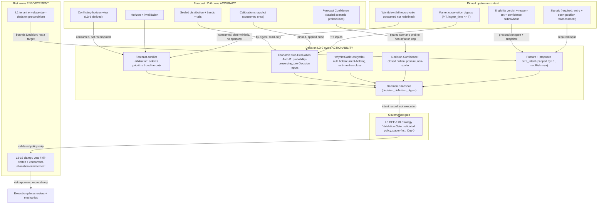

# AI-TRADER — LD-7 Decision Doctrine (First Actionability Layer)

> **Status: Ratified doctrine v1.0 (LD-7 Decision). Accepted upon merge.**
> **Ratification:** LD-7 Decision Doctrine v1.0 · **Parent:** DEE-278 · **Slice:** DEE-296.
> **Subordinate to the [AI-TRADER Market Intelligence Architecture](AI-TRADER-MARKET-INTELLIGENCE-ARCHITECTURE.md) (§11 Decision Protocol), the [Knowledge-to-Action Doctrine](AI-TRADER-KNOWLEDGE-TO-ACTION-DOCTRINE.md) (DEE-294), the [LD-6 Forecast Doctrine](AI-TRADER-FORECAST-DOCTRINE.md) (DEE-295), and the [LD-5a Hypothesis + Evidence Ledger](AI-TRADER-HYPOTHESIS-EVIDENCE-LEDGER.md); bounded by [ADR-0009](../adr/0009-regulatory-posture.md) / [ADR-0010](../adr/0010-strategy-validation-gate.md) / [ADR-0011](../adr/0011-single-operator-governance-model.md). Where this document and any of those conflict, they win.**
> **Additive only — it overrides nothing and weakens no governance gate.**
> **No engines.** LD-7 delivers the persisted Decision record, its Decision Snapshot, the append-only reassessment substrate, and derived read-models only. It adds no automation, no autonomous generation, no auto-sizing, no portfolio optimizer, and no live-trading path.

Date: 2026-06-23
Scope: How AI-TRADER converts an eligible, sealed, probabilistic Forecast (LD-6) into a Risk-bounded, economically-justified, auditable **posture toward capital** — including the posture *do nothing* — the first layer at which the system holds a claim about *what to do* rather than *what is likely*.
Authority: Subordinate to the [Market Intelligence Architecture](AI-TRADER-MARKET-INTELLIGENCE-ARCHITECTURE.md), the [Knowledge-to-Action Doctrine](AI-TRADER-KNOWLEDGE-TO-ACTION-DOCTRINE.md), the [Forecast Doctrine](AI-TRADER-FORECAST-DOCTRINE.md), the [Master Spec v2](AI-TRADER-MASTER-SPEC-v2.md), and ADR-0009/0010/0011. **Where this document and any of those conflict, they win.**
Lineage: Canonical output of the full LD-7 architecture cycle — Design → Hostile Review (RATIFIABLE AFTER REPAIRS) → Reconciliation (repairs R1–R11) → Ratification Readiness Review (RATIFIABLE WITH MINOR CLARIFICATIONS) → Final Ratification Reconciliation (clarifications F1–F4; RATIFIABLE). It records final decisions; it does not re-litigate them.

> **Reading note.** Decision is the actionability hinge of the Knowledge-to-Action chain. Everything upstream (Hypothesis → Evidence → Trial → Integrity → Confidence → Eligibility → Forecast) earns and scores belief; everything downstream (Risk → Execution) enforces and acts. Decision converts a *dated, falsifiable, machine-produced probability* into an *auditable intent* — and **never re-judges the belief, never re-forecasts, never enforces, and never executes.** The optimization target is **auditability, replay determinism, economic honesty, and capital restraint — never trading profitability** (profit is owned by neither Forecast nor Decision; restraint is scored positive).

---

## Section 1 — Purpose

LD-7 is the layer where AI-TRADER stops holding a probabilistic prediction and starts holding an **intent**. A Forecast (LD-6) answers "what is likely?" with a sealed distribution; it is scored on **accuracy** and may be perfectly calibrated yet economically useless. A Decision answers "what, if anything, should be done with capital, and why does it beat cash?" — it is the explainable record of an action, including the action *do nothing* (MI Architecture §11).

LD-7 records **facts** (the sealed posture, its economic justification, its rationale) and **derived read-models explicitly ratified here** (conflicting-horizon resolution view, eligibility-status view, decision-outcome attribution); it never predicts, never enforces limits, never places orders, and never re-judges belief. Decision **gates nothing**; every path from a Decision to capital remains bound by the DEE-178 gate, the Risk stack, and single-operator governance.

---

## Section 2 — Decision Definition

**Core statement (canonical):**

> **Decision is the Risk-bounded, economically-justified, auditable posture layer that converts an eligible Forecast into intent — including the intent to do nothing — and never predicts, executes, gates, or re-judges belief.**

**Decision IS:**
- **actionability** — it states what (if anything) to do with capital and why, not what is likely;
- **economically-justified** — it carries a structured Economic Sub-Evaluation translating the sealed distribution into monetized, cost-aware expectation (§8);
- **record-only / intent-only** — it seals an intent record; it deploys no capital (KTA §5: Decision "records intent/action");
- **auditable + replayable** — every consumed input is pinned under point-in-time visibility (§5, §13);
- **the reconciler of conflicting forecasts** — it selects among sealed forecasts (§6), informed (post-MVP) by Worldview.

**Decision is NOT:**
- **a Forecast** — it issues no new resolvable probability; if one is needed it is a new sealed Forecast (LD-6), never produced inside Decision;
- **Risk** — it owns no limits, veto, clamp, or kill-switch; it respects the envelope as a precondition, but enforcement is downstream (§11);
- **Execution** — it places no orders and specifies no venue mechanics (§12);
- **a belief re-judgment** — it never modifies, re-expresses, probabilizes, or re-scores Research Confidence (KTA §3.2);
- **a portfolio optimizer** — it is per-action; cross-position allocation is reserved and Risk-owned (§11);
- **an autonomous capital actuator** — every path to capital is bound by DEE-178 (L0), the Risk stack (L2–L6), and ADR-0011 (§14).

**Position in the chain:** `… → Eligibility → Forecast (LD-6) →` **Decision (LD-7)** `→ Risk → Execution`. Decision consumes the eligible, sealed Forecast by snapshot and is consumed by Risk as an intent record. It gates nothing.

---

## Section 3 — Ownership & Boundaries

Four layers, one clean ownership split. The "is / is-not" boundary prevents responsibility leakage.

| Layer | Owns | Consumes | May NEVER do | Hands downstream |
|---|---|---|---|---|
| **Forecast (LD-6)** | **ACCURACY** — sealed distribution, bands, tails, horizon, invalidation, Forecast Confidence, calibration, conflicting-horizon view | eligible confidence (snapshot) | encode economics; pick a winning horizon; size; decide | sealed distribution + Forecast Confidence + conflict view, **by digest** |
| **Decision (LD-7)** | **ACTIONABILITY** — arbitration (select/prioritize/decline), Economic Sub-Evaluation, posture, proposed `size_intent`, Decision Confidence, `whyNotCash` | Forecast (by digest), eligibility + reason-set + Signals, Worldview, market digests (PIT), envelope, cost/slippage/fee model versions | predict / blend / re-weight; re-calibrate; re-judge belief; clamp / veto / kill; allocate the book; carry execution mechanics | **intent record (sealed Decision Snapshot)** → L0 |
| **Risk (L0–L6)** | **ENFORCEMENT** — policy validation gate (L0/DEE-178), envelope precondition (L1), clamp/veto/kill + concurrent-allocation enforcement (L2–L6) | intent record, Signals, eligibility, data-quality | re-judge belief; raise conviction | **risk-approved request only** |
| **Execution** | **ORDERS** — order type, routing, timing, slicing, venue mechanics | risk-approved request | alter the economic posture | orders to venue |

---

## Section 4 — Decision Object Model

Mirroring LD-5a / LD-6 ("record facts; derive interpretations"): an immutable sealed record, an append-only reassessment substrate, and derived read-models.

**(a) Decision Record (immutable, sealed by `decision_definition_digest`):** the digest excludes `seq`, `id`, `createdAt`, derived views, and the reassessment substrate.

| Field group | Contents |
|---|---|
| Identity & policy | `decision_id`, `organization_id`, `decision_policy_version` (bound to DEE-178 / L0 — validated policy only), `strategy_ref`, `hypothesis_ref` |
| Consumed Forecast | `consumed_forecast_ref[]` (`forecast_definition_digest`), `calibration_snapshot_ref` (consumed once), `conflicting_horizon_view_ref` (LD-6 §5) |
| Consumed eligibility/confidence | `confidence_ordinal`, `confidence_band`, `eligibility_verdict`, `eligibility_reason_set[]`, `eligibility_as_of`, `derivation_version_id` |
| Consumed Signals | `signals_ref[]` (entry; re-consumed on open-position reassessment) |
| Consumed context | `worldview_ref`, `market_observation_digests[]` (PIT), `envelope_ref`, `cost_model_version`, `slippage_model_version`, `fee_model_version` |
| Produced facts | `posture` (`act \| abstain`, `direction`, proposed `size_intent`), `economic_sub_evaluation`, `arbitration_result`, `decision_confidence`, `why_not_cash`, `evidence_for[]`, `evidence_against[]`, `challenger_dissent` + `rebuttals[]` |
| PIT stamps | `issued_at`, `event_time`, `ingest_time` (`ingest_time >= event_time`) |

**(b) Reassessment substrate (append-only):** `entry | hold | exit` evaluation contexts consuming **current** Forecast, eligibility, and Signals state (KTA §9; LD-5a §5.3.10). A changed posture is a **new** Decision with `supersedes` lineage — never an edit.

**(c) Derived (never stored mutable):** conflicting-horizon resolution view, eligibility-status view, decision-outcome attribution, read-model projections — computed under named derivation versions.

---

## Section 5 — Decision Snapshot Contract

Decision is the auditable hinge: *given exactly these sealed inputs, the validated policy produced exactly this posture.* The Decision Snapshot honors the LD-5a consumer obligations verbatim.

- **[R1 / LD-5a §5.3.7] Mandatory snapshot atoms.** The Snapshot pins, as **distinct** fields: consumed confidence **ordinal** + **band**; eligibility **verdict**; eligibility **reason-set** over the closed taxonomy `{NO_JUDGMENT, WITHDRAWN, EXPIRED, CITATION_INVALIDATED, LIFECYCLE_BLOCKED}`; **as-of instant**; **derivation-version-id**.
- **[R1 / LD-5a §5.3.10] Signals as required input.** Signals are a **required** input — at entry and at open-position reassessment — never advisory decoration. A Signal that materially bears on a live position and reaches no consumer is a downstream doctrine violation.
- **[R1] Market observation digests.** The Snapshot pins the consumed **market observation digests** (not bare timestamps) under **`ingest_time <= T`** visibility, so revised market data cannot leak into a replay.
- **Pinned references.** `consumed_forecast_ref[]`, `calibration_snapshot_ref`, `worldview_ref`, `envelope_ref`, `decision_policy_version`, `strategy_ref`, `hypothesis_ref`, and cost/slippage/fee model versions.
- **[R11] Stored vs derived.** Stored at issuance (immutable): posture, Economic Sub-Evaluation, arbitration **result**, Decision Confidence, `whyNotCash`, and all consumed references (KTA §12.2). Derived / never stored mutable: conflicting-horizon **view**, eligibility-status view, decision-outcome attribution, read-model projections.
- **[C3] Cross-layer contract.** This satisfies the LD-5a cross-layer ratification condition that LD-7 honor snapshot obligations (§5.3.7) and consumer contracts (§5.3.10). The accountability snapshot is the **sole basis** for judging whether a past decision was justified (LD-5a §5.3.6); research-truth recomputation may never retroactively re-adjudicate it.

---

## Section 6 — Forecast-Conflict Arbitration

When two or more ACTIVE forecasts on the same subject imply conflicting directions across horizons, Decision resolves the conflict — **Forecast surfaces, Decision resolves** (LD-6 N1).

- **[R2] Selection only.** Arbitration may only **select**, **prioritize**, or **decline** among already-sealed forecasts. It must **never** blend probabilities, re-weight scenarios, synthesize a cross-horizon probability, emit a new distribution, or recompute conflict.
- **Consumes, never recomputes.** Arbitration **consumes the LD-6 §5 conflicting-horizon view** (the named, deterministic derived read-model); it never recreates conflict detection (that is Forecast-owned, LD-6 M1).
- **No hidden forecasting.** Any new resolvable probabilistic claim must be issued as a **new sealed Forecast (LD-6)**, with its own digest and window — never produced inside Decision.
- **Deterministic + pinned.** The arbitration policy is deterministic and version-pinned (`decision_policy_version`); the `arbitration_result` (selected/declined forecasts + policy) is stored; the conflict **view** is derived.

---

## Section 7 — Decision Confidence

Decision Confidence is the **Risk-bounded conviction the validated policy assigns to this action** — given the consumed distribution, the economics, Worldview conflicts, and Challenger dissent. It answers "what posture, how strongly," never "how likely."

- **[R3] Closed ordinal posture.** Decision Confidence is drawn from a **closed ordinal ladder** (proposed: `{no-action, minimal, measured, firm, maximal}` — final labels reserved, §16/OQ2). It is **non-probabilistic**, **non-scalar**, **never** emitted as a 0–1 value, and **never** calibration-scored as a probability.
- **[F1] Non-inflation anchor = sealed issuance probability.** The maximum admissible Decision Confidence band is a **pre-published, version-pinned, monotone step-function** of the **sealed issuance probability** that the Forecast assigns, at seal time, to the outcome class the Decision acts upon (read by digest — a Forecast-owned number, never a Decision-synthesized collapse of the distribution).
- **[F1] Calibration is downward-only.** Where the Decision admissibly consumes calibrated Forecast Confidence (sufficient-sample, regime-partitioned, not `INSUFFICIENT_CALIBRATION`), the **pinned calibration snapshot** (KTA §12.3 / LD-6 M3) may only **lower** the effective ceiling; it may never raise it. The effective cap is `min(sealed_issuance_anchor, calibrated_anchor_when_admissible)`.
- **Downward-only across the layer.** Worldview conflicts and Challenger dissent may only **lower** the band (KTA §3.1 non-inflation). No layer manufactures conviction absent from its inputs.
- **Distinct from the other two confidences.** Research Confidence (LD-5a) remains ordinal, human-authored, non-probabilistic, never scored; Forecast Confidence (LD-6) is probabilistic and calibration-scored; Decision Confidence is an ordinal posture. A standing governance audit guards against scalarization-into-probability drift (mirroring KTA §3.2).

---

## Section 8 — Economic Sub-Evaluation (Architecture B)

Economic actionability is **owned by Decision** (LD-6 §9). The Economic Sub-Evaluation is a **structured, separable, version-pinned sub-record inside the Decision** — Architecture B. There is **no first-class LD-6.5 Economic Evaluation layer** in MVP.

- **[R6] Probability-preserving.** It applies payoffs to the **sealed** probabilities; it may **never** re-normalize, re-weight, or re-bucket the distribution, and it reads the **sealed tails** (never re-estimates them).
- **[R6] Single-calibration.** It consumes already-calibrated Forecast Confidence via the pinned snapshot; it **never** re-calibrates.
- **[R6] Pre-Decision inputs only.** It depends only on pre-Decision inputs (forecast distribution, calibration snapshot, market state, cost/slippage/fee model versions) — **never** on Decision Confidence or the arbitration result — so it remains **liftable** to a future LD-6.5 layer without dependency inversion.
- **Typed fields.** Expected-value-after-conservative-costs (a **range**); expected downside / payoff asymmetry (from the sealed tails); a **declared opportunity benchmark** (vs cash / current holding) — **not** a computed/realized opportunity cost (hindsight-safe); transaction costs, slippage, and fee burden (each pinned by model version); capital efficiency; the cash alternative; and an **actionability status** over a closed reason-code taxonomy (e.g. `ACTIONABLE | UNECONOMIC | INSUFFICIENT_DISTRIBUTION | INSUFFICIENT_CALIBRATION | DATA_QUALITY_BLOCKED`). The taxonomy carries **no risk-veto semantics** (that is L2–L6).
- **Magnitude vs monetization.** **Forecast owns magnitude** (the `expectedMove` bands are part of the distribution); **Decision owns monetization** (EV-after-cost). This is the canonical seam.
- **Reserved promotion.** A first-class LD-6.5 (`Forecast → Economic Evaluation → Decision`) is a reserved future doctrine slice; promotion **would require KTA v1.1** and is **not** instantiated now.

---

## Section 9 — Worldview Consumption

There is exactly **one** Worldview — the MI §9 upstream, record-only, deterministic, inspectable belief-coherence object (contributing hypotheses with judged confidence + band, and an explicit `conflicts[]` list).

- **[R5] Consume-only.** LD-7 **consumes a single pinned Worldview version**; it does **not** redefine Worldview, does **not** instantiate a Decision-side Worldview, and does **not** turn it into an arbitration optimizer.
- **[F2] Worldview records uncertainty; Decision applies it.** Worldview computes no action, no selection, no sizing. Decision applies a **deterministic, pre-published, version-pinned, L0-bound rule** that translates recorded Worldview conflicts, tensions, and confidence constraints into (a) a **downward** adjustment of the Decision Confidence band and (b) a **reduction** of proposed `size_intent` (capped by Risk). The **locus of application is Decision**; the application is auditable and replayable.
- **Never an optimizer.** No arbitration, ranking, or optimization may occur inside Worldview, and Decision's application is a deterministic function — never a black box. Unresolved conflict may only **lower** conviction, never raise it.

---

## Section 10 — whyNotCash & Cash Preservation

Cash is a valid, often-correct position; restraint is scored positive (MI §3, §12). `whyNotCash` is therefore a first-class, structured, content-validated sub-record — **free-text is insufficient** (anti-checkbox, mirroring the Challenger discipline KTA §8).

- **[F3] The always-flat null is unchanged.** The MI §7.3 always-flat / cash null comparator remains **mandatory and unchanged for hypothesis validation** (required for all hypotheses; a missing required null is an automatic gate rejection). LD-7 introduces no relaxation of it.
- **[R7] Context-typed reassessment baselines.** `whyNotCash` baselines vary by reassessment context, used **only** for actionability evaluation and position reassessment (KTA §9): **entry → always-flat null** (identical to the validation null, not additive); **hold → current-holding baseline**; **exit → hold-vs-close baseline**. These additional baselines **never replace, relax, or substitute for** the mandatory always-flat validation null.
- **Disambiguation.** **cash** = flat, no exposure; **current holding** = the existing position as baseline; **no new action** = decline to open; **abstain** = a sealed do-nothing Decision; **close-only** = a Risk / data-quality-driven posture (KTA §7.1).
- **Abstain is first-class.** A `do-nothing` Decision carries the same rigor (evidence, economics, Challenger) as an `act` Decision and is replayable and scorable; restraint is scored positive (survival-first scorecard).

---

## Section 11 — Risk Separation

Decision respects Risk as a precondition; Risk is **final-but-not-sole** enforcement (KTA §5, §7).

- **[R8] Per-action.** Decision is per-action and **never** optimizes the book, reconciles cross-position allocation, solves portfolio allocation, or resolves shared-envelope races.
- **Envelope precondition vs enforcement.** **L1** is the per-decision envelope precondition (a Decision cannot propose outside eligibility + allocation + allowed markets). **L2–L6** are the binding clamp / veto / kill-switch and **concurrent-allocation enforcement** across decisions and tenants.
- **[R4] `size_intent` ownership + independence.** LD-7 owns `size_intent` as **proposed intent only**: derived from Decision's own economic logic, **reduced** by Worldview uncertainty (§9), **capped — not targeted — by the L1 envelope allocation**, and **independent of (not pinned to) the L2–L6 Risk ceiling** (KTA §7.3). A governance audit flags the `size_intent ≈ Risk max` rubber-stamp anti-pattern. Risk then clamps **downward only**. The numeric representation/scale is reserved (§16/OQ1).
- **Reserved allocation layer.** A future allocation / portfolio layer is a reserved seam (§16/OQ4), outside LD-7.

---

## Section 12 — Execution Separation

Decision owns **intent**; Execution owns **mechanics** (KTA §5: only Execution places orders).

- **[R9] Forbidden Decision fields.** A Decision Record may **never** carry: order type, limit/market instruction, routing, venue mechanics, TWAP / slicing, execution timing, or exchange-specific order mechanics.
- **Decision outputs:** posture, rationale, proposed `size_intent` (intent only), and the intent record.
- **No direct path.** There is **no direct Decision → Execution path.** Risk produces a **risk-approved request**; Execution derives the actual order mechanics. Execution must not alter the economic posture.

---

## Section 13 — Replay & PIT

- **Universal as-of.** Every consumed input applies the LD-5a `ingest_time <= T` visibility rule and pins explicit content digests + derivation versions (KTA §12.1). Replay at `T` admits only records with `ingest_time <= T` at the pinned versions — deterministic, no future leakage.
- **Decision reconstruction.** The Decision pins the consumed `forecast_definition_digest`(s), the calibration snapshot, the LD-5a §5.3.7 confidence snapshot, the Worldview version, the market observation digests, and `decision_policy_version` → deterministic.
- **Economic Sub-Evaluation reconstruction.** Pins all economic inputs by version (cost / slippage / fee model versions, calibration snapshot, consumed forecast distribution) → deterministic.
- **Accountability vs research truth.** The accountability snapshot is frozen by recording and is the sole basis for evaluating a past decision (LD-5a §5.3.6); research recompute may diverge and must never overwrite it.

---

## Section 14 — Governance Compatibility

- **L0 / DEE-178 (ADR-0010).** The Strategy Validation Gate sits **between Decision intent and runtime enforcement**: only validated policies run; `decision_policy_version` is bound to L0. The gate is unchanged; Decision is upstream and gates nothing.
- **ADR-0009 (regulatory).** No external / autonomous path; Org-0-only live; paper-first unchanged.
- **ADR-0011 (single operator).** Immutable audit, cooling-off, explicit confirmation, reversibility unchanged. The machine **may seal the intent** (a validated/operator-authored policy); promotion to capital remains human ("the machine researches; the human promotes"). **No autonomous sealing-to-capital is enabled by this doctrine.**
- **Kill-switch + paper-first.** The L4 kill-switch hierarchy and paper-first posture stand between every Decision and capital.
- **Human / machine / operator authority.** Machine produces the posture; operator authors belief (Research Confidence) and validates the policy and promotion; only Decision → L0 → Risk / DEE-178 stand between an intent and capital. Decision **gates nothing** and creates **no live path**.

---

## Section 15 — KTA Clarification (clarification only — no KTA v1.1)

This doctrine adds the following **clarification** to the Accepted Knowledge-to-Action Doctrine (DEE-294). It is **not** a KTA v1.1 amendment: it changes no chain node, no gate, no ownership boundary, and no autonomy fence.

The canonical chain is unchanged:

```
Knowledge → Hypothesis → Evidence → Trial → Integrity → Confidence → Eligibility
  → Forecast → Decision → Risk → Execution
```

Clarifications: **(1)** Decision is the actionability layer that converts an eligible Forecast into intent; its economic translation is the structured Economic Sub-Evaluation within the Decision layer (Architecture B), bounded by Risk. **(2)** "Decision + Worldview (LD-7)" (KTA §2/§13) is a **consumption-contract + record-boundary clarification** — there is one Worldview (MI §9), consumed read-only; LD-7 creates no second Worldview semantics. **(3)** A future promotion of the Economic Sub-Evaluation to a first-class layer (`Forecast → Economic Evaluation → Decision`) **would** require KTA v1.1; it is reserved, not enacted here. The chain, ownership, governance, and autonomy fences are unchanged; **KTA v1.0 is clarified, not amended.**

---

## Section 16 — Reserved Future Work (Open Questions)

Declared, not implemented — each owned by its future slice; none blocks this doctrine:

- **OQ1 — `size_intent` numeric representation** and its reconciliation with the Grandmaster `WSR − k·RD` rating (KTA Open Q#5). Ownership and the independence invariant are settled (§11); only representation is open.
- **OQ2 — Decision Confidence ladder finalization** (labels + step thresholds; policy, L0-bound). Semantics are fixed (closed, ordinal, non-scalar, downward-only).
- **OQ3 — Worldview record-delivery slice** — which slice physically delivers the Worldview record; the consume-only contract holds regardless.
- **OQ4 — Future allocation / portfolio layer** design and its L1 / L3 interface.
- **OQ5 — Decision-outcome scoring** (distinct from probabilistic Forecast calibration): method + null-comparator attribution, never conflated with Forecast calibration.
- **OQ6 — Concurrent multi-tenant / multi-exchange decision arbitration at scale** (fenced autonomy precondition, KTA §6.5).

---

## Decision Flow (canonical)



---

## Ratification Statement (v1.0 — LD-7 / DEE-296)

This document is the **ratified canonical doctrine for LD-7 — Decision**. It reflects the finalized decisions of the full LD-7 architecture cycle (Design → Hostile Review → Reconciliation → Ratification Readiness Review → Final Ratification Reconciliation, **RATIFIABLE**) and is authoritative for all future LD-7 implementation planning, issue decomposition, audit, and architect onboarding.

It incorporates reconciliation repairs **R1** (complete Decision Snapshot against LD-5a §5.3.7/§5.3.10/C3, §5), **R2** (arbitration select/prioritize/decline only, §6), **R3** (closed ordinal Decision Confidence, §7), **R4** (`size_intent` ownership + independence, §11), **R5** (Worldview consume-only, §9), **R6** (Economic Sub-Evaluation fences, §8), **R7** (context-typed `whyNotCash`, §10), **R8** (portfolio reservation, §11), **R9** (execution separation, §12), **R10** (governance fence, §14), and **R11** (stored-vs-derived discipline, §5), together with final clarifications **F1** (non-inflation anchor = sealed issuance probability, calibration downward-only, §7), **F2** (Worldview records uncertainty, Decision applies it, §9), **F3** (always-flat validation null unchanged; context-typed reassessment baselines, §10), and **F4** (KTA clarification, not amendment; KTA v1.1 not required, §15).

Decision is ratified as the **Risk-bounded, economically-justified, auditable posture layer** that converts an eligible Forecast into intent — including the intent to do nothing — and **never predicts, executes, gates, or re-judges belief.** Economic actionability is owned by Decision via a structured Economic Sub-Evaluation (**Architecture B**); there is no first-class LD-6.5 layer in MVP and its promotion is reserved. Decision **gates nothing**; every path to capital remains bound by DEE-178 (L0) and the Risk Engine under single-operator governance.

Decisions herein are final unless a future contradiction with superior canon is discovered, in which case the conflict resolves upward to the Forecast Doctrine, the Knowledge-to-Action Doctrine, the Market Intelligence Architecture, and the ADRs, and any change lands as a new ratified version of this document.

---

*End of doctrine. This document is subordinate to the Forecast Doctrine, the Knowledge-to-Action Doctrine, and the Market Intelligence Architecture, additive to the system, and introduces no new governance.*
