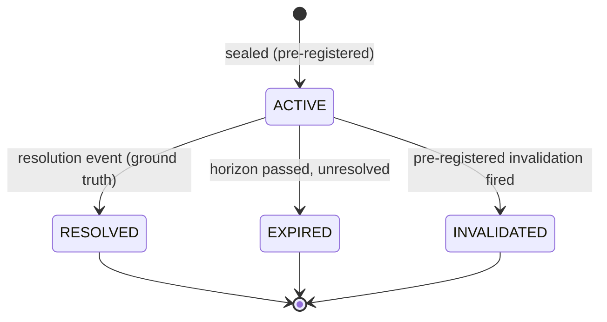

# AI-TRADER — LD-6 Forecast Doctrine (First Probabilistic Layer)

> **Status: Ratified doctrine v1.0 (LD-6 Forecast). Accepted upon merge.**
> **Ratification:** LD-6 Forecast Doctrine v1.0 · **Parent:** DEE-278 · **Slice:** DEE-295.
> **Subordinate to the [AI-TRADER Market Intelligence Architecture](AI-TRADER-MARKET-INTELLIGENCE-ARCHITECTURE.md) (§10 Forecast Protocol), the [Knowledge-to-Action Doctrine](AI-TRADER-KNOWLEDGE-TO-ACTION-DOCTRINE.md) (DEE-294), and the [LD-5a Hypothesis + Evidence Ledger](AI-TRADER-HYPOTHESIS-EVIDENCE-LEDGER.md); bounded by [ADR-0009](../adr/0009-regulatory-posture.md) / [ADR-0010](../adr/0010-strategy-validation-gate.md) / [ADR-0011](../adr/0011-single-operator-governance-model.md). Where this document and any of those conflict, they win.**
> **Additive only — it overrides nothing and weakens no governance gate.**
> **No engines.** LD-6 delivers the persisted Forecast record, its resolution substrate, and derived read-models only. It adds no automation, no autonomous generation, no auto-sizing, and no live-trading path.

Date: 2026-06-23
Scope: How AI-TRADER converts eligible, human-authored belief (LD-5a Confidence) into dated, falsifiable, machine-produced predictions (Forecasts) — the first layer at which the system holds a *probabilistic* claim about a specific resolvable outcome.
Authority: Subordinate to the [Market Intelligence Architecture](AI-TRADER-MARKET-INTELLIGENCE-ARCHITECTURE.md), the [Knowledge-to-Action Doctrine](AI-TRADER-KNOWLEDGE-TO-ACTION-DOCTRINE.md), the [Master Spec v2](AI-TRADER-MASTER-SPEC-v2.md), and ADR-0009/0010/0011. **Where this document and any of those conflict, they win.**
Lineage: Canonical output of the full LD-6 architecture cycle — Design → Forecast Hostile Review → Economic Evaluation Seam Design → Economic Evaluation Hostile Review → Reconciliation v2 → Ratification Review (RATIFIABLE WITH REQUIRED REPAIRS) → Final Ratification Reconciliation (RATIFIABLE). It records final decisions; it does not re-litigate them.

> **Reading note.** Forecast is the hinge of the Knowledge-to-Action chain. Everything upstream (Hypothesis → Evidence → Trial → Integrity → Confidence → Eligibility) is human-authored belief and immutable fact; everything downstream (Decision → Risk → Execution) is action. Forecast converts an *eligible, ordinal, human-authored* belief into a *dated, falsifiable, machine-produced probability* — and **never re-judges the belief.** The optimization target is **calibration, reproducibility, and honesty — never trading profitability** (profit is owned downstream; see §9).

---

## Section 1 — Purpose

LD-6 is the layer where AI-TRADER stops holding timeless belief and starts making **falsifiable, dated predictions**. A Hypothesis (LD-5a) is a timeless, ordinal, human-authored claim with no resolution event; it cannot be scored. A Forecast introduces a **resolvable** artifact with a defined horizon and a ground-truth resolution event — the property that *licenses* probability and calibration. Forecast exists to make predictive belief **accountable**: scored whether or not any trade follows (MI Architecture §10).

LD-6 records **facts** (the sealed prediction, the appended resolution) and **derived read-models explicitly ratified here** (lifecycle status, conflicting-horizon view); it never computes economics, never sizes, never gates capital. Calibration scoring is the survivorship-aware scoring of *resolved* forecasts; it is deferred to LD-6b and consumes LD-6 records.

---

## Section 2 — Forecast Definition

**Forecast IS:** a **pre-registered, immutable, scored, probabilistic prediction** about a specific resolvable outcome over a defined horizon, derived from *eligible* knowledge, carrying a probability distribution over a sealed scenario set, with invalidation conditions and expiry declared before its window opens.

**Forecast is:**
- **epistemic** — it states what is likely, not what to do;
- **probabilistic** — its confidence is a probability/distribution (§6);
- **immutable** — sealed by content digest; resolution is appended, never overwritten;
- **pre-registered** — the prediction (scenarios, bands, invalidation) is sealed before the resolution window;
- **scored** — by Calibration (LD-6b), on resolved forecasts only.

**Forecast is NOT:**
- **a Decision** — it carries no allocation, sizing, entry, `whyNotCash`, or act/abstain choice;
- **Risk** — it owns no limits, veto, kill-switch, or capital protection;
- **Execution** — it places no orders;
- **a Worldview** — it is a single scored prediction; it does not synthesize the coherent multi-hypothesis stance;
- **a Hypothesis** — it is a dated machine probability derived from an eligible hypothesis, never a re-expression of the ordinal human belief;
- **an economic claim** — no cost, edge, expected value, or actionability may be encoded in a Forecast (§9).

**Position in the chain:** `… → Confidence → Eligibility →` **Forecast (LD-6)** `→ Decision (LD-7) → Risk → Execution`. Forecast consumes eligible confidence by snapshot (LD-5a §5.3.7) and is consumed by Decision by snapshot. It gates nothing.

---

## Section 3 — Forecast Object Model

Three immutable concerns plus an append-only resolution substrate, mirroring LD-5a's "record facts; derive interpretations."

**(a) Forecast Record (immutable, sealed):**

| Field | Purpose |
|---|---|
| `forecast_id` | Identity. |
| `organization_id` | Tenant isolation (LD-5a §6). |
| `forecast_definition_digest` | Content digest sealing the prediction (excludes `seq`, `id`, `createdAt`, derived status, resolution). |
| `subject` | Resolvable target: instrument + pinned measurement reference. |
| `scenario_set` | Pre-registered, mutually exclusive and exhaustive outcome buckets (§4 / §5). |
| `direction_or_range` | Expected-move magnitude band(s) within the scenario set (MI Arch §10 `expectedMove`). |
| `horizon` | Resolution window (seal → resolution instant). |
| `forecast_confidence` | Probability / distribution over `scenario_set` (§6). |
| `regime_context` | Regime under which issued (free-text / LD-5c ref); calibration partition key, not a gate. |
| `evidence_citations` | FOR-basis Evidence entries (pinned by `evidenceContentDigest`). |
| `confidence_snapshot` | LD-5a §5.3.7 snapshot: consumed eligibility verdict, reason-set, as-of instant, `derivationVersionId`, cited Research Confidence judgment digest. |
| `hypothesis_version_ref` | Hypothesis definition digest the forecast rests on. |
| `invalidation_conditions` | Pre-registered statement of what voids the forecast before resolution. |
| `issued_at` / `event_time` / `ingest_time` | PIT stamps; `ingest_time >= event_time`. |
| `expires_at` | Hard expiry if unresolved by horizon end. |
| `forecast_model_version` | Named derivation/model version producing the probability (replay + calibration partition). |
| `issued_by` | Actor/process that sealed it. |

**(b) Forecast Resolution Event (appended, never overwritten):** `forecast_id`, `resolved_outcome` (realized scenario bucket), `resolution_measurement_ref` (pinned, PIT-clean), `resolution_time` / `ingest_time`, `resolution_status` (`resolved | expired_unresolved | invalidated_pre_resolution`).

**(c) Forecast Invalidation Flag (appended):** records that a pre-registered invalidation condition fired or an upstream LD-5a Invalidation Flag / Trial-Integrity event reached the forecast before resolution. Voids it for scoring as a recorded outcome class; never deletes.

**Derived (never stored):** lifecycle status (§7), conflicting-horizon view (§4), calibration (LD-6b) — computed under named derivation versions.

---

## Section 4 — Distribution Contract (un-retrofittable)

Forecast must emit a distribution rich enough that any downstream economic reasoning can compute expected-value-after-costs without re-querying Forecast. This contract is **Forecast-owned** and enforced at seal time.

- **Scenario set:** pre-registered buckets that are **mutually exclusive** and **exhaustive**, with `forecast_confidence` probabilities that **sum to 1**.
- **Magnitude bands:** each directional scenario carries an expected-move **band** (not direction-only, not a point).
- **Payoff-relevant tails:** adverse and favorable **tail** outcomes are represented explicitly; tails may not be silently merged into a central/"flat" bucket.
- **[C1] Scenario resolvability:** every scenario must carry (a) a **deterministic resolution rule** — an unambiguous predicate over a named measurement deciding, at horizon, whether the scenario occurred — and (b) a **pinned `resolution_measurement_ref`** (key + version digest, PIT-clean). A scenario set in which any bucket lacks a deterministic resolution rule + pinned measurement is **invalid and cannot be sealed.** Exhaustiveness is meaningful only over resolvable buckets: the resolution rules must partition the outcome space with no gap and no overlap.
- **[M4] Model-family compatibility:** the contract constrains **sufficiency, not model family.** A continuous predictive density satisfies it by being represented as a **discretized scenario set** meeting the granularity floor, with the discretization rule recorded in the forecast definition. Bucket-based and continuous models are both admissible; neither is privileged; the granularity floor is never weakened to accommodate a model.
- **[N3] Sealed scenario set:** the scenario set is sealed in the `forecast_definition_digest`. **Post-hoc rebucketing is forbidden;** any change to scenarios, bands, or resolution rules is a **new forecast and a new window.**
- **Forbidden information loss:** direction-only forecasts; single-point probabilities with no distribution; tails collapsed into the center; a confidence scalar emitted without its scenario mapping. Any of these → downstream economic reasoning must treat the input as `INSUFFICIENT_DISTRIBUTION` and capital reasoning is blocked (default-deny).

*Rationale: coarse historical forecasts can never be re-enriched; the distribution contract is the one un-retrofittable obligation and is locked now.*

---

## Section 5 — Horizon Doctrine

- **First-class:** every forecast declares exactly one **horizon**; horizon is a **mandatory calibration partition key** alongside `forecast_model_version` and `regime_context`. Forecasts of different horizons are never scored in the same partition.
- **Independent coexistence:** multiple horizons on the same subject are **independent, coexisting forecasts** (not a nested object); each is sealed, scored, and invalidated on its own.
- **[M1] Conflict surfacing (guaranteed):** when two or more ACTIVE forecasts on the same subject imply conflicting directions across horizons (e.g., bullish 1h, bullish 1d, bearish 1m), the conflict must be exposed by a **deterministic, named derived read-model** (the "conflicting-horizon view"), computed under a pinned derivation version. Per the LD-5a §5.3.10 consumer principle, a material conflict that reaches no consumer is a downstream doctrine violation — **surfacing is mandatory.**
- **[N1] Forecast never reconciles forecasts.** Forecast **surfaces** conflict; it does not resolve it. Reconciliation of conflicting forecasts is owned by **Decision** (informed, post-MVP, by **Worldview**). Forecast asserting a "winning" horizon is a forbidden Decision-leak.

---

## Section 6 — Forecast Confidence

Forecast Confidence is a **machine-produced probability** (or distribution over the pre-registered scenario set) attached to a single resolvable Forecast. It answers "how likely is this specific outcome over this horizon?"

**Compatibility with DEE-292 / DEE-293 (preserved, unchanged):**
- **Research Confidence** (LD-5a) remains **ordinal, human-authored, non-probabilistic, and never calibration-scored.**
- **Forecast Confidence** is **probabilistic and calibration-scored** — and that is *why it is a distinct object*, legitimate only because a Forecast has a resolution event that a hypothesis does not.
- A Forecast **consumes Research eligibility as a precondition** (it may be issued only against eligible confidence) and **cites** the Research judgment digest, but **never modifies, re-expresses, probabilizes, or re-scores** Research Confidence. The probability is the Forecast layer's own product.

**Non-inflation (KTA §3.1):** downstream conviction may not exceed the conviction implied by Forecast Confidence; Risk may only clamp downward. Forecast Confidence stops at "how likely"; it never sizes and never decides.

---

## Section 7 — Calibration Doctrine

Calibration is the **survivorship-aware proper scoring of resolved forecasts** (MI Arch §11/§16). It is a **derived read-model**, never stored mutable, and it **never gates**.

- **Proper scoring** (Brier / log-loss) rewarding calibration and sharpness; **sample size always shown.**
- **Resolved-only:** scored from forecasts with a ground-truth resolution event; EXPIRED/INVALIDATED forecasts are retained and reported (no survivorship flattery; dead hypotheses' forecasts stay in headline metrics).
- **[KTA B1] Regime-conditioned:** calibration is partitioned by `regime_context`. **Regime-aggregate calibration may not gate or adjust any forecast or decision**; it may be displayed only when explicitly labeled aggregate.
- **[KTA B2] Minimum-sample-gated:** below a minimum resolved-sample threshold per `(forecast_model_version, regime, horizon)` partition, calibration enters `INSUFFICIENT_CALIBRATION` and may not adjust or be consumed downstream.
- **[M3] Calibration snapshot pinning (DEE-294 §12.3 / A1):** where Decision consumes **calibrated** Forecast Confidence, the **calibration snapshot version** is a pinned input of the Decision record and its Economic Sub-Evaluation (§9). Replay reconstructs the exact calibration state as-of consumption; later calibration evolution cannot alter the replayed value.
- **Boundary:** calibration informs and is displayed; calibration-driven *sizing* is clamped inside Risk validated bounds and re-opens DEE-178 if exceeded (MI Arch §11.1). No bypass. The calibration scoring engine is deferred to LD-6b.

---

## Section 8 — Forecast Lifecycle

Status is **derived** from the append-only substrate (latest-event fold), never a mutable column (LD-5a §7).



- **ACTIVE** — sealed; probability frozen; consumable by Decision while eligible and not invalidated.
- **RESOLVED** — a resolution event recorded ground truth; enters calibration scoring.
- **EXPIRED** — horizon passed unresolved; retained, reported, scored as a non-resolution outcome.
- **INVALIDATED** — a pre-registered invalidation condition or upstream integrity/invalidation flag fired before resolution; retained, reported.

A forecast does not "decay" (decay is a hypothesis/confidence concept) and is never edited; a re-forecast is a **new** forecast with `supersedes` lineage (§11). Archival is a presentational read-model filter, not a lifecycle state.

---

## Section 9 — Economic Seam Resolution (Accuracy ≠ Profit)

**[N2] Accuracy is not profit.** Calibration measures whether forecasts are well-formed probabilities; it never measures whether *acting* on them makes money. A well-calibrated forecast may be uneconomic (costs, adverse asymmetry, opportunity cost), and a poorly-calibrated one may be profitable (convexity). Therefore **calibration ranking is not an actionability ranking, and a forecast may not be selected for capital allocation on calibration alone.**

**Ownership:**
- **Forecast** owns **accuracy** (the distribution and its calibration). It owns no economics.
- **Decision (LD-7)** owns **economic actionability**.

**[Architecture B] Canonical resolution:** the chain remains

```
Forecast → Decision
             └─ Economic Sub-Evaluation (structured sub-record of Decision)
```

There is **no first-class LD-6.5 Economic Evaluation layer** in MVP. The economic translation lives inside the Decision record as a structured sub-record.

**[C2] Economic Sub-Evaluation requirements.** The Decision Economic Sub-Evaluation must be **structured, separable, and version-pinned** — never free-text within the Decision rationale. It carries typed fields (expected-value-after-conservative-costs as a range, payoff asymmetry, a **declared opportunity benchmark** — not a computed opportunity cost, to avoid hindsight bias, vs cash / current holding, actionability status + a **closed reason-code taxonomy**) and **pins** its `cost_model_version`, `slippage_model_version`, the consumed `forecast_definition_digest`, and the calibration snapshot (§7 / M3). It must be **promotion-stable**: a future first-class LD-6.5 layer must be obtainable by lifting this sub-record out unchanged, without schema rework.

**Reserved future promotion:** a first-class **Economic Evaluation (LD-6.5)** layer with its own economic scorecard is a **reserved future doctrine slice**, to be considered post-MVP when live execution data and statistical power make an economic scorecard measurable. Promotion would require a **KTA v1.1** chain amendment (`Forecast → Economic Evaluation → Decision`); it is **not** instantiated now.

---

## Section 10 — Replay & PIT Requirements

- **[M2] Universal as-of + resolution PIT discipline.** Every record carries PIT stamps (`ingest_time >= event_time`); replay applies **`ingest_time <= T`** visibility (DEE-294 §12.1, LD-5a §6/§8, DEE-293). Resolution events carry their own PIT stamps so a resolution can **never** leak into a pre-resolution replay or into the issuance-time view of a forecast; `resolution_measurement_ref` must be PIT-clean. Look-ahead contamination of calibration is structurally prevented and reserved as canon.
- **Forecast reconstruction:** immutable, digest-sealed, version-pinned by `forecast_model_version` → deterministic.
- **Decision reasoning reconstruction:** Decision pins the consumed `forecast_definition_digest` and the LD-5a §5.3.7 confidence snapshot.
- **Economic Sub-Evaluation reconstruction:** pins all economic inputs by version (cost/slippage model versions, calibration snapshot, consumed forecast distribution) → deterministic.
- **Conflicting-horizon view:** a named derivation version, so "what conflicts existed as-of T" is reconstructable.
- **Research replay** may diverge from the accountability snapshot and **must never** overwrite it (LD-5a §5.3.8).

---

## Section 11 — Reserved Seams

Reserved now (declared, not implemented — LD-5a reserved-seam precedent), because each is un-retrofittable or feeds an existing obligation:

- **Forecast lineage + cascading invalidation.** A nullable `supersedes` / `derived_from_forecast` reference reserving forecast→forecast dependency, plus the rule that if a parent forecast invalidates, dependents are **flagged for re-examination** (surfaced, never auto-acted). Computation deferred.
- **Re-forecast.** A re-forecast is a **new forecast with `supersedes` lineage** (never an edit).
- **Reassessment (KTA §9).** Position reassessment consumes **current** forecast state (`entry` / `hold` / `exit` evaluation contexts). Mechanics deferred.
- **Regime-uncertainty suppression.** A reserved state that widens uncertainty / suppresses calibration during suspected regime transitions. Principle reserved; thresholds deferred.
- **Economic Evaluation promotion.** The §9 sub-record promotes to a first-class LD-6.5 layer post-MVP (KTA v1.1).
- **Resolution-data discipline.** §10 (M2) is reserved as canon against look-ahead contamination.

---

## Section 12 — Governance Compatibility

- **DEE-292 / DEE-293:** Research Confidence remains ordinal, human-authored, non-probabilistic, never scored; Forecast Confidence is the distinct probabilistic object. No conflict.
- **DEE-294 (KTA):** the chain node `Forecast → Decision` is **unchanged**; Architecture B keeps economics inside Decision. This doctrine is a **KTA clarification, not an amendment** (see §13). M3 honors KTA §12.3 verbatim.
- **ADR-0009 (regulatory):** no external/autonomous path; Org-0-only live unchanged.
- **ADR-0010 (DEE-178):** the gate sits unchanged between paper and live; Forecast is upstream and gates nothing; calibration-driven sizing is clamped and re-opens the gate (MI Arch §11.1).
- **ADR-0011 (single operator):** immutable audit, cooling-off, explicit confirmation, reversibility unchanged. The machine **may produce the forecast probability** (a validated/operator-authored model); promotion to capital remains human ("the machine researches; the human promotes"). Whether a validated machine model may seal forecasts that feed capital is bound by DEE-178; autonomous sealing is not enabled by this doctrine.
- **Human / machine / operator authority:** machine produces the probability; operator authors belief (Research Confidence) and validates the forecast model and promotion; only Decision/Risk/DEE-178 stand between a forecast and capital. Forecast **gates nothing.**

---

## Section 13 — KTA Clarification (clarification only — no KTA v1.1)

This doctrine adds the following **clarification** to the Accepted Knowledge-to-Action Doctrine (DEE-294). It is **not** a KTA v1.1 amendment: it changes no chain node, no gate, no ownership boundary, and no autonomy fence.

The canonical chain is unchanged:

```
Knowledge → Hypothesis → Evidence → Trial → Integrity → Confidence → Eligibility
  → Forecast → Decision → Risk → Execution
```

Clarification: **Decision's economic translation is recorded as a structured Economic Sub-Evaluation within the Decision layer (Architecture B); it is an input to Decision's posture (Decision Confidence) and is bounded by Risk.** Calibration consumed by Decision is pinned per KTA §12.3. A future promotion of the Economic Sub-Evaluation to a first-class layer (`Forecast → Economic Evaluation → Decision`) **would** require KTA v1.1; it is reserved, not enacted here.

---

## Ratification Statement (v1.0 — LD-6 / DEE-295)

This document is the **ratified canonical doctrine for LD-6 — Forecast**. It reflects the finalized decisions of the full LD-6 architecture cycle (Design → Forecast Hostile Review → Economic Evaluation Seam Design → Economic Evaluation Hostile Review → Reconciliation v2 → Ratification Review → Final Ratification Reconciliation, **RATIFIABLE**) and is authoritative for all future LD-6 implementation planning, issue decomposition, audit, and architect onboarding.

It incorporates ratification repairs **C1** (scenario resolvability, §4), **C2** (structured, separable, version-pinned Economic Sub-Evaluation, §9), **M1** (deterministic conflict surfacing, §5), **M2** (resolution PIT discipline, §10), **M3** (calibration-snapshot pinning per DEE-294 §12.3, §7/§10), **M4** (continuous-model compatibility, §4), and notes **N1** (Forecast never reconciles, §5), **N2** (calibration ≠ actionability, §9), **N3** (sealed scenario set, §4).

Forecast is ratified as the **epistemic, probabilistic, pre-registered, immutable, scored** prediction layer; it is **NOT** Decision, Risk, Execution, or Worldview. Economic actionability is owned by **Decision** via a structured Economic Sub-Evaluation (**Architecture B**); no first-class LD-6.5 layer exists in MVP and its promotion is reserved. Forecast **gates nothing**; every path to capital remains bound by DEE-178 and the Risk Engine under single-operator governance. KTA v1.0 is **clarified, not amended.**

Decisions herein are final unless a future contradiction with superior canon is discovered, in which case the conflict resolves upward to the Knowledge-to-Action Doctrine, the Market Intelligence Architecture, and the ADRs, and any change lands as a new ratified version of this document.

---

*End of doctrine. This document is subordinate to the Knowledge-to-Action Doctrine and the Market Intelligence Architecture, additive to the system, and introduces no new governance.*
