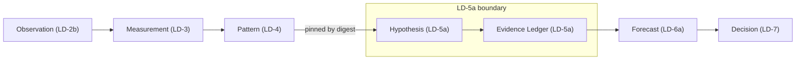
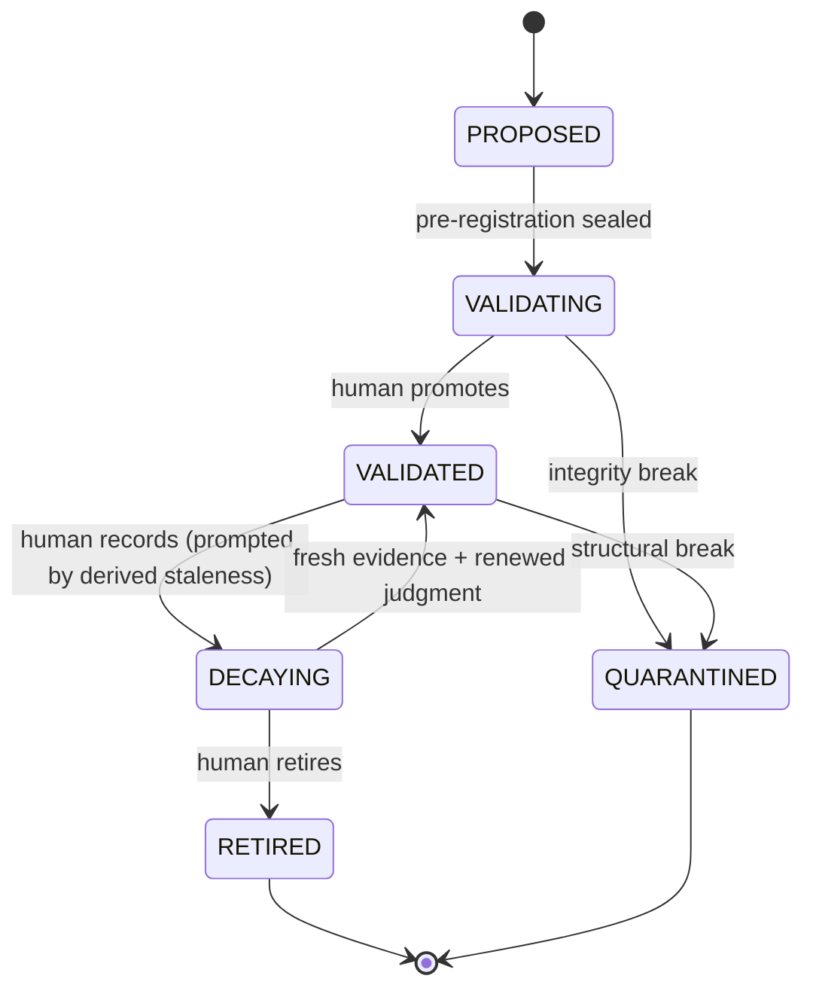

# AI-TRADER — LD-5a Hypothesis + Evidence Ledger Doctrine (Knowledge-First)

> **Status: Ratified doctrine v1.2 (LD-5a).**
> **v1.2 (DEE-292 / LD-5a.3.0):** reconciliation update — record type #3 expanded into §5.3 (Confidence Judgment, Eligibility, Signals, Snapshot/Recompute); §7/§11 revert-to-prior superseded by stale-gating; Open Questions #1 (model-closed), #2, #4 closed. Additive; no record type added, no governance gate weakened.
> **v1.1 (DEE-290 / LD-5a.2c.0):** reconciliation update — §5.2 ratifies R1 (pin-only) and R2 (derived integrity) as shipped in DEE-289; new §5.2.1 ratifies the closed Trial Integrity reason taxonomy, fold rule, and digest contract; Open Question #6 closed. Additive; no record type added, no governance gate weakened.
> **Subordinate to the [AI-TRADER Market Intelligence Architecture](AI-TRADER-MARKET-INTELLIGENCE-ARCHITECTURE.md) and the [AI-TRADER Master Spec v2](AI-TRADER-MASTER-SPEC-v2.md); bounded by [ADR-0009](../adr/0009-regulatory-posture.md) / [ADR-0010](../adr/0010-strategy-validation-gate.md) / [ADR-0011](../adr/0011-single-operator-governance-model.md).**
> **Additive only — it overrides nothing and weakens no governance gate.**
> **No engines.** LD-5a delivers persisted records, registers, and derived read-models only. It adds no automation, no statistical model, no autonomous generation, and no live-trading path.

Date: 2026-06-23
Scope: How AI-TRADER forms falsifiable market claims (Hypotheses) and accumulates immutable, provenance-pinned evidence for and against them (the Evidence Ledger) — the first layer at which the system holds a belief that can be wrong.
Authority: Subordinate to the [Market Intelligence Architecture](AI-TRADER-MARKET-INTELLIGENCE-ARCHITECTURE.md) (Knowledge Objects 5 and 6), the [Master Spec v2](AI-TRADER-MASTER-SPEC-v2.md), and [ADR-0009](../adr/0009-regulatory-posture.md) / [ADR-0010](../adr/0010-strategy-validation-gate.md) / [ADR-0011](../adr/0011-single-operator-governance-model.md). **Where this document and any of those conflict, they win.**
Lineage: Canonical output of three review cycles (Initial Design → Hostile Review → Ratification Review). It records final decisions; it does not re-litigate them.

> **Reading note.** LD-5a is not a strategy, not a forecast, and not a decision. It is the layer where a recurring *structure* (LD-4 Pattern) becomes a *claim* (Hypothesis) and where the system records — append-only and forever — every fact that bears on that claim. The optimization target is **evidence quality, reproducibility, and honesty — never trading profitability.**

---

## Section 1 — Executive Summary

LD-5a is the layer where AI-TRADER stops cataloguing structure and starts holding belief.

**Why LD-5a exists.** The Market Intelligence doctrine's central thesis is that "strategy is a derived, disposable artifact compiled from validated market knowledge" (MI Architecture §1). The unit of validated knowledge is the **Hypothesis**, and the substrate that validates or refutes it is the **Evidence Ledger**. Everything downstream — Worldview, Strategy, Forecast, Decision, and the DEE-178 gate — depends on a claim having an auditable, immutable evidence trail. LD-5a is the layer that produces one.

**Why the Pattern Registry (LD-4) was insufficient.** LD-4 is, by deliberate construction, an inert structural registry behind a firewall that forbids any claim of profitability, edge, direction, prior, relationship-type, or falsification. A Pattern records only that "this structure recurs (no tradeability claim)" (MI Architecture §7, object 3). It therefore cannot hold a belief, cannot accumulate evidence, and cannot be wrong. LD-4 also deliberately deferred trial accounting: its `trial_budget_max` is advisory metadata with no consumption, explicitly leaving "actual trial accounting" to "a future Hypothesis/Evidence layer." LD-5a is that layer.

**Why Hypothesis and Evidence are introduced together.** A Hypothesis is the cognitive atom (MI Architecture §7.1): a falsifiable, regime-scoped, relationship-typed claim with an explicit prior and a mandatory null set. It is meaningless without a substrate that records what argued for and against it. The Evidence Ledger is that "append-only, immutable spine" (§8). The two are distinct entities but one layer: the claim and the immutable record of its testing.

LD-5a records **facts** and **derived read-models explicitly ratified in this doctrine**; it never computes **interpretations** outside that boundary. Confidence is recorded human judgment, not a model. **Eligibility** (entry/allocation interlock) is a **derived read-model within LD-5a** (§5.3.2), not a downstream decision. Trials are registered, never scored or enforced. False-discovery awareness is a count, never a rate. Statistical models — decay curves, FDR rates, calibration scoring — remain deferred to the layers whose outcomes give them meaning.

---

## Section 2 — Role in the Market Intelligence Chain

The canonical knowledge chain (MI Architecture §5), with LD-5a's position bounded:

- **Upstream boundary (Pattern → Hypothesis).** A Hypothesis *references* one or more Patterns and Measurements by pinned version digest. It never restates or recomputes structure. Promotion from Pattern to Hypothesis is the act of attaching a claim, a prior, a falsification condition, and a required-null declaration to a recurring structure.
- **Downstream boundary (Evidence → Forecast).** LD-5a stops at the immutable record of evidence and recorded judgment. It produces no dated, scored prediction — that is a Forecast (LD-6a). The Evidence Ledger may be *read by* the Forecast layer; it contains no forecast.
- **Lateral boundaries.** Regime Knowledge (LD-5c) and Null Comparators (LD-5b) are neighbors, not contents: LD-5a declares the *required* null set and a free-text regime scope, but computes neither. See Sections 9 and 10.

**Ordering note.** The epistemic chain lists Regime Knowledge before Hypothesis; the implementation sequence places LD-5a before LD-5c. This is intentional: regime-transition *recording* can follow the hypothesis/evidence spine without blocking it, and LD-5a reserves a regime seam (Section 10) so no rework is required.

---

## Section 3 — Hypothesis

**Purpose.** A Hypothesis is the cognitive atom of the system: a falsifiable, regime-scoped, relationship-typed market claim that can accumulate evidence and be proven wrong.

**Responsibilities.**

- Carry an explicit `relationshipType`: `correlational | predictive | causal-conjecture` (causal claims are flagged speculative and demand far more evidence).
- Carry an explicit **prior** (recorded ordinal judgment plus an uncertainty band) — the belief held *before* evidence.
- Carry **mandatory falsification conditions** — the pre-registered statement of what would prove the claim false.
- Carry a **mandatory required-null declaration** — the set of null comparators the claim must eventually beat, fixed by hypothesis type (declaration only; computation is LD-5b).
- Reference upstream Patterns/Measurements by pinned version digest.
- Carry an optional `supersedes` lineage reference to a prior hypothesis it replaces (a recorded fact; no displacement enforcement).
- Be **pre-registered**: each version is sealed before its evaluation window; any change to parameters or falsification conditions is a new version and a new window.

**Lifecycle.** `PROPOSED → VALIDATING → VALIDATED → DECAYING → RETIRED | QUARANTINED` (defined in Section 7). Lifecycle state is *derived* from an append-only lifecycle record, never stored as a mutable flag.

**Invariants.**

- A Hypothesis is **immutable per version**; revisions are new versions.
- A Hypothesis **without falsification conditions is invalid** and cannot be recorded.
- A Hypothesis without a required-null declaration is invalid.
- A Hypothesis without an explicit prior is invalid.
- The prior is an attribute of the (immutable) Hypothesis. Evolving belief is **not** stored here — it lives in the Evidence Ledger as Confidence Judgments.

**A Hypothesis is NOT:**

- a **Pattern** — it adds a claim to a structure; it does not record structure;
- a **Measurement or Observation** — it is a claim, not a definition or a value;
- a **Forecast** — it carries no `expectedMove`, holding period, or resolution; encoding any of these is a forbidden forecast leak;
- a **Decision or Strategy** — it is neither an action nor a compiled artifact;
- a **probability** — its prior and confidence are recorded judgments with bands, never computed probabilities.

---

## Section 4 — Evidence Ledger

**Purpose.** The Evidence Ledger is the append-only, immutable spine of the system: the permanent record of every fact bearing on every hypothesis, for and against, neutral included.

**Append-only nature.** Nothing in the Ledger is ever edited or deleted. Corrections, revisions, and re-examinations are **appends**. Retired and refuted hypotheses and all their evidence are retained forever — there is no deletion and no archival that removes a fact from the record. This is the architectural guarantee against survivorship flattery.

**Reproducibility guarantees.** Because every entry is immutable and version-pinned (Section 8), the complete belief state of any hypothesis is reconstructable as of any past instant. A future operator can determine exactly what evidence existed, which upstream versions it depended on, and why the recorded judgment was what it was, at any point in time.

**Provenance requirements.** Provenance is a precondition for evidence (MI Architecture principle #8). No evidence entry may exist without a pinned upstream source/observation (LD-2a/2b), a pinned measurement version (LD-3), and point-in-time stamps (`event_time` knowable, `ingest_time` recorded, `ingest_time >= event_time`). A datum without verifiable provenance cannot become evidence.

**Firewall.** The Research Journal (notes, rejected ideas, narrative) may *reference* the Ledger but can **never be evidence**. The gate ignores the journal entirely (MI Architecture §8). Narrative content is firewalled out of all Ledger record types.

---

## Section 5 — Evidence Ledger Record Types

The Evidence Ledger is a single append-only spine containing exactly four ratified record types. There are no separate ledgers.

**1. Evidence.** A provenance-stamped, version-pinned fact bearing on a specific hypothesis version.

- `direction`: `FOR | AGAINST | NEUTRAL`. Neutrality is explicit and recorded; absence of evidence is never silently treated as neutral.
- Pins the hypothesis version and the measurement version(s) it rests on; carries source/observation provenance and PIT stamps.
- A falsification-triggering observation is recorded as an `AGAINST` entry and may drive retirement.

**2. Trial Registration.** An immutable record that an evaluation attempt was pre-registered against a hypothesis version.

- **Hypothesis pin (R1).** Pins the hypothesis version **only** (`hypothesis_id` + `hypothesis_definition_digest`). The declared nulls and the falsification conditions are **not snapshotted on the trial row**; they are sealed transitively inside `hypothesis_definition_digest` and **resolved at read time** from the pinned, immutable hypothesis version.
- **Integrity (R2).** Integrity is a **derived read-model**, not a stored column. The default derived value is `valid`; a trial becomes `invalidated` **only** through appended Trial Integrity events (see §5.2.1). There is **no mutable `integrity_status` column** (consistent with §6). The record also carries an optional free-text `research_program` label.
- Records **only that an attempt occurred**. It does **not** classify success or failure, does not adjudicate outcome, and does not enforce any budget.

> **Ratification note (DEE-290 / LD-5a.2c.0).** The two bullets above ratify the corrections made when Trial Registration shipped (DEE-289 / LD-5a.2b): **R1** (pin-only; nulls/falsification resolved at read time, never snapshotted) and **R2** (integrity derived; no stored column). They supersede the original v1.0 wording, which described an `integrity_status` attribute and a declared-nulls/falsification snapshot carried on the trial.

**3. Confidence Judgment.** A recorded human judgment of belief in a hypothesis given its evidence.

- Expressed as an ordinal level plus an uncertainty band; cites the Evidence entries that justify it; carries an `as_of` time and a declared review horizon.
- Is **recorded judgment, not a model** — never a computed probability, never a fitted curve.
- Evolving belief lives here (append-only), not on the immutable Hypothesis.

> **Ratification note (DEE-292 / LD-5a.3.0).** The three bullets above are the record-type summary. The governing elaboration — Eligibility (entry/allocation interlock), Signals, Snapshot/Recompute replay, and cross-layer seams — is §5.3. It supersedes the v1.0/v1.1 wording in §7 and §11 that described staleness as "revert toward the prior."

### 5.3 Confidence Judgment (LD-5a.3; DEE-292)

#### 5.3.1 Purpose, Scope, Non-goals

**Purpose.** A Confidence Judgment is a **recorded human judgment of belief in a single hypothesis version, given the evidence cited for it, as of a stated moment, with an honest uncertainty band and a declared expiry.** Eligibility (§5.3.2) is the derived interlock that prevents capital allocation onto a judgment whose declared evidentiary basis is objectively untrustworthy or which is not a currently maintained human belief.

**Scope.** Confidence Judgment is one of four Evidence Ledger record types (§5). It comprises three orthogonal axes: **Recorded value** (the immutable judgment), **Eligibility** (derived binary entry/allocation interlock), and **Signals** (derived advisory facts). Eligibility is evaluated against a **mandatory explicit as-of instant**.

**Non-goals (Confidence Judgment is NOT):**

- a **probability** — no calibrated `P(hypothesis true)`;
- a **forecast** — no dated prediction, `expectedMove`, holding period, or resolution;
- a **decision** — no action, no `whyNotCash`, no order;
- **position sizing or capital allocation** — no size, weight, or fraction;
- a **machine-generated score** — authorship is human-only;
- a **calibration model** — no proper scoring, no empirical decay curve;
- a **strategy edge estimate** — belief in a claim's standing, not net-of-cost tradeable edge;
- a **risk engine, stop-loss, exit engine, or capital-protection system** — see §5.3.9.

#### 5.3.2 Gating and Non-gating Conditions

**Governing rule.** *Only an objective, human-recorded fact of invalidity — about the judgment's own existence, currency, lifecycle, or relied-upon basis — may gate. Anything that requires weighing the world re-judges belief, and only a human may re-judge belief.*

**A judgment is `INELIGIBLE` if and only if at least one of the following holds (closed list):**

1. No live judgment exists for the hypothesis version (`NO_JUDGMENT`).
2. The latest judgment is an **attested-insufficiency / withdrawal** (`WITHDRAWN`).
3. The latest judgment is **past its declared review horizon** at the as-of instant (`EXPIRED`).
4. Any **relied-upon (FOR-direction) citation** of the latest judgment has been **integrity-invalidated** in the Trial-Integrity ledger as-of that instant (`CITATION_INVALIDATED`).
5. The hypothesis lifecycle state forbids consumption (`RETIRED` or `QUARANTINED`) at that instant (`LIFECYCLE_BLOCKED`).

Otherwise the judgment is `ELIGIBLE`.

**The following never affect eligibility — they are Signals only (closed list of exclusions):**

- disconfirmation (new `AGAINST` evidence);
- corroboration (new `FOR` evidence);
- contradiction among existing cited evidence;
- regime changes;
- market movement;
- upstream re-examination flags (LD-5a.3b Invalidation Flag);
- the appearance of a newer hypothesis version (supersession; see §5.3.3).

**Closed-list governance.** The gating-reason list above is **closed**. No gating reason may arise implicitly, emergently, or by downstream invention. **Adding a gating reason requires all of:** (1) an explicit ratified amendment to this document, (2) a derivation-version increment in the registry (§5.3.6), and (3) the same review discipline applied here. No downstream layer may introduce its own gate on confidence consumption.

#### 5.3.3 Eligibility Reason Model

The reason-set is the **closed list**: `{ NO_JUDGMENT, WITHDRAWN, EXPIRED, CITATION_INVALIDATED, LIFECYCLE_BLOCKED }`. Reasons may co-occur; eligibility is "any reason present ⇒ ineligible," so no precedence ordering is required. Growth of this list requires a new ratified doctrine version plus a derivation-version increment (§5.3.6).

**On superseded hypothesis versions.** A Confidence Judgment pins one immutable hypothesis version and remains a valid statement about *that* version. The existence of a newer hypothesis version is a **Signal** (`NEWER_HYPOTHESIS_VERSION_AVAILABLE`), **not** a gating reason, until supersession displacement policy is ratified (Open Question #5).

**Lifecycle as a declared input.** The Hypothesis-Lifecycle ledger is an explicit input to the eligibility derivation (via `LIFECYCLE_BLOCKED`). Directionality is **one-way**: `RETIRED` or `QUARANTINED` forces `INELIGIBLE` via `LIFECYCLE_BLOCKED`; `PROPOSED`, `VALIDATING`, `VALIDATED`, or `DECAYING` never implies `ELIGIBLE`.

**Default and withdrawal.** `INSUFFICIENT_EVIDENCE` is **hybrid**: the **derived default** when no judgment has ever been recorded, **and** a **recordable attested judgment** when a human explicitly concludes evidence is insufficient (also serving as withdrawal of prior belief). The read-model must distinguish `INSUFFICIENT (never judged)` from `INSUFFICIENT (attested by human at T, citing evidence)`.

#### 5.3.4 Signals

Signals are derived, advisory facts surfaced for the **next human judgment**; they never gate and impose no automatic effect. Doctrine-level signal classes:

- `NEW_DISCONFIRMING_EVIDENCE`
- `NEW_CORROBORATING_EVIDENCE`
- `CITATION_FLAGGED` (LD-5a.3b re-examination)
- `NEWER_HYPOTHESIS_VERSION_AVAILABLE`
- `EXPIRING_SOON` (latest judgment approaches its review horizon)

`EXPIRING_SOON` is a signal, **not** a third eligibility state.

#### 5.3.5 Citation-Boundary Doctrine

Eligibility's integrity gate operates on the judgment's **relied-upon basis**, defined as its **FOR-direction citations**. (`AGAINST` citations are recorded context, not basis; their invalidation never gates.)

**Accepted boundary.** Eligibility is a **floor, not a completeness guarantee**: it catches the collapse of the *declared* FOR-basis, but cannot catch evidence a human chose not to cite. Citation completeness is an **authoring obligation and an audit/Challenger property, not a mechanical guarantee.** Discharged by:

1. **Cite-or-explain on restoration.** A judgment restoring eligibility after `CITATION_INVALIDATED` must record why the remaining valid FOR-basis supports the asserted level, citing only evidence valid at authoring.
2. **Challenger reviewability (LD-8).** Thin or convenient citation is a first-class target for adversarial dissent at decision time.
3. **Audit permanence.** Invalidation events and all judgments remain permanently recorded.

#### 5.3.6 Snapshot / Recompute Replay Doctrine

**Two truths.**

- **Accountability truth (frozen, by recording).** "Why was this action taken then?" is answered by an **immutable snapshot recorded at the moment of consumption** (§5.3.7), never by recomputation.
- **Research truth (evolving, by recomputation).** "What would we conclude today?" is answered by **recomputing** eligibility/signals from the immutable ledgers under a chosen derivation version. Divergence from the snapshot is informative, never a replay defect.

**Derivation registry.** All eligibility/signal derivation logic is identified by a **derivation-version** held in an **append-only registry with effective intervals**. Corrections are issued as **new versions (errata)**; superseded versions are retained. The registry — not deployed code — is the authority for "which logic was in force."

**Replay definitions.**

- *Accountability replay* reads the recorded snapshot. No derivation execution is involved.
- *Research replay* of state as-of instant T executes a **named derivation version** (default: the latest) against the ledgers filtered to T. Determinism is guaranteed *given a named version*.

**Snapshot truth protection.** The accountability snapshot is the **sole basis for evaluating whether a past decision was justified.** Research-truth may never be used to retroactively re-adjudicate, score, or assign blame to past decisions or operators.

#### 5.3.7 Consumer Obligations

- **Confidence consumers in general:** must evaluate eligibility against an **explicit as-of instant**.
- **Forecast (LD-6) and Decision (LD-7)** — any layer whose output binds capital — **must snapshot, into their own immutable record:** the consumed confidence value (ordinal + band), the eligibility verdict + reason-set, the as-of instant, and the **derivation-version-id** used.
- **Challenger (LD-8):** consumes Signals and records dissent rationale and cited Evidence entries. Advisory; it never gates.

#### 5.3.8 Research Replay Doctrine

- **Objectives:** model improvement, calibration research, post-mortem analysis.
- **Guarantees:** given a named derivation version and an as-of instant, research replay is a deterministic function of the immutable ledgers.
- **Limitations:** research recompute **may** diverge from the accountability snapshot and **must never** overwrite or be presented as the accountability truth.

#### 5.3.9 Eligibility Scope Boundary and Ownership Seam

**Eligibility is an entry/allocation interlock.** It governs whether a Confidence Judgment may be *consumed to justify allocating capital*. It governs nothing about capital already deployed.

**Ownership seam (declared, not designed here):**

- **Confidence (LD-5a)** records belief, derives eligibility, and emits Signals. It never manages capital or acts on open positions.
- **Forecast (LD-6)** authors dated predictions from eligible confidence and snapshots its inputs (§5.3.7).
- **Decision (LD-7)** owns allocation, position lifecycle, and exit decisions; it consumes eligibility verdicts and Signals for both entries and open positions.
- **Risk Engine / Kill-Switch** owns capital protection on deployed capital — deterministic, rule-based controls that act **without re-judging belief**.

#### 5.3.10 Signal Consumption Obligations

Signals are **first-class, mandatory outputs**, not optional observations.

- **Confidence-layer obligation.** LD-5a must derive and surface its Signals deterministically and completely.
- **Consumer-layer obligation.** Any layer managing capital (Decision / Risk Engine) **must treat eligibility verdicts and Signals as required inputs for open positions**, not advisory decoration. A Signal that materially bears on a live position and reaches no consumer is a downstream doctrine violation.

#### 5.3.11 Why Integrity Is the Only Gateable Condition

The asymmetry follows from **"the machine researches; the human judges."**

- **Integrity invalidation gates** because it propagates an **already-human-recorded objective fact**: a human recorded in the Trial-Integrity ledger that a specific datum the judgment relied upon is *invalid*. Honoring this requires **no judgment about the market** — only the mechanical consequence that capital must not be allocated on a basis a human has attested is broken.
- **Disconfirmation, contradictory evidence, regime change, and market movement cannot gate** because each requires **re-judgment**. For the machine to gate on them would be the machine **re-judging belief**. These are surfaced as Signals; their capital consequences on open positions are bounded by rule-based risk controls (§5.3.9).

**4. Invalidation Flag.** An appended marker that an upstream source or measurement has been revised, flagging dependent evidence for human re-examination.

- Never edits or removes the affected evidence; it appends a re-examination signal. It does not itself change any recorded judgment.

### 5.2.1 Trial Integrity (derived; LD-5a.2c)

Trial integrity is the **derived `integrity_status` attribute of a Trial Registration** (record type 2). It is **not** a fifth Evidence Ledger record type and **not** a separate ledger — the Evidence Ledger remains exactly the four record types above. Integrity is derived from an **append-only Trial Integrity event substrate** that belongs to the same category as the hypothesis/pattern lifecycle records of §7: *derivation substrate*, not Ledger record types.

**Closed reason taxonomy (Open Question #6 — ratified).** A trial may be integrity-invalidated only for one of these attempt-local reasons:

- `look_ahead_contamination` — future/leaked data discovered in the evaluation (a point-in-time violation found after the fact).
- `pre_registration_breach` — the evaluation deviated from the sealed pre-registration protocol.
- `computation_defect` — a defect in the evaluation harness invalidated the attempt.
- `provenance_gap` — required provenance was found missing or unverifiable (the §4 precondition failed).

The list is **closed**; growth requires a new ratified version of this document plus an additive migration. Upstream source/measurement **revision** is deliberately **not** a trial-integrity reason — it is the domain of the **Invalidation Flag** (record type 4, implemented in LD-5a.3b), which flags dependent *evidence* for re-examination. There is **no `operator_error` catch-all** (an unverifiable, unremovable survivorship surface).

**Derived-state fold rule (ratified).** Current integrity is the resulting status of the **most recent** integrity transition for the trial, ordered by `seq`; `since` is the timestamp of the most recent transition **into** the current status. A trial with **no** integrity events derives `valid`. This latest-transition rule is forward-compatible with a future `reinstated` event type (deferred from MVP).

**Content-digest contract (ratified).** Each Trial Integrity event's `content_digest` binds exactly: `schemaVersion`, `organizationId`, `trialId`, `eventType`, `reasonCode`, `rationale`, `causeRef` (null until LD-5a.3b), `eventTime`, `ingestTime`, `recordedBy`. It **excludes** `seq`, derived state, and any denormalized `trialHypothesisKey`.

**Anti-survivorship guarantees.** Integrity invalidation **never** refunds or removes a trial from trial counts, **never** edits or deletes Evidence, and **never** transitions hypothesis lifecycle. It records an audited re-examination/trust fact — never a back door (§11).

**Boundary — two distinct "integrity" concepts.** *Trial integrity invalidation* is **per-attempt** (this substrate). The §7 *hypothesis integrity break* → `QUARANTINED` is a **per-claim**, human-recorded lifecycle transition. **Neither auto-triggers the other.**

---

## Section 6 — Core Invariants

- **Append-only.** Every record type is immutable. Current state is always derived from the append-only log; there are no mutable state columns.
- **Provenance.** No evidence without pinned upstream source/observation, pinned measurement version, and valid PIT stamps (`ingest_time >= event_time`).
- **Reproducibility.** Every entry is version-pinned by digest; historical belief state is reconstructable as of any instant (Section 8).
- **Pre-registration.** A hypothesis version is sealed before its evaluation window. Any change to parameters or falsification conditions creates a new version and a new window, logged.
- **Falsification.** Falsification conditions are mandatory; a hypothesis without them is invalid.
- **Required-null declaration.** The required null set (by hypothesis type) is mandatory at authoring; computation is deferred to LD-5b.
- **Human promotion.** The machine records facts; only the human promotes. LD-5a produces facts and derived read-models; it never aggregates them into trading verdicts or autonomous signals.
- **Facts, not interpretations.** No success/failure classification, no budget enforcement, no FDR rate, no decay curve, no eligibility aggregation engine, no statistical model.
- **Confidence invariants.** Confidence Judgments are append-only, version-pinned, evidence-cited, and human-authored. Eligibility is a derived binary entry/allocation interlock with a closed gating list (§5.3.2). Signals are derived and advisory; they never gate. Default `INSUFFICIENT_EVIDENCE` is hybrid: derived default when no judgment exists, and recordable when a human attests insufficiency.
- **Default state.** The canonical default belief state of any hypothesis is `INSUFFICIENT_EVIDENCE` (derived when no live judgment exists).
- **Tenant isolation.** All records are organization-scoped, with the isolation guarantees established by LD-2a through LD-4.

---

## Section 7 — Lifecycle Model

Hypothesis lifecycle state is derived from an append-only lifecycle record (current state = latest entry). Transitions are human-recorded; none are automatic.

- **PROPOSED** — the hypothesis exists with prior, falsification conditions, and required-null declaration, but no sealed evaluation window yet.
- **VALIDATING** — pre-registration is sealed; evidence and trials accumulate against this version.
- **VALIDATED** — a human has promoted the hypothesis on the recorded evidence. Promotion is never machine-automated.
- **DECAYING** — a **human-recorded** lifecycle transition, typically prompted when derived confidence staleness (review horizon passed; see §5.3.2) surfaces a belief that is no longer consumable. Staleness itself is a **derived consumption property** (eligibility `EXPIRED`); it does **not** automatically write a lifecycle transition. The recorded confidence value is **never reverted** toward the prior — only consumability changes until a human renews judgment.
- **RETIRED** — the hypothesis is no longer held. Its records are retained forever (no survivorship flattery).
- **QUARANTINED** — an integrity or structural break has occurred; the hypothesis is isolated pending human disposition. Structural-break handling routes to the kill-switch posture defined upstream; LD-5a records the state transition, not the remediation.

---

## Section 8 — Reproducibility Model

LD-5a guarantees that the belief state of any hypothesis is exactly reconstructable as of any past instant.

- **Evidence pinning (the LD-5 Evidence pin).** Every Evidence entry pins the exact hypothesis version (by definition digest) and the exact measurement version(s) it rests on (by key + digest), plus source/observation provenance and PIT stamps. This is distinct from the LD-4 reproducibility pin (which pins measurements *inside a pattern definition*); the LD-5 Evidence pin records *what evidence was based on at the moment it was recorded*.
- **Version pinning.** All upstream layers (LD-2a..LD-4) are append-only and version-pinned by digest, so a pinned reference resolves deterministically and immutably forever.
- **Reconstruction of historical state.** Because every record carries an immutable sequence and timestamp, filtering the append-only logs to a chosen instant and applying the eligibility derivation (§5.3.2) under a named derivation version (§5.3.6) reproduces the exact confidence eligibility, evidence set, and lifecycle state as they stood then. Accountability for past actions is preserved by consumer snapshots (§5.3.7), not by recomputation.

---

## Section 9 — Explicit Exclusions

The following are intentionally **not** part of LD-5a:

- **Forecast (LD-6a).** No dated, scored predictions; no `expectedMove`, holding period, or resolution may appear in a hypothesis or evidence entry.
- **Calibration (LD-6b).** No proper scoring, no survivorship-aware scorecard, no empirical decay model.
- **FDR models / calculations / engines.** LD-5a holds trial **counts** and recorded forking-path **awareness** only. Any false-discovery **rate** belongs to Calibration; an FDR **engine** is Post-MVP.
- **Discovery Family semantics.** Removed as a concept. Permitted only as optional free-text trial metadata, with no semantics and no enforcement.
- **Confidence decay curves / models.** Only staleness via review horizons and the stale-gating doctrine (§5.3.2): past horizon, eligibility becomes `INELIGIBLE` (`EXPIRED`); the recorded value is unchanged. Empirical decay belongs to Calibration.
- **Eligibility as risk control.** Eligibility is an entry/allocation interlock only (§5.3.9). It is not a risk engine, stop-loss, exit engine, or capital-protection system.
- **Budget enforcement and trial outcome classification.** Trials are immutable registrations; LD-5a does not enforce budgets, classify success or failure, or adjudicate outcomes.
- **Promotion eligibility verdicts/signals.** LD-5a produces facts; aggregation into a verdict belongs to Worldview/Decision and the human-governed gate.
- **Regime logic (LD-5c).** Only a free-text regime scope and a reserved seam; no regime model, classification, or runtime label.
- **Decision logic (LD-7), Challenger logic (LD-8), Worldview aggregation, contradiction/conflict resolution, displacement enforcement.**
- **Strategy, Risk, and Execution logic; trading permissions; DEE-178 gate changes.** Gate linkage is a separate later slice (LD-9).

**Terminology bridge.** What MI Architecture §16 calls the "FDR register" is, in LD-5a, the trial-count + forking-path-awareness facet; the false-discovery rate itself is deferred to Calibration (LD-6b).

---

## Section 10 — Future Layer Interfaces (reserved seams)

LD-5a is designed so the following layers can be added later without rewriting its structure. Each seam is *reserved*, not *implemented*.

- **LD-5a.3b Invalidation Flag (record type 4).** Upstream source/measurement revision flags dependent evidence for re-examination. Surfaces as the `CITATION_FLAGGED` Signal (§5.3.4); populates the `causeRef` seam left null on Trial Integrity events (§5.2.1). Does not gate eligibility; does not mutate recorded judgments.
- **LD-5b Null Comparator.** The hypothesis carries the *declared* required-null set; the Evidence record type reserves a null-comparator evidence kind and reference so computed null results can later be appended as evidence (typically `AGAINST`) pinned to the same hypothesis version. Null results surface as disconfirmation Signals (§5.3.4); they never gate eligibility. LD-5a computes no nulls and imports no price/feature data.
- **LD-5c Regime Knowledge.** The hypothesis carries a free-text `regimeScope` descriptor; evidence records reserve a nullable regime-context reference so evidence can later become regime-dependent. Regime exit is a **Signal** under this doctrine; it may become a gating reason **only** via the closed-list governance path (§5.3.2). Future regime-scoping is a **derivation-version revision**, not an additive schema patch alone.
- **LD-6 Forecast.** The Forecast layer reads hypotheses and eligible confidence to author pre-registered predictions; LD-5a stores no forecast. Forecast **must snapshot** consumed confidence, eligibility verdict, reason-set, as-of instant, and derivation-version-id (§5.3.7). Forecast carries its own confidence; no write-back to Confidence Judgments.
- **LD-6 Calibration.** Calibration will consume resolved forecasts to produce scoring, empirical decay, and a true false-discovery rate. LD-5a's recorded confidence judgments, review horizons, and trial counts are the inputs it will later score; LD-5a computes none of them.
- **LD-7 Decision Record.** Decisions own allocation, position lifecycle, and exits; they **must consume** eligibility verdicts and Signals as required inputs for open positions (§5.3.10) and **must snapshot** inputs per §5.3.7. LD-5a exposes the facts a decision cites and produces no decision.
- **LD-8 Challenger.** The Challenger will cite specific Evidence entries against a claim and consume disconfirmation Signals; LD-5a's `AGAINST` evidence and immutable record are the substrate. LD-5a contains no challenger logic and no dissent adjudication.
- **Risk Engine / Kill-Switch.** Owns rule-based capital protection on deployed capital without re-judging belief (§5.3.9). Must treat eligibility verdicts and Signals as required inputs for open positions (§5.3.10).
- **Derivation-registry governance (cross-cutting).** The append-only derivation-version registry (§5.3.6) and its ratification process for new/errata versions are a dependency of trustworthy replay; governance of that registry is outside LD-5a implementation but bound by this doctrine.

---

## Section 11 — Architectural Principles

LD-5a is governed by one discipline: **record facts; do not interpret them.**

- **Recording facts, not interpreting facts.** Every entity and record type stores something that *happened* — a claim was authored, evidence was observed, a human judged, an upstream version changed. No record stores a computed interpretation. This is the load-bearing principle from which the others follow.
- **Preserving evidence.** Append-only and immutable forever. Nothing is deleted; corrections are appends. The record of what the system once believed, and why, is permanent.
- **Preventing survivorship bias.** Failed, refuted, and retired hypotheses and all their evidence are retained forever and remain visible. Trials are registered as attempts and never refunded by reclassification; the integrity-invalidation path is audited, not a back door.
- **Preventing hindsight bias.** Pre-registration seals each hypothesis version — prior, parameters, falsification conditions, and required nulls — *before* its evaluation window. Any change is a new version and a new window. The past cannot be rewritten to fit what happened.
- **Preventing confirmation bias.** Evidence `direction` is first-class; `AGAINST` and `NEUTRAL` are recorded with equal standing to `FOR`; the mandatory required-null declaration forces a disconfirming baseline; the canonical default state is `INSUFFICIENT_EVIDENCE`, so silence reads as doubt, never as support.
- **Honest confidence.** Confidence is recorded human judgment with an explicit uncertainty band — never a probability, never a fitted curve. When a review horizon passes, **stale-gating** applies: eligibility becomes `INELIGIBLE` (`EXPIRED`) and the recorded value is unchanged until a human renews judgment — never a silent revert toward the prior.
- **The machine researches; the human promotes.** LD-5a surfaces facts and derived read-models. Promotion and every act of capital remain human-governed and pass, unchanged, through the DEE-178 gate downstream.

---

## Open Questions (deferred implementation contracts)

These do not block the doctrine. Each is a field/contract decision owned by its implementation slice, not an architectural contradiction:

1. **Confidence ordinal scale and band representation** — **MODEL-CLOSED (DEE-292 / LD-5a.3.0).** Doctrine commits to ordinal + non-collapsible ordinal-interval band, non-arithmetic, human-authored. **Exact level enumeration** (doctrine recommends ≥5 levels) is locked at **LD-5a.3a** implementation kickoff.
2. **Review-horizon and stale-gating semantics** — **CLOSED (DEE-292 / LD-5a.3.0).** Staleness gates consumption (`EXPIRED`); recorded value never reverts toward prior. Review-horizon **representation** (absolute vs relative) is locked at LD-5a.3a.
3. **Required-null declaration vocabulary** — aligned to MI Architecture §7.3; locked at the Hypothesis slice (LD-5a.1).
4. **Trial-to-evidence / confidence citation cardinality** — **CLOSED (DEE-292 / LD-5a.3.0).** Confidence Judgments cite **Evidence** entries (FOR-direction as relied-upon basis); trials are reached transitively via evidence. Citation **representation** (explicit vs watermark) is locked at LD-5a.3a.
5. **`supersedes` lineage in MVP** — recorded as a bare fact (no displacement policy) or deferred; confirmed at LD-5a.1.
6. **Integrity-invalidation reason taxonomy** — **CLOSED (DEE-290 / LD-5a.2c.0).** Ratified as the closed four-reason taxonomy in §5.2.1 (`look_ahead_contamination`, `pre_registration_breach`, `computation_defect`, `provenance_gap`); upstream-revision deferred to the Invalidation Flag (LD-5a.3b); no `operator_error`. The derived-state fold rule and content-digest contract are ratified in the same subsection.

---

## Accepted Limitations

The following are **accepted doctrine limitations**, not defects to be fixed in LD-5a:

- **Between-horizon persistence.** Disconfirmation never gates eligibility; a thesis may remain consumable until a human re-judges or the review horizon lapses. Mitigated by Signals, cite-or-explain, Challenger, and downstream risk controls (§5.3.9–§5.3.10).
- **Citation under-declaration.** Eligibility is a floor on the *declared* FOR-basis, not a completeness guarantee (§5.3.5). Mitigated by cite-or-explain, Challenger, and audit permanence.
- **Integrity-authorship access control.** Who may record integrity invalidations is a governance dependency; griefing via spurious invalidation is an access-control concern, not relaxed by weakening the gate.
- **Derivation-registry governance debt.** Trustworthy replay depends on append-only discipline and ratification of derivation-version changes (§5.3.6).
- **Single-operator fold.** Latest-by-seq eligibility fold is valid only under single-operator governance (ADR-0011); multi-operator requires a future derivation-version revision.

---

## Ratification Statement (v1.2 — DEE-292 / LD-5a.3.0)

This **v1.2 reconciliation** expands Evidence Ledger record type #3 into §5.3 (Confidence Judgment, Eligibility, Signals, Snapshot/Recompute), supersedes revert-to-prior staleness wording in §7 and §11 with **stale-gating**, closes Open Questions #1 (model-closed), #2, and #4, and records cross-layer ratification conditions for LD-5a.3b, LD-6, LD-7, Risk Engine/Kill-Switch, and derivation-registry governance.

Architecture phase: Initial Design → Architecture Hardening → Doctrine Repair #1 → Hostile Review #1 → Doctrine Repair #2 → Hostile Review #2 → Doctrine Decision Review → Doctrine Repair #3 → Hostile Review #3 → Doctrine Repair #4 → Ratification Review (**RATIFY WITH CONDITIONS**). Additive only; no record type added; no governance gate weakened.

**Cross-layer ratification conditions (C3):** LD-5a.3b must implement Invalidation Flag → `CITATION_FLAGGED` Signal; LD-6 and LD-7 must honor snapshot obligations (§5.3.7) and consumer contracts (§5.3.10); Risk Engine/Kill-Switch must honor §5.3.9–§5.3.10; derivation-registry governance must support §5.3.6.

---

## Ratification Statement (v1.0 / v1.1)

This document is the **ratified canonical doctrine for LD-5a — Hypothesis + Evidence Ledger**. It reflects the finalized decisions of the three-cycle architecture process (Initial Design → Hostile Review → Ratification Review) and is authoritative for all future LD-5a implementation planning, issue decomposition, architecture reference, audit, and architect onboarding.

It is subordinate to the [AI-TRADER Market Intelligence Architecture](AI-TRADER-MARKET-INTELLIGENCE-ARCHITECTURE.md), the [Master Spec v2](AI-TRADER-MASTER-SPEC-v2.md), and ADR-0009/0010/0011; it is additive and weakens no governance gate. LD-5a contains exactly two top-level entities — the **Hypothesis Registry** and the **Evidence Ledger** (with four record types: Evidence, Trial Registration, Confidence Judgment, Invalidation Flag). It records facts and never computes interpretations; confidence is recorded judgment, trials are immutable registrations, false-discovery handling is a count only, and every statistical model is deferred to Calibration and later layers. The canonical default state is `INSUFFICIENT_EVIDENCE`.

Decisions herein are final unless a future contradiction with superior canon is discovered, in which case the conflict resolves upward to the Market Intelligence Architecture and the ADRs, and any change lands as a new ratified version of this document.

---

*End of doctrine. This document is subordinate to the Market Intelligence Architecture and the Master Spec, additive to the system, and introduces no new governance.*
