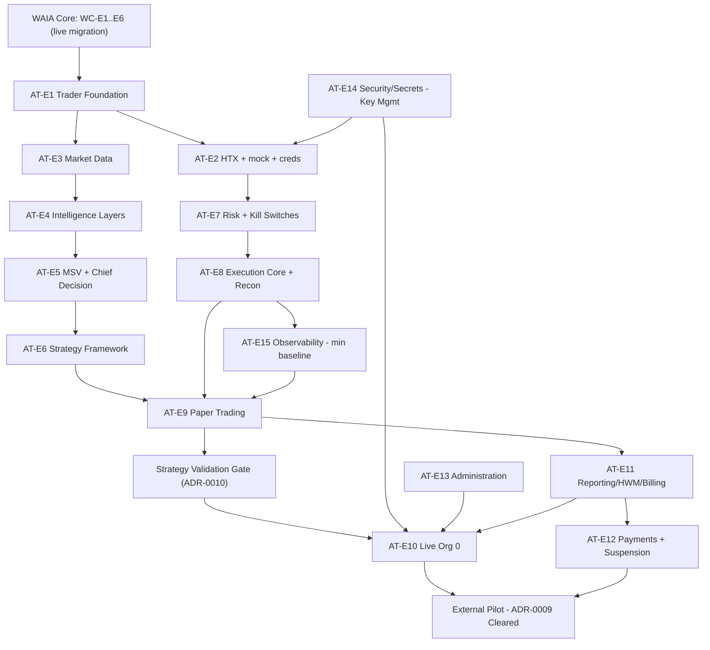

# AI-TRADER Implementation Program

Status: Program v1.2 (from Baseline v1.2)
Date: 2026-06-11 · Doctrine reconciliation: 2026-06-24

Planning structure only — no Linear issues, tasks, code, or migrations. It stops at the Feature level and respects every accepted decision (HTX-only, spot-only, Org-0-only live, manual billing gate, targeted RLS + isolation test gate, WAIA Core as prerequisite, ADR-0009 external-live prohibition). It is the implementation-ready blueprint that drives future Linear Epic / Feature Group / Task-Contract generation.

This is **Program v1.2**: Program v1.1 (Program v1.0 with the six accepted Red Team remediations — see [Changes from v1.0](#changes-from-v10-red-team-remediation)) plus a documentation-only doctrine reconciliation against the ratified Knowledge-to-Action doctrines (see [Changes from v1.1](#changes-from-v11-doctrine-reconciliation)).

---

## Changes from v1.0 (Red Team remediation)

1. **Strategy Validation Gate** added between Paper Trading (AT-E9) and Org-0 Live (AT-E10) as milestone **M7.5** and a dependency of AT-E10 — see [ADR-0010](../adr/0010-strategy-validation-gate.md).
2. **Single Operator Governance Model** replaces every "dual-control" reference (AT-E13 controls, readiness gates) — see [ADR-0011](../adr/0011-single-operator-governance-model.md).
3. **Billing governance** policies (valuation source, unrealized PnL, dispute, overcharge remediation, refund/credit) folded into AT-E11.
4. **WAIA Core as live migration** (not greenfield): migration planning, rollback, AI-TWIN continuity, backward compatibility called out across Program A.
5. **Observability sequencing**: the AT-E15 minimum observability baseline is now a prerequisite of AT-E9 (paper), milestone moved to **M7**.
6. **Key management sequencing**: managed key infrastructure (AT-E14 Key Management) is now a prerequisite of storing any real exchange credential in AT-E2.

No epics, modules, exchanges, or product concepts were added beyond these governance/sequencing changes.

---

## Changes from v1.1 (Doctrine Reconciliation)

Program v1.1 reconciled to the ratified Knowledge-to-Action doctrines — [LD-6 Forecast](AI-TRADER-FORECAST-DOCTRINE.md), [LD-7 Decision](AI-TRADER-DECISION-DOCTRINE.md), [LD-8 Risk](AI-TRADER-RISK-DOCTRINE.md), [LD-9 Reality](AI-TRADER-REALITY-DOCTRINE.md) — and DEE-299 Execution Canon Reconciliation. The reconciliation is **documentation-only**; it adds clarifying notes and decomposition pointers to existing epics in [Section 4](#section-4--ai-trader-program-epic-detail) and changes nothing structural:

1. **AT-E5 disambiguation** — the "Chief Decision Engine" is clarified as a regime / trading-permission gate, distinct from the LD-7 Decision (ACTIONABILITY) layer; the shared word "Decision" is coincidental.
2. **AT-E6 / AT-E9 collapse note** — the MVP "signal" is recorded as an accepted collapse of LD-6 Forecast (ACCURACY) and LD-7 Decision (ACTIONABILITY) into one artifact; future decomposition separates them.
3. **AT-E8 separation** — the reconciliation surface is split into LD-9 reconciliation-as-construction (truth) and LD-8 Risk-L6 reconciliation-as-enforcement (safety), which never merge.
4. **AT-E7 / AT-E8 doctrine-import checklists** — explicit decomposition pointers into LD-8 / LD-9.

**Unchanged:** program structure, epic set, critical path, milestones (M0–M11), the dependency graph, and every accepted decision. No epics, modules, architecture, doctrine, governance, or roadmap sequencing were added or altered.

---

## Changes from v1.2 (LD-10 Doctrine Reconciliation)

Program v1.2 reconciled to the ratified [LD-10 Closed Trade Reality Doctrine](AI-TRADER-CLOSED-TRADE-REALITY-DOCTRINE.md) (DEE-308). The reconciliation is **documentation-only**; it adds a clarifying note to AT-E11 in [Section 4](#section-4--ai-trader-program-epic-detail) and changes nothing structural:

1. **AT-E11 doctrine note (LD-10)** — fee computation (S4) must use Realized Strategy Profit and cumulative net realized strategy profit HWM per LD-10; unrealized PnL is audit-only; manual gate checklist extended with realized-fill finality (ADR-0008 reinterpretation).

**Unchanged:** program structure, epic set, critical path, milestones, dependency graph, and every accepted decision.

---

## SECTION 1 — Executive Program Assessment

- **Implementation complexity — High (8/10):** two programs (Core + Trader), a long-running off-Cloudflare runtime class, financial correctness (HWM/billing), trade-capable secrets, and a 21-epic critical path. Each piece is tractable; the integration surface makes it high.
- **Architectural risk — Low–Medium (3/10):** Baseline v1.2 resolved the dangerous ambiguities (identity, tenancy, RLS posture, repo, billing gate, regulatory gate, validation gate, governance model). Remaining risk is execution-time drift, not design.
- **Execution risk — High (7/10):** single founder + AI; long serial critical path; the hardest epics (Risk Engine, Execution/Reconciliation, Billing/HWM, key management) are the least forgiving of error.
- **Major dependency bottlenecks:** (1) WAIA Core blocks everything; (2) Trader Foundation + HTX connector (incl. mock) blocks the safety spine and downstream; (3) Safety Spine v0 blocks paper and live; (4) Strategy Validation Gate blocks live; (5) ADR-0009 clearance blocks all external monetization (non-engineering).
- **Critical success factors:** build Core first and completely (as a migration); keep live off-by-default and Org-0-only; prove the loop in paper before money; pass the Strategy Validation Gate before live; treat tenant-isolation tests and billing reconciliation as release blockers; never let roadmap pressure collapse the safety sequencing.

---

## SECTION 2 — Program Structure (four levels: Program → Epic → Feature Group → Feature)

### Program A — WAIA Core (live-platform migration)

> Program A is a **live migration of an active platform**, not greenfield. Every epic below is executed under migration discipline: **migration planning**, **tested rollback per step**, **AI-TWIN continuity** (existing users backfilled with zero behavioral change), and **backward compatibility** (`public.users.id == auth.users.id` preserved; additive-only on tables AI-TWIN reads). Governed by [ADR-0002](../adr/0002-staged-postgres-runtime-rollout-discipline.md) and `db/AGENTS.md`.

```text
WAIA Core
├── WC-E1 Identity Foundation & Profiles
│   ├── FG: Auth Alignment
│   │   ├── Supabase Auth ↔ public.users id parity hardening
│   │   ├── Sign-up user-row provisioning path
│   │   └── Cross-domain session continuity (waia.life / trader.waia.life)
│   └── FG: Profiles
│       ├── Profile extension model (1:1 with users)
│       ├── Profile read/update surface
│       └── Settings & locale fields
├── WC-E2 Organizations & Membership (Tenancy)
│   ├── FG: Organizations
│   │   ├── Organization model
│   │   ├── Auto personal-org provisioning on signup
│   │   ├── Backfill of existing AI-TWIN users into personal orgs (continuity)
│   │   └── Org ownership semantics
│   └── FG: Membership
│       ├── organization_members model
│       ├── Member roles within org
│       └── Org context resolution helper
├── WC-E3 Roles & Permissions (RBAC)
│   ├── FG: Platform Roles
│   │   ├── Role set (user / admin / agent / service)
│   │   └── Role assignment surface
│   └── FG: Permission Resolution
│       ├── Capability resolution (role + entitlement)
│       └── Permission check API for modules
├── WC-E4 Subscriptions & Entitlements
│   ├── FG: Subscriptions
│   │   ├── Per-org module subscription state
│   │   └── Module enable/disable
│   └── FG: Entitlements
│       ├── Derived entitlement resolution
│       └── `trader` entitlement gate
├── WC-E5 Platform Audit Framework
│   ├── FG: Audit Stream
│   │   ├── Append-only, tamper-evident audit model
│   │   ├── Audit write API for all modules
│   │   └── Actor / entity / org / metadata capture
│   └── FG: Audit Access
│       ├── Admin audit read surface
│       └── Append-only enforcement (targeted RLS)
└── WC-E6 Tenant Isolation & Security Test Gate
    ├── FG: Scoped Access
    │   ├── Mandatory org-scoped query helper
    │   └── Targeted RLS (credentials / payments / audit)
    └── FG: Isolation Test Harness
        ├── Cross-org isolation test framework
        └── Release-blocking isolation gate (per ADR-0007)
```

### Program B — AI-TRADER

```text
AI-TRADER
├── AT-E1 Trader Foundation
│   ├── FG: Module Shell
│   │   ├── app/(trader) route group
│   │   ├── trader.waia.life host routing
│   │   └── Entitlement-gated access
│   └── FG: Trader Domain Scaffolding
│       ├── Trader schema namespace (org-scoped)
│       └── Trader module audit wiring
├── AT-E2 Exchange Connectivity & HTX Integration
│   ├── FG: Connector Abstraction
│   │   ├── ExchangeConnector interface
│   │   └── Mock connector
│   ├── FG: HTX Read Path
│   │   ├── Credential validation
│   │   ├── Permission detection / warnings
│   │   ├── Spot balance / position / trade-history read
│   │   └── Public market-data read
│   └── FG: Credential Security
│       ├── Managed key infrastructure live BEFORE first real credential stored (prereq: AT-E14 Key Management)
│       ├── Envelope encryption at rest (wrapped by managed master key)
│       ├── Masking & service-role-only access
│       └── Rotation support
├── AT-E3 Market Data Foundation
│   ├── FG: Ingestion
│   │   ├── WebSocket ingest (BTC/ETH spot)
│   │   ├── Fear & Greed feed
│   │   └── News sentiment feed
│   └── FG: Storage & Quality
│       ├── Bars + derived features (Postgres)
│       ├── Raw tick/L2 → R2 cold storage
│       ├── Time-range partitioning strategy
│       └── Data-quality scoring
├── AT-E4 Market Intelligence Layers
│   ├── FG: Feature Engine
│   │   ├── Feature computation
│   │   └── Backtest/live feature parity contract
│   └── FG: Analytical Layers
│       ├── Market Physics layer
│       ├── Liquidity/microstructure layer
│       ├── Crowd Psychology (F&G + news; derivatives = context-read only)
│       └── Future Context (stub)
├── AT-E5 Market State Vector & Chief Decision Engine
│   ├── FG: Market State Vector
│   │   ├── MSV model & reproducibility refs
│   │   └── Regime + trading-permission + data-quality fields
│   └── FG: Chief Decision Engine
│       ├── Regime classification
│       ├── Trading-permission gate (incl. PAPER_ONLY)
│       └── Allowed-strategy-set + reason codes
├── AT-E6 Strategy Framework
│   ├── FG: Strategy Registry
│   │   ├── Strategy / version / assignment model
│   │   └── Lifecycle states
│   └── FG: MVP Strategies
│       ├── Liquidity Sweep Reversal (signals)
│       └── Mean Reversion (signals)
├── AT-E7 Risk Engine & Kill Switches (Safety Spine v0)
│   ├── FG: Risk Controls
│   │   ├── Position/loss/drawdown/exposure limits
│   │   ├── Trade-abuse security controls (allowlist, notional, rate, collars)
│   │   └── Risk decision contract
│   └── FG: Kill Switches
│       ├── Global / user / account / strategy / instrument switches
│       ├── Automatic triggers (mismatch / anomaly / data quality)
│       └── Fail-closed enforcement in execution service
├── AT-E8 Execution Core & Reconciliation
│   ├── FG: Order State Machine
│   │   ├── Lifecycle states
│   │   ├── Idempotency keys / client_order_id
│   │   └── Retry-safe submission (against mock)
│   └── FG: Reconciliation
│       ├── Fill / position reconciliation
│       ├── Startup state rebuild
│       └── Mismatch → risk-event / kill-switch
├── AT-E9 Paper Trading
│   ├── FG: Paper Loop
│   │   ├── Signal → allocation(trivial) → risk → mock execution
│   │   └── Paper positions / orders
│   └── FG: Paper Reporting
│       ├── Paper PnL
│       └── Paper strategy evaluation
│   (prereq: minimum observability baseline from AT-E15 must be live so the paper run is measurable)
├── AT-E10 Live Execution Hardening (Org 0)
│   ├── FG: Strategy Validation Gate (prerequisite — ADR-0010)
│   │   ├── Promotion record (version, hypothesis, paper evidence, cost model, reason-code distribution, failure modes)
│   │   ├── Confidence-criteria sign-off (edge net of costs; live tracks paper; downside risk-bounded)
│   │   └── Governed promotion under Single Operator Governance (immutable audit, cooling-off, explicit confirmation, reversible)
│   ├── FG: HTX Live Spot
│   │   ├── Live order place / cancel (admin-flagged, Single Operator Governance)
│   │   └── Notional caps & supervision
│   └── FG: Runtime Hardening
│       ├── Isolated execution host
│       ├── Managed master key (KMS/Vault) — already required at AT-E2 for any real credential
│       └── Live reconciliation hardening
├── AT-E11 Reporting, HWM & Billing
│   ├── FG: Reporting & HWM
│   │   ├── Monthly reporting periods
│   │   ├── Per-account high-water mark
│   │   └── Deposit/withdrawal adjustment
│   ├── FG: Invoicing & Manual Gate
│   │   ├── Fee calculation (30% above HWM)
│   │   ├── Invoice lifecycle (draft → issued)
│   │   └── Manual reconciliation gate (deposits/withdrawals/snapshots/recon/sync)
│   └── FG: Billing Governance (ADR-0008 + Billing & HWM §11)
│       ├── Valuation-source & unrealized-PnL policy
│       ├── Dispute handling (enforcement freeze + evidence-based resolution)
│       └── Overcharge remediation + refund/credit (append-only corrections, HWM rollback)
├── AT-E12 Crypto Payments & Suspension
│   ├── S1 — Payment ledger (DEE-312) ✓
│   ├── S2 — Payment Address Registry (DEE-313..317, ADR-0013) ✓
│   ├── S3 — Inbound Payment Watcher (read-only; ADR-0014, ADR-0015)
│   │   ├── S3-DOC — Architecture ratification (DEE-319)
│   │   └── S3-A — Watcher build (ledger detect/confirm; gated on ADR Accepted)
│   ├── S3-B — Settlement → invoice match → account status (follow-on; not a watcher prerequisite)
│   ├── S7/S8+ — Custody / signing / disbursement (decoupled from S3 inbound watcher)
│   ├── FG: Payments
│   │   ├── Unique deposit address per account (USDT TRC-20)
│   │   ├── Payment watcher (token/network/amount/confirmations)
│   │   └── Tx-hash attribution
│   └── FG: Account Status
│       ├── Status lifecycle
│       └── Suspension / reactivation
├── AT-E13 Administration & Oversight
│   ├── FG: Admin Console
│   │   ├── Cross-module account / risk / invoice views
│   │   └── Strategy & market-state views
│   └── FG: Controls
│       ├── Kill-switch controls
│       ├── Single Operator Governance for sensitive actions (live-enable, strategy promotion, invoice waiver): immutable audit, cooling-off, explicit confirmation, reversible where possible
│       └── Audited overrides
├── AT-E14 Security & Secrets
│   ├── FG: Key Management
│   │   ├── Managed secret store integration (prerequisite of AT-E2 real credential storage)
│   │   └── Key residency minimization on execution host
│   └── FG: Security Assurance
│       ├── Trade-abuse control verification
│       └── Security test suite (secrets / service-role / permissions)
└── AT-E15 Observability & Alerting
    ├── FG: Telemetry (minimum baseline required before AT-E9 paper validation)
    │   ├── Execution / reconciliation / data-quality metrics
    │   ├── Decision/reason-code + signal counters
    │   └── Structured logging (no secrets)
    └── FG: Alerting
        ├── Critical alerts (reconciliation, duplicate-order, credential, drawdown, watcher offline, live-vs-paper divergence, data quality)
        └── Runbooks
```

---

## SECTION 3 — WAIA Core Program (epic detail)

Program A runs under live-migration discipline (migration planning, rollback, AI-TWIN continuity, backward compatibility).

- **WC-E1 Identity Foundation & Profiles** — Purpose: preserve Supabase Auth + `users.id == auth.users.id`; add additive `profiles`; cross-domain sessions. Deps: none (builds on existing auth). Complexity: M. Risk: Med — touches live auth path.
- **WC-E2 Organizations & Membership** — Purpose: introduce the tenancy boundary; auto personal-org; backfill existing users; membership. Deps: WC-E1. Complexity: M. Risk: Med — new core abstraction, migration on live DB.
- **WC-E3 Roles & Permissions** — Purpose: platform RBAC (user/admin/agent/service) + permission resolution. Deps: WC-E1, WC-E2. Complexity: M. Risk: Low–Med.
- **WC-E4 Subscriptions & Entitlements** — Purpose: gate module access; `trader` entitlement. Deps: WC-E2, WC-E3. Complexity: S–M. Risk: Low.
- **WC-E5 Platform Audit Framework** — Purpose: one append-only, tamper-evident audit stream for all modules (the immutable audit trail for ADR-0011). Deps: WC-E2. Complexity: M. Risk: Med — correctness/append-only guarantees.
- **WC-E6 Tenant Isolation & Security Test Gate** — Purpose: org-scoped query helper, targeted RLS, release-blocking isolation tests (ADR-0007). Deps: WC-E2, WC-E5. Complexity: M–L. Risk: High — the backstop for multi-tenant money.

---

## SECTION 4 — AI-TRADER Program (epic detail)

- **AT-E1 Trader Foundation** — Reachable, entitlement-gated trader module + org-scoped schema scaffolding. Deps: WAIA Core (all). Complexity: M. Risk: Low–Med.
- **AT-E2 Exchange Connectivity & HTX** — Connector interface + mock + HTX read + encrypted credentials + sync. **Managed key infrastructure (AT-E14) must be live before any real credential is stored.** Deps: AT-E1, WC-E6, AT-E14 (key mgmt for real creds). Complexity: L. Risk: High — secrets + external API.
- **AT-E3 Market Data Foundation** — Reliable BTC/ETH spot data + cold storage + data-quality. Deps: AT-E1. Complexity: L. Risk: Med.
- **AT-E4 Market Intelligence Layers** — Physics/liquidity/partial-crowd features via Feature Engine. Deps: AT-E3. Complexity: L. Risk: Med.
- **AT-E5 MSV & Chief Decision Engine** — Canonical MSV + regime/permission gate (can decline to trade). Deps: AT-E4. Complexity: L. Risk: Med.
  - **Doctrine note (naming disambiguation):** the "Chief Decision Engine" here is a regime-classification + trading-permission gate (e.g. `PAPER_ONLY`, allowed-strategy-set). It is **not** the [LD-7 Decision](AI-TRADER-DECISION-DOCTRINE.md) layer (ACTIONABILITY — converting an eligible Forecast into capital intent). The shared word "Decision" is coincidental; the two are different layers and must not be conflated or cross-referenced.
- **AT-E6 Strategy Framework** — Versioned strategies; two MVP strategies emit signals only. Deps: AT-E5. Complexity: M. Risk: Med.
  - **Doctrine note (Forecast+Decision collapse):** the MVP "signal" emitted here is an **accepted collapse** of [LD-6 Forecast](AI-TRADER-FORECAST-DOCTRINE.md) (ACCURACY) and [LD-7 Decision](AI-TRADER-DECISION-DOCTRINE.md) (ACTIONABILITY) into a single artifact for MVP. No separate Forecast/Decision records or layering are built in MVP; future decomposition separates them.
- **AT-E7 Risk Engine & Kill Switches** — Safety spine v0 against mock; fail-closed. Deps: AT-E1, AT-E2 (mock). Complexity: L. Risk: **Very High** — capital protection.
  - **Doctrine-import checklist ([LD-8 Risk Doctrine](AI-TRADER-RISK-DOCTRINE.md)):** canonical exposure-normalization unit (§6); downward-only clamp / `size_intent` enforcement (§6, OQ1); preference-free time-priority allocation arbitration (§7, OQ4); L0–L6 composition with most-restrictive join (§8); closed verdict set `APPROVE` / `APPROVE_CLAMPED` / `VETO` / `CLOSE_ONLY` / `HALT` (§9); allowance lifecycle — single-use, expiring, revocable, consumption-time posture recheck (§10, FR2); data-quality fail-closed (§11); kill-switch hierarchy with human-gated recovery (§12, ADR-0011); anti-cascade scoping (§13); replay + Risk-assigned monotonic ingest sequence (§14); FR3 limit-relaxation re-opens DEE-178 + predictive-input default-deny (§15). Risk L0–L6 (KTA §7) is **distinct** from the Grandmaster L0–L9 stack (§8, C1) and must never be cross-referenced.
- **AT-E8 Execution Core & Reconciliation** — Order state machine, idempotency, reconciliation vs mock. Deps: AT-E7. Complexity: L. Risk: **Very High** — duplication/mismatch.
  - **Doctrine note (Reality vs Risk-L6 separation):** the "Reconciliation" feature group spans two doctrine-separated concerns that **never merge** ([LD-9](AI-TRADER-REALITY-DOCTRINE.md) §8): **reconciliation-as-construction** ([LD-9 Reality](AI-TRADER-REALITY-DOCTRINE.md) — dedup + fold + record + mark → canonical Actual State; Reality-owned markers `source_contradiction` / `unattributed`; fail-uncertain) and **reconciliation-as-enforcement** ([LD-8 Risk L6](AI-TRADER-RISK-DOCTRINE.md) §8 — Expected-vs-Actual comparison; markers `orphan` / `divergence` / `reconciliation-failure`; fail-closed → kill-switch). The "mismatch → risk-event / kill-switch" path is Risk-L6 enforcement (owned by the AT-E7 risk surface); fill/position reconciliation and startup state rebuild are Reality truth-construction.
  - **Doctrine-import checklist ([LD-8](AI-TRADER-RISK-DOCTRINE.md) + [LD-9](AI-TRADER-REALITY-DOCTRINE.md)):** Execution owns MECHANICS only and acts **within** the allowance, never beyond (LD-8 §10); reconciliation-as-construction = dedup + fold + record + mark on a bitemporal, append-only truth substrate with Reality markers and fail-uncertain posture (LD-9 §4–§9, §14); Expected-vs-Actual enforcement, divergence/orphan marking, and fail-closed kill remain Risk L6 (LD-8 §8); the two reconciliation senses never merge (LD-9 §8, MC1).
- **AT-E9 Paper Trading** — End-to-end loop without funds; validated via Accelerated Historical Replay Validation. **Minimum observability baseline (AT-E15) must be live first.** Deps: AT-E6, AT-E7, AT-E8, AT-E15 (min baseline). Complexity: M. Risk: Med.
  - **Doctrine note (Forecast+Decision collapse):** the paper loop's "Signal" stage carries the same accepted [LD-6 Forecast](AI-TRADER-FORECAST-DOCTRINE.md) + [LD-7 Decision](AI-TRADER-DECISION-DOCTRINE.md) collapse as AT-E6; the loop consumes one collapsed signal artifact, not separate Forecast and Decision records.
- **AT-E10 Live Execution Hardening (Org 0)** — Admin-gated live HTX spot for Org 0; hardened host + managed key. **Each strategy must pass the Strategy Validation Gate (ADR-0010) first.** Deps: AT-E9, **Strategy Validation Gate**, AT-E14, AT-E13. Complexity: L. Risk: **Very High** — real capital.
- **AT-E11 Reporting, HWM & Billing** — Periods, HWM, deposit/withdrawal adjustment, fee, manual gate, and billing governance policies (valuation/unrealized/dispute/overcharge/refund). Deps: AT-E9 (paper PnL). Complexity: L. Risk: High — financial correctness/disputes.
  - **Doctrine note (LD-10 Closed Trade Reality):** fee computation (S4) must use **Realized Strategy Profit** (closed-trade realized PnL net of trading costs) as the fee base and **cumulative net realized strategy profit** as the HWM ratchet — per [LD-10](AI-TRADER-CLOSED-TRADE-REALITY-DOCTRINE.md). Unrealized PnL is captured for audit/transparency only, never fee-bearing. Manual gate checklist (ADR-0008) extended with **realized-fill finality** verification (LD-10 RC2). MVP HWM ledger (DEE-307) operates per-account; doctrine semantics are strategy-scoped (account≈strategy for Org-0).
- **AT-E12 Crypto Payments & Suspension** — Unique-address USDT TRC-20 attribution + lifecycle. Deps: AT-E11. Complexity: M. Risk: High. **S2-D (DEE-317):** confirm-time address validation closes the payment↔registry seam (org ownership, attribution eligibility, audit enrichment). **S3 (ADR-0014/0015):** inbound Payment Watcher is a read-only chain observer (Worker + Cron MVP), decoupled from S7/S8 custody/signing. **Sequencing:** S3-A (watcher ledger-confirm-only) precedes S3-B (invoice match + account status); see ADR-0014.
- **AT-E13 Administration & Oversight** — Cross-module admin + kill-switch + Single Operator Governance for sensitive actions. Deps: AT-E1, AT-E5, AT-E7, WC-E5. Complexity: M. Risk: Med.
- **AT-E14 Security & Secrets** — Managed key, residency minimization, security assurance. **Key Management is a prerequisite of AT-E2 real-credential storage.** Deps: AT-E2 (connector), but Key Management precedes any real credential. Complexity: M–L. Risk: High — highest-value assets.
- **AT-E15 Observability & Alerting** — Telemetry + critical alerts + runbooks. **Minimum baseline required before AT-E9 paper validation.** Deps: AT-E8 (signals exist) for full telemetry; minimum baseline sequenced before paper. Complexity: M. Risk: Med — silent failure risk if absent.

---

## SECTION 5 — Dependency Graph



**Critical path:**
`WAIA Core (migration) → AT-E14 key mgmt (for real creds) → AT-E1 → AT-E2 → AT-E7 → AT-E8 → AT-E3 → AT-E4 → AT-E5 → AT-E6 → AT-E15 (min baseline) → AT-E9 → Strategy Validation Gate → AT-E11 → AT-E10 (Org 0 live)`

(Safety spine AT-E7/E8 is built against the mock before market data, per the Phase 3 clarification; AT-E3→E6 can proceed in parallel with the spine once AT-E2's mock exists. The mock/read path of AT-E2 needs no managed key; **storing a real credential does**.)

- **Blocking epics:** WAIA Core (all), AT-E1, AT-E2, AT-E7, AT-E8, AT-E9; the Strategy Validation Gate blocks AT-E10.
- **Parallelizable epics:** AT-E3→AT-E6 (intelligence/strategy track) alongside AT-E7/AT-E8 (safety track); AT-E13 (admin shell) and AT-E15 (observability, minimum baseline first) run cross-cutting; AT-E14 key management is pulled early as an AT-E2 prerequisite.
- **Risky epics:** AT-E7, AT-E8, AT-E10 (Very High); AT-E2, AT-E11, AT-E12, AT-E14, WC-E6 (High).

---

## SECTION 6 — Milestone Design (capability-based, no dates)

- **M0** Architecture Baseline Approved — Baseline v1.2 + ADRs ratified — (done).
- **M1** User Identity & Tenancy Ready — auth + profiles + orgs + roles + entitlements + audit + isolation gate, **with AI-TWIN continuity + rollback verified** — WC-E1…WC-E6.
- **M2** Trader Module Ready — entitlement-gated trader shell reachable on both domains — AT-E1.
- **M3** Exchange Connectivity Ready — HTX spot read + encrypted creds + balance sync (+ mock); **managed key infra live before any real credential** — AT-E2 (+ AT-E14 key mgmt).
- **M4** Safety Spine Ready — Risk Engine + kill switches + execution core + reconciliation vs mock — AT-E7, AT-E8.
- **M5** Market Intelligence Ready — market data + MSV + Chief Decision Engine — AT-E3, AT-E4, AT-E5.
- **M6** Strategy Signals Ready — two strategies emit governed signals — AT-E6.
- **M7** Paper Trading Ready — end-to-end loop validated via Accelerated Historical Replay Validation, no funds, **minimum observability baseline live (measurable)** — AT-E9 (+ AT-E15 min baseline).
- **M7.5** Strategy Validation Gate Passed — signed promotion record per ADR-0010 for each strategy intended to go live — (governance gate).
- **M8** Billing & Payments Ready — HWM/fee/invoice on paper PnL + manual gate + billing governance + payment attribution — AT-E11, AT-E12.
- **M9** Org 0 Live Trading Ready — admin-gated live HTX spot (Single Operator Governance), hardened host, managed key — AT-E10, AT-E13, AT-E14, AT-E15.
- **M10** MVP Launch (Org 0) — full loop validated on in-house capital under controls — launch gate.
- **M11** External Pilot Ready *(post-MVP)* — ADR-0009 `Accepted (Cleared)` + isolation gate green + onboarding — (gated, non-engineering).

---

## SECTION 7 — MVP Launch Readiness Gates

### Internal Alpha (paper)
- M1–M7 met: Core complete (migration with continuity + rollback verified), trader reachable, HTX read working, safety spine drill-tested vs mock, MSV + decision engine producing output, two strategies signaling, **minimum observability baseline live**, paper loop validated via Accelerated Historical Replay Validation with clean reconciliation.
- Tenant-isolation tests green (release-blocking); no secret reachable from client.

### Org 0 Live Trading
- All Internal Alpha gates **plus**: **Strategy Validation Gate passed (M7.5)** for each live strategy; billing/HWM validated on paper PnL; payment attribution working; manual billing gate + billing governance policies operational.
- Kill switches drill-tested and fail-closed; execution host hardened/isolated; **managed key infrastructure in place before any real credential was stored**; startup state-rebuild verified.
- Live-enable, strategy promotion, and invoice waiver under the **Single Operator Governance Model** (immutable audit, cooling-off, explicit confirmation, reversible where possible); full audit.
- **Live restricted to Org 0 (in-house capital) only.** External live remains prohibited.

### External Client Pilot
- **Hard gate: ADR-0009 transitions `Accepted (Posture)` → `Accepted (Cleared)`** with recorded legal sign-off. No entitlement, flag, or workflow may enable external live trading before this.
- Plus: tenant-isolation gate green at scale, deposit/withdrawal attribution reliable (or manual gate proven operationally), client onboarding + risk/fee acceptance flows, suspension lifecycle validated.

### General Availability
- Successful external pilot; operational maturity (monitoring, runbooks, support); execution-host failover path; capacity/retention strategy proven; repeatable onboarding.

---

## SECTION 8 — Resource Strategy (one founder + AI)

**Implementation sequence (single-threaded critical path, parallel cross-cutting):**
1. WAIA Core (M1) as a **migration program** — do not start trader work until complete and AI-TWIN continuity is verified.
2. AT-E14 Key Management stood up before any real credential; AT-E1 → AT-E2 (foundation + HTX read + mock).
3. Fork two tracks: **Safety track** (AT-E7 → AT-E8) and **Intelligence track** (AT-E3 → AT-E4 → AT-E5 → AT-E6); stand up the **minimum observability baseline** (AT-E15) before paper.
4. Converge at AT-E9 (paper); then pass the **Strategy Validation Gate** (M7.5).
5. AT-E11 → AT-E12 (billing/payments on paper).
6. AT-E10 (Org 0 live), with AT-E13/E14/E15 hardened alongside.

**Model allocation:**
- **Opus** — epic kickoff/design, and the correctness-critical epics: WC-E6 (isolation), AT-E5 (MSV/decision), AT-E7 (risk), AT-E8 (reconciliation/idempotency), AT-E11 (HWM/billing math + governance), AT-E14 (key management), and the Strategy Validation Gate criteria. Use for design review of any Very-High/High risk epic.
- **Sonnet** — well-specified implementation: Core CRUD (WC-E1…E4), trader shell (AT-E1), connector-against-mock, sync, UI/dashboards, admin views, observability wiring, paper reporting.

**Mode allocation:**
- **Plan mode** — at the start of every epic (especially Very-High/High risk) to produce the feature-level plan and task contracts before coding; mandatory before AT-E7, AT-E8, AT-E10, AT-E11, AT-E14, and the Strategy Validation Gate.
- **Agent mode** — execution of approved, lower-ambiguity features and the bulk of build-out.

**Velocity guidance:** keep the critical path serial and disciplined; parallelize only genuinely independent cross-cutting epics; never trade away the safety-before-money or validation-before-live sequencing for speed.

---

## SECTION 9 — Future Program Separation

### MVP (build now)
WAIA Core (all, as migration), AT-E1…AT-E9, AT-E11…AT-E15, and AT-E10 **for Org 0 only** (post Strategy Validation Gate). Two strategies, HTX spot, BTC/ETH, paper-first, manual billing gate + billing governance, targeted RLS + isolation gate, Single Operator Governance.

### Phase 2
External client live trading (only after ADR-0009 Cleared), Future Context Layer beyond stub, derivatives metrics as execution inputs, Strategy Health automation, Research backtesting/walk-forward automation, allocation beyond trivial, additional symbols, billing automation (post attribution proof).

### Future Expansion
Multi-exchange (Binance/OKX/Bybit/Coinbase/Deribit, DEX), portfolio/fund/prop structures, investor allocation, institutional reporting, AI-generated/RL strategies, cross-exchange arbitrage/market-making, AI-TWIN/3P/Marketplace integrations.

### MUST NOT be implemented during MVP
- Any **external client live trading** (policy-blocked by ADR-0009).
- Any **live promotion without passing the Strategy Validation Gate** (ADR-0010).
- Futures/margin/options/HFT live trading.
- Autonomous/LLM-controlled/self-modifying strategies.
- Additional exchanges or DEX.
- Portfolio/fund structures or investor allocation.
- Fully automated billing issuance (manual gate is mandatory).
- Cross-module behavioral coupling (AI-TWIN ↔ AI-TRADER).
- Platform-wide RLS rollout (targeted only).

---

## SECTION 10 — Epic Approval Package (Linear-ready)

- **WC-E1 Identity Foundation & Profiles** — auth parity + additive profiles + cross-domain sessions — deps: — — M / Med — M1.
- **WC-E2 Organizations & Membership** — tenancy boundary + auto personal-org + backfill — deps: WC-E1 — M / Med — M1.
- **WC-E3 Roles & Permissions** — platform RBAC + permission resolution — deps: WC-E1, WC-E2 — M / Low-Med — M1.
- **WC-E4 Subscriptions & Entitlements** — module gating + `trader` entitlement — deps: WC-E2, WC-E3 — S-M / Low — M1.
- **WC-E5 Platform Audit Framework** — append-only, tamper-evident cross-module audit stream — deps: WC-E2 — M / Med — M1.
- **WC-E6 Tenant Isolation & Security Test Gate** — scoped access + targeted RLS + release-blocking isolation tests — deps: WC-E2, WC-E5 — M-L / High — M1.
- **AT-E1 Trader Foundation** — entitlement-gated trader shell + scaffolding — deps: WAIA Core — M / Low-Med — M2.
- **AT-E2 Exchange Connectivity & HTX** — connector + mock + HTX read + encrypted creds (real creds require AT-E14 key mgmt) — deps: AT-E1, WC-E6, AT-E14 — L / High — M3.
- **AT-E3 Market Data Foundation** — BTC/ETH spot data + cold storage + quality — deps: AT-E1 — L / Med — M5.
- **AT-E4 Market Intelligence Layers** — feature engine + physics/liquidity/partial-crowd — deps: AT-E3 — L / Med — M5.
- **AT-E5 MSV & Chief Decision Engine** — canonical MSV + regime/permission gate — deps: AT-E4 — L / Med — M5.
- **AT-E6 Strategy Framework** — versioned strategies + two MVP strategies (signals) — deps: AT-E5 — M / Med — M6.
- **AT-E7 Risk Engine & Kill Switches** — safety spine v0; fail-closed — deps: AT-E1, AT-E2 (mock) — L / Very High — M4.
- **AT-E8 Execution Core & Reconciliation** — order state machine + idempotency + reconciliation — deps: AT-E7 — L / Very High — M4.
- **AT-E9 Paper Trading** — end-to-end loop, no funds, Accelerated Historical Replay Validation (min observability baseline live) — deps: AT-E6, AT-E7, AT-E8, AT-E15 — M / Med — M7.
- **Strategy Validation Gate** — signed promotion record proving edge before live (governance, ADR-0010) — deps: AT-E9 — S (governance) / High — M7.5.
- **AT-E11 Reporting, HWM & Billing** — periods + HWM + fee + manual gate + billing governance — deps: AT-E9 — L / High — M8.
- **AT-E12 Crypto Payments & Suspension** — unique-address USDT TRC-20 + lifecycle — deps: AT-E11 — M / High — M8.
- **AT-E14 Security & Secrets** — managed key + residency + assurance (key mgmt precedes real creds) — deps: AT-E2 — M-L / High — M3/M9.
- **AT-E13 Administration & Oversight** — cross-module admin + Single Operator Governance — deps: AT-E1, AT-E5, AT-E7, WC-E5 — M / Med — M9.
- **AT-E15 Observability & Alerting** — telemetry + critical alerts + runbooks (min baseline before paper) — deps: AT-E8 — M / Med — M7/M9.
- **AT-E10 Live Execution Hardening (Org 0)** — admin-gated live HTX spot + hardened runtime (post validation gate) — deps: AT-E9, Strategy Validation Gate, AT-E14, AT-E13 — L / Very High — M9→M10.

---

## Related documents

- [AI-TRADER Roadmap v2](AI-TRADER-ROADMAP-v2.md)
- [AI-TRADER Master Spec v2](AI-TRADER-MASTER-SPEC-v2.md)
- [WAIA Core Architecture](../waia-core/WAIA-CORE-ARCHITECTURE.md)
- [ADR-0010 Strategy Validation Gate](../adr/0010-strategy-validation-gate.md)
- [ADR-0011 Single Operator Governance Model](../adr/0011-single-operator-governance-model.md)
