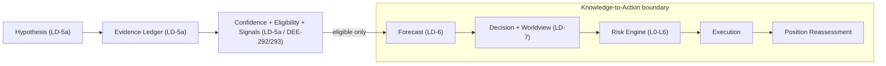

# AI-TRADER — Knowledge-to-Action Doctrine (Knowledge Spine → Trading Intelligence Bridge)

> **Status: Ratified doctrine v1.0 (Knowledge-to-Action / KTA).**
> **Ratified canon (Proposed → Accepted) — see Ratification Statement below.**
> **Subordinate to the [AI-TRADER Market Intelligence Architecture](AI-TRADER-MARKET-INTELLIGENCE-ARCHITECTURE.md) and the [AI-TRADER Master Spec v2](AI-TRADER-MASTER-SPEC-v2.md); peer of the [LD-5a Hypothesis + Evidence Ledger](AI-TRADER-HYPOTHESIS-EVIDENCE-LEDGER.md); bounded by [ADR-0009](../adr/0009-regulatory-posture.md) / [ADR-0010](../adr/0010-strategy-validation-gate.md) / [ADR-0011](../adr/0011-single-operator-governance-model.md) / [ADR-0012](../adr/0012-governance-integration-founders-council-and-english-canon.md). Where this document and any of those conflict, they win.**
> **Additive only — it overrides nothing and weakens no governance gate.**
> **No engines.** This doctrine defines boundaries, ownership, replay obligations, and gate semantics for the layers that turn validated knowledge into auditable action. It adds no automation, no statistical model, no autonomous generation, and **no live-trading path**. Every autonomy clause is inert behind machine-enforced gates (Section 4) until the Section 4.5 preconditions are crossed.

Date: 2026-06-23
Scope: How validated market knowledge (the Knowledge Spine) becomes an auditable trading action — the canonical bridge spanning Forecast, Worldview, Decision, Risk, Execution, Position Reassessment, Challenger, knowledge ownership, the autonomy gate fence, and the trading-account model.
Authority: Subordinate to the [Market Intelligence Architecture](AI-TRADER-MARKET-INTELLIGENCE-ARCHITECTURE.md), the [Master Spec v2](AI-TRADER-MASTER-SPEC-v2.md), the [Vision](AI-TRADER-VISION.md), and [ADR-0009](../adr/0009-regulatory-posture.md) / [ADR-0010](../adr/0010-strategy-validation-gate.md) / [ADR-0011](../adr/0011-single-operator-governance-model.md) / [ADR-0012](../adr/0012-governance-integration-founders-council-and-english-canon.md). **Where this document and any of those conflict, they win.**
Lineage: Canonical output of the full KTA architecture process — Initial Design → Autonomy Review → Hostile Review #1 → Reconciliation (v0.2) → Hostile Review #2 (FAIL) → Repair (v0.3) → Hostile Review #3 (PASS WITH FOLLOW-UPS) → Ratification Review (RATIFY WITH AMENDMENTS) → Ratification Reconciliation (amendments A1–A3, B1–B5). It records final decisions; it does not re-litigate them.

> **Reading note.** This is not a trading strategy and not a capital-allocation doctrine. LD-5a governs how the system *forms and trusts belief*; this document governs how that belief becomes an *auditable action* without weakening any safeguard. The optimization target is **auditability, replay determinism, capital protection, and honesty — never trading profitability.** The machine scores resolvable predictions and applies validated policy within a layered Risk stack; the human authors belief and validates policy; knowledge is global and read-only to tenants while capital is tenant-isolated.

---

## Section 1 — Executive Summary

The Knowledge Spine (LD-5a) can form, validate, and hold belief, but defined no canonical path from belief to action. Two parallel pipelines coexisted without a ratified bridge: the **Knowledge Spine** (Hypothesis → Evidence → Trial → Integrity → Confidence → Eligibility → Signals) and the **Trading Pipeline** (Market Data → Features → MSV → CDE-v0 → strategy → Risk → mock execution). This doctrine is that bridge.

**Resolution principle.** *The human validates the policy and authors belief; the machine scores resolvable predictions and applies validated policy within a layered Risk stack; knowledge is global and read-only to tenants while capital is tenant-isolated; every action is replay-deterministic; and every autonomy clause is dormant behind machine-enforced gates until explicit regulatory and governance preconditions are crossed.*

This document defines: a three-confidence model (Section 1 below), hybrid knowledge ownership with a governed learning path (Section 2), an authority matrix (Section 3), a three-class autonomy gate fence (Section 4), an L0–L6 defense-in-depth Risk stack (Section 5), an advisory independent Challenger (Section 6), position reassessment ownership (Section 7), scalability safeguards (Section 8), the account-centric Trading Account model (Section 9), and the replay/auditability obligations that bind them all (Section 10). It adds no engine and opens no live path.

---

## Section 2 — Role in the Market Intelligence Chain

The canonical knowledge chain (MI Architecture §5), with the KTA bridge bounded:

- **Upstream boundary (Confidence → Forecast).** The Forecast layer reads hypotheses and *eligible* Research Confidence; it never restates or re-judges belief. It snapshots the consumed eligibility verdict, reason-set, as-of instant, and derivation-version-id per LD-5a §5.3.7.
- **Downstream boundary (Execution → market).** Only Execution places orders, only within a Risk allowance. The bridge never bypasses the DEE-178 gate (ADR-0010) and never enables machine self-promotion to capital.
- **Lateral boundaries.** Null Comparators (LD-5b) and Regime-Transition Evidence (LD-5c) remain LD-5a-bounded evidence; this doctrine consumes their outputs but defines neither.

---

## Section 3 — The Three Confidence Model

Three **distinct objects** at three cadences. Only the first is a DEE-292 "Confidence Judgment."

| Object | Question | Cadence | Owner | Representation | Machine? |
|---|---|---|---|---|---|
| **Research Confidence** (LD-5a) | "Do we believe this *hypothesis* is true?" | Slow, per-hypothesis | **Human operator** | **Ordinal band** `{speculative, tentative, supported, strong, compelling}` | **No — human-only (DEE-292/293)** |
| **Forecast Confidence** (LD-6) | "How likely is *this resolvable prediction* over this horizon?" | Per-forecast | Forecast layer | **Probability / distribution over pre-registered scenarios** | **Yes — calibration-scored** |
| **Decision Confidence** (LD-7) | "What Risk-bounded posture does *this action* take?" | Per-decision | Decision layer (validated policy) | **Bounded posture (not a probability)** | **Yes — clamped by Risk** |

**3.1 Non-inflation invariant.** *Conviction is non-amplifying across layers.* A Forecast may be issued only while the Research Confidence it cites is eligible (LD-5a §5.3.7); a Decision's posture may not imply greater conviction than the Forecast Confidence it consumes; Risk may only clamp **downward**, never raise. No layer may manufacture conviction absent from its inputs.

**3.2 Research / Forecast separation [B4].** Research Confidence is ordinal, human-authored, and **never** probabilistic and **never** calibration-scored. Forecast Confidence may cite Research *eligibility* as a precondition gate and cite the Research judgment digest, but **must not modify, re-express, probabilize, or re-score Research Confidence semantics**. The probability is the Forecast layer's own product. A standing governance audit guards against drift toward probabilizing Research. **This preserves DEE-292/293 unchanged.**

**3.3 Calibration validity.**

- **[B1] Regime-conditioned.** Forecast calibration must be partitioned by regime. **Regime-aggregate calibration may not gate decisions**; it may be displayed only when explicitly labeled as aggregate.
- **[B2] Minimum-sample-gated.** Calibration over insufficient resolved samples must be suppressed (an `INSUFFICIENT_CALIBRATION` state analogous to the LD-5a `INSUFFICIENT_EVIDENCE` default); suppressed calibration may not adjust or gate Forecast/Decision Confidence.

A Forecast is **not** a decision and **not** position sizing. A Decision Confidence is **not** a probability — it is a recorded, Risk-bounded posture.

---

## Section 4 — Knowledge Ownership & Learning

**4.1 Hybrid, one-way ownership.**

- **Global (platform/Org-0-owned, tenant-read-only):** Sources, Observations, Measurements, Patterns, Hypotheses, Evidence, Trials, Trial Integrity, **Research Confidence**, Regime knowledge.
- **Tenant-bound:** policy binding, capital allocation, risk profile/envelope, Forecasts-as-consumed, Decisions, positions/orders, trading accounts, kill-switch state.
- **Never crosses tenants:** capital, balances, positions, orders, credentials, risk state, PII.

**Canonical statement:** *Knowledge flows one-way, global → tenant, read-only. Tenants may never write the global spine. Capital and its governance are tenant-isolated.* In MVP, global = Org-0 (ADR-0009); the global/tenant split activates at multi-tenant and is a named future reconciliation.

**4.2 Learning via Knowledge Promotion.** Trade/forecast/decision/null outcomes are recorded **tenant-scoped** and never mutate the global spine. They influence global knowledge only through **operator-gated Knowledge Promotion**, which authors **new Evidence** on hypothesis versions from **aggregated** outcome statistics. Mandatory controls:

- aggregation + anonymization (minimum sample / k-anonymity before promotable);
- per-tenant contribution cap (no tenant dominates a promotion);
- null-comparator anchoring (promotable only against a do-nothing baseline);
- **[B3] multiple-comparisons control** (false-discovery correction across the hypothesis population — null-anchoring is necessary but not sufficient);
- human gate (operator authors the resulting Evidence; nothing auto-promotes).

**4.3 Promotion aggregation replayability [A2].** The Knowledge-Promotion aggregation step is **itself an append-only, versioned, pinned, replayable derivation** capturing: **inputs, as-of time, anonymization seed, and weighting**. Promoted Evidence **references the aggregation derivation by version**, not a bare provenance label. The aggregation is reproducible from its pinned inputs.

---

## Section 5 — Authority Model

| Layer | Recommend | Challenge | Block | Execute | Stop execution |
|---|---|---|---|---|---|
| Research (MI) | surfaces | — | — | — | — |
| Forecast | informs (scored) | — | — | — | — |
| Decision | records intent/action | — | — | — | — |
| Challenger | — | yes (advisory) | never | — | — |
| Risk Engine | — | — | yes (block/clamp/kill) | — | yes |
| Execution | — | — | fail-closed only | yes (only) | honors switch |
| Human Operator | authors belief + validates policy | governs Challenger quality | via gate + kill | — | via kill |
| User | sets envelope | — | own start/stop + own kill | — | own capital only |

Only Execution places orders, only within a Risk allowance; Risk + kill-switch can always stop the machine; the operator owns policy validation and global belief authorship; the user owns the envelope (connect, authorize, mode, capital allocation, risk profile, allowed markets, start/stop) and their own stop — never individual trades.

---

## Section 6 — Autonomy Boundary & Gate System

**6.1 Allowed now (MVP, unchanged):** Org-0-only live; human-gated strategy promotion (DEE-178); paper-first; no external autonomous capital; no autonomous/self-modifying strategies; single-operator governance (ADR-0011).

**6.2 Three gate classes.**

| Class | Definition | Change requires |
|---|---|---|
| **Doctrine gate** | Prose canon; may only constrain | Doctrine edit |
| **ADR gate** | Precondition bound to a ratified ADR; gate-state = ADR status | Founders Council ratification (ADR-0012) |
| **Technical gate [A3]** | **Machine-enforced** (signed artifact, CI enforcement, runtime default-deny). **A process-only gate is not a technical gate.** | Code/deploy change + referenced Accepted ADR + Council signature |

Every autonomy precondition must be **all three at once**; weakening any requires two independent, logged actions by different authorities (an ADR change by the Council *and* a code change).

**6.3 Technically unreachable, defined.**

- No feature flag flips paper → autonomous-live-multi-tenant.
- The capability is gated behind a build/deploy artifact that **references the Accepted ADR IDs and a Founders Council ratification record**, machine-verified at build/deploy/runtime.
- **Default-deny / fail-closed:** absence of explicit signed authorization = blocked.

**6.4 Gate-governing ADR protections [B5].** Any ADR that defines or relaxes an autonomy gate requires: **independent ratification** (Founders Council, ADR-0012), a **cooling-off period**, and **anti-self-fast-track protection** (the authoring party may not unilaterally accelerate acceptance; recusal applies).

**6.5 Autonomy preconditions (all required before any autonomy clause deploys):**

1. ADR-0009 → Accepted (Cleared) — external capital.
2. New governance ADR superseding single-operator assumptions for autonomous multi-tenant.
3. ADR-0010 / DEE-178 extension → "policy autonomous-operation authorization" with re-validation cadence.
4. **Systemic safeguards live** — the Section 7 stack **plus the explicitly enumerated multi-tenant risks: output monoculture, behavioral herding, and promotion-codified shared blind spots** (named gate conditions, not subsumed under concentration limits).
5. Calibration (LD-6b) live, regime-conditioned and sample-gated, with auto-suspension on decay.
6. Operational governance — incident response, decentralized Knowledge-Promotion, scalable billing/dispute tooling.
7. Independent security/pen-test of the execution+credential path; PII/data-residency clearance; kill-switch tested under load; capital-reserve/insurance/liability gate.

No MVP control may be relaxed to advance autonomy.

---

## Section 7 — Defense-in-Depth Risk Stack

Risk is **final-but-not-sole**. Independent, fail-closed layers:

- **L0 — Policy validation gate (DEE-178):** only validated policies run.
- **L1 — Decision envelope constraint:** a decision cannot propose outside the tenant envelope (eligibility + allocation + allowed markets).
- **L2 — Per-tenant Risk Engine:** position/loss/drawdown/exposure limits; deterministic; fail-closed if Risk is unavailable.
- **L3 — Global/platform Risk:** cross-tenant concentration, correlation, aggregate-exposure, and market-impact/capacity caps.
- **L4 — Kill-switch hierarchy:** global → tenant → account → strategy → instrument; auto + operator + admin + user; **staggered/rate-limited enforcement** to prevent synchronized mass-exit.
- **L5 — Execution fail-closed + exchange-side caps** (notional/rate), independent of Risk.
- **L6 — Reconciliation monitor:** independent; can trip kill-switch; **fails closed (halt) on loss of its data source**, never fails open.

**7.1 Data-quality interlock.** The MI data-quality score is a **first-class Risk input**; below threshold ⇒ no-new-entry / close-only.

**7.2 Anti-cascade.** Hysteresis on eligibility-driven close-only; staggered exit execution; per-tenant netting. **Exit ordering is a deterministic, pre-published, non-discretionary policy** (e.g., pro-rata or time-priority) — no human picks winners.

**7.3 Independence requirement.** Risk layers must not share a single common-cause dependency for trip authority; at least one layer must use an independent data path or fail closed. Risk never re-judges belief; policy sizing must be independent of (not pinned to) the Risk ceiling.

---

## Section 8 — Challenger

- **Purpose:** structural adversarial dissent against forecasts and decisions; surfaces disconfirming evidence, null-comparator failures, and named invalidation/regime scenarios.
- **Independence:** a distinct, governed derivation that weights AGAINST evidence and out-of-policy scenarios; must not share the Decision's policy/model; **must audit evidence completeness and flag missing sources** (mitigates shared blind spots).
- **Authority:** advisory only — **never gates** (MI §11 preserved). Content-validated dissent (must cite specific Evidence entries or named scenarios; free-text fails) is a required Decision input; the Decision policy records rebuttal/acceptance per point.
- **Quality measurement:** by **outcome attribution vs null comparator** (did challenged actions fail more), **not** override-rate. **Override-rate is never a target** (avoids Goodhart / dissent-theater).
- **Limitations (acknowledged):** cannot block; cannot see beyond recorded evidence; requires human meta-governance on a governance cadence (periodic red-team of the Challenger itself).

---

## Section 9 — Position Reassessment

- **Detects:** Position Monitor (mechanical — eligibility flip, forecast-invalidation, stop-loss) + Challenger (interpretive dissent).
- **Reassesses:** Decision Engine applies the validated Reassessment Policy (machine), within envelope + Risk, snapshotting inputs + policy version (replayable).
- **Escalates:** to human **by exception only**; exception-rate is a monitored SLO.
- **Exits:** Decision (autonomous, within policy/Risk) or Risk (enforced breach: close-only/stop).
- **"Thesis is broken" authority:** mechanical → Position Monitor surfaces, Risk may enforce; interpretive → validated Reassessment Policy applies (machine); **human owns the policy, not the instance**; capital breach → Risk. Section 7 anti-cascade safeguards are mandatory at scale. No uncontrolled autonomous live liquidation; paper-first and audit-first.

---

## Section 10 — Scalability

Human authority is at **policy level only**; oversight is exception-based with SLOs. Mandatory safeguards (fenced as autonomy preconditions where multi-tenant): staged/canary policy + strategy rollout; ops org + incident runbooks + on-call (not a single operator); **decentralized Knowledge-Promotion review** (de-concentrates operator bias/bottleneck); preserved-but-batch-tooled manual billing gate; dispute tooling; global circuit breakers; capacity/market-impact monitoring. Deep-chain replay feasibility is a performance reconciliation (correctness preserved). All remaining bottlenecks are MVP-inert and fenced — limitations, not defects.

| Scale | Doctrine valid? | Note |
|---|---|---|
| 10 | Yes | Within MVP posture. |
| 100 | Yes | Promotion/calibration governance operator-feasible. |
| 1000 | Yes, fenced | Promotion gate + deep-chain replay become bottlenecks; fenced as autonomy conditions. |
| 10000 | Yes, fenced | Single-operator governance replaced by governance ADR; circuit breakers + capacity limits mandatory. |

---

## Section 11 — Trading Account Doctrine

**Canonical model:** `User → Exchange Connection → Trading Account → Positions`.

- **Exchange Connection** — credential/auth/throttle boundary: `{ venue, apiKey scope, permissions, rate-limit bucket, IP allowlist, status }`.
- **Trading Account** — risk/execution unit: `{ accountModel: separated | unified, balances, positions, allocations, riskProfile, killSwitchState }`.
- **`marketType` (spot/futures)** lives at the **position/sub-ledger** level, not account identity. `accountModel` declares collateral semantics: **separated** (HTX-style, isolated per market type) vs **unified** (Binance/Bybit Unified, shared collateral pool).

**Rationale.** Credentials live at the Connection layer; risk/execution at the Account layer; market type at the position layer. This survives multi-exchange and unified margin without schema collapse because market type is not baked into account identity.

**Implications:**

- **User UI:** `User → Connections → Accounts → Positions`; allocation/risk/start-stop at the account level; shared-collateral warning for unified accounts.
- **Admin UI:** rollup hierarchy `tenant → connection → account → position`; aggregate exposure by underlying across all accounts/connections.
- **Risk:** per-account margin model (isolated vs cross) + global per-underlying aggregation (L3).
- **Execution:** connector resolved from the Connection (venue); order semantics from position marketType + accountModel.
- **Multi-exchange expansion:** each venue is a connector; the Connection isolates venue specifics.

Futures/margin remains Post-MVP (Implementation Program §9); the model is forward-compatible with futures as a reserved capability, requiring its own risk-doctrine extension before enablement.

---

## Section 12 — Replay & Auditability

**12.1 Universal as-of rule.** Every issued/derived confidence and decision applies the LD-5a `ingest_time <= T` visibility rule to **all** cited inputs, and pins explicit input content digests + derivation version. Replay at `T` admits only records with `ingest_time <= T` at the pinned versions — deterministic, with no future leakage (Accountability Truth + Research Truth preserved).

**12.2 Storage vs derivation.** Anything that drives an external action or is a calibration ground-truth is **stored immutably at issuance** (Research judgment, Forecast probability at issuance, Decision posture); current-state interpretations (eligibility, signals, calibration aggregates) are **derived**. This mirrors DEE-293.

**12.3 Calibration snapshot pinning [A1].** Where a Decision consumes **calibrated** Forecast Confidence, the **calibration snapshot version** is a **pinned replay input alongside the Forecast digest and derivation version**. Replay of the Decision reconstructs the identical calibration state as-of decision time; calibration evolution after the decision cannot alter the replayed value.

**12.4 Promotion provenance.** Promoted Evidence is replayable via the pinned aggregation derivation (§4.3).

---

## Section 13 — Future Layer Interfaces (reserved seams)

This doctrine constrains, but does not implement, the following layers. Each is a downstream dependency.

- **LD-5b Null Comparator** *(indirect dependency)* — upstream evidence; §4.2 uses null outcomes as a promotion anchor. Bounded by LD-5a.
- **LD-5c Regime-Transition Evidence** *(indirect dependency)* — feeds the regime context §3.3 calibration consumes. Bounded by LD-5a.
- **LD-6 Forecast** *(direct dependency)* — record/horizon/scenario/probability/calibration + snapshot obligations defined by §3 and §12.3.
- **LD-7 Decision + Worldview** *(direct dependency)* — whyNotCash, entry/TP/SL/invalidation theses, snapshots, allocation interlock, non-inflation invariant, Risk handoff defined by §3, §5, §9.
- **Position Reassessment** *(direct dependency)* — detect/reassess/escalate/exit ownership defined by §9.
- **Risk Engine / Kill-Switch** *(direct dependency)* — L0–L6 stack + kill hierarchy defined by §7.
- **Admin / User UI** *(indirect dependency)* — account-centric model (§11) and read-model boundaries shape UI; UI does not reopen doctrine.
- **Multi-Exchange Expansion** *(indirect dependency)* — Model C (§11) absorbs venue differences.
- **Multi-tenant autonomy** *(direct, gated dependency)* — §6.5 enumerates the binding preconditions.

---

## Open Questions (deferred implementation contracts — Class C)

These do not block the doctrine; each is owned by its implementation slice:

1. **Calibration scoring method** and decay/auto-suspension thresholds (LD-6b).
2. **Forecast Confidence representation** (band/distribution vocabulary, scenario weighting) and whether it shares the LD-5a derivation registry.
3. **Global-knowledge persistence model** (platform knowledge org vs schema change) and tenant read-projection mechanics.
4. **Decision / Reassessment Policy** object shape and its versioning/gate semantics.
5. **Grandmaster numeric ↔ ordinal reconciliation** (`WSR − k·RD` ↔ ordinal bands) for Forecast/Decision Confidence.
6. **Intra-unified-account risk granularity**, exchange sub-accounts, and portfolio/cross-collateral margin (futures-fenced).
7. **Deep-chain replay performance** at 1000+ positions (correctness preserved; feasibility deferred).

---

## Accepted Limitations

The following are **accepted doctrine limitations**, not defects to be fixed here:

- **MVP single-tenant collapse.** In MVP, global = Org-0; the global/tenant ownership split is dormant until multi-tenant and is a named future reconciliation.
- **Autonomy clauses inert.** All autonomy clauses (Sections 4.2, 6, 7 L3, 9 machine reassessment at scale) are dormant behind §6.5 gates; this doctrine enables no live autonomous path.
- **Challenger common-cause.** A gap in recorded evidence blinds Decision and Challenger alike; mitigated by the completeness audit (§8) and human meta-governance, not eliminated.
- **Promotion bias.** Operator selection bias and output monoculture/herding are controlled (§4.2) but fully resolved only by the §6.5(4) and §6.5(6) autonomy preconditions.
- **Futures deferred.** Unified-margin/leverage risk granularity is reserved (§11), not designed in MVP.

---

## Ratification Statement (v1.0 — KTA-1.0 / DEE-294)

This document is the **ratified canonical doctrine for the Knowledge-to-Action bridge**. It reflects the finalized decisions of the full KTA architecture process (Initial Design → Autonomy Review → Hostile Review #1 → Reconciliation → Hostile Review #2 [FAIL] → Repair v0.3 → Hostile Review #3 [PASS WITH FOLLOW-UPS] → Ratification Review [RATIFY WITH AMENDMENTS] → Ratification Reconciliation) and is authoritative for all future Knowledge-to-Action implementation planning, issue decomposition, architecture reference, audit, and architect onboarding.

It incorporates ratification amendments **A1** (calibration snapshot pinning, §12.3), **A2** (promotion aggregation replayability, §4.3), **A3** (technical gate definition, §6.2–§6.3), and **B1–B5** (regime-conditioned calibration §3.3, minimum-sample-gated calibration §3.3, multiple-comparisons promotion control §4.2, Research stays non-probabilistic §3.2, gate-ADR protections §6.4).

> **Canonical statement:** *The Knowledge-to-Action Doctrine is the canonical bridge between the Knowledge Spine and Trading Intelligence.*

**Governance validation.** Verified consistent with [DEE-284](AI-TRADER-HYPOTHESIS-EVIDENCE-LEDGER.md) (Hypothesis), DEE-290 (Trial Integrity), DEE-292 (Confidence Judgment Doctrine), DEE-293 (Confidence Judgment Implementation), and [ADR-0009](../adr/0009-regulatory-posture.md) / [ADR-0010](../adr/0010-strategy-validation-gate.md) / [ADR-0011](../adr/0011-single-operator-governance-model.md) / [ADR-0012](../adr/0012-governance-integration-founders-council-and-english-canon.md): Research Confidence remains human-authored, ordinal, and non-probabilistic; the DEE-178 gate is preserved as L0; no governance gate is weakened; no new live-trading path is introduced; no machine self-promotion is enabled. Ratification introduces **no new obligations** beyond the cross-layer conditions already implied for LD-6/LD-7 (snapshot honoring) and Risk Engine consumer contracts.

Decisions herein are final unless a future contradiction with superior canon is discovered, in which case the conflict resolves upward to the Market Intelligence Architecture and the ADRs, and any change lands as a new ratified version of this document.

---

*End of doctrine. This document is subordinate to the Market Intelligence Architecture and the Master Spec, additive to the system, and introduces no new governance.*
