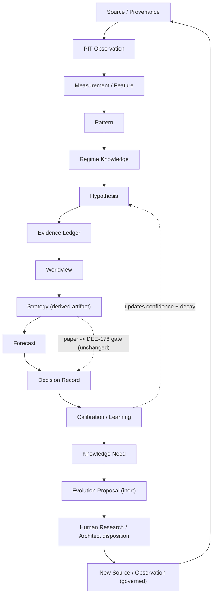

# AI-TRADER — Market Intelligence Architecture (Knowledge-First Doctrine)

> **Status: Accepted doctrine v1.0 (Market Intelligence Architecture v2).**
> **Ratified canon (Proposed -> Accepted) — see Ratification below.**
> **Subordinate to the AI-TRADER Master Spec and ADR-0009 / ADR-0010 / ADR-0011.**
> **Additive only — it overrides nothing and weakens no governance gate.**
> **No engines in the MVP.** The MVP delivers persisted records, registers, read-models, and read-only views; it adds no automation, no autonomous generation, and no new live-trading path.

Date: 2026-06-21 (authored) · Ratified: 2026-06-22
Scope: How AI-TRADER acquires, represents, validates, retains, applies, and improves market knowledge — and how it safely recognizes the limits of that knowledge.
Authority: **Subordinate** to the [WAIA Core Architecture](../waia-core/WAIA-CORE-ARCHITECTURE.md), the [AI-TRADER Master Spec v2](AI-TRADER-MASTER-SPEC-v2.md), the [AI-TRADER Vision](AI-TRADER-VISION.md), [ADR-0009](../adr/0009-regulatory-posture.md), [ADR-0010](../adr/0010-strategy-validation-gate.md), and [ADR-0011](../adr/0011-single-operator-governance-model.md). It is a peer of the [Grandmaster Strategy Framework](AI-TRADER-GRANDMASTER-STRATEGY-FRAMEWORK.md) and is bounded by the same constraints. **Where this document and any of those conflict, they win.**

Ratification: **Accepted 2026-06-22** by the **WAIA Architect** (single operator, [ADR-0011](../adr/0011-single-operator-governance-model.md)), following the Doctrine Ratification Review (recommendation **C — Ratify Now**). The doctrine was verified consistent with the [Master Spec v2](AI-TRADER-MASTER-SPEC-v2.md), [Vision](AI-TRADER-VISION.md), [Grandmaster Framework](AI-TRADER-GRANDMASTER-STRATEGY-FRAMEWORK.md), DEE-178, and [ADR-0009](../adr/0009-regulatory-posture.md) / [ADR-0010](../adr/0010-strategy-validation-gate.md) / [ADR-0011](../adr/0011-single-operator-governance-model.md): no governance gate is weakened, no new live-trading path is introduced, no machine self-promotion is enabled, and the un-retrofittable foundations are locked. This document is now canonical, subordinate, and additive; it supersedes nothing.

> **Reading note.** This is not a trading strategy and not a capital-allocation doctrine. It is the doctrine for the **knowledge** that strategies are compiled from. Its companion, the Grandmaster Framework, governs *which strategies deserve capital*; this document governs *how the system forms and trusts what it believes about markets in the first place*. The optimization target is **knowledge quality, evidence quality, explainability, survivability, and robustness — never trading profitability.**

---

## 1. Purpose

AI-TRADER must stop being a strategy executor and become a **market intelligence system**: a system that continuously discovers, validates, stores, ranks, improves, and retires market knowledge over time.

The central thesis:

> **Strategy is not the source of truth. Strategy is a derived, disposable artifact compiled from validated market knowledge.** The source of truth is the knowledge stack.

This document persists the approved architecture (Market Intelligence Architecture v2), the approved input design (Market Data Universe), and the approved self-improvement design (Evolution Governance) into a single canonical doctrine. It introduces **no new architecture**; it inscribes what a full-system audit found coherent.

---

## 2. Relationship to Master Spec and ADRs

- **Subordinate and additive.** This doctrine sits beneath the Master Spec v2 and the ADRs and adds nothing that overrides them. Every object and flow it defines is additive to the existing system.
- **Governance is untouched.** The [Strategy Validation Gate](../adr/0010-strategy-validation-gate.md) (DEE-178) remains governance-only and operator-judged with no fixed numeric thresholds. The [Single Operator Governance Model](../adr/0011-single-operator-governance-model.md) — immutable audit, cooling-off, explicit confirmation, reversibility — is unchanged. The [regulatory posture](../adr/0009-regulatory-posture.md) (Org-0-only live; external client live trading prohibited by policy) is unchanged.
- **Lifecycle mapping.** The Master Spec §9 strategy lifecycle (`DRAFT → RESEARCHING → BACKTESTING → VALIDATED → PAPER_TRADING → LIVE_* → PAUSED → RETIRED`) is preserved. The knowledge stack feeds the **front** of that lifecycle; the DEE-178 gate sits **unchanged** between `PAPER_TRADING` and `LIVE_*`.
- **Peer doctrine.** The [Grandmaster Strategy Framework](AI-TRADER-GRANDMASTER-STRATEGY-FRAMEWORK.md) governs strategy validation, rating, promotion, and retirement. This document governs knowledge formation. The two meet at a single clean handoff: **Hypothesis → Strategy → Gate**.

---

## 3. Core Principles

1. **Knowledge-first.** The persisted knowledge stack — not a strategy catalog — is the source of truth. Strategies are compiled projections of validated knowledge and are disposable.
2. **Absence of evidence is failure, never neutral.** A claim with no evidence does not earn capital or confidence.
3. **Edge is always relative and net of cost.** Every claimed edge is measured against mandatory null comparators, net of a conservative cost-and-fee model.
4. **Confidence is honest.** In the MVP, confidence is a recorded operator judgment plus an explicit uncertainty band with decay — never a computed probability dressed as precision.
5. **Everything is append-only and reproducible.** Evidence, forecasts, and decisions are immutable; revisions are appended; nothing is silently overwritten or deleted.
6. **The machine researches; the human promotes.** No machine self-promotion to capital, ever. Self-awareness of limitations is the authority to *speak*, never to *act*.
7. **The system can always decline to trade.** Cash is a valid, often correct, position; restraint is scored as a positive outcome.
8. **Provenance is a precondition for evidence.** A datum with no verifiable timestamp and revision history cannot become evidence.

---

## 4. Market Intelligence Philosophy

The system is an epistemic engine, not a signal generator. It earns beliefs slowly, holds them with explicit uncertainty, lets them decay, and retires them honestly. It prefers the smallest sufficient set of inputs, the fewest sufficient hypotheses, and the narrowest defensible claims, because **every added input, pattern, and hypothesis widens the surface for false discovery.** Restraint in what the system observes and believes is the same virtue as restraint in when it trades.

Three firewalls protect the epistemology:

- **Evidence / Narrative firewall** — narrative (the Research Journal) can inspire a human but can never be evidence.
- **Proposal / Action firewall** — self-improvement proposals are inert records; only a human actuates them.
- **Author / Approver firewall** — the system authors; only the single operator approves; only humans implement.

---

## 5. Canonical Knowledge Lifecycle

The canonical chain — normalized per the audit — and its **human-broken feedback loop**:

`Source / Provenance → PIT Observation → Measurement → Pattern → Regime Knowledge → Hypothesis → Evidence Ledger → Worldview → Strategy → Forecast → Decision Record → Calibration → Knowledge Need → Evolution Proposal → Human Research → New Observation`

The loop is **closed but broken by a human**: the only bridge from `Knowledge Need` to a real change is `Human Research` — a single-operator action under ADR-0011. Nothing in the loop grants the machine authority to modify code, schema, data connections, governance, or capital.

---

## 6. Data Universe (what AI-TRADER observes)

The system observes the **smallest, strongest** set of inputs sufficient to generate, validate, and improve knowledge. More data is a liability until each stream earns validated, point-in-time-clean, explainable evidence. The richest, cleanest data the system owns is **internal** — its own orders, fills, rejections, forecasts-and-resolutions, regime transitions, and execution quality — because it is point-in-time-perfect, unmanipulable, and fully explainable.

### 6.1 Source tiers

- **Tier A — Must-have:** internal telemetry (orders/fills, forecasts+resolutions, rejections/risk events, regime transitions, execution quality, data-quality/reconciliation); BTC/ETH OHLCV; realized volatility; bid-ask spread + L1 + realized slippage; fee schedule + instrument reference; macro **calendar** (timing only, for abstain windows); stablecoin peg status.
- **Tier B — High-value context (regime knowledge, not signal):** L2 depth/imbalance; exchange net flows; BTC dominance; cross-asset regime context (DXY, equities); derivatives **as context-read** (funding, open interest, implied vol); scheduled crypto events; ETF flows; Fear & Greed; structured news/regulatory event feed.
- **Tier C — Research-only (quarantined behind validation):** on-chain valuation (MVRV/SOPR), active addresses, whale/miner flows, cross-venue basis, options skew/term, positioning (COT), social sentiment, search trends, prediction markets, global-liquidity series.
- **Tier D — Avoid (cannot pass the Source/Provenance gate as signal):** raw social-media sentiment as signal, influencer/signal-group calls, AI-generated news summaries, any feed without a verifiable timestamp and revision history, vendor indicators with undisclosed methodology.

### 6.2 Dangerous sources

The trap pattern is constant: **high narrative appeal + weak provenance + high manipulability + non-stationarity + low explainability.** The most insidious for WAIA is **AI-generated news/summaries**, which inject look-ahead, hallucinate causation, and destroy provenance while appearing authoritative. They are rejected as signal and admitted only as clearly-labeled, human-reviewed Research-Journal notes — never as evidence. The deepest red-team finding is that **data abundance is itself a false-discovery risk**: the smallest sufficient universe is the safest.

### 6.3 Observation universe by era

- **MVP:** Tier A only, plus three cheap context flags (stablecoin peg, Fear & Greed, macro calendar). Emphasis on internal + price + cost. Macro/on-chain/multi-venue are reserved as fields only.
- **DEE-178 era:** add Tier-B regime-context streams that make the gate's ">1 regime" criterion real (derivatives-as-context, cross-asset regime labels, scheduled events).
- **Post-MVP:** add capital-flow and on-chain streams; derivatives may graduate from context to candidate signal only behind full validation.
- **Grandmaster era:** the full universe with source-consensus/provenance reconciliation; Tier-C/sentiment admitted only as features behind the validation stack and the false-discovery budget. **Tier D never becomes a signal at any era.**

### 6.4 Seam clarification — context-read data (audit fix #2)

> **Context-read data sources — news, sentiment, derivatives context, macro context, and similar — may influence Regime Knowledge and Worldview as *context*, but they are NOT Evidence Ledger signal sources in the MVP.** They help label regimes and trigger abstention; they do not constitute evidence for or against a hypothesis, and they cannot place or size a trade. Promotion of any context-read source to a validated signal is a Post-MVP action behind the full validation stack.

---

## 7. Knowledge Objects

Each layer is one persisted object with a stable id, an upward lineage reference, and exactly one execution-label owner. The "is / is-not" boundary prevents object overlap.

| # | Object | IS | IS NOT | MVP |
|---|--------|----|--------|-----|
| 0 | Source & Provenance | where a datum came from + trust + revision history | the datum's value | yes |
| 1 | PIT Observation | a value as it was knowable at `eventTime` | a revised/derived value | yes |
| 2 | Measurement / Feature | a versioned transform definition; evidence pins a version | a raw observation or a claim | yes (registry + fields) |
| 3 | Pattern | "this structure recurs" (no tradeability claim), trial-budget tracked | a belief that it pays | yes (record/discipline) |
| 4 | Regime Knowledge | `RegimeModel` + `RegimeTransition` evidence (validated, decaying) | a live MSV label (that is an input it studies) | yes (record transitions only) |
| 5 | Hypothesis | a falsifiable, regime-scoped, relationship-typed claim with a prior + mandatory nulls | a strategy or a pattern | yes (the atom) |
| 6 | Evidence Ledger | append-only evidence FOR/AGAINST a hypothesis, pinned to a measurement version | narrative or opinion (that is the Journal) | yes (the spine) |
| 7 | Worldview | the current coherent stance + explicit conflicts among hypotheses | an opaque optimizer | yes (record-only) |
| 8 | Strategy | a compiled projection declaring its hypothesis + thesis dependencies | the source of truth | yes (retro-fit one) |
| 9 | Forecast | a pre-registered, immutable, scored prediction | a decision or an order | yes (flagship) |
| 10 | Decision Record | the explainable record of an action incl. `whyNotCash` + evidence for/against + challenger dissent | a forecast | yes |
| 11 | Calibration / Learning | survivorship-aware scoring of resolved forecasts feeding confidence/decay | an auto-sizing engine in MVP | yes (scorecard) |

### 7.1 Hypothesis — the cognitive atom

A Hypothesis is **regime-scoped**, carries an explicit `relationshipType` (`correlational | predictive | causal-conjecture`), an explicit prior, **mandatory null comparators by type**, and pre-registered falsification/invalidation conditions. Its lifecycle: `PROPOSED → VALIDATING → VALIDATED → DECAYING → RETIRED | QUARANTINED`. **Confidence is a recorded ordinal judgment plus an uncertainty band — not a computed probability** in the MVP. Causal claims are flagged speculative and demand far more evidence; a causal graph is Long-term only and never authoritative for sizing.

> See also (non-authoritative): the ratified [LD-5a Hypothesis + Evidence Ledger doctrine](AI-TRADER-HYPOTHESIS-EVIDENCE-LEDGER.md) elaborates this object.

### 7.2 Pattern — structure without a claim

A Pattern records that a structure recurs. It makes **no claim that it pays**, tracks a trial-budget counter, and auto-archives if it goes unreferenced. Patterns become beliefs only by being promoted into Hypotheses, where they meet nulls and pre-registration.

### 7.3 Null comparators (mandatory, by hypothesis type)

- **always-flat / cash** — mandatory for ALL hypotheses (the survival baseline behind `whyNotCash`).
- **buy-and-hold** — mandatory for any directional/long-biased hypothesis (must beat passive net of cost + fee).
- **simple-trend baseline** (single MA filter) — mandatory for any trend-edge claim.
- **random-entry with matched exposure** — mandatory for any timing/entry-edge claim.

All are computable from OHLCV in paper/replay. **A required null missing → automatic gate rejection.** The null set is fixed by hypothesis *type*, not by available data, so adding data can never make a null easier to beat.

---

## 8. Evidence Ledger

The Evidence Ledger is the **append-only, immutable spine** of the system. It records evidence **for and against** each hypothesis, every entry provenance-stamped and pinned to a measurement version.

- **Confidence revision** is a recorded operator judgment with **decay-to-prior on staleness**; a binary kill is reserved for a structural break, which routes to the kill switch.
- A **manually-maintained false-discovery / trial register** (not an engine in the MVP) tracks how many things have been tested, controlling the forking-paths problem.
- **Forward-locked pre-registration** is the MVP-safe holdout proxy: a hypothesis, its parameters, and its falsification conditions are committed **before** the paper window opens; the unseen future is the holdout. Any mid-window parameter change is a new pre-registration and a new window (logged). A sealed historical holdout becomes available Near-term when replay/backtest exists.
- **Invalidation propagation:** when a source or measurement is revised, dependent evidence is flagged for re-examination.
- The current-state view is a **materialized read model** over the immutable event log.
- **Firewall:** the Research Journal (notes, rejected ideas, postmortems) can *reference* the Ledger but can **never be evidence**; the gate ignores the journal entirely.

> See also (non-authoritative): the ratified [LD-5a Hypothesis + Evidence Ledger doctrine](AI-TRADER-HYPOTHESIS-EVIDENCE-LEDGER.md) elaborates this object and its four record types.

---

## 9. Worldview

The Worldview is the system's current coherent stance, assembled from its hypotheses. It is **record-only and fully inspectable** in the MVP — there is no optimizer.

- It stores the **contributing hypotheses** (with judged confidence + band) and an explicit **`conflicts[]`** list (A implies X vs B implies not-X). Conflicts are represented explicitly and **never silently netted**.
- **Uncertainty reduces sizing by a deterministic rule:** an unresolved conflict widens the effective uncertainty band → lowers the confidence lower-bound → smaller size, clamped by Risk Engine caps.
- A Worldview arbitration engine is Near/Long-term and, when built, must remain a **deterministic, inspectable function** — never a black box.

---

## 10. Forecast Protocol

A Forecast is a **pre-registered, immutable, scored prediction** — the system's flagship epistemic act.

- It records: regime, links to evidence for/against, an `expectedMove` magnitude band, a confidence value with band, invalidation conditions, and a holding period.
- Its **resolution is appended** (never overwritten) and scored.
- Forecasts are **predictions, not decisions or orders.** They exist to be scored, whether or not any trade follows.

---

## 11. Decision Protocol

A Decision Record is the **explainable record of an action** (including the action "do nothing").

- It records **why** a position was opened, **why now**, **why this size**, **why this asset**, with a **mandatory `whyNotCash` counterfactual** and **both** `evidenceFor` and `evidenceAgainst`.
- It binds to the governing Forecast and carries the **Challenger dissent**.
- **Challenger (anti-checkbox):** dissent is a required, content-validated field — it must cite specific Evidence-Ledger entries against, or a named invalidation scenario/regime; free-text "looks risky" fails validation. The operator must explicitly **rebut or accept each** dissent point in the promotion record. A **dissent-override-rate** is tracked and surfaced (always overriding is a governance smell). In the MVP the Challenger is the operator wearing the skeptic hat under these structural constraints; machine devil's-advocate generation is Near-term. **The Challenger never gates; only the operator gates.**

### 11.1 Seam clarification — calibration → sizing (audit fix #1)

> **Calibration-driven sizing adjustments must remain inside Risk Engine validated bounds.** Any sizing change beyond validated bounds creates a **new version** and requires **re-validation through DEE-178**. **No bypass is allowed.** Authorization binds to a specific version; a code or knowledge change that compiles a new Strategy version re-opens the gate.

---

## 12. Calibration

Calibration is the **survivorship-aware scoring of resolved forecasts** that feeds confidence and decay.

- It uses **proper scoring** (Brier/log) that rewards both **calibration and sharpness**; sample size is always shown.
- **Dead hypotheses' forecasts are retained** in headline metrics (no survivorship flattery).
- A **survival-first scorecard** scores correct abstention as a positive outcome, mitigating the performance-fee-vs-restraint incentive conflict (ADR-0008 unchanged).
- Calibration feedback into sizing is a Near-term capability and, when added, is bound by §11.1.

---

## 13. Evolution Governance

The system must be able to recognize what it does not know and **ask for help**, while remaining unable to modify itself. **The objective is self-awareness of knowledge limitations, never self-modification.**

### 13.1 Knowledge Need — the atom of self-awareness

A **Knowledge Need** is a detected, evidence-grounded statement that the system's ability to form or trust knowledge is bounded in a specific, auditable way. It is **observed, not invented**, and it **proposes no remedy**. Types include: missing regime context, insufficient sample, contradictory evidence, unresolved pattern, missing observation type, stale evidence, and null-dominated claim. Each Knowledge Need references the exact evidence that generated it (so it is auditable and can auto-close when the gap fills). A Knowledge Need that cannot point at concrete evidence is invalid.

### 13.2 Evolution Proposals — inert remedy requests

Remedies are **separate child objects** of one or more open Knowledge Needs, sharing a common append-only parent (`EvolutionProposal`). The kinds:

- **Data Need Proposal** — proposes new market/macro/flow/news/sentiment/internal data. Requires a parent Knowledge Need, proof the gap is information-bounded (not method-bounded), a pre-registered falsifiable hypothesis the data would enable, **provenance feasibility**, and a false-discovery-budget acknowledgment. The bar scales by source danger (internal lowest; news/sentiment highest and default-quarantined).
- **Hypothesis Expansion Proposal** — targets a specific empty/weak cell on the regime × relationship-type coverage map, arrives with its mandatory null and pre-registration, is deduplicated/merged against existing hypotheses, and must **displace a weak one** rather than accumulate. Conflicts produce **discriminating experiments**, not third hypotheses. This prevents strategy sprawl by construction.
- **Research Program Proposal** — requests a dedicated investigation, validation campaign, additional paper soak, or data-quality audit. It **feeds DEE-178; it never bypasses it.** The system proposes; humans run.
- **Schema Change Proposal** — **additive-only** (new observation/entity/evidence type/attribute; never modify or remove). Highest evidence bar of all proposal kinds; default disposition **defer**; requires sustained, repeated evidence, cooling-off, and a human-authored ADR. Frequent schema proposals are an architecture-smell and are surfaced as such.

### 13.3 The three firewalls and the no-reward rule

- **Proposal / Action firewall:** every proposal is an **inert, append-only record**. It cannot change code, schema, data connections, gates, or capital. The only actuator is a human in the governed SDLC.
- **Author / Approver firewall:** the system authors; only the single operator dispositions; only humans implement. The system has **zero approval and zero write scope.**
- **Evidence / Narrative firewall:** auto-generated needs must cite the Evidence Ledger, not the Research Journal.
- **No reward from approval:** the system gains **nothing** from a proposal being accepted — disposition is never fed back as an objective. This is the primary anti-Goodhart guarantee.

Proposals are **evidence-triggered by deterministic rules** (not free generation), deduplicated, rate-limited, false-discovery-budgeted, and severity-ranked. The **MVP delivers records, firewalls, and a read-only operator panel only** — autonomous detection is Near-term and assisted generation is Long-term, both still human-approved.

### 13.4 Seam clarification — Architect authority (audit fix #3)

> **The "Architect" approval authority referenced throughout Evolution Governance IS the ADR-0011 single operator.** No new governance actor exists. Every disposition (Accept / Defer / Reject) is a single-operator action under ADR-0011 — explicit confirmation, immutable audit, cooling-off for high-impact (schema) proposals.

---

## 14. Grandmaster Integration

This doctrine and the [Grandmaster Strategy Framework](AI-TRADER-GRANDMASTER-STRATEGY-FRAMEWORK.md) are **complementary peers** that meet at one handoff: **Hypothesis → Strategy → Gate**.

- **This doctrine governs** knowledge formation (Source … Calibration) and self-improvement (Evolution).
- **Grandmaster governs** the validation stack (L0–L9), the promotion ladder, the WSR/RD rating, retirement dynamics, the Genome, and the evolution epochs.
- **Confidence reconciliation:** the MVP's recorded ordinal judgment + band + decay is the same quantity that Grandmaster's `WSR − k·RD` formalizes numerically Post-MVP. The numeric rating engine is Long-term; it changes the *representation* of confidence, never the governance structure.
- **Shared invariant:** the machine researches, simulates, paper-trades, shadows, and *recommends*; **the machine never self-promotes to capital** (Grandmaster Epoch 4). No epoch removes a safety control or shortens the promotion ladder.

---

## 15. DEE-178 Integration

- **Every path to capital passes through the [Strategy Validation Gate](../adr/0010-strategy-validation-gate.md) (DEE-178), unchanged.** The knowledge stack feeds the front of the strategy lifecycle; the gate sits between `PAPER_TRADING` and `LIVE_*`.
- **Hypothesis linkage (backward-compatible):** the promotion record's `hypothesis` / `intendedRegime` fields may reference real Hypothesis record ids; free text is still accepted during transition. Gate governance, cooling-off, reversibility, thresholds, and the operator's written judgment are **unchanged**.
- **No indirect bypass exists:** Evolution Proposals, Worldview stance changes, and calibration-driven sizing all remain upstream of, or clamped by, the gate and the Risk Engine (see §11.1). Adding data cannot loosen a null (§7.3). Any proposal that would help only by weakening a gate or shrinking a null is auto-flagged and rejected.

---

## 16. MVP Scope (records + discipline, NO engines)

The MVP delivers persisted objects, fields, registers, read-models, and read-only views. It does **NOT** deliver: pattern-discovery automation, backtest/walk-forward, a Worldview arbitration engine, a causal graph, a numeric WSR/RD rating engine, machine challenger generation, auto-sizing, or autonomous agents. False-discovery / trial budgets are **manually-maintained registers, not engines.** This keeps the MVP within Master Spec §10 (research = schema + manual lifecycle).

MVP deliverables: Source/Provenance + PIT Observation + versioned Measurement; Pattern + Hypothesis records; Evidence Ledger (append-only, judged confidence + decay, FDR register, invalidation flags, current-state read model); null comparator computation; regime-transition evidence recording; Forecast + calibration scorecard; Decision Record + `whyNotCash` + Challenger dissent + Worldview stance record; DEE-178 hypothesis linkage; the `mean-reversion-v0` retro-fit drill (expected to fail the gate); a read-only Research Terminal + survival-first scorecard + firewalled Research Journal; and the Evolution records + firewalls + read-only operator panel.

Data: Tier A only, plus stablecoin peg, Fear & Greed, and macro calendar; macro/on-chain/multi-venue reserved as fields only.

---

## 17. Near-Term Evolution (after DEE-178 / around M9)

Regime-sliced evaluation; Shadow-rung integration; hardened PIT discipline; a sealed historical holdout; surprise-driven consolidation; hypothesis lifecycle automation (decay/retire); the strategy↔hypothesis dependency graph; a deterministic Worldview arbitration v1; machine challenger generation; calibration feedback into sizing (bound by §11.1); deterministic Evolution gap-detectors authoring Knowledge Needs; Tier-B regime-context data streams.

---

## 18. Long-Term Evolution (market intelligence platform)

Pattern-discovery automation (PBO / deflated-Sharpe / FDR engine); a Research Engine for backtest/walk-forward; the numeric WSR/RD rating engine; a typed-relationship causal-graph overlay (conjecture, never authoritative); a Market Narrative layer above Worldview once real narrative data matures; autonomous hypothesis-generation agents (research/recommend only, never self-promote — Grandmaster Epoch 4); macro/news/ETF/on-chain ingestion; multi-asset/multi-venue with source-consensus reconciliation; assisted Evolution proposal generation (still propose-only, still human-approved).

---

## 19. Non-Negotiable Constraints

- No new live-trading path. No machine self-promotion to capital. No governance gate weakened.
- Org-0-only live; external client live trading prohibited by policy until ADR-0009 transitions to `Accepted (Cleared)`.
- HTX-only, spot-only, paper-first in the MVP. No market-making / HFT / derivatives assumptions in the MVP.
- No engines in the MVP; no autonomous strategy generation; no autonomous live promotion.
- Append-only and reproducible: evidence, forecasts, and decisions are immutable; archival, never deletion.
- Confidence is judgment + band + decay, never fake-precision math, in the MVP.
- Mandatory nulls; edge is relative and net of conservative cost + fee.
- The Research Journal is firewalled from the Evidence Ledger.
- Context-read data is not Evidence Ledger signal in the MVP (§6.4).
- Calibration-driven sizing stays within Risk Engine validated bounds (§11.1).
- The Evolution Architect authority is the ADR-0011 single operator (§13.4).
- The UI must never imply unjustified certainty: always show bands, `INSUFFICIENT_EVIDENCE`, and sample size.

---

## 20. Glossary

- **PIT (Point-in-Time):** a value as it was knowable at its `eventTime`, not later-revised.
- **Provenance:** the recorded origin, trust score, and revision history of a datum; a precondition for evidence.
- **Measurement / Feature:** a versioned transform of observations; evidence pins a specific version.
- **Pattern:** a recurring structure with no tradeability claim.
- **Regime Knowledge:** validated, decaying knowledge about market regimes and transitions, distinct from a live MSV label.
- **Hypothesis:** a falsifiable, regime-scoped, relationship-typed claim with a prior and mandatory nulls — the cognitive atom.
- **Evidence Ledger:** the append-only, immutable record of evidence for/against hypotheses.
- **Null comparator:** a mandatory baseline (always-flat, buy-and-hold, simple-trend, random-entry) an edge must beat net of cost.
- **Worldview:** the current coherent stance with explicit conflicts; uncertainty reduces sizing.
- **Strategy:** a compiled, disposable projection of validated knowledge — not the source of truth.
- **Forecast:** a pre-registered, immutable, scored prediction.
- **Decision Record:** the explainable record of an action, with mandatory `whyNotCash` and Challenger dissent.
- **Calibration:** survivorship-aware proper scoring of resolved forecasts feeding confidence and decay.
- **Challenger:** the content-validated adversarial review of a decision/promotion; advisory, never a gate.
- **Knowledge Need:** a detected, evidence-grounded statement of a knowledge limitation; proposes no remedy.
- **Evolution Proposal:** an inert, append-only request to address a Knowledge Need; never self-actuating.
- **DEE-178 / Strategy Validation Gate:** the governance gate between paper and live; operator-judged, no fixed numeric thresholds.
- **Org-0:** WAIA's own in-house capital; the only live tenant permitted in the MVP.
- **Research Journal:** firewalled narrative (notes, rejected ideas, postmortems) that can reference but never be evidence.

---

*End of doctrine. This document is subordinate to the Master Spec and ADRs, additive to the system, and introduces no new governance. It persists the audited architecture; it does not redesign it.*
