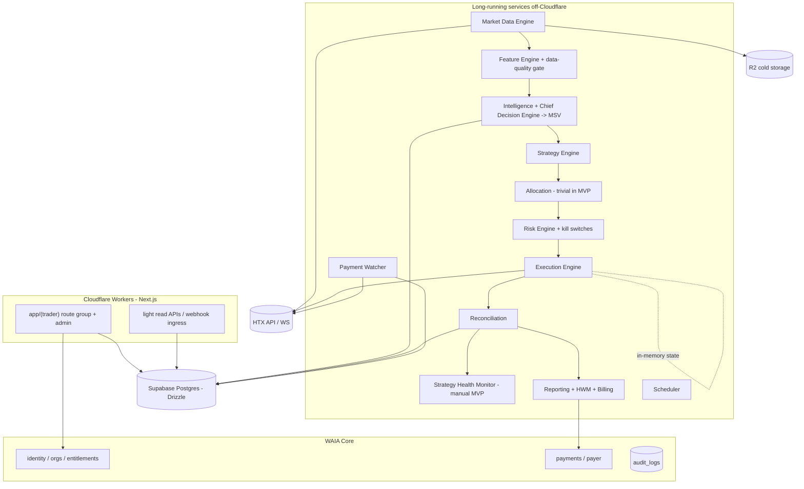

# AI-TRADER Master Spec v2

Status: Baseline v1.2 (governing technical specification)
Date: 2026-06-11
Doctrine reconciliation: 2026-06-24 — documentation-only alignment of Risk verdict vocabulary, clamp wording, the allowance lifecycle, the reconciliation split, and Related Documents to the ratified [LD-6](AI-TRADER-FORECAST-DOCTRINE.md) / [LD-7](AI-TRADER-DECISION-DOCTRINE.md) / [LD-8](AI-TRADER-RISK-DOCTRINE.md) / [LD-9](AI-TRADER-REALITY-DOCTRINE.md) doctrines. No architecture, ownership, behavior, roadmap, or governance change.

This is the re-anchored technical specification for AI-TRADER, aligned to Architecture Baseline v1.2 and the real WAIA codebase. It supersedes `AI_TRADER_MASTER_SPEC_v1_EN` wherever they disagree.

It explicitly references and conforms to:
- **WAIA Core** for identity, tenancy, entitlements, payments, audit ([WAIA Core Architecture](../waia-core/WAIA-CORE-ARCHITECTURE.md)).
- **HTX-only MVP** and **Spot-only MVP** ([MVP Scope v2](AI-TRADER-MVP-SCOPE-v2.md)).
- **Single repository strategy** ([ADR-0006](../adr/0006-ai-trader-repository-strategy.md)).
- **Targeted RLS strategy** ([ADR-0007](../adr/0007-targeted-rls-strategy.md)).
- **Manual billing gate** ([ADR-0008](../adr/0008-manual-billing-gate.md), [Billing & HWM](AI-TRADER-BILLING-HWM.md)).

Companion documents own their subjects in full: [Vision](AI-TRADER-VISION.md), [Security](AI-TRADER-SECURITY.md), [Billing & HWM](AI-TRADER-BILLING-HWM.md), [Integration](AI-TRADER-INTEGRATION.md), [User Journey v2](AI-TRADER-USER-JOURNEY-v2.md), [Roadmap v2](AI-TRADER-ROADMAP-v2.md).

> This spec deliberately contains **no SQL, no migrations, and no code**. It defines architecture and contracts for planning.

---

## 1. Mission

AI-TRADER is a non-custodial, multi-tenant crypto market intelligence and trading **module** of WAIA. It detects market regimes, permits trading only when edge exceeds cost and risk, executes on client-owned exchange accounts via trade-only keys, maintains a full audit trail, monitors strategy health, and charges 30% of net new monthly profit above a high-water mark. The system can always choose **not to trade**.

---

## 2. Governing decisions (from Baseline v1.2)

1. **SaaS-as-superset**, with the in-house fund as the first tenant (Org 0). See [ADR-0005](../adr/0005-saas-as-superset-strategy.md).
2. **WAIA Core owns identity/tenancy/entitlements/payments/audit.** No trader-specific user or org tables. **WAIA Core is a hard platform prerequisite: AI-TRADER development (Roadmap Phase 2 onward) begins only after the WAIA Core Uplift (Phase 1) is complete.** Phase 1 is platform infrastructure, not a trader feature phase. **The Core Uplift is a live migration of an active platform (not greenfield): it requires migration planning, tested rollback, AI-TWIN continuity, and backward compatibility** (see Roadmap Phase 1 and [ADR-0002](../adr/0002-staged-postgres-runtime-rollout-discipline.md)).
3. **Single repository**; no monorepo restructuring now; services extracted only when a persistent loop requires it. See [ADR-0006](../adr/0006-ai-trader-repository-strategy.md).
4. **Application-layer access enforcement primary; targeted RLS as defense-in-depth.** No platform-wide RLS migration. See [ADR-0007](../adr/0007-targeted-rls-strategy.md).
5. **Cloudflare Workers (OpenNext) for web; long-running services off-Cloudflare; Supabase as system of record; R2 for cold data.**
6. **HTX-only, spot-only MVP; paper-first; live spot admin-gated and restricted to Org 0 (in-house capital).** External client live trading is **prohibited by policy** until ADR-0009 transitions from `Accepted (Posture)` to `Accepted (Cleared)`. See [ADR-0009](../adr/0009-regulatory-posture.md).
7. **Manual billing gate** until deposit/withdrawal attribution is provably reliable. See [ADR-0008](../adr/0008-manual-billing-gate.md).
8. **Strategy Validation Gate** between paper and live: no strategy goes live (even Org 0) without a signed promotion record proving edge, not just stable plumbing. Governance structure only, no quantitative thresholds. See [ADR-0010](../adr/0010-strategy-validation-gate.md).
9. **Single Operator Governance Model** for sensitive admin actions (live-enable, strategy promotion, invoice issuance/waiver): immutable audit, cooling-off period, explicit confirmation, mandatory logging, reversible where possible. Replaces dual-control. See [ADR-0011](../adr/0011-single-operator-governance-model.md).

---

## 3. Capital model

- **Non-custodial managed trading.** Client funds remain on the client's exchange account.
- AI-TRADER holds **READ + TRADE** permissions only. **WITHDRAW and TRANSFER are forbidden.**
- Clients may revoke access, disable trading, or disconnect at any time.
- The architecture must not hard-code single-exchange, single-user, single-account, single-portfolio, or single-strategy assumptions, so it can later support master/subaccounts, fund accounts, prop accounts, DEX wallets, copy-trading, and multi-exchange allocation.

---

## 4. Infrastructure stack (aligned to the real codebase)

- **Frontend/runtime:** Next.js 16 App Router on Cloudflare Workers via `@opennextjs/cloudflare` (existing `wrangler.jsonc`). The trader UI is an `app/(trader)` route group; `trader.waia.life` is served via host-based rewrite.
- **Persistence:** Supabase PostgreSQL accessed through **Drizzle ORM** with additive migrations (existing `db/schema.postgres.ts`, `db/AGENTS.md`). The v1 spec's raw-SQL/RLS-first approach is replaced by Drizzle + targeted RLS.
- **Auth:** Supabase Auth with `public.users.id == auth.users.id` (existing `lib/auth/supabase-app-user-sync.ts`).
- **Long-running services:** off-Cloudflare (single hardened VPS with Docker for MVP). Introduced only when a persistent execution loop / WebSocket session is required (Roadmap Phase 6+).
- **Cold storage:** Cloudflare R2 for raw tick/order-book and report exports.
- **External integrations:** HTX API (MVP); Fear & Greed and news sentiment feeds; crypto payment watcher (USDT TRC-20).

**Hard rule:** Cloudflare must not host the execution engine, persistent exchange sessions, or the fast order path. Supabase must not be used as a low-latency execution bus.

---

## 5. Core design rule: slow state vs fast execution

```text
Supabase (Drizzle)  = source of truth, memory, audit, billing, configuration
Execution service   = fast order path, exchange sessions, retries, order state machine (in-memory)
```

The execution service reads configuration from Supabase, maintains active runtime state in memory, executes via direct exchange APIs, and persists results back to Supabase asynchronously with reconciliation guarantees. Trading-critical decisions never depend on UI workflows.

---

## 6. System architecture (module view)



---

## 7. Exchange connector architecture

- A strict `ExchangeConnector` interface abstracts venue specifics: credential validation, account info, balances, positions, open orders, order get/place/cancel, trade history, market-data stream, user-data stream.
- **MVP implements:** a **mock connector** and the **HTX spot connector** (credential validation, spot balances, spot order place/cancel, order status reconciliation, trade/fill history, public market data). Futures interfaces are stubs, disabled.
- HTX-specific logic must not leak into strategy, risk, billing, allocation, research, or UI layers.
- Connector registry is prepared for future Binance/OKX/Bybit/Coinbase/Deribit/DEX, none implemented in MVP.

---

## 8. Trading intelligence

### 8.1 Layers
- **Market Physics** — price, volume, volatility, momentum, trend strength, asymmetry, drawdown/breakout state.
- **Liquidity & Microstructure** — spread, depth, L1/L2 imbalance, order-flow imbalance, slippage estimate, liquidity-vacuum score (simplified L1/L2 acceptable for MVP).
- **Crowd Psychology** — Fear & Greed and news sentiment in MVP. Funding/OI/long-short are **regime-context reads only**, not execution inputs in a spot-only MVP.
- **Future Context** — **stubbed** in MVP (`event_risk_score` null/zero).

### 8.2 Feature Engine
A first-class Feature Engine sits between market data and the intelligence layers and owns feature computation and the `data_quality_score`. Backtest/live feature parity must be enforceable through it. Low data quality forces `PAPER_ONLY`.

### 8.3 Market State Vector (MSV)
The MSV is the canonical, reproducible representation of market reality: physics, liquidity, crowd, future-context blocks plus a `derived` block (regime, trading permission, risk multiplier, allowed strategy families, reason codes, data-quality score). It is stored with enough references to reproduce it later.

Regimes: `TREND_BULL, TREND_BEAR, RANGE, CHOP, STRESS, PANIC, LIQUIDITY_VACUUM, EVENT_RISK, LOW_EDGE, UNKNOWN`.
Trading permissions: `ALLOW_TRADING, ALLOW_REDUCED_RISK, ONLY_CLOSE_POSITIONS, STOP_TRADING, PAPER_ONLY`.

### 8.4 Chief Decision Engine
Central brain that aggregates the layers + account risk + strategy health + data quality into the MSV, sets regime, allowed strategy set, risk multiplier, trading permission, and reason codes. **It does not place orders.** Every output is stored.

---

## 9. Strategy framework

- Strategies are **versioned** entities with a controlled lifecycle: `DRAFT → RESEARCHING → BACKTESTING → VALIDATED → PAPER_TRADING → LIVE_LIMITED → LIVE_FULL → PAUSED → RETIRED`.
- **MVP strategies (exactly two):** Liquidity Sweep Reversal and Mean Reversion.
- A strategy emits a **structured signal** (side, confidence, expected edge, horizon, max risk, reason codes, MSV reference, features reference). It must never place orders.
- The Risk Engine applies a monotone-downward verdict to every signal before execution — it may approve, clamp downward, veto, restrict to close-only, or halt, and never raises size, conviction, or permission (see [Risk Doctrine (LD-8)](AI-TRADER-RISK-DOCTRINE.md)).

---

## 10. Research engine (MVP: schema + manual lifecycle)

- The research domain (hypotheses, datasets, feature sets, experiments, backtest/walk-forward/paper runs, deployment candidates, model runs) exists as **schema with a minimal manual lifecycle** in MVP.
- **Automated backtesting / walk-forward infrastructure is OUT of MVP** (future phase).
- Validation rules still apply: no strategy goes live without documented hypothesis, dataset, features, cost model, risk metrics, a meaningful paper period, human approval, and stored code version. Promotion from `PAPER_TRADING` to any `LIVE_*` state is governed by the **Strategy Validation Gate** ([ADR-0010](../adr/0010-strategy-validation-gate.md)) and authorized under the **Single Operator Governance Model** ([ADR-0011](../adr/0011-single-operator-governance-model.md)). There is **no admin-override bypass** of the paper period or the gate — the gate *is* the authorization path, and it is reversible (demotion to paper) at any time.

---

## 11. Strategy Health Monitor (MVP: manual)

- Tracks rolling metrics per strategy/account/instrument/regime (Sharpe, expectancy, win rate, drawdown, edge decay, slippage, fee drag, live-vs-backtest deviation, consecutive losses).
- **Automatic** downgrade actions (`LIVE_FULL → LIVE_LIMITED → PAUSED → RETIRED`) are a future phase; MVP supports **manual** review and pause authority.
- Degradation, when acted on, is recorded as risk events + audit logs.

---

## 12. Portfolio Allocation (MVP: trivial)

- The allocation **data model** supports per-strategy/instrument/account allocation and future portfolio/fund structures.
- **MVP ships a trivial constant/linear allocator.** Regime/health-driven reallocation is future.

---

## 13. Risk Engine

- Enforces, before every order: max position per account/symbol, max strategy allocation, max daily loss, max monthly drawdown, max consecutive losses, max open orders, max exposure per quote currency, emergency stop, only-close mode, account-status restrictions, billing/payment restrictions, data-quality restrictions, strategy-health restrictions.
- Enforces **security controls** as part of risk: symbol allowlist, max notional, max order rate, price collars (see [Security](AI-TRADER-SECURITY.md)).
- Emits a `RiskDecision` from the closed, monotone-restrictive verdict set ratified in the [Risk Doctrine (LD-8)](AI-TRADER-RISK-DOCTRINE.md) (`APPROVE / APPROVE_CLAMPED / VETO / CLOSE_ONLY / HALT`) with reason codes and a risk snapshot.
- A permitted verdict yields a **risk-approved request (allowance)**, not an order: it is **single-use, expiring, and revocable**, with a **consumption-time posture recheck** so a posture downgrade or kill between issuance and consumption refuses the order (two independent fail-closed paths). See [Risk Doctrine (LD-8)](AI-TRADER-RISK-DOCTRINE.md).
- **Kill switches** at global / user / account / strategy / instrument levels, plus automatic triggers; enforced inside the execution service and **fail-closed**.

---

## 14. Execution Engine

- Receives risk-approved requests; checks account status, trading permission, and strategy health; submits orders directly to the exchange; tracks order state; reconciles status and fills; cancels stale orders; handles retries; prevents duplicates via idempotency keys; persists all events.
- **Order state machine:** `CREATED → RISK_APPROVED → SENT_TO_EXCHANGE → ACCEPTED → PARTIALLY_FILLED → FILLED`, with `CANCEL_REQUESTED, CANCELLED, REJECTED, EXPIRED, FAILED, RECONCILIATION_REQUIRED`.
- **Idempotency:** every order carries `client_order_id`, `idempotency_key`, `strategy_signal_id`, `risk_decision_id`, and `allocation_decision_id` (if applicable). Retries never create duplicate exposure.
- **Recovery:** on startup, rebuild state from exchange + Supabase before resuming.
- **Reconciliation spans two doctrine-separated concerns that never merge:** reconciliation-as-construction — building canonical post-execution truth (dedup + latest-event fold + record + mark) — is owned by the [Reality Doctrine (LD-9)](AI-TRADER-REALITY-DOCTRINE.md); reconciliation-as-enforcement — Expected-vs-Actual comparison, divergence/orphan marking, and fail-closed kill — is Risk L6 in the [Risk Doctrine (LD-8)](AI-TRADER-RISK-DOCTRINE.md).
- Execution must never depend on the UI.

---

## 15. Reporting, HWM & billing

Owned in full by [Billing & HWM](AI-TRADER-BILLING-HWM.md) and the [Closed Trade Reality Doctrine (LD-10)](AI-TRADER-CLOSED-TRADE-REALITY-DOCTRINE.md). Summary: monthly reporting periods, per-account high-water mark (cumulative net realized strategy profit), mandatory deposit/withdrawal adjustment, 30% performance fee on net new **Realized Strategy Profit** above HWM (realized closed-trade profit only — unrealized PnL is audit/transparency, not fee-bearing), invoice lifecycle, USDT TRC-20 unique-address payment attribution, suspension lifecycle, and a **mandatory manual issuance gate** in MVP. Before issuance, the reviewer must verify deposits, withdrawals, balance snapshots, **realized-fill finality**, reconciliation status, and exchange synchronization integrity, with the sign-off recorded in the audit stream (see [ADR-0008](../adr/0008-manual-billing-gate.md)). The Billing & HWM document also defines the **billing governance policies** — valuation source, realized-only fee base (LD-10), dispute handling, overcharge remediation, and refund/credit — that bound how fees are computed and corrected. Sensitive billing actions (waiver/cancellation) run under the Single Operator Governance Model ([ADR-0011](../adr/0011-single-operator-governance-model.md)). Payer identity and the payment ledger are WAIA Core shared infrastructure.

---

## 16. Data model (architecture, not SQL)

- Money/quantity/price/PnL/fees use exact numeric types; timestamps are timezone-aware; business entities use UUID keys. **No floating point for financial values.**
- Tables are introduced via **additive Drizzle migrations**, not raw SQL, consistent with `db/AGENTS.md`.
- Domain segmentation and ownership are defined in [WAIA Core Architecture](../waia-core/WAIA-CORE-ARCHITECTURE.md) §3 and the Baseline. Trader-owned domains: exchange/account/credential, market data + MSV, strategy/research, allocation/risk, orders/fills/positions, reporting/invoices, risk/audit events. Identity/tenancy/payment-ledger belong to Core.
- **Growth strategy:** raw L2/tick streamed to R2 (not retained long-term in Postgres); bars + derived features + MSV kept warm; `market_*` and MSV time-range partitioned by `ts` and indexed `(instrument_id, ts)`; financial records permanent.

---

## 17. Security (summary)

Owned in full by [Security](AI-TRADER-SECURITY.md). Non-negotiables: never request withdraw/transfer; never store secrets plaintext; **managed key infrastructure in place before any real credential is stored**; no order without Risk Engine approval; trade-abuse controls are security controls; kill switches in-service and fail-closed; sensitive admin actions (live-enable, strategy promotion, invoice waiver) under the Single Operator Governance Model (immutable audit, cooling-off, explicit confirmation); unique-address payment attribution; full auditability.

---

## 18. Frontend & API (MVP surfaces)

- **Pages (within the `(trader)` route group):** dashboard, exchange connect (HTX), account balances/positions/orders, reports, strategy status, billing/invoices, and admin views (users, accounts, risk, invoices, strategies, research, strategy health, market state).
- **User dashboard shows:** connected exchanges, account/trading status, balance/equity, open positions, recent orders/fills, active strategies, strategy-health summary, risk status, current-period PnL, HWM, pending invoice + payment address, and trade reason codes.
- **APIs:** light read APIs and webhook ingress run on Cloudflare; **trading-critical order routes are never exposed to user clients** and live in backend services. Admin actions (kill switches, strategy pause, deployment approval) are admin-only and audited.

---

## 19. Testing requirements

- **Unit:** fee/HWM/deposit-withdrawal math, invoice lifecycle, payment matching, risk limits, signal validation, MSV validation, strategy-health downgrade logic, allocation constraints, order state transitions, idempotency, API-permission validation, encryption wrappers.
- **Integration:** signup → org provisioning; HTX validation (mock); account creation; balance snapshots; market data → feature → MSV; signal → allocation → risk → order request; reconciliation with simulated fills; manual strategy pause; period close → draft invoice; payment → invoice paid → account active; overdue → suspended.
- **Security:** cross-org isolation, secret inaccessibility, no service-role from browser, forbidden-permission rejection, audit creation, admin override audit under the Single Operator Governance Model (immutable audit + cooling-off + explicit confirmation).

**Tenant-isolation test gate (mandatory, release-blocking).** Every organization-scoped API, query path, service endpoint, admin operation, and dashboard view must ship with tenant-isolation tests proving cross-organization reads/mutations are impossible. A cross-organization access failure is a **release blocker** with no waiver (see [ADR-0007](../adr/0007-targeted-rls-strategy.md) and [Security](AI-TRADER-SECURITY.md)).

---

## 20. Observability

Log and alert on: exchange API errors, WS disconnects, order latency/rejection rate, reconciliation mismatch, market-data gaps, feature failures, MSV data-quality, signal counts, manual strategy-health flags, risk rejections, suspensions, payment-watcher failures, and DB/Supabase write failures. Critical alerts: failed reconciliation, duplicate-order risk, credential failure, unknown position, global drawdown breach, payment-watcher offline, live-vs-backtest divergence, data quality below threshold.

**Sequencing (Red Team remediation).** A **minimum observability baseline** — structured logging, the critical-alert set above, reconciliation-mismatch surfacing, and decision/reason-code + signal counters — must be live **before Paper Trading validation begins** (Roadmap Phase 6 gate). Paper validation that cannot be measured is not validation. Full observability automation remains post-MVP; only the measurable minimum is sequenced early.

---

## 21. Non-negotiable rules

Mirror of the platform rules; see also [Security](AI-TRADER-SECURITY.md) §12 and [WAIA Core Architecture](../waia-core/WAIA-CORE-ARCHITECTURE.md).

1. Never request withdraw/transfer permission.
2. No module-local identity/tenancy tables; use WAIA Core.
3. Live trading off by default; live spot only behind an admin flag with caps, and in MVP only for Org 0. External live trading is prohibited by policy until ADR-0009 is `Accepted (Cleared)` — no entitlement, flag, or workflow may bypass this.
4. No order without Risk Engine approval and an idempotency key.
5. No strategy output bypasses the Chief Decision Engine.
6. Execution never runs on Cloudflare and never depends on the UI; Supabase is never the execution bus.
7. Secrets envelope-encrypted, service-role only, never in the browser/logs.
8. Every decision, signal, allocation, risk decision, order, fill, and admin action is auditable and reproducible.
9. Performance fees require period snapshots + HWM + deposit/withdrawal adjustment, and a manual reconciliation sign-off in MVP.
10. Reconciliation mismatch, data-quality failure, or lost control-plane connectivity forces fail-closed.

---

## Related documents

- [WAIA Core Architecture](../waia-core/WAIA-CORE-ARCHITECTURE.md)
- [AI-TRADER MVP Scope v2](AI-TRADER-MVP-SCOPE-v2.md)
- [AI-TRADER Roadmap v2](AI-TRADER-ROADMAP-v2.md)
- [AI-TRADER Billing & HWM](AI-TRADER-BILLING-HWM.md)
- [AI-TRADER Security](AI-TRADER-SECURITY.md)
- [AI-TRADER Integration](AI-TRADER-INTEGRATION.md)
- [AI-TRADER Forecast Doctrine (LD-6)](AI-TRADER-FORECAST-DOCTRINE.md)
- [AI-TRADER Decision Doctrine (LD-7)](AI-TRADER-DECISION-DOCTRINE.md)
- [AI-TRADER Risk Doctrine (LD-8)](AI-TRADER-RISK-DOCTRINE.md)
- [AI-TRADER Reality Doctrine (LD-9)](AI-TRADER-REALITY-DOCTRINE.md)
- ADRs: [0005](../adr/0005-saas-as-superset-strategy.md), [0006](../adr/0006-ai-trader-repository-strategy.md), [0007](../adr/0007-targeted-rls-strategy.md), [0008](../adr/0008-manual-billing-gate.md), [0009](../adr/0009-regulatory-posture.md)
