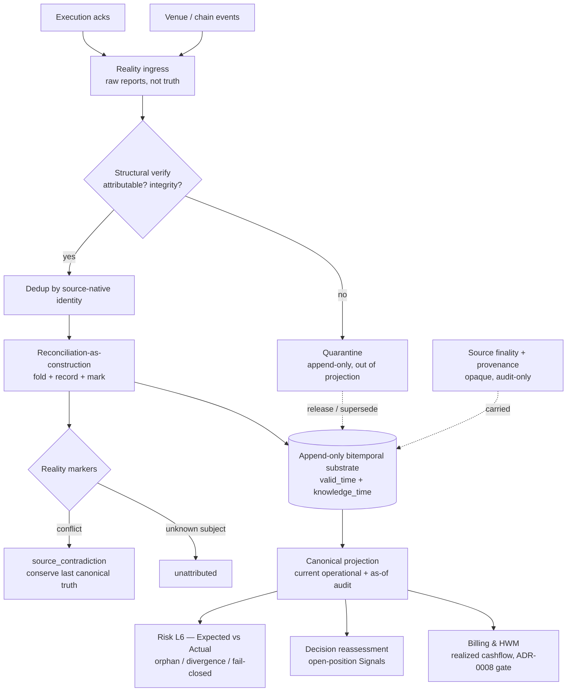

# AI-TRADER — LD-9 Reality Doctrine (Post-Execution Truth Layer)

> **Status: Ratified doctrine v1.0 (LD-9 Reality). Accepted upon merge.**
> **Ratification:** LD-9 Reality Doctrine v1.0 · **Parent:** DEE-278 · **Slice:** DEE-298.
> **Subordinate to the [AI-TRADER Market Intelligence Architecture](AI-TRADER-MARKET-INTELLIGENCE-ARCHITECTURE.md), the [Knowledge-to-Action Doctrine](AI-TRADER-KNOWLEDGE-TO-ACTION-DOCTRINE.md) (DEE-294, §5/§7 L6 reconciliation), the [LD-6 Forecast Doctrine](AI-TRADER-FORECAST-DOCTRINE.md) (DEE-295), the [LD-7 Decision Doctrine](AI-TRADER-DECISION-DOCTRINE.md) (DEE-296), and the [LD-8 Risk Doctrine](AI-TRADER-RISK-DOCTRINE.md) (DEE-297); bounded by [ADR-0009](../adr/0009-regulatory-posture.md) / [ADR-0010](../adr/0010-strategy-validation-gate.md) / [ADR-0011](../adr/0011-single-operator-governance-model.md). Where this document and any of those conflict, they win.**
> **Additive only — it overrides nothing and weakens no governance gate.**
> **No engines.** LD-9 delivers the canonical truth definition, its bitemporal append-only truth substrate, the truth-record and current-projection contracts, and derived read-models only. It adds no automation, no autonomous capital path, no reconciler engine, no settlement logic, and no live-trading path.

Date: 2026-06-24
Scope: How AI-TRADER holds **what is actually true** after capital has acted — constructing, recording (append-only, bitemporally), and projecting the canonical actual state (positions, balances, realized cashflows, settled fills, settlement outcomes, venue/chain events) that Risk L6, Decision reassessment, and Billing consume — the layer that stands between Execution's acknowledgements and the system's belief about post-execution reality.
Authority: Subordinate to the [Market Intelligence Architecture](AI-TRADER-MARKET-INTELLIGENCE-ARCHITECTURE.md), the [Knowledge-to-Action Doctrine](AI-TRADER-KNOWLEDGE-TO-ACTION-DOCTRINE.md), the [Forecast Doctrine](AI-TRADER-FORECAST-DOCTRINE.md), the [Decision Doctrine](AI-TRADER-DECISION-DOCTRINE.md), the [Risk Doctrine](AI-TRADER-RISK-DOCTRINE.md), the [Master Spec v2](AI-TRADER-MASTER-SPEC-v2.md), and ADR-0009/0010/0011. **Where this document and any of those conflict, they win.**
Lineage: Canonical output of the full LD-9 architecture cycle — Design → Reconciliation → Hostile Review → Fatal Findings Analysis → Reconciliation v2 → Hostile Review v2 → Major Findings Classification → Reconciliation v3 → Hostile Review v3 → Reconciliation v4 → Ratification Readiness Review (RATIFIABLE WITH MINOR CLARIFICATIONS; MC1–MC9 integrated). It records final decisions (holdings RH-A…RH-U); it does not re-litigate them.

> **Reading note.** Reality is the truth hinge that closes the Knowledge-to-Action loop. Everything upstream earns belief (Forecast owns ACCURACY), converts it to intent (Decision owns ACTIONABILITY), permits it (Risk owns ENFORCEMENT), and acts (Execution owns MECHANICS); Reality answers exactly one question — **"What is actually true?"** — bitemporally, append-only, and fail-uncertain. It may record, fold, mark, and project, but it may **never** decide, enforce, predict, execute, observe the market, or own policy (finality, trust, attribution, accounting). The optimization target is **truth fidelity, replay determinism, and provenance — never trading profitability.**

---

## Section 1 — Purpose

LD-9 is the layer where AI-TRADER stops holding an **expectation** of what capital did and starts holding the **confirmed actuality** of what capital did. Execution emits acknowledgements and the venue/chain emits events; neither is, by itself, canonical truth. Reality ingests those raw reports and **constructs** the single, append-only, bitemporally-stamped, replayable record of post-execution state — positions, balances, realized cashflows (deposits, withdrawals, funding, fees-as-realized), settled fills, and settlement outcomes — anchored to the venue/chain that asserted them.

Reality records **facts** (the sealed truth record, its append-only event/correction substrate) and **derived read-models** (a current operational projection, an as-of audit projection); it **never** predicts, never decides, never enforces, never executes, never observes the market, and never owns policy. Reality is the system's accountable answer to a single question — *what is actually true, as best the world has told us, and when did we learn it?* (RH-A). It closes the KTA loop by feeding the canonical actual state back to Risk's L6 reconciliation, to Decision's open-position reassessment, and to Billing's realized-cashflow accounting.

---

## Section 2 — Reality Definition

**Core statement (canonical):**

> **Reality is the bitemporal, append-only, replayable layer that owns the canonical *actual* post-execution state of the world — positions, balances, realized cashflows, settled fills, settlement outcomes, and venue/chain events — constructing it from raw observed reports with full provenance, and never predicting, never deciding, never enforcing, never executing, never observing the market, and never owning policy (finality, trust, attribution, accounting).**

**Reality IS:**
- **the truth owner** — it holds the single canonical record of post-execution actuality, anchored to the venue/chain that asserted it;
- **bitemporal** — every fact carries both **valid-time** (when the fact was true in the world, as asserted by the source) and **knowledge-time** (when Reality learned it) (RH-F, RH-G);
- **append-only and immutable** — corrections are new appends, never in-place mutations; the past is never rewritten, only superseded with provenance (RH-O, RH-U);
- **replayable** — given the pinned event/correction log, the canonical state at any (valid-time, knowledge-time) coordinate reproduces deterministically (RH-U);
- **provenance-complete and trust-neutral** — it records *who asserted what, and when*, attaching source identity verbatim; it forms no opinion on whether a source is trustworthy (RH-J, RH-S);
- **fail-uncertain** — under contradiction or absence it labels uncertainty and conserves the last canonical truth rather than inventing a resolution (RH-Q).

**Reality IS NOT:**
- **a Forecast** — it estimates no probabilities and resolves no prediction; it records what happened, not what might;
- **a Decision** — it originates no intent and selects no posture;
- **Risk** — it grants, clamps, vetoes, and halts nothing; it certifies state, it does not permit action;
- **Execution** — it carries no order type, routing, timing, or venue selection; it observes the *results* of execution, never performs it;
- **market observation** — it is **not** the price/market-data feed (MC4); market observation is Forecast/Decision input (LD-6/LD-7) about the *world's* state, whereas Reality is the *account's* post-execution state. The two never substitute for one another;
- **a policy owner** — it owns no finality semantics, no trust/custody model, no attribution rule, and no accounting/cost-basis method (RH-J).

**Position in the chain:** `… → Decision (LD-7) → Risk (LD-8) → Execution →` **Reality (LD-9)** `→ {Risk L6, Decision reassessment, Billing}`. Reality consumes Execution acknowledgements and venue/chain events, constructs the sealed canonical truth, and publishes it back into the loop — the final-but-not-terminal layer that turns action into accountable actuality.

---

## Section 3 — Ownership & Boundaries

Five layers, one clean ownership split. The "is / is-not" boundary prevents responsibility leakage (RH-A).

| Layer | Owns | Consumes | May NEVER do | Hands onward |
|---|---|---|---|---|
| **Forecast (LD-6)** | **ACCURACY** — sealed distribution, bands, tails, horizon, calibration | market observation | encode economics; size; decide; enforce | sealed distribution, by digest |
| **Decision (LD-7)** | **ACTIONABILITY** — arbitration, posture, proposed `size_intent`, `whyNotCash` | Forecast (by digest), eligibility, Worldview | predict; clamp/veto/kill; allocate the book; carry mechanics | sealed Decision Snapshot |
| **Risk (LD-8)** | **ENFORCEMENT** — L0–L6 stack, canonical exposure unit, downward clamp, contention arbitration, kill-switch, **L6 reconciliation-as-enforcement** | sealed Decision Snapshot, **Reality's actual state**, internal Expected State | re-judge belief; raise conviction/size; predict; optimize a portfolio; carry mechanics | risk-approved request (allowance) |
| **Execution** | **MECHANICS** — order type, routing, timing, slicing, venue | risk-approved request | alter posture; exceed allowance | orders to venue; acks to Reality |
| **Reality (LD-9)** | **TRUTH** — canonical actual state (positions, balances, realized cashflows, settled fills, settlement outcomes, venue/chain events); the bitemporal append-only truth substrate; reconciliation-as-construction (dedup + fold + record + mark); source-contradiction + unattributed markers | Execution acks, venue/chain events, source-asserted finality + provenance metadata | decide; enforce; predict; execute; observe the market; own finality / trust / attribution / accounting; mark orphan / divergence / reconciliation-failure | **canonical actual state** → Risk L6, Decision reassessment, Billing |

**Realized-cashflow boundary (MC2).** Reality owns **realized cashflow as fact** — the deposits, withdrawals, funding, and fees that actually moved, as the venue/chain asserted them. Reality does **not** own the **billing adjustment**: fee computation, high-water-mark accounting, and invoice construction belong to [Billing & HWM](AI-TRADER-BILLING-HWM.md). Billing **reads** Reality's realized cashflow; it never authors truth, and Reality never computes a charge.

**Audit-only metadata (RH-S).** Reality carries source-asserted **finality** and **provenance** strictly as opaque, verbatim, audit-only metadata. These are never interpreted, never acted on by Reality, and never confer truth-finality semantics (Section 11).

**Ownership invariant.** Reality's authority is **strictly observational and constructive**. It may always *record* and *mark* what the world reported; it may never *judge*, *permit*, *predict*, or *act*. Truth is constructed from reports — never authored by Reality, and never derived from the system's own expectation.

---

## Section 4 — Reality Object Model

Mirroring LD-6 / LD-7 / LD-8 ("record facts; derive interpretations"): an immutable sealed truth record, an append-only event/correction substrate, and derived read-models (RH-F).

**(a) Truth Record (immutable, sealed by `truth_record_definition_digest`):**

| Field group | Contents |
|---|---|
| Identity & anchor | `truth_record_id`, `organization_id`, `venue_or_chain_id`, `source_id`, `source_event_ref` (venue/chain-native id) |
| Subject | subject class (`position` / `balance` / `realized_cashflow` / `settled_fill` / `settlement` / `venue_event`), subject key (instrument / account / order ref) |
| Asserted fact | the primitive quantities as reported (quantity, price, amount, side) — recorded as measured, not normalized |
| Bitemporal stamps | `valid_time` (source-asserted), `knowledge_time` (Reality ingest), `supersedes_ref` (prior record this corrects, if any) |
| Provenance & finality | `source_provenance` (verbatim), `finality_grade` (source-asserted, opaque), `ingest_signature` |
| Markers | `source_contradiction` / `unattributed` (Reality-owned only) |

**(b) Event / correction substrate (append-only):** observe / correct / supersede / quarantine / release. Each entry is stamped to its **source-asserted `valid_time`** and its **Reality `knowledge_time`**; canonical state is **folded** from this log (latest-knowledge-time fold within a valid-time) — never mutable columns (RH-O, RH-U). A correction is an *append* that supersedes a prior record; the prior record is retained, never deleted.

**(c) Derived (never stored mutable):** the **current operational projection** (latest known truth per subject), the **as-of audit projection** (truth as known at a chosen `knowledge_time`), and aggregate read-models — each computed under named derivation versions (RH-P).

---

## Section 5 — Canonical Truth & Projection Model

Canonical truth is **not a single row** — it is a **(valid-time, knowledge-time) surface** over the append-only log (RH-G).

- **Construction.** For each subject, the canonical fact at a coordinate `(v, k)` is the latest-`knowledge_time` non-superseded record with `knowledge_time <= k` whose `valid_time <= v`. This fold is deterministic and replayable (RH-N, RH-U).
- **Current operational projection (RH-P).** The default read-model consumed by Risk L6, Decision reassessment, and Billing is the **latest known truth** (`k = now`, `v = now`): the best current account of actuality. It is a projection, not a new source of truth.
- **As-of audit projection (RH-P).** Any past coordinate is reconstructable — *what did we believe was true as of last Tuesday?* — enabling audit, dispute resolution, and replay without rewriting history.
- **Provisional vs corrected.** A projection cell may be **provisional** (awaiting a higher-finality or contradicting report) or **stable**; provisional status is surfaced, never hidden (Section 11). Consumers decide how to treat provisional truth within their own doctrine; Reality only labels it.

---

## Section 6 — Ingress & Authority Contract

Reality ingests Execution acknowledgements and venue/chain events and treats them as **raw reports**, not as canonical truth until constructed.

| Input | Reality **trusts** | Reality **verifies** | Reality **may reject / quarantine** | Reality **may NEVER do** |
|---|---|---|---|---|
| Execution ack | ✓ as a report | structural integrity, ordering, dedup identity | malformed / unverifiable → quarantine | treat the ack as final truth without construction |
| Venue/chain event | ✓ as a report | source identity, native ref, valid-time presence | unattributable → mark `unattributed` | invent attribution |
| Source-asserted finality | ✓ as opaque metadata | presence/format only | — | interpret or act on finality semantics |
| Provenance | ✓ verbatim | presence | — | rewrite or normalize provenance |
| Contradicting reports | ✓ both, as appends | both retained | — | silently pick a winner; mutate the loser |

**Contract rules.** Reality **records provenance, constructs canonical state, and marks uncertainty**; it **authors no fact of its own** and **derives no truth from the system's expectation** (that is Risk's Expected State — Section 10). A report Reality cannot attribute is recorded and marked `unattributed`, never dropped and never guessed. A report that contradicts existing canonical truth is appended and marked `source_contradiction`, never resolved by fiat (Section 9). If a required structural element is missing or unverifiable, Reality **fails uncertain**: it quarantines the report and conserves the last canonical truth (Section 14).

---

## Section 7 — Bitemporal Substrate

Reality's substrate is bitemporal by construction — the property that makes truth both correctable and auditable without rewriting the past (RH-F, RH-O, RH-U).

- **Valid-time** is the source's assertion of *when the fact was true in the world* (e.g. the venue's fill timestamp, the chain's block time). Reality carries it verbatim; it never fabricates a valid-time.
- **Knowledge-time** is *when Reality learned the fact*. It is Reality-assigned, monotonic per ingest, and never backdated.
- **Append-only corrections.** A later, more accurate, or contradicting report is a new record with a new `knowledge_time` that **supersedes** (never overwrites) the prior one. The superseded record remains in the log with full provenance.
- **Latest-knowledge fold.** Canonical state within a valid-time is the latest non-superseded `knowledge_time` record — a deterministic fold, never a mutable column.
- **Quarantined-then-corrected (MC9, RH-U).** A report may be **quarantined** (admitted to the substrate but excluded from the canonical projection) when it is structurally unverifiable or unattributable, then later **released** (or permanently superseded) by a subsequent append. Quarantine and release are themselves append-only events; the canonical projection deterministically reflects the release at its `knowledge_time`, and replay of any earlier coordinate still shows the quarantined-and-excluded state. Nothing is ever deleted to "fix" a record.
- **Replay invariant.** For any `(valid_time, knowledge_time)` coordinate, the canonical projection is reproducible bit-for-bit from the append-only log.

---

## Section 8 — Reconciliation-as-Construction

Reality performs **reconciliation-as-construction** — and only that. It is **not** reconciliation-as-enforcement (RH-N, RH-R, MC1).

- **Disambiguation (MC1).** Two distinct operations share the word "reconciliation":
  - **Construction (Reality, LD-9):** resolving *raw observed reports* into canonical actual state — **dedup → fold → record → mark**. Reality reconciles *the world's reports against each other* to build one coherent truth.
  - **Enforcement (Risk L6, LD-8 §8):** comparing **Expected** state (Risk-internal) against **Actual** state (Reality) and **failing closed on divergence**. Risk L6 reconciles *the system's expectation against Reality's truth* to enforce safety.
  These never merge. Reality builds truth; Risk L6 judges expectation against it.
- **Dedup.** Multiple reports of the same underlying event (retries, duplicate webhooks, re-orgs re-reporting) are collapsed by a **source-native identity rule** (`venue_or_chain_id` + `source_event_ref`) into a single canonical lineage. The identity rule is the *source's* notion of sameness, not a Reality-invented heuristic.
- **Fold.** Within a subject and valid-time, the latest non-superseded knowledge-time record wins (Section 5).
- **Record.** Every input — winner, superseded, duplicate, contradiction — is retained append-only with provenance.
- **Mark.** Reality attaches only its two owned markers (Section 9). It never computes a divergence against Expected State (that is Risk L6).

---

## Section 9 — Marker Model

Markers are split cleanly by who can compute them (RH-M).

| Marker | Owner | Meaning |
|---|---|---|
| `source_contradiction` | **Reality** | Two source reports about the same subject disagree; both are retained, neither is silently chosen. |
| `unattributed` | **Reality** | A report cannot be attributed to a known subject/account/order; recorded, surfaced, never dropped. |
| `orphan` | **Risk L6** | An Expected action has no corresponding Actual (requires Expected State — not Reality's to compute). |
| `divergence` | **Risk L6** | Expected and Actual disagree beyond tolerance (requires comparison against Expected). |
| `reconciliation-failure` | **Risk L6** | L6 cannot complete its Expected-vs-Actual check (fail-closed enforcement state). |

**Marker invariant.** Reality may only assert markers computable **from reports alone**. Any marker requiring comparison against the system's *expectation* (`orphan`, `divergence`, `reconciliation-failure`) belongs to **Risk L6**, because computing it would require Reality to hold Expected State — which would collapse the L6 independence boundary (Section 10). This boundary was hardened across Hostile Review v2/v3 (RH-M).

---

## Section 10 — Reality ↔ Risk Independence

The KTA §7.3 independence requirement for L6 reconciliation depends on Reality and Risk deriving their inputs **independently** (RH-H, RH-L, MC6).

- **Two states, two owners.** **Expected State** (what *should* be held, derived by Risk from authorized actions and Execution acks) is **Risk-owned** (LD-8). **Actual State** (what *is* held, constructed from venue/chain reports) is **Reality-owned** (LD-9). L6 compares the two and fails closed on divergence.
- **Independent derivation is a binding requirement (MC6, RH-L).** Expected and Actual MUST be derived along **independent paths** so that an internal pipeline fault corrupting one does not identically corrupt the other. This is a **requirement on the implementation**, not an automatic property of the design — it must be built and verified, not assumed. Where the two share a derivation step, L6's independence over that step is void.
- **Scoped independence claim (RH-H).** In MVP, both Expected and Actual ultimately originate from the **same venue API**. L6 therefore detects **internal** (pipeline, transcription, fold) faults, but **cannot** detect a **venue-level common-cause** corruption (a compromised or buggy venue lying consistently to both paths). This is an **accepted MVP limitation**, not a defect of LD-9. Full venue-common-cause independence (a second attestation source) is **reserved** to a future Multi-source / Trust doctrine (Section 16).
- **No leakage.** Reality never reads Expected State, and Risk never writes Actual State. The independence is structural: each owner constructs its state from its own inputs.

---

## Section 11 — Finality & Provenance Metadata

Finality and provenance are carried, not interpreted (RH-S, MC3).

- **Opaque and verbatim.** Reality records the source-asserted **finality grade** (e.g. provisional vs settled/final, confirmation depth) and **provenance** exactly as reported, as opaque metadata. It assigns no finality of its own.
- **Audit-only / non-actionable.** Finality metadata is **never** an input to any Reality behavior. Reality does not promote, demote, or block records based on finality; it only labels them, so consumers can apply their own finality policy.
- **Semantics are reserved.** What finality *means* — when a provisional fill becomes irreversibly settled, how re-orgs unwind it, what confirmation depth suffices — is owned by a future **Finality / Settlement doctrine** (Section 16), not by Reality.
- **Interim provisional control (MC3, ADR-0008).** Because finality semantics are reserved, the compensating control for provisional truth reaching money is the **manual billing gate** ([ADR-0008](../adr/0008-manual-billing-gate.md)): provisional realized cashflow can be **read** by Billing but is **never** auto-charged: a human gate stands between provisional truth and any invoice until the Finality doctrine ratifies automatic promotion. This keeps provisional-vs-final ambiguity from ever silently moving money.

---

## Section 12 — Reality → Consumers Boundary

Reality publishes the **current operational projection**; consumers read it under their own doctrine (RH-P).

| Consumer | Reads | Reality guarantees | Consumer owns |
|---|---|---|---|
| **Risk L6 (LD-8)** | canonical Actual State | provenance, bitemporal coordinate, markers | Expected-vs-Actual comparison, divergence/orphan marking, fail-closed enforcement |
| **Decision reassessment (LD-7)** | current positions / balances | latest-known projection, provisional labels | open-position reassessment Signals; never treats Reality as a market feed |
| **Billing & HWM** | realized cashflow (deposits, withdrawals, funding, fees-as-realized) | fact-as-asserted, finality label | fee computation, HWM, invoices — gated by ADR-0008 (MC3) |

- **Current projection, not history dump (RH-P).** Consumers receive the latest-known truth by default; the bitemporal as-of projection is available for audit/replay but is not the operational read.
- **Reality ≠ market-observation (MC4).** Decision and Risk must never substitute Reality for the market-data feed. Reality is *account actuality*; market observation is *world state* (LD-6/LD-7). Conflating them would let post-execution state masquerade as forecast input.
- **One-way.** Reality publishes; it consumes nothing back from these layers as truth. A consumer's interpretation never flows back to amend a Reality record.

---

## Section 13 — Exclusion Boundary

Policies Reality must **never** own — the hardened never-own list (RH-J). Each is fenced to a current owner or a reserved doctrine.

- **Trust / integrity of a source** — Reality is trust-neutral; whether a venue is honest or compromised is owned by a future **Trust / Custody doctrine**.
- **Valuation / mark-to-market** — pricing a position's worth is market-observation + accounting, not truth construction.
- **Accounting / cost-basis** — lot matching, cost-basis, P&L method belong to a future **Accounting doctrine**.
- **Finality semantics** — when provisional becomes irreversibly final (Section 11) belongs to a future **Finality / Settlement doctrine**.
- **Attribution across sources** — merging multiple independent sources into one attributed truth belongs to a future **Attribution / Multi-source doctrine**.
- **Arbitration of contradictions** — *which* contradicting report is "right" is a policy judgment; Reality records and marks the contradiction, never resolves it on merit.
- **Enforcement** — orphan/divergence/reconciliation-failure marking and any fail-closed action belong to Risk L6.

**Exclusion invariant.** If answering a question requires a *policy preference* (trust, valuation, finality, attribution, accounting, arbitration), it is **not** Reality's to answer. Reality answers only the provenance-grounded factual question: *what was reported, by whom, when, and what is the resulting canonical state?*

---

## Section 14 — Failure & Fail-Uncertain

Reality's failure posture is **fail-uncertain**, the truth-layer analogue of Risk's fail-closed (RH-Q, RH-U, MC9).

- **Conserve last canonical truth.** Under contradiction, absence, or unverifiability, Reality never invents a resolution; it **retains the last canonical truth** and surfaces the uncertainty (marker + provisional label).
- **Contradiction is recorded, not resolved.** Conflicting reports are both appended and marked `source_contradiction`; the canonical projection conserves the prior stable value until a higher-confidence report supersedes it. Resolution-on-merit is reserved (Section 13).
- **Quarantine on unverifiability (MC9).** Structurally unverifiable or unattributable reports are quarantined (in the substrate, out of the projection) and later released or superseded — append-only, replayable.
- **Contradiction exit is a human action (ADR-0011, RH-Q).** Forcing a resolution of a standing source-contradiction — declaring one report canonical against another — is a **logged single-operator action** under ADR-0011, never an autonomous Reality decision. Reality provides the evidence; a human (or a future ratified Attribution/Finality doctrine) decides.
- **No fail-invent path.** There is no configuration, timeout, or error branch under which Reality fabricates a fact, guesses attribution, or rewrites the past. Every error edge resolves to *recorded uncertainty + conserved last truth*.

---

## Section 15 — Replay & Audit

Reality is **fully replayable**: given the append-only event/correction log, every canonical projection reproduces bit-for-bit (RH-F, RH-O, RH-U, RH-P).

- **Bitemporal determinism.** Any `(valid_time, knowledge_time)` coordinate yields a deterministic canonical projection from the log alone.
- **PIT-as-knowledge-time.** The "what did we know, and when" audit question is first-class: the as-of audit projection answers it without rewriting history.
- **Append-only, sealed records.** Truth records are immutable and digest-sealed; corrections are supersedes; quarantine/release are events. Nothing is mutated in place.
- **Full provenance chain.** Every canonical cell traces to the exact source reports (winner + superseded + duplicates + contradictions) that produced it, with source identity and both timestamps — an independently-auditable lineage.
- **Conservative under lag.** Where a more-final report is expected but not yet received, the projection conserves the last stable truth and labels it provisional rather than optimistically promoting it.

---

## Section 16 — Reservations & Insertion Seams

Explicitly **out of scope** for v1.0 and fenced for later doctrine slices — each with an MVP justification and a compensating control (none instantiated here) (RH-K, RH-T, MC5).

- **Finality / Settlement doctrine.** *Reserved:* the semantics of provisional → final, re-org unwinding, confirmation-depth policy. *MVP justification:* MVP is HTX-only / spot-first with shallow settlement complexity. *Compensating control:* finality carried opaque + audit-only (Section 11); provisional cashflow gated by the manual billing gate ([ADR-0008](../adr/0008-manual-billing-gate.md), MC3). *Seam:* `finality_grade` metadata + provisional projection label.
- **Trust / Custody doctrine.** *Reserved:* the integrity model for a compromised/buggy/malicious source, and custody of keys/assets. *MVP justification:* single-operator, in-house capital (ADR-0009/0011) bounds counterparty-trust exposure. *Compensating control:* Reality records provenance verbatim and is trust-neutral; trust judgments stay human. *Seam:* `source_provenance` + `source_id`.
- **Attribution / Multi-source doctrine.** *Reserved:* merging multiple independent sources into one attributed truth, and resolving cross-source contradictions on merit. *MVP justification:* MVP has a single venue source per subject. *Compensating control:* `unattributed` + `source_contradiction` markers surface, never resolve. *Seam:* the marker model (Section 9) + a second-source attestation slot for venue-common-cause independence (Section 10).
- **Accounting / Cost-Basis doctrine.** *Reserved:* lot matching, cost-basis, realized/unrealized P&L method. *MVP justification:* Billing & HWM owns the only money-facing computation today, gated manually. *Compensating control:* Reality publishes realized cashflow as fact; computation stays in Billing. *Seam:* realized-cashflow records (Section 4).

---

## Section 17 — Governance Compatibility

LD-9 is bounded by, and reinforces, existing governance. It instantiates no new gate and weakens none.

- **Additive-only / no engines (MC8).** LD-9 adds a doctrine document and one README row. It instantiates no reconciler, no settlement engine, no persistence, and no autonomous path. It overrides nothing and weakens no gate.
- **Single-operator governance (ADR-0011).** Every truth-affecting human action — forcing a contradiction resolution, releasing a quarantined record by hand — is a logged single-operator action. There is no autonomous truth-override path.
- **Manual billing gate (ADR-0008).** Provisional realized cashflow never auto-charges; a human gate stands between provisional truth and any invoice (Section 11) until a Finality doctrine ratifies automatic promotion.
- **Regulatory posture (ADR-0009).** Reality's append-only, fully-provenanced, fail-uncertain, human-gated-override design is consistent with the conservative regulatory posture; nothing here authorizes autonomous capital action or autonomous truth arbitration.
- **Strategy validation gate (ADR-0010).** Reality consumes from and reports on validated-policy execution; it neither grants nor weakens the L0 / DEE-178 gate.

---

## Section 18 — KTA Clarification (annotation only)

This doctrine is a **clarification** of the Knowledge-to-Action chain, **not** a KTA amendment (MC7). It instantiates the post-execution **truth** position implied by KTA §5 (`… → Risk → Execution → reconciliation`) and the §7 L6 reconciliation relationship, expressing the **Actual State** half of L6 as ratified doctrine. The KTA chain is **unchanged**; **no KTA v1.1 is required**. Where any wording here appears to extend KTA, it is subordinate and additive, and KTA / the MI Architecture win on conflict.

---

## Section 19 — Reserved Future Work

Declared, not implemented — pointers to the seams in Section 16:

- **Finality / Settlement** semantics and automatic provisional→final promotion.
- **Trust / Custody** integrity model and second-source venue-common-cause independence.
- **Attribution / Multi-source** aggregation and merit-based contradiction resolution.
- **Accounting / Cost-Basis** P&L and lot-matching.
- **Reality engine, persistence, and reconciler** implementation (separate execution slices, gated by their own Linear issues).

---

## Section 20 — Reality Flow (canonical)

---

## Section 21 — Ratification Statement

**LD-9 Reality Doctrine v1.0 is ratified as Accepted Canon**, subordinate and additive to the Market Intelligence Architecture, the Knowledge-to-Action Doctrine (DEE-294), the LD-6 Forecast Doctrine (DEE-295), the LD-7 Decision Doctrine (DEE-296), and the LD-8 Risk Doctrine (DEE-297), and bounded by ADR-0009 / ADR-0010 / ADR-0011.

This ratification affirms:

- **Ownership.** Forecast = ACCURACY · Decision = ACTIONABILITY · Risk = ENFORCEMENT · Execution = MECHANICS · **Reality = TRUTH**. Reality answers only "what is actually true?" — bitemporal, append-only, replayable, fail-uncertain; never decides, enforces, predicts, executes, observes the market, or owns policy.
- **RH-A** — Reality is the canonical owner of post-execution truth; the five-layer ownership split is exclusive and complete.
- **RH-F / RH-G / RH-O / RH-U** — the truth model is a bitemporal (valid-time, knowledge-time), append-only, replayable surface; corrections supersede, never overwrite; quarantine/release are append-only and deterministic on replay.
- **RH-N / RH-R (MC1)** — reconciliation-as-construction (dedup + fold + record + mark) is disambiguated from Risk L6 reconciliation-as-enforcement.
- **RH-M** — Reality owns only `source_contradiction` + `unattributed`; `orphan` / `divergence` / `reconciliation-failure` belong to Risk L6.
- **RH-H / RH-L (MC6)** — independent derivation of Expected and Actual is a binding requirement; the independence claim is scoped (no venue-common-cause guarantee in MVP; reserved to a future Multi-source / Trust doctrine).
- **RH-P (MC2, MC4)** — Reality publishes a current operational projection consumed by Risk L6, Decision reassessment, and Billing; Billing reads realized cashflow and never authors truth; Reality is not market-observation.
- **RH-S (MC3)** — source finality and provenance are opaque, verbatim, audit-only; finality semantics are reserved; provisional cashflow is gated by the manual billing gate (ADR-0008).
- **RH-J** — the exclusion boundary fences trust, valuation, accounting, finality semantics, attribution, contradiction-arbitration, and enforcement out of Reality.
- **RH-K / RH-T (MC5)** — Finality/Settlement, Trust/Custody, Attribution/Multi-source, and Accounting/Cost-Basis are reserved, each with MVP justification, a compensating control, and an insertion seam.
- **RH-Q (MC9)** — Reality fails uncertain: it conserves last canonical truth, records contradictions, quarantines unverifiable reports, and treats forced contradiction-resolution as a human action under ADR-0011.
- **MC7** — this is a KTA clarification, not an amendment; no KTA v1.1 is required.
- **MC8** — additive-only / no-engines is declared in the header, governance section, and this statement.

**This is a documentation-only doctrine.** It adds no code, schema, migration, runtime, CI, or ADR edit; it instantiates no engine and authorizes no autonomous capital or truth-arbitration path. Relaxation of any bound herein is a human action under ADR-0011. Accepted upon merge.
