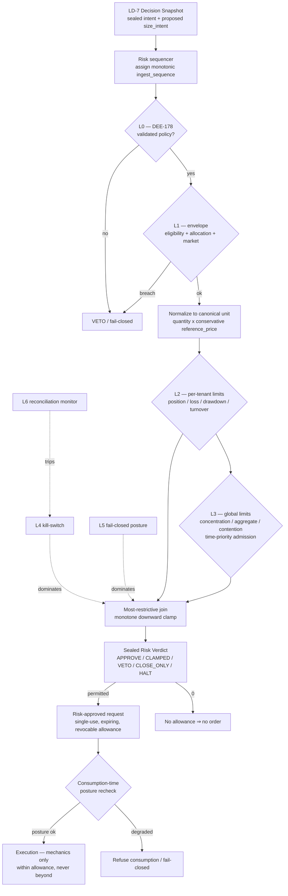

# AI-TRADER — LD-8 Risk Doctrine (Enforcement Layer)

> **Status: Ratified doctrine v1.0 (LD-8 Risk). Accepted upon merge.**
> **Ratification:** LD-8 Risk Doctrine v1.0 · **Parent:** DEE-278 · **Slice:** DEE-297.
> **Subordinate to the [AI-TRADER Market Intelligence Architecture](AI-TRADER-MARKET-INTELLIGENCE-ARCHITECTURE.md) (§7 Defense-in-Depth Risk Stack, §11 Decision Protocol), the [Knowledge-to-Action Doctrine](AI-TRADER-KNOWLEDGE-TO-ACTION-DOCTRINE.md) (DEE-294, §5/§7), the [LD-6 Forecast Doctrine](AI-TRADER-FORECAST-DOCTRINE.md) (DEE-295), and the [LD-7 Decision Doctrine](AI-TRADER-DECISION-DOCTRINE.md) (DEE-296); bounded by [ADR-0009](../adr/0009-regulatory-posture.md) / [ADR-0010](../adr/0010-strategy-validation-gate.md) / [ADR-0011](../adr/0011-single-operator-governance-model.md). Where this document and any of those conflict, they win.**
> **Additive only — it overrides nothing and weakens no governance gate.**
> **No engines.** LD-8 delivers the persisted Risk Verdict record, its append-only enforcement-event substrate, the risk-approved-request contract, and derived read-models only. It adds no automation, no autonomous capital path, no auto-sizing, no portfolio optimizer, and no live-trading path.

Date: 2026-06-23
Scope: How AI-TRADER decides **what is permitted** with capital — validating, clamping (downward only), vetoing, halting, or killing an intent against version-pinned limits, the tenant envelope, data-quality posture, and the kill-switch hierarchy — the layer that stands between every Decision and every unit of capital, including the permission to do nothing.
Authority: Subordinate to the [Market Intelligence Architecture](AI-TRADER-MARKET-INTELLIGENCE-ARCHITECTURE.md), the [Knowledge-to-Action Doctrine](AI-TRADER-KNOWLEDGE-TO-ACTION-DOCTRINE.md), the [Forecast Doctrine](AI-TRADER-FORECAST-DOCTRINE.md), the [Decision Doctrine](AI-TRADER-DECISION-DOCTRINE.md), the [Master Spec v2](AI-TRADER-MASTER-SPEC-v2.md), and ADR-0009/0010/0011. **Where this document and any of those conflict, they win.**
Lineage: Canonical output of the full LD-8 architecture cycle — Design → Hostile Review (NOT READY FOR RECONCILIATION; 1×R0 + R1/R2/R3) → Reconciliation (R0 dissolved by distinguishing allocation arbitration from optimization; R1 cluster accepted) → Hostile Re-Review (READY FOR FINAL RECONCILIATION; N1–N3) → Final Reconciliation (FR1–FR3, SH1–SH4) → Ratification Readiness Review (RATIFIABLE WITH MINOR CLARIFICATIONS; MC1–MC5) → Final Ratification Reconciliation (RATIFIABLE; clarifications C1–C5 integrated). It records final decisions; it does not re-litigate them.

> **Reading note.** Risk is the enforcement hinge of the Knowledge-to-Action chain. Everything upstream earns belief (Forecast owns ACCURACY) and converts it to intent (Decision owns ACTIONABILITY); everything downstream acts (Execution owns MECHANICS). Risk answers exactly one question — **"What is permitted?"** — and answers it monotonically downward: it may clamp, veto, restrict, halt, or kill, but it may **never** raise conviction, raise size, originate an intent, predict, decide, optimize a portfolio, or execute. The optimization target is **permission integrity, fail-closed safety, replay determinism, and capital protection — never trading profitability.**

---

## Section 1 — Purpose

LD-8 is the layer where AI-TRADER stops holding an intent and starts holding a **permission**. A Decision (LD-7) states what, if anything, to do with capital and why; it gates nothing. Risk converts that sealed intent into an enforced, Risk-bounded **allowance** — or denies it — against a layered, fail-closed defense stack. Risk exists to make every path to capital **safe and accountable**: no intent reaches capital except through a deterministic, replayable permission verdict.

LD-8 records **facts** (the sealed Risk Verdict, its append-only enforcement events) and **derived read-models** (current posture, aggregate-exposure views, kill-switch-state projection); it never predicts, never re-judges belief, never re-runs economics, never places orders. Risk is **final-but-not-sole** enforcement (KTA §5, §7): it can always stop the machine, and every relaxation of its bounds is a human action under ADR-0011.

---

## Section 2 — Risk Definition

**Core statement (canonical):**

> **Risk is the deterministic, fail-closed, replayable enforcement layer that decides what is *permitted* with capital — validating, clamping (downward only), vetoing, or halting an intent against version-pinned limits, envelopes, data-quality posture, and the kill-switch hierarchy — and never predicts, never decides, never optimizes a portfolio, never executes, and never raises conviction, size, or permission.**

**Risk IS:**
- **enforcement** — it grants, restricts, or denies permission for an intent to reach capital;
- **monotone-restrictive** — it may only reduce (clamp, veto, close-only, halt, kill); it can never raise size, conviction, or permission (KTA §3.1 non-inflation);
- **fail-closed / default-deny** — the absence of explicit authorization, or any ambiguity, resolves to the most-restrictive applicable posture;
- **deterministic and version-pinned** — every verdict is reproducible from pinned inputs and a pinned `risk_policy_version`;
- **the owner of the canonical exposure-normalization unit** in which all limits are expressed and enforced;
- **the allocation-constraint enforcer and contention arbiter** — ceilings, concentration, aggregate exposure, and preference-free admission of competing intents.

**Risk IS NOT:**
- **a Forecast** — it estimates no probabilities and emits no resolvable claim; it consumes sealed belief, never re-estimates it;
- **a Decision** — it originates no intent, selects no posture on merit, and never *targets* a size; it only clamps a *proposed* size downward;
- **a portfolio optimizer** — it enforces allocation constraints and arbitrates contention; it never computes an optimal capital distribution (reserved to a future Portfolio layer);
- **Execution** — it carries no order type, routing, timing, venue selection, or slicing; it emits an allowance, not an order;
- **the L0 gate authority** — it *enforces* "validated-policy-only" but never grants, weakens, or bypasses DEE-178 (ADR-0010);
- **an autonomous relaxer** — every upward relaxation (raising a limit, re-enabling a kill-switch) is a human action under ADR-0011.

**Position in the chain:** `… → Forecast (LD-6) → Decision (LD-7) →` **Risk (LD-8)** `→ Execution`. Risk consumes the sealed Decision Snapshot, emits a sealed Risk Verdict and a risk-approved request, and is the final-but-not-sole enforcement before capital.

---

## Section 3 — Ownership & Boundaries

Four layers, one clean ownership split. The "is / is-not" boundary prevents responsibility leakage.

| Layer | Owns | Consumes | May NEVER do | Hands downstream |
|---|---|---|---|---|
| **Forecast (LD-6)** | **ACCURACY** — sealed distribution, bands, tails, horizon, Forecast Confidence, calibration | eligible confidence (snapshot) | encode economics; size; decide; enforce | sealed distribution, by digest |
| **Decision (LD-7)** | **ACTIONABILITY** — arbitration, Economic Sub-Evaluation, posture, proposed `size_intent`, Decision Confidence, `whyNotCash` | Forecast (by digest), eligibility, Worldview, market digests | predict; clamp/veto/kill; allocate the book; carry execution mechanics | **sealed intent record (Decision Snapshot)** → L0 |
| **Risk (LD-8)** | **ENFORCEMENT** — validation gate enforcement (L0), envelope enforcement (L1), per-tenant + global limits (L2/L3), kill-switch (L4), execution fail-closed posture (L5), reconciliation (L6); the canonical exposure unit; downward clamp; preference-free contention arbitration; fail-closed posture | sealed Decision Snapshot, Signals, eligibility, data-quality score, envelope, observable aggregates, kill-state | re-judge belief; raise conviction or size; predict; optimize a portfolio; evaluate economic merit; carry order mechanics; grant/weaken L0 | **risk-approved request (allowance only)** → Execution |
| **Execution** | **MECHANICS** — order type, routing, timing, slicing, venue selection | risk-approved request | alter the economic posture; exceed the allowance | orders to venue |

**Audit-only pins (C3).** Risk consumes the **Decision Confidence** and the **Economic Sub-Evaluation** strictly as audit-only, replay-pinned references. They are **never** enforcement inputs: they never set, raise, lower, or condition any limit, clamp, posture, or verdict. Risk's limits are **confidence-independent** and **economics-blind**. Their sole role is accountability and replay attribution.

**Ownership invariant.** Risk's authority is **strictly downward and constraint-derived**. It may always *stop* the machine; it may never *start*, *raise*, or *originate*.

---

## Section 4 — Risk Object Model

Mirroring LD-6 / LD-7 ("record facts; derive interpretations"): an immutable sealed verdict, an append-only enforcement-event substrate, and derived read-models.

**(a) Risk Verdict Record (immutable, sealed by `risk_verdict_definition_digest`):**

| Field group | Contents |
|---|---|
| Identity & policy | `risk_verdict_id`, `organization_id`, `risk_policy_version` (bound to L0 / DEE-178 — validated policy only), `ingest_sequence` (Risk-assigned, monotonic — §7) |
| Consumed intent | `decision_definition_digest`, consumed posture + proposed `size_intent` (normalized), eligibility snapshot, `signals_ref[]` |
| Consumed context | `envelope_ref` (+ version), data-quality score (+ version), kill-switch state as-of, **sealed aggregate-as-of** ref (L3), conservative `reference_price` digest (§6), market observation digests (PIT) |
| Audit-only pins | `decision_confidence` (audit), `economic_sub_evaluation_ref` (audit) — never enforcement inputs |
| Produced facts | verdict class, `approved_size` (canonical unit), `binding_layer`, clamp/veto/close-only reason-codes, posture, allowance validity window + nonce |
| PIT stamps | `issued_at`, `event_time`, `ingest_time` (`ingest_time >= event_time`) |

**(b) Enforcement-event substrate (append-only):** allowance issue / revoke / consumption-recheck; clamp; veto; close-only transition; fail-closed transition; kill-switch trip / recover. Each event is PIT-stamped to its **triggering input `ingest_time`** (not evaluation wall-clock). Posture and kill-switch state are **folded** from this log (latest-event fold) — never mutable columns.

**(c) Derived (never stored mutable):** current posture view, aggregate-exposure / concentration read-models, kill-switch-state projection — computed under named derivation versions.

---

## Section 5 — Decision → Risk Contract

Risk consumes the **sealed LD-7 Decision Snapshot by digest** (LD-7 §5) and treats it as immutable accountability truth.

| Input | Risk **trusts** | Risk **verifies** | Risk **may reject** | Risk **may NEVER modify** |
|---|---|---|---|---|
| Decision Snapshot / digest | ✓ pinned intent | digest integrity, PIT visibility | malformed / unverifiable (inadmissible) | the sealed record |
| `posture` (act/abstain/direction) | ✓ | consistency with envelope / allowed markets | direction outside allowed markets (veto) | the posture's economic content |
| proposed `size_intent` | ✓ as a *proposal* | within L1 cap; normalize to canonical unit | exceeds caps → clamp; breach → veto | upward (never raise) |
| `decision_confidence` | audit-only | — | — | never re-score / probabilize |
| `economic_sub_evaluation` | audit-only | — | — | never re-run / re-cost / act on merit |
| `signals_ref[]` | ✓ | present at entry + open-position reassessment | missing required Signal (fail-closed) | never originate |
| eligibility verdict + reason-set + as-of | ✓ | `ingest_time <= T`; eligible | ineligible → veto | never re-adjudicate |
| market observation digests (PIT) | ✓ | `ingest_time <= T` | stale / missing → data-quality posture | never revise |

**Contract rules.** Risk **verifies provenance and admissibility**, **clamps/vetoes against limits**, and **applies posture**; it **modifies nothing upstream**. The only value Risk derives from `size_intent` is a downward-clamped `approved_size` — a new verdict field, never an edit to the Decision. Risk **never re-judges belief, never re-forecasts, never re-runs the Economic Sub-Evaluation, and never evaluates economic merit**. A malformed or incomplete Decision is **structurally inadmissible** (a presence/integrity check), not content-adjudicated. If a required input is missing or unverifiable, Risk **fails closed**.

---

## Section 6 — size_intent Enforcement (resolves LD-7 OQ1)

Clean split between proposal and enforcement.

- **Decision owns the magnitude proposal.** `size_intent` is *proposed intent only*, derived from Decision's economics, reduced by Worldview, **capped (not targeted) by L1**, and **independent of (not pinned to) the L2–L6 ceiling** (LD-7 §11 R4).
- **Risk owns the representation — the canonical exposure-normalization unit.** Limits are enforceable only if comparable across instruments, accounts, and tenants. The canonical unit is a **pinned, deterministic, forecast-free arithmetic identity** (FR1): reference-currency notional = `quantity × pinned_reference_price`. **Forbidden:** volatility scaling, VaR, risk-parity, beta/factor weighting, or any statistical/predictive transform — any risk-weighted unit is a Forecast leak.
- **Risk owns clamping; Risk does not own sizing.** `approved_size = min(normalized(size_intent), remaining_envelope, applicable_caps)`, floored at 0 (veto). The clamp is **monotone downward** and **constraint-derived**; Risk may output any value in `[0, normalized(size_intent)]` and **never above it**. The `binding_layer` and clamp reason-codes are recorded; the verdict returns `approved_size` but **never discloses the residual global envelope** to Decision (prevents soft-targeting).
- **Reference price (SH2).** Notional for limit enforcement uses a pinned, PIT-clean, **manipulation-resistant** reference (mark/oracle/median class), version-pinned and recorded; single-print/last-trade is forbidden as the sole reference; where ambiguous, Risk uses the price yielding the **larger (more conservative)** exposure estimate. Notional limits are deliberately **risk-insensitive** (coarse) — finer sensitivity is only ever a future consumed, validated input (§15), never a Risk-computed weight.
- **Turnover (C5).** Economics-blindness does not preclude **observable turnover, trade-rate, and frequency limits** computed from counts and notional over time; these are arithmetic enforcement quantities, not economic-merit judgments, and bound churn without evaluating profitability.

**Forbidden (Risk-becomes-Decision guards):** Risk must never compute or suggest an "optimal" size, raise a proposed size, target a number, or originate size when Decision proposed none. The `size_intent ≈ Risk-max` rubber-stamp anti-pattern is a standing governance audit (LD-7 §11 R4).

---

## Section 7 — Allocation Arbitration (resolves LD-7 OQ4)

**Arbitration is not optimization.** Risk performs **allocation arbitration** — resolving contention for a scarce shared envelope by a fixed, preference-free, deterministic rule — and **never allocation optimization** (preference/objective-driven distribution).

- **Preference-free (C2)** means **free of trading-merit ranking** — edge, confidence, expected value, economics, or conviction. The MVP rule is **strict time-priority admission**: competing decisions consume the *remaining* envelope in **Risk-assigned monotonic ingest-sequence order (SH1)** — a strictly increasing sequence number assigned by a single Risk-side sequencer at admission, **not** a Decision-authored timestamp (non-gameable, unambiguous). Each verdict is then a pure `min(normalized_proposal, remaining_envelope, caps)`. Time-priority embeds a temporal-precedence (latency/cadence) property, which is acknowledged and accepted; it carries no trading-merit preference.
- **Pro-rata is removed from Risk (SH3)** and reassigned to the future Portfolio layer: pro-rata distributes proportional to `size_intent`, which encodes Decision's edge/confidence/economics, so it propagates trading-merit into allocation — by definition portfolio construction, forbidden in Risk.
- **L1 vs L3.** **L1** is the per-tenant envelope precondition (eligibility + allocation + allowed markets). **L3** is global/platform enforcement — concentration, aggregate exposure, capacity, and **concurrent-allocation admission** across decisions/tenants.
- **Tenant isolation.** Capital, positions, and risk state **never cross tenants** (KTA §4.1). L3 may only **deny or clamp** a tenant's action to protect a global limit; it may **never reallocate** capital between tenants. Cross-tenant L3 contention and the multi-tenant sequencer are reserved, §6.5-fenced (SH4); MVP is single-tenant (Org-0).

---

## Section 8 — L0–L6 Composition Doctrine

**Disambiguation (C1).** These are the **KTA §7 Risk-enforcement layers (L0–L6)**, wholly distinct from the **Grandmaster strategy-validation stack (L0–L9)**. The numeric overlap is coincidental; the two stacks share no semantics and must never be cross-referenced. Ordering follows ratified KTA §7.

| Layer | Name | Authority owner | Risk role |
|---|---|---|---|
| **L0** | Policy validation gate (DEE-178) | Operator (ADR-0010) | **Enforce verdict only** — validated policy runs; default-deny if unvalidated |
| **L1** | Tenant / decision envelope precondition | User / operator authors | **Enforce** — eligibility + allocation + allowed markets |
| **L2** | Per-tenant Risk Engine | Risk | **Own + enforce** — position/loss/drawdown/exposure/turnover limits; deterministic; fail-closed if unavailable |
| **L3** | Global / platform Risk + concurrent admission | Risk | **Own + enforce** — concentration, aggregate exposure, capacity; deterministic contention admission |
| **L4** | Kill-switch hierarchy | Risk (trip) / human (recover) | **Own trip + enforce**; recovery human-gated |
| **L5** | Execution fail-closed + exchange-side caps | Risk (posture) / Execution (mechanism) | **Define posture**; independent of L2 |
| **L6** | Reconciliation monitor | Risk | **Own** — independent; can trip kill; **fails closed (halt) on loss of data source** |

**Composition and authority:**
1. **Sequential gating, restrictive join.** An intent clears L0 → L1 → L2 → L3; the **effective verdict is the most-restrictive outcome** across all layers (monotone lattice join). Any layer may clamp/veto; no layer loosens another.
2. **Override.** Posture layers (L4 kill / L5 fail-closed / L6 reconciliation) **dominate** per-decision layers downward only — an active kill or fail-closed posture overrides any L0–L3 APPROVE. Restriction is never overridden upward.
3. **Independence (KTA §7.3).** No single common-cause trip dependency; at least one layer uses an independent data path or fails closed. L6 is independent of L2/L3 inputs by construction.
4. **Audit.** Each layer's contribution (clamp/veto/pass/posture) is recorded with the **binding layer** identified, so a verdict's provenance is fully attributable on replay.

---

## Section 9 — Risk Output Model

Risk emits exactly one sealed verdict per intent, in one of a **closed verdict set**:

| Verdict | Meaning | `approved_size` | Downstream effect |
|---|---|---|---|
| `APPROVE` | Permitted as proposed | `= normalized(size_intent)` | full allowance issued |
| `APPROVE_CLAMPED` | Permitted at reduced size | `0 < approved_size < normalized(size_intent)` | reduced allowance + clamp reason-codes |
| `VETO` | Not permitted | `0` | no allowance; reason-codes |
| `CLOSE_ONLY` | Risk-reducing actions only | risk-reducing subset only | restricted allowance (exits/reductions) |
| `HALT` | No new permission (posture) | `0` | fail-closed; existing allowances revocable |

**Output rules.** The verdict set is **closed** (no open-ended "advisory" output); every verdict is **monotone-restrictive** relative to the proposal; every non-APPROVE carries machine-readable **reason-codes** and the **binding layer**. The verdict is the **sole interface to Execution** — Risk hands Execution a **risk-approved request (allowance)**, never an order and never order mechanics. Risk emits **no recommendation, no score, no ranking, and no economic opinion**.

---

## Section 10 — Risk → Execution Boundary (Allowance Lifecycle, FR2)

Risk emits a **risk-approved request** — a permission, not an order. Execution owns all mechanics (order type, routing, timing, slicing, venue); it may act **within** the allowance and **never beyond** it.

**Allowance properties (fail-closed by construction):**
- **Single-use** — one allowance authorizes one Execution attempt for one intent; it is not a standing license.
- **Expiring** — every allowance carries a validity window (`valid_until`) and a nonce; an expired or already-consumed allowance is void. No order may be placed against a void allowance.
- **Revocable (FR2)** — Risk may revoke any outstanding allowance at any time (e.g. on kill-switch trip, fail-closed transition, posture downgrade). Revocation is an append-only enforcement event.
- **Consumption-time posture recheck (FR2)** — at the instant Execution consumes an allowance, the **current** Risk posture and kill-switch state are re-evaluated; if posture has degraded to HALT/CLOSE_ONLY/killed since issuance, consumption is **refused**. This provides **two independent fail-closed paths** (proactive revocation + consumption-time recheck), so a posture change between issuance and consumption can never leak an order.
- **Partial-fill ceiling** — the allowance is a **ceiling for a single intent**; a partial fill consumes the allowance and never re-authorizes a residual top-up. Any further action requires a new Decision → Risk verdict.
- **No allowance ⇒ no order** — absence of a valid, unexpired, unrevoked, posture-confirmed allowance means Execution must not act (default-deny).

**Boundary invariant.** The allowance flows downward only; Execution never alters the economic posture, never widens the allowance, and never re-enters Risk to request more within the same intent.

---

## Section 11 — Data Quality & Fail-Closed

Risk treats data quality as a **first-class enforcement input**, not a best-effort hint.

- **Data-quality score (version-pinned)** accompanies every consumed market input; staleness, gaps, and source disagreement degrade the score.
- **Degraded data ⇒ restriction, never permission.** Below threshold, Risk transitions toward CLOSE_ONLY or HALT; it never *raises* permission on degraded data and never extrapolates missing data favorably.
- **Missing required input ⇒ fail closed.** A missing Signal, missing eligibility, unverifiable digest, stale PIT input, or unavailable limit store resolves to the most-restrictive applicable posture.
- **L6 reconciliation fails closed on data loss.** Loss of the reconciliation data source is itself a fail-closed (HALT) condition — Risk cannot certify exposure it cannot observe.
- **No fail-open path exists.** There is no configuration, timeout, or error branch under which Risk grants more permission than the verified state supports. Every error edge resolves restrictive.

---

## Section 12 — Kill-Switch Hierarchy (L4)

The kill-switch is Risk's terminal authority: the guarantee that the machine can always be stopped.

- **Tiered scope.** Kill-switches exist at strategy, tenant, and platform (global) scope. A higher-scope kill **dominates** lower scopes; a platform kill halts all new permission everywhere.
- **Asymmetric authority (ADR-0011).** **Tripping** is automatic (Risk/L6) or human; **recovery is human-gated only** — no autonomous path re-enables a tripped kill-switch. Re-enable is a logged single-operator action.
- **Trip ⇒ revoke + deny.** On trip, Risk revokes outstanding allowances in scope (FR2) and denies new permission; in-flight consumption is refused by the consumption-time recheck.
- **State is folded, not mutated.** Kill-switch state is derived from the append-only trip/recover event log (latest-event fold), PIT-stamped to triggering `ingest_time`, so the active state at any `T` is deterministically replayable.
- **Default posture.** Undefined or ambiguous kill-state resolves to **killed** (fail-closed), never to live.

---

## Section 13 — Anti-Cascade

Fail-closed must not become a self-amplifying outage. Risk's restrictive bias is bounded so that protection does not manufacture systemic harm.

- **Restriction is monotone but scoped.** A degraded input restricts only the scope it actually compromises (a single market's stale feed need not platform-HALT) — restriction is proportional to the **observed** compromise, never speculative escalation.
- **No restriction feedback loop.** A clamp/veto on one intent must not synthetically degrade the inputs of unrelated intents; enforcement events do not feed back as data-quality signals.
- **Recovery is deterministic and human-gated.** Exiting HALT/CLOSE_ONLY follows the same fail-closed posture logic in reverse and, for kill-switches, requires explicit human re-enable; there is no oscillation path.
- **Anti-cascade never loosens.** Anti-cascade scoping reduces *over-restriction*; it can never be invoked to grant more permission than the verified state supports. When in doubt between cascade-risk and capital-risk, **capital protection wins** (more restrictive).

---

## Section 14 — Replay & Audit

Risk is **fully replayable**: given the pinned inputs and `risk_policy_version`, every historical verdict reproduces bit-for-bit.

- **Risk-assigned ingest sequencing (SH1).** A single Risk-side sequencer assigns a strictly monotonic `ingest_sequence` at admission; arbitration and contention resolution are ordered by this sequence, not by Decision-authored timestamps — deterministic and non-gameable.
- **Sealed aggregate-as-of (L3).** Each verdict pins a sealed snapshot of the aggregate/concentration state it enforced against, so global-limit verdicts replay against the exact state observed, not a later mutation.
- **PIT discipline.** Every consumed input is admitted only if `ingest_time <= T`; enforcement events are stamped to triggering-input `ingest_time` (`ingest_time >= event_time`), never evaluation wall-clock.
- **Conservative reconciliation-lag aggregation.** Where reconciliation lags, Risk aggregates conservatively (assume the **worse** exposure) until confirmed, so replayed verdicts never under-count exposure due to timing.
- **Sealed, append-only verdicts.** Verdicts are immutable and digest-sealed; posture and kill-state are folds over an append-only event log; nothing is mutated in place.
- **Full attribution.** Each verdict records its binding layer, reason-codes, consumed digests, policy version, and audit-only pins — a complete, independently-auditable provenance chain.

---

## Section 15 — Governance Compatibility

LD-8 is bounded by, and reinforces, existing governance. It instantiates no new gate and weakens none.

- **L0 / DEE-178 (ADR-0010).** Risk **enforces** "validated-policy-only" as L0 but never grants, weakens, or bypasses it. Default-deny: an unvalidated or unknown policy version cannot produce permission.
- **Risk-limit relaxation re-opens DEE-178 (FR3).** Any change to risk limits that **expands the validated envelope** of an already-validated strategy (raising a cap, widening exposure, loosening concentration) **must re-open DEE-178** for re-confirmation — a validated strategy's safety case is only valid within the envelope it was validated against. **Tightening or shrinking** an envelope never requires re-validation (it is monotone-safe). This closes the limit-relaxation bypass.
- **Risk-limit governance (ADR-0011).** Changing risk limits is a distinct, logged, single-operator governance action; there is no autonomous limit-relaxation path. All relaxations are human, audited, and (per FR3) revalidation-gated where they expand a validated envelope.
- **Predictive-input default-deny (FR1 / C4).** MVP Risk consumes **no predictive input** (correlation, volatility, capacity, factor models). The canonical unit and all limits are observable arithmetic only. This is ratified posture, not a placeholder.
- **Regulatory posture (ADR-0009).** Risk's fail-closed, human-gated-relaxation, fully-audited design is consistent with the conservative regulatory posture; nothing here authorizes autonomous capital action.

---

## Section 16 — Reserved Future Work

Explicitly **out of scope** for v1.0 and fenced for later doctrine slices (none instantiated here):

- **(C4) Risk-model validation gate + risk-limit-governance ADR.** A future gate/ADR governing (a) admission of any predictive input and (b) the formal risk-limit-change process. Until ratified, predictive inputs remain default-denied and limit changes follow ADR-0011 + FR3.
- **(FR1) Predictive-input admission regime.** Any future consumption of correlation/volatility/capacity requires: independent derivation (KTA §7.3), provenance, an independent validation framework, version-pinning, **downward-only application** (may only restrict, never raise permission), and a fail-closed fallback when the input is unavailable or stale.
- **(SH3) Portfolio layer.** Allocation **optimization** (pro-rata, edge-weighted, risk-parity capital distribution) belongs to a future Portfolio layer between Decision and Risk, not to Risk.
- **(SH4) Multi-tenant sequencer + cross-tenant L3 arbitration.** Cross-tenant contention and a multi-tenant ingest sequencer are reserved; MVP is single-tenant (Org-0).
- **Futures / derivatives exposure unit.** The canonical unit extends beyond spot notional (margin, leverage, contract multipliers) only under a future validated extension; MVP is spot-only (ADR / MVP scope).
- **Decision Confidence numeric scale.** Remains a reserved LD-7 open question; Risk treats confidence as audit-only regardless.

---

## Section 17 — Risk Flow (canonical)

---

## Section 18 — KTA Clarification (annotation only)

This doctrine is a **clarification** of the Knowledge-to-Action chain, **not** a KTA amendment. It instantiates the **Risk** position already named in KTA §5 (`… → Decision → Risk → Execution`) and the §7 Defense-in-Depth Risk Stack (L0–L6), expressing them as ratified doctrine. The KTA chain is **unchanged**; no KTA v1.1 is required. Where any wording here appears to extend KTA, it is subordinate and additive, and KTA / the MI Architecture win on conflict.

---

## Section 19 — Ratification Statement

**LD-8 Risk Doctrine v1.0 is ratified as Accepted Canon**, subordinate and additive to the Market Intelligence Architecture (§7, §11), the Knowledge-to-Action Doctrine (DEE-294), the LD-6 Forecast Doctrine (DEE-295), and the LD-7 Decision Doctrine (DEE-296), and bounded by ADR-0009 / ADR-0010 / ADR-0011.

This ratification affirms:

- **Ownership.** Forecast = ACCURACY · Decision = ACTIONABILITY · **Risk = ENFORCEMENT** · Execution = MECHANICS. Risk answers only "what is permitted?" — monotone-restrictive, fail-closed, deterministic, replayable, economics-blind, forecast-blind.
- **OQ1 (size_intent)** resolved: Decision proposes magnitude; Risk owns the canonical exposure unit and clamps downward only; Risk never sizes, targets, or raises.
- **OQ4 (allocation)** resolved: Risk performs preference-free time-priority **arbitration**, never optimization; pro-rata is reassigned to a future Portfolio layer.
- **FR1** — MVP consumes no predictive input; canonical unit is forecast-free arithmetic notional; future predictive inputs are gated (independent derivation, provenance, validation, version-pin, downward-only, fail-closed fallback).
- **FR2** — allowances are single-use, expiring, **revocable**, with a **consumption-time posture recheck** (dual fail-closed paths).
- **FR3** — risk-limit relaxation expanding a validated envelope **re-opens DEE-178**; tightening never does.
- **SH1** — arbitration ordered by Risk-assigned monotonic ingest sequence (non-gameable).
- **SH2** — notional uses a conservative, manipulation-resistant reference price; never under-counts exposure.
- **SH3** — pro-rata removed from Risk (reserved to Portfolio).
- **SH4** — cross-tenant / multi-sequencer arbitration reserved (§16-fenced).
- **C1** — Risk L0–L6 (KTA §7) is disambiguated from the Grandmaster L0–L9 stack; KTA §7 ordering is canonical.
- **C2** — "preference-free" = free of trading-merit ranking; time-priority's latency/cadence property is named and accepted.
- **C3** — Decision Confidence and Economic Sub-Evaluation are **audit-only** pins, never enforcement inputs; limits are confidence-independent.
- **C4** — predictive-input default-deny is ratified; the risk-model validation gate and risk-limit-governance ADR are reserved (not instantiated).
- **C5** — observable turnover / rate limits are permitted within economics-blindness.

**This is a documentation-only doctrine.** It adds no code, schema, migration, runtime, or ADR edit; it instantiates no engine and authorizes no autonomous capital path. Relaxation of any bound herein is a human action under ADR-0011. Accepted upon merge.
