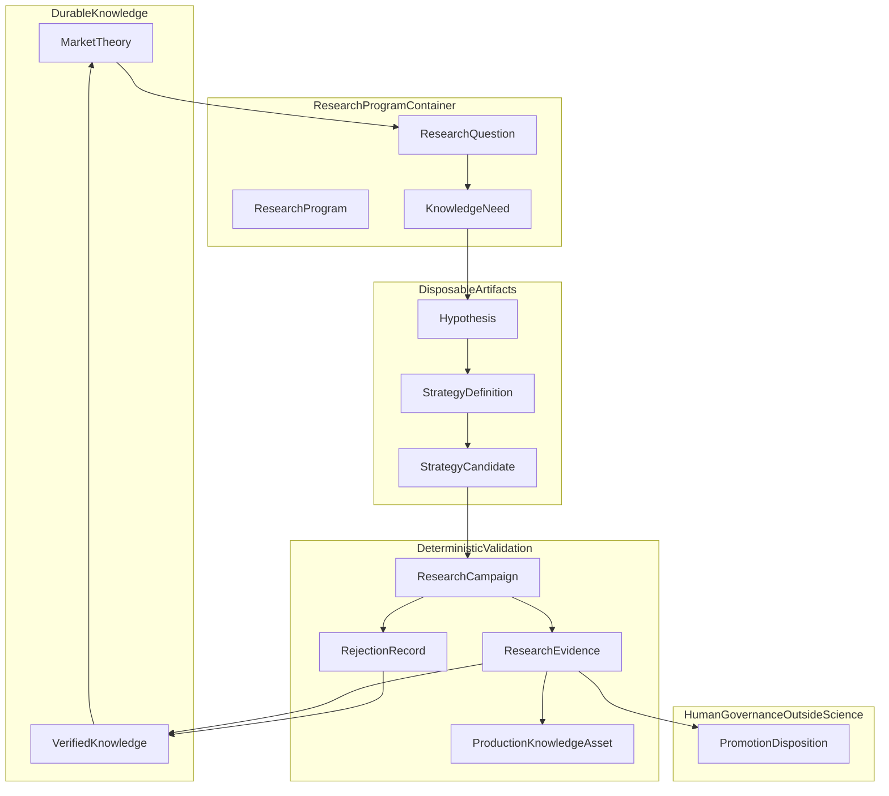
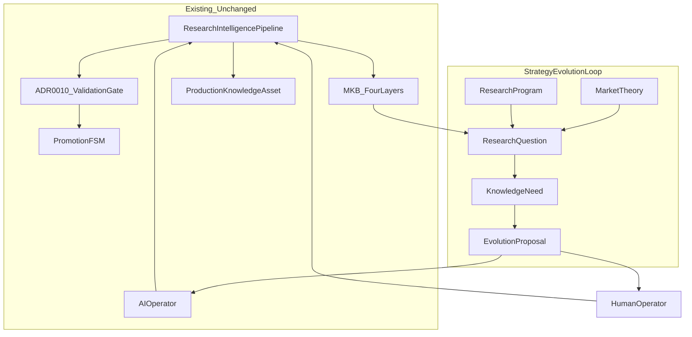

# AI-TRADER — Strategy Evolution Loop

> **Status:** Architectural research canon v1.0 (2026-07-03)  
> **Authority:** Subordinate to [AI-TRADER Product Constitution](../AI-TRADER-PRODUCT-CONSTITUTION.md), [ADR-0018](../adr/0018-research-intelligence-market-knowledge-base.md), [ADR-0019](../adr/0019-ai-operator-intelligence-authority.md), [ADR-0010](../adr/0010-strategy-validation-gate.md), [ADR-0011](../adr/0011-single-operator-governance-model.md), [Market Intelligence Architecture §13](AI-TRADER-MARKET-INTELLIGENCE-ARCHITECTURE.md), and [Hypothesis + Evidence Ledger](AI-TRADER-HYPOTHESIS-EVIDENCE-LEDGER.md).  
> **Not:** an implementation spec, roadmap, or code contract.  
> **Grounding:** RI-P7 recovery chain complete (DEE-365→369); Org-0 Track A `STRATEGY_FAILED` at post-blind bundle regime coverage.

---

## 0. Executive thesis

WAIA AI-TRADER is a **research organism**, not a strategy library. Its durable product is **validated market knowledge**; strategies are compiled, tested, and discarded. The Strategy Evolution Loop is the canonical epistemic cycle that converts accumulated knowledge into better questions, sharper theories, testable hypotheses, and—only after deterministic validation and human governance—capital exposure.

The Org-0 `mean_reversion_v0` outcome is the loop's first legitimate **strategy rejection**, not an engineering failure. Infrastructure and ADR-0010 behaved correctly. The correct response is not "fix Mean Reversion" but **evolve the research program**: ask why down-regime trade attribution is absent, update theories, and propose new hypotheses under governance.

**Non-negotiable invariants (unchanged):**

- ADR-0010 evidence class and thresholds governance — **not weakened**
- ADR-0011 single-operator promotion FSM — **not weakened**
- Deterministic RI pipeline — **not redesigned**
- Machine researches; human promotes — **never inverted**

---

## 1. Canon map and terminology

### 1.1 Governing documents

| Document | Role |
|----------|------|
| [Product Constitution](../AI-TRADER-PRODUCT-CONSTITUTION.md) | Knowledge-first identity; §5–6 lifecycle |
| [Research Intelligence Program](AI-TRADER-RESEARCH-INTELLIGENCE-PROGRAM.md) | RI packages, MKB, operator |
| [Market Intelligence Architecture §13](AI-TRADER-MARKET-INTELLIGENCE-ARCHITECTURE.md) | Evolution Governance (Knowledge Need, Evolution Proposal) |
| [Hypothesis + Evidence Ledger](AI-TRADER-HYPOTHESIS-EVIDENCE-LEDGER.md) | LD-5a falsifiability, trial integrity |
| [Grandmaster Strategy Framework](AI-TRADER-GRANDMASTER-STRATEGY-FRAMEWORK.md) | Validation stack, genome, epochs (proposed doctrine) |
| [ADR-0010](../adr/0010-strategy-validation-gate.md) | Promotion evidence class |
| [ADR-0018](../adr/0018-research-intelligence-market-knowledge-base.md) | MKB four layers; no graph DB |
| [ADR-0019](../adr/0019-ai-operator-intelligence-authority.md) | Recommend-only operator |

### 1.2 Implementation anchors (not redesigned by this document)

| Concern | Location |
|---------|----------|
| RI orchestrator | `lib/trader/research/research-orchestrator.ts` |
| Regime coverage | `lib/trader/research/regime-coverage.ts` |
| Strategy candidate FSM | `lib/trader/research/strategy-candidate.types.ts` |
| Promotion FSM | `lib/trader/validation-gate/transitions.ts` |
| Production Knowledge Asset | `lib/trader/knowledge/production-knowledge-asset.types.ts` |
| AI Operator authority | `lib/trader/operator/operator-authority.ts` |
| MI trial `researchProgram` | `lib/trader/mi/trial.types.ts`, `trial-service.ts` |
| MKB edge recording | `lib/trader/research/record-research-knowledge.ts` |

### 1.3 Terminology reconciliation

[WAIA Canonical Architecture §8](../WAIA-CANONICAL-ARCHITECTURE.md) previously mapped **Research Questions** to Hypothesis or Knowledge Need. This document **refines** that mapping:

| Term | Position in epistemic stack |
|------|----------------------------|
| **Research Question** | Between Observation and Knowledge Need; not yet falsifiable |
| **Knowledge Need** | MI §13.1 — evidenced limitation; proposes no remedy |
| **Market Theory** | Above Hypothesis — durable explanatory model |
| **Research Program** | MI §13.2 Research Program Proposal + `researchProgram` on trials |
| **Hypothesis** | LD-5a — falsifiable, version-pinned claim |

---

## 2. WAIA scientific method

Strategy Evolution follows an explicit scientific method—aligned with Product Constitution §5.4–§5.6 and §6:

```text
Observation → Research Question → Knowledge Need → Hypothesis → Experiment
    → Evidence / Rejection → Knowledge → Theory revision → (next Question)
```

**Capital promotion sits outside this loop.** Promotion is a governance act under ADR-0010/0011, not a scientific conclusion.

### 2.1 Method invariants

| Invariant | Meaning |
|-----------|---------|
| **Falsifiability** | Every hypothesis carries mandatory falsification conditions and required-null declarations (LD-5a) |
| **Reproducibility** | Every experiment pins dataset digests, `strategyVersion`, builder SHA, cost model version |
| **Blind single-use** | One immutable blind evaluation per candidate; re-runs rejected |
| **Failed knowledge retained** | Rejections archived—never silently deleted (Constitution §5.7) |
| **Absence = failure** | No evidence is not neutral; it blocks promotion |
| **Human-broken actuation** | Only human disposition changes what touches capital or sealed methodology |

### 2.2 Org-0 case study (`STRATEGY_FAILED`)

| Stage | Outcome |
|-------|---------|
| Observation | 90d BTC/USDT 1m; regimes observed in replay |
| Research Question (implicit) | Why does mean-reversion produce RANGE/CHOP attribution but not down-regime trades? |
| Experiment | RI pipeline on sealed splits |
| Result | Validation + WF + blind completed; union coverage `CHOP, RANGE` only |
| Rejection | ADR-0010 bundle regime coverage FAIL |
| Knowledge | Down-regime mean-reversion trade attribution absent on this window |

---

## 3. Epistemic object model

### 3.1 Layer hierarchy



### 3.2 Object definitions

| Object | Definition | Durable? | Executable? |
|--------|------------|----------|-------------|
| **Observation** | PIT-stamped fact or pattern | Yes | No |
| **Research Question** | Open interrogative—not yet a claim | Yes | No |
| **Knowledge Need** | Evidence-grounded knowledge limitation (MI §13.1) | Yes | No |
| **Market Theory** | Explanatory model from which hypotheses derive | Yes | No |
| **Hypothesis** | Falsifiable, version-pinned claim | Yes (archived if refuted) | No |
| **Strategy** | Compiled rules expressing hypothesis(es) | Versioned; disposable | Yes |
| **Strategy Candidate** | Registered experiment instance | Lineage preserved | Yes (research) |
| **Research Evidence** | Sealed ADR-0010 gate artifact | Yes | No |
| **Rejection Record** | Symmetric campaign failure bundle | Yes | No |
| **PKA** | Immutable MKB product output | Yes | No |
| **Knowledge** | Verified edge in MKB read-model | Yes | No |

### 3.3 Research Question

**What it is:** An explicit, open interrogative derived from observations, failures, anomalies, or human insight.

**What it is not:**

- Not a **Hypothesis** (no falsification conditions yet)
- Not a **Knowledge Need** (asks *why* before diagnosing *what is missing*)
- Not a **Strategy idea** (does not prescribe execution)

**Creation sources:** campaign failures, regime anomalies, theory–observation contradictions, human/operator insight (ADR-0019 propose-only), meta-learning signals.

**Example (Org-0):**

> Under what market conditions does `mean_reversion_v0` generate trade-attributed activity in TREND_BEAR or STRESS, and when does signal generation fail to produce closed trades?

A failed campaign does **not** immediately mean "build a new strategy." It may mean: *What do we not understand about down-regime behavior?*

### 3.4 Market Theory

**What it is:** A durable explanatory model—regime-scoped, confidence-weighted—not executable code.

**Example:**

> In high-stress down regimes, liquidity clusters at prior breakdown levels; mean-reversion signal half-life shortens versus range regimes, reducing closed-trade attribution unless execution latency and rate limits are explicitly modeled.

**Relationships:**

- **Theory** explains; **Hypothesis** claims; **Strategy** executes; **Knowledge** records what survived validation
- Strategies are disposable; theories evolve by **revision** (new version), not overwrite
- Theories may reach **Contradicted / Deprecated** while retained in archive

---

## 4. Research Programs

Long-lived containers grouping questions, hypotheses, campaigns, failures, and knowledge.

### 4.1 Canonical program examples

| Program | Scope |
|---------|-------|
| Mean Reversion Research Program | Range/chop reversion, stress decay, attribution gaps |
| Trend Following Research Program | Momentum persistence, breakout quality |
| Liquidity / Microstructure Program | Sweep, recovery, rate-limit interaction |
| Volatility Expansion Program | Regime transitions, vol clustering |
| Regime Classification Program | CDE taxonomy calibration |
| Execution Quality Program | Mock vs paper parity, slippage, order-rate effects |

### 4.2 Program responsibilities

- Owns a portfolio of **Research Questions** and open **Knowledge Needs**
- Accumulates **program-level meta-learning**
- **Survives individual strategy rejection**—a failed candidate feeds the program
- Authorizes campaign scheduling under Research Economy priorities (§9)
- Maps to MI **Research Program Proposal** and `researchProgram` on MI trials

### 4.3 Org-0 program contribution

`mean_reversion_v0` STRATEGY_FAILED enriches the **Mean Reversion Research Program** with regime attribution map (`CHOP`, `RANGE` present; down-regime absent), an open Research Question, and candidate lineage (rejected, blind consumed). The program continues.

---

## 5. Canonical evolution sequence

```text
Observation
  → Research Question
  → Knowledge Need (when limitation is evidenced)
  → Hypothesis (falsifiable, version-pinned)
  → Strategy Definition (genome: params, regime scope, failure modes)
  → Strategy Candidate (registry instance)
  → Research Campaign (deterministic RI pipeline — unchanged)
  → Research Evidence  OR  Rejection Record
  → Production Knowledge Asset (pass or fail)
  → Knowledge / Theory revision
  → Meta-Learning update
  → next Research Question
```

**Promotion branch (outside scientific loop):**

```text
Evidence QUALIFIED → Human Gate 1 → Promotion record → ADR-0011 FSM → LIVE_LIMITED
```

---

## 6. Active knowledge intelligence

Knowledge is not passive storage. MKB plus read-models perform **continuous epistemic surveillance**:

| Detection | Emits |
|-----------|-------|
| Contradictory evidence vs active theory | Conflict record + Research Question |
| Weak / decaying confidence | Knowledge Need |
| Missing regime coverage | Knowledge Need + Research Question |
| Duplicate hypothesis digest | Block registration; merge proposal |
| Unused evidence | Research Question |
| Stale theory | Knowledge Need; decay signal |
| Overfit parameter clusters | Knowledge Need; FDR flag |
| Repeated failure mode | Meta-learning → program priority |

Near-term: deterministic gap detectors + operator panel. Long-term: assisted authoring (human-dispositioned per MI §13.3 firewalls).

---

## 7. Knowledge quality and maturity

### 7.1 Maturity ladder

| Level | Description |
|-------|-------------|
| **Raw Observation** | PIT fact; uninterpreted |
| **Candidate Knowledge** | Pattern or edge claim; unverified |
| **Weak Evidence** | Single-regime or low sample |
| **Regime-Scoped Knowledge** | Validated within declared regime slice |
| **Stable Knowledge** | Multi-regime confirmation; reproducible |
| **Core Market Theory** | Durable explanatory model; high confidence |
| **Contradicted / Deprecated** | Refuted or superseded; archived |

### 7.2 Quality attributes

Confidence (ordinal + calibration), regime coverage, instrument/venue coverage, dataset coverage (digest), evidence age, contradiction status, reproducibility (digest chain), operational relevance (program/promotion link).

PKA `EvolutionMetadata` reserves `lifecycleState`, `knowledgeNeed`, `evolutionProposal`, `supersedesKnowledgeId` as architectural hooks.

---

## 8. Meta-learning

AI-TRADER must learn **how to research better**, not only which strategies pass.

### 8.1 Tracked signals

| Signal | Use |
|--------|-----|
| Hypothesis source yield | Which sources produce validated knowledge |
| Feature family overfit rate | Which features repeatedly fail blind/WF |
| Regime exploration map | Under-explored vs over-tested regimes |
| Strategy failure recurrence | Same genome region failing |
| Program expected value | Campaigns per knowledge gain |
| Operator proposal acceptance | Calibrate ADR-0019 assistance |

### 8.2 Outputs

Research Program priority (human-approved), Research Economy allocation, Knowledge Need templates. **No autonomous promotion or capital allocation.**

---

## 9. Research economy

### 9.1 Costs

Campaign cost (operator time, compute), data cost (backfill, storage), compute cost (WF windows), blind consumption (irreversible per candidate), opportunity cost, false-discovery cost (multiple-testing across programs).

### 9.2 Value

Expected knowledge gain, expected strategy value (only if ADR-0010 class plausibly satisfiable), research priority score (gap severity × program importance ÷ cost).

### 9.3 Scheduling doctrine

- Next campaign selected by **human operator**—not autonomous scheduler
- Failed campaigns produce **epistemic ROI**, not PnL
- Blind reuse forbidden; new candidate/version required
- Parameter sweeps consume FDR budget registers (LD-5a, MI §13)

---

## 10. Anti-overfitting governance

ADR-0010 unchanged.

| Control | Mechanism |
|---------|-----------|
| Blind single-use | `blindUsed` lock; immutable blind result |
| Hypothesis amendment = new version | LD-5a version pinning |
| Parameter search budget | FDR register; genome distance minimum |
| Multiple-testing / FDR | Trial counts per program |
| P-hacking prevention | No auto-rerun; human selects next experiment |
| Lineage + genome distance | Grandmaster Part 6 |
| Duplicate retest prevention | Hypothesis digest dedup |
| Sealed dataset immutability | ADR-0019 forbidden actions |

---

## 11. Human vs AI responsibilities

Authority ladder (ADR-0019):

> Intelligence recommends → deterministic evaluators compute → human operator attests → deterministic gate assembles → FSM transitions under ADR-0011.

| Stage | Human | AI Operator | Deterministic |
|-------|-------|-------------|---------------|
| Research Question | **Approve** | Propose | Gap detectors draft |
| Knowledge Need | Disposition | — | Detectors (future) |
| Market Theory | **Required** | Propose | — |
| Hypothesis / candidate registration | **Required** | Propose | Schema validation |
| Campaign execution | Operator trigger | Whitelisted trigger | RI pipeline |
| Evidence / rejection / PKA | — | — | **Full** |
| Gate 1 / promotion / live capital | **Required** | **Forbidden** | FSM after attestation |

Grandmaster Epoch model: AI may expand research *breadth*; promotion ladder **never shortens**.

---

## 12. Strategy and promotion lifecycle

Synthesizes RI candidate FSM, deployment lifecycle, and promotion FSM without replacing any:

```text
EXPERIMENTAL
  → CANDIDATE_REGISTERED
  → RESEARCH_VALIDATED (backtest + WF)
  → BLIND_VALIDATED (blind consumed)
  → EVIDENCE_QUALIFIED | REJECTED
  → KNOWLEDGE_SEALED (PKA + MKB edges)
  → FORWARD_PAPER
  → PROMOTION_PENDING (PENDING_CONFIRM → COOLING_OFF)
  → PRODUCTION_CANDIDATE (EFFECTIVE → LIVE_LIMITED)
  → LIVE_TRADING → CONTINUOUS_MONITORING → RETIRED | QUARANTINED
```

Org-0: `mean_reversion_v0` reached `BLIND_VALIDATED`, failed before `EVIDENCE_QUALIFIED` → **REJECTED**.

---

## 13. Knowledge architecture

| Layer | Form | Anchor |
|-------|------|--------|
| Research Program | Named container | MI Research Program Proposal; trial field |
| Research Question | Versioned interrogative | **This document (Concept)** |
| Market Theory | Versioned explanatory object | **This document (Concept)** |
| Hypothesis | MI record + digest | `trader_mi_hypothesis` |
| Strategy | Versioned executable | Strategy registry |
| Candidate | Experiment instance | `trader_strategy_candidates` |
| Evidence | Gate artifact | `ResearchEvidenceDocument` v2 |
| Rejection record | Failure bundle | PKA fail reason + vault |
| PKA | Vault artifact | `waia.trader.production-knowledge-asset.v1` |
| Knowledge edges | Relational overlay | `trader_knowledge_edges` (no graph DB) |
| Promotion | FSM record | validation-gate types |

**Not canonical:** strategies as documents only; pure GA population; graph DB authority.

---

## 14. Evolution mechanisms

| Mechanism | Verdict |
|-----------|---------|
| Manual evolution | **Now** |
| Knowledge Need → Evolution Proposal → campaign | **Canonical near-term** |
| LLM-guided drafting | **Assist only** (ADR-0019) |
| Bayesian optimization (frozen hypothesis) | **Allowed** with trial budget + new blind |
| Genetic algorithms | **Future sandbox only** |
| Reinforcement learning | **Reject** for capital path |
| Program synthesis | **Long-term R&D** |
| Autonomous campaign scheduling | **Future — human approval required** |
| Autonomous promotion | **Forbidden permanently** |

**Canonical direction:** Hybrid epistemic evolution — active knowledge → Research Questions → Knowledge Needs → Evolution Proposals → deterministic campaigns → symmetric knowledge capture → meta-learning.

---

## 15. Integration (no RI pipeline redesign)



The Evolution Loop adds epistemic objects and governance **upstream** of the unchanged RI pipeline and promotion gate.

---

## 16. Scope boundaries

### In scope (this document)

Research Questions, Research Programs, Market Theory, Knowledge Needs, hypothesis/candidate lifecycle, rejection records, lineage, knowledge maturity, active surveillance (conceptual), meta-learning (conceptual), research economy (conceptual), human-broken loop, ADR integration map.

### Out of scope (future / forbidden)

Genetic algorithms, RL, program synthesis as promotion paths; autonomous campaign scheduling without approval; autonomous strategy generation without hypothesis registration; autonomous or LLM-scored promotion; graph database; live capital optimization; World State Engine dependency; numeric WSR/RD engine.

---

## Recommended Canonical Strategy Evolution Architecture for WAIA AI-TRADER

WAIA AI-TRADER evolves strategies through a **human-broken, knowledge-first epistemic organism**:

1. **Observe** into MKB Facts and Events.
2. **Ask** Research Questions before new strategies.
3. **Diagnose** via Knowledge Needs (MI §13).
4. **Explain** with versioned Market Theories.
5. **Organize** in Research Programs that survive rejections.
6. **Claim** via falsifiable Hypotheses (LD-5a).
7. **Compile** disposable Strategies and Candidates.
8. **Experiment** via the **unchanged** deterministic RI pipeline.
9. **Record** pass and fail symmetrically (Evidence, Rejection, PKA, edges, lineage).
10. **Mature** knowledge with decay and contradiction handling.
11. **Learn** meta-research signals to prioritize programs.
12. **Promote** only through human Gate 1 + ADR-0010 + ADR-0011.

**Near-term mechanism:** Active knowledge → Research Question → Knowledge Need → Evolution Proposal → registered hypothesis/strategy → deterministic campaign → knowledge capture → theory/program revision.

**Strategy is consumable; theory and knowledge are durable.** Org-0's `mean_reversion_v0` rejection proves the veto layer works. The Evolution Loop begins with better questions—not another manual strategy patch.

---

## Related

| Document | Role |
|----------|------|
| [Research Intelligence Program](AI-TRADER-RESEARCH-INTELLIGENCE-PROGRAM.md) | RI pipeline packages |
| [Market Intelligence Architecture §13](AI-TRADER-MARKET-INTELLIGENCE-ARCHITECTURE.md) | Evolution Governance |
| [Grandmaster Strategy Framework Part 6–7](AI-TRADER-GRANDMASTER-STRATEGY-FRAMEWORK.md) | Genome, epochs |
| [RI-P7 Evidence Campaign Runbook](../ops/RI-P7-EVIDENCE-CAMPAIGN-RUNBOOK.md) | Operator campaigns |
| [WAIA Canonical Architecture §8](../WAIA-CANONICAL-ARCHITECTURE.md) | Platform knowledge loop mapping |
