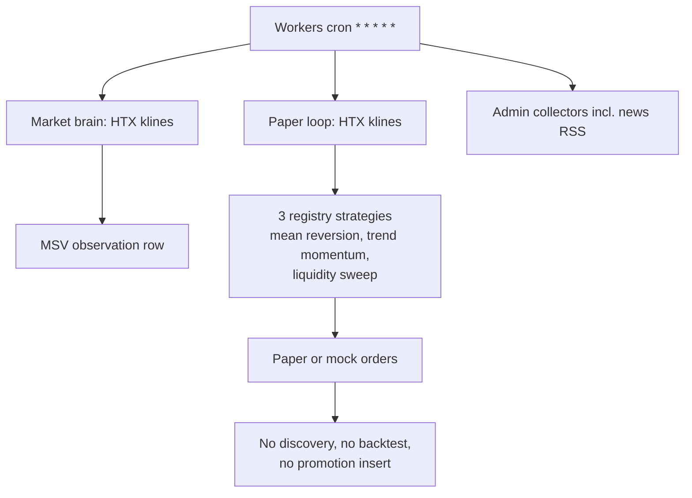
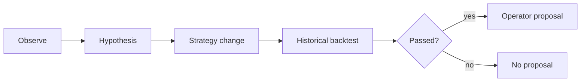

# AI-TRADER discovery loop — read-only audit (2026-09-29)

Scope: code on `main` at the time of this audit. No runtime database was queried. The production fact supplied with the request — `trader_strategy_promotion_records` empty, live nowhere enabled — is explained by the control flow below. Secrets were not read.

Expected cycle: observe market states → form hypotheses → propose a new strategy or a change to an existing one → backtest on history → offer the operator only a candidate that passed. Persistence targets named in the request: `trader_discovery_promotion_proposal` and `trader_strategy_promotion_records`. Repeating-pattern observation is a separate module.

## Verdict

The pieces of that cycle exist as libraries, tables, and operator CLIs. They are not one running loop. The Cloudflare cron that actually starts in production observes HTX spot bars and runs three hand-authored paper strategies. It never calls discovery, never backtests a generated candidate, and never inserts a promotion row. Live execution is a separate gate that requires an `EFFECTIVE` promotion record plus an org live-enable; the worker does not turn that gate on.

An empty promotion table is the expected steady state of this code, not a missed schedule tick.

## 1. What exists, and what actually runs

### Production schedule

`wrangler.jsonc` registers one cron, `* * * * *` (lines 8–9). `custom-worker.ts` `scheduled` (lines 107–249) runs, in order:

| Step | Entry | Production flag in `wrangler.jsonc` |
| --- | --- | --- |
| Payment watcher | `runPaymentWatcherCycle` | `WATCHER_ENABLED=1` |
| Treasury watcher | `runTreasuryWatcherScheduled` | off unless `TREASURY_WATCHER_ENABLED` |
| Settlement | `lib/trader/settlement/build-worker-deps.ts` | always attempted |
| Market brain | `runMarketBrainCycle` | `MARKET_BRAIN_ENABLED=1` |
| Paper loop | `runPaperLoopCycle` | `PAPER_LOOP_ENABLED=1` |
| Admin collectors | `runDueAdminCollectors` | `WAIA_ADMIN_CONSOLE_COLLECTORS_ENABLED=1` |

There is no discovery, research-pipeline, pattern-catalog, or live-order step in that handler. Errors in market brain and paper are logged and swallowed (`custom-worker.ts` 183–229), so a failed observation minute does not surface as a promotion failure.

### Data-flow that is actually scheduled



Market brain (`lib/trader/market-brain/run-market-brain-cycle.ts` 55–82) polls HTX and optionally persists an MSV via `recordMsvObservationSafe`. Paper (`lib/trader/paper/run-paper-loop-cycle.ts` 95–160) polls the same style of HTX bundle and calls `runPaperCycleOnce` with the MVP registry. Registry lifecycle is `PAPER` or `RESEARCHING`, never `LIVE` (`lib/trader/intelligence/strategies/registry-metadata.ts` 30–48). Assignments are “both/all strategies for every org” (`registry.ts` 57–59), not a discovered candidate.

### Expected cycle, mapped to code



| Stage | Implementation | Called from production cron | Called from operator CLI | Persistence |
| --- | --- | --- | --- | --- |
| Observe states | Market brain + paper HTX poll | Yes | n/a | MSV observations when the service is wired |
| Observe for discovery | `synthesizeObservations` | No | No. CLI passes `bars: []`, `closedTrades: []` | Insert helper exists, zero callers |
| Hypotheses | `buildFalsifiableHypothesisV2` template; `runHypothesisStudio` | No | Discovery CLI never reaches it | Studio is unit-tested only |
| New or changed strategy | `deriveStrategyEvolutionGenerationV2` adds `1` to the first numeric param; generator has one template | No | No | In-memory object |
| Backtest | `runResearchPipelinePostgres` | No | `pnpm trader:research:pipeline`, `pnpm trader:m9:campaign`, FHV CLIs | `trader_backtest_runs`, candidates, walk-forward windows, blind result |
| Discovery promotion artifact | `buildPromotionProposal` / `buildHumanPromotionProposalV2` | No | In-memory if a test supplies a full admission | `insertDiscoveryPromotionProposalPostgres` has no callers. `trader_human_promotion_proposal_v2` has schema and RLS and no application writer |
| Operator promotion record | `requestPromotion` → `assembleStrategyPromotionRecord` | No | Admin `POST` and `scripts/trader/strategy-gate-cli.ts` | `trader_strategy_promotion_records` |
| Live | `assertLivePathAuthorized` | No live worker | `scripts/trader/live-cli.ts` | Requires `EFFECTIVE` promotion and org live-enable |

### Tables (Postgres)

Discovery substrate, migration `db/migrations_postgres/0074_trader_discovery_substrate.sql`: `trader_discovery_research_campaign`, `trader_discovery_campaign_state_record`, `trader_discovery_research_question`, `trader_discovery_observation`, `trader_discovery_structure_cluster`, `trader_discovery_hypothesis_proposal`, `trader_discovery_consolidation_record`, `trader_discovery_strategy_synthesis`, `trader_discovery_evidence_record`, `trader_discovery_comparison_score`, `trader_discovery_promotion_proposal`, `trader_discovery_retirement_record`. Append-only triggers. RLS denies `authenticated`/`anon` (`0075`).

Promotion gate: `trader_strategy_promotion_records` (`0016` / SQLite `0014`). Research evidence column added in `0066` / `0037`.

Other related stores that are not this loop’s automatic output: `trader_human_promotion_proposal_v2`, MI hypothesis/trial/pattern tables, `trader_pattern_definition_v1` / occurrence table, research candidates and backtest runs.

### Operator CLIs (not cron)

- `pnpm trader:discovery:run` → `scripts/trader/discovery-run.ts`. Default disabled. `--enable=1` still supplies no windows, no verdict, no trades.
- `pnpm trader:research:pipeline` → historical pipeline on bars already stored in `trader_market_bars`. Does not write a promotion row.
- FHV commands (`trader:fhv:*`) are an operator historical-validation program. Official blind holdout is a sealed partition, not a cron job.
- `scripts/trader/strategy-gate-cli.ts` and admin promotion `POST` are the writers of `trader_strategy_promotion_records`.

## 2. Where the cycle stops, and why promotion is empty

1. Discovery is default-off (`lib/trader/discovery/discovery.types.ts` 15–17). The cron never sets it on.
2. `runDiscoveryEvolutionPass` takes a Postgres executor and does not use it (`evolution-orchestrator.ts` 163–166, parameter `_ex`). A successful pass returns an in-memory object (`250–262`). Nothing inserts `trader_discovery_*`.
3. The CLI, even with `--enable=1`, passes empty bars and empty closed trades (`discovery-run.ts` 119–145) and does not pass `developmentWindows`, `walkForwardWindows`, or `qualificationVerdict`. The orchestrator then returns `skipped: true`, `reason: "research_v2_admission_incomplete"` (`evolution-orchestrator.ts` 199–201) before it would also fail on empty outcomes (`224–226`). The CLI prints that JSON and exits 0 (`147–148`). A disabled or incomplete run looks like a successful command.
4. `insertDiscoveryPromotionProposalPostgres` and the other discovery inserts (`discovery-registry-postgres.ts` 38–396) are not imported anywhere else. `docs/plans/dee-416-ai-trader-historical-validation-operations-and-observability.md` describes persisting through that file; the call was not implemented.
5. `runStrategyEvolutionResearchPassV2` (`strategy-evolution-loop-v2.ts` 99–221) builds a question, a templated hypothesis, a candidate record, and maybe a `HumanPromotionProposalV2`. It does not backtest and does not insert. `enqueueResearchJobV2` (`research-job-v2.ts` 68–100) is also an in-memory object; the orchestrator calls it only to refuse when `capitalRuntimeActive` is true (`evolution-orchestrator.ts` 184–196`).
6. `buildPromotionProposal` (`promotion-proposal-builder.ts` 37–66) is recommend-only (`human_review` / `defer` / `reject`, never `promote`) and is reached from unit tests, not from the orchestrator. The v2 proposal (`human-promotion-proposal-v2.ts` 40–99) sets `promotionAuthority: "NONE"` and is not written to `trader_human_promotion_proposal_v2` (the symbol `traderHumanPromotionProposalV2` appears in `db/schema.postgres.ts` and in admin read SQL, not in an insert).
7. `trader_strategy_promotion_records` is written by `requestPromotion` (`promotion-service.ts` 226–241) after `assembleStrategyPromotionRecord`. Callers are the admin command handler (`admin-route-handler.ts` 251) and the strategy-gate CLI. Both require an operator to supply paper evidence (mode `paper`, reconciliation `clean`; mock is rejected at `assemble-strategy-promotion-record.ts` 128–130), a backtest evidence document with regime coverage, cost model, hypothesis text, failure modes, and a confidence attestation. Discovery does not produce that assembly. The paper cron’s orders are not that document.
8. Live stays off for the same reason. `createAssertLivePathAuthorized` (`assert-live-path-authorized.ts` 72–80) requires org live-enable and `assertStrategyLiveAuthorized` on an effective promotion. `wrangler.jsonc` has no live-enable variable. The registry marks strategies `PAPER` or `RESEARCHING`. No live loop is scheduled.

`runSimulationBroker` (`simulation-broker.ts` 37–68) is the only function that would take a research-pipeline result into discovery evidence. It has no callers outside its own file. If it were connected as written, it would score the **blind** metrics (`45–61`, `blindConsumed: true`), which is the opposite of “propose only after a sealed holdout stays sealed.”

## 3. Scientific hygiene

### Lookahead

- Official FHV reader field `lookahead` is a one-bar merge buffer so BTC and ETH files can be emitted in time order. The bar returned is the chosen closed bar; the buffer is cleared before the next prime (`fhv-official-dataset-reader.ts` 276–321). That is not a feature lookahead.
- `buildFutureContextLayer` (`analytical-layers-v0.ts` 40–50) is not future data. `eventRiskScore` is `"0.1"` if an Asian-range corridor object is present, otherwise `"0"`. The name is misleading.
- Pattern catalog matching picks the paper cycle **nearest in absolute time**, including a cycle after the trade (`pattern-catalog-pass.ts` 56–73). Features from that later cycle, including `futureContext.eventRiskScore`, are then used to score the pattern for that trade. The pass is not on the cron, so this does not affect production rows today. It is the scoring function that would run if the pattern module were connected.
- Discovery `synthesizeObservations` keeps bars with `barCloseTime <= tradeTime`, so it does not read a future close. The window is “among the last 20 bars of the whole series,” not “the 20 bars before this trade” (`observation-synthesizer.ts` 17–19). Unused by the orchestrator.
- Research backtest advances one closed snapshot at a time and sets `decisionBarIndex` to that cycle (`backtest-runner.ts` 1055–1065). Fills use the cost model on the execution price the paper cycle already chose. This audit did not find a next-bar-open delay. Same-bar close fills remain an optimistic bias relative to a next-bar execution model; the cost haircut below is the mitigation that is actually coded.

### Train / test overlap

`splitBarsThreeWay` is chronological and non-overlapping: 60% train, 20% validation, 20% blind (`research-dataset.ts` 15–18, 60–90). That split is **not** the sealed FHV partitions.

The research orchestrator then:

- backtests the **entire** validation slice (`research-orchestrator.ts` 374–388);
- walk-forward backtests only the out-of-sample slices of that same validation slice (`walk-forward-engine.ts` 185–191). In-sample bars are hashed, not passed to `runBacktest`. There is no refit on train and no embargo/purge gap;
- then backtests the blind tail (`research-orchestrator.ts` 455–490).

So “walk-forward” here is a second look at validation, not a train-then-test protocol. Train bars do not change parameters. Parameters are the caller’s `paramsJson` (default `"{}"`, `331–335`).

Official FHV partitions are separate and non-overlapping (`fhv-dataset-manifest.ts` 32–45): development `2020-01-01`–`2023-01-01`, walk-forward `2023-01-01`–`2025-01-01`, blind holdout `2025-01-01`–`2026-01-01` with status `SEALED_NOT_ACCESSED`. The discovery cron does not read them.

### Multiple comparisons

No Bonferroni, FDR, deflated Sharpe, or trial-count penalty appears in the discovery or research-v2 qualification path. MI trials (`lib/trader/mi/trial.types.ts` 7–14) record that an attempt was pre-registered. They store no outcome and do not change a threshold.

`recordQualificationV2` accepts the caller’s verdict. It becomes `QUALIFIED` unless the caller passed `REJECTED` or a non-empty `failureReasons` (`qualification-records-v2.ts` 107–110). The only numeric floor is `sampleSize >= 1` (`98–104`). Hypothesis text does not depend on how many mutants were tried (`research-question-hypothesis-v2.ts` 69–76). The mutation itself is `+1` on the first numeric parameter (`strategy-candidate-generation-derive-v2.ts` 50–71).

Blind lockout is per **candidate id**. Each `trader:research:pipeline` run allocates a new id (`research-orchestrator.ts` 330–336) and can read the latest 20% of stored bars again. That is repeated holdout access under a new identity, not a family-wise correction.

### Costs and slippage

Canonical historical authority (`htr-historical-cost-model-authority.ts` 10–13, 42–53):

| Component | Rate |
| --- | --- |
| Fee (taker and maker) | 20 bps |
| Half spread | 5 bps |
| Market impact | 10 bps |
| Slippage model | `MERGED_INTO_IMPACT` |
| Submit / cancel latency | 50 ms / 100 ms (recorded on the authority object; not a queue simulator in `applyCostToFill`) |

`costModelV1FromAuthority` (`138–146`) feeds the paper loop and the research pipeline a `CostModelV1` of **feesBps = 20** and **slippageBps = 15** (half spread + impact). `applyCostToFill` (`cost-model.ts` 59–76) worsens the fill by `slippageBps/10000` and charges `feesBps/10000` of adjusted notional. Paper loop uses this authority (`run-paper-loop-cycle.ts` 53). Research pipeline uses it unless the caller overrides `costModel`.

A deprecated `createCostModelV1(fees, slippage)` still exists (`cost-model.ts` 26–36). Older comparison fixtures still mention 10 bps fee and 5 bps slippage (`lib/trader/research/wp21-g2-cost-vector-comparison.ts`, `WP21_PARENT_SLIPPAGE_BPS = "5"`). Those are not the authority the paper cron constructs.

The discovery evolution pass does not call `applyCostToFill`. It only requires a `costModelIdentity` string once admission inputs are present (`evolution-orchestrator.ts` 120–137). With the current CLI those inputs are absent, so costs are not applied because the pass does not run.

### Holdout (DEE-540) vs the research “blind” slice

DEE-540 in the canonical algorithm is a Human one-shot authorization for the sealed FHV blind partition, after control replay and a frozen package. Code that matches that boundary:

- partition status `SEALED_NOT_ACCESSED` (`fhv-dataset-manifest.ts` 41–45);
- path firewall `lib/trader/market-data/fhv-blind-holdout-firewall.ts`;
- reader refuses holdout strategy bytes unless `accessPurpose` is `FULL_VALIDATION_STRATEGY` **and** `includeHoldoutStrategy` (`fhv-official-dataset-reader.ts` 209–224);
- pre-holdout qualification mode stays on development and walk-forward only (`fhv-pre-holdout-qualification.ts`).

The research pipeline’s blind stage is a different mechanism: the last 20% of whatever bars are in `trader_market_bars`. Authorization is enforced only when the caller sets `operatorBlindAuthorization` or `blindAuthorizationScope` (`research-orchestrator.ts` 277–311). `scripts/trader/research-pipeline-cli.ts` 165–192 sets neither, so that CLI enters `runBlindHoldoutValidation` without a DEE-540 or M9 digest. M9 campaign code can pass the digest; the generic pipeline CLI does not.

Regime coverage is checked **after** the blind backtest (`research-orchestrator.ts` 492–518). A coverage failure throws `ResearchPipelineRegimeFailureError` with `blindConsumed: true`. The holdout look is spent before the admission rule runs.

`queryBlindHoldoutAsIterativeFitnessV2` (`qualification-records-v2.ts` 52–57) throws if research-v2 is asked to use holdout as fitness. That guard is real and is not on the path that writes promotion rows.

### Admission criteria that do exist

Discovery v2 proposal (`human-promotion-proposal-v2.ts` 62–73): both partitions `QUALIFIED`, hypothesis digest matches the candidate, at least one supporting and one contradicting memory record, no self-promotion. The verdict those partitions carry is caller-supplied (above), and the proposal is not persisted.

Discovery v1 rank (`promotion-proposal-builder.ts` 20–34): `human_review` if epistemic rank ≥ 0.50, `reject` if < 0.10, else `defer`. Not wired.

Strategy promotion record (`assemble-strategy-promotion-record.ts`): non-empty hypothesis, regime, git SHA, failure modes, reason-code distribution, confidence attestation, paper evidence with `executionMode === "paper"` and clean reconciliation, backtest evidence document whose regime coverage satisfies `hasNonTrending && hasDown` (`regime-coverage.ts` 66–78: at least one of RANGE/CHOP and one of TREND_BEAR/STRESS). Target state is hard-coded `LIVE_LIMITED` (line 153). None of this is filled by the discovery pass.

There is no minimum net-of-cost edge, no minimum trade count beyond `sampleSize >= 1` on the v2 record, and no adjustment for the number of hypotheses examined.

## 4. Pattern module

Two stacks, neither started by cron.

**Catalog pass** (`lib/trader/mi/pattern-catalog-pass.ts`). For each closed paper trade and each risk-rejected signal, score every supplied pattern definition:

- match score is a weighted blend of `|zscore vs SMA20|`, 20-bar price dispersion, and inverse event-risk (`pattern-catalog-scoring.ts` 66–97), threshold `0.3000`;
- confidence is a Beta(1,1) update: supporting PnL adds a hit, negative PnL adds a miss, flat PnL adds neither (`pattern-catalog-confidence.ts` 12–13, 37–62, 74–99). The rationale string is `descriptive_consistency_not_success_probability`;
- relevance decays with a half-life read from definition params (`pattern-catalog-aging.ts`, called at pass lines 171–180).

`runPatternCatalogPass` is referenced only by its own file and by `tests/unit/trader-pattern-catalog-pass.test.ts` (the test imports the subject extractor, not a production worker). It does not create a hypothesis. Discovery types explicitly forbid using pattern scores as weights (`discovery.types.ts` 20–27). The evolution-loop hypothesis text does not mention patterns.

**Pattern research v1** (`lib/trader/mi/pattern-research/`). A pattern is a quantized state vector (`vTilde`, optional `aTilde`) at an ablation level `level` → `level+slope` → `level+curvature` → `+tau` → `+hazard` (`pattern-research-v1.ts` 14–28). Forbidden keys include digital-root / 369-style signals (lines 6–12). Occurrences store a recurrence count and a transition row that must sum to 1 (lines 85–91). Persistence rejects an anchor bar newer than `asOfEpochMs` (`pattern-research-persistence-v1.ts` 280–286). There is no significance test, no null distribution, and no link to `buildFalsifiableHypothesisV2`. Callers of the persistence module are integration tests (`tests/integration/postgres-pattern-research-persistence-v1.test.ts`, tenant-isolation test).

So the pattern module records descriptive recurrence. It does not test whether a recurrence predicts returns, and it does not feed the hypothesis that would be backtested.

## 5. Data sources

**What the scheduled loop reads.** HTX spot klines, default period `1min`, size 25 (`htx-bar-poll-source.ts` 16–17), plus the quote bundled by `MarketDataGateway`, for `P3_MARKET_BRAIN_SYMBOLS`. Optional providers are fetched only when an information-acquisition selection names them (`market-data-gateway.ts` 430+). The mandatory market-brain cycle does not request that selection.

**Registry of optional kinds** (`observation-types.ts` 35–53, `provider-registry.ts` 15–156): fear-and-greed, CoinGecko global stats, Binance/Bybit cross-exchange confirmation, FRED macro series, Federal Reserve calendar, CME FedWatch, GDELT clusters, CoinDesk / Cointelegraph / Decrypt headlines, exchange announcements, GitHub releases, Infura and TronGrid stats, mempool, SEC EDGAR. Admin news collector (`lib/trader/admin-console/collectors/fetch-news.ts`, scheduled via `run-due.ts`) writes `trader_admin_news_item`. That store is an operator console feed, not an input to `runDiscoveryEvolutionPass`.

**Not represented as observation kinds:** funding rate, open interest, liquidations. `liquidation_cascade` exists as an event-classification label (`lib/trader/events/event-classification-kinds.ts`) for attribution rules, not as a market-data feed the cron ingests. No funding or open-interest field is read by the gateway.

Historical research uses bars already stored in `trader_market_bars` (`research-orchestrator.ts` 255–268), minimum 60 bars. FHV acquisition (`trader:fhv:acquire-htx-v2`) is a separate operator dataset, with the 2025 blind partition fenced.

## Findings

### P0

| ID | Finding | Where |
| --- | --- | --- |
| P0-1 | The production minute cron never starts discovery, research backtest, pattern catalog, or promotion insert. Market brain and paper run fixed observation and three registry strategies. | `wrangler.jsonc` 8–9, 39–42; `custom-worker.ts` 107–249 |
| P0-2 | Discovery orchestrator ignores its database handle and returns an in-memory pass. Discovery insert functions, including `insertDiscoveryPromotionProposalPostgres`, have no callers. `trader_discovery_promotion_proposal` cannot be filled by this loop. | `evolution-orchestrator.ts` 163–166, 228–262; `discovery-registry-postgres.ts` 364–396 |
| P0-3 | The only discovery CLI fail-closes: empty bars and trades, no qualification windows. It still exits 0. `trader_strategy_promotion_records` is written only by an operator `requestPromotion`, which discovery does not call. Empty promotion and disabled live follow from this, not from a failed filter. | `discovery-run.ts` 119–148; `evolution-orchestrator.ts` 199–226; `promotion-service.ts` 226–241; `admin-route-handler.ts` 251; `assert-live-path-authorized.ts` 72–80 |

### P1

| ID | Finding | Where |
| --- | --- | --- |
| P1-1 | The evolution pass does not backtest. Qualification verdict is an input. Wiring the pass without an independent backtest would emit `HUMAN_PROPOSAL_PENDING` for a caller-supplied `QUALIFIED`. | `strategy-evolution-loop-v2.ts` 150–198; `qualification-records-v2.ts` 98–110 |
| P1-2 | `pnpm trader:research:pipeline` runs the blind tail without `operatorBlindAuthorization`. That is not the DEE-540 one-shot on the sealed 2025 partition. Blind lockout is per new candidate id, so repeated runs re-read the same tail. | `research-pipeline-cli.ts` 165–192; `research-orchestrator.ts` 277–311, 330–336, 455–490 |
| P1-3 | Blind backtest runs before the regime-coverage gate. A later rejection still has `blindConsumed: true`. | `research-orchestrator.ts` 455–518 |
| P1-4 | Validation is fully backtested and then sliced again as walk-forward “OOS”. Train is not used to fit. No embargo. No count of hypotheses tried. | `research-dataset.ts` 15–18, 86–89; `research-orchestrator.ts` 374–450; `walk-forward-engine.ts` 185–191 |
| P1-5 | The unused simulation broker would treat blind metrics as discovery evidence. | `simulation-broker.ts` 45–61 |
| P1-6 | Pattern match can attach a **later** cycle’s features to an earlier trade. | `pattern-catalog-pass.ts` 56–73, 147–157 |

### P2

| ID | Finding | Where |
| --- | --- | --- |
| P2-1 | Hypotheses are a fixed sentence. “Mutation” adds 1 to the first numeric param. The generator’s only template is `mean_reversion_v0`, which research-v2 forbids as a candidate id. No new strategy code is emitted, and the paper registry would not pick it up if it were. | `research-question-hypothesis-v2.ts` 69–76; `strategy-candidate-generation-derive-v2.ts` 50–71; `strategy-template-registry.ts` 14–27; `strategy-candidate-generation-v2.ts` 17–17; `registry.ts` 57–59 |
| P2-2 | Admission does not require a cost-adjusted edge or a pre-registered trial count. v2 only requires `sampleSize >= 1` plus a caller verdict. Promotion’s real bar (paper mode, regime coverage) is on a different, manual API. | `qualification-records-v2.ts` 98–110; `assemble-strategy-promotion-record.ts` 69–84, 123–130 |
| P2-3 | Canonical backtest/paper cost is 20 bps fee and 15 bps slippage. Discovery does not apply it. Legacy 10/5 fixtures still exist beside the authority. | `htr-historical-cost-model-authority.ts` 10–13; `cost-model.ts` 138–146 and 59–76; `run-paper-loop-cycle.ts` 53 |
| P2-4 | Pattern confidence is a descriptive Beta update, not a significance test, and is not an input to hypothesis generation. Pattern-research persistence is test-only. | `pattern-catalog-confidence.ts` 96–99; `pattern-research-v1.ts`; `pattern-research-persistence-v1.ts` 280–286 |
| P2-5 | Funding, open interest, and liquidations have no observation kind and no cron feed. Macro calendar and news exist as optional providers and as an admin news table, unused by discovery. | `observation-types.ts` 35–53; `provider-registry.ts` 51–98; `htx-bar-poll-source.ts` 16–17 |

### P3

| ID | Finding | Where |
| --- | --- | --- |
| P3-1 | `futureContext.eventRiskScore` is a 0 / 0.1 corridor flag, not a future bar. | `analytical-layers-v0.ts` 40–50 |
| P3-2 | FHV `lookahead` is a merge cursor, not a feature. | `fhv-official-dataset-reader.ts` 276–321 |
| P3-3 | `trader_human_promotion_proposal_v2` is readable by admin SQL and has no insert in application code, so the console can show an empty proposal list even after an in-memory v2 pass. | `db/schema.postgres.ts` `traderHumanPromotionProposalV2`; `human-promotion-proposal-v2.ts` 40–99 |
| P3-4 | Market-brain and paper errors are logged inside the cron and do not fail the Workers invocation. | `custom-worker.ts` 183–229 |

## Recommendations

Keep the fail-closed posture. Connect the stages in this order so a proposal can appear only after a real historical test.

1. One scheduled or operator-started job should own the chain. Today market brain, paper, discovery, research pipeline, and promotion are five unconnected entry points. The job must persist each stage through the existing discovery inserts, or those tables will stay empty no matter how good the in-memory objects are.
2. Do not treat `runDiscoveryEvolutionPass` as the backtest. A candidate reaches `buildHumanPromotionProposalV2` only after `runResearchPipelinePostgres` (or the FHV pre-holdout path) has produced development and walk-forward metrics for **that** candidate digest. The verdict must be computed inside the pass from those metrics, not accepted as an argument.
3. Fit only on the train partition. Score walk-forward on later bars the fit did not see. Do not also publish a full-validation backtest of the same bars as a second success metric. Put an embargo gap between fit and test if features use a horizon.
4. Keep the sealed 2025 FHV partition out of the search. DEE-540 stays a separate Human one-shot after a frozen package. `trader:research:pipeline` must require the same content-bound authorization the M9 path already knows how to check, and must not open the blind slice when an earlier gate fails. Lockout has to be on the dataset blind digest, not only on a new candidate UUID.
5. Count every mutant and every re-run against the same bars. Store that count on the proposal. Do not emit `human_review` without a pre-registered threshold that gets stricter as the count grows. `sampleSize >= 1` is not an admission rule.
6. Apply `costModelV1FromAuthority` (20 bps fee, 15 bps slippage) inside the backtest that feeds the proposal, and copy that identity into the promotion assembly. Drop or fence the 10/5 fixtures so a report cannot mix them with the authority.
7. Promotion insert stays human-triggered, but the worker should write `trader_discovery_promotion_proposal` and, when the evidence document exists, a `PENDING_CONFIRM` `trader_strategy_promotion_records` row via `requestPromotion`. The CLI must exit non-zero on `skipped` or `FAIL_CLOSED`.
8. Pattern pass: score a trade only with cycles whose `evaluatedAt` is less than or equal to the trade time. Add a null model (shuffle or time-shift) before a pattern may be cited on a hypothesis. Until that exists, keep the “not a success probability” label and do not let match score change strategy parameters.
9. Funding, open interest, and liquidations need new observation kinds and a PIT feed before a hypothesis may use them. Macro calendar and news already have kinds; they should enter discovery only as of their `eventTimeUtc`, through the same fused-context path, not through the admin news table alone.
10. Generated parameters must be read by the evaluator. The paper registry currently ignores discovery output, and research-v2 rejects the only generator template id. Until a candidate can be executed by id and version, the loop cannot honestly claim to have tested a new strategy.

## What this audit did not do

No production SQL, no secret stores, no broker calls, no code changes besides this file. Whether `trader_discovery_*` or `trader_market_bars` contain rows in the live database was not re-checked; the code path above cannot be the writer of `trader_strategy_promotion_records`.

## Follow-up — 2026-10-02 issued-source DEVELOPMENT CLI

The DEE-1212 branch adds a separate, default-off command for a registered V2 attempt; it does not turn on the general discovery loop described above:

```bash
pnpm trader:discovery:run -- --run-issued-training=1 \
  --org-id=<Org0 uuid> --attempt-id=<issued V2 attempt uuid> \
  --trial-index=<0..31> --max-bars=<1..4096> --max-bytes=<1..33554432>
```

It requires `WAIA_TRADER_CLI=1` and operator authorization, reads only the already issued DEVELOPMENT attempt, and prints a bounded status/digest summary. It does not register a hypothesis, qualify a result, or make it capital-eligible. Source qualification, validation, walk-forward, blind, promotion, and live gates remain separate and open. The original findings above describe the general discovery path at the audit date; this follow-up records the narrower issued-source route.
