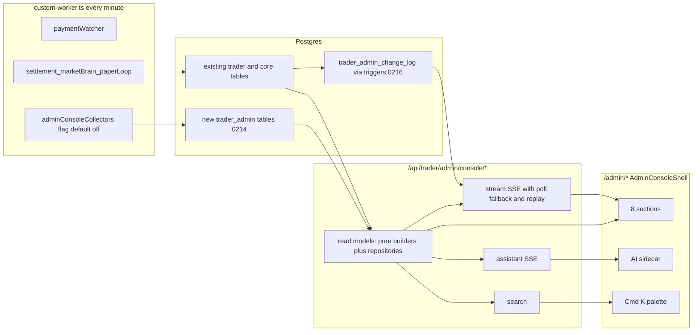

# DEE-1050 — AI-TRADER Admin Console v2

## Acceptance

First PR acceptance is section 9.1 below. AC-14, AC-29, and AC-32 are partial. AC-16 stays open. Full v2 readiness is F1a, F1b, F2, F3a, F3b, F4, F5, F6 plus Human ratification of DEE-1059 and DEE-1060. Human merge. Not a bounded autonomous merge.

Children: C1 DEE-1051, C2 DEE-1052, C3 DEE-1053, C4 DEE-1054, C5 DEE-1055, C6 DEE-1056, C7 DEE-1058, C8 DEE-1057.

## Progress

A box is checked only when that slice is on `dee-1050-admin-console-v2` and its unit test passed. `includedIssues.status` stays `in-progress` until the package meets section 9.1. The assistant persistence test and the billing idempotency test have been run on local Postgres. The rest of the Postgres integration suite and the browser slice have not been run. The invoice export query itself has not been run on Postgres.

On 2026-09-23 the pinned `integration` job in `.github/workflows/postgres-integration.yml` was restored byte-for-byte. The admin console change-log command runs in a new `admin-console-postgres` job so the account-observation checksum contract stays intact. That job still needs GitHub Postgres. Billing idempotency skips there because `verifyHtrPostgresConnectionIdentity` only accepts the local validate stack. `pnpm lint` (0 errors), `pnpm exec tsc --noEmit`, and `pnpm build` passed on `86fbe1e3`. Slice-gate and admin Postgres e2e were not attempted.

The first `admin-console-postgres` run rejected the stream fixture: historical rows were `execution_mode = live` with only `historical_run_id` set, which violates `trader_orders_historical_lineage_complete`. Those rows are now `mock` with both `historical_run_id` and `historical_account_key`. Order, fill, and position filters compare the mode sentinel as text, so `all` is not bound as `order_execution_mode`.

Unit shard 2/2 on `26efc88b` failed `trader-reality-v2-consumer-graph`: connector edits changed the source content digest, and three public admin reads (`fetch-news`, `run-due`, `htx-public-tickers`) are new consumers. They are pinned as `EXCLUDED_PUBLIC_MARKET_READ_NO_CANONICAL_AUTHORITY`. They do not admit Reality or place orders. The pinned postgres `integration` job was not edited. On `8b97496d` both unit shards and the postgres migrate guard passed. The sqlite e2e then failed because `/admin/runtime-authority` now sits in the console shell, which adds three buttons beside Sign out. The HALT region still has no buttons. The spec pins those four buttons and no others.

- [x] C1 code: contracts, migrations 0214–0216, change-log stream, search, release, visit marker, saved views (DEE-1051).
- [ ] C1 Postgres proof: 30s held commit, historical-order skip, anon `42501`, overhead profile 9.3.3.
- [x] C2 reads: valuation, operational PnL, attribution, overview, orders, account list without ciphertext (DEE-1052).
- [x] C2 fills and closed trades: one row per fill, amounts stay text, and closed trades are `CLOSED` or `FORCED_FLAT` inside a half-open `closed_at` period. Both routes return POSTGRES_REQUIRED on sqlite.
- [x] C2 rest: open lots carry the latest Guardian assessment (`DISTINCT ON (lot_id)`), a missing or >15 minute assessment is `stale`, and Guardian recommendation, Risk posture, and executed reduction stay separate. Valuation of a real account includes attributed live lots. The orders page cursor is applied in SQL. `GET /console/attention` builds the queue from stored rows. These SQL reads, and the fills and closed-trade queries, were not executed on Postgres.
- [x] C3 display: invoice status, fee preview, fee chain, six unchecked attestations (DEE-1053).
- [x] C3 routes: clients, invoices, invoice detail, reporting periods.
- [x] C3 payments and disputes: trader payment events and invoice disputes. Amounts stay text. Other products are excluded.
- [x] C3 export and billing retry: the invoice CSV route returns POSTGRES_REQUIRED on sqlite, and formula cells stay prefixed. On local Postgres a repeated approve, issue, and close leave one invoice, one HWM row for that invoice, one period, and one issued audit. Closing an already closed period throws.
- [x] C3 billing redirect: `/admin/billing` now redirects to `/admin/clients?tab=invoices` and no longer submits attestations as already true.
- [x] C3 rest: closed reporting periods are listed by `GET /api/trader/admin/reporting-periods`, and an already-fetched audit page can be filtered by actor, action, and entity. `dee-1046-admin-governance-surfaces` is not on origin, so the files were written from the DEE-1046 contract. A retry after a failed billing transaction was not run, and the export query was not executed on Postgres.
- [x] C4 catalog and stats: registry ∪ trades, no percent return, research run progress (DEE-1054).
- [x] C4 maps: no-trade categories keep a justified refusal out of the incident queue, research compare separates conditions from profit, 23 stages stay unavailable until a record exists, console sources do not name a holdout payload.
- [x] C4 proposals: the proposals route returns POSTGRES_REQUIRED on sqlite. A proposal summary keeps decision fields and drops evidence arrays.
- [x] C4 cycle trace: stored hypothesis, forecast, decision, risk verdict, execution plan, and order ids mark stages 10–16 completed. Stages without that link, including sufficiency and Guardian, stay `NOT_PERSISTED_FOR_CYCLE`. The route returns POSTGRES_REQUIRED on sqlite and does not select cycle payloads.
- [x] C4 rest: a promotion request includes research evidence and rejects an empty or invalid document before POST. Closed-trade PnL for the current and previous UTC months ignores open trades and other strategies. `dee-1044-promotion-research-evidence` is not on origin. The proposals query and the cycle trace query were not executed on Postgres.
- [x] C5 core: redaction, fingerprint, incident transitions, news normalize, collector flag, job catalog, CI path (DEE-1055).
- [x] C5 reads: incident list and system release, job catalog, missed minute jobs. Research reasoning stays unavailable.
- [x] C5 rest: quote, news, and fear-and-greed rows are built from fetched values and written by the Postgres collector store. A zero fear-and-greed point stays zero. A missing price is skipped. Host entrypoints record a diagnostic and still exit on their own error when that write fails. The local seed refuses any host other than loopback and writes no balances or index values. These writes were not executed on Postgres. Account valuation is not collected. The existing worker chains are not wrapped. The Postgres browser job waits until C8 adds `playwright.admin-pg.config.ts`.
- [x] C6 guards: tool cap, holdout refusal, aggregate whitelist, fact check, cache key, injection clip (DEE-1056).
- [x] C6 routes started: help lists only wired reads, quick answers run without a model, budget math refuses an exhausted or fake path, the model route returns ASSISTANT_DISABLED when the flag is off. Conversations and trace stay POSTGRES_REQUIRED on sqlite.
- [x] C6 persisted turn: on local Postgres a fake-provider question and unavailable answer are stored, and the reply is an SSE `error` event. Stage labels are encoded before `tool_result_ready`.
- [x] C6 live answer: a stubbed completion reads the wired tools, streams `stage`, then `tool_result_ready`, then `answer`, and the trace stores those tool rows. A failed read is stored as `failed`.
- [x] C6 questions: nine section questions route to read tools and carry scope, period, currency, coverage, and citations.
- [ ] C6 routes rest: the brief file is not in the repo, so these nine are the section questions rather than a verbatim §13.3 list.
- [x] C7 shell: Russian nav, stream session, scope key, emergency trip body, query/table/chart/palette dependencies (DEE-1058).
- [x] C7 chrome started: market strip does not call USDT BTC/USD, status bar has no fake p95, assistant panel sits in the shell.
- [x] C7 rest: the emergency dialog walks scope, effect, and confirmation, and it does not send a trip when the kill-switch version was not read. An order row with a stored version records one render acknowledgement.
- [x] C8 pages started: overview, accounts, orders, clients, strategies, research runs, errors, system (DEE-1057).
- [x] C8 assistant panel: the shell shows the disabled-assistant banner and quick-answer titles.
- [ ] C8 rest: legacy redirects, e2e, a11y. The system, strategy, and research sections now link to the existing operator pages. Audit, runtime authority, and score diagnostic stay on their current routes because a redirect would drop those tools and the runtime-authority browser spec.
- [ ] Slice gate `admin-console-pg-slice.spec.ts`.
- [x] GitHub on `34bcb39c`: `pnpm lint`, typecheck, both unit shards, build, sqlite e2e, pr-governance, postgres migrate, and admin-console Postgres. PR #639 is open. Human merge only.
- [x] GitHub on `0af6dfc3`: 27/27, including Cloudflare OpenNext after self-hosting Cormorant Garamond. The OpenNext failure was Google's `/l/font?kit=&skey=&v=` CSS, which Turbopack split into more than one font query.
- [ ] Slice gate and admin Postgres browser e2e.

## WP-C1

Contracts, migrations 0214-0216, change-log stream, search, release, visit marker, saved views. Issue DEE-1051.


# AI-TRADER Admin Console v2 — план для исполнителя (Grok 4.7)

## 0. Протокол работы для Grok 4.7 (прочитать первым)

Протокол одинаков для любого исполнителя. Характеристики модели — не гарантия результата; гарантией служат проверки ниже и вывод команд.

1. **Уровень усилия:** `high` или `xhigh` (рекомендуется `xhigh` для C1, C2, C3, C6).
2. **Цикл на каждую дочернюю задачу Cn:**
   1. перечитать раздел 1 (запреты), раздел 3 (контракты) и свой раздел Cn;
   2. открыть и прочитать **все** файлы, перечисленные в Cn как существующая основа, прежде чем писать код;
   3. письменно (в рабочих заметках) перечислить граничные случаи для каждой модели чтения;
   4. написать тесты и код;
   5. прогнать валидацию Cn (раздел 10);
   6. закоммитить `DEE-<Cn> type(scope): subject`. Перед `git add` проверить `git status`: неотслеживаемые `.playwright-mcp/` (снимки браузера, не в `.gitignore`), `test-results/`, `playwright-report/`, `.env*` не коммитить — добавлять файлы явными путями;
   7. обновить `state.currentWorkPackage` в `docs/plans/dee-<P>-admin-console-v2.md`.
3. **Сначала прочитать, потом писать.** Имена функций и таблиц в плане проверены по коду на `7380782a`. Если имя в плане расходится с фактическим кодом, верен код: использовать фактическое имя и отметить расхождение в описании PR.
4. **Никаких заглушек и mock-данных** в продакшен-коде: нет `TODO`, нет «временно захардкожено», нет выдуманных чисел. Если источника нет — явное состояние `unavailable` с машинной причиной (раздел 3).
5. **Успех объявлять только по выводу инструментов** (тесты, typecheck, build). Не писать «готово», если команда не запускалась или упала.
6. **Не спрашивать владельца о согласованном.** Восемь разделов, состав вкладок и финансовая семантика зафиксированы брифом. Решения по открытым вопросам уже приняты в разделе 12.
7. **Останавливаться и спрашивать Human только если:**
   - нужны секреты или доступ к продакшену;
   - требуется изменить финансовую политику, торговые полномочия или правила ADR (это не дефект, а изменение политики);
   - миграция конфликтует с уже применённой на main;
   - нужна деструктивная git-операция.
8. Язык интерфейса — русский. Идентификаторы, пути, SQL и коды причин — английские.

## 0.1 Политика найденных дефектов (требование владельца)

Если при выполнении плана обнаружен ранее неизвестный дефект — в создаваемом коде или в смежном коде алгоритма AI-TRADER, который консоль читает или вызывает (execution, reality, risk, Guardian, billing, settlement, market data, intelligence, research, auth, observability), — **исправить сразу в этом же PR** по правилам:

1. **Доказательство.** Сначала тест, воспроизводящий дефект (красный), затем исправление (зелёный). Без теста исправление не принимается.
2. **Учёт в Linear.** Для каждого дефекта создать дочернюю задачу родителя `DEE-P`:
   - заголовок: `Fix: <кратко>`;
   - метки: `program:ai-trader` + одна метка исполнения по области + `Bug`;
   - поля: Context (как найден), Goal, Scope, Do NOT, AC (тест), Files, Validation.
3. **Коммит.** Отдельный коммит `DEE-<id дефекта> fix(scope): subject`. Задачу добавить в `includedIssues` плана и в `**Includes:**` PR.
4. **Не дефект, а политика.** Изменения финансовых правил (ставка, HWM, порог, округление, grace, выпуск счетов), торговых полномочий, лимитов риска, условий live, доступа к holdout — это не дефекты. Их не менять; оформить отдельную Backlog-задачу Human и указать в PR.
5. **Опасные зоны.** Если исправление затрагивает исполнение ордеров, Risk, Guardian, начисление комиссии, HWM, settlement или авторизацию:
   - изменение минимальное, только устраняющее доказанную ошибку;
   - в PR отдельный пункт «Human gate: исправление в критическом пути» с описанием до/после и ссылкой на тест;
   - прогнать все существующие тесты этой области (`rg -l` по имени модуля в `tests/`).
6. **Реестр в PR.** В описании PR — раздел «Обнаруженные и исправленные дефекты»: id задачи, файл, симптом, причина, тест.
7. **Если исправление требует миграции существующих данных** или изменения чужой таблицы — не делать. Остановиться, создать задачу и сообщить Human.

## 0.2 Исходное состояние (проверено по коду)

- Бриф основан на `origin/main` `7380782a` (DEE-1048). Локальный `main` отстаёт: перед началом выполнить `git fetch origin` и ветвиться от свежего `origin/main`.
- Уже слито в main и **переиспользуется**:
  - `lib/trader/admin/cockpit-read.ts` (факты cockpit, DEE-1047);
  - `lib/trader/admin/cockpit-stream.ts` (`createAdminCockpitPollingStream`, SSE 30 с);
  - `lib/trader/admin/cockpit-client.ts`, `components/trader/admin/use-admin-cockpit-stream.ts`, `components/trader/admin/admin-cockpit-facts.tsx` (DEE-1048);
  - `lib/trader/admin/fleet-portfolio.ts` (DEE-1039);
  - фильтр организаций с entitlement trader (DEE-1045, коммит `07915190`);
  - таблицы `trader_human_promotion_proposal_v2` / `trader_human_research_assignment_v2` (миграции 0212/0213, DEE-1049);
  - shadow-циклы пишутся в **файловый** журнал (`lib/trader/runtime-v2/shadow-cycle-file-journal-v2.ts`, DEE-1041) и из Worker недоступны.
- Факты кода, на которые опирается план (проверены на `7380782a`):
  - `transitionOrderPostgres` (`lib/trader/execution/repository-postgres.ts`) увеличивает `trader_orders.state_version` и пишет `trader_order_events` с `seq`, нумерованным **внутри ордера** (не глобально);
  - `lib/trader/lifecycle/lifecycle-recorder.ts`: покупка создаёт лот с `avg_cost = fill.price` и leg `OPEN_FILL` с `fee` и `leg_pnl = 0`; продажа создаёт legs `CLOSE_FILL` с `leg_pnl = выручка − себестоимость − доля комиссии продажи` и увеличивает `trader_trades.realized_pnl` **и при частичном закрытии** (сделка остаётся OPEN). Комиссия покупки в `avg_cost` и `realized_pnl` не входит;
  - `trader_trade_legs` (`executed_at`, `leg_pnl`, `fee`, `order_id`, `fill_id`, `trade_id`, `position_lot_id`) связаны с ордерами и fills составными FK по организации;
  - ключ спаривания лотов — `(organization, symbol, strategy_signal_id, accountKey)` (`lib/trader/lifecycle/pairing-scope.ts`); один signal не доказывает один счёт;
  - `trader_fills.fee_asset` хранит валюту комиссии; lifecycle-writer делит `fee` на количество как комиссию в валюте котировки;
  - канонический движок учёта `lib/trader/accounting/canonical-cross-backend-accounting-engine.ts` (`applyAccountingFill`, gross/net realized, net basis) используется для исторических прогонов (`run_id`); применимость к live не предполагается автоматически (бриф §23);
  - счёт на оплату хранит всю цепочку расчёта отдельными полями: `period_realized_strategy_profit`, `cumulative_realized_strategy_profit`, `previous_high_water_mark`, `new_profit_above_hwm`, `fee_rate`, `performance_fee`, `proposed_new_high_water_mark`, `billable`; канонический period close строит период из `RealizedStrategyProfitReceiptV2` (`lib/trader/billing/v2/realized-strategy-profit-receipt-v2.ts`);
  - paper loop — отдельный **виртуальный** портфель: `PAPER_LOOP_ENABLED`, `PAPER_LOOP_ORGANIZATION_ID`, `PAPER_LOOP_ACCOUNT_KEY`, `PAPER_LOOP_STARTING_BALANCE_USDT`, префикс циклов `PAPER_LOOP_CYCLE_ID_PREFIX` (по умолчанию `paper-loop-worker`) в `lib/trader/paper/build-worker-deps.ts`; это не режим реального биржевого счёта;
  - текущий клиентский hook cockpit создаёт **новый** `EventSource` каждые 25 с (`components/trader/admin/use-admin-cockpit-stream.ts`); новый экземпляр не наследует `Last-Event-ID`;
  - серверный поток cockpit опрашивает раз в 1000 мс после завершения предыдущего чтения (`lib/trader/admin/cockpit-stream.ts`);
  - роль платформенного `admin` получает и `admin.audit.read`, и `admin.trader.operations.mutate` (`lib/waia-core/permissions/resolve.ts`);
  - Postgres в CI — 16/17, поэтому доступны `pg_current_xact_id()` и `pg_snapshot_xmin(pg_current_snapshot())`; триггеры и `txid_current()` в миграциях уже применяются (например, `0160_trader_reality_v2.sql`).
- **Не слито** (поглощается, раздел 7): ветки `dee-1017-admin-fleet-cockpit` (`admin-fleet-cockpit.tsx`), `dee-1044-promotion-research-evidence` (`promotion-request-body.ts`), `dee-1046-admin-governance-surfaces` (15 файлов). Брать файлы через `git show <branch>:<path>` и адаптировать; ветки не мержить.
- Последняя миграция Postgres в main — `0213`; новые — `0214`, `0215`, `0216`. Если к моменту PR на main появилась `0214`, перенумеровать свои и повторить правки из раздела 5.3.

## 1. Жёсткие запреты (для всех задач)

1. Никаких новых путей размещения, отмены или изменения ордеров, переводов и вывода средств. Изменяющие действия консоли — только существующие управляемые команды (kill switch, live enable, продвижение стратегии, команды биллинга, команды FHV) через их текущие API, плюс новые команды самой консоли (статус инцидента, сохранённые виды, отметка визита).
2. Никогда не выбирать `exchange_credentials.encrypted_payload`, `payload_key_version`, `wrapped_dek_key`, `wrapped_dek_key_version`; не расшифровывать ключи. Не читать данные и ключи AI-TWIN, хэши паролей, секреты.
3. Не читать полезную нагрузку слепого holdout. Показывать только факт и статус запечатывания — ни в UI, ни в экспорте, ни в инструментах ИИ (AC-25).
4. Не выдумывать PnL, здоровье, проценты, нули и «97%». Ноль — только подтверждённое значение (AC-03). `0` F&G ≠ «недоступно» (AC-21). Отсутствие F&G не заменять на 50.
5. Не называть BTC/USDT «BTC/USD» (AC-20). Каждая сумма несёт валюту и метод оценки. `stablecoin_par:1:1` применяется **только** к расчёту платежей settlement, никогда к рыночной оценке.
6. **Не смешивать live, paper и историю.** В `trader_orders` есть исторические ордера (`historical_run_id IS NOT NULL`); они принадлежат режиму «История» и исключаются из live и paper во всех моделях чтения. Суммы разных режимов никогда не складываются.
7. Не пересчитывать выпущенный счёт на лету: карточка показывает сохранённый расчёт из строки счёта и связанных записей (brief §10.6, инвариант 7).
8. Не удалять `message`/`stack` из denylist `lib/observability/waia-trader-telemetry.ts`: диагностика пишется в отдельное хранилище с очисткой секретов.
9. ADR-0017: новые модули и репозитории — только Postgres. На SQLite — честный ответ `unavailable` с причиной `POSTGRES_REQUIRED` (HTTP 200 с конвертом); адаптеров для SQLite не писать.
10. Не вводить автоматический выпуск счетов (ADR-0008) и не менять привязку платежей (частичные, переплата, неоднозначные) — это задача Human `DEE-ADR-A` и пакеты F1a/F1b (разделы 9.2, 9.3.1, 13). Не ставить attestations в `true` программно.
11. Не выводить торговые разрешения из legacy `StrategySignal`/CDE label, числа сигналов, heartbeat или факта деплоя (brief §7).
12. ИИ не входит в критический путь денег и UI. Ошибка провайдера не ломает ни один экран.
13. Не коммитить `.env*`, `*.key`, `*.pem`. Новые переменные — только в `.env.example` с пустыми значениями.
14. `wrangler.jsonc` не менять.
15. Путь чтения (GET-маршруты, поток, инструменты ИИ) **не обращается к внешним API**. Внешние запросы делают только сборщики за флагом `WAIA_ADMIN_CONSOLE_COLLECTORS_ENABLED`. Устаревшие котировки показываются с возрастом, а не подменяются запросом из обработчика (бриф §18.1: открытие кабинета не запускает опрос бирж).
16. Операционная аналитика (PnL обзора, стратегий, счетов) не является базой комиссии: billing-значения берутся только из сохранённых счетов и периодов, операционный расчёт не меняет billing doctrine.
17. Каждый новый файл `lib/**`, который читает БД или секреты, начинается с защиты:

```ts
import { createRequire } from "node:module";
const require = createRequire(import.meta.url);
if (process.env.VITEST !== "true") require("server-only");
```

## 2. Архитектура



Ключевой принцип: **одна функция модели чтения на сущность**. Её используют HTTP-маршрут, поток данных, CSV-экспорт и инструмент ИИ; иначе чат и экран дадут разные суммы (brief §19, AC-26). Модель чтения = чистая функция-сборщик (юнит-тесты на фикстурах) + порт репозитория (SQL только в `repositories/*.postgres.ts`).

Одна функция сама по себе не даёт одинакового снимка между запросами. Согласованность финансовых данных обеспечивает раздел 3.1.

### 2.1 Раскладка файлов

- `lib/trader/admin-console/`
  - `contracts.ts`, `data-state.ts`, `auth.ts`, `scope.ts`, `revision.ts`, `cursor.ts`, `postgres-guard.ts`, `schema-probe.ts`, `release.ts`, `reason-codes.ts`
  - `money/`: `quotes.ts`, `valuation.ts`, `operational-pnl.ts`, `htx-public-tickers.ts` и `usd-quotes.ts` (только для сборщиков)
  - `modes/`: `order-mode.ts`, `cycle-mode.ts`
  - `attribution/trade-attribution.ts`
  - `billing/`: `invoice-display-status.ts`, `fee-preview.ts`, `fee-chain-check.ts`, `billing-automation.ts`
  - `stages/`: `cycle-stage-catalog.ts`, `no-trade-reason-map.ts`
  - `read-models/*.ts` — по одному файлу на сущность (перечислены в C2–C5)
  - `repositories/*.postgres.ts` (включая `snapshot.postgres.ts` — `withAdminReadSnapshot`)
  - `handlers/*.ts` — возвращают `AdminRouteHandlerResult`
  - `collectors/*.ts`, `diagnostics/*.ts`, `jobs/*.ts`, `stream/*.ts`, `assistant/*.ts`
- `app/api/trader/admin/console/**/route.ts`
- `components/trader/admin-console/`: `shell/`, `data/`, `primitives/`, `sections/<section>/`, `assistant/`, `i18n/ru.ts`
- `scripts/trader/admin-console-seed-local.ts` — только для локальной проверки (C5)

### 2.2 Шаблон маршрута

```ts
import { createProductionAdminRouteDeps } from "@/lib/trader/admin-route-deps";
import { runAdminRoute } from "@/lib/trader/admin-route-http";
import { handleAdminConsoleOverviewGet } from "@/lib/trader/admin-console/handlers/overview";
export const dynamic = "force-dynamic";
export async function GET(request: Request) {
  return runAdminRoute("trader_admin_console_overview", () =>
    handleAdminConsoleOverviewGet(request, createProductionAdminRouteDeps()));
}
```

Каждый новый ключ маршрута добавляется в `WaiaRuntimeRouteKey` в `lib/observability/waia-runtime-route-telemetry.ts` (образец: DEE-1047 добавил ключ cockpit). Без этого typecheck упадёт.

### 2.3 Авторизация

`lib/trader/admin-console/auth.ts`:

```ts
export async function authorizeFleetAdmin(deps: AdminRouteHandlerDeps):
  Promise<{ ok: true; userId: string; contextOrgId: string; runtime: WaiaRuntimeDb } | { ok: false; result: AdminRouteHandlerResult }>
```

- Паттерн как в `lib/trader/credentials/admin-connected-accounts-handler.ts`: `getUserId` → `personalOrganizationIdFromUserId(userId)` → `assertAdminPermission(runtime, userId, contextOrgId, "admin.audit.read")`.
- Изменяющие POST дополнительно требуют `admin.trader.operations.mutate` и `assertAdminConsoleSameOrigin(request)`: `content-type: application/json` обязателен; `new URL(Origin).origin` (схема + хост + порт) должен совпадать с `new URL(request.url).origin`; отсутствующий `Origin` отклоняется. Иначе 403 `ADMIN_CONSOLE_ORIGIN_REJECTED`.
- Каждая новая команда принимает `expectedRevision`. При несовпадении — 409 `STALE_REVISION` с текущим состоянием; UI показывает обновлённые данные и требует повторного действия (brief §15.5).
- Владение: беседы ИИ, сохранённые виды и visit-marker читаются и меняются только по `admin_user_id = текущий пользователь`. Чужой id → 404 (не 403, чтобы не раскрывать существование).
- Маршруты, инструменты ИИ и экспорт используют один zod-разбор scope (`scope.ts`). Тест проверяет, что для одного набора параметров все три пути возвращают один scope.
- `waia_admin_module_grants` права администратора AI-TRADER **не дают**.

## 3. Общие контракты (`contracts.ts`)

```ts
export type AdminDataState = "ok" | "empty" | "partial" | "stale" | "unavailable" | "forbidden" | "not_applicable";
export type AdminTimes = { sourceAt: string | null; observedAt: string | null; effectiveAt: string | null };
export type AdminFact<T> = {
  state: AdminDataState; value: T | null; times: AdminTimes; source: string | null;
  reasons: string[]; breakdownRef?: string;
};
export type AdminMoney = { amount: string; currency: string; method: string };
export type AdminMode = "live" | "paper" | "history" | "observation" | "undetermined";
export type AdminCoverage = { included: number; total: number; excluded: { id: string; reason: string }[] };
export type AdminAction = { action: string; enabled: boolean; reason: string | null; href?: string };
export type AdminReadEnvelope<T> = {
  schemaVersion: "admin-console/v1"; generatedAt: string; revision: string;
  scope: { kind: "fleet" | "organization" | "account"; organizationId?: string; exchangeAccountId?: string };
  mode: AdminMode | "all"; coverage: AdminCoverage | null; missingSources: string[]; data: T;
};
export type AdminPage<T> = { items: T[]; total: number | null; nextCursor: string | null; truncated: boolean };
```

- DTO называются как в брифе §19: `AdminOverviewSnapshot`, `AdminAccountView`, `AdminClientView`, `AdminOrderTrace`, `AdminStrategyPerformance`, `AdminResearchRunView`, `AdminBillingView`, `AdminMarketFeed`, `AdminCycleTrace`, `AdminIncidentView`, `AdminSystemView`, `AdminAssistantAnswer`. Вспомогательные: `AdminAccountRow`, `AdminInvoiceRow`, `AdminPaymentRow` и т.д.
- **Фасеты состояния счёта** (brief §4.4, §8.1) — пять отдельных полей, никогда не сводятся в один зелёный статус: `connection` (ключ активен/отозван), `freshness` (возраст наблюдения), `completeness` (полнота компонентов наблюдения), `reconciliation` (из `trader_risk_account_state_v2.reconciliation_status` и ордеров `RECONCILIATION_REQUIRED`), `tradePermission` (из org live enable + runtime authority + posture + kill switches + статус счёта за оплату). Каждое поле — `AdminFact`.
- **Идентичность и режим счёта** — четыре независимых поля (brief §8, AC-08):
  - `portfolio` — реальный биржевой счёт (баланс из наблюдения); это всегда реальные деньги, независимо от разрешений;
  - `activity` — наблюдаемая активность Трейдера за период: `live` (ордера `execution_mode = live` без `historical_run_id`), `none`; это факт, не режим;
  - `deployment` — настроенное исполнение: `live` при org live enable ENABLED (независимо от posture), иначе `not_deployed`, при отсутствии данных — `undetermined`;
  - `tradePermission` — что разрешено сейчас (новые входы / только закрытие / остановлено) с причиной.

  Реальная открытая позиция при `CLOSE_ONLY`/`HALT` остаётся live-портфелем с `tradePermission = только закрытие/остановлено`; режим не переключается на paper или observation.
- **Paper** — отдельный виртуальный портфель paper loop (раздел 0.2): строка «Paper-портфель <accountKey>» в режиме Paper со своим стартовым балансом. Paper-ордера никогда не приписываются реальному биржевому счёту.
- `revision` = sha256 от канонического JSON `data` (`canonicalizeSemanticJsonString` из `lib/trader/intelligence/htr-semantic-canonical-json.ts`). Это проверка **равенства** содержимого, а не порядка: хронологию определяет `entityVersion` из раздела 6.
- Деньги — только десятичные строки; арифметика только через `lib/trader/risk/numeric.ts` (`addDecimal`, `subtractDecimal`, `multiplyDecimal`, `divideDecimal`, `compareDecimal`, `formatDecimal`, `minDecimal`, `absDecimal`). `Number()` для денег запрещён и на сервере, и во фронтенде (инвариант 9).
- Курсор **страниц таблиц** (не потока): base64url JSON `{ t: ISO, id: string }`, сортировка `(t DESC, id DESC)`. Страница по умолчанию 50, максимум 200. Курсор потока — отдельный (раздел 6).
- `postgres-guard.ts`: `requirePostgres(runtime)` для `kind === "sqlite"` возвращает конверт `unavailable` + `POSTGRES_REQUIRED`.
- Параметры запросов — zod (`scope.ts`): `period=today|7d|30d|90d|custom`, `from`/`to` ISO, `tz` (IANA, по умолчанию `UTC`), `mode=live|paper|history|all`, `currency=USDT|USD`, `organization_id` (uuid), `exchange_account_id`, `q`, `cursor`, `limit`, `sort`. Неверный ввод — 400 через `adminClientError`.
- Периоды — полуоткрытые `[start, end)`. В ответах — ISO UTC; UI показывает локальное время оператора и часовой пояс периода.
- `reason-codes.ts` — единый список машинных причин (`POSTGRES_REQUIRED`, `ADMIN_CONSOLE_SCHEMA_NOT_APPLIED`, `NO_QUOTE:<ASSET>`, `QUOTE_STALE`, `VALUATION_SKEW`, `ACCOUNT_CAP`, `OWNERSHIP_CONFLICT`, `ATTRIBUTION_AMBIGUOUS`, `EXTERNAL_FLOWS_NOT_OBSERVED`, `COST_BASIS_UNKNOWN`, `FEE_ASSET_UNCONVERTIBLE`, `NOT_PERSISTED_FOR_CYCLE`, `WAIA_RELEASE_SHA_NOT_SET`, `RELEASE_SHA_UNVERIFIED`, `COLLECTORS_DISABLED`, `ASSISTANT_DISABLED`, `PROVIDER_UNAVAILABLE`, `RETURN_METHOD_NOT_RATIFIED` и т.д.). Русские тексты — только в `components/trader/admin-console/i18n/ru.ts`.
- `schema-probe.ts`: при первом обращении в изоляте проверяет `to_regclass('public.trader_admin_change_log')` и кэширует результат на 60 с. Нет таблиц → конверт `unavailable` + `ADMIN_CONSOLE_SCHEMA_NOT_APPLIED` вместо 500. Так сборка безопасна при развёртывании до применения миграций (раздел 15).

### 3.1 Согласованная финансовая точка

- **Внутри одного ответа:** все финансовые чтения одного обработчика (обзор с раскрытиями, список счетов с итоговой строкой, карточка, инструмент ИИ, экспорт) выполняются в одной транзакции `REPEATABLE READ READ ONLY`. Реализация — локальный помощник `withAdminReadSnapshot(db, fn)` в `lib/trader/admin-console/repositories/snapshot.postgres.ts`, вызывающий drizzle `db.transaction(fn, { isolationLevel: "repeatable read", accessMode: "read only" })`. Общую абстракцию `runWaiaPostgresTransaction` не менять (MIGRATION-GOVERNANCE: изменение транзакционной абстракции требует Architect). Итоговая строка списка считается в той же транзакции, поэтому «сумма строк = сводка» (инвариант 2) выполняется по построению; тест это проверяет.
- **Ключ зависимостей оценки счёта** `valuationKey` = sha256 от `observation_id` + `lotsRevision` (максимальный `trader_trade_legs.created_at` и число legs счёта, либо `seq` журнала изменений для лотов счёта) + `quoteSetDigest` (карта актив → `{ source, price, source_ts }` использованных котировок) + `VALUATION_METHOD_VERSION`. Одинаковые зависимости дают одинаковые значения; оценка не пересчитывается произвольно.
- **Финансовая ревизия** `financeRevision` = sha256 отсортированных пар `(accountId, valuationKey)` охвата + `periodBounds` + `currency` + `mode`. Её возвращают обзор, список и карточки счетов, инструменты ИИ и экспорт.
  - UI сравнивает `valuationKey` строки обзора с карточкой. При расхождении показывает «Данные счёта обновились после сводки» с кнопкой обновления; суммы разных ревизий не смешиваются.
  - Ответ ИИ хранит `financeRevision` использованных данных в `data_revisions_json`.
- **Временная политика оценки** (инвариант 10):
  - текущая оценка = последнее наблюдение × последняя сохранённая котировка; оба времени показываются;
  - `|quote.source_ts − observation.recorded_at| > 5 мин` → `partial` + `VALUATION_SKEW`;
  - котировка старше 3 мин → `stale` + `QUOTE_STALE`.
- **История не пересчитывается:** точки капитала и сохранённые оценки неизменяемы и несут `valuationKey`, метод, режим и охват. Справочная цена в шапке не переписывает прошлые точки и расчёт счетов на оплату.
- **Экспорт** выполняется в одной транзакции `REPEATABLE READ READ ONLY` с потоковой выдачей строк. Первая строка-комментарий содержит `financeRevision` / время снимка. Длительность ≤ 60 с, ≤ 50 000 строк; при превышении — явная ошибка без усечённого файла. Отмена запроса прерывает транзакцию.

## 4. Режимы данных (`modes/`)

- `order-mode.ts`: `historical_run_id IS NOT NULL` → `history`; иначе `execution_mode` (`live`/`paper`); `mock` → `undetermined`, в суммы не входит.
- `cycle-mode.ts`: режим цикла по `run_id` конверта. Перед реализацией **прочитать writers**: paper loop (`lib/trader/paper/*`, префикс `PAPER_LOOP_CYCLE_ID_PREFIX`), canonical recurring cycle (live-equivalent, DEE-1026), historical runner (`lib/trader/historical-simulation-v2/*`), market brain. Записать фактическое правило соответствия `run_id` → режим с тестом на каждый writer. Неизвестный формат → `undetermined` с причиной.
- Трейды, лоты и legs (`trader_trades`, `trader_position_lots`, `trader_trade_legs` не имеют режима) получают режим и счёт через атрибуцию по legs (C2).

## 5. Новые таблицы (C1)

### 5.1 Миграции

- `0214_trader_admin_console_v2.sql` — таблицы и индексы; `0215_trader_admin_console_v2_rls.sql` — RLS; `0216_trader_admin_change_log_triggers.sql` — функция и триггеры журнала изменений (раздел 6.1). Отдельный файл для отдельного Human-ревью: триггеры стоят на таблицах критического пути.
- Формат — как `db/migrations_postgres/0212_*`/`0213_*`: операторы разделяются `--> statement-breakpoint`. Для каждой таблицы: `ENABLE ROW LEVEL SECURITY` и четыре политики `..._deny_authenticated_{select|insert|update|delete}` `TO authenticated, anon` с `USING (false)` / `WITH CHECK (false)`, каждая с предварительным `DROP POLICY IF EXISTS`.
- Журнал `db/migrations_postgres/meta/_journal.json`: `{"idx":214,"version":"7","when":1780000000214,"tag":"0214_trader_admin_console_v2","breakpoints":true}` и такие же записи для 215 и 216.
- Все таблицы также добавить в `db/schema.postgres.ts`.
- Индексы на существующих таблицах, если `EXPLAIN` запросов консоли показывает seq scan по большим таблицам: только `CREATE INDEX IF NOT EXISTS` в 0214, перечислить в PR.

### 5.2 Таблицы

Платформенные таблицы (без данных клиентов) имеют `organization_id uuid NULL` по прецеденту `trader_kill_switches`; это отдельно выносится на проверку схемы Human.

- `trader_admin_market_quote_latest` — PK `(source, symbol)`; `base`, `quote`, `last`, `bid`, `ask`, `open_24h`, `high_24h`, `low_24h`, `volume_24h` (numeric как text), `price_definition` (`last|mid`), `source_ts`, `observed_at`.
- `trader_admin_market_quote_minute` — PK `(source, symbol, minute)`; `close`, `observed_at`. Только для `BTC-USD`, `ETH-USD`, `USDT-USD`, `btcusdt`, `ethusdt`. Хранение 30 дней.
- `trader_admin_fear_greed` — PK `day` (date); `value` int 0..100 (CHECK), `classification`, `source_ts`, `next_update_at` (из `time_until_update` API, может быть NULL), `observed_at`.
- `trader_admin_change_log` — `seq bigserial` PK, `xid xid8 NOT NULL` (`pg_current_xact_id()`), `changed_at timestamptz` (`clock_timestamp()`), `source_table`, `op` (INSERT|UPDATE|DELETE), `entity_id text`, `organization_id uuid NULL`, `entity_version bigint NULL` (из `state_version`, если колонка есть). Только идентификаторы, без данных строк. Индексы `(xid)`, `(changed_at)`. Хранение 7 дней. Без FK.
- `trader_admin_news_item` — `id uuid`, `dedupe_key` unique (см. C5: RSS `guid`, иначе канонический URL без известных tracking-параметров), `cluster_key`, `source`, `url`, `published_at`, `first_observed_at`, `symbols text[]`, `category` (news|announcement|macro|regulation|protocol), `current_version int`. Хранение 90 дней.
- `trader_admin_news_item_version` — PK `(news_item_id, version)`; `title` (≤500), `summary` (≤500, только из RSS description), `content_hash`, `observed_at`. Исправленная публикация добавляет версию и не стирает прежнюю (brief §6.2).
- `trader_admin_account_valuation` — неизменяемые версии: `id uuid`, unique `(organization_id, exchange_account_id, valuation_key)`; `observation_id`, `observation_recorded_at`, `lots_revision`, `quote_set_json`, `quote_set_digest`, `method_version`, `equity`, `free_quote`, `locked_quote`, `holdings_value`, `trader_lots_value`, `trader_cost_basis`, `trader_unrealized`, `currency` ('USDT'), `state`, `reasons jsonb`, `computed_at`. Последняя версия — `DISTINCT ON (organization_id, exchange_account_id) ORDER BY … computed_at DESC`. Хранение 7 дней.
- `trader_admin_equity_point` — PK `(organization_id, exchange_account_id, bucket)` (5-минутный бакет, UTC); `equity`, `trader_unrealized`, `valuation_key`, `method_version`, `state`. Точка только реального биржевого счёта (live-портфель); paper-портфель — отдельной строкой с `exchange_account_id = 'paper:<accountKey>'`. Хранение 400 дней.
- `trader_admin_diagnostic_event` — `id uuid`, `occurred_at`, `received_at`, `service`, `environment`, `release`, `severity` (fatal|error|warning), `error_class`, `message_redacted` (≤2000), `stack_redacted` (≤16000), `fingerprint`, `route`, `organization_id NULL`, `exchange_account_id`, `strategy_id`, `stage`, `cycle_id`, `order_id`, `trace_id`, `context_json` (только ключи из белого списка). Хранение 30 дней.
- `trader_admin_incident` — `id uuid`, `environment`, unique `(environment, service, fingerprint)`, `title`, `severity`, `status` (new|investigating|fix_prepared|deployed_verifying|resolved|regressed), `first_seen_at`, `last_seen_at`, `occurrences`, `affected_accounts`, `first_release`, `last_release`, `resolved_at`, `resolved_release`, `assignee`, `fix_url`, `muted_until`, `note`, `state_version int`.
- `trader_admin_incident_event` — только добавление: `incident_id`, `from_status`, `to_status`, `actor_user_id`, `reason`, `evidence`, `created_at`.
- `trader_admin_job_run` — `id`, `job_key`, `started_at`, `finished_at`, `status` (running|succeeded|failed|skipped), `processed`, `blocked`, `error_class`, `error_message_redacted`, `release`, `details_json`. Хранение 30 дней.
- `trader_admin_assistant_conversation` — `id`, `organization_id` (личная организация администратора), `admin_user_id`, `title`, `created_at`, `updated_at`, `archived_at`.
- `trader_admin_assistant_message` — `id`, `conversation_id`, `role` (user|assistant), `content`, `blocks_json`, `status` (pending|complete|failed|stopped|provider_unavailable), `scope_json`, `attachments_json`, `citations_json`, `data_revisions_json`, `cache_key`, `provider`, `model`, `provider_lifecycle`, `prompt_version`, `tool_policy_version`, `latency_ms`, `usage_json`, `error_code`, `created_at`.
- `trader_admin_assistant_tool_call` — `id`, `message_id`, `tool_name`, `tool_version`, `args_json`, `result_digest`, `result_summary_json` (≤16KB), `status`, `started_at`, `finished_at`, `error_code`.
- `trader_admin_saved_view` — `id`, `organization_id`, `admin_user_id`, `section`, `name`, `state_json` (фильтры, колонки, плотность, сортировка), timestamps.
- `trader_admin_visit_marker` — PK `admin_user_id`; `organization_id`, `last_seen_at`, `previous_seen_at`.

Индексы: `(observed_at DESC)` / `(occurred_at DESC)` / `(first_observed_at DESC)` для журналов; `(status, last_seen_at DESC)` для инцидентов; `(job_key, started_at DESC)` для заданий; `(cluster_key)` для новостей.

### 5.3 Обязательные сопутствующие правки миграций (иначе CI красный)

По образцу DEE-1049 (`d356d397`):

- `lib/trader/observability/fhv-v2-postgres-schema-preflight.ts` — добавить 0214, 0215 и 0216 в `COMPATIBLE_ADDITIVE_MIGRATIONS` с комментарием «DEE-<P> additive admin console tables + deny-by-default RLS + id-only change-log triggers; no required FHV table; not an H2 or post-H2 production operator step».
- `tests/unit/fhv-v2-postgres-schema-preflight.test.ts` — расширить список и название теста («0208-0216»).
- `tests/unit/forecast-v2-applied-migration-identity-v1.test.ts` — добавить три тега (0214–0216).
- Перед коммитом выполнить `rg -l "0213_trader_human_promotion_tables_rls_v2" tests lib scripts` и обновить **каждое** найденное место.

## 6. Поток данных v2 (C1)

`GET /api/trader/admin/console/stream?topics=<список>&scope=...&resume=<cursor>`. Реестр тем: `overview`, `attention`, `accounts`, `orders`, `fills`, `positions`, `billing` (invoices, corrections, disputes, settlement applications, reconciliation cases, periods), `payments`, `clients`, `strategies`, `research_runs`, `market`, `news`, `incidents`, `diagnostics`, `jobs`, `audit`. Неизвестная тема → 400.

Новый модуль `lib/trader/admin-console/stream/console-stream.ts` переиспользует кодирование SSE и заголовки из `lib/trader/admin/cockpit-stream.ts` (жизнь соединения ≤ 30 с, heartbeat 15 с, `transport=poll` для JSON-режима). Механизм «hash снимка раз в секунду» cockpit для консоли **не используется**.

### 6.1 Журнал изменений (источник событий)

- Миграция 0216: функция `trader_admin_record_change()` (plpgsql, `SECURITY DEFINER`, `SET search_path = public, pg_temp`) и триггеры `AFTER INSERT OR UPDATE OR DELETE FOR EACH ROW`.
  - Вставляет в `trader_admin_change_log`: `xid = pg_current_xact_id()`, `changed_at = clock_timestamp()`, `source_table = TG_TABLE_NAME`, `op = TG_OP`, `entity_id`, `organization_id`, `entity_version` (если есть `state_version`). Колонки id передаются аргументами триггера (`TG_ARGV`).
  - Для `exchange_credentials` — отдельная функция, читающая только `id`, `organization_id`, `revoked_at` напрямую, без сериализации всей строки.
  - Данные строк в журнал не пишутся.
- **Таблицы с триггером** (перед миграцией проверить имя, PK и наличие каждой):
  - исполнение: `trader_orders`, `trader_fills`, `trader_trade_legs`, `trader_position_lots`, `trader_trades`;
  - счета и допуски: `trader_account_collection_state`, `exchange_credentials`, `trader_risk_account_state_v2`, `trader_kill_switches`, `trader_org_live_enable`, `trader_account_status`;
  - биллинг: `trader_invoices`, `trader_invoice_corrections`, `trader_invoice_disputes`, `trader_settlement_applications`, `trader_settlement_reconciliation_cases`, `trader_reporting_periods`;
  - стратегии и исследования: `trader_strategy_promotion_records`, `trader_strategy_lifecycle_event`, `trader_human_promotion_proposal_v2`, `trader_historical_simulation_run_lifecycle_event_v2`, `trader_backtest_runs`;
  - консоль: `trader_admin_incident`, `trader_admin_diagnostic_event`, `trader_admin_job_run`.
- На каждой таблице ровно один триггер с именем `trader_admin_change_log_trg` (на него ссылается runbook отката, раздел 15).
- **Только live и paper.** Исторические прогоны пишут в `trader_orders` (`historical_run_id`) и, возможно, в дочерние таблицы. Функция пропускает строку `trader_orders`, если `(CASE WHEN TG_OP = 'DELETE' THEN OLD ELSE NEW END).historical_run_id IS NOT NULL` (в plpgsql — через переменную типа `record`). Для `trader_fills` / `trader_trade_legs` пропускаются строки, чей ордер исторический (поиск по PK `trader_orders`).
  - Для каждой таблицы исполнитель проверяет writers исторических/FHV прогонов.
  - Интеграционный тест: 10 000 исторических ордеров с fills дают 0 строк журнала.
- **Core-таблицы** (`payment_events`, `audit_logs`, `users`, `organization_entitlements`) триггеров не получают (граница WAIA Core) и доставляются по 6.3.
- Хранение журнала 7 дней (задание `admin_retention`, порции по 5000).
- **Human gate:** триггеры добавляют одну вставку на изменение строки в транзакциях исполнения и биллинга. Весь существующий набор `postgres-integration` должен пройти с применённой 0216; PR указывает это отдельным пунктом.

### 6.2 Протокол доставки изменений

- **Курсор потока** — `W` (значение `xid8` в виде строки). Смысл: все транзакции с `xid < W` завершены, и все их видимые изменения уже отправлены.
- **Снимок → дельта.** Каждый снимок, отдаваемый HTTP-маршрутом, читается в `withAdminReadSnapshot` вместе с `pg_snapshot_xmin(pg_current_snapshot())` и возвращает его как `cursor`. Клиент открывает поток с `resume = минимальный cursor загруженных снимков`.
- **Цикл сервера** (каждые 250 мс):
  1. в новой транзакции `REPEATABLE READ READ ONLY` прочитать `W1 = pg_snapshot_xmin(pg_current_snapshot())`;
  2. выбрать `trader_admin_change_log WHERE xid >= W ORDER BY seq LIMIT 500`, страницами до исчерпания, не более 10 страниц за такт;
  3. если строки остались — продолжить на следующем такте без сдвига `W`; если отставание больше 20 000 строк — `resync_required`;
  4. после полного вычитывания установить `W = W1`.
- **Почему без потерь.** Строка становится видимой только после commit своей транзакции, а её `xid` не меньше `xmin` любого снимка, взятого пока транзакция шла. `W` сдвигается только до `W1`, ниже которого все транзакции завершены. Поэтому ещё не видимая строка всегда имеет `xid ≥ W` и будет прочитана позже, **независимо от длительности задержки commit** (временного окна нет).
- **Повторы.** Строки с `xid ≥ W1`, уже видимые, будут прочитаны повторно на следующих тактах.
  - Сервер держит на соединение множество отправленных `seq` для строк с `xid ≥ W` (до 10 000); при сдвиге `W` множество чистится; переполнение → `resync_required`.
  - Клиент дедуплицирует по `eventId`.
  - Длинная пишущая транзакция удерживает `W`; «Система» показывает «удержание горизонта потока: N с».
- **Идентификаторы.**
  - `eventId = "cl:" + seq` — id события.
  - `entityId = "<source_table>:<entity_id>"` — id сущности.
  - `entityVersion = state_version`, если колонка есть, иначе `seq`. Для одной строки `seq` монотонен в порядке commit: следующее UPDATE той же строки ждёт блокировку до commit предыдущего, и `nextval` вызывается уже после неё. Тест проверяет два последовательных изменения одного ордера.
  - Клиент применяет событие, только если `entityVersion` больше известного (AC-30).
- **Проекция.** Событие журнала — сигнал. Сервер пакетно (раз за такт) загружает текущие проекции изменённых сущностей через модели чтения и отправляет `upsert` с `payload` и `projectedAt`.
  - Два изменения одного ордера за такт сворачиваются до последнего состояния с максимальной версией — это допустимо для состояния.
  - Каждый fill, leg, платёжное применение, коррекция и спор — отдельная сущность, поэтому они никогда не сворачиваются и не теряются.
- **Удаления.** `op = DELETE`, отзыв credential или выход сущности из scope → `entity_removed`; клиент удаляет её из кэша.
- **Производные темы** (`overview`, `attention`, `clients`, суммы `accounts`) пересчитываются, когда изменилась любая исходная тема (debounce 250 мс), и дополнительно по времени (6.3).
- **Хранение.** `resume` с `W` ниже минимального `xid` журнала или неразбираемый → `resync_required`: клиент перезагружает снимки и получает новый курсор.
- Resnapshot восстанавливает состояние. Отсутствие потерь событий доказывается протоколом выше и тестами 6.6.

### 6.3 Темы без триггеров и зависимость от времени

Сервер пересчитывает снимок с фиксированным шагом и отправляет его при смене `revision`:

- `market`, `news`, F&G — 5 с. Источники обновляются сборщиками раз в минуту / 10 мин / по расписанию провайдера; это не поток тиков;
- `payments` (Core `payment_events` trader-адресов) — 2 с:
  - окно: последние 24 ч + все нефинальные платежи;
  - сравнение по `(id, status, confirmations)` с картой соединения;
  - каждый платёж доставляется с последним состоянием; промежуточные статусы внутри шага могут свернуться, полная история — в карточке;
- `audit` — 5 с, окно 15 мин по `(created_at, id)`; вкладка «Аудит» всегда догружается страницами, поток здесь только уведомляет;
- состояния, зависящие от времени (устаревание наблюдений, просрочка счёта, пропущенные запуски заданий, возраст котировок), — пересчёт `attention`, `accounts`, `billing`, `jobs` каждые 5 с. Эвристика `max(updated_at) + count` как признак изменения не используется.

### 6.4 Соединение и возобновление

- `EventSource` не позволяет задать заголовок, поэтому клиент передаёт курсор в `resume=` при **каждом** новом `EventSource` (плановая замена ~25 с, ошибка) и в опросе `transport=poll`. Сервер принимает `Last-Event-ID` или `resume`.
- Поле SSE `id:` = курсор после пакета, чтобы работало и встроенное переподключение.
- Права администратора проверяются при открытии и не реже раза в 30 с. При отказе — `access_revoked`, соединение закрывается, клиент очищает кэш React Query и показывает «Нет доступа» (сценарий H).
- Конверт события: `eventId`, `schemaVersion: "admin-stream/v1"`, `topic`, `entityId`, `organizationId|null`, `accountId?`, `entityVersion`, `occurredAt`, `acceptedAt` (`changed_at` журнала), `detectedAt`, `projectedAt`, `sentAt`, `cursor`, `payload`. Типы: `upsert`, `entity_removed`, `snapshot`, `resync_required`, `access_revoked`, `heartbeat`.
- Опрос при недоступности SSE — каждые 2 с. Его реальный интервал и время последнего подтверждённого наблюдения видны в строке состояния; нормальным режимом он не считается.
- **Масштаб:** каждое соединение опрашивает журнал отдельно (4 запроса/с). Рассчитано на ≤ 10 одновременных соединений администраторов (одно на вкладку). Общий fan-out (Durable Object) требует изменения `wrangler.jsonc` и вынесен в F6.

### 6.5 Метрики и цели

- **Точки времени:** `acceptedAt` (запись изменения в транзакции; раньше commit, поэтому измерение консервативно) → `detectedAt` → `projectedAt` → `sentAt` → `receivedAt` → `renderedAt`.
- **Смещение часов:** клиент вызывает `GET /console/time` 5 раз при подключении и раз в 5 мин.
  - `offset = serverTime − (tSend + tRecv) / 2` по замеру с минимальным RTT; погрешность `= RTT_min / 2`.
  - Замеры с погрешностью > 100 мс помечаются «неточно» и исключаются из p95.
- **Подтверждение отрисовки:** компонент, показывающий сущность, вызывает `useRenderAck(topic, entityId, entityVersion)` в `useEffect` после commit. Реестр фиксирует `renderedAt` в следующем `requestAnimationFrame` для первого ack этой версии.
  - Сущности вне экрана (виртуализация) получают ack контейнера с флагом `offscreen` и учитываются отдельно.
- **Цель** (бриф §18.2): p95 `renderedAt − acceptedAt` ≤ 500 мс для активной вкладки при 100 обновлениях/с. Темы: `orders`, `fills`, `positions`, `billing`, `incidents`, а также изменение оценки счёта после нового наблюдения (изменение `trader_account_collection_state` → пересчёт оценки этого счёта в памяти, раздел C2 → события `accounts` и `overview`).
  - Бюджет: обнаружение в среднем 125 мс (такт 250 мс), проекция ≤ 100 мс, доставка и отрисовка ≤ 150 мс.
  - Цель считается выполненной **только** по измерению PG-профиля e2e (раздел 10), не по расчёту.
- Ошибка → экран: p95 ≤ 2 с (`trader_admin_diagnostic_event` имеет триггер).
- **Свежесть источников — отдельные цели:**
  - котировки: сбор раз в 60 с, норма ≤ 90 с, `stale` > 180 с;
  - новости: шаг сбора 10 мин;
  - F&G: расписание провайдера;
  - биржа → сервер для наблюдений счёта: возраст наблюдения, отдельно от первой метрики.
- p50/p95/p99/max и объём выборки: клиентское окно 1000 событий; строка состояния показывает p95, «Система → Сервисы» — все значения.
- Клиент применяет события пакетно раз в кадр (окно ≤ 50 мс); буферы ≤ 500 событий на тему, при переполнении — resync.

### 6.6 Тесты протокола (C1, реальный Postgres)

`tests/integration/admin-console-stream-postgres.test.ts`:

- транзакция A пишет fill и держит commit 30 с, транзакция B пишет и коммитит позже по времени; после commit A её fill доставлен, сдвиг курсора не пропустил его;
- 1001 изменение между двумя тактами — доставлены все, по одному разу;
- одинаковые `changed_at`;
- два последовательных изменения одного ордера — клиентская модель показывает последнее, откат версии отклоняется;
- снимок → поток: изменение между снимком и подключением доставлено;
- замена `EventSource` с `resume` не теряет и не дублирует;
- курсор ниже хранения → `resync_required`;
- DELETE и отзыв credential → `entity_removed`;
- исторические ордера не попадают в журнал;
- просрочка счёта без новой строки попадает в `attention` в течение 5 с;
- переходы платежа DETECTED → CONFIRMED и события счёта на оплату восстанавливаются после переподключения.

## 7. Дочерние задачи

Порядок серий коммитов (вертикальный срез раньше, бриф §22):

1. C1 — фундамент и поток.
2. C2 — деньги и исполнение.
3. C5-ядро — `diagnostics/*`, `trader_admin_job_run`, `recordWorkerJobRun`, сборщики котировок и оценки.
4. C7 — оболочка и примитивы.
5. C8-часть 1 — Обзор, Счета, Ордера и позиции.
6. **Контрольная точка среза:** PG-профиль e2e `admin-console-pg-slice.spec.ts` («счёт → достоверная сумма → новое событие → экран → ошибка в диагностике») + замер 6.5. Если цель не достигнута или сценарий не проходит — исправить архитектуру до продолжения и записать результат в plan state.
7. C3.
8. C4.
9. C5-остальное.
10. C6.
11. C8-часть 2.

Каждая дочерняя задача в Linear содержит поля Context, Goal, Scope, Do NOT (раздел 1 + специфичное), Acceptance Criteria, Files, Dependencies, Validation commands — содержимое берётся из соответствующего раздела ниже.

### C1 — backend: фундамент (метка `backend`)

- **Context:** бриф §4, §18, §19; текущий cockpit (DEE-1047/1048) даёт только факты cockpit без общего контракта.
- **Scope:**
  - разделы 2.3, 3 (включая 3.1 и `schema-probe.ts`), 4 (только `order-mode.ts`), 5, 6; репозитории новых таблиц; `withAdminReadSnapshot`; `GET /console/time`;
  - `release.ts`: читает `WAIA_RELEASE_SHA` (проверка `^[0-9a-f]{40}$`). Результат — `{ sha, source: "WAIA_RELEASE_SHA", verified: false }` с причиной `RELEASE_SHA_UNVERIFIED` и подписью «задан переменной окружения; совпадение с развёрнутой версией не подтверждено». В Cloudflare переменная задаётся вручную и уже бывала устаревшей (`docs/validation/dee-920-astra-audit-2026-09-05.md`). Нет переменной — `unavailable` + `WAIA_RELEASE_SHA_NOT_SET`. Заменить `cockpitReleaseFact()` в `lib/trader/admin/cockpit-read.ts` на этот ридер и обновить `tests/unit/admin-cockpit-read.test.ts`;
  - `GET /console/search?q=` — по email владельца и названию организации, `exchange_account_id`, id счёта на оплату, хэшу транзакции (`payment_events.settlement_tx_hash`), id ордера, `exchange_order_id`, `client_order_id`, id стратегии/версии, id запуска, заголовку и fingerprint инцидента. Минимум 2 символа; группы по 5 результатов `{ kind, id, label, sublabel, href }`. Только навигация (brief §4.3);
  - `GET|POST /console/visit-marker` (сдвиг `previous_seen_at`), `GET|POST|DELETE /console/saved-views` (с `expectedRevision`);
  - `.env.example`: `WAIA_ADMIN_CONSOLE_COLLECTORS_ENABLED=` (`WAIA_RELEASE_SHA` уже используется в репозитории — добавить, только если его нет в `.env.example`). `WAIA_DIAGNOSTICS_ENVIRONMENT=` добавляет C5, `WAIA_ADMIN_ASSISTANT_ENABLED=` и `WAIA_ADMIN_ASSISTANT_DAILY_TOKEN_BUDGET=` — C6 (итоговый список — раздел 15).
- **Do NOT:** не менять существующие маршруты cockpit, кроме ридера релиза; не трогать чужие таблицы.
- **AC:**
  - миграции применяются на чистом Postgres (CI `postgres-integration`);
  - RLS запрещает `anon/authenticated`;
  - на SQLite каждый новый маршрут отдаёт 200 с `POSTGRES_REQUIRED`;
  - не-админ получает 403;
  - `revision` детерминирован;
  - все сценарии 6.6 проходят на реальном Postgres;
  - устаревший или неразбираемый курсор → `resync_required`;
  - `access_revoked` при потере роли;
  - применённая 0216 не ломает существующий набор `postgres-integration`;
  - без миграций маршруты отдают `ADMIN_CONSOLE_SCHEMA_NOT_APPLIED`, а не 500.
- **Files:** `lib/trader/admin-console/{contracts,data-state,auth,scope,revision,cursor,postgres-guard,schema-probe,release,reason-codes}.ts`, `lib/trader/admin-console/modes/order-mode.ts`, `lib/trader/admin-console/stream/*`, `lib/trader/admin-console/repositories/*` (включая `snapshot.postgres.ts`), `db/migrations_postgres/0214_*`, `0215_*`, `0216_*`, `_journal.json`, `db/schema.postgres.ts`, файлы из 5.3, `lib/observability/waia-runtime-route-telemetry.ts`, маршруты `app/api/trader/admin/console/{stream,time,search,visit-marker,saved-views}`.
- **Тесты:**
  - `tests/unit/admin-console-contracts.test.ts`, `admin-console-auth.test.ts` (Origin, ownership, scope), `admin-console-stream.test.ts` (кодирование курсора, дедупликация по `seq`, переполнение → resync, heartbeat, `access_revoked`, откат версии не применяется), `admin-console-search.test.ts`, `admin-console-release.test.ts`, `admin-console-order-mode.test.ts`;
  - `tests/integration/admin-console-stream-postgres.test.ts` (6.6), `admin-console-snapshot-postgres.test.ts` (один снимок RR на ответ), `admin-console-change-log-overhead-postgres.test.ts` (9.3.3: отчёт p50/p95, WAL, объём; assert не хуже 2×);
  - в миграции 0216: `REVOKE ALL ON FUNCTION … FROM PUBLIC`; runbook с `lock_timeout` и read-only SQL оценки объёма — в `docs/plans/dee-<P>-admin-console-v2.md`.

### C2 — backend: деньги, счета, ордера, позиции, обзор (метка `backend`)

- **Context:** бриф §5, §8, §9, §17; AC-01..AC-08.
- **Существующая основа (прочитать):**
  - `lib/trader/admin/fleet-portfolio.ts`, `fleet-portfolio-handler.ts`, `lib/trader/credentials/admin-connected-accounts-handler.ts`, `admin-connected-account-scope.ts`;
  - `lib/trader/account-observation/types.ts` и валидатор payload, который использует `handleAccountObservationGet`;
  - `lib/trader/risk/v2/risk-allowance-repository-postgres.ts` (`trader_risk_account_state_v2`, `trader_risk_allowances_v2`, `trader_risk_verdicts_v2`);
  - таблицы `trader_execution_plans_v2`, `trader_execution_attempts_v2`, `trader_execution_reports_v2`, `trader_guardian_assessments_v2`, `trader_position_lots`, `trader_trades`, `trader_orders`, `trader_order_events`, `trader_fills`, `trader_kill_switches`, org live enable, runtime authority v2.
- **Идентичность счёта.** Сначала выяснить по writer-коду, что хранится в `account_id` у `trader_risk_account_state_v2` и `trader_execution_*_v2` (exchange account id или другой ключ), и в `account_key` у `trader_trades`/`trader_position_lots`. Записать правило сопоставления в `attribution/trade-attribution.ts` с тестом. Несопоставимые записи — отдельная строка «Счёт не сопоставлен», в суммы по счетам не входят.
- **Котировки** (`money/quotes.ts`):
  - читать только `trader_admin_market_quote_latest`. Внешних запросов на пути чтения нет (раздел 1, п. 15);
  - котировка старше 180 с → `QUOTE_STALE` (значение показывается с возрастом, сумма `partial`); нет котировки → `NO_QUOTE:<ASSET>`;
  - `money/htx-public-tickers.ts` (fetch, таймаут 2 с, zod `{ status, ts, data: [{ symbol, open, high, low, close, amount, vol, bid, ask }] }`) вызывается **только** сборщиком C5 за флагом. Хост — из констант HTX-коннектора (`lib/trader/connectors/htx/*`); торговый `HtxRestClient` не менять.
- **Оценка** (`money/valuation.ts`, чистая `valueObservation(observation, quotes, lots)`):
  - `free_quote` — свободный USDT («Свободно на бирже»);
  - `locked_quote` — заблокированный USDT («Резерв в ордерах»);
  - `holdings_value` — рыночная стоимость всех не-USDT активов, включая заблокированные под sell-ордера («В позициях», AC-05). Цена — `<asset>usdt.close`;
  - «Общий капитал» = `free_quote + locked_quote + holdings_value`, метод `htx_spot_last:usdt`;
  - нет котировки → актив исключён, `partial`, `NO_QUOTE:<ASSET>`. Прочие стейблкоины (USDC, FDUSD…) — по котировке, **не** 1:1;
  - из `holdings_value` выделяются лоты Трейдера: `trader_lots_value` = Σ `remaining_qty × цена` по открытым лотам этого счёта, `trader_cost_basis` = Σ `remaining_qty × avg_cost`, `trader_unrealized` = разница. Остаток — «Внешние / не распределено» (brief §8.2, инвариант 6);
  - если лот нельзя сопоставить со счётом — `COST_BASIS_UNKNOWN`, unrealized недоступен, не ноль;
  - **Risk reservation** (brief §5.2, §17): `trader_risk_account_state_v2.outstanding_reservation_notional` показывается отдельной строкой раскрытия «Свободно» («Внутренний резерв Risk»), вместе с `worst_case_pending_exposure_notional`, `exposure_limit_notional`, `posture`, `kill_state`, `reconciliation_status`. Из «Свободно» не вычитается повторно, если резерв уже отражён заблокированным USDT по ордеру: связь показывается через `trader_orders.risk_allowance_id`.
- **Валюта оценки** `currency=USD`: сумма USDT × `USDT-USD` (Coinbase) с методом `usdt_usd:coinbase` и временем котировки. Нет котировки USDT-USD → `unavailable`; USD-сумма из USDT 1:1 **не** выводится.
- **Источник наблюдений:** `trader_account_collection_state.last_observation_id` → `trader_account_observations.payload`, проверка существующим валидатором. Порог устаревания — существующая константа account-observation.
- **Дедупликация (AC-01, инвариант 1):** группировка по `(venue, exchange_account_id)`. Несколько credentials одного счёта — одна строка с `credentialsCount`. Один `exchange_account_id` в двух организациях — строка с `OWNERSHIP_CONFLICT`: исключается из сумм и попадает в очередь внимания.
- **Первое подключение (AC-11):** `firstConnectedAt` = `min(trader_account_observations.recorded_at)` по счёту, подпись «первое успешное наблюдение». «Ключ добавлен» = `created_at` конкретного credential. «Последняя смена ключа» = максимальный `created_at` среди credentials. Нет наблюдений — «Не установлена». `updated_at` не использовать.
- **Модели чтения и маршруты:**
  - `overview.ts` → `GET /console/overview?period&mode&currency` → `AdminOverviewSnapshot`:
    - `finance`: пять метрик `AdminFact<AdminMoney>` — Общий капитал, Свободно, В позициях, Резерв в ордерах, Общий PnL; у каждой `breakdownRef` на состав по счетам;
    - `coverage` с подписью «По N актуальным счетам из M»; отдельно `lastKnownEstimate` по устаревшим оценкам (не складывается в основное число, brief §5.2);
    - **PnL** — режим `trader` («Результат Трейдера», по умолчанию, **операционная аналитика, не база комиссии**, раздел 1 п. 16) = операционный реализованный результат периода (правило «Операционный PnL» ниже) + изменение `trader_unrealized` по точкам капитала. Если ряд не покрывает начало периода — `partial` с `UNREALIZED_HISTORY_STARTS_AT:<ISO>`. Подпись «до комиссии сервиса 30%»;
    - **PnL** — режим `account` («Весь результат счёта»): `unavailable`, `EXTERNAL_FLOWS_NOT_OBSERVED`, если вводы и выводы не наблюдаются. Прежде проверить `trader_reporting_periods.net_deposits/net_withdrawals` и их writer: если они заполняются из биржи, использовать их для периодов, которые они покрывают;
    - раскрытие PnL: реализованный, изменение нереализованного, торговые комиссии (writer `legPnl` уже вычитает долю комиссии закрытия, а комиссии открытия хранятся в OPEN_FILL `fee`; каждая комиссия учитывается ровно один раз, инвариант 4, тест), service fee начисленная / выставленная / оплаченная — отдельно (из C3);
    - `series`: equity по `trader_admin_equity_point`; PnL — кумулятивный результат Трейдера по дням; drawdown — в валюте по кумулятивному ряду результата Трейдера (не по equity с потоками). Процентная просадка — `unavailable` + `RETURN_METHOD_NOT_RATIFIED` (F3b). Разрывы там, где нет точек. «История капитала собирается с <дата>»;
    - `accountsTop`: 6–8 приоритетных строк реестра; `attention`; `traderActivity`; `recentFills`; `clientsSummary` (из C3); `researchSummary` (из C4); `newsTop` 5–7 (из C5).
  - Для счёта обзор вычисляет текущий `valuationKey` (раздел 3.1) и берёт последнюю версию `trader_admin_account_valuation`, только если ключ совпадает. Иначе считает на лету, чистой функцией от тех же входов (не более 64 счетов за запрос, остальные `partial` + `ACCOUNT_CAP`). Возраст сохранённой оценки как критерий не используется.
  - Коллектор оценки (C5) сохраняет версию при смене `valuationKey`. Новое наблюдение (событие `trader_account_collection_state` в журнале) вызывает пересчёт этого счёта в потоке без ожидания коллектора (раздел 6.5).
  - `accounts.ts` → `GET /console/accounts` → `AdminPage<AdminAccountRow>`:
    - поля: клиент, email владельца, короткий id, venue, режим (`live`/`paper`/`observation` + `restricted`), капитал, свободно, в позициях, PnL периода, фасеты состояния, резерв, стратегии, реализованный/нереализованный, первая дата подключения, ограничения, последний сбор;
    - верхняя сводка: уникальных счетов, актуальны, требуют внимания, капитал по подтверждённому охвату;
    - фильтры: клиент, биржа, режим, стратегия, свежесть, сверка, состояние платежей;
    - режим — четыре поля раздела 3 (`portfolio`, `activity`, `deployment`, `tradePermission`); ограничения (SUSPENDED, активный kill switch, posture `CLOSE_ONLY|HALT|KILLED`) — только в `tradePermission` с причиной и режим не меняют. Paper-портфели — отдельные строки (раздел 3), фильтр «режим = Paper» показывает только их;
    - Трейдер «работает» на счёте только при `deployment = live`. Активность без deployment — «недавно работал», не «работает» (C4, B01).
  - `account-detail.ts` → `GET /console/accounts/[organizationId]/[exchangeAccountId]` → `AdminAccountView` с вкладками брифа §8.2:
    - Портфель — актив, количество, free/locked, цена и время, стоимость, себестоимость и unrealized для лотов Трейдера, принадлежность «Трейдер / внешний / не распределено»;
    - Ордера и сделки;
    - Стратегии — атрибутированные сделки по стратегиям;
    - Риск и Guardian — лимиты и использование из risk state, pending exposure и reservations, причина запрета новых ордеров, открытые лоты с последней оценкой Guardian (`recommendation`, `open_position_sufficiency`, `new_opportunity_sufficiency` показываются **раздельно**: потеря данных для новых входов ≠ потеря наблюдения позиций, AC-08);
    - Биллинг — счета этого счёта;
    - События — audit_logs организации, события статуса счёта, создание/отзыв credentials, переключения режима и kill switch, ошибки из диагностики, с типом события.
  - `orders.ts` → `GET /console/orders?tab=working|all&mode&…`: `working` — `CREATED, RISK_APPROVED, SENT_TO_EXCHANGE, ACCEPTED, PARTIALLY_FILLED, CANCEL_REQUESTED, RECONCILIATION_REQUIRED`. Одна строка на ордер (без join на fills, AC-06). Русские статусы: «Биржа приняла» ≠ «Исполнено»; `RECONCILIATION_REQUIRED` — «Требует сверки» (AC-07).
  - `fills.ts` → `GET /console/fills` — одна строка на fill.
  - `positions.ts` → `GET /console/positions`: открытые лоты + последняя оценка Guardian через `DISTINCT ON (lot_id) ORDER BY lot_id, created_at DESC`. Нет оценки или старше 15 минут — `stale`. Разбивка смешанной позиции по лотам; без атрибуции — «Не распределено». Раздельно: рекомендация Guardian, разрешение Risk, реально исполненное сокращение.
  - `closed-trades.ts` → `GET /console/closed-trades` (`CLOSED|FORCED_FLAT`, `closed_at` в периоде).
  - `order-trace.ts` → `GET /console/orders/[orderId]` → `AdminOrderTrace`, хронология брифа §9.2:
    - `trader_orders.execution_attempt_id` → `trader_execution_attempts_v2` → `execution_plan_id` → `trader_execution_plans_v2` (`risk_allowance_id`, `risk_verdict_id`, `decision_id`, `forecast_id`);
    - → `trader_risk_allowances_v2` / `trader_risk_verdicts_v2` (verdict, reason_codes, limit_versions);
    - → решение и прогноз: сначала проверить в коде, на какую таблицу ссылается `decision_id` / `forecast_id` (`trader_intelligence_decision_record` / `trader_intelligence_forecast_record` или другая);
    - → `trader_execution_reports_v2` (ответы биржи, `report_type`, `observed_at`) → `trader_order_events` → `trader_fills` → итог;
    - на каждом шаге время и id подтверждающей записи;
    - ордер без V2-привязок (legacy) — шаги `not_applicable` с причиной `LEGACY_ORDER_NO_V2_BINDING`;
    - вкладка «Почему открыт» — факты прогноза и экономики решения (`gross_expected_reward`, `expected_fees`, `expected_slippage`, `expected_reward_after_costs`, `cost_evidence_state`, `why_not_cash_json`);
    - `allowedActions`: отмена/изменение не предлагаются (консоль не добавляет торговый терминал; brief §9.2).
- **Атрибуция** (`attribution/trade-attribution.ts`):
  - **основная цепочка:** `trader_trade_legs.order_id` → `trader_orders` (той же организации, composite FK) → режим через `order-mode.ts`, счёт через `credential_id` → `exchange_credentials.exchange_account_id` (включая отозванные credentials). Сделка/лот получают режим и счёт из своих legs;
  - legs одной сделки дают разные режимы или счета → `ATTRIBUTION_AMBIGUOUS`, в суммы по счёту и режиму не входит;
  - **запасной путь** (legs без `order_id`, например синтетические): совпадение по организации + `strategy_signal_id` + символу + `account_key` (ключ сопряжения `pairing-scope.ts`). Допускается, только если кандидат ровно один; иначе `ATTRIBUTION_AMBIGUOUS`;
  - без совпадений — `UNATTRIBUTED` отдельной строкой;
  - тесты: два счёта с одним сигналом; сделка из нескольких fills; legacy-ордер; исторический ордер (`history`, в live не входит); отозванный credential.
- **Операционный PnL** (`money/operational-pnl.ts`; раздел 1 п. 16 — не база комиссии):
  - реализованный результат периода `[start, end)` = Σ `leg_pnl` CLOSE-legs с `executed_at` в периоде − Σ `fee` OPEN-legs с `executed_at` в периоде, в валюте котировки;
  - частичное закрытие учитывается в периоде, где произошло закрытие объёма. Статистика завершённых сделок (число, win rate, средний результат) считается отдельно по `closed_at`;
  - комиссия: `fee_asset` = валюта котировки → как есть; `fee_asset` = базовый актив → `fee × price` fill; иной актив → `partial` + `FEE_ASSET_UNCONVERTIBLE`;
  - если канонический движок `lib/trader/accounting/*` применим к live-fills без выдумывания отсутствующих входов — использовать его и записать это в plan state; иначе формула выше;
  - тест-контрпример: покупка в периоде P1, частичная продажа в P2, остаток закрыт в P3 — результат распределяется по P2 и P3, не весь в P3;
  - при подозрении, что writer lifecycle неверно учитывает комиссию в базовом активе (количество лота брутто при комиссии из купленного актива), — действовать по политике 0.1 с Human gate, без утверждения о дефекте до проверки тестом.
- **Очередь внимания** (`attention.ts`) — детерминированная, одна запись на причину со списком затронутых сущностей. Поля: факт, последствие, затронутые сущности, время начала, `href` «Разобрать». Порядок:
  1. critical: неизвестный исход ордера — `RECONCILIATION_REQUIRED` или `SENT_TO_EXCHANGE` старше 5 минут без отчёта биржи;
  2. critical: runtime authority HALT / posture `KILLED`;
  3. critical: открытый лот без свежей оценки Guardian (потеря наблюдения позиции);
  4. high: рассогласование денег — `reconciliation_status` `DIVERGENT` или открытые кейсы сверки;
  5. high: ошибка или устаревание наблюдения у счёта с открытыми лотами или ордерами;
  6. high: отказ сервиса — ≥3 подряд проваленных запуска задания или инцидент fatal/error за последний час;
  7. high: `OWNERSHIP_CONFLICT`;
  8. medium: просроченные счета на оплату, settlement EXCEPTION;
  9. medium: заблокированное закрытие периода — OPEN период с `period_end` раньше `now − 24h`;
  10. medium: устаревшее наблюдение у счёта без активности;
  11. low: предложения стратегий к рассмотрению.

  Обоснованный NO_TRADE в очередь не попадает (AC-09).
- **«Что делает Трейдер»** (`trader-activity.ts`): 3–5 строк по последним конвертам и решениям за 2 часа (режимы через `cycle-mode.ts`, C4):
  - текущая деятельность (счётчики `decision_class`);
  - последнее значимое решение со ссылкой на цикл;
  - причины бездействия (топ `universal_terminal_reason_code` через `no-trade-reason-map.ts`);
  - открытые лоты под наблюдением Guardian и свежесть;
  - следующий ожидаемый шаг — время следующего цикла по фактической периодичности последних циклов, иначе `unavailable`.

  Текст — русские шаблоны без LLM.
- **Поглощение DEE-1017:** из `git show dee-1017-admin-fleet-cockpit:components/trader/admin/admin-fleet-cockpit.tsx` взять только группировку состояний (`FLEET_POSTURE`) как идею для очереди; данные — из новых моделей.
- **Do NOT:** не вызывать биржу с ключами клиентов; обработчики чтения не делают внешних запросов (публичный HTX tickers — только сборщик C5).
- **Тесты:**
  - `admin-console-valuation.test.ts` — partial без котировки, стейблкоин не 1:1, заблокированный BTC входит в «В позициях», USD только через USDT-USD, лоты и внешние активы разделены, одинаковый `valuationKey` → одинаковый результат, новое наблюдение → новый ключ и пересчёт, `QUOTE_STALE`, `VALUATION_SKEW`;
  - `admin-console-accounts-dedupe.test.ts` — AC-01, конфликт владения;
  - `admin-console-account-mode.test.ts` — live-позиция при `CLOSE_ONLY` остаётся live, paper-портфель отдельной строкой, paper-ордера не меняют режим реального счёта;
  - `admin-console-attribution.test.ts` — тесты из пункта «Атрибуция»;
  - `admin-console-operational-pnl.test.ts` — контрпример P1/P2/P3, комиссия в базовом активе, `FEE_ASSET_UNCONVERTIBLE`, комиссия не учтена дважды;
  - `admin-console-attention.test.ts` — порядок, группировка, NO_TRADE не попадает;
  - `admin-console-order-trace.test.ts` — полная V2-цепочка, legacy-ордер, 3 fills = 1 ордер;
  - `admin-console-overview.test.ts` — инвариант 2: сумма строк = сводка при той же ревизии; «По 7 из 10»; `lastKnownEstimate` отдельно;
  - `admin-console-first-connected.test.ts` — AC-11.

### C3 — backend: клиенты и биллинг (метка `backend`)

- **Context:** бриф §10, §17; AC-10..AC-19.
- **Существующая основа (прочитать):**
  - `lib/trader/billing/fee-computation.ts` (`computeFeeComputation`, `PERFORMANCE_FEE_RATE`, `MIN_FEE_THRESHOLD`, `foldCumulativeRealizedStrategyProfit`);
  - `lib/trader/billing/admin-route-handler.ts` (approve / cancel-pending / issue, disputes, reporting periods);
  - `lib/trader/admin-serialize.ts`, конфиг issuance (`TRADER_INVOICE_ISSUANCE_COOLING_OFF_MS`, `TRADER_INVOICE_APPROVAL_VALIDITY_MS`), grace (`DEFAULT_INVOICE_PAYMENT_GRACE_PERIOD_MS`, `TRADER_INVOICE_PAYMENT_GRACE_PERIOD_MS`);
  - settlement и reconciliation reader, `listOverdueIssuedInvoicesPostgres`;
  - Core `payments`, `payment_events`, `payment_addresses`;
  - `app/(trader)/admin/billing/page.tsx`.
- **Клиент** = организация, у которой есть хотя бы одно из: `organization_entitlements` (`entitlement_key = 'trader'`, `enabled`; фильтр DEE-1045), любой счёт на оплату, любой credential (включая отозванный). Колонка «Статус доступа»: активен / доступ отключён / только история. Клиент с отключённым entitlement, но с долгом или открытыми лотами остаётся видимым и попадает в фильтр «долг».
  - Email = email владельца (`organizations.owner_user_id` → `users.email`) с подписью «владелец (не подтверждённый billing-контакт)».
  - «Зарегистрирован в WAIA» = `users.created_at` владельца; показывается отдельно от «Подключён с».
  - «Подключён с» = минимальный `firstConnectedAt` по счетам клиента (C2); нет наблюдений — «Не установлена» (AC-10).
  - Последний платёж = последний CONFIRMED `payment_events` trader-платежа (`payment_addresses.subject_module = 'trader'`, `subject_ref = exchange_account_id`); рядом «Последний зачтённый» (settlement application). Платежи других продуктов не учитываются.
- **Маршруты:**
  - `GET /console/clients` → реестр + сводка (всего; подключены; без счетов; капитал под наблюдением из C2; выставлено за период; подтверждённо оплачено; не оплачено; просрочено). Колонки: Клиент, Email, Подключён с, Счетов, Капитал, PnL, Последний платёж, К оплате, Статус. Фильтры: нет подключения, активен, ограничен, долг, просрочка, открытый спор, ошибка оплаты. Клиенты без счетов видны.
  - `GET /console/clients/[organizationId]` → `AdminClientView`. Вкладки: Сводка, Биржевые счета, Результаты, Счета на оплату, Платежи, Отчётные периоды, История. Сводка: последняя оплата, текущий долг, следующий конец периода (из OPEN периода), состояние автоматизации биллинга, причины блокировки, «Уведомления: процесс доставки не реализован».
  - `GET /console/invoices` → сводка (рассчитано — предварительные расчёты; выпущено; ожидает оплаты; подтверждённо оплачено; просрочено; спор или сверка). Колонки брифа §10.4. Фильтр периода раздельно: период начисления или дата выставления/оплаты. Поиск по id счёта и хэшу транзакции (payment → settlement application → invoice).
  - `GET /console/invoices/[invoiceId]` → `AdminBillingView`:
    - **Расчёт — только сохранённые значения** из строки счёта и артефакта расчёта: база, HWM до/после (`trader_hwm_ledger`), ставка, сумма, порог, версия политики, реализованный и нереализованный результат периода (из `trader_reporting_periods`);
    - **проверка внутренней цепочки сохранённых полей** (`fee-chain-check.ts`, чистая): кумулятивный результат = прежний кумулятивный + результат периода; `newProfitAboveHwm = max(0, cumulative − prevHWM)`; `fee = newProfitAboveHwm × rate`; `billable` согласован с порогом; `prevHWM` совпадает с записью `trader_hwm_ledger`. Несовпадение → флаг «Цепочка расчёта не сходится: <звено>» без замены значений;
    - список закрытых сделок периода по счёту (атрибуция C2) — **контекст** с подписью «оперативная выборка, не база комиссии». База комиссии строится из квитанций `RealizedStrategyProfitReceiptV2`, поэтому флаг расхождения со сделками не выставляется;
    - Платежи — сеть, актив, закреплённый адрес, сумма, tx hash, подтверждения, detected/confirmed/applied; подпись «счёт в USD; оплата USDT TRC-20 по `stablecoin_par:1:1`»;
    - История — все переходы: время, прежнее/новое состояние, причина, инициатор или процесс, evidence (approval, cooling-off, issue, payment events, application, disputes, corrections). «Отменено ожидающее подтверждение» ≠ «счёт отменён»;
    - Сверка и спор;
    - `allowedActions` — из существующих команд с серверной причиной недоступности.
  - `GET /console/payments` — клиент, счёт, invoice, сумма/актив/сеть, `detectedAt` (первый DETECTED), `confirmedAt`, `appliedAt`, tx hash, confirmations, исход settlement.
  - `GET /console/reporting-periods` — OPEN и CLOSED, кросс-организационно, границы `[start, end)` + часовой пояс.
  - `GET /console/disputes` — споры, корректировки и кейсы сверки.
  - `GET /console/export?dataset=clients|invoices|payments|accounts|orders|fills|closed_trades&…`:
    - CSV в одной транзакции `REPEATABLE READ READ ONLY` (раздел 3.1), потоково, ≤ 50 000 строк и ≤ 60 с; при превышении — явная ошибка, а не усечённый файл; отмена запроса прерывает транзакцию;
    - первые строки — комментарии: `generatedAt`, `financeRevision`/время снимка, фильтры, валюта, охват;
    - защита от формул: ячейка, начинающаяся с `=`, `+`, `-`, `@`, `\t`, `\r`, получает префикс `'` (числовые поля денег — десятичные строки, отрицательные значения экранируются так же и документируются в заголовке);
    - экспорт документа счёта `GET /console/invoices/[id]/export?format=json|csv` (снимок сохранённого расчёта);
    - PDF — `unavailable` с подписью.
- **Статус отображения** (`invoice-display-status.ts`, чистая функция, строго §10.5): основной статус + короткий платёжный подстатус + флаги.
  - `DRAFT` без одобрения → «Черновик»;
  - `DRAFT` с одобрением или cooling-off → «Ожидает проверки» / «Период ожидания до …»;
  - `ISSUED` + DETECTED без зачёта → подстатус «Платёж обнаружен, ждёт подтверждений» (AC-17);
  - `ISSUED` и `now > dueAt` → «Просрочен»;
  - `ISSUED` → «Выставлен, не оплачен»;
  - `PAID` + application + `paidAt` → «Оплачен»;
  - флаг «На сверке» — settlement EXCEPTION или связанный кейс сверки (AC-18);
  - флаг «Оспорен» — открытый спор (не отменяет просрочку);
  - флаг «Исправлен / зачёт / возврат» — есть corrections;
  - «Частично оплачен» не выводится: несовпадение суммы → EXCEPTION → «На сверке», в подсказке «частичная оплата не поддерживается (DEE-ADR-A)»;
  - `dueAt = issuedAt + действующий grace` с подписью «по текущей политике; закреплённый срок требует DEE-ADR-A».
- **Предварительный расчёт** (`fee-preview.ts`): для закрытого периода без счёта — каноническая чистая `computeFeeComputation`. Результат: «Рассчитано X; счёт не сформирован — ниже порога» либо «предварительный расчёт, не счёт» (AC-12, AC-13). HWM-база строго по счёту; счета одного клиента не объединяются.
- **Автоматизация биллинга** (`billing-automation.ts`): 9 стадий §10.7, у каждой статус из фактов, `lastSuccess`, `lastAttempt`, число обработанных/заблокированных:
  - 1 — последний закрытый период (`closed_at`), «Вручную: команда закрытия периода»;
  - 2–4 — последний draft (`created_at`), «Автоматически после закрытия»;
  - 5–6 — последний ISSUED, «Выпуск: подтверждение администратора (ADR-0008)»;
  - 7 — «Уведомления: не реализовано»;
  - 8 — последний applied платёж + запуски `settlement` из `trader_admin_job_run`;
  - 9 — последнее событие приостановки из `trader_account_status_events`, «Проверка просрочки не запланирована в Worker».

  Общая подпись: «Автоматически: расчёт и черновик. Выпуск: подтверждение администратора» (AC-15).
- **Поглощение DEE-1046:** `lib/trader/billing/reporting-periods-read.ts` (`handleAdminReportingPeriodsGet`) + `app/api/trader/admin/reporting-periods/route.ts` + ключ телеметрии; `lib/waia-core/audit/audit-log-filter.ts` (`filterAuditRows`) + фильтры обработчика audit; соответствующие части `tests/unit/admin-governance-surfaces.test.tsx`.
- **Исправление дефекта (оформить по 0.1):** `app/(trader)/admin/billing/page.tsx` отправляет attestations принудительно `true`. В новой карточке шесть галочек не отмечены, у каждой явный текст; команда уходит только после ручной отметки всех; старая страница перенаправляется (C8).
- **Тесты:**
  - `admin-console-invoice-status.test.ts` — все ветки §10.5, спор + просрочка, DETECTED ≠ PAID, EXCEPTION;
  - `admin-console-fee-preview.test.ts` — AC-12: HWM 1000 → 1100 = 30; AC-13: ниже порога;
  - `admin-console-clients.test.ts` — клиент без счёта, дата по наблюдению, платёж другого продукта исключён, отключённый entitlement с долгом виден;
  - `admin-console-invoice-detail.test.ts` — расчёт не пересчитывается, каждое звено цепочки ломается по отдельности и даёт флаг, сделки не создают флаг расхождения;
  - `admin-console-export.test.ts` — полный набор, заголовки, лимит → ошибка, формулы экранированы;
  - `tests/integration/admin-console-billing-idempotency-postgres.test.ts` (AC-14, граница первого PR) — двойная отправка approve / issue / close-period (`billing-period-close-orchestrator.ts`, `reporting-period-lifecycle-service.ts`, команды `admin-route-handler.ts`) и повтор после ошибки не создают дубликатов счетов, событий и записей HWM. Тест проверяет существующий код; если он красный — исправление по 0.1 с Human gate критического пути;
  - `admin-console-billing-automation.test.ts`.

### C4 — backend: стратегии, исследования, работа алгоритма (метка `backend`)

- **Context:** бриф §7, §11, §12; AC-09, AC-22..AC-25.
- **Существующая основа (прочитать):**
  - реестр стратегий MVP (Liquidity Sweep Reversal, Mean Reversion, Trend Momentum), lifecycle/promotion/candidates репозитории;
  - `listBacktestRunsPostgres`, `loadHistoricalObservableProjectionPostgresV2`, `loadHistoricalSimulationRunLifecyclePostgresV2`;
  - таблицы `trader_historical_simulation_run_lifecycle_event_v2` / `_start_v2`, `trader_discovery_research_campaign`, `trader_human_promotion_proposal_v2`, `trader_intelligence_*`, `trader_information_sufficiency_receipt_v2`, `trader_mi_hypothesis`/`pattern`/`evidence`, dataset authority v2;
  - `app/(trader)/admin/strategy-promotions/page.tsx`, FHV operations.
- **Каталог стратегий** = реестр ∪ lifecycle ∪ promotion records ∪ candidates ∪ `DISTINCT trader_trades.strategy_id`, единица — **стратегия + версия**. Расхождения источников показываются с причиной. Хардкод `STRATEGY_IDS` удалить.
- **Производительность** по `(strategyId, version, mode)`: net PnL периода — по правилу «Операционный PnL» C2 (legs с атрибуцией C2). Статистика завершённых сделок — по `closed_at`: сделок (размер выборки рядом с результатом), прибыльных/убыточных, winRate (`null` при 0), profitFactor (`null` при нулевом убытке → «Недостаточно данных»). Также: max drawdown **в валюте** по кумулятивной кривой результата (процент — `RETURN_METHOD_NOT_RATIFIED`), комиссии, последняя сделка/решение, счетов, мини-ряд по дням.
  - Доходность — `unavailable` с причиной `RETURN_METHOD_NOT_RATIFIED` (методика TWR/MWR не утверждена, инвариант 8).
  - Капитал по deployment — `unavailable`, если нет факта назначения капитала.
  - Режимы не суммируются.
  - Поглощение DEE-1046: `lib/trader/research-v2/strategy-period-pnl.ts`.
- **Вкладки:**
  - «Работают» — только стратегии с фактом deployment: EFFECTIVE продвижение и/или назначение в действующем live/paper deployment (`deployment` раздела 3). Стратегия с одними сделками за 30 дней без такого факта показывается там же с меткой «недавно работала, deployment не подтверждён» и в сводку «работают» не входит;
  - «Тестируются» — кандидаты `registered|backtested|walk_forward_validated`, бэктесты, исторические запуски; строка: стратегия/версия, гипотеза, этап, исторический интервал, обработано, последняя активность, промежуточный результат, блокировка. Завершённый тест остаётся на своём этапе с меткой «Тест завершён»; «Тест завершён» ≠ «рекомендована»;
  - «Предложены» — `trader_human_promotion_proposal_v2` с незавершённым решением + promotion `PENDING_CONFIRM|COOLING_OFF`. Новый репозиторий списка; `payload_json` разбирается типом `HumanPromotionProposalV2` в 7 блоков §11.4. Пустые `proposedAccountAssignments` → «Распределение по счетам не сформировано»;
  - «Архив» — RETIRED, отклонённые, отменённые, отозванные, с причинами; отрицательные результаты сохраняются.
- **Маршруты:**
  - `GET /console/strategies`;
  - `GET /console/strategies/[strategyId]?version=` → `AdminStrategyPerformance`, вкладки: Результат, Счета и сделки, Решения (по `trader_intelligence_decision_record.strategy_id/strategy_version` — счётчики `decision_class`, коды причин, частота veto), Проверки (promotion evidence, candidates, backtests; доказательства старой версии не наследуются), Версии и изменения.
- **Поглощение DEE-1044:** `lib/trader/validation-gate/promotion-request-body.ts` (`buildStrategyPromotionRequestBody`) + `tests/unit/promotion-request-body.test.ts`; используется формой продвижения (C8). Технические stateVersion, digest, idempotency подставляются системой; оператор видит, какие проверки подтверждает.
- **Исследования:**
  - `GET /console/research/runs` → сводка (выполняется, в очереди, требует внимания, завершено за период) + объединение бэктестов, исторических v2-запусков (последнее событие через `DISTINCT ON (organization_id, run_id) ORDER BY organization_id, run_id, event_sequence DESC`) и кампаний;
  - прогресс = `committed_cycles / qualified_total_cycles` при total > 0, иначе счётчик (AC-24);
  - флаг «нет активности более 10 минут» только для отображения;
  - `GET /console/research/runs/[runId]?kind=` → `AdminResearchRunView`: состояние, этап, интервал данных, стратегия/версия, код (release), dataset, модель расходов, last committed checkpoint и следующая единица, реальное время выполнения и историческая дата — раздельно. Вкладки Сделки, Циклы и причины, Данные, Артефакты, Логи из `HistoricalObservableProjectionV2` (вторую историю в браузере не считать);
  - `GET /console/research/compare?runs=a,b[,c,d]` — сначала различия условий (dataset, период, costs, версия, модель), затем метрики; качество прогнозов отдельно от прибыльности; разные условия явно помечены (AC-23);
  - `GET /console/research/knowledge` — гипотезы (формулировка, состояние, подтверждающие/противоречащие evidence, применимость, версия, последняя проверка), паттерны;
  - `GET /console/research/data` — покрытие, пропуски, источники и версии, sealed dataset, разделы train/dev/walk-forward/OOS; для holdout — только статус (AC-25; тест, что колонки payload не выбираются);
  - команды запуска/паузы — только ссылки на существующие FHV operations с состоянием «Запрошено» до подтверждения durable state.
- **Работа алгоритма:**
  - `GET /console/cycles?mode&organization_id&symbol&strategy&run_id&from&to` — конверты + решение: время, итог, длительность (если есть метки времени стадий), последнее подтверждённое действие, причина по-русски;
  - `GET /console/cycles/[envelopeId]` → `AdminCycleTrace`: 23 стадии из `stages/cycle-stage-catalog.ts` в **6 группах**:
    - Данные: 1, 2, 3, 4, 21;
    - Понимание: 5, 6, 10;
    - Прогноз: 11, 12;
    - Решение и риск: 0, 13, 14, 18;
    - Исполнение и факт: 15, 16, 17, 19, 20;
    - Обучение: 7, 8, 9, 22.
  - Статус стадии: `completed | running | waiting | skipped | insufficient | unavailable | error` + причина. Источник только из реально связанных записей:
    - 4 — sufficiency receipt по run/cycle;
    - 10 — `trader_intelligence_hypothesis_record.cycle_envelope_id`;
    - 11–12 — `trader_intelligence_forecast_record.cycle_envelope_id`;
    - 13 — decision record;
    - 14 — `trader_risk_verdicts_v2.decision_id`;
    - 15 — plans/attempts/reports;
    - 16 — orders/fills;
    - 17 — Guardian по лотам этих сделок;
    - остальное — `unavailable` + `NOT_PERSISTED_FOR_CYCLE`.
  - Для каждой стадии: входы, вердикт, причина, время источника и выполнения, версии, id evidence; JSON и digest — в техническом раскрытии;
  - `GET /console/cycles/[envelopeId]/evidence` — lineage новостей и наблюдений, если связь хранится (`input_causal_bundle_json` / `canonical_causal_lineage_json`); иначе «связь не сохранена» (AC-22);
  - `GET /console/no-trade?period&mode` — группировка `universal_terminal_reason_code` через `no-trade-reason-map.ts` по категориям: нет экономического преимущества, не хватает evidence, вето Risk, ограничения runtime, конфликт/неизвестность предыдущего исполнения, «Прочее: <код>». Все известные коды из кода intelligence должны быть сопоставлены (тест перечисляет enum/константы). Shadow-журнал — `unavailable` (файловый, DEE-1041).
- **Тесты:**
  - `admin-console-strategy-catalog.test.ts` — три стратегии реестра + новый кандидат из данных;
  - `admin-console-strategy-performance.test.ts` — нулевые знаменатели, режимы не суммируются, частичное закрытие в периоде, сделки без deployment → «недавно работала»;
  - `admin-console-cycle-mode.test.ts`;
  - `admin-console-research-runs.test.ts` — нет total → счётчик;
  - `admin-console-research-compare.test.ts`;
  - `admin-console-cycle-trace.test.ts` — 23 стадии, 6 групп, связи;
  - `admin-console-no-trade-map.test.ts`;
  - `admin-console-holdout-firewall.test.ts`.

### C5 — infra: сборщики, диагностика, задания, система, CI (метка `infra`)

- **Context:** бриф §6, §14, §15, §18.2; AC-20, AC-21, AC-29.
- **Сборщики** (`collectors/run-collectors-cycle.ts`):
  - в `custom-worker.ts` — отдельный `ctx.waitUntil(...)` после существующих цепочек;
  - запуск только при `WAIA_ADMIN_CONSOLE_COLLECTORS_ENABLED` ∈ {true, 1, yes, on}, иначе один лог `disabled`, а UI показывает `COLLECTORS_DISABLED`;
  - зависимости Postgres — как в `lib/trader/settlement/build-worker-deps.ts` (`DATABASE_URL_POSTGRES`, `dispose` в `finally`);
  - каждый сборщик изолирован try/catch, пишет `trader_admin_job_run`, при сбое — диагностическое событие; ошибка записи телеметрии не ломает сборщик;
  - существующие цепочки по логике не меняются.
- **Расписание по минуте UTC:**
  - каждую минуту:
    - `admin_market_quotes` — HTX `/market/tickers`, один запрос, upsert всех `*usdt` в latest, минутные записи btcusdt/ethusdt;
    - `admin_usd_quotes` — Coinbase Exchange `GET https://api.exchange.coinbase.com/products/{BTC-USD,ETH-USD,USDT-USD}/ticker` и `/stats` для 24ч; при сбое — Kraken `GET https://api.kraken.com/0/public/Ticker?pair=XBTUSD,ETHUSD,USDTZUSD`; источник и `price_definition` записываются явно;
    - `admin_account_valuation` — `valueObservation` каждого счёта; новая неизменяемая версия только при смене `valuationKey` (`ON CONFLICT DO NOTHING`); точка капитала раз в 5 минут с `valuation_key`;
  - каждые 10 минут: `admin_news` — RSS CoinDesk, Cointelegraph, Decrypt через существующий RSS-клиент market-data. Нормализация:
    - `dedupe_key` = sha256(source + RSS `guid`), если guid есть; иначе sha256(source + канонический URL). Канонизация: `<link rel=canonical>` из RSS, если есть; lower-case host, без fragment; удаляются только `utm_*`, `fbclid`, `gclid`, `ref`, `mc_cid`, `mc_eid`, остальные query-параметры сохраняются. Тест: `/article?id=1` и `/article?id=2` — две записи;
    - `cluster_key` (sha256 отсортированных 8 значимых токенов заголовка без стоп-слов, окно 24 ч) — только эвристика группировки для отображения; оригиналы всегда видны отдельно, кластер не объявляется «одним событием»;
    - версия при изменении `content_hash`. Объявления бирж — только если адаптер работает без ключей;
  - раз в час (минута 5): `admin_fear_greed` — `https://api.alternative.me/fng/?limit=90&format=json` при пустой таблице, иначе `limit=2`, с `time_until_update`. В `fear-greed-client.ts` допускается аддитивный `getHistory(limit)`; `getLatest()` не менять;
  - раз в час (минута 35): `admin_retention` — удаление по срокам раздела 5.2 порциями по 5000.
- **Учёт существующих заданий:**
  - обернуть payment watcher, treasury watcher, settlement, market brain и paper loop в `recordWorkerJobRun(env, jobKey, fn)`: динамический импорт, только при включённом флаге; при ошибке записи задание всё равно выполняется, исключения задания пробрасываются как раньше;
  - `jobs/job-catalog.ts` описывает для каждого процесса: владельца расписания, cron, configured/enabled, «capability, не расписание» для незапланированного (закрытие периода, выпуск счетов, доставка уведомлений, проверка просрочки, research workers — «выполняется на execution host»), сбор наблюдений — «execution host», данные `trader_account_collection_state` (next due, failures, lease);
  - «пропущенные запуски» = интервалы без `job_run` дольше 2 периодов cron (brief §15.4).
- **Диагностика:**
  - `diagnostics/redact.ts` — JWT, `Bearer …`, `postgres://user:pass@`, `apiKey=` / `secret=` / `password=` / `signature=` / `AccessKeyId=`, длинные hex/base64 (≥32 символов), email → `[redacted:<kind>]`; обрезка длины;
  - `fingerprint.ts` — sha256 от `service + error_class + нормализованного сообщения` (цифры, uuid, hex заменены) + верхних 3 нормализованных фреймов стека;
  - `record.ts` — `recordTraderDiagnostic({ service, severity, error, context })`: вставка события и upsert инцидента (occurrences +1, `last_seen_at`, `last_release`; `resolved` при новом событии → `regressed` + событие истории);
  - точки захвата: catch-блоки цепочек `custom-worker.ts`; обработчики новых маршрутов консоли (перед `mapServiceError`); ошибки провайдера ИИ (C6); ошибки потока (C1); клиент — `POST /console/diagnostics/client` из нового `app/(trader)/admin/error.tsx` и глобальных `error`/`unhandledrejection` в оболочке. Ограничения клиента: только admin, same-origin, тело ≤32KB, ≤30 в минуту на пользователя **в памяти изолята** — это локальная защита от шторма, не общий лимит; в коде и в «Системе» так и подписано;
  - `environment` каждого события и инцидента — из новой необязательной `WAIA_DIAGNOSTICS_ENVIRONMENT` (`production|preview|local|ci`). Проверено: готовой переменной окружения в репозитории нет; `wrangler.jsonc` не менять, значение задаётся в настройках Cloudflare Human. Нет значения — `unknown`, и «Ошибки» показывают предупреждение. Инциденты разных окружений не сливаются (unique раздела 5.2);
  - **Node-хосты в репозитории** (`scripts/trader/account-observation-collector-host.ts`, consumer historical-v2 и другие найденные host-скрипты): аддитивный `installHostDiagnostics({ service })` — `process.on('uncaughtException'|'unhandledRejection')` и явные catch основного цикла пишут `recordTraderDiagnostic` в Postgres. Поведение хоста при ошибке не меняется. Начнёт работать только после Human-переразвёртывания хоста (раздел 15); до этого сервис показывается как «не подключён к диагностике»;
  - покрытие диагностики — по каждому сервису время последнего события или heartbeat (успешный `job_run`); сервисы без интеграции (внешний execution host, research workers вне репозитория) — «не подключён к диагностике» (F2). «0 ошибок» без подключённого сервиса не считается здоровьем;
  - source maps — `unavailable` (browser source maps в продакшене не публикуются, F2); серверные стеки показываются как есть с release (AC-29 частично).
- **Маршруты:**
  - `GET /console/market` → `AdminMarketFeed`:
    - котировки USD и USDT (last/mid с определением, изменение 24ч, мини-ряд, время события, задержка, источник);
    - F&G (значение, категория, изменение к предыдущему, дата публикации, время получения, следующее обновление, история 7/30/90, атрибуция Alternative.me со ссылкой);
    - источники — 20 провайдеров `provider-registry.ts` в пяти слоях: настроен (реестр + env) → доступен (последний успех/попытка, latency — только для собираемых консолью, иначе «не проверяется») → собран (`trader_mi_observation` по `canonical_provider_id` за 24 ч, последнее `ingest_time`) → допустим (с `trust_as_of_receipt_id`) → использован (только при наличии lineage, иначе «нет данных»);
  - `GET /console/news` — фильтры BTC/ETH/все, источник, категория, период, использовано, требует внимания; кластеры с оригиналами; версии. Статус участия: «Получено» → «Нормализовано» → «Допущено как evidence» (совпадение URL или хэша с `trader_mi_observation` вида `news_headline` — сначала проверить формат `payload_json`) → «Использовано в цикле» (только при lineage); иначе «связь с анализом не установлена»;
  - `GET /console/incidents`, `GET /console/incidents/[id]` → `AdminIncidentView`: последствия (затронутые счета и ордера), стек с файлами и строками, release, предшествующие события (последние 20 событий и запусков того же сервиса до occurrence), ссылки на trace/cycle/order, примеры occurrences, история, `fix_url`;
  - `POST /console/incidents/[id]/status` — mutate + same-origin + `expectedRevision`; допустимые переходы (new → investigating → fix_prepared → deployed_verifying → resolved; resolved → regressed автоматически; mute через `muted_until` не меняет статус); событие + `audit_logs`;
  - `GET /console/incidents/[id]/cursor-package` — очищенный markdown (сообщение, стек, release, связанные события, шаги воспроизведения, если известны; без утверждения о виновном коммите);
  - `GET /console/diagnostics` — поток событий;
  - `GET /console/system` → `AdminSystemView`: сервисы (назначение, окружение, release, последний heartbeat, последняя успешная работа, lag/backlog, ошибки, recovery; health 200, heartbeat, готовность и разрешение рисковать — раздельные поля) — API, execution host health, account observation, market acquisition, historical/research, billing jobs, payment watcher, settlement, AI, admin-stream;
  - `GET /console/jobs`;
  - `GET /console/controls` — эффективное состояние по организации/счёту и причина, история, допустимое следующее действие: qualification/promotion, org live enable, runtime posture, risk limits (risk state), kill switches (тип, scope, enforcement, origin), замороженные identity;
  - `GET /console/releases` — release из `release.ts` + ошибки после release;
  - `GET /console/audit` — фильтры, поиск, курсор, стабильный поток; `listAuditLogsForAdminPostgres`.
- **Поглощение DEE-1046:** `components/trader/admin/admin-json-subscriber.ts`, `kill-switch-matrix.tsx`, `live-enable-preconditions.tsx` (C8, вкладка «Допуски и лимиты»).
- **CI:**
  - в `.github/workflows/postgres-integration.yml` добавить в `paths` `lib/trader/admin-console/**`, `app/api/trader/admin/console/**`, `app/(trader)/admin/**`, `components/trader/admin-console/**`, `db/migrations_postgres/021[4-6]_*`, `tests/integration/admin-console-*.test.ts`, `tests/e2e/admin-console-pg*.spec.ts`;
  - в job `integration` — шаг с `WAIA_PG_INTEGRATION: "1"`, запускающий `pnpm test --run --no-file-parallelism tests/integration/admin-console-*.test.ts`;
  - новый job `admin-console-pg-e2e` в том же workflow (сервис Postgres как у `integration`): миграции → `scripts/trader/admin-console-seed-local.ts` (разрешение через `WAIA_ADMIN_CONSOLE_SEED_LOCAL=1` и localhost) → `pnpm build` → `pnpm test:e2e:admin-pg`. Артефакт — JSON с метриками доставки 6.5 и скриншоты.
- **Интеграционный тест** `tests/integration/admin-console-postgres.test.ts` (реальный Postgres; при отсутствии `WAIA_PG_INTEGRATION` — skip, как соседние тесты): засевает фикстуры (2 организации, 3 счёта, из них 2 credentials одного счёта, ордера live/paper/history, fills, лоты, Guardian, invoices во всех статусах, платежи DETECTED/CONFIRMED/EXCEPTION, спор, периоды, циклы, новости, инциденты) и проверяет обработчиками сценарии A–H брифа §20 и AC-01..AC-19, AC-22..AC-25, AC-30. Нагрузочный профиль: 100 счетов, 10 000 ордеров — `overview` и `orders` p95 фиксируются в выводе, assert < 2000 мс (снимок ≤ 2 с, бриф §18.2).
- **Soak-проба** `tests/e2e/admin-console-soak.spec.ts` — запускается только при `WAIA_SOAK_MINUTES` (в PR CI не запускается): генератор изменений 100/с по журналу, открытая консоль, отчёт JSON (p50/p95/p99 доставки, потерянные/дублированные `eventId`, память вкладки, resync). Это доказательство для release gate AC-32 / F6, а не условие мержа первого PR.
- **Локальный seed** `scripts/trader/admin-console-seed-local.ts` — те же фикстуры для ручной проверки и скриншотов. Отказ, если хост `DATABASE_URL_POSTGRES` не `localhost`/`127.0.0.1` или не задан `WAIA_ADMIN_CONSOLE_SEED_LOCAL=1`.
- **Тесты:**
  - `admin-console-redact.test.ts` — каждый шаблон секрета;
  - `admin-console-fingerprint.test.ts`;
  - `admin-console-incident-transitions.test.ts` — включая stale revision и regressed;
  - `admin-console-collectors.test.ts` — флаг выключен → ничего не вызывается; сбой одного сборщика не мешает остальным; fetch замоканы; F&G 0 сохраняется как 0;
  - `admin-console-news-normalize.test.ts` — guid, разные `?id=` не сливаются, tracking-параметры удаляются, кластер не сливает оригиналы, версия;
  - `admin-console-host-diagnostics.test.ts` — обработчики процесса пишут событие, сбой записи не роняет хост;
  - `admin-console-job-catalog.test.ts` — пропущенные запуски.

### C6 — ai: ИИ-помощник только на чтение (метка `ai`)

- **Context:** бриф §13; AC-26..AC-28; DEE-595 (чтение, объяснение, навигация; классы действий P/C остаются в DEE-595 на будущее).
- **Существующая основа (прочитать):**
  - `lib/ai-gateway/completion-types.ts` (`CompletionProviderPort.complete` без потоковой генерации), `trader-foundation-profile.ts` (`resolveTraderAIFoundation`, `isTraderReasoningFakePath`);
  - `trader-provider-registry.ts` (`createTraderProviderAdapter`), `trader-foundation-policies.ts` (`buildPolicyWrappedCompletionProvider`: retry, RPM, дневной бюджет в памяти изолята);
  - `trader-openai-compatible-completion-provider.ts`, `fake-completion-provider.ts`.
- **Инструменты** (`assistant/tools.ts`, версия `admin-tools/v1`): zod-схема аргументов и вызов **той же** функции модели чтения, что у маршрута.
  - Список: `get_overview`, `list_accounts`, `get_account`, `list_clients`, `get_client`, `list_invoices`, `get_invoice`, `list_payments`, `list_orders`, `get_order_trace`, `list_fills`, `list_positions`, `list_closed_trades`, `strategy_performance`, `list_research_runs`, `get_research_run`, `compare_research_runs`, `list_cycles`, `get_cycle_trace`, `get_cycle_evidence`, `no_trade_reasons`, `market_snapshot`, `list_news`, `list_incidents`, `get_incident`, `system_status`, `list_jobs`, `release_info`, `changes_since`, `search`, `aggregate`.
  - Результат: `{ data (≤50 строк), coverage, missingSources, asOf, revision, total, truncated, citations: [{ entityType, entityId, href, revision }] }`.
  - Изменяющих инструментов нет.
- **`aggregate`** (ограниченный semantic query contract, §13.4): белые списки.
  - Datasets: `closed_trades`, `fills`, `orders`, `invoices`, `payments`, `diagnostics`.
  - Dimensions: organization, account, strategy, version, mode, symbol, day, week, month, status, source, service.
  - Measures: count, sum realized_pnl, sum fee, sum amount, avg, min, max.
  - Плюс period, scope, filters (равенство по dimensions), sort, limit ≤ 200, пагинация.
  - SQL собирается только из белых списков через параметризованный drizzle `sql`; произвольный SQL запрещён.
  - Та же функция доступна UI (вклад в PnL по счетам и стратегиям).
- **`release_info`** — release из `release.ts` с пометкой «не подтверждён». Ответы о коде: «известен только commit из WAIA_RELEASE_SHA, совпадение с деплоем не подтверждено»; ссылки на GitHub строятся как `https://github.com/oumaster369/waia/blob/<sha>/<path>#L<line>` только из фреймов стека. Индекс кода и документов — пакет F4 (раздел 9.2).
- **Цикл** (`run-assistant.ts`):
  - до 4 итераций;
  - провайдер: `resolveTraderAIFoundation()` → `createTraderProviderAdapter` → `buildPolicyWrappedCompletionProvider`, `responseFormat: "json_object"`;
  - модель отвечает `{"action":"call_tools","calls":[{tool,args}]}` (≤4 вызова за итерацию) или `{"action":"answer","summary","blocks":[text|table|metric|chart_ref],"citations":[entityId],"scopeNote"}`;
  - ответ проверяется zod; при ошибке — один повтор с исправлением, затем `failed` «Не удалось разобрать ответ модели»;
  - числа в блоках `table`/`metric` берутся **только** из результатов инструментов (сервер подставляет значения по ссылке на поле результата, модель числа не пишет);
  - **текст** — сегменты `{ kind: "fact" | "inference" | "hypothesis", text, refs: [{ toolCallId, path }] }`:
    - `fact` обязан иметь ref. Каждое число в тексте сегмента (десятичный разбор, с учётом знака и процентов) должно совпадать со значением по одному из его refs;
    - при нарушении — один повтор с исправлением; затем сегмент удаляется с видимой пометкой «утверждение удалено: не подтверждено данными» (`unverified_segments_removed`);
    - `inference` и `hypothesis` показываются с подписью «вывод» / «гипотеза» и не могут содержать денежных сумм без ref;
  - **охват:** если любой использованный результат `truncated` или `coverage` неполный, сервер сам добавляет блок предупреждения с N/M. Итоги по множествам берутся только из `aggregate`, а не из суммирования усечённой выборки (инструкция промпта + проверка: `fact` с суммой по `list_*`, у которого `truncated=true`, отклоняется).
- **Безопасность:**
  - промпт `admin-assistant/v1` на русском;
  - результаты инструментов оборачиваются в `<tool_result tool="..." trust="data">`; инструкции внутри данных объявлены недействительными; строки новостей и логов обрезаются до 500 символов (AC-28);
  - цитаты, отсутствующие в собранных результатах, удаляются, флаг `uncited_claims_removed`;
  - **мягкий дневной бюджет** помощника (только чат консоли; бюджет research-контура не затрагивается):
    - `WAIA_ADMIN_ASSISTANT_DAILY_TOKEN_BUDGET`; нет значения — используется `WAIA_AI_TRADER_DAILY_TOKEN_BUDGET`;
    - перед каждой итерацией сумма токенов за сутки UTC из `trader_admin_assistant_message.usage_json` сравнивается с лимитом;
    - usage пишется **после каждой итерации**, включая неудачные и прерванные вызовы; если провайдер не вернул usage — оценка по длине с флагом `usage_estimated`;
    - гарантия: лимит может быть превышен не более чем на (число одновременных запросов × максимум токенов одного запроса); в «Система → ИИ» он подписан «мягкий лимит»;
    - in-memory обёртка политики остаётся;
  - ключи и память Twin не используются; secrets и лишние персональные данные не пишутся в `args_json` / `result_summary_json`.
- **Контекст диалога:** в запросе scope, период, режим, as-of. При смене клиента в UI помощник получает системную пометку «контекст сменился с X на Y», и прежние факты не переносятся. Вопрос по всему парку в контексте счёта разрешён; область видна в `scopeNote`. Вложения сохраняют id + revision.
- **Недоступный провайдер** (`isTraderReasoningFakePath`, ошибка сети или бюджет):
  - статус `provider_unavailable` или `failed`, вопрос сохраняется, кнопка «Повторить»;
  - «Быстрые ответы» — детерминированные пресеты вызовов инструментов с таблицами без LLM, помеченные «без языковой модели»;
  - остальной UI работает (AC-27);
  - оператор v0 (`runOperatorRecommendLoop`) не использовать и не показывать.
- **Маршруты:**
  - `GET|POST /console/assistant/conversations`, `GET /console/assistant/conversations/[id]`;
  - `POST /console/assistant/messages` — SSE: `stage` («Получаю счета…», «Проверяю платежи…», «Сравниваю запуски…» по инструментам), `tool_result_ready` (таблицы появляются после расчёта), `answer`, `error`;
  - отмена: abort fetch → `request.signal` → провайдер и незавершённые запросы чтения; сообщение сохраняется как `stopped`;
  - текст ответа приходит целиком после композиции и проверки сегментов (проверка обязана завершиться до показа). Потоковый текст (бриф §13) — пакет F4: требует расширения `CompletionProviderPort` и проверки по сегментам до выдачи;
  - `GET /console/assistant/messages/[id]/trace` — какие инструменты, аргументы, ревизии данных видел ИИ (для «Система → ИИ»).
- **Кэш ответов:** `cacheKey` = sha256(вид вопроса + сущность + revision/financeRevision + scope + период + режим + валюта + `prompt_version` + `tool_policy_version`). «Объяснить с ИИ» и «Сводка дня» используют этот ключ; совпадение → сохранённый ответ. Никакого inference на тиках котировок.
- **Флаг** `WAIA_ADMIN_ASSISTANT_ENABLED` ∈ {true, 1, yes, on}: иначе маршруты помощника отдают `ASSISTANT_DISABLED`, панель показывает баннер, быстрые ответы без LLM работают.
- **Справка** `GET /console/assistant/help` — генерируется из реестра инструментов (названия, описания на русском, примеры вопросов), поэтому никогда не учит недоступному (DEE-595 AC-14).
- **Тесты:**
  - `admin-assistant-tools.test.ts` — инструмент и маршрут вызывают одну функцию; лимит 50; holdout недоступен;
  - `admin-assistant-aggregate.test.ts` — белые списки, отказ на неизвестное измерение, параметризация;
  - `admin-assistant-loop.test.ts` — фейковый `CompletionProviderPort` по сценарию: вызов инструмента → ответ; невалидный JSON → повтор → failed; удаление непроверенных цитат; abort → stopped; числа подставляются сервером; `fact` без ref или с неверным числом → повтор → удаление с пометкой; усечённый результат → предупреждение об охвате; сумма по усечённому списку отклонена;
  - `admin-assistant-cache-key.test.ts` — смена периода, валюты, режима или версии промпта даёт новый ключ;
  - `admin-assistant-required-questions.test.ts` — 9 вопросов брифа §13.3, для каждого проверяется маршрутизация к нужным инструментам и наличие scope/period/currency/coverage/citations в ответе (AC-26);
  - `admin-assistant-injection.test.ts`;
  - `admin-assistant-provider-unavailable.test.ts`;
  - `admin-assistant-budget.test.ts` — usage неудачной и прерванной итерации учитывается, оценка при отсутствии usage, отказ при исчерпании, флаг выключен → `ASSISTANT_DISABLED`.

### C7 — frontend: оболочка, примитивы, поток, палитра (метка `frontend`)

- **Context:** бриф §4, §16, §18.3; AC-31..AC-33.
- **Зависимости** через `pnpm add`: `@tanstack/react-query@^5`, `@tanstack/react-table@^8`, `@tanstack/react-virtual@^3`, `lightweight-charts@^5`, `cmdk@^1`; dev — `@axe-core/playwright@^4`.
  - Перед добавлением проверить `peerDependencies` на совместимость с установленными `react`/`react-dom` 19 и лицензии (MIT / Apache-2.0; `lightweight-charts` — Apache-2.0 с обязательной атрибуцией TradingView, её оставить). Результат записать в PR.
  - Существующие зависимости не обновлять.
  - TanStack выбран вместо AG Grid: лицензия, размер, достаточно для пакетных обновлений.
  - Примитивы shadcn: только отсутствующие в `components/ui/` из списка `dialog sheet tabs dropdown-menu tooltip popover badge select checkbox scroll-area separator`, через `pnpm dlx shadcn@latest add <имя>`. Существующие файлы `components/ui/*` не перезаписывать (ответ «no» на overwrite; diff проверить).
- **`AdminConsoleShell`** — клиентский компонент внутри серверного `app/(trader)/admin/layout.tsx` (авторизация не меняется), обёртка `lang="ru"`, шрифт Manrope (`--font-waia-sans`), токены WAIA, тёмная тема по умолчанию; светлая сохраняет семантику. Сетка:
  - **левая навигация** 216px / свёрнутая 64px (localStorage), `aria-label="Консоль администратора AI-TRADER"`, бейджи «изменения с визита»;
  - **шапка** 56px: название раздела и breadcrumbs, поиск Cmd/Ctrl+K, охват («Все клиенты» / клиент / счёт), окружение, переключатель Live/Paper/History там, где применим, «Разрешение торговли» отдельно от состояния потока, кнопка «Спросить ИИ», уведомления (активные critical), меню администратора, «Аварийная остановка»;
  - **полоса рынка** 36–40px: BTC/USD, ETH/USD, изменение 24ч, мини-ряд, F&G, источник и возраст, подпись «Рынок сейчас», кнопка скрыть. Если USD недоступен — BTC/USDT с явной подписью. Без бегущей строки;
  - **строка управления экраном:** период, валюта оценки (USDT/USD), фильтры, сохранённое представление; локальное отклонение от глобального охвата — видимый chip;
  - **контент** — ширина не ограничивается, отступы 24/16/16–20px;
  - **строка состояния** 28px: соединение (STREAMING/POLLING/RECONNECTING/OFFLINE), p95 доставки, свежесть финансовой проекции, охват N/M, короткий release; клик раскрывает источник проблемы;
  - **правый слот** 440–560px для drawer или помощника; оба одновременно — только при ширине ≥1600 и центре ≥760. Иначе один слот с переключением, открытая карточка прикрепляется к чату как контекст.
- **Маршруты:** 8 разделов с вкладками `?tab=`: `/admin`, `/admin/accounts[/orgId/accountId]`, `/admin/orders[/orderId]`, `/admin/positions/[lotId]`, `/admin/clients[/orgId]`, `/admin/clients/invoices/[invoiceId]`, `/admin/strategies[/strategyId]`, `/admin/research[/runs/runId]`, `/admin/research/compare`, `/admin/cycles/[envelopeId]`, `/admin/errors[/incidentId]`, `/admin/system`.
- **`data/`:**
  - `AdminQueryProvider`: queryKey всегда включает охват, период, режим и валюту; смена охвата отменяет запросы (AbortSignal React Query) и подписки, ответы старого охвата не показываются (AC-31);
  - `useAdminQuery(path, params)`;
  - `AdminConsoleStreamProvider` (раздел 6): один `EventSource` на вкладку, подписки с подсчётом ссылок, плановая замена ~25 с с `resume=<последний курсор>` (раздел 6.4), при ошибке — опрос 2 с с тем же курсором; пакетное применение раз в кадр, ограниченные буферы, `entityVersion`-проверка, `entity_removed`, `resync_required` → перезагрузка снимков, `access_revoked` → `queryClient.clear()`;
  - `useClockOffset` (`GET /console/time`, раздел 6.5) и `useRenderAck(topic, entityId, entityVersion)` — реестр метрик доставки;
  - `useAdminUrlState` — вкладка, фильтры, сортировка, `sel=type:id`, охват в URL через `router.replace`;
  - восстановление прокрутки и выделения по ключу маршрута в `sessionStorage` (Back возвращает к прежней таблице).
- **`primitives/`:**
  - `DataState` — загрузка + 7 состояний с русскими подписями и причиной; `—` всегда с причиной; последнее достоверное значение остаётся с меткой времени;
  - `FacetBadges` — пять фасетов раздельно, текст + иконка (цвет не единственный носитель);
  - `MetricCard` — 96–112px, крупные tabular-цифры, мягкая подсветка изменения 120–200 мс, знак и подпись у PnL;
  - `Money` — форматирование строки без float, тонкий неразрывный пробел, валюта, метод в подсказке;
  - `Age`, `CopyableId`, `EvidencePeek` — клик по числу раскрывает источник, время и вклад из `AdminFact` / `breakdownRef`;
  - `AdminDataTable` (TanStack Table + Virtual): закреплённая идентичность слева, числа справа, видимость колонок, плотность 40 / 34px, клик → drawer, стрелки, Enter, стабильные id, пакетные обновления, порядок не прыгает под курсором (кнопка «Обновить порядок»), баннер «Новых: N» и пауза чтения для журналов, «Показать ещё» по курсору, общее число;
  - `AdminTimeSeriesChart` (lightweight-charts): line/area/histogram, разрывы при `null`, маркеры, синхронизированный crosshair через контекст, `series.update` без пересоздания;
  - `EntityDrawer` — «Открыть полностью», ссылка, «Объяснить с ИИ»; Escape закрывает верхний слой и возвращает фокус;
  - `FilterBar`, `ExportButton`, `FocusModeToggle`, `HistoryBanner` («История» для просмотра сохранённого checkpoint).
- **Сохранённые виды:** встроенные пресеты в коде — «Проблемные счета», «Неоплаченные», «Отклонённые ордера», «Исследования без активности» — плюс пользовательские в БД.
- **`i18n/ru.ts`** — единственный источник строк и словаря статусов (коды из `reason-codes.ts` → тексты).
- **`CommandPalette`** (cmdk) → `/console/search`; только навигация, опасные команды из поиска не исполняются.
- **`EmergencyStopDialog`:**
  - шаг 1 — scope (организация или счёт; доступные scope и типы брать из фактически поддерживаемых командой `app/api/trader/admin/kill-switches/commands/route.ts`);
  - шаг 2 — тип с точным описанием эффекта из семантики kill switch в коде: `PAUSE`, `CLOSE_ONLY`, `EMERGENCY_STOP` и их `enforcement_mode`. Явно: «запрет новых входов, отмена ордеров и закрытие позиций — разные операции; эта команда делает только …»;
  - шаг 3 — причина и подтверждение; затем «Ожидает подтверждения» до повторного чтения состояния.
- **Адаптивность:** ≥1280 — основная работа; на малой ширине навигация сворачивается, показатели переносятся, таблицы скроллятся горизонтально с закреплённой идентичностью, drawer и чат открываются полноэкранно. Мобильный просмотр пригоден для состояния и расследования.
- **Доступность:** видимый focus, клавиатура, `prefers-reduced-motion`, контраст WCAG AA, масштаб 200%.
- **Тесты:**
  - `admin-console-shell.test.tsx` — 8 пунктов на русском, свёртывание, правый слот;
  - `admin-console-data-state.test.tsx`;
  - `admin-console-money.test.tsx`;
  - `admin-console-stream-client.test.ts` — новый `EventSource` получает `resume` последнего курсора, переход на опрос с тем же курсором, дедупликация `eventId`, устаревшая версия не применяется, resync, access_revoked очищает кэш, буфер ограничен, 1000 событий в burst применяются пакетами;
  - `admin-console-delivery-metrics.test.ts` — offset по минимальному RTT, неточные замеры исключены, ack фиксирует только первую отрисовку версии, offscreen учитывается отдельно;
  - `admin-console-url-state.test.tsx`;
  - `admin-console-scope-switch.test.tsx` — AC-31;
  - `admin-console-emergency-stop.test.tsx`.

### C8 — frontend: разделы, миграция страниц, e2e (метка `frontend`)

- **Обзор → Сводка** (порядок §5.1): финансовая строка (5 метрик) → охват и режим → график (≈2/3: Equity/PnL/Drawdown; Сегодня/7 дней/Месяц/Произвольный; benchmark — только явным включением, BTC/USDT buy&hold gross с подписью) + очередь внимания (≈1/3) → таблица счетов (6–8 строк + «Все счета») → последние fills + «Что делает Трейдер» с «Почему?» → клиенты (оплата, просрочка, блокировки закрытия) + исследования (активные тесты, предложения) → новости 5–7. На 1440×900 без скролла видны пять показателей, охват, график, критичные проблемы и начало таблицы. Без приветствия, героя и JSON.
- **Обзор → Рынок и новости:** карточки BTC/USD и ETH/USD, F&G справа; лента 8 колонок + контекст рынка и здоровье источников 4 колонки; график инструмента раскрывается над лентой.
- **Обзор → Работа алгоритма:** фильтры режима, счёта, инструмента, стратегии/версии и цикла; список циклов; схема 6 групп → стадии; счётчики NO_TRADE. Без бесконечной анимации.
- **Счета:** Все / Требуют внимания / История подключений; полная карточка счёта с 6 вкладками.
- **Ордера и позиции:** Рабочие / Все / Исполнения / Позиции / Закрытые сделки с единым фильтром и собственной сортировкой. Карточка ордера — хронология и вкладки «Исполнение», «Почему открыт», «Риск», «События и ошибки». Карточка позиции — график цены (HTX public kline) со входами и выходами, Guardian, история пересмотров.
- **Клиенты:** Клиенты / Счета на оплату / Платежи / Отчётные периоды (со стадиями автоматизации) / Споры и сверка. Карточка клиента — 7 вкладок. Карточка счёта на оплату — 2/3 + 1/3, вкладки Расчёт / Платежи / История / Сверка и спор, команды существующего API, шесть неотмеченных attestations, экспорт.
- **Стратегии:** Работают / Тестируются / Предложены (decision brief из 7 блоков; форма через `buildStrategyPromotionRequestBody`; квалификация, promotion и live enable — разные шаги) / Архив (сравнение с новой версией).
- **Исследования:** Кампании / Запуски (карточка со встроенным `HistoricalV2ObservationDashboard` и потоком `/api/trader/admin/historical-v2/stream`, без ручного ввода id; баннер «Историческая симуляция») / Гипотезы и знания / Данные и квалификация. Compare mode для 2–4 запусков.
- **Ошибки:** Активные инциденты / Поток ошибок / Исправленные. Сверху: critical активные, новые после release, затронутые счета, последняя доставка. Список ≈60–65% + карточка ≈35–40%; стек на всю ширину. Кнопки «Разобрать с ИИ» и «Пакет для Cursor». Смена статуса с `expectedRevision`; «Скрыть уведомления» ≠ решено.
- **Система:** Сервисы / Источники (5 слоёв) / ИИ (профиль провайдера, fake/live/unavailable, успешность, latency, токены, бюджет, отказы, версии prompt/tool, последние ошибки, trace ответа; research reasoning — «записи в файлах исследовательского контура, из консоли недоступны») / Задания / Допуски и лимиты (`KillSwitchMatrix`, `LiveEnablePreconditions`, `RuntimeAuthorityCard`, risk state) / Релизы / Аудит.
- **Панель помощника** (`assistant/`): история бесед; шапка контекста (охват, период, режим, as-of); чипы вложений (сущность + ревизия); этапы; блоки ответа; кликабельные цитаты; «Стоп»; «Повторить»; быстрые ответы; справка; баннер недоступности. Переход по разделам не стирает разговор.
- **«Изменения с визита»:** `visit-marker` + `changes_since` — деньги, сделки, billing, исследования, инциденты за точный интервал.
- **Перенос старых страниц:**
  - `/admin/audit` → redirect `/admin/system?tab=audit`;
  - `/admin/billing` → `/admin/clients?tab=invoices`;
  - `/admin/runtime-authority` → `/admin/system?tab=controls`;
  - `/admin/score-diagnostic` → `/admin/research?tab=data`;
  - `/admin/kill-switches`, `/admin/live-enable`, `/admin/strategy-promotions`, `/admin/fhv-operations`, `/admin/account-observation` остаются управляемыми процессами внутри новой оболочки (ссылки из «Допусков», «Стратегий», «Исследований», карточки счёта); в них удалить `STRATEGY_IDS` и ручной ввод id там, где есть каталог;
  - удалить старые `admin-shell.tsx`, неиспользуемый `fhv-operations-dashboard.tsx` и компоненты, полностью заменённые новыми (`rg` по импортам перед удалением);
  - `/research` вне админки не трогать.
- **Обновить тесты с «Operator admin»:** `tests/e2e/trader-host.spec.ts`, `tests/unit/trader-admin-layout.test.tsx`, `tests/unit/admin-cockpit-surface.test.tsx` и все найденные `rg "Operator admin" tests`.
- **E2E, SQLite — только оболочка** (проект `trader-host`, помощники `signUpAndOpenDashboard`, `signInOnLanding`, `grantPlatformAdminByUserEmail`):
  - `tests/e2e/admin-console-shell.spec.ts` — 8 разделов открываются; вкладки в URL; Back восстанавливает вкладку; Cmd+K; разделы показывают «Требуется Postgres», а не нули (AC-34); не-админ не видит консоль;
  - `tests/e2e/admin-console-a11y.spec.ts` — ширины 1280/1440/1920, zoom 200%, навигация клавиатурой, axe без нарушений уровня serious/critical (AC-33).
- **E2E, Postgres-профиль** — отдельный конфиг `playwright.admin-pg.config.ts` по прецеденту `playwright.fhv-csrf.config.ts`. Скрипт `"test:e2e:admin-pg": "playwright test --config=playwright.admin-pg.config.ts"`, `webServer` с `WAIA_DB_BACKEND=postgres`, seed C5, реальные маршруты, CI job из C5. В основном `playwright.config.ts` расширить существующий `testIgnore` (сейчас `/trader-host\.spec\.ts|fhv-operations-csrf-browser\.spec\.ts/`) шаблоном `admin-console-pg.*\.spec\.ts|admin-console-soak\.spec\.ts`. Новые SQLite-spec консоли добавить в `testMatch` проекта `trader-host`:
  - `tests/e2e/admin-console-pg-slice.spec.ts` — контрольная точка среза (раздел 7): счёт → сумма = сумма строк → вставка fill/изменение ордера в БД → строка обновилась на экране → вставленная ошибка появилась в «Ошибках»; метрики 6.5 выгружаются в артефакт;
  - `tests/e2e/admin-console-pg-scenarios.spec.ts` — сценарии A–H брифа §20 на заполненных данных; смена охвата (AC-31); потеря роли → «Нет доступа»;
  - `tests/e2e/admin-console-pg-slo.spec.ts` — генератор 100 изменений/с в течение 60 с при открытой вкладке. Assert: p95 `renderedAt − acceptedAt` ≤ 500 мс, 0 потерянных и 0 дублированных `eventId`, снимок обзора ≤ 2 с. Результат — JSON-артефакт;
  - `tests/e2e/admin-console-pg-assistant.spec.ts` — фейковый провайдер → баннер, быстрый ответ рендерит таблицу на реальных данных, остальной UI работает (AC-27);
  - `tests/e2e/admin-console-soak.spec.ts` — см. C5 (release gate, не PR CI).
- **Ручная проверка на Postgres:** `pnpm db:postgres:up && pnpm db:postgres:auth-prelude && pnpm db:migrate:postgres`, seed из C5, `WAIA_DB_BACKEND=postgres`. Снять скриншоты 8 разделов (1440×900) для PR.
- **Тесты:**
  - `admin-console-invoice-card.test.tsx` — attestations не отмечены, кнопка неактивна до отметки всех;
  - `admin-console-overview-page.test.tsx` — partial показывает исключённые счета, `lastKnownEstimate` отдельно;
  - `admin-console-order-trace-page.test.tsx`;
  - `admin-assistant-panel.test.tsx` — смена контекста объявляется, вложение хранит revision.

## 8. Соответствие приёмке брифа (AC → задача → тест)

Тип доказательства:

- `unit` — unit-тест;
- `pg` — интеграция на реальном Postgres (CI `postgres-integration`);
- `e2e-pg` — браузер на реальном Postgres (CI job `admin-console-pg-e2e`);
- `e2e` — браузер на SQLite (только оболочка);
- `ручн.` — ручная проверка с артефактом в PR;
- `частично` — первый PR закрывает часть, остаток в пакете F;
- `F<n>` — пакет полной готовности (раздел 9.2).

AC закрыт в первом PR только при автоматическом доказательстве (`unit` / `pg` / `e2e-pg` / `e2e`).

- AC-01 → C2 → `admin-console-accounts-dedupe` (unit), integration (pg).
- AC-02 → C2/C7 → `admin-console-overview`, `admin-console-overview-page` (unit), `admin-console-snapshot-postgres` (pg).
- AC-03 → C2/C7 → `admin-console-valuation` (подтверждённый 0), `admin-console-data-state` (unit).
- AC-04 → C2 → внешние потоки `EXTERNAL_FLOWS_NOT_OBSERVED`, PnL Трейдера не меняется от вводов (pg).
- AC-05 → C2 → `admin-console-valuation` (unit).
- AC-06 → C2 → `admin-console-order-trace` (unit).
- AC-07 → C2/C8 → статус «Требует сверки», нет кнопки повтора (unit, e2e-pg сценарии).
- AC-08 → C2 → раздельные sufficiency Guardian, `admin-console-attention`, `admin-console-account-mode` (unit).
- AC-09 → C2/C4 → NO_TRADE не в инцидентах, `admin-console-no-trade-map` (unit).
- AC-10, AC-11 → C2/C3 → `admin-console-clients`, `admin-console-first-connected` (unit).
- AC-12, AC-13 → C3 → `admin-console-fee-preview` (unit).
- AC-14 → **частично**: в первом PR — `admin-console-billing-idempotency-postgres` (pg): повтор approve / issue / close-period без дубликатов. Повтор автоматического выпуска и рестарт планировщика — F1b.
- AC-15 → C3 → `admin-console-billing-automation` (unit).
- AC-16 → **F1b** (автоматическая политика выпуска и запуски планировщика; DEE-ADR-A + ADR-0008, предложение 9.3.1). В первом PR не закрыт, консоль показывает фактические стадии.
- AC-17, AC-18, AC-19 → C3 → `admin-console-invoice-status`, `admin-console-invoice-detail` (unit).
- AC-20, AC-21 → C5/C7 → `admin-console-collectors` (unit), полоса рынка (e2e-pg сценарии).
- AC-22 → C4/C5 → lineage evidence, статусы участия новостей (unit, pg).
- AC-23, AC-24 → C4 → `admin-console-research-compare`, `admin-console-research-runs` (unit).
- AC-25 → C4/C6 → `admin-console-holdout-firewall`, `admin-assistant-tools` (unit).
- AC-26..AC-28 → C6 → `admin-assistant-required-questions`, `admin-assistant-provider-unavailable`, `admin-assistant-injection` (unit), `admin-console-pg-assistant` (e2e-pg).
- AC-29 → **частично**: release и серверные стеки Worker и Node-хостов репозитория (unit). Browser source maps и диагностика внешнего execution host — F2.
- AC-30 → C1/C7 → `admin-console-stream-postgres` (pg), `admin-console-stream-client` (unit).
- AC-31 → C7 → `admin-console-scope-switch` (unit), `admin-console-pg-scenarios` (e2e-pg).
- AC-32 → **частично**: `admin-console-pg-slo` (e2e-pg, 60 с при 100 изменений/с, p95 ≤ 500 мс, 0 потерь и дублей) + нагрузочный профиль (pg). Многочасовая сессия — `admin-console-soak` с JSON-отчётом, release gate F6.
- AC-33 → C8 → `admin-console-a11y.spec` (e2e).
- AC-34 → C8 → `admin-console-shell.spec` (e2e) + `admin-console-pg-scenarios` (e2e-pg).
- Сценарии A–H → `tests/integration/admin-console-postgres.test.ts` (pg) + `admin-console-pg-scenarios` (e2e-pg).

## 9. Граница первого PR и полная готовность

Первый PR — **первый интеграционный этап**, а не полная готовность консоли v2 по брифу. PR, Linear и `docs/plans` формулируют это одинаково.

### 9.1 Приёмка первого PR

- Все AC раздела 8, помеченные `unit` / `pg` / `e2e-pg` / `e2e`, зелёные в CI.
- Контрольная точка среза пройдена (раздел 7).
- `admin-console-pg-slo` выполнен: p95 ≤ 500 мс, 0 потерь и дублей.
- 0216 не ломает существующий набор `postgres-integration`. Замер накладных расходов 9.3.3 выполнен, числа приведены в PR, решение Architect / Human по триггерам получено.
- AC-14 / AC-29 / AC-32 — частично, AC-16 — не закрыт; всё это явно указано в PR.
- Честные «недоступно» (перечислить в PR, каждое с причиной в UI):
  - закреплённый `dueAt`; частичная оплата; PDF;
  - «весь результат счёта», пока вводы и выводы не наблюдаются;
  - доходность и просадка в %;
  - связь цикла с ордером для legacy-ордеров; shadow-журнал; research reasoning (файлы);
  - подтверждение деплоя по `WAIA_RELEASE_SHA`;
  - потоковый текст ИИ и индекс кода;
  - browser source maps и диагностика внешнего execution host.

### 9.2 Полная готовность v2 — обязательные пакеты

Отдельные задачи Linear (раздел 13), blocked by DEE-P. Консоль v2 считается завершённой только после всех шести:

- **F1 — автоматизация биллинга**, три шага (предложенная политика — 9.3.1):
  - **F1a** — оценщик готовности к выпуску в теневом режиме. ADR не требуется: ручной gate не меняется, оценщик только показывает и записывает свой вердикт рядом с решением человека;
  - **DEE-ADR-A** (Human) — ратификация политики финальности fills и автоматизации выпуска;
  - **F1b** — автоматический выпуск по ратифицированной политике, закреплённый `dueAt`, обработка частичных / переплаченных / неоднозначных платежей, уведомления, запуски планировщика в «Заданиях». Закрывает AC-14 полностью и AC-16.
  - Пока нет ратификации, консоль ничего не автоматизирует.
- **F2 — диагностика внешних сервисов:** интеграция `recordTraderDiagnostic` (или HTTP-приёмник) во внешний execution host и research workers; browser source maps по release. Закрывает AC-29.
- **F3 — доходность**, три шага (предложенная методика — 9.3.2):
  - **F3a** — наблюдение внешних потоков счёта (вводы, выводы, переводы) с биржи. Нужен и для F1: раскрытие и сверка баланса;
  - **DEE-ADR-B** (Human) — ратификация методики доходности;
  - **F3b** — расчёт и показ доходности и просадки в % для обзора, счетов, клиентов и стратегий. Снимает `RETURN_METHOD_NOT_RATIFIED` и `EXTERNAL_FLOWS_NOT_OBSERVED`.
- **F4 — ИИ:** потоковый текст (расширение `CompletionProviderPort` + проверка сегментов до выдачи) и индекс кода/документов по commit. Закрывает остаток бриф §13.
- **F5 — подтверждённая идентичность деплоя:** binding `version_metadata` (изменение `wrangler.jsonc` — отдельный Human gate). Заменяет «не подтверждён».
- **F6 — сертификация SLO:**
  - soak ≥ 8 ч по `admin-console-soak` с отчётом;
  - общий fan-out потока (Durable Object) при > 10 соединений;
  - закрывает AC-32 как release gate.

### 9.3 Предлагаемые решения владельца

Ниже — рекомендации исполнителя плана. Как политика они вступают в силу только после ратификации Human; до неё исполнитель их не реализует и не обходит ADR-0008 / ADR-0011. Черновики ADR (статус `Proposed`, номера — следующие свободные по `docs/adr/README.md`) готовятся отдельным docs-PR, мерж только Human.

#### 9.3.1 Автоматический выпуск счетов (DEE-ADR-A)

**Факты из репозитория:**

- ADR-0008 разрешает заменить ручной gate только после демонстрации и sign-off двух оснований: надёжность атрибуции и финальность realized fills (LD-10 RC2).
- По LD-10 RC3 `deposit_adjustment = 0`: вводы и выводы не входят в базу комиссии, база — закрытые сделки. Для суммы комиссии критична атрибуция закрытых сделок к счёту; вводы и выводы нужны для раскрытия и проверки полноты данных.
- `net_deposits` сейчас вводится вручную при закрытии периода (`admin-route-handler.ts`); потоки с биржи не собираются.
- `trader_fills` уникальны по `(order_id, exchange_trade_id)`. `trader_invoices.realized_fill_finality` — boolean без доказательства.
- Семантика финальности зарезервирована за будущей Finality / Settlement doctrine (LD-9 §11).

**Предлагаемая политика** — два документа: «Fill finality policy v1 (HTX spot, fee-bearing trades)» и «Billing issuance automation v2» (дополняет ADR-0008, не отменяет его).

1. **Финальность fill для комиссии.** Fill финален, если одновременно:
   - есть `exchange_trade_id`, и fill подтверждён отчётом биржи о сделке (а не только ack ордера);
   - ордер в терминальном состоянии, подтверждённом биржей, и не в `RECONCILIATION_REQUIRED`;
   - после `executed_at` прошло окно стабилизации (предлагается 24 ч) без коррекций;
   - `reconciliation_status` счёта `RECONCILED`, открытых кейсов сверки за период нет.

   Финальность хранится как доказательство (список fill id + digest + версия политики), а не как boolean.
2. **Надёжность атрибуции:**
   - каждая CLOSE-leg периода атрибутирована основной цепочкой C2 (0 `UNATTRIBUTED`, 0 `ATTRIBUTION_AMBIGUOUS`);
   - покрытие лотов: открытые лоты Трейдера по каждому активу ≤ наблюдаемого остатка на бирже. Иначе внешняя продажа могла затронуть лот — блок;
   - вводы и выводы наблюдаются автоматически (F3a). Сверка «баланс начала + результат + потоки − баланс конца» укладывается в допуск (предлагается max(1 USDT, 0,5 %)).

   Это переводит первое основание ADR-0008 из ручной проверки в доказуемую.
3. **Поэтапный переход:**
   - этап 0 (сейчас) — ручной gate без изменений;
   - этап 1 — теневой (F1a): оценщик `issuance-readiness` вычисляет все пункты чек-листа ADR-0008 и финальность, показывает их в карточке счёта и сохраняет вердикт рядом с решением человека. Ничего не выпускает;
   - критерий доказанности: не менее 3 подряд закрытых периодов и не менее 30 пар «счёт–период», в которых каждый зелёный вердикт оценщика совпал с одобрением человека без правок, и ни разу человек не нашёл ошибку при зелёном вердикте. Любое расхождение обнуляет счётчик;
   - этап 2 — автоматический выпуск (F1b): только при зелёном оценщике и сумме не выше лимита (предлагается 1 000 USD). Cooling-off ADR-0011 сохраняется, до его окончания выпуск можно отозвать. Флаг политики `TRADER_INVOICE_AUTO_ISSUE_ENABLED` по умолчанию выключен. Любой красный пункт или сумма выше лимита → ручной путь и запись в очередь внимания;
   - переход на этап 2 — отдельный sign-off Human в audit.
4. **Остальное из §10.7 брифа:**
   - `dueAt` = `issuedAt` + grace версии правила, сохраняется в счёте;
   - частичная оплата не автоматизируется (EXCEPTION → сверка, как сейчас);
   - переплата становится кредитом на следующий счёт только решением человека;
   - уведомления — письмо владельцу со стадиями `queued / sent / failed`.

**Что ратифицирует Human:** окно стабилизации, допуск сверки баланса, лимит автовыпуска, критерий доказанности и переход на этап 2.

#### 9.3.2 Методика доходности (DEE-ADR-B)

**Факты:** вводы и выводы не наблюдаются; точки капитала пишутся раз в 5 минут (C5); назначения капитала стратегиям нет; бриф запрещает выдуманные проценты.

**Предлагаемая методика** — «Return methodology v1», `RETURN_METHOD_VERSION = "twr-daily-v1"`:

1. **Доходность счёта — TWR с дневным связыванием** (стандарт GIPS). Потоки дня считаются пришедшими в начале дня:
   - `r_d = E_d / (E_{d−1} + F_d) − 1`, где `E` — оценка счёта на 00:00 UTC по методу C2, `F_d` — чистый приток дня;
   - доходность периода — `Π(1 + r_d) − 1`;
   - день без подтверждённой точки капитала или с неподтверждённым потоком — `unavailable`; период с такими днями — `partial` со списком дней;
   - внешние активы входят: это доходность счёта, а не Трейдера.
2. **Доходность клиента — MWR (XIRR** по потокам и конечной стоимости) — только в карточке клиента и счёта, как вторичная метрика с подписью «с учётом сроков вводов».
3. **Трейдер и стратегии.** TWR без назначения капитала неприменим, поэтому показывается «доходность на вложенный капитал»: операционный PnL периода, делённый на средневзвешенную по времени себестоимость открытых лотов Трейдера (`trader_cost_basis` точек капитала). Нулевая база → `unavailable`. Рядом — средняя доходность сделки. Это не называется TWR.
4. **Просадка в %** — по индексу богатства TWR: `1 − I_t / max(I)`. Для Трейдера просадка остаётся в валюте.
5. **Правила показа:**
   - периоды короче 365 дней не аннуализируются;
   - по умолчанию доходность после торговых комиссий и до комиссии сервиса; вариант «после комиссии сервиса» учитывает начисленную комиссию как отток в день начисления;
   - база — USDT, USD через USDT-USD;
   - версия метода — в каждом ответе.
6. **Наблюдение потоков (F3a).**
   - Источник: collector host с ключами только на чтение. Он читает историю вводов и выводов HTX (`GET /v1/query/deposit-withdraw`) и переводов между счетами (ledger API); эндпоинты и права проверить по документации HTX до реализации.
   - Новая таблица `trader_account_external_flow`: только добавление, unique `(venue, exchange_account_id, external_id)`. Поля: `type`, `asset`, `amount`, статус биржи, `occurred_at`, `observed_at`, оценка в USDT по котировке момента.
   - Поток учитывается после финального статуса биржи.
   - Этот же источник заполняет net deposits / withdrawals периода для F1. Ручной ввод остаётся как исправление с записью в audit.
   - После F3a режим «Весь результат счёта» (AC-04) становится доступным.

**Что ратифицирует Human:** TWR как основная метрика, соглашение «потоки в начале дня», метрика Трейдера, вариант gross/net по умолчанию.

#### 9.3.3 Триггеры 0216 — предлагаемое решение Architect / Human (в первом PR)

**Рекомендация:** одобрить при выполнении условий ниже. Доказательства готовит C1, решение фиксируется в PR и в `approvalGates`.

1. **Семантика отказа — без `EXCEPTION`-блока.**
   - Вставка в журнал не имеет FK и ограничений кроме PK `bigserial`, поэтому она падает только при отказе самой БД, когда падает и основная запись.
   - `EXCEPTION` в plpgsql открывает субтранзакцию на каждую строку. При более чем 64 субтранзакциях в транзакции растут накладные расходы, и массовые writers пострадают сильнее, чем от самого триггера.
2. **Замер накладных расходов** — `tests/integration/admin-console-change-log-overhead-postgres.test.ts`.
   - Одна нагрузка с выключенными и включёнными триггерами: 5 000 переходов через `transitionOrderPostgres`, 5 000 fills с legs, 1 000 обновлений счетов на оплату.
   - Метрики: p50/p95 времени транзакции, прирост WAL (разность `pg_current_wal_lsn()`), рост журнала.
   - Предлагаемый бюджет: p95 транзакции исполнения — не более +20 % или +1 мс (что больше); WAL — не более +30 %.
   - Assert в CI — не хуже 2× (запас на шум). Точные числа — в PR.
3. **Объём.** В PR — оценка строк журнала в сутки по seed. Для Human — готовый read-only SQL по `trader_order_events`, `trader_fills`, `trader_account_collection_state` за 7 дней, чтобы оценить объём в production.
4. **Эксплуатация.**
   - Runbook отключения: `SET lock_timeout = '2s'` перед `ALTER TABLE … DISABLE TRIGGER trader_admin_change_log_trg`. Команда берёт `SHARE ROW EXCLUSIVE` и кратко блокирует записи.
   - При таймауте — повтор; обратное включение — в том же порядке.
   - «Система» показывает размер журнала и удержание горизонта потока.
5. **Безопасность.**
   - Функции — `SECURITY DEFINER` с фиксированным `search_path`, владелец — роль миграций, `REVOKE ALL ON FUNCTION … FROM PUBLIC`.
   - Журнал под RLS deny-by-default и хранит только идентификаторы.
6. **Отвергнутые альтернативы** (для протокола ревью):
   - outbox в коде приложения: в те же таблицы пишут процессы вне Worker (execution host, collector host), и пропуск одного writer'а означает потерю событий;
   - `LISTEN/NOTIFY` и logical replication — по причинам из раздела 12.

## 10. Валидация

- **В каждой дочерней задаче:** `pnpm lint`, `pnpm typecheck`, `pnpm vitest run tests/unit/admin-console-* tests/unit/admin-assistant-*` + затронутые наборы (`trader-admin-*`, `fleet-portfolio`, `admin-cockpit-*`, `connected-accounts-table`, billing/settlement, strategy promotions, `fhv-v2-postgres-schema-preflight`, `forecast-v2-applied-migration-identity-v1`, тесты области исправленного дефекта).
- **Postgres-интеграция локально:** `pnpm db:postgres:up && pnpm db:postgres:auth-prelude && pnpm db:migrate:postgres && WAIA_PG_INTEGRATION=1 pnpm test --run --no-file-parallelism tests/integration/`. Весь каталог, а не только новые файлы: 0216 ставит триггеры на существующие таблицы.
- **PG-профиль e2e локально:** после миграций — `WAIA_ADMIN_CONSOLE_SEED_LOCAL=1 pnpm tsx scripts/trader/admin-console-seed-local.ts && pnpm build && pnpm test:e2e:admin-pg`. Скрипт `test:e2e:admin-pg` и `playwright.admin-pg.config.ts` добавляются в C8 (`tsx` уже есть в devDependencies).
- Проверки, которые не выполнены фактически, в PR так и помечаются; расчётный бюджет задержки выполнением не считается.
- **Перед PR:** `pnpm lint && pnpm typecheck && pnpm build`, `pnpm test:e2e` (включая `trader-host.spec.ts`, `account-observation.spec.ts`, `historical-v2-observation.spec.ts`, `runtime-authority-observability.spec.ts`, `fhv-operations-csrf-browser.spec.ts` и новые), `pnpm validate:pr-governance`, `./scripts/linear/preflight-pr-governance.sh --body-file .cursor/pr-body-DEE-<P>.md`. Полный юнит-набор — в CI PR.

## 11. Самопроверка перед PR (чек-лист)

- `rg "encrypted_payload|wrapped_dek|payload_key_version" lib/trader/admin-console` — пусто.
- `rg "Number\(" lib/trader/admin-console components/trader/admin-console` — нет применения к деньгам.
- `rg "TODO|FIXME|mock|placeholder" lib/trader/admin-console components/trader/admin-console` — пусто (кроме тестов).
- Каждый запрос ордеров фильтрует `historical_run_id` согласно режиму.
- `rg "fetch\(" lib/trader/admin-console --glob '!collectors/**' --glob '!money/htx-public-tickers.ts' --glob '!money/usd-quotes.ts'` — нет внешних запросов на пути чтения.
- Список таблиц 0216 совпадает с разделом 6.1; каждая проверена на writers исторических прогонов; тест «исторические ордера не попадают в журнал» зелёный.
- Приёмка 9.1 выполнена фактически; частичные и отложенные AC перечислены в PR без формулировки «выполнено».
- Каждый новый маршрут: ключ телеметрии, `authorizeFleetAdmin`, `requirePostgres`, zod-разбор, тест 403 и SQLite.
- Все строки UI на русском в `i18n/ru.ts`.
- Holdout, секреты, AI-TWIN — нигде не читаются (тесты зелёные).
- Если доступны в среде — запустить Bugbot и Security Review по ветке и исправить подтверждённые находки (по 0.1).

## 12. Реестр решений по вопросам брифа §23 (включить в docs/plans)

- **Deployed identity** — `WAIA_RELEASE_SHA`, помечен «не подтверждён»; привязка `version_metadata` — F5.
- **Механизм потока** — журнал изменений на триггерах + водяной знак `xid8` (раздел 6). Альтернативы: `LISTEN/NOTIFY` не работает через pooled/HTTP-соединения Worker и не восстанавливает пропуски; logical replication требует прав и инфраструктуры вне PR. Временное перекрытие не даёт гарантии без потерь.
- **Операционный PnL** — факты закрытого объёма из `trader_trade_legs` по `executed_at` (C2). Это не база комиссии: она строится из `RealizedStrategyProfitReceiptV2`, консоль её только показывает и проверяет внутреннюю цепочку.
- **Paper** — отдельный виртуальный портфель paper loop, не режим реального счёта.
- **Бюджет помощника** — мягкий, с учётом каждой итерации и указанной границей превышения; строгий распределённый лимит не требуется брифом («лимит бюджета», §13).
- **Billing-контакт** — email владельца с явной пометкой fallback.
- **firstConnectedAt** — первое успешное наблюдение; ключ добавлен — `created_at` credential; первый допуск к live — из истории org live enable, если хранится, иначе «не установлен».
- **Оценка** — HTX last к USDT (только сохранённые котировки), USD через USDT-USD Coinbase; себестоимость только для лотов Трейдера; атрибуция через `trade_legs.order_id` → ордер; неизменяемые версии по `valuationKey`.
- **Календарь периода** — из `trader_reporting_periods` (`[start, end)`, UTC); минимум, округление, перенос малых сумм, `dueAt` — существующая политика кода, изменения — DEE-ADR-A.
- **Автовыпуск и частичные платежи** — предложение 9.3.1 (финальность fill с окном стабилизации, автоматическая атрибуция и сверка баланса, теневой режим с критерием доказанности, автовыпуск в пределах лимита при сохранённом cooling-off). Статус: **предложено, ожидает ратификации DEE-ADR-A**.
- **Доходность** — предложение 9.3.2 (TWR с дневным связыванием для счёта, MWR для клиента, «доходность на вложенный капитал» для Трейдера и стратегий, наблюдение потоков F3a). Статус: **предложено, ожидает ратификации DEE-ADR-B**.
- **Триггеры 0216** — рекомендация одобрить при условиях 9.3.3; решение Architect / Human — на ревью первого PR.
- **USD-источник** — Coinbase Exchange public, fallback Kraken; новости — заголовок, ссылка и RSS-описание ≤500 символов, хранение 90 дней; F&G — Alternative.me с атрибуцией.
- **Persisted стадии** — по разделу C4 (связи через `cycle_envelope_id`, `decision_id`, execution v2).
- **Diagnostic store** — собственные таблицы, redaction, 30 дней, доступ только admin.
- **Admin assistant** — Trader foundation provider; без fake fallback в продакшене.
- **Хранение курсоров** — журнал изменений потока 7 дней; курсор старше — `resync_required` и новый снимок. Диагностика 30 дней, новости 90 дней. Профиль нагрузки — 100 счетов / 10 000 ордеров / 100 обновлений в секунду.

## 13. Linear

- **Родитель `DEE-P`** «AI-TRADER Admin Console v2 — integration batch»: проект WAIA Development, команда DEE, parent DEE-595, метки `program:ai-trader` + `frontend` (одна интеграторская метка), приоритет High. В описании: ссылка на бриф и `docs/plans/dee-<P>-admin-console-v2.md`, список C1–C8, политика 0.1, splitRationale, T3, Human merge.
- **Дочерние C1–C8** (parent DEE-P): метки `program:ai-trader` + ровно одна метка исполнения (C1–C4 `backend`, C5 `infra`, C6 `ai`, C7–C8 `frontend`). Заголовки:
  - C1 «Admin console v2: contracts, migrations, stream and search»;
  - C2 «Admin console v2: fleet money, accounts, orders and positions read models»;
  - C3 «Admin console v2: clients and billing read models»;
  - C4 «Admin console v2: strategies, research and cycle trace read models»;
  - C5 «Admin console v2: collectors, diagnostics, jobs, system and Postgres CI»;
  - C6 «Admin console v2: read-only admin assistant»;
  - C7 «Admin console v2: shell, primitives and stream client»;
  - C8 «Admin console v2: section pages, legacy migration and e2e».

  Описание каждой — поля Context/Goal/Scope/Do NOT/Acceptance Criteria/Files/Dependencies/Validation commands из раздела 7 и разделов 1, 10. Зависимости: C2–C6 blocked by C1; C3–C4 используют атрибуцию C2; C7 blocked by C1; C8 blocked by C2–C7. Порядок коммитов и контрольная точка среза — раздел 7.
- **Обязательные пакеты полной готовности F1–F6** (раздел 9.2; Backlog, parent DEE-595, blocked by DEE-P; в первый PR не входят, но без них v2 не считается завершённой):
  - `DEE-ADR-A` (метка `product`, Human-gated) «Fill finality policy v1 + billing issuance automation v2». Черновики ADR по 9.3.1 (статус `Proposed`) — docs-PR исполнителя, ратификация и мерж — Human. Параметры на решение: окно стабилизации, допуск сверки, лимит автовыпуска, критерий доказанности. Brief §10.7, AC-14, AC-16;
  - F1a «Admin console v2: issuance readiness evaluator (shadow)» — `backend`, blocked by DEE-P и F3a (сверка баланса). ADR не требует: gate не меняется;
  - F1b «Admin console v2: automated issuance per ratified policy» — `backend`, blocked by DEE-ADR-A и выполненным критерием доказанности F1a;
  - F2 «Admin console v2: external host diagnostics and browser source maps» — `infra`;
  - F3a «Admin console v2: external account flow observation (HTX deposits, withdrawals, transfers)» — `backend`, blocked by DEE-P; изменение collector host — Human-переразвёртывание;
  - `DEE-ADR-B` (метка `product`, Human-gated) «Return methodology v1» — черновик ADR по 9.3.2, ратификация Human;
  - F3b «Admin console v2: returns and % drawdown per ratified methodology» — `backend`, blocked by DEE-ADR-B и F3a;
  - F4 «Admin console v2: streamed assistant text and code index» — `ai`;
  - F5 «Admin console v2: verified deployed identity via version_metadata» — `infra`, Human gate на `wrangler.jsonc`;
  - F6 «Admin console v2: SLO soak certification and shared stream fan-out» — `infra`;
  - классы действий P/C для ИИ — в рамках DEE-595.
- **Поглощённые задачи:**
  - DEE-1044 и DEE-1046 — комментарий «код поглощён DEE-<C4>/DEE-<C3>/DEE-<C5> в DEE-P», связь duplicate; после Human merge — Canceled (Duplicate);
  - DEE-1017 — его дочерние DEE-1047 и DEE-1048 уже слиты; комментарий, что оставшийся срез ветки `dee-1017-admin-fleet-cockpit` поглощён DEE-P; после Human merge — Done;
  - локальные ветки не удалять без подтверждения Human.
- **Задачи дефектов** — по 0.1, parent DEE-P, добавляются в `includedIssues`.

## 14. Каноничный план в репозитории

`docs/plans/dee-<P>-admin-console-v2.md` — этот план, реестр решений (раздел 12), карта AC (раздел 8) и frontmatter:

- `integrationIssue`, `integrationTitle`, `branch`, `riskTier: T3`, `prPolicy: single-integration-pr-human-merge`;
- `executionSurfaces`, `requiredValidation`;
- `approvalGates`: схема и RLS; **триггеры 0216 на таблицах исполнения и биллинга** (Human + Architect); изменение `custom-worker.ts`; новые внешние public fetch за флагом; новый диагностический контракт (Architect); ИИ-оркестрация (Architect); Human merge;
- `firstPrAcceptance` (раздел 9.1) и `fullReadinessPackages: [F1a, F1b, F2, F3a, F3b, F4, F5, F6, DEE-ADR-A, DEE-ADR-B]` (раздел 9.2);
- `ownerDecisions` (раздел 9.3): статус каждого предложения (`proposed` / `ratified` / `rejected`) с датой и ссылкой на ADR;
- `includedIssues` (C1–C8 + дефекты), `linearStatusFlow`, `state: { status, currentWorkPackage }`, `provenance` (бриф v2, `7380782a`).

Ссылка добавляется в `docs/plans/README.md`.

## 15. PR

- **`/prepare-pr`:** тело из `.github/pull_request_template.md` в `.cursor/pr-body-DEE-<P>.md`:
  - `**Linear:** \`DEE-<P>\``, `**Batch mode:** \`single-issue\``, `**Includes:**` C1–C8 + дефекты, `**Plan:** \`docs/plans/dee-<P>-admin-console-v2.md\``, `**Linear groom verified:**`;
  - `**Tier:** T3` + Architect consult note (ИИ-оркестрация над БД, новый диагностический контракт);
  - `**Merge strategy:** squash`;
  - ADR-0007/0008/0011/0017;
  - Human gate: схема; **триггеры 0216 на критических таблицах** — чек-лист 9.3.3 (семантика отказа, замер с числами, оценка объёма, runbook, безопасность) и результат полного `postgres-integration`; worker; флаги сборщиков и помощника выключены по умолчанию; исправления в критическом пути (если были);
  - «Migration impacted: yes — 0214/0215/0216, аддитивно; 0216 добавляет триггеры на существующие таблицы; ссылка на `docs/migrations/DEE-64-TRACKER.md`»;
  - Test plan с результатами команд, включая артефакт `admin-console-pg-slo` и контрольную точку среза; скриншоты 8 разделов;
  - раздел «Граница первого PR»: приёмка 9.1, частичные AC-14/AC-29/AC-32, AC-16 не закрыт, ссылки на F1–F6; раздел «Обнаруженные и исправленные дефекты»; раздел «Честные недоступности».
- **Rollout** (Human; порядок обязателен):
  1. Human применяет 0214 → 0215 → 0216 к production Postgres. Сборка безопасна в любом порядке: без таблиц консоль отдаёт `ADMIN_CONSOLE_SCHEMA_NOT_APPLIED` (раздел 3), существующие пути триггеры не читают;
  2. деплой `main` (OpenNext → Cloudflare Workers); Human задаёт `WAIA_DIAGNOSTICS_ENVIRONMENT` и проверяет `WAIA_RELEASE_SHA`;
  3. включить `WAIA_ADMIN_CONSOLE_COLLECTORS_ENABLED` → проверить «Задания» и полосу рынка;
  4. включить `WAIA_ADMIN_ASSISTANT_ENABLED` (+ при необходимости `WAIA_ADMIN_ASSISTANT_DAILY_TOKEN_BUDGET`);
  5. переразвернуть Node-хосты репозитория для `installHostDiagnostics` (необязательно для работы консоли).
- **Откат:**
  - частичный — выключить флаги помощника и/или сборщиков (данные остаются, UI показывает `*_DISABLED`);
  - полный — откат Worker на предыдущую версию в Cloudflare (Deployments → Rollback). Схема аддитивна, старая версия с ней совместима;
  - триггеры продолжают писать в журнал; если откат длится дольше хранения журнала или триггеры мешают критическому пути — Human выполняет runbook: `ALTER TABLE <t> DISABLE TRIGGER trader_admin_change_log_trg` для списка 6.1. Повторное включение — `ENABLE TRIGGER`, клиенты получают `resync_required`;
  - `DROP` таблиц не требуется и не выполняется;
  - runbook включается в `docs/plans/dee-<P>-admin-console-v2.md`.
- **`.env.example`:** `WAIA_ADMIN_CONSOLE_COLLECTORS_ENABLED=`, `WAIA_ADMIN_ASSISTANT_ENABLED=`, `WAIA_ADMIN_ASSISTANT_DAILY_TOKEN_BUDGET=`, `WAIA_DIAGNOSTICS_ENVIRONMENT=` (пустые значения).
- **`splitRationale`:** объём значительно больше ориентира (~800 строк / ~20 файлов). Общие контракты, одна модель чтения для UI, потока и ИИ, и единая оболочка не работают по частям. Каждая дочерняя задача — отдельная серия коммитов с одной меткой для постадийного ревью. Контрольная точка среза проверяет архитектуру до расширения. Откат описан выше: флаги для частичного, откат версии Worker для полного, runbook триггеров.
- `gh pr create --base main --title "DEE-<P> feat(trader-admin): admin console v2" --body-file .cursor/pr-body-DEE-<P>.md`; родитель и дочерние → In Review.
- После Human merge: синхронизировать `origin/main`, выполнить пункты «Поглощённые задачи», передать Human последовательность rollout, F1–F6 остаются открытыми.

## WP-C1-runbook

Disable one trigger at a time. `SHARE ROW EXCLUSIVE` blocks writers briefly. On timeout, retry. Enable in the same order.

```sql
SET lock_timeout = '2s';
ALTER TABLE public.trader_orders DISABLE TRIGGER trader_admin_change_log_trg;
```

Repeat for every table in section 6.1. `exchange_credentials` uses the same trigger name. Reverse with `ENABLE TRIGGER`.

Read-only volume estimate for the last 7 days:

```sql
SELECT 'trader_order_events' AS source, count(*) AS rows
FROM trader_order_events
WHERE occurred_at >= now() - interval '7 days'
UNION ALL
SELECT 'trader_fills', count(*) FROM trader_fills WHERE created_at >= now() - interval '7 days'
UNION ALL
SELECT 'trader_account_collection_state', count(*) FROM trader_account_collection_state;
```

The change log stores identifiers only. A journal failure has no `EXCEPTION` handler, so it fails the caller transaction.

