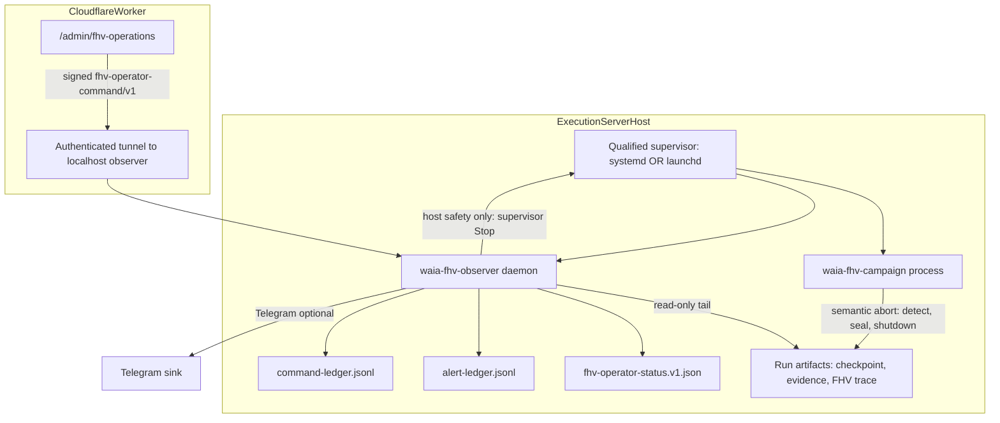
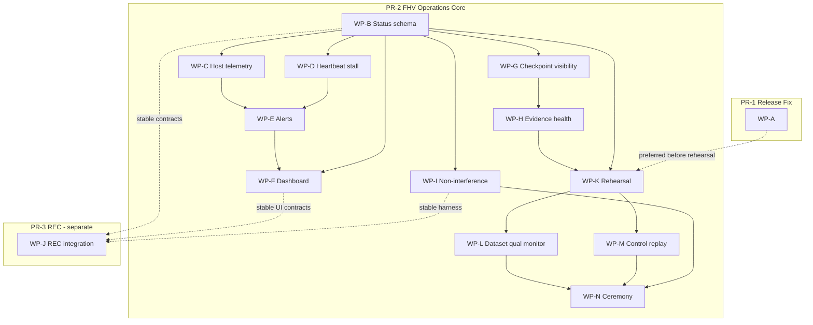

# AI-TRADER Historical Validation Operations and Observability

## Grooming preflight — historical snapshot, 2026-07-21

| Check | Result |
|-------|--------|
| branch | `dev` |
| HEAD = origin/dev | `1c9ac63b4a7b0bd8f3a1ca1c373b9e173b5de04e` |
| origin/main | `ca5c6dfdc3846f48e4abedc3eda9b06b9b9a4291` |
| tag `v2026.07.20.ca5c6df^{commit}` | `ca5c6dfdc3846f48e4abedc3eda9b06b9b9a4291` |
| mainAncestorOfDev | true |
| mainDevTreeDiff | empty |
| trackedTreeClean | true |
| target plan | `htr_ops_observability_365b2c7d.plan.md` (this file — edited in place) |
| replacement plan created | **no** |

**Stop condition at grooming:** none — preflight PASS.

---

## Post-merge snapshot (current, 2026-07-22)

| Check | Result |
|-------|--------|
| `dev` | `bb3f5a66c9886455f5ef7a9b9f5dc16a84cef389` |
| `main` | `1744301f6ed31c754b183634daa37372a7d898cb` |
| PR #411 (DEE-431) | **MERGED** — squash commit `bb3f5a66c9886455f5ef7a9b9f5dc16a84cef389` |
| Feature head | `d66b8d7fbb2997bd911e3922f170a6a37aad1d43` |
| Post-merge CI | run `29935988745` — **success** |
| DEE-431 | **Done** |
| DEE-416 parent | **In Progress** |
| DEE-424 | **In Progress** (T4 rehearsal pending) |
| DEE-423 | **Deferred** |

### Completed release cycle (historical)

| Step | Value |
|------|-------|
| PR #408 dev → main | **MERGED** (merge commit) |
| Main release SHA | `1744301f6ed31c754b183634daa37372a7d898cb` |
| Release tag | `v2026.07.21.1744301` |
| Tag peel | **PASS** |
| PR #409 main → dev back-sync | **MERGED** (merge commit) |
| Post-back-sync dev | `48c7749f704ca68ecda69a917d68099ecd9da543` |

### PR #410 (DEE-424 systemd rehearsal)

| Field | Value |
|-------|-------|
| Feature head | `dfb7b87c31450e1c494da84acaf5d5582f4daa4d` |
| Dev squash SHA | `2f6b164b732ac33275dd47a943fc06467d61be5e` |
| Post-merge CI | run `29850941349` — **success** |

---

### PR #411 (DEE-431 release identity correction)

| Field | Value |
|-------|-------|
| PR | https://github.com/oumaster369/waia/pull/411 |
| Branch | `dee-431-fhv-release-identity-correction` |
| Base (`dev`) | `2f6b164b732ac33275dd47a943fc06467d61be5e` |
| Status | **MERGED** — Human squash to dev on 2026-07-22 |
| Feature head | `d66b8d7fbb2997bd911e3922f170a6a37aad1d43` |
| Dev squash SHA | `bb3f5a66c9886455f5ef7a9b9f5dc16a84cef389` |
| Post-merge CI | run `29935988745` — **success** |
| Scope | Release identity contract, runtime enforcement, systemd fail-closed, bounded T4 rehearsal capability, **true incremental checkpoint resume** (canvas restore + dual authoritative run-chain; quiescent-only pause/resume at `QUIESCENT_NO_ECONOMIC_STATE`; run/org-scoped identity frontier; process-B no-rescan artifact; not full replay-from-zero; generic active economic recovery not claimed; Execution Server untouched; T4 not executed) |

---

## Post-merge snapshot (historical — PR #406 merge, 2026-07-21)

## Merged delivery status

### PR-1 / DEE-417

| Field | Value |
|-------|-------|
| PR | https://github.com/oumaster369/waia/pull/405 |
| Feature head | `e8aa62244318d6b142dacbc3093d24408d52da9a` |
| Squash SHA on `dev` | `2680e5b72908f0d8bc64e765bc3b4e9162d7e3e7` |
| Status | **merged** |
| Delivered | Release tag identity prevention (`target_commitish`, tag-peel verification, full SHA in release body) |

### PR-2 / DEE-416

| Field | Value |
|-------|-------|
| PR | https://github.com/oumaster369/waia/pull/406 |
| Feature head | `ed21bde5984489e1e3df60d5065c1b8acdea3ef3` |
| Squash SHA on `dev` | `1e15f7890e386cb6a9f67319edd216fdbb7192fc` |
| Post-merge CI | run `29824130627` — **success** |
| Status | **merged** |
| Economic gate | `PASS-FHV-ECONOMIC-NON-INTERFERENCE` |
| Browser CSRF gate | dedicated `pnpm test:e2e:fhv-csrf` — **PASS** in post-merge CI |

### PR-3 / DEE-423

| Field | Value |
|-------|-------|
| PR | **none** |
| Status | **deferred** |
| Blocks baseline FHV deployment readiness? | **No** |

No release SHA, tag, or production deployment is recorded for DEE-416 in this section.

### Work-package completion semantics (post-merge)

| WP | Linear | Implementation merged | Human ceremony executed |
|----|--------|----------------------|-------------------------|
| L | DEE-430 | monitoring surfaces — **yes** | dataset qualification — **no** |
| M | DEE-428 | monitoring surfaces — **yes** | control replay — **no** |
| N | DEE-426 | ceremony/report scaffolding — **yes** | full FHV validation — **no** |
| K | DEE-424 | rehearsal contract/docs — **yes** | real Execution Server rehearsal — **no** |
| J | DEE-423 | — | REC — **deferred, not implemented** |

---

## Safety flags (current)

| Flag | Value |
|------|-------|
| EXECUTION_SERVER_TARGET_SHA | **UNRESOLVED_UNTIL_NEXT_RELEASE** |
| DEE-415 | **COMPLETE** |
| DEE-416 | **IN_PROGRESS** |
| DEE-424 | **IN_PROGRESS** |
| DEE-423 | **DEFERRED** |
| HOST_OS | **LINUX_SYSTEMD_QUALIFIED** |
| qualifiedSupervisor | **SYSTEMD** |
| hostResourceContract | **PASS** |
| commandContractFailClosed | true |
| commandsActuallyEnforced | false |
| supervisorExecutorImplemented | true |
| supervisorQualificationRequired | true |
| systemdUnitsImplemented | true |
| systemdUnitsInstalled | false |
| executionServerLegacyStateInventoryComplete | true |
| executionServerCleanCheckoutProvisioned | false |
| rehearsalLauncherImplemented | true |
| executionServerRehearsalExecuted | false |
| CONTROL_REPLAY_EXECUTED | false |
| HISTORICAL_DATASET_QUALIFICATION | NOT_EXECUTED |
| READY_FOR_FULL_HISTORICAL_TEST | NO |
| EXECUTION_SERVER_DEPLOYMENT_AUTHORIZED | NO |
| LIVE_TRADING_AUTHORIZED | NO |

---

## Factual baseline (released implementation)

### IMPLEMENTED_AND_RUNNABLE

- **Replay core:** [`lib/trader/backtest/backtest-runner.ts`](lib/trader/backtest/backtest-runner.ts) — Canvas incremental substrate, WP17 simulated exchange, accounting bridge, drawdown HWM, opt-in `fhvObservability` → `createFhvTraceEvidenceSink`.
- **Streaming evidence (WP04):** [`lib/trader/backtest/streaming-evidence/`](lib/trader/backtest/streaming-evidence/) — chunks, manifest, reconstructor, atomic writes, crash recovery; CLI `pnpm trader:replay:evidence-recovery`.
- **Checkpoint/resume (WP05/WP22):** [`replay-checkpoint.ts`](lib/trader/backtest/streaming-evidence/replay-checkpoint.ts) v3, run-chain manifests, parity harness [`replay-checkpoint-resume-harness.ts`](lib/trader/backtest/streaming-evidence/replay-checkpoint-resume-harness.ts); CLI `pnpm trader:replay:checkpoint-resume`.
- **FHV trace + six reports:** [`fhv-runtime-trace-writer.ts`](lib/trader/observability/fhv-runtime-trace-writer.ts), report builders under [`lib/trader/readiness/build-fhv-*.v1.ts`](lib/trader/readiness/), enforced in FHV mode via `assertProductionReplayEvidenceSinkConfigured`.
- **Readiness preflight (WP23):** [`htr-readiness-preflight.ts`](lib/trader/readiness/htr-readiness-preflight.ts), pinned contract [`htr-fhv-run-contract-v0.ts`](lib/trader/readiness/htr-fhv-run-contract-v0.ts) (`datasetSourceClassification: NOT_AVAILABLE`).
- **Strategy gating (WP16):** hot-path eligibility in replay; Postgres lifecycle/trial repos.
- **Telegram alerting:** [`lib/observability/alerting/alert-router.ts`](lib/observability/alerting/alert-router.ts) — 5-min dedupe, stdout classifier; Worker probe `GET /api/health/alerting`.
- **Execution Server tooling (DEE-409):** guarded scripts + Docker health container [`services/ai-trader-execution-host/server.mjs`](services/ai-trader-execution-host/server.mjs); `--restart unless-stopped`.
- **Admin UI (control plane):** [`app/(trader)/admin/`](app/(trader)/admin/) — kill switches, live enable, promotions, audit; overview includes `executionHostHealthy` via [`admin-overview-handler.ts`](lib/trader/admin-overview-handler.ts).

### IMPLEMENTED_BUT_NOT_WIRED

- FHV observability defaults **off** (`NOOP_REPLAY_EVIDENCE_SINK` unless `fhvObservability` or `STREAM_ONLY` + evidence dir).
- No **`pnpm trader:fhv:run`** orchestrator for full pinned FHV contract on real data.
- Research orchestrator `replayResume` reuses run ID only — does not propagate `resumeCycleStartIndex` / checkpoint slices.
- Telegram alerting not bound to long-running host CLIs (stdout-only unless log shipper added).

### IMPLEMENTED_NOT_DEPLOYED (merged PR #406 — not yet on Execution Server)

- **Host-resident FHV status contract** — `fhv-operator-status/v1` types, builder, bounded writer ([`lib/trader/observability/`](lib/trader/observability/)).
- **FHV operator dashboard** — `/admin/fhv-operations` + Worker admin API routes ([`app/(trader)/admin/fhv-operations/`](app/(trader)/admin/fhv-operations/)).
- **Host observer daemon** — localhost HTTP server ([`services/ai-trader-fhv-observer/`](services/ai-trader-fhv-observer/)); not deployed to Execution Server.
- **Authenticated observer tunnel contract** — bridge/transport auth implemented; tunnel **not deployed**.
- **Dataset qualification / control replay / ceremony monitoring** — status surfaces merged (WP-L/M/N); **no real dataset qualification, control replay, or full FHV ceremony executed**.

### IMPLEMENTED_FAIL_CLOSED_PRE_T4

- **Authenticated command contract** — CSRF v2, strict schema, run-bound manual confirmation, atomic rate limits, bounded replay protection ([`lib/trader/fhv-admin-handler.ts`](lib/trader/fhv-admin-handler.ts)).
- **Real supervisor executor** — **IMPLEMENTED_IN_REPOSITORY** (`supervisorExecutorImplemented=true`; `commandsActuallyEnforced=false` until Human T4 deployment proves host path).

### PARTIAL / TARGET_ONLY / ABSENT

| Capability | Status |
|------------|--------|
| Full FHV campaign on execution server | **NOT_EXECUTED** (contract + preflight exist; no qualified supervisor deploy) |
| Supervised long-run FHV (beyond tmux/nohup) | PARTIAL (rehearsal contract + runbook merged; qualified supervisor units not installed) |
| Research Evolution closed loop | **DEFERRED_NOT_IMPLEMENTED** (PR-3 / DEE-423 separate) |
| Release tag SHA pinning | **IMPLEMENTED_AND_MERGED** via DEE-417 / PR #405 ([`.github/workflows/release.yml`](.github/workflows/release.yml)) |

**Governance boundary:** DEE-415 / HTR program is **COMPLETE** (`CERTIFY-HTR-READY` issued). This program is a **new integration parent** — do not reopen DEE-415.

---

## 1. Linear governance program (GROOMED 2026-07-21)

### Parent issue

| Field | Value |
|-------|-------|
| **ID** | **DEE-416** |
| **Title** | AI-TRADER: Historical Validation Operations and Observability |
| **URL** | https://linear.app/deepsense/issue/DEE-416/ai-trader-historical-validation-operations-and-observability |
| **Project** | WAIA Development |
| **Team** | DEE |
| **Status** | In Progress |
| **Labels** | `infra`, `program:ai-trader` |
| **DEE-415** | COMPLETE — **not** a parent/child link |

### Child issues A–N (tracking only)

`childrenDoNotRequireSeparatePRs=true` · `childrenDoNotRequirePerWpHumanApproval=true`

| Child | Linear ID | URL | Execution label | PR | Depends on |
|-------|-----------|-----|-----------------|-----|------------|
| **A** | DEE-417 | https://linear.app/deepsense/issue/DEE-417/hv-ops-a-release-workflow-identity-prevention | infra | PR-1 | — |
| **B** | DEE-425 | https://linear.app/deepsense/issue/DEE-425/hv-ops-b-host-resident-fhv-campaign-status | backend | PR-2 | — |
| **C** | DEE-418 | https://linear.app/deepsense/issue/DEE-418/hv-ops-c-host-resource-telemetry | backend | PR-2 | B |
| **D** | DEE-422 | https://linear.app/deepsense/issue/DEE-422/hv-ops-d-heartbeat-progress-and-stall-detection | backend | PR-2 | B |
| **E** | DEE-420 | https://linear.app/deepsense/issue/DEE-420/hv-ops-e-alerts-and-operator-notification | backend | PR-2 | B,C,D |
| **F** | DEE-419 | https://linear.app/deepsense/issue/DEE-419/hv-ops-f-operator-dashboard-and-authenticated-controls | frontend | PR-2 | B,E |
| **G** | DEE-421 | https://linear.app/deepsense/issue/DEE-421/hv-ops-g-checkpoint-resume-and-restart-visibility | backend | PR-2 | B |
| **H** | DEE-429 | https://linear.app/deepsense/issue/DEE-429/hv-ops-h-evidence-sealing-and-artifact-health | backend | PR-2 | B,G |
| **I** | DEE-427 | https://linear.app/deepsense/issue/DEE-427/hv-ops-i-certified-economic-non-interference-proof | backend | PR-2 (+PR-3) | B |
| **J** | DEE-423 | https://linear.app/deepsense/issue/DEE-423/hv-ops-j-research-evolution-campaign-integration | ai | PR-3 | stable B,F,I |
| **K** | DEE-424 | https://linear.app/deepsense/issue/DEE-424/hv-ops-k-execution-server-rehearsal | infra | PR-2 | A,B–H |
| **L** | DEE-430 | https://linear.app/deepsense/issue/DEE-430/hv-ops-l-historical-dataset-qualification-monitoring | infra | PR-2 | B,K |
| **M** | DEE-428 | https://linear.app/deepsense/issue/DEE-428/hv-ops-m-deterministic-control-replay-monitoring | backend | PR-2 | B,K |
| **N** | DEE-426 | https://linear.app/deepsense/issue/DEE-426/hv-ops-n-full-historical-validation-ceremony-and-closure-reports | product | PR-2 | K,L,M |

### Risk classification (groomed)

| Scope | Tier | Reason | Required validations | Human gates | Rollback | Security boundary |
|-------|------|--------|---------------------|-------------|----------|-------------------|
| **PR-1** (DEE-417) | **T2** | GitHub Actions release workflow; infra surface; affects release tag identity | workflow syntax, `pnpm validate:pr-governance`, focused unit if script touched | human-merge | revert PR-1 squash | no secrets; tag peel integrity |
| **PR-2** (DEE-416) | **T2** | Admin API routes, observer service, trader observability lib, dashboard; Postgres read probes | lint, typecheck, unit, build, validate-pr-governance, fhv-economic-non-interference | integration-ready, human-merge; deploy gates separate | revert PR-2 squash | authenticated commands, holdout redaction, CSRF |
| **PR-3** (DEE-423) | **T2** | REC wiring uses discovery/research Postgres; isolated from baseline FHV | lint, typecheck, unit, build, rec-economic-isolation | human-merge after PR-2 contracts stable | revert PR-3 squash | REC isolation; no baseline strategy mutation |
| **WP-K deploy** (DEE-424) | **T4** | Human-only execution-server surface per ADR-0023 | rehearsal checklist (Human) | AUTHORIZE-FHV-OPS-DEPLOY, HOST_OS qualification, rehearsal PASS | supervisor rollback per runbook | operator vault secrets; localhost observer |

Parent integration risk **T2** (dominant scope PR-2). PR-1 and PR-3 classified independently.

Canonical plan: [`docs/plans/dee-416-ai-trader-historical-validation-operations-and-observability.md`](docs/plans/dee-416-ai-trader-historical-validation-operations-and-observability.md)

---

## Acceptance

### PR-1 (DEE-417)

- `release.yml` sets explicit `target_commitish: ${{ github.sha }}`
- Post-create tag peel equals `GITHUB_SHA` or workflow fails
- Release body includes full 40-char SHA
- Separate squash PR to `dev`; no FHV ops code mixed in

### PR-2 (DEE-416)

- Bounded `fhv-operator-status/v1`, `fhv-alert-policy/v1`, `fhv-operator-command/v1` implemented and tested
- Campaign owns semantic aborts; observer owns host safety only
- `/admin/fhv-operations` read-only + authenticated commands with holdout redaction
- `PASS-FHV-ECONOMIC-NON-INTERFERENCE` on WP03/WP05 fixture
- Single integration PR to `dev`; excludes DEE-417 and DEE-423 scopes
- Rehearsal contract + ceremony docs (K–N) committed; no real dataset or execution-server mutation by agents

### PR-3 (DEE-423 — deferred)

- REC isolated from baseline FHV; separate branch/PR after PR-2 merge
- Separate REC economic-isolation proof

### Program gates (Human)

- `AUTHORIZE-FHV-OPS-DEPLOY` before execution-server supervisor install
- Execution Server rehearsal PASS before production FHV campaign
- `HISTORICAL_DATASET_QUALIFICATION=NOT_EXECUTED` until separate Human program

---

## 2. Integration boundaries — three explicit PRs

### PR-1 — RELEASE WORKFLOW FIX

| Field | Value |
|-------|-------|
| Scope | **WP-A only** |
| Branch | `dee-417-release-target-commitish-fix` |
| Linear | **DEE-417** (child A) |
| Merge | separate squash PR to `dev` |
| Blocks PR-2? | **No** (may merge in parallel; WP-K rehearsal prefers A merged first) |

### PR-2 — FHV OPERATIONS CORE

| Field | Value |
|-------|-------|
| Scope | **WP-B, C, D, E, F, G, H, I, K, L, M, N** |
| Branch | `dee-416-ai-trader-historical-validation-ops` |
| Linear | **DEE-416** + children B–I, K–N |
| Merge | **one integration PR** to `dev` |
| Internal tranches | allowed without Human approval per child WP |
| Human gates | integration-ready, deployment, rehearsal, run boundaries only |
| Excludes | WP-A, WP-J |

### PR-3 — RESEARCH EVOLUTION CAMPAIGN

| Field | Value |
|-------|-------|
| Scope | **WP-J only** |
| Branch | `dee-423-research-evolution-campaign` |
| Linear | **DEE-423** (child J) |
| Merge | **separate PR** to `dev` |
| Depends on | stable contracts from WP-B, WP-F, WP-I (merged in PR-2) |
| Blocks PR-2? | **No** |
| Blocks baseline FHV deployment readiness? | **No** |
| Modifies certified baseline active strategy set? | **No** |
| Shares mutable campaign state with baseline FHV? | **No** |
| Silently included in baseline PR? | **No** |
| Economic isolation | separate REC non-interference proof in PR-3 |

---

## 3. Architecture — host-resident observability

### Host qualification and supervisor target

**`HOST_OS=UNKNOWN_UNTIL_EXECUTION_SERVER_PREFLIGHT`**

Resolution at first Execution Server preflight (Human-operated):

| Detected OS | Supervisor implementation | First deployment |
|-------------|---------------------------|------------------|
| Linux | **systemd** (`waia-fhv-campaign.service`, `waia-fhv-observer.service`) | implement systemd only |
| macOS | **launchd** (`com.waia.fhv-campaign.plist`, `com.waia.fhv-observer.plist`) | implement launchd only |
| unsupported | — | **Human architecture decision** required |

Cross-platform templates for the non-qualified OS are a **later non-blocking enhancement** — not first-deployment scope.

Docker `--restart unless-stopped` remains for **health container only**; FHV campaign runs as **supervised host Node process** with pinned SHA preflight.

Per [ADR-0023](docs/adr/0023-execution-server-ai-trader-only-execution-plane.md), [EXECUTION-SERVER-RUNBOOK.md](docs/ops/EXECUTION-SERVER-RUNBOOK.md) §5, and DEE-170 systemd precedent.



**Upgrade from runbook §8 tmux/nohup:** commit supervised unit template(s) for **qualified OS only**; update EXECUTION-SERVER-RUNBOOK §8 to reference qualified supervisor.

### Process boundary (economic isolation)

- **Observer never imports replay hot-path modules** (`backtest-runner`, Canvas, CDE, Risk decision functions).
- Observer reads: checkpoint JSON, streaming-evidence manifest, FHV run manifest, semantic events tail (identity only for status), Postgres read-only probes, OS metrics.
- **Replay never awaits observer** for cycle progress.
- **Observer must never be the sole detector** of economic or semantic integrity violations.

### Fail-closed authority

#### Campaign-owned semantic aborts (replay hot path)

The **campaign process** must directly detect, record terminal reason, create partial/terminal evidence, invoke `createShutdownCoordinator`, and exit non-zero or with canonical aborted terminal:

| Violation | Detection owner |
|-----------|-----------------|
| Dataset digest mismatch | **Campaign** |
| No-lookahead violation | **Campaign** |
| Duplicate order | **Campaign** |
| Execution mismatch | **Campaign** |
| Reconciliation mismatch | **Campaign** |
| Accounting frontier mismatch | **Campaign** |
| Evidence atomic-write failure | **Campaign** |
| Artifact sealing failure | **Campaign** |
| Unauthorized live-exchange path | **Campaign** |
| Unauthorized strategy promotion attempt | **Campaign** |

Observer may **reflect** these in status/alerts by reading campaign-written terminal state — not by independent detection.

#### Observer-owned or observer-escalated host safety

| Condition | Authority |
|-----------|-----------|
| Disk hard limit breached | **Observer** detects → escalate via documented supervisor control contract |
| Process unresponsive (heartbeat stall beyond policy) | **Observer** escalates |
| Service crash loop | **Observer** escalates |
| Operator emergency stop (authenticated command or local break-glass) | **Observer/supervisor** enforces |
| Host resource exhaustion (RAM/swap/inode) | **Observer** escalates |

Observer shutdown enforcement: **only** through documented local control/supervisor contract (`supervisor stop waia-fhv-campaign` or equivalent). Observer does **not** inject into replay decision path.

#### Non-critical telemetry

| Class | Examples | Behavior |
|-------|----------|----------|
| **NON_CRITICAL_TELEMETRY_FAILURE** | status file write fail, Telegram delivery fail, dashboard poll fail, host CPU probe timeout | Log + local alert ledger; **campaign continues** |

---

## 4. Bounded status contract — `fhv-operator-status/v1`

**Design principle:** bounded snapshot only. Full detail lives in append-only JSONL, checkpoint/evidence artifacts, paginated read APIs, and sealed reports.

**New files:**
- [`lib/trader/observability/fhv-operator-status-v1.types.ts`](lib/trader/observability/fhv-operator-status-v1.types.ts)
- [`lib/trader/observability/fhv-operator-status-v1.schema.json`](lib/trader/observability/fhv-operator-status-v1.schema.json)
- [`lib/trader/observability/build-fhv-operator-status-v1.ts`](lib/trader/observability/build-fhv-operator-status-v1.ts)
- [`services/ai-trader-fhv-observer/`](services/ai-trader-fhv-observer/) — host daemon (new)

### Write contract

| Parameter | Value |
|-----------|-------|
| Path | `{runRoot}/status/fhv-operator-status.v1.json` |
| Write interval | **5 seconds** (max); immediate rewrite on terminal state transition |
| Atomic write | `writeFileAtomic` → `{path}.tmp` then `rename`; readers tolerate absent or partial tmp |
| Reader during rotation | Read `{path}` only; ignore `*.tmp`; if parse fails, retry once after 100ms |
| Max serialized size | **256 KiB** hard cap; builder truncates summaries before scalar fields |
| Schema compatibility | Additive minor fields allowed within v1; breaking changes require `fhv-operator-status/v2` + 30-day overlap |

### Allowed content types

- Scalar status fields, counters, aggregate metrics, current state
- Bounded recent summaries (see cardinality table)
- Artifact references (`artifactRef` URIs)
- Pagination cursors pointing to detail APIs/JSONL

### Prohibited content

Unbounded arrays of: orders, fills, positions, hypotheses, signals, candidates, evidence events, alerts.

### Bounded collection cardinality (max items each)

| Collection field | Max | Detail location |
|------------------|-----|-----------------|
| `recentAlerts` | 20 | `{runRoot}/alerts/alert-ledger.jsonl` + paginated API |
| `recentSignalsSummary` | 10 | FHV semantic events JSONL |
| `recentOrdersSummary` | 10 | checkpoint execution slice + paginated API |
| `recentFillsSummary` | 10 | accounting frontier refs + paginated API |
| `openPositionsSummary` | 10 | checkpoint accounting slice |
| `activeHypothesesSummary` | 5 | semantic events / MI records |
| `competingHypothesesSummary` | 5 | semantic events |
| `candidateStrategiesSummary` | 5 | research candidate repo (REC only) |
| `recentEvidenceEventIds` | 20 | `events.jsonl` |
| `vetoesSummary` | 10 | semantic events |
| `riskReductionsSummary` | 10 | semantic events |

Each summary item: `{ id, label, atUtc, artifactRef }` — no embedded economic payloads beyond aggregate scalars.

### Detail artifact reference format

```
artifactRef := "fhv-artifact/v1/{kind}/{runId}/{relativePath}#{seqOrOffset}"
```

Kinds: `semantic-event`, `checkpoint`, `evidence-chunk`, `report`, `alert`, `command-result`.

### Pagination contract (detail APIs)

```
GET /v1/detail/{kind}?runId=&cursor=&limit=
```

- `limit` default 50, max 200
- Response: `{ items[], nextCursor, totalApprox? }`
- Cursor opaque, stable across single run

### Top-level snapshot shape (bounded)

```typescript
type FhvOperatorStatusV1 = {
  schemaVersion: "fhv-operator-status/v1";
  observedAt: string;                    // NON_ECONOMIC
  campaignKind: "CERTIFIED_BASELINE_FHV" | "RESEARCH_EVOLUTION_CAMPAIGN";
  alertPolicyDigest: string;             // pinned fhv-alert-policy/v1
  campaign: { /* scalars: runId, phase, codeSha, digests, cursor, bars*, throughput*, ETA, heartbeat*, terminal* */ };
  host: { /* scalars + aggregates only */ };
  marketIntelligence: { /* scalars + bounded summaries */ };
  strategies: { /* scalars + candidateStrategiesSummary[max 5] */ };
  tradingSimulation: { /* aggregate scalars: cash, equity, pnl*, drawdown*, exposure; NO unbounded orders/fills */ };
  evidence: { /* scalars + recentEvidenceEventIds[max 20] + artifactRefs */ };
  holdout: HoldoutStatusV1;             // see §9
  pagination: { alerts, semanticEvents, orders, fills, commands }; // cursors only
};
```

**Data sources:** unchanged factual mapping to checkpoint, streaming manifest, FHV trace tail (identities), WP16 lifecycle, alert policy — summaries only in status file.

---

## 5. Secure operator command contract — `fhv-operator-command/v1`

**Plain unsigned control files are prohibited.** All mutating operator actions require authenticated commands.

**New files:**
- [`lib/trader/observability/fhv-operator-command-v1.types.ts`](lib/trader/observability/fhv-operator-command-v1.types.ts)
- [`lib/trader/observability/fhv-operator-command-v1.schema.json`](lib/trader/observability/fhv-operator-command-v1.schema.json)
- [`lib/trader/observability/verify-fhv-operator-command-v1.ts`](lib/trader/observability/verify-fhv-operator-command-v1.ts)

### Required fields

```typescript
type FhvOperatorCommandV1 = {
  schemaVersion: "fhv-operator-command/v1";
  commandId: string;              // UUID
  campaignRunId: string;
  organizationId: string;
  operatorId: string;
  action: FhvOperatorAction;
  reason: string;
  issuedAtUtc: string;
  expiresAtUtc: string;           // max TTL 15 minutes
  nonce: string;                  // 128-bit random hex
  idempotencyKey: string;
  expectedCampaignState: { phase: string; checkpointSeq?: number };
  confirmationPhraseClass: "NONE" | "PAUSE" | "RESUME" | "STOP" | "EMERGENCY" | "DIAGNOSTIC";
  signature: string;
  signatureAlgorithm: "HMAC-SHA256" | "ED25519";
};
```

### Allowed actions only

`PAUSE_AT_CHECKPOINT` | `RESUME_FROM_CHECKPOINT` | `GRACEFUL_STOP` | `EMERGENCY_STOP` | `CREATE_DIAGNOSTIC_BUNDLE`

### Security requirements

| Requirement | Implementation |
|-------------|----------------|
| Localhost-only observer endpoint | bind `127.0.0.1:${FHV_OBSERVER_PORT}` |
| Authenticated tunnel | Cloudflare Tunnel / Tailscale with mTLS or approved HMAC |
| Replay protection | `nonce` + `expiresAtUtc` + append-only command ledger |
| Idempotency | `idempotencyKey` → duplicate returns prior `command-result` |
| Command ledger | `{runRoot}/control/command-ledger.jsonl` append-only, immutable audit |
| Command result ack | `{runRoot}/control/command-results/{commandId}.json` |
| Run-ID binding | reject if `campaignRunId` mismatch |
| Organization binding | reject if `organizationId` mismatch |
| CSRF (Worker surface) | double-submit token + SameSite session |
| Rate limiting | 10 commands / operator / hour |
| Secret redaction | reason field scanned; refuse if secret patterns match |
| Stale state refusal | reject if `expectedCampaignState` ≠ current status snapshot |

### Worker → host flow

1. Operator submits action in `/admin/fhv-operations` (read-review-action shell).
2. Worker API validates session, org, CSRF, rate limit; signs command with server-side HMAC key (operator vault).
3. Worker forwards signed command through tunnel to observer `POST /v1/commands`.
4. Observer verifies signature, expiry, nonce, idempotency; appends ledger; executes via supervisor contract; writes result.

### Local break-glass (tunnel unavailable)

Documented **Human-only** paths that do not depend on Cloudflare:

- SSH to host → `POST http://127.0.0.1:${FHV_OBSERVER_PORT}/v1/commands` with locally signed command (operator vault key)
- Supervisor direct: `systemctl stop waia-fhv-campaign` / `launchctl stop com.waia.fhv-campaign` for **EMERGENCY_STOP** only
- Break-glass events append to command ledger with `source: "LOCAL_BREAK_GLASS"`

---

## 6. Versioned alert policy — `fhv-alert-policy/v1`

**New files:**
- [`lib/trader/observability/fhv-alert-policy-v1.types.ts`](lib/trader/observability/fhv-alert-policy-v1.types.ts)
- [`lib/trader/observability/fhv-alert-policy-v1.schema.json`](lib/trader/observability/fhv-alert-policy-v1.schema.json)

Policy digest **pinned in campaign manifest** at run start. No hidden runtime defaults. No silently adjustable thresholds during a certified campaign.

| Field | Value or classification |
|-------|------------------------|
| `expectedHeartbeatIntervalSec` | **30** |
| `heartbeatWarningAgeSec` | **60** |
| `heartbeatCriticalAgeSec` | **120** |
| `progressStallWarningSec` | **900** (15 min) |
| `progressStallCriticalSec` | **3600** (60 min) |
| `checkpointMaxAgeSec` | **1800** (30 min) |
| `diskSoftThresholdRule` | **`freeBytes < max(20 GiB, 10% of total filesystem capacity)`** → WARNING (FHV-ALERT-006) |
| `diskHardThresholdRule` | **`freeBytes < max(5 GiB, 3% of total filesystem capacity)`** → CRITICAL (FHV-ALERT-007); observer-owned host-safety shutdown via qualified supervisor |
| `diskThresholdPinPolicy` | Pinned in campaign manifest digest at run start; change requires new campaign identity |
| `inodeSoftThresholdPct` | **85** |
| `inodeHardThresholdPct` | **95** |
| `artifactGrowthAnomalyWindowSec` | **3600** |
| `artifactGrowthAnomalyMultiplier` | **3×** rolling 24h median |
| `postgresFailureGraceSec` | **30** (observer); campaign abort per existing replay disconnect policy |
| `processRestartEscalationCount` | **3** within **3600** sec → CRITICAL |
| `persistentZeroDecisionWindowSec` | **3600** |
| `persistentVetoOnlyWindowSec` | **3600** |
| `dedupeWindowSec` | per alert ID in catalogue (see §7) |
| `escalationWindowSec` | **900** (WARNING→CRITICAL for stall) |
| `telegramRetryBackoffSec` | **[1, 5, 30, 120]** |
| `alertRetentionDays` | **30** local ledger |

Semantic/economic alert IDs (010–015, 021–022) have **dedupe: none** — campaign owns detection; observer reflects terminal state.

---

## 7. Alert catalogue

Extend [`alert-classifier.ts`](lib/observability/alerting/alert-classifier.ts) + [`fhv-alert-catalogue.v1.ts`](lib/trader/observability/fhv-alert-catalogue.v1.ts).

Thresholds sourced from pinned `fhv-alert-policy/v1` — not hardcoded in classifier.

| ID | Condition | Severity | Detector | Dedupe |
|----|-----------|----------|----------|--------|
| FHV-ALERT-001 | heartbeatAge > policy critical | CRITICAL | Observer | 5 min |
| FHV-ALERT-002 | barsProcessed unchanged > stall critical | CRITICAL | Observer | 15 min |
| FHV-ALERT-003 | process crash / non-zero exit | CRITICAL | Observer | 1 min |
| FHV-ALERT-004 | processRestartCount increment | WARNING | Observer | 5 min |
| FHV-ALERT-005 | checkpointAge > policy max | WARNING | Observer | 10 min |
| FHV-ALERT-006 | diskFree < soft | WARNING | Observer | 30 min |
| FHV-ALERT-007 | diskFree < hard | CRITICAL | Observer | 5 min |
| FHV-ALERT-008 | artifactGrowth anomaly | WARNING | Observer | 30 min |
| FHV-ALERT-009 | Postgres unavailable > grace | CRITICAL | Observer | 5 min |
| FHV-ALERT-010 | dataset digest mismatch | CRITICAL | **Campaign** | none |
| FHV-ALERT-011 | data gap detected | CRITICAL | **Campaign** | none |
| FHV-ALERT-012 | no-lookahead violation | CRITICAL | **Campaign** | none |
| FHV-ALERT-013 | duplicate order | CRITICAL | **Campaign** | none |
| FHV-ALERT-014 | fill/reconciliation mismatch | CRITICAL | **Campaign** | none |
| FHV-ALERT-015 | accounting frontier mismatch | CRITICAL | **Campaign** | none |
| FHV-ALERT-016 | drawdown threshold breach | WARNING | **Campaign** | 15 min |
| FHV-ALERT-017 | evidence write failure | CRITICAL | **Campaign** | none |
| FHV-ALERT-018 | artifact sealing failure | CRITICAL | **Campaign** | none |
| FHV-ALERT-019 | persistent zero-decision | WARNING | Observer | 1 hr |
| FHV-ALERT-020 | persistent veto-only | WARNING | Observer | 1 hr |
| FHV-ALERT-021 | unexpected live-exchange path | CRITICAL | **Campaign** | none |
| FHV-ALERT-022 | unauthorized promotion attempt | CRITICAL | **Campaign** | none |

Local ledger: `{runRoot}/alerts/alert-ledger.jsonl` — append-only, persisted even when Telegram fails.

---

## 8. Operator dashboard specification

**Approach:** authenticated read-only Worker admin page + host observer localhost API via approved tunnel. **No public Execution Server exposure.**

### Surfaces

| Surface | Path | Auth |
|---------|------|------|
| Worker UI | `/admin/fhv-operations` | `admin.audit.read` + org scope + CSRF |
| Worker API (status) | `GET /api/trader/admin/fhv-operations/status` | same |
| Worker API (commands) | `POST /api/trader/admin/fhv-operations/commands` | same + rate limit + signed command |
| Host observer | `GET/POST http://127.0.0.1:${FHV_OBSERVER_PORT}/v1/*` | mTLS or HMAC; localhost bind |

### Single-screen layout (10 panels)

Panels consume **bounded status snapshot** + paginated detail APIs — never unbounded arrays in UI state.

1. Campaign progress
2. Host health
3. Market intelligence (non-holdout partitions only until gate open)
4. Active + candidate strategies (bounded summaries)
5. Positions & simulated trades (counts + paginated drill-down)
6. Equity/PnL/drawdown charts (aggregate series from checkpoint snapshots)
7. Risk & Guardian
8. Alerts (from `recentAlerts` + paginated ledger)
9. Evidence/checkpoint health
10. Operator actions (authenticated commands only)

**Forbidden buttons:** live trading enable, Risk bypass, CDE bypass, strategy param edit (baseline), evidence delete, dataset seal rewrite.

---

## 9. Blind holdout confidentiality

### Authoritative FHV partition boundaries (copied from released contracts)

**From [`htr-fhv-run-contract-v0.ts`](lib/trader/readiness/htr-fhv-run-contract-v0.ts):**

| Partition | Interval (UTC half-open) |
|-----------|--------------------------|
| `fullPeriod` | `2020-01-01T00:00:00.000Z` → `2025-12-31T23:59:00.000Z` |
| `developmentCalibration` | `2020-01-01T00:00:00.000Z` → `2022-12-31T23:59:00.000Z` |
| `walkForward` | `2023-01-01T00:00:00.000Z` → `2024-12-31T23:59:00.000Z` |
| `blindHoldout` | `2025-01-01T00:00:00.000Z` → `2025-12-31T23:59:00.000Z`; **`status: "SEALED_NOT_ACCESSED"`** |
| `holdoutAccess` | **`"PROHIBITED_UNTIL_OPERATOR_PROCEDURE"`** |
| `d11bDatasetVenueRole` | `"D11B_INFRASTRUCTURE_QUALIFICATION_ONLY"` |

**From [`fhv-dataset-manifest.ts`](lib/trader/market-data/dataset/fhv-dataset-manifest.ts) `FHV_DATASET_PARTITIONS_V1`:**

| Partition | Interval |
|-----------|----------|
| `development` | `2020-01-01T00:00:00.000Z` → `2023-01-01T00:00:00.000Z` |
| `walkForward` | `2023-01-01T00:00:00.000Z` → `2025-01-01T00:00:00.000Z` |
| `blindHoldout` | `2025-01-01T00:00:00.000Z` → `2026-01-01T00:00:00.000Z`; **`status: "SEALED_NOT_ACCESSED"`** |
| `holdoutSeal.contaminationStatus` | **`"RESERVED_SEALED_NOT_ACCESSED"`** |

Status/dashboard APIs use **run contract partitions** for campaign phase labeling; dataset manifest partitions for **dataset seal identity** only.

### Pre-authorization holdout exposure (holdout gate CLOSED)

Before authorized holdout gate, status/dashboard/API may expose **only**:

```typescript
type HoldoutStatusV1 = {
  holdoutState: "SEALED_NOT_ACCESSED";
  holdoutGate: "CLOSED";
  holdoutDatasetDigest: string;       // identity-only digest
  holdoutAccessAttempts: 0;
  blindHoldoutStatus: "SEALED_NOT_ACCESSED";  // mirrors contract field
  holdoutAccess: "PROHIBITED_UNTIL_OPERATOR_PROCEDURE";
};
```

### Prohibited before gate open

- holdout PnL, equity, trades, decisions, hypotheses, candidate rankings, comparison results

### Tests (PR-2)

- `tests/unit/fhv-holdout-redaction.test.ts` — status builder redaction
- `tests/unit/fhv-admin-holdout-api.test.ts` — API authorization + no early access
- `tests/integration/fhv-holdout-no-early-access.test.ts` — end-to-end sealed partition

---

## 10. Economic non-interference acceptance matrix

**Harness:** [`lib/trader/observability/fhv-economic-non-interference-harness.ts`](lib/trader/observability/fhv-economic-non-interference-harness.ts)

**PR-2 gate (baseline FHV observability):** WP03/WP05 fixture — observability off vs instrumented (observer + status + alerts, mock Telegram).

**PR-3 gate (REC):** separate proof — REC campaign must not alter baseline FHV contract digests or certified strategy set.

| Digest | Source |
|--------|--------|
| decisionDigest | `computeSemanticParityDigest` |
| orderDigest | execution checkpoint slice |
| fillDigest | consumed fill IDs + payloads |
| accountingDigest | `accountingFrontierState.semanticContentDigest` |
| pnlDigest | net/gross realized |
| terminalState | replay terminal + evidence manifest |

**NON_ECONOMIC diffs allowed:** status snapshot, alert ledger, command ledger, observer timestamps, diagnostic bundles.

---

## 11. Research Evolution Campaign contract (PR-3 / WP-J)

**New contract:** [`lib/trader/research/rec-campaign-contract-v1.ts`](lib/trader/research/rec-campaign-contract-v1.ts)

### Isolation rules (unchanged intent, PR-3 enforced)

- Separate `runId` namespace: `rec-*` vs `fhv-*`
- Separate contract pin; **cannot** mutate `HTR_FHV_RUN_CONTRACT_V0` active strategy set
- No shared mutable campaign state with baseline FHV
- Holdout: M9 operator digest required; REC cannot read sealed holdout early
- No self-promotion; no live execution

### Wiring plan (WP-J — PR-3 only)

1. Wire `discovery-run.ts` → real bars/trades
2. Persist via `discovery-registry-postgres.ts`
3. Connect `simulation-broker.ts` → `runResearchPipelinePostgres`
4. Close actuation loop (human disposition → hypothesis → candidate → RI)
5. CLI: `pnpm trader:rec:campaign`
6. Dashboard REC selector (reads separate status snapshot; no baseline state mutation)

---

## 12. Execution Server rehearsal contract (WP-K)

**Doc:** [`docs/ops/FHV-EXECUTION-SERVER-REHEARSAL-CONTRACT.md`](docs/ops/FHV-EXECUTION-SERVER-REHEARSAL-CONTRACT.md)

**Preflight includes:** `HOST_OS` detection → install **qualified supervisor only**.

**Scope:** non-production fixture only (WP03 benchmark or RI-P7 synthetic); **no real HTX dataset**.

**Sequence (Human-operated):**

1. `EXECUTION_SERVER_TARGET_SHA` preflight PASS + `HOST_OS` qualified
2. Install qualified supervisor units (observer + campaign)
3. Short deterministic replay (under 5 min)
4. Verify bounded status, checkpoint, alert policy digest, command auth drill
5. SSH disconnect + observer restart + campaign resume
6. Worker dashboard via tunnel
7. Seal evidence → `replay-runs/RI-P7/fhv-ops-rehearsal-<date>/`

---

## 13. Release workflow correction (PR-1 / WP-A)

**File:** [`.github/workflows/release.yml`](.github/workflows/release.yml)

```yaml
target_commitish: ${{ github.sha }}
# + post-create tag peel verification step
# + full 40-char SHA in release body
```

**Cloudflare boundary:** WP-A prevents future release tag identity drift only. **No Cloudflare redeploy in this program.** Production Worker SHA confirmation remains a **separate Human release/deployment operation** before next production promotion — **not a blocker** for local observability implementation or PR-2 merge.

---

## 14. Testing matrix

| Test class | Location | PR | Runtime |
|------------|----------|-----|---------|
| Status schema + size cap | `tests/unit/fhv-operator-status-v1.test.ts` | PR-2 | < 5 min |
| Status builder bounded summaries | `tests/unit/build-fhv-operator-status-v1.test.ts` | PR-2 | < 5 min |
| Command auth + replay + idempotency | `tests/unit/fhv-operator-command-v1.test.ts` | PR-2 | < 5 min |
| Alert policy digest pin | `tests/unit/fhv-alert-policy-v1.test.ts` | PR-2 | < 5 min |
| Alert dedupe | `tests/unit/fhv-alert-dedupe.test.ts` | PR-2 | < 5 min |
| Campaign semantic abort ownership | `tests/integration/fhv-campaign-semantic-abort.test.ts` | PR-2 | < 5 min |
| Observer host safety escalation | `tests/integration/fhv-observer-host-safety.test.ts` | PR-2 | < 5 min |
| Holdout redaction + no early access | `tests/unit/fhv-holdout-redaction.test.ts`, `tests/integration/fhv-holdout-no-early-access.test.ts` | PR-2 | < 5 min |
| Restart/resume visibility | `tests/integration/fhv-observer-restart.test.ts` | PR-2 | 5–30 min |
| Disk pressure / Postgres disconnect | `tests/integration/fhv-disk-pressure.test.ts`, `fhv-postgres-disconnect.test.ts` | PR-2 | < 5 min |
| Evidence-write failure (campaign-owned) | `tests/integration/fhv-evidence-failure.test.ts` | PR-2 | < 5 min |
| Live-exchange tripwire (campaign-owned) | `tests/unit/fhv-live-path-tripwire.test.ts` | PR-2 | < 5 min |
| Dashboard auth + CSRF + rate limit | `tests/unit/fhv-admin-api-auth.test.ts` | PR-2 | < 5 min |
| Tenant isolation | `tests/unit/fhv-tenant-isolation.test.ts` | PR-2 | < 5 min |
| Economic non-interference (baseline) | `tests/integration/fhv-economic-non-interference.test.ts` | PR-2 | 5–30 min |
| Synthetic replay E2E | `tests/integration/fhv-synthetic-replay-e2e.test.ts` | PR-2 | 5–30 min |
| REC economic isolation | `tests/integration/rec-economic-isolation.test.ts` | PR-3 | 5–30 min |
| REC holdout isolation | `tests/integration/rec-holdout-isolation.test.ts` | PR-3 | < 5 min |

**Execution Server rehearsal:** Human-only (WP-K); not CI.

---

## 15. Implementation dependency graph



**WP-J does not block PR-2 completion or baseline FHV deployment readiness.**

### PR-2 internal tranches

| Tranche | WPs | Human gate? |
|---------|-----|-------------|
| 1 — contracts | B, alert-policy, operator-command, I skeleton, qualified supervisor template | No |
| 2 — host daemon + campaign abort wiring | C, D, E, G, H | No |
| 3 — control plane | F (+ holdout redaction) | No |
| 4 — validation gate | I full proof | CI gate only |
| 5 — rehearsal docs | K, L, M, N | No |
| 6 — integration | lint/typecheck/test/build + preflight | PR merge gate |

### Key affected files by PR

**PR-1:** `.github/workflows/release.yml`, `scripts/github/generate-release-notes.sh`

**PR-2 / DEE-424 (Linux systemd — repository implementation):**
- `services/ai-trader-fhv-observer/*`
- `lib/trader/observability/fhv-operator-status-v1.*`, `fhv-operator-command-v1.*`, `fhv-alert-policy-v1.*`, `fhv-alert-catalogue.v1.ts`, `fhv-economic-non-interference-harness.ts`
- `lib/trader/observability/fhv-systemd-unit-config.ts`, `fhv-systemd-unit-renderer.ts`, `fhv-linux-systemd-executor.ts`, `fhv-rehearsal-launcher.ts`
- `scripts/trader/fhv-campaign-cli.ts`, `scripts/trader/fhv-rehearsal-cli.ts`
- `scripts/ops/fhv-supervisor/*` (Linux systemd; Human `--confirm` on host only)
- `app/(trader)/admin/fhv-operations/**`, `app/api/trader/admin/fhv-operations/**`
- `docs/ops/FHV-OPERATIONS-RUNBOOK.md`, `FHV-EXECUTION-SERVER-REHEARSAL-CONTRACT.md`, `EXECUTION-SERVER-RUNBOOK.md`

**PR-3:**
- `lib/trader/research/rec-campaign-contract-v1.ts`
- `scripts/trader/rec-campaign-cli.ts`
- discovery wiring + simulation broker integration
- REC dashboard selector + REC isolation tests

**Database changes:** none for observability (read-only). PR-3 uses existing discovery substrate 0074/0075.

---

## 16. Human gate sequence

| Order | Gate | Actor | Blocks |
|-------|------|-------|--------|
| 1 | `APPROVE-HV-OPS-PLAN` | Architect | `/implement` | **DONE** |
| 2 | `/groom` risk classification + Linear creation | Architect | branch work | **DONE** (DEE-416 + A–N) |
| 3 | PR-1 merge (WP-A / DEE-417) | Human squash | release identity (preferred before rehearsal) | **DONE** (PR #405 → `2680e5b…`) |
| 4 | PR-2 `PASS-FHV-ECONOMIC-NON-INTERFERENCE` | CI + Architect | PR-2 merge | **DONE** |
| 5 | PR-2 merge to `dev` | Human squash | baseline ops availability | **DONE** (PR #406 → `1e15f789…`) |
| 5a | Canonical plan status sync (PR #407) | Human squash | release-to-main readiness | **DONE** |
| 5b | dev-to-main release PR (PR #408) | Human merge commit | production promotion | **DONE** (`1744301f…`, tag `v2026.07.21.1744301`, peel PASS) |
| 5c | main → dev back-sync (PR #409) | Human merge commit | ancestry sync | **DONE** (`48c7749f…`) |
| 5d | HOST_OS / systemd qualification | Human + repository | supervisor contract | **DONE** (repository; host install pending T4) |
| 5e | PR #410 DEE-424 systemd rehearsal implementation | Human squash | rehearsal tooling on `dev` | **DONE** (`2f6b164b…`) |
| 5f | PR #411 DEE-431 release identity correction | Human squash | ops doc/runtime gates | **DONE** (`bb3f5a6…`) |
| 5g | Next dev-to-main release | Human merge commit | next production promotion | **NOT_EXECUTED** |
| 5h | Next main → dev back-sync | Human merge commit | post-release ancestry | **NOT_EXECUTED** |
| 6 | `HOST_OS` qualification + supervisor install on Execution Server | Human | execution-server deploy | **NOT_EXECUTED** (units not installed) |
| 7 | `AUTHORIZE-FHV-OPS-DEPLOY` | Human | rehearsal | **NOT_ISSUED** |
| 8 | Execution Server rehearsal PASS (WP-K / T4) | Human operator | production FHV campaign | **NOT_EXECUTED** |
| 9 | PR-3 merge (WP-J) + REC isolation proof | Human squash | REC availability (optional track) | **DEFERRED** (DEE-423) |
| 10 | Dataset qualification decision | Human | `READY_FOR_FULL_HISTORICAL_TEST` | **NOT_EXECUTED** |
| 11 | Control replay ceremony | Human | control replay gate | **NOT_EXECUTED** |
| 12 | `AUTHORIZE-FULL-HISTORICAL-VALIDATION` | Human | multi-day FHV run | **NOT_EXECUTED** |
| 13 | FHV closure report sign-off | Human | next phase | **NOT_EXECUTED** |

**Not in this program:** Cloudflare production SHA confirmation / Worker redeploy (separate release operation).

**Operator connectivity:** power + stable internet at gates 6, 7, 8, 10, 11.

---

## 17. STOP conditions

| Condition | Action |
|-----------|--------|
| PR-2 economic non-interference FAIL | Block PR-2 merge |
| Campaign semantic abort wiring places detection in observer only | STOP — architectural violation |
| Status file exceeds 256 KiB in tests | STOP — bounded contract violation |
| Holdout economic data exposed with gate CLOSED | STOP — confidentiality violation |
| WP-J changes baseline FHV strategy set | STOP — isolation violation |
| Unsigned operator control path introduced | STOP — security violation |
| Alert thresholds adjusted mid-campaign without new run | STOP — policy violation |
| Unsupported HOST_OS without Architect decision | STOP — supervisor install |

---

## 18. Explicit non-goals

- No real HTX dataset qualification (`HISTORICAL_DATASET_QUALIFICATION=NOT_EXECUTED`)
- No multi-day full historical run in implementation PRs
- No execution-server mutation by agents
- No live trading authorization
- No DEE-415 reopening
- No automatic strategy promotion
- No Cloudflare production redeploy or SHA proof in this program
- No 14 separate PRs or 14 mandatory Human per-WP approvals

---

## 19. Canonical plan artifacts on approval

| Artifact | Path |
|----------|------|
| Parent implementation plan | `docs/plans/dee-416-ai-trader-historical-validation-operations-and-observability.md` |
| Draft (this file) | `.cursor/plans/htr_ops_observability_365b2c7d.plan.md` |
| Status schema | `lib/trader/observability/fhv-operator-status-v1.schema.json` |
| Command schema | `lib/trader/observability/fhv-operator-command-v1.schema.json` |
| Alert policy | `lib/trader/observability/fhv-alert-policy-v1.schema.json` |
| Alert catalogue | `lib/trader/observability/fhv-alert-catalogue.v1.ts` |
| Dashboard spec | `docs/product-specs/fhv-operator-dashboard-v1.md` |
| Non-interference matrix | `docs/product-specs/fhv-economic-non-interference-matrix.md` |
| REC contract | `lib/trader/research/rec-campaign-contract-v1.ts` |
| Rehearsal contract | `docs/ops/FHV-EXECUTION-SERVER-REHEARSAL-CONTRACT.md` |
| Release identity contract | `docs/ops/FHV-RELEASE-IDENTITY-CONTRACT.md` |
| Release identity validator | `scripts/ops/validate-fhv-release-identity.sh` |
| Release identity validator (library) | `lib/trader/observability/fhv-release-identity-validator.ts` |
| Campaign runtime identity | `lib/trader/observability/fhv-campaign-runtime-identity.ts` |
| Rehearsal campaign runner | `lib/trader/observability/fhv-rehearsal-campaign-runner.ts` |
| Systemd unit config/renderer | `lib/trader/observability/fhv-systemd-unit-config.ts`, `fhv-systemd-unit-renderer.ts` |
| Systemd supervisor scripts | `scripts/ops/fhv-supervisor/` |

---

## Terminal classification (current)

**`DEE_416_PR411_POST_MERGE_READY_FOR_NEXT_RELEASE`**

| Flag | Value |
|------|-------|
| parentLinearCreated | true |
| allFourteenChildrenCreated | true |
| realLinearIdsRecorded | true |
| pr1Merged | true |
| pr2Merged | true |
| pr3DeferredNonBlocking | true |
| pr408ReleaseToMainExecuted | true |
| pr409BackSyncExecuted | true |
| pr410MergedToDev | true |
| pr411Open | false |
| pr411Merged | true |
| canonicalPlanPromoted | true |
| canonicalPlanStatusTruthful | true |
| implementationMergedToDev | true |
| releaseToMainExecuted | true (PR #408 — `1744301f…`) |
| dee416ParentInProgress | true |
| dee424InProgress | true |
| dee423Deferred | true |
| dee431InProgress | false |
| dee431Done | true |
| executionServerAccessed | false |
| datasetAccessed | false |
| replayStarted | false |
| liveTradingStarted | false |
| EXECUTION_SERVER_TARGET_SHA | UNRESOLVED_UNTIL_NEXT_RELEASE |
| HISTORICAL_DATASET_QUALIFICATION | NOT_EXECUTED |
| CONTROL_REPLAY_EXECUTED | false |
| READY_FOR_FULL_HISTORICAL_TEST | NO |
| EXECUTION_SERVER_DEPLOYMENT_AUTHORIZED | NO |
| LIVE_TRADING_AUTHORIZED | NO |
| READY_FOR_DEE_416_RELEASE_TO_MAIN | YES |

---

## Terminal classification (historical — superseded 2026-07-21)

**`DEE_416_PR406_POST_MERGE_IMPLEMENTATION_MERGED_AWAITING_RELEASE_AND_T4`** — superseded after PR #408 release and PR #410 merge.

| Flag | Value |
|------|-------|
| parentLinearCreated | true |
| allFourteenChildrenCreated | true |
| realLinearIdsRecorded | true |
| pr1Merged | true |
| pr2Merged | true |
| pr3DeferredNonBlocking | true |
| canonicalPlanPromoted | true |
| canonicalPlanStatusTruthful | true (at time of PR #406 merge) |
| implementationMergedToDev | true |
| releaseToMainExecuted | false (at time of classification) |
| dee416ParentInProgress | true |
| dee424InProgress | true |
| dee423Deferred | true |
| executionServerAccessed | false |
| datasetAccessed | false |
| replayStarted | false |
| liveTradingStarted | false |
| HISTORICAL_DATASET_QUALIFICATION | NOT_EXECUTED |
| READY_FOR_FULL_HISTORICAL_TEST | NO |
| EXECUTION_SERVER_DEPLOYMENT_AUTHORIZED | NO |
| LIVE_TRADING_AUTHORIZED | NO |
| READY_FOR_DEE_416_RELEASE_TO_MAIN | pending canonical plan sync PR merge (superseded) |
