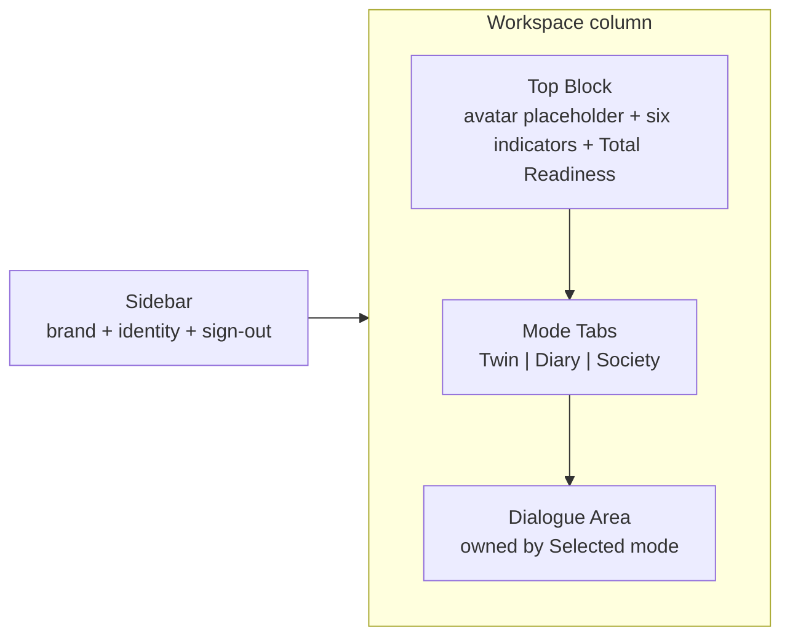
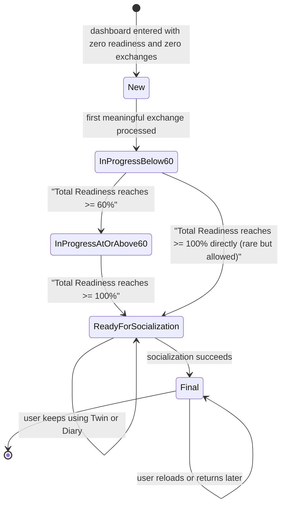

# WAIA AI-Twin v1 — Dashboard Shell

**Status:** Legacy shipped-runtime dashboard truth. Superseded for future AI-TWIN implementation by the [AI-TWIN Product Constitution](AI-TWIN-PRODUCT-CONSTITUTION.md), [v1 completion spec](../product-specs/ai-twin-v1-completion.md) and [program roadmap](../roadmaps/ai-twin-program-roadmap.md). Retained below for migration and regression evidence.

This document is the canonical, system-level definition of the AI-Twin v1 dashboard shell content and states. All frontend, backend, and AI tasks consume this document as the single source of truth for what the dashboard shell exposes and how it behaves. Conflicts with downstream issues are resolved here first, then propagated.

This document refines Step 3 ("Dashboard entry") of [docs/product/ai-twin-user-flow.md](ai-twin-user-flow.md). It does not redefine any concept that already exists upstream; it references the upstream definition.

## 1. Header / Metadata

| Field | Value |
| --- | --- |
| Issue | [DEE-13](https://linear.app/deepsense/issue/DEE-13/07-define-dashboard-shell-content-and-states) — 07 Define dashboard shell content and states |
| Project | WAIA |
| Milestone | WAIA MVP 1.0 |
| Team | DeepSense (DEE) |
| Execution label | `product` |
| Document type | Product specification (no code, no UI design, no API contracts, no AI logic) |
| Document path | `docs/product/ai-twin-dashboard-shell.md` |
| Predecessor snapshot | `.cursor/plans/2026-05-03-waia-dashboard-spec.md` (kept unchanged for traceability) |
| Upstream source of truth | [docs/product/ai-twin-user-flow.md](ai-twin-user-flow.md) (DEE-7) |
| Date | 2026-05-03 |
| Owner | Cursor agent with Linear execution label `product` |

## 2. Purpose

The dashboard is the only workspace where an AI-Twin v1 user creates, observes, and grows their AI-Twin. To make that workspace implementable across the frontend, backend, and AI workstreams without ambiguity, the shell must be defined once, in product terms, before any UI work begins.

This document defines:

- the four regions of the dashboard shell,
- the content of each region in MVP,
- the named state of each region for every observable user state,
- the lock and unlock semantics of the three modes (Twin, Diary, Society),
- the dialogue area purpose and its empty, active, ready-for-socialization, and final states,
- the deterministic mapping from a user's observable state to what the shell renders.

Every blocked downstream Linear issue (see Section 12) refines exactly one slice of this shell. Nothing in this document substitutes for those issues.

## 3. Scope and Non-scope

### 3.1 Scope (verbatim from DEE-13)

- Sidebar items.
- Top block content.
- Tabs and lock states.
- Dialogue area purpose and empty state.

### 3.2 Non-scope (verbatim from DEE-13 "Do NOT")

- Implement the dashboard.
- Define backend scoring.

### 3.3 Additional self-imposed boundaries

- No UI copy text. The exact wording of labels, tooltips, banners, and messages is owned by `design` and `frontend` (DEE-14, DEE-17, DEE-18, DEE-21, DEE-48).
- No layout pixels, no colors, no spacing, no typography. Visual rendering decisions are owned by `frontend`.
- No API payloads, request shapes, or persistence schemas. These are owned by `backend` (DEE-16, DEE-25, DEE-27, DEE-37, DEE-44, DEE-45).
- No AI prompts, scoring formula, or memory structure. These are owned by `ai` (DEE-22, DEE-23, DEE-24, DEE-30..DEE-35, DEE-46).
- No avatar generation logic. The avatar is a placeholder area in MVP; the avatar pipeline is a separate future feature.
- No code in `app/`, `components/`, `lib/`, or anywhere else in the repo.
- No description of Business, AI-Trader, or AI-Marketplace surfaces. Those are different WAIA modules and are out of scope for AI-Twin v1.

## 4. Glossary

This glossary is local to the dashboard shell. Any term already defined in [docs/product/ai-twin-user-flow.md](ai-twin-user-flow.md) §4 is referenced, not redefined.

| Term | Meaning in this document |
| --- | --- |
| **Region** | One of the four top-level areas the dashboard shell exposes: Sidebar, Top Block, Mode Tabs, Dialogue Area. |
| **Sidebar** | The fixed region that hosts the WAIA brand mark, the user identity affordance, and the sign-out affordance. Does not host mode navigation in MVP. |
| **Top Block** | The region that hosts the avatar placeholder area and the six readiness indicators with their derived Total Readiness. |
| **Avatar placeholder area** | A reserved area inside Top Block for the future animated avatar. In MVP it shows a placeholder; the avatar generation pipeline is out of scope here. |
| **Indicator** | A single readiness dimension. Six exist: Values, Behavior, Thinking, Emotions, Interests, Goals. See [user-flow §5.1](ai-twin-user-flow.md). |
| **Total Readiness** | See [user-flow §5.2](ai-twin-user-flow.md). Capped at 100% by upstream contract. |
| **Mode Tab** | One of three tabs placed visually above the Dialogue Area: Twin, Diary, Society. Order is fixed: Twin, then Diary, then Society. |
| **Selected** | The Mode Tab whose mode currently owns the Dialogue Area. Exactly one Mode Tab is Selected at any time. Default after authentication is Twin. |
| **Locked tab** | A Mode Tab whose mode is not yet enterable per [user-flow §5.4](ai-twin-user-flow.md) unlock conditions. A click on a Locked tab does not change the Selected tab and does not produce side effects beyond conveying the locked status. |
| **Unlocked tab** | A Mode Tab whose mode is enterable. A click on an Unlocked tab makes it Selected and switches the Dialogue Area workspace to that mode. |
| **Dialogue Area** | The region whose content is owned by the Selected mode. In Twin mode it hosts the AI-Twin creation dialogue; in Diary and Society modes it yields the workspace to those modes (their content is owned by DEE-54 and DEE-55 respectively). |
| **Empty state** | The Dialogue Area state for a user who has had zero meaningful exchanges in Twin mode. It exposes one system-initiated invitation surface and nothing else; it is not a form or questionnaire. |
| **Active state** | The Dialogue Area state for a user with one or more meaningful exchanges in Twin mode. It exposes the persisted dialogue history and the means to continue. |
| **Socialization action surface** | The location inside the Dialogue Area where the Socialization action is exposed while the user is in `ReadyForSocialization`. The action behavior, label, and copy are owned by DEE-53; only its location and the fact of exposure are fixed here. |
| **Final-state Dialogue Area** | The Dialogue Area state after Socialization has succeeded. It continues to host the Twin-mode dialogue and no longer exposes the Socialization action surface. The Final-state message is shown exactly once per [user-flow §6 Step 10](ai-twin-user-flow.md) and is not re-shown thereafter. |
| **`ReadyForSocialization`** | See [user-flow §4](ai-twin-user-flow.md). |
| **`finalStateMessageShown`** | See [user-flow §4](ai-twin-user-flow.md). |

## 5. Layout Overview

The dashboard shell decomposes into exactly four regions. The shell defines composition at the region level only; physical layout, dimensions, and responsiveness are owned by `frontend`.

Constraints that bind every region:

- The shell is rendered only after successful authentication. Pre-auth surfaces are owned by DEE-8 and DEE-9.
- The four regions are always present once the shell is rendered. Their internal state may change; their presence does not.
- No region is conditionally hidden based on readiness or socialization. Lock semantics live inside Mode Tabs and the Dialogue Area, not at the region level.

## 6. Region 1 — Sidebar

### 6.1 Items in MVP

The Sidebar contains exactly three items, in this order:

1. **WAIA brand mark.** A non-interactive brand surface that anchors the workspace.
2. **User identity affordance.** A surface that conveys which user is signed in. The exact identity field is the user's display name, email, or both; final selection is owned by `frontend` informed by `design`.
3. **Sign-out affordance.** A surface that, when invoked, ends the current session and returns the user to Step 2 ("Auth") of the user flow.

### 6.2 Behavior

- The Sidebar is rendered for every authenticated user. Its presence does not depend on Total Readiness, on Diary unlock, on Socialization, or on `finalStateMessageShown`.
- The Sidebar is identical across all observable user states defined in Section 10.
- The Sign-out affordance is the only Sidebar item that has a side effect; the brand mark and the identity affordance are non-mutating.

### 6.3 Negative scope (Sidebar must not contain)

> Reconciliation note (erratum): the AI-TRADER bullet below was amended to align this v1 spec with the later-ratified AI-TRADER entry-point architecture — AI-TRADER Integration Baseline v1.2 (../ai-trader/AI-TRADER-INTEGRATION.md) §1.2 and WAIA Core Architecture Baseline v1.2 (../waia-core/WAIA-CORE-ARCHITECTURE.md) §5.2, both dated 2026-06-11, which postdate this document (2026-05-03). This is a documentation reconciliation only: no AI-Twin v1 scope, sidebar architecture, mode-tab architecture, readiness semantics, or state-machine semantics change.

- Mode navigation. The Twin / Diary / Society navigation lives in Mode Tabs (Section 8), not in the Sidebar.
- Settings, account management, billing, or notifications. These are not part of AI-Twin v1.
- Links to Business or AI-Marketplace. Those modules are not reachable in this milestone and remain out of scope for the AI-Twin v1 shell.
- AI-TRADER entry is the single permitted exception, and is entitlement-gated. A cross-module AI-TRADER entry affordance MAY appear in the Sidebar only when the user's organization holds the Core `trader` entitlement (per [WAIA Core Architecture §5.2](../waia-core/WAIA-CORE-ARCHITECTURE.md) and [AI-TRADER Integration §1.2](../ai-trader/AI-TRADER-INTEGRATION.md)). When the entitlement is absent, the affordance is not rendered. This affordance is navigation only: it introduces no AI-Twin mode, indicator, setting, or state, and alters no region defined in Sections 7–11.
- Any progress, indicator, or unlock signal. Those live in Top Block and Mode Tabs.

## 7. Region 2 — Top Block

### 7.1 Avatar placeholder area

- One area reserved for the future animated avatar. In MVP it renders a placeholder only.
- The placeholder is identical across all observable user states defined in Section 10. It does not change based on readiness, indicators, mode, or Socialization status.
- Avatar generation, animation, voice, or any dynamic avatar behavior is out of scope here and is a separate future feature.

### 7.2 Six readiness indicators

- Exactly six indicators are exposed, in this fixed order: Values, Behavior, Thinking, Emotions, Interests, Goals. The order is the same as in [user-flow §5.1](ai-twin-user-flow.md).
- Each indicator exposes a numeric progress value in the closed interval `[0%, 100%]`. The exact rendering (numeric, bar, ring, threshold colors) is owned by DEE-17.
- Indicators are read-only inside the dashboard shell; they cannot be edited from the dashboard. Their values are produced upstream by the readiness model (DEE-22) and computed by the readiness service (DEE-37).

### 7.3 Total Readiness

- The Top Block exposes one Total Readiness value derived from the six indicators per [user-flow §5.2](ai-twin-user-flow.md). Capped at 100% by upstream contract.
- The exact rendering of Total Readiness (number, ring, banner, etc.) is owned by DEE-15 and DEE-17.

### 7.4 Negative scope (Top Block must not contain)

- The aggregation formula or per-message scoring. Owned by DEE-22.
- Threshold colors, threshold lines, or visual encodings of unlocks. Owned by DEE-17 and DEE-18.
- Animations driven by indicator change. Owned by `frontend`.
- Inputs, forms, or controls that mutate readiness. Readiness is produced from dialogue (Step 4) and diary (Step 7) only.

## 8. Region 3 — Mode Tabs

### 8.1 The three Mode Tabs

The Mode Tabs region contains exactly three tabs, in this fixed order:

1. **Twin** tab.
2. **Diary** tab.
3. **Society** tab.

The Mode Tabs region is placed visually above the Dialogue Area (per [user_rule](../../AGENTS.md) and [user-flow §6 Step 3](ai-twin-user-flow.md)).

### 8.2 Per-tab states

| Tab | Possible states | Rule |
| --- | --- | --- |
| Twin | Selected (default), Unselected | Twin is never Locked. Twin is the default Selected tab on every dashboard entry. |
| Diary | Locked, Unlocked-Unselected, Unlocked-Selected | Diary is Locked while Total Readiness `< 60%`. Diary becomes Unlocked the first time Total Readiness reaches `>= 60%`. Once Unlocked, Diary remains Unlocked for the lifetime of the user (readiness is monotonic per [user-flow §5.2](ai-twin-user-flow.md)). |
| Society | Locked, Unlocked-Unselected, Unlocked-Selected | Society is Locked until the Socialization action has been performed successfully (per [user-flow §5.4](ai-twin-user-flow.md), reaching Total Readiness `>= 100%` alone is not sufficient). Once Unlocked, Society remains Unlocked. |

### 8.3 Selection rules

- Exactly one tab is Selected at any time. The Selected tab determines what the Dialogue Area renders (Section 9).
- The default Selected tab on every dashboard entry, including for returning users in any state, is Twin. The shell does not persist the previously Selected tab across sessions in MVP.
- A click on an Unlocked tab makes it Selected and switches the Dialogue Area workspace to that mode.
- A click on a Locked tab does not change the Selected tab and does not navigate anywhere. The shell may convey the locked status to the user; the exact conveyance is owned by DEE-18.
- Mode Tabs themselves are never hidden; only their lock state and Selected state change.

### 8.4 Negative scope (Mode Tabs must not contain)

- A fourth tab. The set Twin / Diary / Society is closed for AI-Twin v1.
- Sub-tabs, dropdowns, or grouped tabs.
- Threshold UI such as percentage counters next to each tab. Total Readiness lives in Top Block.
- Auto-switching to a newly Unlocked mode. The shell never changes the Selected tab without an explicit user action.

## 9. Region 4 — Dialogue Area

### 9.1 Purpose

The Dialogue Area is the workspace owned by the Selected Mode Tab. When Twin is Selected, the Dialogue Area hosts the AI-Twin creation dialogue described in [user-flow §6 Step 4](ai-twin-user-flow.md). When Diary or Society is Selected, the Dialogue Area yields the workspace to that mode; the content of those workspaces is owned by DEE-54 (Diary) and DEE-55 (Society) respectively.

### 9.2 Twin-mode Dialogue Area states

While Twin is Selected, the Dialogue Area is exactly in one of these states:

| State | Trigger | Visible content (product-level) |
| --- | --- | --- |
| **Empty state** | The user has had zero meaningful exchanges in Twin mode. | Exactly one system-initiated invitation surface that opens the dialogue. The Empty state is conversational, not a form or questionnaire. No persisted history is shown. |
| **Active state** | The user has one or more persisted exchanges in Twin mode. | Persisted dialogue history plus the means to continue. The exact rendering of history (list, thread, virtualization) is owned by DEE-19. |
| **Active + Socialization action exposed** | The user is in `ReadyForSocialization` per [user-flow §6 Step 8](ai-twin-user-flow.md). | Active state plus the Socialization action surface. The action's label, copy, and confirmation behavior are owned by DEE-53. |
| **Final-state Dialogue Area** | Socialization has succeeded per [user-flow §6 Step 10](ai-twin-user-flow.md). | Active state. The Socialization action surface is removed. The Final-state message is shown exactly once on transition; on subsequent dashboard entries, `finalStateMessageShown = true` is honoured and the message is not re-shown. |

### 9.3 Non-Twin Dialogue Area states

When Diary is Selected, the Dialogue Area presents the Diary workspace. Its content is owned by DEE-54 and is not specified here.

When Society is Selected, the Dialogue Area presents the Society workspace. Its content is owned by DEE-55 and is not specified here. The privacy boundary in [user-flow §8](ai-twin-user-flow.md) binds Society regardless of how it is rendered.

### 9.4 Negative scope (Dialogue Area must not contain)

- A static questionnaire, survey, or stepwise form. Twin mode is a continuous dialogue.
- Editing controls for indicator values, Total Readiness, or unlock state.
- A re-show of the Final-state message after `finalStateMessageShown = true`.
- The Socialization action outside the `ReadyForSocialization` state.

## 10. Dashboard State Matrix

The shell renders one observable state per user. The matrix below covers all observable user states from [user-flow §6](ai-twin-user-flow.md). Every cell has exactly one outcome; no cell is "depends".

| User state | Sidebar | Top Block | Twin tab | Diary tab | Society tab | Dialogue Area (with Twin Selected) |
| --- | --- | --- | --- | --- | --- | --- |
| **New** (just authenticated, zero readiness, zero exchanges) | brand + identity + sign-out | placeholder + six indicators at 0% + Total Readiness at 0% | Selected | Locked | Locked | Empty state |
| **InProgressBelow60** (exchanges in progress, Total Readiness `< 60%`) | brand + identity + sign-out | placeholder + indicators at current values + Total Readiness `< 60%` | Selected | Locked | Locked | Active state |
| **InProgressAtOrAbove60** (Total Readiness `>= 60%` and `< 100%`) | brand + identity + sign-out | placeholder + indicators at current values + Total Readiness in `[60%, 100%)` | Selected | Unlocked-Unselected | Locked | Active state |
| **ReadyForSocialization** (Total Readiness `= 100%` (capped), Socialization not yet performed) | brand + identity + sign-out | placeholder + indicators at current values + Total Readiness `= 100%` | Selected | Unlocked-Unselected | Locked | Active state with Socialization action surface exposed |
| **Final** (Socialization succeeded, `finalStateMessageShown = true`) | brand + identity + sign-out | placeholder + indicators at current values + Total Readiness `= 100%` | Selected | Unlocked-Unselected | Unlocked-Unselected | Final-state Dialogue Area (Active state, no Socialization action) |

Rules that bind the matrix:

- The Sidebar row is identical in every state, by Section 6.2.
- The Top Block always exposes the placeholder, the six indicators, and Total Readiness; only the values change.
- Twin tab is Selected by default in every row; the user may change selection by clicking an Unlocked tab. The matrix shows the default after dashboard entry.
- The Diary tab transitions Locked -> Unlocked-Unselected exactly once when Total Readiness first reaches `>= 60%`. It never transitions back.
- The Society tab transitions Locked -> Unlocked-Unselected exactly once when Socialization succeeds. It never transitions back.
- The Dialogue Area column applies only when Twin is Selected. When the user selects Diary or Society on an Unlocked row, the Dialogue Area yields the workspace to that mode (out of scope here).

## 11. State Transitions

Transitions are owned by the upstream user-flow [user-flow §6](ai-twin-user-flow.md). The shell only reflects the resulting state per Section 10. The shell never invents a transition that is not in the upstream user-flow.

## 12. Cross-issue Handoff Map

The following downstream Linear issues consume this dashboard shell specification. Each item lists the slice it owns; this document does not encroach on those slices.

| Slice of the shell | Issue | Refines |
| --- | --- | --- |
| Shell layout, region composition, responsiveness | [DEE-14](https://linear.app/deepsense/issue/DEE-14) | Implement dashboard shell with sidebar and tabs |
| Top Block avatar placeholder block and Total Readiness rendering | [DEE-15](https://linear.app/deepsense/issue/DEE-15) | Implement avatar status block with readiness percent |
| Per-indicator rendering, threshold colors, accessibility | [DEE-17](https://linear.app/deepsense/issue/DEE-17) | Render six indicators with threshold colors |
| Locked / Unlocked tab visual states and click conveyance | [DEE-18](https://linear.app/deepsense/issue/DEE-18) | Lock Diary and Society by completion rules |
| Dashboard wiring to the readiness endpoint | [DEE-38](https://linear.app/deepsense/issue/DEE-38) | Connect dashboard to readiness endpoint |
| Final-state message and final-state UI | [DEE-21](https://linear.app/deepsense/issue/DEE-21) | Show final 100 percent completion state |
| Socialization action surface inside the Dialogue Area | [DEE-53](https://linear.app/deepsense/issue/DEE-53) | Define Society v1 content map and Socialization action contract |
| Tab unlock UX states (transitions, micro-interactions) | [DEE-48](https://linear.app/deepsense/issue/DEE-48) | Implement tab unlock UX states |
| Diary mode workspace inside the Dialogue Area | [DEE-54](https://linear.app/deepsense/issue/DEE-54) | Implement Diary tab UI with locked and unlocked states |
| Society mode workspace inside the Dialogue Area | [DEE-55](https://linear.app/deepsense/issue/DEE-55) | Implement Society tab UI and Socialization launch action |

If a downstream issue contradicts this document, the resolution is to update DEE-13 (and this file) first, then the downstream issue. This document remains the single source of truth for the dashboard shell.

## 13. Acceptance Criteria Checklist

| DEE-13 Acceptance Criterion | Satisfied where | Status |
| --- | --- | --- |
| Sidebar content is explicitly defined. | Section 6 enumerates the three Sidebar items in MVP and forbids extra items. | Met |
| AI-Twin, Diary, and Society tab states are defined. | Section 8.2 defines per-tab possible states; Section 10 fixes the state of every tab in every observable user state. | Met |
| Locked and unlocked states are described. | Section 8.2 defines lock and unlock conditions per tab; Section 8.3 defines click rules; Section 10 maps Locked / Unlocked to every observable user state. | Met |
| The dashboard shell can be implemented without inventing extra behavior. | Section 5 defines the four regions; Sections 6–9 define each region's content and state at product level; Section 10 fixes the shell's behavior in every observable user state with no "depends" cells; Section 11 fixes transitions to those defined upstream in DEE-7. | Met |
