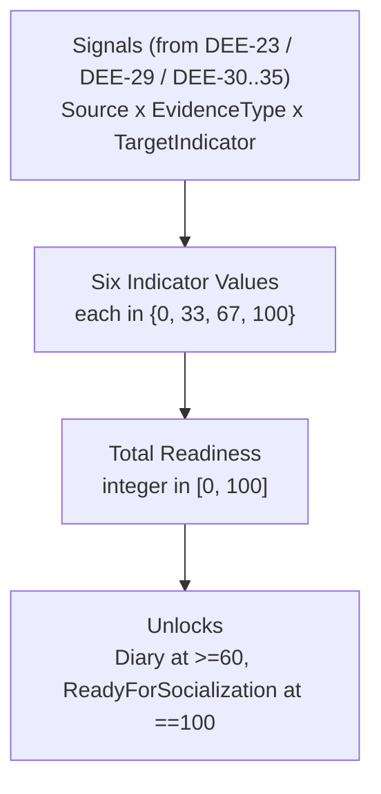

# WAIA AI-Twin v1 — Readiness Model

**Status:** Source of Truth for the AI-Twin v1 readiness scoring model.

This document is the canonical, system-level definition of how the six readiness indicators are scored, how they aggregate into Total Readiness, and where the unlock thresholds for Diary and Society sit. All `ai`, `backend`, `frontend`, and `product` tasks consume this document as the single source of truth for the readiness mechanic. Conflicts with downstream issues are resolved here first, then propagated.

This document refines Section 5 ("Readiness Model — Observable Rules Only") of [docs/product/ai-twin-user-flow.md](ai-twin-user-flow.md). It does not redefine any concept that already exists upstream; it references the upstream definition.

## 1. Header / Metadata

| Field | Value |
| --- | --- |
| Issue | [DEE-22](https://linear.app/deepsense/issue/DEE-22/16-define-ai-twin-readiness-model) — 16 Define AI-Twin readiness model |
| Project | WAIA |
| Milestone | WAIA MVP 1.0 |
| Team | DeepSense (DEE) |
| Execution label | `ai` |
| Document type | AI specification (no code, no UI design, no API contracts, no prompt design) |
| Document path | `docs/product/ai-twin-readiness-model.md` |
| Predecessor snapshot | `.cursor/plans/2026-05-03-waia-readiness-model.md` (kept unchanged for traceability) |
| Upstream source of truth | [docs/product/ai-twin-user-flow.md](ai-twin-user-flow.md) (DEE-7) |
| Date | 2026-05-03 |
| Owner | Cursor agent with Linear execution label `ai` |

## 2. Purpose

WAIA AI-Twin v1 unlocks Diary mode at Total Readiness `>= 60%` and exposes the Socialization action when Total Readiness reaches `100%`. To make those unlocks deterministic across `ai`, `backend`, and `frontend`, the readiness mechanic must be defined once, with explicit per-indicator scoring rules, an explicit aggregation formula, and explicit boundary semantics, before any prompt, service, or UI is implemented.

This document defines:

- the discrete stages each indicator can occupy and the integer percentages that represent them,
- the abstract evidence types (Declaration, Corroboration, Behavioral Anchor) that advance an indicator from one stage to the next,
- the deterministic mapping from a vector of six indicator values to Total Readiness,
- the precise meaning of the boundary integers `0`, `33`, `34`, `66`, `67`, `100`,
- the unlock thresholds at `60%` and `100%`,
- the monotonicity contract and the contradiction-handling reference.

The AI-Twin engine architecture (DEE-36), the readiness service (DEE-37), the per-indicator extraction prompts (DEE-30..DEE-35), and the contradiction handler (DEE-29) all consume this document and refine specific slices of it. Nothing in this document substitutes for those issues.

## 3. Scope and Non-scope

### 3.1 Scope (verbatim from DEE-22)

- Values, Behavior, Thinking, Emotions, Interests, Goals.
- Per-indicator scoring rules.
- Total completion rule.
- Thresholds for 60% and 100%.

### 3.2 Non-scope (verbatim from DEE-22 "Do NOT")

- Build the UI.
- Implement backend services.

### 3.3 Additional self-imposed boundaries

- No prompts. Concrete extraction prompts and per-indicator question protocols are owned by `ai` (DEE-23 for the psychological contract, DEE-30..DEE-35 for the six indicator-specific prompts).
- No persistence schema. The shape of the stored indicator state is owned by `backend` (DEE-37 readiness service, DEE-25 user state, DEE-27 memory).
- No UI copy, no readiness card visuals, no progress-bar transitions. These are owned by `design` and `frontend` (DEE-13, DEE-14, DEE-21).
- No contradiction-detection logic. Contradictions are owned by DEE-29; this document only states how a contradiction-rejected contribution affects scoring.
- No code in `app/`, `components/`, `lib/`, or anywhere else in the repo.

## 4. Glossary

This glossary is local to the readiness model. Any term already defined in [docs/product/ai-twin-user-flow.md §4](ai-twin-user-flow.md) is referenced, not redefined.

| Term | Meaning in this document |
| --- | --- |
| **Indicator** | One of the six readiness dimensions defined upstream: Values, Behavior, Thinking, Emotions, Interests, Goals. |
| **Indicator Value** | The current integer percentage of one Indicator, drawn from the discrete set `{0, 33, 67, 100}`. See §6.1. |
| **Stage** | A named position an Indicator occupies. Four stages exist: `Empty`, `Initiated`, `Established`, `Confirmed`. Each stage maps to exactly one Indicator Value. See §6.1. |
| **Signal** | A discrete piece of observable evidence about the user, derived by `ai` from a single source. A Signal has a Source, an Evidence Type, and a Target Indicator. |
| **Source** | The origin of a Signal. MVP recognises two Sources: `Twin dialogue` (Step 4 of the user flow) and `Diary entry` (Step 7). Both are first-class for the readiness mechanic. |
| **Evidence Type** | The role a Signal plays in advancing an Indicator. Three Evidence Types exist: `Declaration`, `Corroboration`, `Behavioral Anchor`. See §6.2. |
| **Target Indicator** | The single Indicator a Signal applies to. A Signal applies to exactly one Indicator at a time; the same conversational turn or diary entry may produce multiple Signals targeting different Indicators. |
| **Qualifying Signal** | A Signal that has not been rejected by DEE-29 (contradiction handler) and that satisfies the Evidence Type's eligibility rule for the Indicator's current Stage. Only Qualifying Signals advance Indicators. |
| **Total Readiness** | A single derived integer percentage in `[0, 100]`, computed from the vector of six Indicator Values via §7. |
| **Threshold** | An integer percentage at which a downstream effect is triggered when Total Readiness crosses it. MVP defines two: `60%` (Diary unlock) and `100%` (ReadyForSocialization). |
| **Boundary** | One of the six integer percentages explicitly named by DEE-22's acceptance criterion: `0`, `33`, `34`, `66`, `67`, `100`. Each Boundary is given a precise meaning in §6 and §7. |
| **Monotonicity contract** | The rule that Indicator Values and Total Readiness are non-decreasing within MVP. See §8. |

## 5. Layout Overview



The mechanic has exactly three deterministic layers. Each layer is fully specified by the sections below.

## 6. Per-Indicator Scoring

### 6.1 Stages and Indicator Values

Every Indicator occupies exactly one of four Stages at any time. Each Stage maps to exactly one Indicator Value:

| Stage | Indicator Value | Meaning |
| --- | --- | --- |
| `Empty` | `0` | No Qualifying Signal has yet been recorded for this Indicator. |
| `Initiated` | `33` | The user has produced one Qualifying Signal of type `Declaration` for this Indicator. |
| `Established` | `67` | The user has produced one Qualifying `Declaration` and one Qualifying `Corroboration` for this Indicator. |
| `Confirmed` | `100` | The user has produced one Qualifying `Declaration`, one Qualifying `Corroboration`, and one Qualifying `Behavioral Anchor` for this Indicator. |

The set of permissible Indicator Values is exactly `{0, 33, 67, 100}`. No Indicator may be stored at any other value, and no Indicator may skip a Stage: advancement is strictly `Empty -> Initiated -> Established -> Confirmed`.

### 6.2 Evidence Types

| Evidence Type | What it is | Eligibility rule (relative to current Stage) |
| --- | --- | --- |
| `Declaration` | A first-person statement by the user about the Target Indicator (a self-described value, behavior, thought pattern, emotion, interest, or goal). | Counted toward advancement only when the current Stage is `Empty`. After `Initiated` is reached, additional Declarations are recorded as memory but do not advance the Stage by themselves. |
| `Corroboration` | A second, independent first-person statement that aligns with the existing `Declaration` for the same Indicator (independence is the absence of overlap with the original Declaration's content; same-session restatements do not count). | Counted toward advancement only when the current Stage is `Initiated`. |
| `Behavioral Anchor` | A concrete, situational example provided by the user that shows the declared Indicator content in action (a recounted event, decision, or behavior — eligible from either Source). | Counted toward advancement only when the current Stage is `Established`. |

Independence (for `Corroboration`) and concrete situationality (for `Behavioral Anchor`) are content-level properties owned by the per-indicator extraction prompts (DEE-30..DEE-35). This document only specifies that the property must be present for the Signal to qualify at the indicated Stage.

### 6.3 Source equivalence and the diary preference

For the scoring mechanic, both Sources are first-class:

- A Qualifying Signal originated from `Twin dialogue` and a Qualifying Signal originated from `Diary entry` carry the **same scoring weight** at every Stage.
- A diary entry is **not required** to reach any Stage. An Indicator can reach `Confirmed` (`100`) using `Twin dialogue` Signals alone, consistent with the Diary-is-optional contract in [user-flow §5.3](ai-twin-user-flow.md).

The diary's privileged role (per upstream §5.3) is honoured at the AI-Twin engine level, not at the readiness scoring level: when both Sources are available, DEE-30..DEE-35 prefer to source `Behavioral Anchor` Signals from `Diary entry` for the `Behavior` and `Emotions` Indicators because diary is a higher-fidelity behavioral memory channel. That preference does not change Indicator Values or Total Readiness; it changes which Signal an extractor selects when both are eligible.

### 6.4 Advancement rules

Each Qualifying Signal advances its Target Indicator by exactly one Stage when its Evidence Type matches the eligibility rule for the current Stage (§6.2). All other Signals are recorded by the engine but do not change the Indicator Value.

| Current Stage | Required next Evidence Type | Resulting Stage | Resulting Indicator Value |
| --- | --- | --- | --- |
| `Empty` | `Declaration` | `Initiated` | `33` |
| `Initiated` | `Corroboration` | `Established` | `67` |
| `Established` | `Behavioral Anchor` | `Confirmed` | `100` |
| `Confirmed` | (terminal Stage) | `Confirmed` | `100` |

Once `Confirmed`, the Indicator does not move. Additional Signals targeting a `Confirmed` Indicator are recorded as memory and may inform AI-Twin behavior, but they do not change the Indicator Value.

### 6.5 Boundary semantics for `0`, `33`, `34`, `66`, `67`, `100`

The six Boundaries named in DEE-22's acceptance criterion are given the following precise meaning at the per-Indicator level:

| Boundary | Meaning at Indicator level |
| --- | --- |
| `0` | The exact Indicator Value of an `Empty` Indicator. Lower bound of the permissible set. |
| `33` | The exact Indicator Value of an `Initiated` Indicator. Upper bound of the `Empty` half-space (the Indicator stops being `Empty` at this Value). |
| `34` | The lower bound of the `Established` half-space at the **continuous** level. No Indicator is ever stored at `34`: a Signal that triggers advancement from `Initiated` jumps the Indicator from `33` directly to `67`. The `34` Boundary defines the strictly-greater-than-`33` half-line and is used only to disambiguate inclusive/exclusive intervals. |
| `66` | The upper bound of the `Established` half-space at the continuous level. No Indicator is stored at `66` for the same reason as `34`. |
| `67` | The exact Indicator Value of an `Established` Indicator. Lower bound of the `Established`/`Confirmed` half-line that opens the path to `100`. |
| `100` | The exact Indicator Value of a `Confirmed` Indicator. Upper bound of the permissible set; cannot be exceeded. |

In short: `{0, 33, 67, 100}` are the **storage values**; `{34, 66}` are the **disambiguation values** that fix the inclusive/exclusive semantics of the half-spaces between Stages and are never written to storage.

## 7. Total Readiness

### 7.1 Formula

Let `V = (V_Values, V_Behavior, V_Thinking, V_Emotions, V_Interests, V_Goals)` be the current vector of Indicator Values, with each `V_i` drawn from `{0, 33, 67, 100}`.

```
TotalReadiness = floor( ( V_Values + V_Behavior + V_Thinking + V_Emotions + V_Interests + V_Goals ) / 6 )
```

`floor` is integer floor (truncation toward zero, identical to integer division for non-negative inputs).

### 7.2 Range and cap

- The minimum Total Readiness is `0` (vector `(0, 0, 0, 0, 0, 0)`).
- The maximum Total Readiness is `100` (vector `(100, 100, 100, 100, 100, 100)`).
- Total Readiness is, by construction, an integer in the closed interval `[0, 100]`. The upstream cap from [user-flow §5.2](ai-twin-user-flow.md) is satisfied automatically; no separate clamping step is required.

### 7.3 Thresholds (the unlock contract)

| Threshold | Condition on Total Readiness | Resulting unlock |
| --- | --- | --- |
| Diary unlock | `TotalReadiness >= 60` | Diary mode becomes enterable per [user-flow §5.4](ai-twin-user-flow.md). |
| ReadyForSocialization | `TotalReadiness == 100` | The user enters the `ReadyForSocialization` state per [user-flow §8](ai-twin-user-flow.md), and the Socialization action becomes available in Twin mode. |

Thresholds are evaluated **only** on Total Readiness. Individual Indicator Values never trigger a Threshold; Diary unlock cannot be earned by maxing out one Indicator while leaving others empty.

### 7.4 Boundary semantics for `0`, `33`, `34`, `66`, `67`, `100` at the Total level

At the aggregate level, the same six Boundaries have the following meaning:

| Boundary | Meaning at Total Readiness level |
| --- | --- |
| `0` | Total Readiness floor. Achievable only at vector `(0, 0, 0, 0, 0, 0)`. |
| `33` | Total Readiness reached when all six Indicators are `Initiated`. Below the Diary Threshold; no unlock. |
| `34` | Strictly above `33`. Mathematically reachable only by mixed vectors (e.g. five Indicators at `33` and one at `67` yields `floor(232/6) = 38`); the explicit Boundary `34` confirms that any Total Readiness in the half-open interval `[34, 59]` is below the Diary Threshold and produces no unlock. |
| `66` | Strictly below `67`. Confirms that `TotalReadiness` values in the range `[60, 66]` already satisfy the Diary Threshold, while values in the range `[34, 59]` do not. The boundary clarifies that the Diary Threshold uses `>= 60`, not `>= 67`. |
| `67` | The Indicator-Value-`Established` line, mirrored at the aggregate level. Achievable e.g. when all six Indicators are `Established` (`floor(402/6) = 67`). Above the Diary Threshold; below the ReadyForSocialization Threshold. |
| `100` | The ReadyForSocialization Threshold. Achievable **only** when every Indicator is `Confirmed`. There is no partial path to `100`. |

The combined effect of §6.5 and §7.4 is that all six DEE-22 Boundaries — `0`, `33`, `34`, `66`, `67`, `100` — have a unique, observable meaning at both the per-Indicator and the aggregate level.

## 8. Monotonicity and Contradiction Handling

### 8.1 Monotonicity contract

- Each Indicator Value is non-decreasing within MVP. Once an Indicator reaches a Stage, it cannot return to a lower Stage. There is no decay, no penalty, and no reset path inside the readiness mechanic.
- Total Readiness is non-decreasing within MVP, by direct consequence of the formula in §7.1 over non-decreasing inputs.
- A new Qualifying Signal can only advance an Indicator (or be recorded as memory without effect). No Signal may lower an Indicator Value. Any operation that would lower an Indicator Value is undefined behavior at the model level and must be rejected by the readiness service (DEE-37).

### 8.2 Contradictions

- Contradiction detection is owned by [DEE-29](https://linear.app/deepsense/issue/DEE-29). A Signal flagged as contradictory by DEE-29 is **not** a Qualifying Signal: it does not advance the Target Indicator and does not change Total Readiness.
- A contradictory Signal does **not** lower an existing Stage. The contradiction handler may re-prompt or re-engage the user via DEE-23/DEE-30..DEE-35; only when a subsequent non-contradictory Qualifying Signal is produced does the Indicator advance.

## 9. Worked Examples

All examples are computed strictly from §6 and §7. Indicator order in the vector is `(Values, Behavior, Thinking, Emotions, Interests, Goals)`.

### 9.1 Example A — All Indicators `Initiated`

- Vector: `(33, 33, 33, 33, 33, 33)`.
- Sum: `198`.
- `TotalReadiness = floor(198 / 6) = 33`.
- Diary Threshold (`>= 60`): not met. ReadyForSocialization (`== 100`): not met.
- No unlock fires. The user remains in Twin mode without Diary access.

### 9.2 Example B — Crossing the Diary Threshold

- Vector before: `(67, 67, 67, 33, 33, 33)`. Sum: `300`. `TotalReadiness = floor(300 / 6) = 50`. Diary not yet unlocked.
- A Qualifying `Corroboration` arrives for `Emotions`, advancing it from `33` to `67`.
- Vector after: `(67, 67, 67, 67, 33, 33)`. Sum: `334`. `TotalReadiness = floor(334 / 6) = 55`. Still no Diary unlock; the threshold is `>= 60`, not `>= 50`.
- A subsequent Qualifying `Corroboration` arrives for `Interests`, advancing it from `33` to `67`.
- Vector after: `(67, 67, 67, 67, 67, 33)`. Sum: `368`. `TotalReadiness = floor(368 / 6) = 61`. Diary Threshold met for the first time. Diary mode becomes enterable per §7.3.
- ReadyForSocialization is not yet reached (`61 != 100`).

### 9.3 Example C — Reaching ReadyForSocialization

- Vector: `(100, 100, 100, 100, 100, 100)`. Every Indicator is `Confirmed`.
- Sum: `600`. `TotalReadiness = floor(600 / 6) = 100`.
- Diary Threshold met (long since). ReadyForSocialization Threshold met for the first time. The user enters `ReadyForSocialization` per [user-flow §8](ai-twin-user-flow.md) and the Socialization action is exposed in Twin mode.
- A vector such as `(100, 100, 100, 100, 100, 67)` yields `TotalReadiness = floor(567 / 6) = 94`, which **does not** trigger ReadyForSocialization. There is no path to `100` other than every Indicator at `Confirmed`.

### 9.4 Example D — Contradiction does not lower the Indicator

- Current vector: `(67, 67, 67, 67, 67, 67)`. `TotalReadiness = 67`. Diary unlocked.
- A new Signal for `Values` is flagged as contradictory by DEE-29.
- The Signal is **not** a Qualifying Signal (§8.2). Vector and Total Readiness do not change.
- Contradiction handling re-engages the user via DEE-23/DEE-30. A subsequent Qualifying `Behavioral Anchor` for `Values` advances it from `67` to `100`. Vector becomes `(100, 67, 67, 67, 67, 67)`. `TotalReadiness = floor(435 / 6) = 72`.

## 10. Cross-issue Handoff Map

The following Linear issues consume this contract or own the slices it intentionally leaves out.

| Slice consumed or refined | Issue | Refines |
| --- | --- | --- |
| Psychological contract prompt that produces the first `Declaration` Signals | [DEE-23](https://linear.app/deepsense/issue/DEE-23) | Prompt protocol that yields the initial Declarations on which §6 depends. |
| Per-indicator extraction prompts (Values, Behavior, Thinking, Emotions, Interests, Goals) | [DEE-30](https://linear.app/deepsense/issue/DEE-30), [DEE-31](https://linear.app/deepsense/issue/DEE-31), [DEE-32](https://linear.app/deepsense/issue/DEE-32), [DEE-33](https://linear.app/deepsense/issue/DEE-33), [DEE-34](https://linear.app/deepsense/issue/DEE-34), [DEE-35](https://linear.app/deepsense/issue/DEE-35) | Concrete content rules for when a turn or diary entry yields each Evidence Type for the corresponding Indicator. |
| Contradiction handler | [DEE-29](https://linear.app/deepsense/issue/DEE-29) | Determines whether a Signal is rejected (and therefore not Qualifying) per §8.2. |
| Memory writeback of Signals into AI-Twin behavioral memory | [DEE-17](https://linear.app/deepsense/issue/DEE-17) | Persistence and retrieval of Signals after they have or have not advanced an Indicator. |
| Diary contract (Source `Diary entry`) | [DEE-18](https://linear.app/deepsense/issue/DEE-18), [DEE-47](https://linear.app/deepsense/issue/DEE-47) | Intake contract for diary entries that produce Signals; defines what counts as a single entry. |
| AI-Twin orchestrator | [DEE-24](https://linear.app/deepsense/issue/DEE-24) | Routes user input through DEE-23/DEE-29/DEE-30..DEE-35 and emits Signals to the readiness service. |
| AI-Twin engine architecture boundaries | [DEE-36](https://linear.app/deepsense/issue/DEE-36) | Component boundaries between extractor, contradiction handler, readiness service, and memory. |
| Readiness service implementation | [DEE-37](https://linear.app/deepsense/issue/DEE-37) | Backend service that stores Indicator Values, applies §6.4 advancement, computes §7.1 Total Readiness, and emits Threshold-crossing events. |
| Diary UI surfacing of indicators (Diary's effect on indicators) | [DEE-44](https://linear.app/deepsense/issue/DEE-44), [DEE-45](https://linear.app/deepsense/issue/DEE-45) | Analytics and visualization layers that read Indicator Values without recomputing them. |
| Indicator-aware UI in Diary mode | [DEE-46](https://linear.app/deepsense/issue/DEE-46) | Diary-side surfacing of which Indicator a diary entry contributed to. |
| Dashboard rendering of Indicator Values and Total Readiness | [DEE-13](https://linear.app/deepsense/issue/DEE-13), [DEE-14](https://linear.app/deepsense/issue/DEE-14), [DEE-21](https://linear.app/deepsense/issue/DEE-21) | UI presentation of the values produced here. Owns no formula. |

If a downstream issue contradicts this document, the resolution is to update DEE-22 (and this file) first, then the downstream issue. This document remains the single source of truth for the readiness mechanic.

## 11. Acceptance Criteria Checklist

| DEE-22 Acceptance Criterion | Satisfied where | Status |
| --- | --- | --- |
| Each indicator has explicit scoring rules. | Section 6 (Stages, Evidence Types, advancement rules) defines the same rule shape uniformly for all six Indicators; §6.3 confirms that the rules are Indicator-agnostic at the model layer and per-Indicator content is owned by DEE-30..DEE-35. | Met |
| Total completion is unambiguous. | Section 7.1 gives one explicit formula `floor( sum(V_i) / 6 )`; §7.2 confirms range `[0, 100]` and the cap; §7.3 fixes the two unlock thresholds. | Met |
| Threshold boundaries for 0, 33, 34, 66, 67, and 100 are defined. | Section 6.5 defines all six Boundaries at the per-Indicator level; §7.4 defines the same six Boundaries at the Total Readiness level. | Met |
| The output can be implemented without additional readiness questions. | Sections 6, 7, and 8 are sufficient for DEE-37 to implement the readiness service, and §10 maps every other slice (prompts, contradictions, memory, UI) to a downstream issue without leaving open questions inside the model. | Met |
