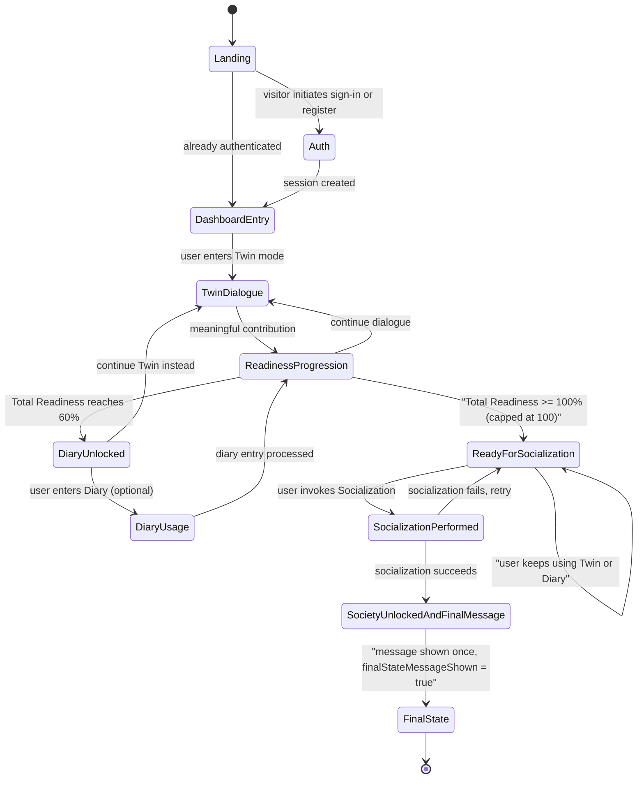

# WAIA AI-Twin v1 — User Flow

**Status:** Product Source of Truth for AI-Twin v1 user flow.

This document is the canonical, system-level definition of the AI-Twin v1 MVP user flow. All frontend, backend, and AI tasks consume this document as the single source of truth. Conflicts with downstream issues are resolved here first, then propagated.

## 1. Header / Metadata

| Field | Value |
| --- | --- |
| Issue | [DEE-7](https://linear.app/deepsense/issue/DEE-7/01-define-ai-twin-mvp-user-flow) — 01 Define AI-Twin MVP user flow |
| Project | WAIA |
| Milestone | WAIA MVP 1.0 |
| Team | DeepSense (DEE) |
| Execution label | `product` |
| Document type | Product specification (no code, no UI design, no API contracts, no AI logic) |
| Document path | `docs/product/ai-twin-user-flow.md` |
| Predecessor snapshot | `.cursor/plans/2026-05-03-waia-mvp-user-flow.md` (kept unchanged for traceability) |
| Date | 2026-05-03 |
| Owner | Cursor agent with Linear execution label `product` |

## 2. Purpose

WAIA AI-Twin v1 is a guided process that turns a new visitor into a user with a fully formed personal AI-Twin that participates in the AI-Twin social network. To make that process implementable without contradictions across the frontend, backend, and AI workstreams, the user flow must be defined once, in product terms, before any UI, backend, or AI work begins.

This document defines:

- the ordered MVP steps from Landing to the final post-socialization state,
- the trigger, result, and next state of each step,
- the unlock thresholds that gate Diary and Society modes,
- the named conceptual states a user can occupy,
- the privacy boundary between Diary and Society,
- the observable final state of an AI-Twin v1 user.

Every blocked downstream Linear issue (see Section 9) refines exactly one slice of this flow. Nothing in this document substitutes for those issues.

## 3. Scope and Non-scope

### 3.1 Scope (verbatim from DEE-7)

- Landing -> Auth -> Dashboard -> AI-Twin dialogue -> readiness progression -> Diary unlock -> Society unlock -> final 100% state.
- Entry and exit condition for each step.
- Final state message trigger.

### 3.2 Non-scope (verbatim from DEE-7 "Do NOT")

- Design UI components.
- Define API payloads.
- Implement AI logic.

### 3.3 Additional self-imposed boundaries

- No prompt design, no readiness scoring formula, no schema, no copy.
- No code in `app/`, `components/`, `lib/`, or anywhere else in the repo.
- No description of Business, AI-Trader, or AI-Marketplace flows. Those are different WAIA modules and out of scope for AI-Twin v1.

## 4. Glossary

| Term | Meaning in this document |
| --- | --- |
| **AI-Twin** | A structured digital personality model of one user, built through dialogue and diary, scored along six readiness indicators. |
| **Readiness indicator** | One of six product-defined dimensions: **Values, Behavior, Thinking, Emotions, Interests, Goals**. Each indicator has an observable progress between 0% and 100%. |
| **Total Readiness** | A single derived value in `[0%, 100%]`, aggregated from the six readiness indicators. The aggregation rule is owned by DEE-22. Total Readiness is capped at 100% and must never exceed 100%. |
| **Mode** | A top-level workspace in the dashboard. Three modes exist in MVP: **Twin**, **Diary**, **Society**. |
| **Locked mode** | A mode visible in the dashboard but not enterable until its unlock condition is satisfied. |
| **Twin mode** | The default active mode. Hosts the AI-Twin creation dialogue. |
| **Diary mode** | An optional behavioral and emotional input mode, available once Total Readiness reaches the Diary threshold. |
| **Society mode** | A view of the AI-Twin social network; available only after the user has performed the Socialization action. |
| **Socialization action** | A single user-initiated action exposed to a user in the **ReadyForSocialization** state. It is the only way to launch the AI-Twin into the social network in MVP. |
| **ReadyForSocialization** | A named conceptual state of the user: Total Readiness `>= 100%` (capped at 100%) **and** the Socialization action has not yet been performed. The Socialization action is exposed exactly while the user is in this state. |
| **Final-state message** | A system message confirming that the AI-Twin is fully formed and active in the social network. It is shown exactly once per user, immediately after the Socialization action completes successfully. |
| **`finalStateMessageShown`** | A persisted per-user flag that records whether the Final-state message has already been shown. Persistence outlives reload, navigation, logout, and new sessions. (Persistence layer is out of scope here; the contract is owned by the relevant backend issue.) |
| **Final state** | The steady-state condition of an AI-Twin v1 user after socialization: Twin enterable, Diary enterable, Society enterable, AI-Twin live in the social network. |

## 5. Readiness Model — Observable Rules Only

This document specifies only the observable rules that gate the user flow. The mathematical aggregation, scoring of individual messages, and persistence model are owned by DEE-22 and DEE-36.

### 5.1 Indicators

- Six indicators: Values, Behavior, Thinking, Emotions, Interests, Goals.
- Each indicator has a value in the closed interval `[0%, 100%]`.
- Indicators move only forward in MVP (no decay).

### 5.2 Total Readiness

- Total Readiness is a single derived value in `[0%, 100%]`.
- Total Readiness is computed from the six indicators; the formula is **out of scope** for this document.
- Total Readiness is monotonically non-decreasing within MVP.
- **Total Readiness is capped at 100% and must never exceed 100%.** Any contribution that would push it above 100% is clamped to 100%.

### 5.3 Diary positioning

- **Diary is optional in MVP.** The user is never required to write a diary entry to advance the flow.
- An AI-Twin can reach Total Readiness `100%` and complete Socialization through Twin-mode dialogue alone.
- Diary is the **preferred behavioral memory input channel**: when present, diary entries provide a richer, more personal input to the AI-Twin's behavioral memory than dialogue alone.
- The relative weight of diary versus dialogue contributions to readiness is owned by DEE-22.

### 5.4 Unlock conditions

| Unlock | Condition | Effect |
| --- | --- | --- |
| **Diary unlock** | Total Readiness `>= 60%` | Diary mode becomes enterable. |
| **Socialization action available** | Total Readiness `>= 100%` (capped at 100) **and** Socialization not yet performed (i.e. user is in `ReadyForSocialization`) | Socialization action is exposed to the user in Twin mode. |
| **Society unlock** | Socialization action has been performed successfully by the user | Society mode becomes enterable; Final-state message is shown exactly once and `finalStateMessageShown` is set to true. |

Reaching `100%` Total Readiness alone **never** unlocks Society. Only the act of performing Socialization unlocks Society.

## 6. Step-by-Step Flow

Every step uses the same four sub-headings: **Trigger**, **Result**, **Next state**, **Edge cases**. Steps are ordered; a user cannot reach step `N+1` without satisfying step `N`'s exit condition, except where explicitly stated.

### Step 1 — Landing

- **Trigger:** A visitor opens the WAIA web entry point (root URL).
- **Result:** The visitor sees the WAIA landing surface and can either sign in or register.
- **Next state:** Visitor proceeds to Step 2 (Auth) by initiating sign-in or registration.
- **Edge cases:**
  - Already-authenticated visitor: skip Step 2 and go directly to Step 3 (Dashboard entry).
  - Visitor leaves without acting: no state change; flow does not begin.

### Step 2 — Auth (login or register)

- **Trigger:** Visitor initiates login or registration from Step 1.
- **Result:** Visitor's identity is established and a session is created.
  - First-time identity: a new user account exists.
  - Returning identity: an existing user account is recognised.
- **Next state:** User is redirected to Step 3 (Dashboard entry).
- **Edge cases:**
  - Authentication failure: user remains in Step 2 until success or abandonment; flow does not advance.
  - Session expiry mid-flow at any later step: user is returned to Step 2; on success, user re-enters at the dashboard step.

### Step 3 — Dashboard entry (Twin mode default)

- **Trigger:** Successful authentication from Step 2.
- **Result:** The personal dashboard is shown. The dashboard exposes:
  - the avatar placeholder area,
  - the six readiness indicators,
  - the three modes — **Twin** (active), **Diary** (locked), **Society** (locked),
  - the Twin-mode dialogue surface as the active workspace.
- **Next state:** User proceeds to Step 4 (AI-Twin dialogue) by interacting with the Twin-mode dialogue. No other mode is enterable.
- **Edge cases:**
  - Returning user with non-zero readiness: dashboard reflects current indicator values; the locked/unlocked status of Diary and Society is computed from the current Total Readiness and prior socialization status, not reset.
  - Returning user already in `ReadyForSocialization`: the Socialization action is presented (see Step 8).
  - Returning user already in the final state (Step 11): all three modes are enterable; the user is not forced back through earlier steps and the Final-state message is not re-shown (`finalStateMessageShown = true` persists).

### Step 4 — AI-Twin dialogue in Twin mode

- **Trigger:** User sends or receives a message in Twin mode for the first time after Step 3.
- **Result:** A continuous dialogue session is established between the user and the AI-Twin creation system. The dialogue feels conversational, not form-like.
- **Next state:** User remains in Step 4 throughout the AI-Twin creation lifecycle. Each meaningful exchange contributes to Step 5 (Readiness progression). Step 4 is the substrate that drives every later unlock.
- **Edge cases:**
  - User stops mid-dialogue: state is preserved; the next session resumes from current readiness.
  - User opens Twin mode but does not engage: no readiness change; flow stays at Step 4 with no progress.

### Step 5 — Readiness progression (continuous)

- **Trigger:** A meaningful contribution from the user is processed (dialogue from Step 4, or, after Step 6, optional diary input from Step 7).
- **Result:**
  - One or more of the six indicators may increase.
  - Total Readiness is recomputed and clamped to the `[0%, 100%]` interval (see §5.2).
  - The dashboard's readiness display reflects the new values.
- **Next state:** Step 5 is continuous and concurrent with Steps 4 and 7. It exits to Step 6 the first time Total Readiness crosses the Diary threshold, and to Step 8 the first time Total Readiness reaches `>= 100%`.
- **Edge cases:**
  - No new information in a contribution: indicators may not change; this is normal.
  - Contradictions in user input: detection and handling are owned by DEE-29; this document only states that a contribution may, depending on those rules, fail to advance readiness.
  - Total Readiness already at `100%`: subsequent contributions do not exceed `100%`; they may still be processed for behavioral memory but have no readiness effect.

### Step 6 — Diary unlock at 60%

- **Trigger:** Total Readiness becomes `>= 60%` for the first time.
- **Result:**
  - Diary mode becomes enterable for the user.
  - The dashboard reflects the unlock visibly (no specific UI is mandated here).
- **Next state:** User may proceed to Step 7 (optional Diary usage) at will, while continuing Step 4 and Step 5. Diary becoming enterable does not block, pause, or replace Twin-mode dialogue.
- **Edge cases:**
  - Total Readiness re-evaluated below 60%: not possible in MVP, since readiness is monotonically non-decreasing. Once unlocked, Diary remains unlocked.
  - User never enters Diary: flow can still progress to `100%` and on to Step 8 via Twin-mode dialogue alone (Diary is optional, see §5.3).

### Step 7 — Diary usage as behavioral memory input (optional)

- **Trigger:** User enters Diary mode (only available after Step 6) and creates a diary entry.
- **Result:**
  - The diary entry is captured as an additional observable input that may contribute to Step 5.
  - The diary entry becomes part of the AI-Twin's behavioral memory.
  - **Privacy boundary applies (see §8):** raw diary entries are private and are not exposed in Society mode at any point.
- **Next state:** User can return to Twin mode, continue Diary, or alternate. Step 5 continues to operate.
- **Edge cases:**
  - User writes diary entries before reaching `100%`: allowed; their effect on readiness follows Step 5.
  - User never writes a diary entry after unlock: the absence of diary input does not block Step 8. Behavioral memory will simply be lighter when the AI-Twin acts in Society.

### Step 8 — ReadyForSocialization (Socialization action available at >= 100%)

- **Trigger:** Total Readiness reaches `>= 100%` (capped at `100%`) for the first time.
- **Result:**
  - The user enters the **`ReadyForSocialization`** state (see Glossary).
  - The Socialization action becomes available to the user inside Twin mode.
  - Society mode remains **not yet enterable**; only the action is exposed.
- **Next state:** User must perform the Socialization action (Step 9) to advance. While in `ReadyForSocialization`, the user can continue Twin and Diary freely; nothing forces immediate action.
- **Edge cases:**
  - User never performs Socialization: the user remains in `ReadyForSocialization` indefinitely. Society mode does not unlock on time alone.
  - Returning user already in `ReadyForSocialization`: the Socialization action is presented again on dashboard entry until performed.
  - Total Readiness was already at `100%` and remains at `100%`: the user stays in `ReadyForSocialization` (no change).

### Step 9 — User performs Socialization

- **Trigger:** User invokes the Socialization action presented in Step 8.
- **Result:**
  - The AI-Twin is launched into the AI-Twin social network.
  - The user transitions out of `ReadyForSocialization` toward Step 10.
- **Next state:** Immediately enters Step 10 (Society unlock + final-state message).
- **Edge cases:**
  - Socialization fails for any operational reason: user remains in `ReadyForSocialization` and may retry. The flow does not skip ahead.
  - Socialization is invoked twice: only the first successful invocation has effect; subsequent invocations are no-ops at the flow level.

### Step 10 — Society unlocks + final-state confirmation message

- **Trigger:** Successful completion of the Socialization action in Step 9.
- **Result:**
  - Society mode becomes enterable.
  - The **Final-state message** is shown exactly once to the user, confirming that the AI-Twin is fully formed and active in the social network.
  - The system persists the per-user flag **`finalStateMessageShown = true`**. This persistence outlives reload, logout, and new sessions, so the message must not reappear later under any circumstance.
  - The user can now enter Society mode (see §8 Privacy boundaries for what Society may and may not show).
- **Next state:** User enters Step 11 (Final state).
- **Edge cases:**
  - User dismisses the message: `finalStateMessageShown` is already `true`; the message is not re-shown on any subsequent session.
  - User reloads or starts a new session immediately after: the persisted flag is honoured; no re-show.
  - User enters Society immediately vs. later: identical effect; Society remains unlocked.

### Step 11 — Final state (steady-state observable)

- **Trigger:** Step 10 has completed for this user.
- **Result:** The user is in the AI-Twin v1 final state, with the following observable conditions all simultaneously true:
  - Total Readiness `= 100%` (capped).
  - Twin mode is enterable; AI-Twin dialogue is preserved.
  - Diary mode is enterable.
  - Society mode is enterable.
  - The AI-Twin is active in the AI-Twin social network.
  - The Socialization action is no longer presented.
  - `finalStateMessageShown = true`.
- **Next state:** Final state is a stable terminal state for AI-Twin v1. There is no Step 12 in MVP scope. Further evolution (additional indicators, Business module integration, AI-Trader, AI-Marketplace) is explicitly out of scope here.
- **Edge cases:**
  - User starts a new session in the final state: dashboard loads directly into Step 11 conditions; the user is not asked to re-socialize and the Final-state message is not re-shown.
  - User continues Twin or Diary in final state: allowed; readiness cannot exceed `100%` and Society remains live.

## 7. State Diagram

## 8. Privacy Boundaries (CRITICAL)

This boundary is a system-level rule. It binds backend, AI, and frontend equally.

- **Raw diary entries must never be exposed in Society mode.** Under no condition may another user, the social feed, recommendations, reports, or any Society surface display the literal content of a user's diary entry.
- Society mode may use **only derived AI-Twin behavior and outputs** — i.e. data produced by the AI-Twin acting on the user's behalf, including derived behavioral signals computed from diary entries. The diary text itself is private.
- Persistence and access boundaries that enforce this rule are owned by the corresponding backend and AI issues; this document defines the contract those issues must honour.

## 9. Cross-issue Handoff Map

The following downstream Linear issues are blocked by DEE-7 and refine slices of this flow. Each item lists the slice it owns; this document does not encroach on those slices.

| Slice of the flow | Issue | Refines |
| --- | --- | --- |
| Step 1 — Landing | [DEE-8](https://linear.app/deepsense/issue/DEE-8) | Landing page content and state map |
| Step 2 — Auth | [DEE-10](https://linear.app/deepsense/issue/DEE-10) | Email auth implementation with session redirect |
| Step 3 — Dashboard entry | [DEE-13](https://linear.app/deepsense/issue/DEE-13) | Dashboard shell content and states |
| Step 4 — Twin dialogue modes | [DEE-20](https://linear.app/deepsense/issue/DEE-20) | v1 dialogue modes for twin training |
| Step 4 — Psychological contract | [DEE-23](https://linear.app/deepsense/issue/DEE-23) | Psychological contract prompt and response contract |
| Step 5 — Readiness model | [DEE-22](https://linear.app/deepsense/issue/DEE-22) | AI-Twin readiness model (formula and weights) |
| Step 5 — Contradiction handling | [DEE-29](https://linear.app/deepsense/issue/DEE-29) | Contradiction detection rules for responses |
| Steps 4–7 — Engine boundaries | [DEE-36](https://linear.app/deepsense/issue/DEE-36) | AI-Twin engine architecture boundaries |
| Steps 4 + 7 — Twin chat & Diary contracts | [DEE-47](https://linear.app/deepsense/issue/DEE-47) | Twin chat and Diary contracts |
| Steps 8–11 — Society & Socialization | [DEE-53](https://linear.app/deepsense/issue/DEE-53) | Society v1 content map and Socialization action contract |

If a downstream issue contradicts this document, the resolution is to update DEE-7 (and this file) first, then the downstream issue. This document remains the single source of truth.

## 10. Acceptance Criteria Checklist

| DEE-7 Acceptance Criterion | Satisfied where | Status |
| --- | --- | --- |
| A written flow covers every MVP step in order. | Section 6, Steps 1–11, ordered. Section 7 visualises the same order. | Met |
| Each step has a trigger, result, and next state. | Section 6, every step uses the four-heading layout (Trigger / Result / Next state / Edge cases). | Met |
| Diary unlock is explicitly defined at 60% or higher. | Section 5.4 and Section 6 Step 6: Total Readiness `>= 60%`. | Met |
| Socialization action becomes available at 100% readiness; Society mode unlocks only after successful Socialization. | Section 5.4 (rows 2 and 3) and Section 6 Steps 8–10: Socialization action is exposed in `ReadyForSocialization` (Total Readiness `>= 100%`, capped at 100, and Socialization not yet performed); Society mode unlocks only on successful Socialization. | Met |
| Final state is described as a distinct observable state. | Section 6 Step 11 (enumerated observable conditions, including `finalStateMessageShown = true`) and Section 7's `FinalState` node. | Met |
