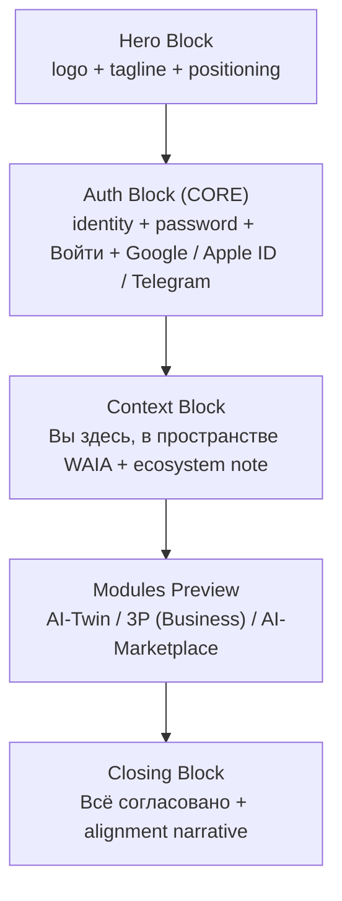
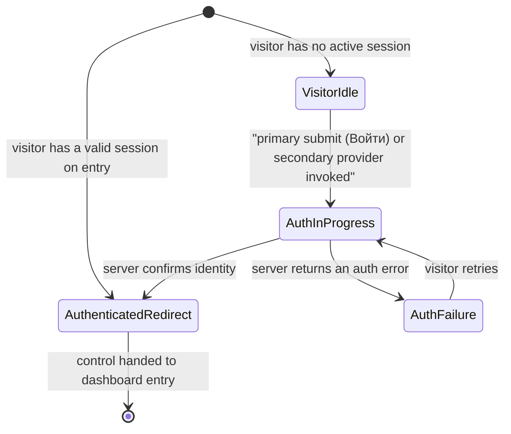

# WAIA Landing Page

**Status:** Product Source of Truth for the WAIA landing page (entry screen before the AI-Twin v1 dashboard).

This document is the canonical, system-level definition of the WAIA landing page content, copy, and state map. All frontend, backend, and security tasks consume this document as the single source of truth for what the landing exposes and how it behaves. Conflicts with downstream issues are resolved here first, then propagated.

This document refines Step 1 ("Landing") and the entry side of Step 2 ("Auth") of [docs/product/ai-twin-user-flow.md](ai-twin-user-flow.md). It does not redefine any concept that already exists upstream; it references the upstream definition.

> **Partner preview implementation note ([DEE-111](https://linear.app/deepsense/issue/DEE-111/add-visible-create-twin-email-registration-cta-on-landing)):** WAIA **v1 partner-preview** ships an **English-first** landing (`HeroBlock`, `ContextBlock`, modules, closing copy) plus an Auth Block that defaults to **Create Twin** (`POST /api/auth/sign-up` only) versus **Sign in** (`POST /api/auth/sign-in` only). **OAuth CTAs render only when** that provider is configured (see `/api/auth/oauth/availability`). If none are configured, explanatory copy replaces misleading provider buttons.
>
> Sections §6 onward still record the historic **Russian verbatim** landing contract from DEE-8. A **full rewrite** of this product spec for English-first wording and dual-mode auth is intentionally **not** bundled into DEE-111; longer-term multilingual direction is tracked separately (**[DEE-120](https://linear.app/deepsense/issue/DEE-120/ai-assisted-language-adaptation-language-switcher)**).

## 1. Header / Metadata

| Field | Value |
| --- | --- |
| Issue | [DEE-8](https://linear.app/deepsense/issue/DEE-8/02-define-landing-page-content-and-state-map) — 02 Define landing page content and state map |
| Project | WAIA |
| Milestone | WAIA MVP 1.0 |
| Team | DeepSense (DEE) |
| Execution label | `product` |
| Document type | Product specification (no code, no UI design, no API contracts, no AI logic, no backend auth behavior) |
| Document path | `docs/product/waia-landing.md` |
| Predecessor snapshot | `.cursor/plans/2026-05-03-waia-landing-spec.md` (kept unchanged for traceability) |
| Upstream source of truth | [docs/product/ai-twin-user-flow.md](ai-twin-user-flow.md) (DEE-7) |
| Date | 2026-05-03 |
| Owner | Cursor agent with Linear execution label `product` |

## 2. Purpose

The WAIA landing page is the only surface a visitor sees before becoming an authenticated user of AI-Twin v1. It must do four things at once: introduce WAIA as a multi-module ecosystem, present a clear entry path through email or third-party providers, anchor the brand emotionally, and map every observable visitor state. To make that page implementable across the frontend, backend, and security workstreams without ambiguity, its content and state map must be defined once, in product terms, before any UI work begins.

This document defines:

- the five blocks of the landing page in fixed order,
- the canonical copy that anchors the brand and the auth surface,
- the three Modules Preview cards that introduce the WAIA ecosystem,
- the entry actions exposed to a visitor (email-and-password plus Google, Apple ID, Telegram),
- the observable states of the landing page across visitor and authentication outcomes,
- the deterministic mapping from a visitor's state to what the landing renders.

Every blocked downstream Linear issue (see Section 13) refines exactly one slice of this surface. Nothing in this document substitutes for those issues.

## 3. Scope and Non-scope

### 3.1 Scope (verbatim from DEE-8)

- Logo, slogan, identity block, context block, 3 cards, meaning block.
- Entry actions for Google, Apple, Telegram, and Email.
- Empty, loading, and error states relevant to the landing flow.

### 3.2 Non-scope (verbatim from DEE-8 "Do NOT")

- Build the landing page.
- Define backend auth behavior.

### 3.3 Additional self-imposed boundaries

- No React, Next.js routing, server actions, Tailwind classes, design tokens, or component code anywhere in this document.
- No API payloads, request shapes, session schemas, or persistence contracts. These are owned by `backend` (DEE-10, DEE-11).
- No animations, transitions, micro-interactions, or motion specifications. Owned by `design`/`frontend` (DEE-9, DEE-12).
- No avatar generation logic. The avatar pipeline is a separate future feature; the landing does not present an avatar.
- No code in `app/`, `components/`, `lib/`, or anywhere else in the repo.
- No description of Business, AI-Trader, or AI-Marketplace runtime behavior. Their landing-card copy is fixed here as marketing-level descriptors only.
- No privacy policy text, no Terms of Service text, no marketing footer copy. These are out of MVP scope and will be introduced through future issues.

### 3.4 Why DEE-8 fixes copy and DEE-13 did not

[docs/product/ai-twin-dashboard-shell.md](ai-twin-dashboard-shell.md) (DEE-13) explicitly forbade copy text inside its product spec because the dashboard is functional and the copy is owned by `design` and `frontend`. DEE-8 contract acceptance criterion AC1 requires the opposite: "All landing copy is defined." This document therefore fixes brand-anchor copy verbatim (see §6, §7, §8, §10), while leaving non-anchor strings (placeholders, accessibility labels, error message wording, button micro-copy beyond the canonical CTA) to `design`/`frontend`.

## 4. Glossary

This glossary is local to the landing page. Any term already defined in [docs/product/ai-twin-user-flow.md](ai-twin-user-flow.md) §4 is referenced, not redefined.

| Term | Meaning in this document |
| --- | --- |
| **Block** | One of the five top-level areas the landing page exposes, in fixed top-to-bottom order: Hero Block, Auth Block, Context Block, Modules Preview, Closing Block. |
| **Hero Block** | The brand-anchor block at the top of the landing page. Hosts the WAIA logo, the canonical tagline, and an emotional positioning line. |
| **Auth Block** | The single mutating block on the landing page. Hosts the identity field, the password field, the primary CTA `Войти`, and the three secondary auth providers. |
| **Identity field** | A single input that accepts either an email or a chosen name. The landing surface treats them as one field; backend (DEE-10) decides how to interpret the value. |
| **Password field** | A single password input. Used for both login and implicit registration. |
| **Primary CTA** | The `Войти` button. The only mutating call-to-action on the landing page. |
| **Secondary auth provider** | One of three OAuth entry points exposed under the divider: Google, Apple ID, Telegram. The landing only exposes the entry action; the OAuth flow itself is owned by DEE-11. |
| **Context Block** | The static informational block that anchors the visitor in the WAIA ecosystem. Contains the canonical anchor copy and a short ecosystem explanation. |
| **Modules Preview** | The block that introduces the three MVP-level WAIA modules through three module cards in fixed order. |
| **Module card** | One informational card inside Modules Preview. Has a name, a short description, and a stated role in the WAIA ecosystem. Module cards are not navigational in MVP. |
| **Closing Block** | The brand-anchor block at the bottom. Hosts the canonical anchor copy and a short alignment narrative. |
| **VisitorIdle** | A landing state: a visitor without an active session, with the Auth Block in its default empty render. Covers both first-time and returning-without-session visitors. |
| **AuthInProgress** | A landing state: the visitor has submitted credentials and is awaiting the server response. The Auth Block is in a non-interactive loading shape; other blocks are unchanged. |
| **AuthFailure** | A landing state: the server responded with an authentication error. The Auth Block re-enables the CTA and surfaces an inline error; other blocks are unchanged. |
| **AuthenticatedRedirect** | A terminal landing state: the visitor either has an active session on entry, or has just succeeded authentication. The landing yields control to Step 3 ("Dashboard entry") of [user-flow §6](ai-twin-user-flow.md). |

## 5. Information Architecture

The landing page decomposes into exactly five blocks, in fixed top-to-bottom order. The shell defines composition at the block level only; physical layout, dimensions, responsiveness, and visual hierarchy are owned by `frontend`.

Constraints that bind every block:

- The landing page is rendered only for visitors without an active session, except as a terminal `AuthenticatedRedirect` state on already-authenticated entry.
- The five blocks are always present once the page is rendered. Their internal state may change; their presence does not.
- Only the Auth Block is mutating. The other four blocks are static informational surfaces.

## 6. Block 1 — Hero Block

### 6.1 Items in MVP

The Hero Block contains exactly three items, in this order:

1. **WAIA logo and symbol.** A non-interactive brand surface. The exact SVG/wordmark is owned by `design`; this document fixes only that the brand mark is the first element on the page.
2. **Canonical tagline.** Verbatim text: `Между тобой. И тобой.` Frontend implements this string exactly as written, with no edits, no translations, and no reformatting.
3. **Emotional positioning line.** A single line, in Russian, that grounds the tagline in the WAIA promise. Canonical text:

   > `WAIA соединяет тебя с тобой, чтобы ты был согласован с другими.`

   Frontend implements this string verbatim. `design` may decide on the typographic distinction between tagline and positioning line.

### 6.2 Behavior

- The Hero Block is rendered identically in every landing state from Section 11.
- The Hero Block has no interactive elements. The brand mark, the tagline, and the positioning line are non-mutating.

### 6.3 Negative scope (Hero Block must not contain)

- An animated or static avatar. The avatar belongs to a future feature.
- A video, a slideshow, or a parallax surface in MVP.
- A hero CTA button. The mutating CTA lives in the Auth Block.
- A second tagline or any additional brand variants.

## 7. Block 2 — Auth Block (CORE)

### 7.1 Items in MVP

The Auth Block contains exactly the following items, in this fixed order:

1. **Identity field** — a single input accepting either an email or a chosen name. One field, not two.
2. **Password field** — a single password input.
3. **Primary CTA `Войти`.** Verbatim text: `Войти`. Frontend implements this string exactly as written. The CTA submits the identity and password values.
4. **Divider.** A visual separator between the primary credential entry and the secondary providers. Canonical separator text: `или`. Frontend implements this string verbatim; `design` chooses the visual treatment.
5. **Secondary auth providers**, in fixed order:
   1. Google
   2. Apple ID
   3. Telegram

   Each provider is exposed as a single entry action. The landing only opens the OAuth flow for that provider; the flow itself is owned by DEE-11.

### 7.2 Behavior

- The Auth Block is the only mutating block on the landing page.
- A submission of the identity and password values transitions the landing into `AuthInProgress`.
- A successful response transitions the landing into `AuthenticatedRedirect`. The user is then handed off to [user-flow §6 Step 3](ai-twin-user-flow.md).
- A failed response transitions the landing into `AuthFailure`. The Auth Block re-enables the CTA, retains the identity field value, clears the password field for security, and surfaces an inline error message (exact wording owned by `design`).
- An entry action against a secondary auth provider transitions the landing into `AuthInProgress` for the duration of the OAuth round trip. Outcomes follow the same `AuthenticatedRedirect` / `AuthFailure` rules.
- Login and implicit registration share the single `Войти` CTA. Whether a given identity is a new or an existing account is a backend concern (DEE-10) and is invisible to the landing surface.

### 7.3 Negative scope (Auth Block must not contain)

- A separate "Регистрация" link or surface. Registration is implicit through `Войти`.
- A "Забыли пароль?" link. Password recovery is out of MVP scope and will be introduced through a future issue.
- An email verification UI. Verification is owned by DEE-10 and DEE-52.
- "Запомнить меня", 2FA, captcha, ToS or Privacy checkboxes. These are out of MVP scope. If DEE-52 (security review) requires any of them, this document is updated first, then DEE-52, then DEE-12.
- A fourth auth provider beyond Google, Apple ID, and Telegram.

## 8. Block 3 — Context Block

### 8.1 Items in MVP

The Context Block contains exactly two items, in this order:

1. **Anchor copy.** Verbatim text: `Вы здесь, в пространстве WAIA.` Frontend implements this string exactly as written.
2. **Ecosystem explanation.** A short descriptor of WAIA as an AI ecosystem. Canonical text:

   > `WAIA — это модульная AI-экосистема: персональный AI-Twin, бизнес-слой, финансовый слой и маркетплейс. Сначала ты создаёшь свой AI-Twin, дальше открываются остальные слои.`

   Frontend implements this string verbatim.

### 8.2 Behavior

- The Context Block is rendered identically in every landing state from Section 11.
- The Context Block has no interactive elements.

### 8.3 Negative scope (Context Block must not contain)

- Outbound links to a blog, Discord, social networks, or any external surface in MVP.
- A video, an interactive diagram, or an animated explainer.
- A second WAIA descriptor or any contradicting framing.

## 9. Block 4 — Modules Preview

### 9.1 The three module cards

Modules Preview contains exactly three module cards in this fixed order:

1. **AI-Twin**
2. **3P (Business)**
3. **AI-Marketplace**

### 9.2 Per-card content

Each module card contains the module name (verbatim from the list above), a one-line description, and a stated role in the WAIA ecosystem.

| Card | Description (canonical) | Role in system (canonical) |
| --- | --- | --- |
| AI-Twin | `Твой персональный цифровой двойник, который растёт через диалог и дневник.` | `Personal intelligence layer ecosystem WAIA. Доступен сразу после входа.` |
| 3P (Business) | `Бизнес-слой WAIA по логике Provision, Promotion, Production.` | `Business layer для компаний и команд. Подключается позднее.` |
| AI-Marketplace | `Экономический и маркетплейс-слой WAIA-экосистемы.` | `Marketplace layer для обмена ценностью между AI-Twins и бизнесами. Подключается позднее.` |

Frontend implements every cell verbatim. `design` chooses the visual presentation (icons, ordering within the card, typography); `design` does not edit the strings.

### 9.3 Behavior

- Module cards are **informational only**. They are not navigational in MVP. Clicking a card does not navigate anywhere and does not change landing state.
- AI-Twin is the only module enterable in MVP, and it is entered through the Auth Block, not through its module card.
- 3P and AI-Marketplace are presented as visible but not yet enterable. The visual marker for "not yet enterable" (for example, a `Coming soon` label) is owned by `design`; this document only fixes that the cards must convey the not-yet-enterable status.

### 9.4 Negative scope (Modules Preview must not contain)

- **AI-Trader** is intentionally excluded from MVP Modules Preview. AI-Trader exists in the WAIA architecture per [AGENTS.md](../../AGENTS.md) "WAIA Context", but is not surfaced on the MVP landing by product decision. Adding it requires a DEE-8 update first.
- A CTA inside any card.
- Pricing, comparison tables, roadmap dates, or feature checklists.
- A fourth card or sub-cards.

## 10. Block 5 — Closing Block

### 10.1 Items in MVP

The Closing Block contains exactly two items, in this order:

1. **Anchor copy.** Verbatim text: `Всё согласовано.` Frontend implements this string exactly as written.
2. **Alignment narrative.** A short narrative connecting personal, social, and collective alignment. Canonical text:

   > `Сначала ты согласован с собой, затем с другими, затем с системой. WAIA выстраивает эту последовательность.`

   Frontend implements this string verbatim.

### 10.2 Behavior

- The Closing Block is rendered identically in every landing state from Section 11.
- The Closing Block has no interactive elements.

### 10.3 Negative scope (Closing Block must not contain)

- A footer with Privacy / Terms / Contacts / Help links. These are out of MVP scope.
- Marketing CTAs or upsell surfaces.
- Social network icons or sharing actions.

## 11. Landing State Matrix

The landing renders one observable state per visitor at any moment. The matrix below covers every observable state. Every cell has exactly one outcome; no cell is "depends".

| Landing state | Hero Block | Auth Block | Context Block | Modules Preview | Closing Block |
| --- | --- | --- | --- | --- | --- |
| **VisitorIdle** (first-time or returning without session) | rendered as defined in §6 | identity and password fields empty; `Войти` enabled; secondary providers enabled; no error | rendered as defined in §8 | rendered as defined in §9 | rendered as defined in §10 |
| **AuthInProgress** (submission in flight, primary or secondary) | rendered as defined in §6 | identity and password fields disabled; `Войти` disabled and shows non-interactive loading shape; secondary providers disabled; no error | rendered as defined in §8 | rendered as defined in §9 | rendered as defined in §10 |
| **AuthFailure** (server returned an auth error) | rendered as defined in §6 | identity field retains its prior value; password field is cleared; `Войти` re-enabled; secondary providers re-enabled; inline error surface visible | rendered as defined in §8 | rendered as defined in §9 | rendered as defined in §10 |
| **AuthenticatedRedirect** (terminal: session valid on entry, or just succeeded) | not rendered; control is yielded to [user-flow §6 Step 3](ai-twin-user-flow.md) | not rendered | not rendered | not rendered | not rendered |

Notes that bind the matrix:

- The "Empty state" mentioned in DEE-8 Linear scope is the default render of the Auth Block under `VisitorIdle` (empty fields, enabled CTA). It is not a separate top-level state.
- First-time visitor and returning-without-session visitor are visually identical in MVP; the landing surface does not differentiate them.
- The visual treatment of disabled fields, the loading shape on `Войти`, and the inline error surface format are owned by `design`/`frontend`. The matrix only fixes which states exist and what they expose.

## 12. State Transitions

Transitions are owned by upstream contracts. Already-authenticated short-circuit (`[*] -> AuthenticatedRedirect`) is per [user-flow §6 Step 1 edge case](ai-twin-user-flow.md). Identity establishment on success is per [user-flow §6 Step 2](ai-twin-user-flow.md). Backend response semantics are owned by DEE-10 and DEE-11. The landing only reflects the resulting state per Section 11.

## 13. Cross-issue Handoff Map

The following downstream Linear issues consume this landing specification. Each item lists the slice it owns; this document does not encroach on those slices.

| Slice of the landing | Issue | Refines |
| --- | --- | --- |
| Block 1–5 layout, static rendering, responsive structure | [DEE-9](https://linear.app/deepsense/issue/DEE-9) | Implement landing page static MVP layout |
| Email-and-password auth backend, session creation, redirect contract | [DEE-10](https://linear.app/deepsense/issue/DEE-10) | Implement email auth with session redirect |
| OAuth entry points for Google, Apple ID, Telegram | [DEE-11](https://linear.app/deepsense/issue/DEE-11) | Add OAuth entry points for three providers |
| Wiring of Auth Block actions to real backend flows; loading and error UI states | [DEE-12](https://linear.app/deepsense/issue/DEE-12) | Connect landing auth actions to real flows |
| Auth threat model and security UX requirements (captcha, rate limits, lockouts) | [DEE-52](https://linear.app/deepsense/issue/DEE-52) | Auth security review for email and OAuth flows |

If a downstream issue contradicts this document, the resolution is to update DEE-8 (and this file) first, then the downstream issue. This document remains the single source of truth for the landing page surface.

## 14. Acceptance Criteria Checklist

| DEE-8 Acceptance Criterion | Satisfied where | Status |
| --- | --- | --- |
| All landing copy is defined. | Section 6 fixes the canonical tagline and emotional positioning line. Section 7 fixes the primary CTA `Войти` and divider `или`. Section 8 fixes the context anchor and ecosystem explanation. Section 9 fixes per-module description and role for AI-Twin, 3P, and AI-Marketplace. Section 10 fixes the closing anchor and alignment narrative. | Met |
| All entry actions are listed explicitly. | Section 7.1 enumerates the four entry actions: email-and-password via `Войти`, plus Google, Apple ID, and Telegram in fixed order. | Met |
| Required landing states are observable and documented. | Section 11 enumerates `VisitorIdle`, `AuthInProgress`, `AuthFailure`, `AuthenticatedRedirect` and fixes their per-block expression. Section 12 maps transitions between them. | Met |
| Frontend can implement the page without inventing new UI states. | Sections 11 and 12 cover every observable landing state; Section 13 hands off implementation slices to DEE-9, DEE-10, DEE-11, DEE-12, DEE-52 with no gaps. | Met |
