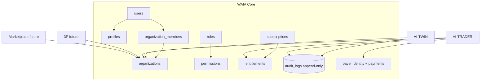

# WAIA Core Architecture

Status: Baseline v1.2 (governing)
Date: 2026-06-11
Owner: Chief Architect

WAIA Core is the shared foundation that every WAIA module (AI-TWIN, AI-TRADER, future 3P, future AI-Marketplace) attaches to. It owns **identity, tenancy, access control, entitlements, the payer/billing identity, and the platform audit stream**.

This document is the source of truth for those domains. No module may redefine them. Where any module document disagrees with this file, this file wins.

> Important reality note: as of Baseline v1.2, the Core tenancy domains (`profiles`, `organizations`, `organization_members`, roles, permissions, subscriptions, entitlements) **do not yet exist in the codebase**. Today the repo has only `users`, `sessions`, `oauth_accounts`, and AI-TWIN tables (see `db/schema.postgres.ts`).

> **WAIA Core is a hard platform prerequisite, not a trader feature.** AI-TRADER development begins **only after** the WAIA Core Uplift (Roadmap Phase 1) is complete. The Core layer is shared platform infrastructure; no AI-TRADER domain table, route, or service may be built until Core identity, tenancy, entitlements, and the audit stream exist. This sequencing is binding across the Roadmap, Integration, and Master Spec.

> **The Core Uplift is a live migration of an active platform — not greenfield work.** AI-TWIN is already in production on `users`/`sessions`/`oauth_accounts`. The Uplift must therefore be run as a **platform-migration program** with: (a) **migration planning** (staged, additive steps); (b) **tested rollback** for every step; (c) **AI-TWIN continuity** (existing users are backfilled into the org model with zero behavioral change and AI-TWIN flows keep working throughout); and (d) **backward compatibility** (`public.users.id == auth.users.id` preserved, additive-only changes to tables AI-TWIN already reads). This is governed by [ADR-0002](../adr/0002-staged-postgres-runtime-rollout-discipline.md) and `db/AGENTS.md`.

---

## 1. Principles

1. **Identity is horizontal.** One person = one identity across `waia.life`, `trader.waia.life`, and any future partner domain.
2. **Tenancy is horizontal.** The `organization` is the unit of isolation, billing attribution, and partner/fund channels.
3. **Modules are vertical.** A module owns its own domain tables and references Core by foreign key only. Modules never read or write each other's tables.
4. **Additive evolution.** Core is introduced through additive migrations that do not destabilize the live AI-TWIN application.
5. **Audit is shared.** There is one platform audit stream, not one per module.

---

## 2. Identity Model

### 2.1 Credential authority

- **Supabase Auth (`auth.users`) is the credential authority.** Email/password, OAuth (google/apple/telegram), and session issuance are owned by Supabase Auth.
- **`public.users.id == auth.users.id`.** The application `users` row mirrors the Supabase Auth user id. This is already implemented via `lib/auth/supabase-app-user-sync.ts` and must be preserved.
- A user registered through any entry point (`waia.life` or `trader.waia.life`) resolves to the **same** `auth.users` / `public.users` record. No module-specific user tables exist.

### 2.2 profiles

- `profiles` is an **additive 1:1 extension** of `users` (it does not replace `users`).
- Holds presentation/identity data shared by all modules: display name, locale, avatar reference, user-level settings, marketing/communication preferences.
- Owned by Core because every module renders the same person consistently.

### 2.3 Identity ownership boundary

- Modules may **read** identity (via Core helpers) but must never create, mutate, or duplicate identity rows.
- Credentials never leave Supabase Auth. Modules never store passwords or tokens.

---

## 3. Tenancy Model

### 3.1 organizations

- The `organization` is the **tenant boundary**. Every module-owned row that belongs to a user carries an `organization_id`.
- On signup, Core **auto-provisions one personal organization** for the new user and makes them its owner.
- MVP is effectively one-user-one-organization, but this is **never hard-coded**: multi-member orgs, partner orgs, and fund orgs are first-class future states.

### 3.2 organization_members

- Join entity linking `users` to `organizations` with a `member_role` (e.g. `owner`, `member`, future `manager`).
- Drives "which organizations can this user act within" and is the basis for access scoping.

### 3.3 Partner / fund channels

- Partner deployments (e.g. `trader.partner-domain.com`) and the in-house fund map to **organizations** with no schema change. This satisfies the AI-TRADER Business Operating Model's partner-attribution requirement at the org level.

---

## 4. Access Control

### 4.1 roles

Platform-wide role set, shared by all modules:

- `user` — regular client.
- `admin` — platform operator with cross-module oversight.
- `agent` — internal AI/automation service identity.
- `service` — trusted backend service role.

Roles are a Core concern because admin oversight crosses module boundaries (WAIA admins must see all AI-TRADER data per the Integration spec).

### 4.2 permissions

- Capabilities resolved from `role` + `entitlements`. Modules ask Core "may this actor perform this action in this org?" rather than implementing their own RBAC.

### 4.3 Enforcement strategy

- **Application-layer enforcement is primary.** Access is scoped in code via Drizzle queries filtered by `organization_id` / `user_id`. This matches the existing codebase and Baseline v1.2 (no platform-wide RLS).
- **Targeted RLS is defense-in-depth only**, applied to the highest-sensitivity tables (exchange credentials, payments, audit). See ADR-0007.
- A shared, mandatory org-scoping query helper is provided by Core so modules cannot accidentally issue unscoped queries.

---

## 5. Subscriptions & Entitlements

### 5.1 subscriptions

- Per-organization record of which modules are enabled/paid (`twin`, `trader`, future `3p`, future `marketplace`).
- Owned by Core because it gates module access uniformly.

### 5.2 entitlements

- Derived, fine-grained "can use feature X" flags resolved from subscription + role.
- A module must consult Core entitlements before exposing module functionality. Example: the AI-TRADER route group is only reachable when the org holds the `trader` entitlement.

---

## 6. Audit Model

- **One platform audit stream** (`audit_logs`), shared infrastructure owned by Core.
- **Append-only and tamper-evident.** No updates or deletes by anyone (enforced by targeted RLS + application discipline). This stream is the immutable audit trail required by the Single Operator Governance Model ([ADR-0011](../adr/0011-single-operator-governance-model.md)).
- Every sensitive action across modules writes an audit row: identity changes, entitlement changes, admin overrides, kill-switch activation, credential operations, invoice waivers, live-trading enablement.
- Audit rows capture actor type/id, action, entity type/id, organization scope, and a metadata payload sufficient for later reconstruction.

---

## 7. Ownership Boundaries (summary)

| Domain | Owner | May be read by | May be written by |
|---|---|---|---|
| `users`, `profiles` | Core | all modules | Core only |
| `organizations`, `organization_members` | Core | all modules | Core only |
| `roles`, `permissions` | Core | all modules | Core only |
| `subscriptions`, `entitlements` | Core | all modules | Core / billing |
| `audit_logs` | Core (shared infra) | admins | all services (insert only) |
| payer identity, `payments`, `payment_addresses` | Core (shared infra) | owning module | billing / payment watcher |
| module domain tables | the module | the module | the module |

---

## 8. Module Attachment Model

Every module attaches to Core identically:

Attachment contract for any module:

1. Reference `organizations` / `users` by foreign key; carry `organization_id` on tenant rows.
2. Check Core entitlements before exposing functionality.
3. Write sensitive actions to the shared `audit_logs`.
4. Route payment/payer concerns through Core shared infrastructure.
5. Never define identity/tenancy tables locally.

---

## 9. Relationship to existing codebase

- Preserves the existing Supabase Auth + `public.users.id == auth.users.id` model (`lib/auth/supabase-app-user-sync.ts`).
- Preserves Drizzle dual-schema discipline (`db/schema.ts`, `db/schema.postgres.ts`) and additive-migration governance (`db/AGENTS.md`).
- Adds Core tenancy domains as additive migrations; AI-TWIN tables remain unchanged and become a module that conforms to the attachment model over time.

---

## 10. Related documents

- [AI-TRADER Integration](../ai-trader/AI-TRADER-INTEGRATION.md)
- [AI-TRADER Master Spec v2](../ai-trader/AI-TRADER-MASTER-SPEC-v2.md)
- [ADR-0005 SaaS-as-Superset](../adr/0005-saas-as-superset-strategy.md)
- [ADR-0007 Targeted RLS Strategy](../adr/0007-targeted-rls-strategy.md)
