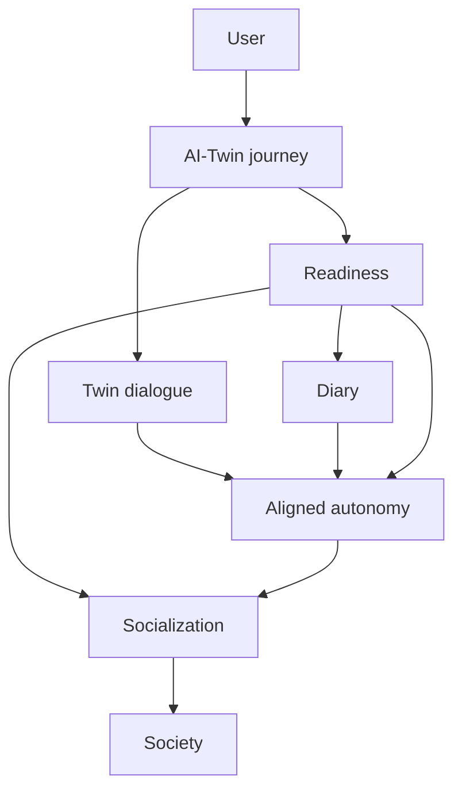
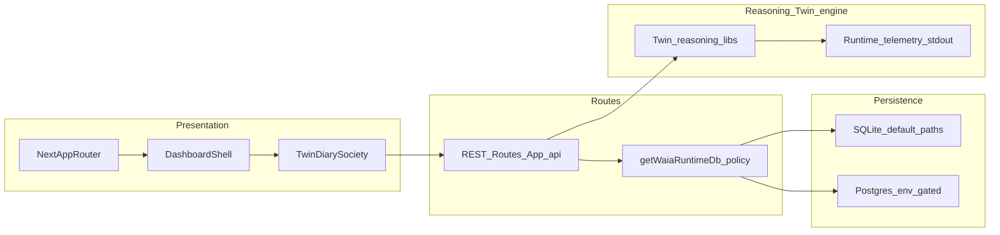

# System map — WAIA MVP

Product meaning precedes plumbing: the conceptual layer below foregrounds **human-centered progression**; runtime topology underneath **implements** that progression.

## Conceptual topology (human-centered)

Routes, persistence, and telemetry exist **to carry** Twin dialogue, readiness thresholds, Diary, and Society—not the reverse. **Aligned autonomy** deepens via dialogue, Diary, and readiness progress; Socialization gates how that alignment **enters** Society under product rules—not unbounded autonomy. Terms: [`GLOSSARY.md`](GLOSSARY.md).

## Runtime & data topology (MVP)

## Boundaries (MVP)

| Inside MVP focus | Deferred / layered |
|------------------|--------------------|
| AI-Twin onboarding + readiness | Business 3P module |
| Diary + Twin dialogue contracts | AI-Trader |
| Society after Socialization | AI-Marketplace |
| Stabilizing split-runtime rollout | Visionary cross-module integrations |

Aspiration arcs may be named in strategy docs—they **cannot** silently expand coding scope (`NON-GOALS` guards).

## Data & trust surfaces

Twin + Diary raw content privacy vs Society derived-only outputs per [`../product/ai-twin-user-flow.md`](../product/ai-twin-user-flow.md) §8.

## Related docs

[`../product/WAIA-V1-MVP-SPEC.md`](../product/WAIA-V1-MVP-SPEC.md) · [`MIGRATION-GOVERNANCE.md`](MIGRATION-GOVERNANCE.md) · [`../architecture/DEE-76-AI-GATEWAY-ARCHITECTURE.md`](../architecture/DEE-76-AI-GATEWAY-ARCHITECTURE.md) (Twin dialogue AI Gateway — planning)
