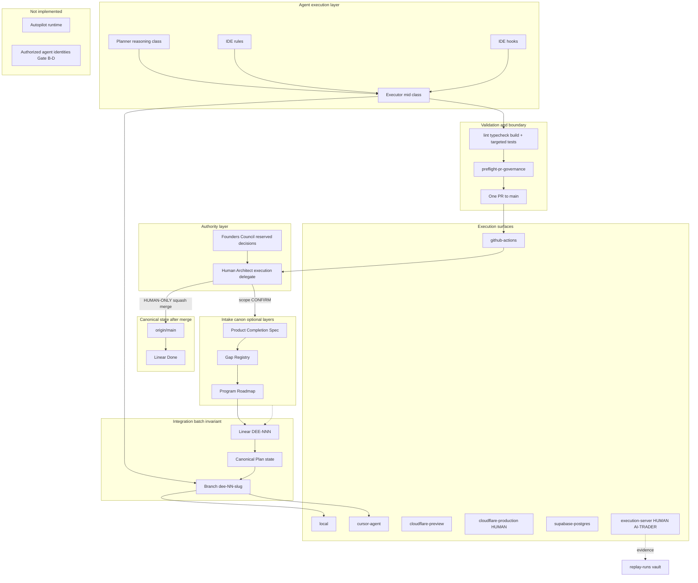

# WAIA DEV OS — Architecture Specification

**Status:** Canonical · **Owner:** Architect · **Class:** T0 documentation  
**Scope:** WAIA DEV OS only — the governed development operating system. Not a product spec, not a module architecture, not a tutorial, not a roadmap.  
**Audience:** Every Cursor model, Composer, Opus, Codex, and human operator executing WAIA work.  
**Supersedes as primary DEV OS reference:** fragmented lifecycle descriptions, duplicated operator summaries, and ecosystem-wide architecture sections that describe DEV OS in passing.

**Related (do not duplicate here):**

| Topic | Canonical owner |
|-------|-----------------|
| Agent execution router | [`AGENTS.md`](../../AGENTS.md) |
| Constitution (short coordinator) | [`WAIA-DEV-OS.md`](WAIA-DEV-OS.md) |
| Lifecycle phases | [`LIFECYCLE.md`](LIFECYCLE.md) |
| Integration boundary / action matrix | [`INTEGRATION-BOUNDARY-POLICY.md`](INTEGRATION-BOUNDARY-POLICY.md) |
| Execution surfaces registry | [`docs/ops/EXECUTION-SURFACES.md`](../ops/EXECUTION-SURFACES.md) |
| Operator quick reference | [`docs/ops/OPERATOR-QUICKREF.md`](../ops/OPERATOR-QUICKREF.md) |
| Ecosystem / module synthesis | [`docs/WAIA-CANONICAL-ARCHITECTURE.md`](../WAIA-CANONICAL-ARCHITECTURE.md) |
| AI-TRADER product & runtime | [`docs/AI-TRADER-PRODUCT-CONSTITUTION.md`](../AI-TRADER-PRODUCT-CONSTITUTION.md), [`docs/product-specs/`](../product-specs/) (completion spec — in flight) |

---

## 0. Authority and precedence

### 0.1 What this document owns

This specification is the **primary Source of Truth for how WAIA development is organized** after vNext integration (Slices A–H, completed 2026-07 per [`docs/plans/README.md`](../plans/README.md)).

It owns:

- DEV OS purpose, philosophy, and core operating cycle
- Canonical document hierarchy for development governance
- Execution-surface responsibilities and boundaries
- AUTO / CONFIRM / HUMAN-ONLY classification (summary — detail in integration policy)
- Implemented vs intentionally absent autopilot boundaries
- Relationship between DEV OS and product modules (e.g. AI-TRADER)

It does **not** own:

- **Product meaning** — user journeys, module semantics, readiness rules (`docs/product/**`, completion specs)
- **Module runtime architecture** — how AI-TWIN, AI-TRADER, or WAIA Core run in production
- **Infrastructure topology** — hosts, vendors, env layout, deploy wiring (documented in ops/migrations; consumed, not defined here)
- **Rollout facts** — what is live, staged, or forbidden in persistence/runtime (`docs/migrations/**`)
- **Constitutional apex authority** — Founders Council reserved decisions ([`FOUNDERS-COUNCIL.md`](FOUNDERS-COUNCIL.md))
- **Secrets and credentials** — never committed; env and operator injection only

### 0.2 Architectural layer separation

These layers **must never be mixed**. Each has one canonical owner; cross-layer facts are **linked**, not duplicated.

| Layer | What it is | Canonical owner | DEV OS role |
|-------|------------|-----------------|-------------|
| **Engineering Operating System** | How work is organized, gated, validated, merged | *This specification* + topic owners (`LIFECYCLE.md`, `INTEGRATION-BOUNDARY-POLICY.md`, …) | Defines the system |
| **Product** | What users experience; what modules *mean* | `docs/product/**`, `docs/product-specs/**` | Consumes specs; never redefines them |
| **Infrastructure** | Runtimes, hosts, databases, deploy targets | `docs/migrations/**`, `docs/ops/**`, ADRs | Declares `executionSurfaces`; does not own topology |
| **Execution** | Where commands run and what they mutate | [`EXECUTION-SURFACES.md`](../ops/EXECUTION-SURFACES.md) | Classifies blast radius per batch |
| **Governance** | Rules, hooks, tiers, PR discipline, agent posture | `docs/waia-governance/**`, `AGENTS.md` | Subset of DEV OS; normative detail in topic docs |
| **Knowledge** | Durable engineering memory | Repository (`docs/**`, ADRs, `replay-runs/**`) | Repository-first; Linear is operations queue only |

**Drift guard:** If a change mixes layers (e.g. product semantics smuggled into a plan `state` block, or deploy policy written in a completion spec), STOP and split across the correct owners.

### 0.3 Precedence on conflict

Recovery order (binding stack):

1. **Product specs** — `docs/product/**` (user-visible meaning)
2. **Governance + ADRs** — `docs/waia-governance/**`, `docs/adr/**`
3. **Migration trackers** — `docs/migrations/**` (rollout truth)
4. **Active Linear issue** — executable contract for the batch in flight
5. **Code / comments** — may lag

**Cross-layer rule:** Product wins on *meaning*; DEV OS wins on *process organization*; migration trackers win on *rollout facts*; code is last resort.

**Recovery on ambiguity:** STOP — do not guess. Escalate with one-sentence question, contradicted doc links, proposed risk tier, optional ADR title ([`EXECUTION-CONTRACT.md`](EXECUTION-CONTRACT.md)). Emergency path: [`HUMAN-OVERRIDE.md`](HUMAN-OVERRIDE.md).

Within governance:

| Layer | Wins when |
|-------|-----------|
| [`AGENTS.md`](../../AGENTS.md) | Conflicts with [`EXECUTION-CONTRACT.md`](EXECUTION-CONTRACT.md) unless both updated in one deliberate PR |
| **This specification** | Conflicts with short summaries in `WAIA-DEV-OS.md`, `AUTONOMOUS-EXECUTION-LOOP.md`, `docs/AGENT_AUTOMATION.md` — on **structural topology and layer ownership** |
| **Topic owners** (`LIFECYCLE.md`, `INTEGRATION-BOUNDARY-POLICY.md`, etc.) | Conflicts with this spec on the **same topic's normative rules** — reconcile via deliberate PR; topic owner detail prevails until this spec is explicitly amended to absorb the change |
| **Operational canon** | Conflicts with constitutional doctrine artifacts until reconciled ([`CONSTITUTIONAL-DOCTRINE.md`](CONSTITUTIONAL-DOCTRINE.md)) |

**Relationship to `WAIA-DEV-OS.md`:** The constitution is a **short coordinator** (roles, gates, validation pointer). This specification is the **full architecture**. On conflict about DEV OS structure, this document prevails; the constitution should be updated to point here, not re-derive topology.

**Uncertainty (repository-evidenced):** Phase 0 Governance Integration artifacts (`FOUNDERS-COUNCIL.md`, `SOURCES-OF-TRUTH.md`, `AGENT-CHARTER.md`) still state that apex-authority binding lands in **PR2 (GI-05)**. [`WAIA-GOVERNANCE-BASELINE-REPORT-v1.0.md`](WAIA-GOVERNANCE-BASELINE-REPORT-v1.0.md) records GI-05 as **not started** at report time. vNext DEV OS slices (A–H) were documented as complete on `dev` *(historical dual-branch era; current trunk is `main` per DEE-511)*. Until GI-05 status is reconciled in governance docs, treat **day-to-day execution authority** as defined by `AGENTS.md` / `AGENT-ROLES.md` (Human Architect as final merge and scope authority) while **Founders Council reserved decisions** remain documented in `FOUNDERS-COUNCIL.md` regardless of PR2 merge state.

---

## 1. Purpose

**What WAIA DEV OS is:** The **engineering operating system** for WAIA — a governed layer that turns coding-agent output into traceable, reversible, human-accountable integration on the repository and Linear queue. It is not a product, not a runtime, and not an autonomous agent platform.

**Why it exists:** Coding agents (today: Cursor-hosted Composer, Opus, and successors) can produce large, coherent diffs faster than humans can hold context. Without an operating system, that speed collapses:

- product intent,
- architectural boundaries,
- audit trails,
- and accountability.

**Problem solved:** Unbounded agent coding destroys intent, auditability, and rollback — DEV OS bounds work into **integration batches** with explicit gates, surfaces, and a single merge boundary.

DEV OS turns AI-assisted engineering into a **repeatable, auditable system** with:

| Goal | Mechanism |
|------|-----------|
| Intent survives execution | Product + completion specs + Linear; code maps back |
| Risk matches autonomy | Risk tiers T0–T4; execution-surface classification; PR discipline |
| Audit trail | Git history, one PR per integration batch, Linear issue, five-memory closeout |
| Recoverable failure | Revertible PRs, post-merge verification, documented STOP escalation |
| Resumable work | Canonical plan `state` on the feature branch — not chat memory |

DEV OS is **product-independent**. It builds and governs any WAIA module. The AI-TRADER Completion Specification is a **consumer** of this operating system (see §9).

**Prime constraint** ([`AGENT-CHARTER.md`](AGENT-CHARTER.md)): *Agents may comment. Humans decide.*

---

## 2. Engineering philosophy

1. **Human meaning first.** Product and completion specs define *done*. Agents implement; they do not silently redefine semantics.
2. **Repository-first knowledge.** The git repository is the Knowledge Base for Phase 0–1 ([`SOURCES-OF-TRUTH.md`](SOURCES-OF-TRUTH.md)). No external KB is canonical.
3. **PR = integration boundary.** One integration batch yields exactly one merge event to `main` ([`INTEGRATION-BOUNDARY-POLICY.md`](INTEGRATION-BOUNDARY-POLICY.md)).
4. **Plans hold mutable state; specs hold durable intent.** Completion specs and gap registries change slowly. Canonical plans change every work package.
5. **Surfaces declare blast radius.** Every batch lists `executionSurfaces` so operators know where live infra can be touched.
6. **Cheapest safe model.** Model **classes** (`fast` / `mid` / `reasoning`), not pinned versions ([`MODEL-COST-POLICY.md`](MODEL-COST-POLICY.md)).
7. **STOP on contradiction.** Silent reconciliation across product, governance, trackers, and Linear is forbidden ([`EXECUTION-CONTRACT.md`](EXECUTION-CONTRACT.md)).
8. **Effective merged is derived.** Post-merge status-only commits on `main` are forbidden; completion is PR merged + Linear `Done` + stated criteria met.
9. **Evidence is classified.** Scratch never ships; accepted research lives under `replay-runs/**` per [`EVIDENCE-POLICY.md`](EVIDENCE-POLICY.md).
10. **DEV OS is not the product.** It safely builds WAIA modules; AI-Twin v1 remains the primary **product delivery** focus per operating memory, while other modules may run as parallel engineering programs.

### 2.1 Permanently stable invariants

These are **architectural constants**. Tooling may change; these do not.

| Invariant | Statement |
|-----------|-----------|
| **Human authority** | Humans decide scope, merge, production, and reserved matters; agents advise only |
| **Integration boundary** | One integration issue = one plan = one branch = one PR = one merge |
| **PR to `main`** | All feature/governance integration lands via PR to the single trunk; `main` is never directly pushed by agents (`dev` frozen pending Human retirement) |
| **Repository-first knowledge** | Git repository is canonical engineering memory; no shadow knowledge base |
| **Derived completion** | Post-merge batch completion is inferred from merge + Linear `Done`; no status-only commits on `main` |
| **STOP on contradiction** | Unresolved cross-layer or cross-doc conflict halts work |
| **Secrets discipline** | No secrets in git; env and operator injection only |
| **Execution label** | Exactly one execution label per Linear issue ([`AGENT-EXECUTION-LABELS.md`](AGENT-EXECUTION-LABELS.md)) |
| **Surface registry** | Work touching live infra must map to a registered execution surface |
| **Trunk merge method** | Feature/fix/governance → `main` = squash; official release = explicit Human tag of a `main` SHA (no promotion/back-sync) |
| **Agent Charter ceiling** | No unauthorized agent identities; no agent merge; no persistent autonomous governance loops |

### 2.2 Expected to evolve

These **implement** the invariants; they may be renamed, rehosted, or automated further — but only via governed integration batches.

| Evolvable | Current binding expression |
|-----------|---------------------------|
| IDE / agent host | Cursor commands, rules, hooks (`.cursor/**`) |
| Model products | Mapped to classes `fast` / `mid` / `reasoning` ([`MODEL-COST-POLICY.md`](MODEL-COST-POLICY.md)) |
| Phase commands | `/plan-feature`, `/implement`, `/test-and-fix`, `/prepare-pr`, … |
| MCP server ids | Documented bindings (e.g. Linear `plugin-linear-linear`) |
| CI job names | `.github/workflows/*` (must stay aligned with validation canon) |
| Intake instances | Gap registries, program roadmaps, completion specs (schemas exist; instances grow) |
| Autopilot | Read-only contract today; optional future read-only coordinator ([`ROADMAP-AUTOPILOT.md`](ROADMAP-AUTOPILOT.md)) |
| Hook inventory | [`EXECUTABLE-GOVERNANCE-HOOKS.md`](EXECUTABLE-GOVERNANCE-HOOKS.md) backlog |

---

## 3. Core operating cycle

The end-to-end cycle below is **current** post-vNext. Bootstrap batches may skip optional intake layers with Architect approval (`Plan: n/a` in PR body).

```
Product Completion Specification     docs/product-specs/<module>-completion.md
        ↓  (optional intake — schema ready; instances may not exist yet)
Gap Registry                         docs/gaps/<scope>-gap-registry.md
        ↓
Roadmap                              docs/roadmaps/<program>-roadmap.md
        ↓
Integration Batch                    one scoped unit of integration-ready work
        ↓
Linear Issue                         DEE-NNN (team DEE, project WAIA)
        ↓
Canonical Plan                       docs/plans/dee-NNN-slug.md  (state primitive)
        ↓
Agent implementation                 executor role, mid class — today: /implement
        ↓
Validation                           lint + typecheck + build + targeted tests (full unit suite in PR CI)
        ↓
Evidence                             classified per EVIDENCE-POLICY when applicable
        ↓
Pull Request                         exactly one PR per integration issue → main
        ↓
Human Merge                          squash to main (feature/fix/governance)
        ↓
Updated Canonical State              code + docs on origin/main; plan state effectively complete
```

### 3.1 Core invariant

**One integration Linear issue = one canonical plan = one primary branch = one PR = one merge event.**

Additional binding invariants on every batch:

- Branch name `dee-<NN>-<slug>` matches `**Linear:**` id and plan `integrationIssue`
- Exactly **one** execution label on the integration issue
- Commits use `DEE-NN type(scope): subject` on the feature branch
- Child issues in `**Includes:**` are never auto-closed on merge — only the integration id is

Work packages inside a batch are **not** separate PRs. When work must split, spawn a **new integration batch** with its own issue, plan, branch, PR, and `dependsOn`.

### 3.2 Phase map (current IDE binding)

Phases are **architectural roles**. Today they bind to Cursor slash-commands and model classes; a future IDE must preserve the same role boundaries.

| Phase | Command *(current)* | Mode | Model class |
|-------|---------|------|-------------|
| Groom *(optional)* | `/groom` | Plan / Ask | `reasoning` |
| Decompose *(optional)* | `/decompose` | Plan | `reasoning` |
| Plan | `/plan-feature` | Plan | `reasoning` |
| Implement | `/implement` | Agent | `mid` |
| Test & Fix | `/test-and-fix` | Agent | `mid` |
| PR | `/prepare-pr` | Agent | `mid` |
| Background | `/bg-test-and-fix`, `/fix-ci` | Background | `mid` |
| Diagnose | `/diagnose` | Agent | `mid` |
| Parallel | `/parallel-implement` | Agent | `mid` |

Canonical reference: [`LIFECYCLE.md`](LIFECYCLE.md). Detailed 12-step table: [`AUTONOMOUS-EXECUTION-LOOP.md`](AUTONOMOUS-EXECUTION-LOOP.md) (map only — not a competing lifecycle).

### 3.3 Linear status flow

`Backlog` → `Todo` → `In Progress` → `In Review` → `Done`

| Event | Linear status |
|-------|---------------|
| Plan approved / work starts | `In Progress` |
| Integration-ready PR opened | `In Review` |
| Human squash merge to `main` | `Done` (`linear-done.yml` when `LINEAR_API_KEY` set) |

### 3.4 Integration batch sub-cycle (no PR until ready)

1. Scope approval — human approves issue, plan, tier, surfaces, acceptance criteria.
2. Implementation loop — many work packages, commits, pushes — **no PR**.
3. Validation loop — repeat gates until green.
4. Branch sync — merge `origin/main` into feature branch (never force-push published branch).
5. Integration-ready — contract satisfied; `preflight-pr-governance.sh` passes; one PR to `main`.
6. One PR — agent opens exactly one PR; Linear `In Review`; **stops**.
7. Human merge — effective completion is **derived** (no post-merge status-only commit).

### 3.5 Resumption rule

**Never resume from chat alone.** Resume from: canonical plan `state` + branch + `git log` + open/merged PR ([`OPERATOR-QUICKREF.md`](../ops/OPERATOR-QUICKREF.md)).

Draft plans in `.cursor/plans/` (gitignored) are pre-promotion scratch only.

---

## 4. Canonical document hierarchy

### 4.1 Layer model

| Layer | Location | Mutability | Owns |
|-------|----------|------------|------|
| **Agent router** | `AGENTS.md` | Rare | Execution contract entry, validation canon, Linear rules summary |
| **DEV OS architecture** | *this document* | Deliberate PR | Full DEV OS topology, cycle, hierarchy, boundaries |
| **DEV OS constitution** | `WAIA-DEV-OS.md` | Deliberate PR | Short coordinator: roles, gates, validation pointer |
| **Lifecycle** | `LIFECYCLE.md` | Deliberate PR | Phase table, status flow, intake pointers |
| **Integration boundary** | `INTEGRATION-BOUNDARY-POLICY.md` | Deliberate PR | PR timing, AUTO/CONFIRM/HUMAN-ONLY, branch sync, post-merge reconciliation |
| **Product journey** | `docs/product/**` | Product PRs | What the product *is* (AI-Twin v1 today) |
| **Completion spec** | `docs/product-specs/**` | Architect-approved | Measurable *done* for a module |
| **Gap registry** | `docs/gaps/**` | Batch-driven | Missing vs completion spec |
| **Roadmap** | `docs/roadmaps/**` | Architect-approved | Ordered integration batches |
| **Canonical plan** | `docs/plans/dee-*.md` | Per-batch commits | Mutable `state`, WPs, validation, PR linkage |
| **Operations queue** | Linear WAIA | Per issue | Executable work, status, labels |
| **Technical diff** | Git / GitHub | Per PR | Code, tests, committed docs |
| **Rollout truth** | `docs/migrations/**` | Migration PRs | Runtime/persistence posture |
| **Evidence vault** | `replay-runs/**` | Campaign PRs | Accepted/rejected research artifacts |
| **ADRs** | `docs/adr/**` | Deliberate PR | Durable *why* |
| **Operating memory** | `WAIA-OPERATING-MEMORY.md` | Patched often | *What is true right now* snapshot (subordinate) |
| **Ecosystem synthesis** | `WAIA-CANONICAL-ARCHITECTURE.md` | Periodic | Whole-WAIA orientation (modules, maturity) — not DEV OS detail |

### 4.2 Standards (schemas without requiring instances)

These define **how** to author artifacts. Validation: `pnpm validate:canon` ([`scripts/ops/validate-canonical-docs.sh`](../../scripts/ops/validate-canonical-docs.sh)).

| Standard | Path |
|----------|------|
| Completion spec | [`PRODUCT-COMPLETION-SPEC-STANDARD.md`](PRODUCT-COMPLETION-SPEC-STANDARD.md) |
| Gap registry | [`../gaps/GAP-REGISTRY-STANDARD.md`](../gaps/GAP-REGISTRY-STANDARD.md) |
| Roadmap | [`../roadmaps/ROADMAP-STANDARD.md`](../roadmaps/ROADMAP-STANDARD.md) |
| Canonical plan | [`../plans/README.md`](../plans/README.md) |
| Evidence | [`EVIDENCE-POLICY.md`](EVIDENCE-POLICY.md) |
| Documentation closeout | [`DOCUMENTATION-STANDARDS.md`](DOCUMENTATION-STANDARDS.md) |

**Repository state (evidenced):** Standards and templates exist. **No populated** gap-registry or program-roadmap instance files are committed. **One** sample canonical plan: `docs/plans/dee-404-devos-canonical-plans-sample.md`. Completion spec instance for AI-TRADER is **in flight** in the same future integration batch as this document.

### 4.3 Governance corpus index

Full table: [`README.md`](README.md). Binding day-to-day topics:

| Document | Owns |
|----------|------|
| [`EXECUTION-CONTRACT.md`](EXECUTION-CONTRACT.md) | Human approval gates, STOP payload, model guidance |
| [`AGENT-ROLES.md`](AGENT-ROLES.md) | Planner / Executor / Reviewer; model classes; Orchestrator pattern |
| [`AGENT-EXECUTION-LABELS.md`](AGENT-EXECUTION-LABELS.md) | Exactly-one label ownership matrix |
| [`TASK-LIFECYCLE.md`](TASK-LIFECYCLE.md) | Linear issue contract fields, selection order |
| [`LINEAR-GOVERNANCE.md`](LINEAR-GOVERNANCE.md) | Board rules, closeout template |
| [`BRANCHING-STRATEGY.md`](BRANCHING-STRATEGY.md) | `dee-<NN>-<slug>`, merge method by PR class |
| [`PR-PROTOCOL.md`](PR-PROTOCOL.md) | PR body, preflight, semantic-impact signals |
| [`POST-MERGE-PROTOCOL.md`](POST-MERGE-PROTOCOL.md) | Hygiene, sync `origin/main`, explicit release tag, agent completion report |
| [`RISK-TIERS.md`](RISK-TIERS.md) | T0–T4 autonomy envelopes |
| [`MODEL-COST-POLICY.md`](MODEL-COST-POLICY.md) | `fast` / `mid` / `reasoning` classes |
| [`EXECUTABLE-GOVERNANCE-HOOKS.md`](EXECUTABLE-GOVERNANCE-HOOKS.md) | Hook and CI enforcement inventory |
| [`AGENT-AUTO-ADVANCE.md`](AGENT-AUTO-ADVANCE.md) | Safe auto-advance preconditions |
| [`ROADMAP-AUTOPILOT.md`](ROADMAP-AUTOPILOT.md) | Autopilot **contract only** (no runtime) |
| [`MIGRATION-GOVERNANCE.md`](MIGRATION-GOVERNANCE.md) | Migration memory discipline pointers |
| [`NON-GOALS.md`](NON-GOALS.md) | AI-Twin v1 engineering focus exclusions |
| [`FAILURE-PATTERNS.md`](FAILURE-PATTERNS.md) | Incident knowledge |
| [`HUMAN-OVERRIDE.md`](HUMAN-OVERRIDE.md) | Emergency path |

### 4.4 Sources of Truth by information class

| Class | Canonical system | Document |
|-------|------------------|----------|
| Development | Repository | [`SOURCES-OF-TRUTH.md`](SOURCES-OF-TRUTH.md) |
| Operations | Linear | Same |
| Knowledge | Repository-first | Same |
| Community / Financial | Deferred | Same + [`FUTURE-GOVERNANCE-BACKLOG.md`](FUTURE-GOVERNANCE-BACKLOG.md) |

### 4.5 Cursor / automation artifacts

| Artifact | Role |
|----------|------|
| [`.cursor/commands/*.md`](../../.cursor/commands/) | Phase instructions (`implement`, `prepare-pr`, etc.) |
| [`.cursor/rules/*.mdc`](../../.cursor/rules/) | Always-applied workspace rules |
| [`.cursor/hooks.json`](../../.cursor/hooks.json) | Shell guard, format, log |
| [`docs/AGENT_AUTOMATION.md`](../AGENT_AUTOMATION.md) | Automation topology diagram |
| [`.github/pull_request_template.md`](../../.github/pull_request_template.md) | PR body schema |
| [`.github/workflows/*.yml`](../../.github/workflows/) | CI, PR governance, preview, release, linear-done |

---

## 5. Execution surfaces and actors

Eight registered surfaces ([`EXECUTION-SURFACES.md`](../ops/EXECUTION-SURFACES.md)). **No other surface exists** without extending that registry.

### 5.1 Surface registry

| Surface id | Primary actor | Mutates live infra? | Evidence |
|------------|---------------|---------------------|----------|
| `local` | Developer | No | Terminal output; `tests/` fixtures |
| `cursor-agent` | Composer / Sonnet agent | Feature branch only | `.cursor/agent-log.jsonl`; plan `state`; PR body |
| `github-actions` | CI | Ephemeral runners | Actions run URL |
| `cloudflare-preview` | Operator / workflow | Isolated preview Worker | PR comment + preview URL |
| `cloudflare-production` | **Human** | **Yes** | `release.yml`; Workers deploy history |
| `supabase-postgres` | Infra operator | **Yes** | `db/migrations/**`; advisor output |
| `execution-server` | **Human** | **Yes** (AI-TRADER only) | `replay-runs/**`; host logs; `deployed-revision.json` |

**Deploy target:** Production WAIA app runs on **Cloudflare Workers** (OpenNext) from `main` — not static Cloudflare Pages export ([`docs/cloudflare-deploy.md`](../cloudflare-deploy.md)).

### 5.2 Actor responsibilities

Roles are **timeless**. Product names (Composer, Sonnet, Opus, Cursor) are **current implementations** mapped via [`MODEL-COST-POLICY.md`](MODEL-COST-POLICY.md).

| Role | Model class *(current examples)* | Responsibility | Boundary |
|------|----------------------------------|----------------|----------|
| **Human (Architect / operator)** | — | Scope approval, merge, production deploy, Execution Server mutation, reserved decisions, STOP resolution | Does not substitute for green CI; does not bypass hooks |
| **Planner** | `reasoning` *(Opus)* | Groom, decompose, plan; architecture ambiguity; pre-merge review when requested | No commits on `main`; no merge; no scope expansion without CONFIRM |
| **Executor** | `mid` *(Sonnet / Composer Agent)* | Implement, test-fix, PR prep; feature-branch code and docs | No merge; no `main` push; no host mutation |
| **Fast executor** | `fast` *(Composer 2)* | T0/T1 docs, hygiene, continuity handoffs | No T3/T4 infra without escalation |
| **IDE host** | Cursor *(current)* | Rules injection, hooks, MCP, commands | Enforcement aid — not authority |
| **GitHub** | — | PR review, blocking CI, rulesets, `linear-done.yml`, automated review bots, preview workflow | Humans merge; agents never `gh pr merge` |
| **Linear** | — | Executable queue, status, dependencies, closeout | Operations SoT — not canonical for code or doc text |
| **Cloudflare Workers** | — | Production and preview runtime for Next.js app | Production = HUMAN-ONLY |
| **Execution Server** | — | Module live execution plane off primary deploy target (ADR-0023: AI-TRADER today) | All mutation = HUMAN-ONLY; agents read-only preflight only |
| **Supabase** | — | Postgres for shared/campaign state; auth | Schema CONFIRM; prod data HUMAN-ONLY |

### 5.3 External system bindings (MCP)

Agents reach external systems through **documented MCP bindings**. Bindings are evolvable implementation detail; the architectural rule is: **read schema before call; never invent server aliases.**

Current documented ids include Linear **`plugin-linear-linear`** (not undocumented `linear` alias). Supabase, Cloudflare, Playwright per [`CURSOR-ENVIRONMENT.md`](../ops/CURSOR-ENVIRONMENT.md).

### 5.4 Agent permissions by surface (summary)

| Surface | `mid` AUTO | CONFIRM | HUMAN-ONLY |
|---------|------------|---------|------------|
| `local` | dev + validation | — | — |
| `cursor-agent` | implement, test, PR prep | scope / plan promotion | merge |
| `github-actions` | CI runs automatically | workflow edits | — |
| `cloudflare-preview` | bundle; read-only diagnose | — | — |
| `cloudflare-production` | — | — | deploy |
| `supabase-postgres` | read-only MCP | schema approval | prod data ops |
| `execution-server` | read-only preflight | — | sync/build/deploy/rollback/live trading |

Full matrix: [`INTEGRATION-BOUNDARY-POLICY.md`](INTEGRATION-BOUNDARY-POLICY.md).

---

## 6. Governance — AUTO, CONFIRM, HUMAN-ONLY

Classification exists so **low-risk batches need minimal checkpoints** while **irreversible or production actions cannot be automated**.

### 6.1 AUTO — execute without stopping

Repository inspection; read-only diagnostics; documentation and code on feature branches; local `pnpm lint && pnpm typecheck && pnpm build` + targeted tests; feature-branch commits and push; PR body preparation; **one PR to `main` when integration-ready**; updating canonical-plan `state` frontmatter on the feature branch.

**Why:** Mechanical work with rollback = revert PR. Hooks and rulesets block protected-branch damage.

### 6.2 CONFIRM — stop and ask

New Linear integration issue (unless pre-authorized); scope change; batch split/merge beyond approved plan; plan promotion to `state.status: approved`; ambiguous child completion; PR when criteria partially met; constitutional governance edits; branch-protection / CI changes; unapproved schema change.

**Why:** These actions change **what** will merge or **who** is accountable. Silent scope expansion is how product meaning drifts.

### 6.3 HUMAN-ONLY — never perform

Merge; direct push to `main` (or frozen `dev`); production deploy; Execution Server sync/build/deploy/rollback; live trading; secret mutation; destructive data ops; weakening hooks, rulesets, tests, CI, tenant isolation, or security gates; creating production release tags.

**Why:** Irreversible production impact, capital path, or governance integrity. [`AGENT-CHARTER.md`](AGENT-CHARTER.md) forbids agents opening, approving, merging, or auto-merging PRs.

### 6.4 Minimal operator checkpoints

Normal low-risk batch: **scope approval** + **merge approval** only.

Exceptional checkpoint when touching Execution Server, T3/T4, DB migration, constitutional change, or live external ops.

Detail: [`OPERATOR-QUICKREF.md`](../ops/OPERATOR-QUICKREF.md).

### 6.5 Validation and PR governance

**Local PR readiness:**

```bash
pnpm lint && pnpm typecheck && pnpm build
# + targeted / path-scoped tests for changed surfaces
```

Add `pnpm test:e2e` when UI changes. Full unit suite is **authoritative in GitHub PR CI**. Before PR handoff:

```bash
pnpm validate:pr-governance
```

**Blocking CI:** `lint`, `typecheck`, `unit tests`, `build`, `e2e tests`, `PR governance`, and **tenant-isolation** (release-blocking per ADR-0007 — see [`BRANCHING-STRATEGY.md`](BRANCHING-STRATEGY.md)).

**Hooks:** [`EXECUTABLE-GOVERNANCE-HOOKS.md`](EXECUTABLE-GOVERNANCE-HOOKS.md) — `guard-shell.sh` blocks force-push and direct protected-branch push (`main`; frozen `dev` until retirement).

---

## 7. Current implemented architecture

Only what **exists in the repository today** after vNext integration.

### 7.1 Branching and merge

- **Single trunk:** `dee-<NN>-<slug>` from `main` → PR to `main` → human **squash** merge (feature/fix/governance).
- `main` = canonical integration + production tip (hooks + GitHub rulesets via [`main-protection.json`](../../.github/rulesets/main-protection.json)).
- `dev` is **frozen** pending Human retirement after one successful single-trunk cycle — not an active PR base.
- Official release = explicit Human tag/release of an exact `main` SHA — **not** `dev`→`main` promotion or `main`→`dev` back-sync ([`BRANCHING-STRATEGY.md`](BRANCHING-STRATEGY.md)). Historical dual-branch ancestry ceremony: see **FP-010** (superseded).

### 7.2 Canonical plans (Slice C+)

- Promoted plans live in `docs/plans/dee-<NN>-<slug>.md`.
- `state.status` is the resumption primitive (`draft` → `approved` → `in-progress` → `integration-ready` → `in-review`; `blocked` / `abandoned` as needed).
- Effective `merged` is **derived** after human merge — not written via post-merge commit.

### 7.3 Integration boundary (Slice B+)

- Many commits per batch before PR.
- Exactly one PR per integration Linear issue.
- Post-merge: no status-only commits; gap/roadmap closure prepared in the same PR when deterministic.

### 7.4 Execution surfaces (Slice D)

- Registry in `EXECUTION-SURFACES.md`.
- Execution Server scoped to AI-TRADER only (ADR-0023).
- Guarded host scripts require `--confirm` (HUMAN-ONLY).

### 7.5 Evidence policy (Slice E)

- Taxonomy and `replay-runs/**` storage rules in `EVIDENCE-POLICY.md`.
- Campaign provenance frontmatter on trader CLIs.

### 7.6 Operator layer (Slice F)

- `MODEL-COST-POLICY.md`, `OPERATOR-QUICKREF.md`, `cursor-env-preflight.sh`.

### 7.7 Intake standards (Slice G)

- Completion spec, gap registry, roadmap **schemas** and `validate:canon`.
- **No committed instance registries or program roadmaps yet.**

### 7.8 Autopilot preparation (Slice H)

- `ROADMAP-AUTOPILOT.md` contract only — see §8.

### 7.9 Automation wiring

| Component | Status |
|-----------|--------|
| Cursor commands (10 phases) | Implemented |
| Cursor hooks (guard, format, log) | Implemented |
| `pr-governance.yml` | Blocking |
| `linear-done.yml` | Implemented (requires secret) |
| `ci.yml` + tenant-isolation gate | Blocking |
| `cloudflare-preview.yml` | Implemented (secrets-dependent) |
| `release.yml` on `main` | Implemented |
| Agent auto-advance | Documented preconditions |
| `validate:canon` / `validate:pr-governance` | Implemented |

### 7.10 Obsolete for new work (do not use)

| Pattern | Replacement |
|---------|-------------|
| `feature/*` branches (new work) | `dee-<NN>-<slug>` |
| One PR per small step inside same batch | Work packages inside one integration PR |
| Resume from chat / master Build program alone | Canonical plan `state` + branch |
| Direct push to `main` | PR + human squash merge |
| Static Cloudflare Pages export as deploy model | Cloudflare Workers + OpenNext |
| `pnpm test` without `--run` in agent workflows | `pnpm test --run` |

**Bootstrap exception:** Architect-approved batches may use master Build program + Linear issue with `Plan: n/a` — documented in PR body only.

---

## 8. Autopilot foundation

### 8.1 Implemented (documentation + existing agent behavior)

| Capability | Location |
|------------|----------|
| Single-batch auto-advance after green validation | [`AGENT-AUTO-ADVANCE.md`](AGENT-AUTO-ADVANCE.md) |
| Read-only batch selection **policy** | [`ROADMAP-AUTOPILOT.md`](ROADMAP-AUTOPILOT.md) |
| Duplicate-batch prevention **rules** | Same |
| Resume/retry via plan `state` | [`../plans/README.md`](../plans/README.md) |
| Post-merge gap-update **contract** (prepare-before-merge) | `ROADMAP-AUTOPILOT.md` + integration policy |
| Proposed interface stubs (`RoadmapSelector`, etc.) | `ROADMAP-AUTOPILOT.md` — specification only |

### 8.2 Intentionally outside the system (explicit boundary)

Per `ROADMAP-AUTOPILOT.md` §Next-phase boundary:

| Not implemented | Rationale |
|-----------------|-----------|
| Orchestrator daemon, cron, background worker | Would exceed Agent Charter |
| `scripts/**` autopilot implementation | Slice H = docs only |
| GitHub Action that selects/issues batches | Requires human CONFIRM per batch |
| Auto Linear issue creation | CONFIRM gate |
| Auto `gh pr merge` | HUMAN-ONLY |
| Post-merge bot commits to `main` | Forbidden reconciliation pattern |
| `/autopilot` Cursor command | Future activation slice |
| ADR-0024 | Proposed, not authored ([`docs/adr/README.md`](../adr/README.md)) |
| Gate B / C / D agent identities | Not authorized ([`CONSTITUTIONAL-DOCTRINE.md`](CONSTITUTIONAL-DOCTRINE.md)) |

**Activation prerequisites (future — not current):** ADR-0024 accepted, T2 Architect approval, duplicate-detection regression tests, read-only `RoadmapSelector` demo against fixture roadmaps.

Autopilot **observes and recommends**; humans and normal lifecycle **perform** transitions.

---

## 9. Product and module relationship

WAIA DEV OS is **module-agnostic**. It defines **how any module is built**, not **what any module is**.

### 9.1 How DEV OS interacts with product

| Interaction | Rule |
|-------------|------|
| **Completion specs** | Define measurable *done* for a module; DEV OS executes batches that close them |
| **Product journey docs** | Authoritative for user-visible meaning; DEV OS must not reinterpret them in plans or code |
| **NON-GOALS** | States AI-Twin v1 **engineering focus** exclusions — not a ban on parallel module programs in the repository |
| **Priority** | Operating memory names AI-Twin v1 as primary product delivery; other modules may proceed as governed parallel programs |

### 9.2 How DEV OS interacts with infrastructure

| Interaction | Rule |
|-------------|------|
| **Execution surfaces** | DEV OS classifies where a batch may run; ops/migrations/ADRs own topology and runbooks |
| **Deploy** | Production app on Cloudflare Workers (OpenNext) from `main` — infrastructure fact, not DEV OS definition |
| **Execution Server** | Separate host for module live paths (AI-TRADER per ADR-0023); always HUMAN-ONLY mutation |
| **Migrations** | Rollout truth in trackers; batches touching runtime must cite trackers in PR |

### 9.3 AI-TRADER (consumer example)

| Concern | Owner | Not in this document |
|---------|-------|----------------------|
| How work flows | WAIA DEV OS (this spec) | — |
| What AI-TRADER must become | AI-TRADER Completion Spec (`docs/product-specs/`) | Product semantics |
| Runtime target architecture | `docs/ai-trader/AI-TRADER-TARGET-ARCHITECTURE.md` (in flight) | Algorithm detail |
| Product constitution | `docs/AI-TRADER-PRODUCT-CONSTITUTION.md` | Module principles |
| Master spec / doctrines | `docs/ai-trader/**` | Contracts and knowledge model |
| Execution plane | Execution Server surface + ADR-0023 | Host operations |

**Consumption pattern:** AI-TRADER work uses the same operating cycle (§3). A completion spec defines module *done*; gaps and roadmap batches sequence integration work; each batch gets a Linear issue, canonical plan, executor implementation, validation, evidence (often `replay-runs/**`), one PR, human merge.

DEV OS does **not** subsume AI-TRADER governance (Strategy Validation Gate, single-operator model, hypothesis ledger, etc.) — those remain module canon.

---

## 10. Evolution

### 10.1 How DEV OS itself changes

DEV OS evolves only through **governed integration** — never by agent improvisation or silent doc drift.

| Change type | Required path |
|-------------|---------------|
| **Structural topology** (this spec) | Deliberate PR; update `WAIA-DEV-OS.md` pointer if roles/gates affected; entry in [`GOVERNANCE-VERSIONING.md`](GOVERNANCE-VERSIONING.md) |
| **Normative topic rule** | PR updating the topic owner doc; cross-link from this spec if layer boundaries shift |
| **New execution surface** | Extend [`EXECUTION-SURFACES.md`](../ops/EXECUTION-SURFACES.md) + plan schema before use |
| **Durable precedent** | ADR when behavior outlives one PR ([`ADR-POLICY.md`](ADR-POLICY.md)) |
| **Constitutional / apex authority** | Founders Council reserved; constitutional artifact append-only ([`CONSTITUTIONAL-DOCTRINE.md`](CONSTITUTIONAL-DOCTRINE.md)) |

Agents may **propose** governance edits when tasked; humans **merge** them.

### 10.2 Documented placeholders (not implemented or authorized)

Documented placeholders — **nothing below is implemented or authorized** unless a future Architect-approved batch lands it.

| Direction | Where documented | Status |
|-----------|------------------|--------|
| Roadmap autopilot runtime | `ROADMAP-AUTOPILOT.md`, proposed ADR-0024 | Contract only |
| Gate B advisory identity | `AGENT-CHARTER.md`, `CONSTITUTIONAL-DOCTRINE.md` | Not authorized |
| Gate C telemetry baseline | Same | Not authorized |
| Gate D selective enforcement | Same | Not authorized |
| GI-05 authority reconciliation | `WAIA-GOVERNANCE-INTEGRATION-MASTER-PLAN-v1.0.md` | Documented; merge state uncertain in repo |
| External knowledge base | `SOURCES-OF-TRUTH.md`, `FUTURE-GOVERNANCE-BACKLOG.md` PH2-KNW-01 | Deferred |
| Community / financial SoT layers | `SOURCES-OF-TRUTH.md` | Deferred |
| Populated gap registries + program roadmaps | Standards exist | Instances not committed |
| SENSE CODING roadmap file | Referenced in `GETTING-STARTED.md` | **Absent** — binding discipline is DEV OS |

Future work still requires: Linear issue → canonical plan → integration batch → human merge. No silent standing policy changes.

Future work still requires: Linear issue → canonical plan → integration batch → human merge. No silent standing policy changes.

---

## 11. Long-term vision

WAIA DEV OS is ultimately intended to become a **complete engineering operating system** — not a product, not an agent society, and not autonomous governance.

**End state (intent, not commitment):**

- **Traceable intent chain** — every merged change on `main` traces to a completion spec criterion, a gap closure, or an explicit Architect-approved bootstrap — through a Linear issue, canonical plan, and one PR.
- **Repository-native memory** — all durable engineering knowledge remains in git; Linear holds *status*, not *truth*.
- **Human-merge invariant** — automation may prepare, validate, and recommend; merge and production authority never leave human operators ([`AGENT-CHARTER.md`](AGENT-CHARTER.md)).
- **Read-only coordination** — optional autopilot may rank, resume, and detect duplicate batches **without** opening issues, merging PRs, or writing post-merge state ([`ROADMAP-AUTOPILOT.md`](ROADMAP-AUTOPILOT.md)).
- **Tool-agnostic roles** — Planner / Executor / Human and model classes survive IDE and model renames; slash-commands are today's binding, not eternal names.
- **Module parity** — every WAIA module (AI-Twin, AI-TRADER, future modules) uses the same intake → batch → merge cycle; module canon stays in product specs, not in DEV OS.

**Explicit non-vision:** DEV OS does not become self-modifying governance, a multi-agent council, an external knowledge platform, or a substitute for product judgment. Those remain outside scope per [`NON-GOALS.md`](NON-GOALS.md) and constitutional doctrine.

---

## 12. Architecture diagram



---

## 13. Glossary (DEV OS)

| Term | Definition |
|------|------------|
| **Integration batch** | One Linear issue + one canonical plan + one branch + one PR + one merge |
| **Work package** | Sub-unit inside a batch; not a separate integration PR |
| **Canonical plan** | `docs/plans/dee-NN-slug.md` with `state` block |
| **Integration-ready** | All acceptance criteria and gates satisfied; preflight passes |
| **Effective merged** | PR merged + Linear Done; no mandatory post-merge status commit |
| **Risk tier** | T0–T4 autonomy envelope ([`RISK-TIERS.md`](RISK-TIERS.md)) |
| **Model class** | `fast` / `mid` / `reasoning` — version-agnostic |
| **Execution surface** | Registered environment where work executes |
| **Five-memory closeout** | Impl / Arch / Ops / Mig / Gov on merge |
| **STOP** | Halt + escalation per [`EXECUTION-CONTRACT.md`](EXECUTION-CONTRACT.md) |
| **Repository-First** | Git repo is Knowledge SoT; no external KB canonical |
| **Bootstrap batch** | Pre–Slice C or Architect-approved `Plan: n/a` |
| **Derived state** | Post-merge completion inferred from merge event, not written separately |
| **Engineering Operating System** | DEV OS — how WAIA work is organized (this specification) |
| **Planner / Executor** | Timeless roles; planning vs implementation; see [`AGENT-ROLES.md`](AGENT-ROLES.md) |
| **Layer separation** | Product, infrastructure, execution, governance, and knowledge must not be mixed (§0.2) |

Product and ecosystem terms: [`GLOSSARY.md`](GLOSSARY.md).

---

## Document control

| Version | Date | Note |
|---------|------|------|
| 1.0 | 2026-07-11 | Initial canonical DEV OS architecture specification post-vNext integration |
| 1.1 | 2026-07-11 | Final engineering review: layer separation, stable/evolving invariants, evolution rules, vision, precedence clarity |

*This document is part of the same future integration batch and PR as the AI-TRADER Completion Specification — not a separate integration boundary.*
