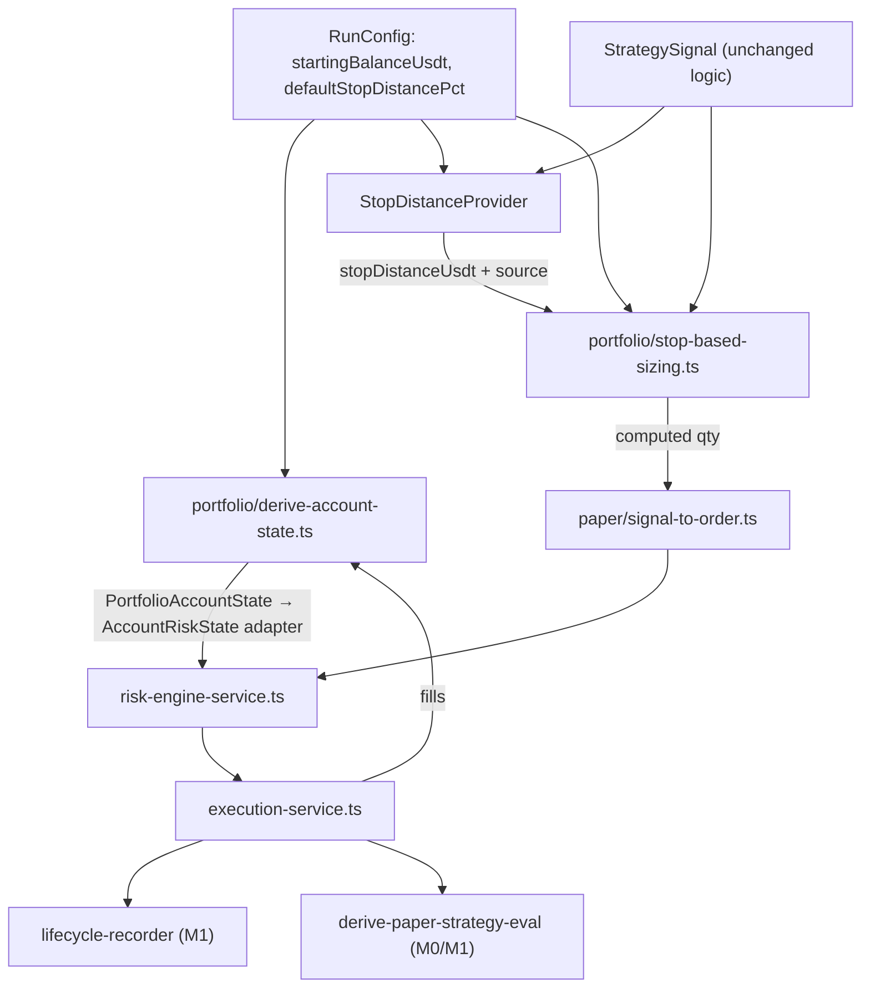

# M2 — Deposit / Portfolio / Risk Sizing Model

**Status:** BUILD-ready (plan-only — no implementation until Build entry conditions met)  
**Base:** `origin/dev` @ `f3498e66923fc9dedf6e81e2eade6cc1cbf867a3` (M1 merged #363)  
**Authority:** [`/Users/legco/.cursor/plans/ai-trader_completion_plan_8d61e4db.plan.md`](/Users/legco/.cursor/plans/ai-trader_completion_plan_8d61e4db.plan.md)  
**In-repo artifact (required at implementation start):** [`replay-runs/RI-P7/m2-deposit-portfolio-risk-sizing-org0/M2-PLAN.md`](replay-runs/RI-P7/m2-deposit-portfolio-risk-sizing-org0/M2-PLAN.md) — frozen snapshot of this plan written when implementation is authorized (living plan remains gitignored at `.cursor/plans/m2_portfolio_risk_sizing_fd4ff39c.plan.md`)

**Git verification (read-only):** local `dev` == `origin/dev` @ `f3498e6`; tracked tree clean; untracked `replay-runs/**` evidence untouched.

---

## 1. Current-state audit

### What exists today

| Area | Location | Capability |
|------|----------|------------|
| Risk engine orchestration | [`lib/trader/risk/risk-engine-service.ts`](lib/trader/risk/risk-engine-service.ts) | Kill-switch → trade-abuse → capital limits; fail-closed without `accountState` |
| Capital limits (DEE-240) | [`lib/trader/risk/capital-limits-evaluator.ts`](lib/trader/risk/capital-limits-evaluator.ts) | Drawdown, daily loss, open orders, per-symbol qty, quote exposure — **never RESIZE** |
| Org limits config (DEE-239) | [`lib/trader/risk/limits/*`](lib/trader/risk/limits/), [`db/schema.ts`](db/schema.ts) `trader_risk_limits` | `maxNotional`, `maxQuoteExposure`, `maxPositionPerSymbol`, etc. — **no pct-risk fields** |
| Account snapshot (stub) | [`lib/trader/risk/capital-limits.types.ts`](lib/trader/risk/capital-limits.types.ts), [`lib/trader/paper/account-risk-state-from-orders.ts`](lib/trader/paper/account-risk-state-from-orders.ts) | Positions + open orders; `dailyPnl`/`drawdown` hardcoded `"0"`; quote exposure **buy-only, no sell unwind** |
| Order sizing | [`lib/trader/paper/signal-to-order.ts`](lib/trader/paper/signal-to-order.ts) | `defaultQuantity` + optional `signal.maxRisk / price` cap (flat USDT, not equity-based) |
| Trade-abuse RESIZE | [`lib/trader/risk/trade-abuse-evaluator.ts`](lib/trader/risk/trade-abuse-evaluator.ts) | Trims to `maxNotional` only |
| Paper PnL (read model) | [`lib/trader/paper/derive-paper-pnl.ts`](lib/trader/paper/derive-paper-pnl.ts) | Realized PnL, fees, mark PnL — **not wired to risk/account state** |
| M1 lifecycle | [`lib/trader/lifecycle/*`](lib/trader/lifecycle/) | `PositionLot.avgCost`, `remainingQty`, forced-flat legs — **no risk-at-stop fields** |
| M0/M1 metrics | [`lib/trader/research/research-backtest-runner.ts`](lib/trader/research/research-backtest-runner.ts) | v2 taxonomy + lifecycle parity — **unchanged by M2** |
| Billing equity | [`lib/trader/billing/*`](lib/trader/billing/) | Invoice `startingEquity` — **disconnected from execution** |
| Exchange balances | [`lib/trader/balances/*`](lib/trader/balances/) | Live snapshots — **not used in paper/backtest** |

### What is missing for M2

- No `startingBalanceUsdt`, `availableBalanceUsdt`, `equityUsdt`, `feesPaidUsdt`, `realizedPnlUsdt`, `markedPnlUsdt` in risk path
- No `maxRiskPerTradePct`, `maxPortfolioRiskPct`, `maxConcurrentPositions` in config or enforcement
- No stop-based sizing (`qty = riskBudget / stopDistance`)
- No portfolio open-risk aggregation (`openRiskUsdt`)
- No deposit seed on backtest/research/paper runners (defaults to `EMPTY_ACCOUNT_STATE`)
- No `lib/trader/portfolio/*` module
- PnL/drawdown gates inert in replay paths

### Preserved constraints (binding)

- M0 closed-trade semantics + v2 metric taxonomy unchanged
- M1 Trade / PositionLot / TradeLeg / LifecycleEvent + forced-flat persistence unchanged
- No strategy file edits under `lib/trader/intelligence/strategies/*`
- No Guardian (M3), SL/TP engine (M4), exit intelligence (M5)
- No live trading, billing/HWM changes, blind consumption, sealed artifact mutation

---

## 2. Canonical M2 architecture



**Boundaries:**

| Layer | M2 owns | M2 does NOT own |
|-------|---------|-----------------|
| `lib/trader/portfolio/*` | USDT spot ledger, sizing math, open-risk projection, **`StopDistanceProvider` contract + M2 default impl** | Order submission, fill persistence, final stop-loss / exit logic |
| `lib/trader/risk/*` | New limit fields + capital checks (reject, not resize for pct-risk) | Stop price discovery implementations (M4+) |
| Runners | Seed deposit + inject `StopDistanceProvider` + refresh ledger between cycles | Strategy signals; **no ad-hoc pct math in runners** |
| Metrics | Optional export of account snapshot in VALIDATION artifact only | Bump `RESEARCH_VALIDATION_METRICS_SCHEMA_VERSION` (defer to M9) |

**Semantics stamp (new, non-breaking):**

```typescript
export const PORTFOLIO_RISK_SEMANTICS_VERSION_V1 = "waia.trader.portfolio-risk.v1" as const;
```

Stamp on portfolio ledger exports and M2 test fixtures. Do **not** mutate `CLOSED_TRADE_SEMANTICS_VERSION`, `TRADE_LIFECYCLE_SEMANTICS_VERSION_V2`, or metrics schema `2.0.0`.

### StopDistanceProvider boundary (binding)

Portfolio sizing **must not** hard-code `defaultStopDistancePct` math inside `stop-based-sizing.ts`, runners, or the risk engine. All stop-distance resolution goes through a small injectable provider contract in `lib/trader/portfolio/`.

**Contract** (`lib/trader/portfolio/stop-distance-provider.types.ts`):

```typescript
export type StopDistanceSource =
  | "RUN_DEFAULT_PCT"           // M2 DefaultStopDistanceProvider
  | "GUARDIAN"                  // future M3/M4
  | "ATR"                       // future M4
  | "STRATEGY"                  // future M5+
  | "EXIT_INTELLIGENCE";        // future M5

export type StopDistanceResult = {
  stopDistanceUsdt: string;
  source: StopDistanceSource;
};

export type StopDistanceProviderInput = {
  entryPrice: string;
  symbol: string;
  side: "buy" | "sell";
  signal: StrategySignal;
  runConfig: PortfolioRunConfig;
};

export type StopDistanceProvider = {
  resolveStopDistance(input: StopDistanceProviderInput): StopDistanceResult;
};
```

**M2 implementation — `DefaultStopDistanceProvider`** (`lib/trader/portfolio/default-stop-distance-provider.ts`):

- **Input:** `entryPrice`, `symbol`, `side`, `signal`, `runConfig` (includes `defaultStopDistancePct`)
- **Output:** `{ stopDistanceUsdt: multiplyDecimal(entryPrice, runConfig.defaultStopDistancePct), source: "RUN_DEFAULT_PCT" }`
- **Does not read** strategy files; **does not** treat output as a placed stop order or exit trigger

**Future replaceable providers (document only — not implemented in M2):**

| Provider | Milestone | Replaces default when |
|----------|-----------|------------------------|
| `GuardianStopDistanceProvider` | M3/M4 | Guardian emits invalidation level |
| `AtrStopDistanceProvider` | M4 | ATR/volatility SL distance |
| `StrategyStopDistanceProvider` | M5+ | Signal carries explicit stop metadata |
| `ExitIntelligenceStopDistanceProvider` | M5 | Exit intelligence invalidation |

Runners inject a `StopDistanceProvider` (default: `DefaultStopDistanceProvider`). Swapping provider must **not** require rewriting `computeStopBasedQuantity` or ledger math — only the injected implementation changes.

**`defaultStopDistancePct` is NOT:**

- A strategy signal field (strategies remain unchanged; no edits under `lib/trader/intelligence/strategies/*`)
- Final stop-loss logic or a placed SL/TP order
- Guardian, SL/TP engine, or exit-intelligence behavior

**It IS:**

- A **run-level risk-sizing assumption** only — provisional distance for `qty = riskBudget / stopDistance` until M4/M5 supply real stop semantics
- Configured on `PortfolioRunConfig` / runner env (e.g. `PAPER_LOOP_DEFAULT_STOP_DISTANCE_PCT`), consumed **only** by `DefaultStopDistanceProvider`

---

## 3. Data model and persistence

### Decision: partial migration required

| Persist? | What | Rationale |
|----------|------|-----------|
| **Yes — migrate** | 3 new columns on `trader_risk_limits` | Org-scoped config like existing limits; needed for paper loop worker + production risk service |
| **No — in-memory** | Per-run account ledger / snapshots | Mirrors M1 pattern (`derivePaperBook` is derived, not snapshotted); sufficient for backtest/research/paper M2 acceptance |
| **No** | New account-state table | Defer to M9/M10 if operator audit trail required |

### Migration spec

**Journal-confirmed next slots** (re-verify `db/migrations/meta/_journal.json` and `db/migrations_postgres/meta/_journal.json` immediately before authoring migrations — do not hard-code if journal has advanced):

| Engine | Current journal tail | M2 schema migration (expected) |
|--------|----------------------|--------------------------------|
| SQLite | `0038_trader_lifecycle` | `<next>_trader_portfolio_risk_limits.sql` → **0039** at `origin/dev` @ `f3498e6` |
| Postgres | `0068_trader_lifecycle_rls` | `<next>_trader_portfolio_risk_limits.sql` → **0069** at `origin/dev` @ `f3498e6` |

**RLS — verified: no new migration required**

Existing Postgres RLS already covers `trader_risk_limits`:

- Table created: [`db/migrations_postgres/0010_trader_risk_limits.sql`](db/migrations_postgres/0010_trader_risk_limits.sql)
- RLS enabled + policies: [`db/migrations_postgres/0011_trader_risk_limits_rls.sql`](db/migrations_postgres/0011_trader_risk_limits_rls.sql)
  - `ALTER TABLE ... ENABLE ROW LEVEL SECURITY`
  - Four **table-level** deny policies for `authenticated` / `anon` on SELECT, INSERT, UPDATE, DELETE (`USING (false)` / `WITH CHECK (false)`)
  - Service-role access via application layer (DEE-239); policies are defense-in-depth backstops

M2 adds columns to the **existing** table — not a new table. In PostgreSQL, `ALTER TABLE ... ADD COLUMN` inherits existing RLS policies automatically; policies are not column-scoped, so new columns (`max_risk_per_trade_pct`, etc.) require **no policy rewrite**.

**Therefore:**

- **No** `0070_trader_portfolio_risk_limits_rls.sql` (or any new RLS migration)
- **Only** one schema migration per engine (SQLite + Postgres)
- **Do not** modify [`0011_trader_risk_limits_rls.sql`](db/migrations_postgres/0011_trader_risk_limits_rls.sql) or recreate policies
- **Do** extend existing tenant-isolation tests: [`tests/unit/trader-risk-limits-tenant-isolation.test.ts`](tests/unit/trader-risk-limits-tenant-isolation.test.ts), [`tests/unit/trader-risk-engine-tenant-isolation.test.ts`](tests/unit/trader-risk-engine-tenant-isolation.test.ts) — assert new columns respect org scope and do not leak cross-tenant

SQLite has no RLS layer (Postgres-only per ADR-0017 pattern for RLS migrations).

**New columns on `trader_risk_limits`:**

| Column | Type | Default | Notes |
|--------|------|---------|-------|
| `max_risk_per_trade_pct` | TEXT NOT NULL | `"0.01"` | Decimal string, e.g. 1% = `"0.01"` |
| `max_portfolio_risk_pct` | TEXT NOT NULL | `"0.05"` | Sum of open risk-at-stop / equity cap |
| `max_concurrent_positions` | INTEGER NOT NULL | `3` | Count of OPEN lots / non-zero positions |

**Backwards compatibility:**

- Additive columns only; existing rows get defaults via migration `DEFAULT`
- Bump `config_version` on upsert; existing `NormalizedRiskLimitsConfig` consumers extended in [`lib/trader/risk/limits/types.ts`](lib/trader/risk/limits/types.ts)
- SQLite + Postgres schema parity per M1 lesson (composite FK order if any new FKs — none expected here)

**Tenant isolation:** unchanged — `organization_id` scoped; existing Postgres RLS unchanged; application-layer org scoping in limits repos remains primary

**No migration for:** run-level `startingBalanceUsdt` — passed as runner input (like `defaultQuantity` today)

---

## 4. Account state model

New type in `lib/trader/portfolio/portfolio-account.types.ts`:

```typescript
export type PortfolioAccountState = {
  semanticsVersion: typeof PORTFOLIO_RISK_SEMANTICS_VERSION_V1;
  quoteCurrency: "USDT"; // spot-only M2
  startingBalanceUsdt: string;
  availableBalanceUsdt: string;   // cash for new buys
  reservedMarginUsdt: string;     // always "0" for spot
  realizedPnlUsdt: string;
  markedPnlUsdt: string;          // unrealized at mark prices
  feesPaidUsdt: string;
  equityUsdt: string;             // available + mark value of open inventory
  openRiskUsdt: string;           // sum(risk-at-stop across open lots)
  openPositionCount: number;
  maxRiskPerTradePct: string;     // from org limits (effective at eval time)
  maxPortfolioRiskPct: string;
  maxConcurrentPositions: number;
  positions: readonly PortfolioPositionSnapshot[];
};

export type PortfolioPositionSnapshot = {
  symbol: string;
  quantity: string;
  avgCost: string;
  markPrice: string;
  unrealizedPnlUsdt: string;
  riskAtStopUsdt: string;         // remainingQty * stopDistanceUsdt
  stopDistanceUsdt: string;
};
```

**Derivation rules:**

- **Cash ledger:** `startingBalanceUsdt − Σ(buy adjusted notional + buy fees) + Σ(sell proceeds − sell fees)`
- **Realized PnL:** from fill-walk (reuse logic from [`derive-paper-pnl.ts`](lib/trader/paper/derive-paper-pnl.ts) walk, quote=USDT)
- **Marked PnL:** mark open qty at `markPrice` (last bar close in backtest; optional input in paper)
- **Equity:** `availableBalanceUsdt + Σ(qty × markPrice)` for open long spot
- **Fees:** accumulate all fill fees into `feesPaidUsdt`
- **Open risk:** per open lot: `riskAtStop = remainingQty × stopDistanceUsdt` where `stopDistanceUsdt` comes from injected `StopDistanceProvider` (M2: `DefaultStopDistanceProvider` / `RUN_DEFAULT_PCT`)
- **Adapter:** `toAccountRiskState(portfolio: PortfolioAccountState): AccountRiskState` — populate positions, fix quote exposure (buy debits − sell credits on USDT), wire `dailyPnl`/`drawdown` from equity vs starting (optional M2 enhancement)

**`reservedMarginUsdt`:** constant `"0"`; enforced in tests.

---

## 5. Sizing formulas (deterministic, decimal-only)

All math via [`lib/trader/risk/numeric.ts`](lib/trader/risk/numeric.ts) — **no `number` / float for persisted values**.

**Inputs:** `equityUsdt`, `availableBalanceUsdt`, `openRiskUsdt`, `openPositionCount`, limits, `entryPrice`, `stopDistanceProvider`, `signal`, `runConfig`, `costModel`, `minOrderQty` (default `"0.00001"`)

**Step 1 — Stop distance (via provider only)**

```
{ stopDistanceUsdt, source } = stopDistanceProvider.resolveStopDistance({
  entryPrice, symbol, side, signal, runConfig
})
if compareDecimal(stopDistanceUsdt, "0") <= 0 → reject (RISK_INVALID_STOP_DISTANCE)
// M2: source === "RUN_DEFAULT_PCT" — not a placed stop order
```

**Step 2 — Per-trade risk budget**

```
riskBudgetUsdt = multiplyDecimal(equityUsdt, maxRiskPerTradePct)
qtyByRisk = divideDecimal(riskBudgetUsdt, stopDistanceUsdt)
```

**Step 3 — Portfolio risk cap**

```
remainingPortfolioRiskUsdt = subtractDecimal(
  multiplyDecimal(equityUsdt, maxPortfolioRiskPct),
  openRiskUsdt
)
qtyByPortfolio = divideDecimal(remainingPortfolioRiskUsdt, stopDistanceUsdt)
```

**Step 4 — Available balance cap (fee-aware buy)**

```
projected = applyCostToFill(entryPrice, qtyCandidate, "buy", costModel)
buyCostUsdt = addDecimal(
  multiplyDecimal(projected.adjustedPrice, qtyCandidate),
  projected.fee
)
// Binary search or iterative trim: largest qty where buyCostUsdt <= availableBalanceUsdt
qtyByBalance = trimQtyToAffordable(...)
```

**Step 5 — Notional cap (existing trade-abuse)**

```
qtyByNotional = divideDecimal(maxNotional, entryPrice)  // trade-abuse layer still applies
```

**Step 6 — Concurrent positions**

```
if side === "buy" && openPositionCount >= maxConcurrentPositions && !addingToExistingSymbol
  → reject RISK_MAX_CONCURRENT_POSITIONS
```

**Step 7 — Final quantity**

```
qty = minDecimal(qtyByRisk, qtyByPortfolio, qtyByBalance, defaultQuantity)
if signal.maxRisk: qty = minDecimal(qty, divideDecimal(signal.maxRisk, entryPrice))  // preserve existing cap
qty = floorToLotStep(qty, minOrderQty)  // dust: if qty < minOrderQty → skip order (NO_SIGNAL path) or reject
```

**Dust handling:** if final `qty < minOrderQty`, emit skip with reason `PORTFOLIO_BELOW_MIN_QTY` — do not submit dust orders.

**Sell orders:** sizing unchanged (close existing qty); portfolio module passes through requested close qty; capital evaluator still enforces CLOSE_ONLY when over limits.

---

## 6. Integration points

| Path | File | M2 change |
|------|------|-----------|
| **Backtest** | [`lib/trader/backtest/backtest-runner.ts`](lib/trader/backtest/backtest-runner.ts) | Add `startingBalanceUsdt`, `PortfolioRunConfig`, inject `DefaultStopDistanceProvider`; seed ledger; refresh after each bar cycle — **no pct math in runner** |
| **Research** | [`lib/trader/research/research-backtest-runner.ts`](lib/trader/research/research-backtest-runner.ts) | Replace `EMPTY_ACCOUNT_STATE` with seeded portfolio state; pass provider + run config to `runBacktest` |
| **Paper cycle** | [`lib/trader/paper/paper-cycle-runner.ts`](lib/trader/paper/paper-cycle-runner.ts) | Inject `StopDistanceProvider`; call `computeStopBasedQuantity` before `mapSignalToSubmitOrder`; refresh portfolio state between strategies |
| **Paper loop** | [`lib/trader/paper/run-paper-loop-cycle.ts`](lib/trader/paper/run-paper-loop-cycle.ts), [`build-worker-deps.ts`](lib/trader/paper/build-worker-deps.ts) | Env: `PAPER_LOOP_STARTING_BALANCE_USDT`, `PAPER_LOOP_DEFAULT_STOP_DISTANCE_PCT` → `PortfolioRunConfig` only; provider resolves distance |
| **Signal mapping** | [`lib/trader/paper/signal-to-order.ts`](lib/trader/paper/signal-to-order.ts) | Accept pre-sized `quantity` from portfolio sizer (keep `allocateQuantity` as fallback when sizer absent) |
| **Risk engine** | [`lib/trader/risk/capital-limits-evaluator.ts`](lib/trader/risk/capital-limits-evaluator.ts) | New checks: concurrent positions, portfolio risk, available balance, invalid stop |
| **Execution** | [`lib/trader/execution/execution-service.ts`](lib/trader/execution/execution-service.ts) | No sizing logic; optional audit field `sizingBasis` in lifecycle metadata (nullable, M2 populate stop distance + risk budget) |
| **Lifecycle** | [`lib/trader/lifecycle/lifecycle-recorder.ts`](lib/trader/lifecycle/lifecycle-recorder.ts) | Read-only: use OPEN lots for `openPositionCount` when repository available |
| **Metrics** | [`lib/trader/paper/derive-paper-strategy-eval.ts`](lib/trader/paper/derive-paper-strategy-eval.ts) | **No taxonomy changes**; M0/M1 parity tests must stay green |
| **M1 parity** | [`lib/trader/lifecycle/lifecycle-fill-walk-parity.ts`](lib/trader/lifecycle/lifecycle-fill-walk-parity.ts) | Must pass unchanged when portfolio sizing enabled with generous limits (fixture uses large deposit) |

**Sizing placement:** compute in `portfolio/stop-based-sizing.ts`, invoked from paper-cycle **before** risk engine — keeps capital evaluator reject-only (preserves `risk-engine-service.ts` INV-3: RESIZE only from trade-abuse).

---

## 7. Test plan

| Category | File(s) | Cases |
|----------|---------|-------|
| **Unit — StopDistanceProvider** | `tests/unit/trader-portfolio-stop-distance-provider.test.ts` | `DefaultStopDistanceProvider` deterministic output; `source === "RUN_DEFAULT_PCT"`; zero/negative pct rejected |
| **Unit — sizing math** | `tests/unit/trader-portfolio-stop-based-sizing.test.ts` | Sizing calls provider (mocked + default); deterministic qty; all caps binding; dust floor; fee-aware balance trim |
| **Unit — ledger** | `tests/unit/trader-portfolio-account-state.test.ts` | Starting balance → buys → sells → fees → equity reconciliation; sell unwinds quote exposure |
| **Unit — capital limits** | extend [`tests/unit/trader-capital-limits-evaluator.test.ts`](tests/unit/trader-capital-limits-evaluator.test.ts) | Concurrent positions, portfolio risk, insufficient balance rejects |
| **Unit — risk engine** | extend [`tests/unit/trader-risk-engine-service.test.ts`](tests/unit/trader-risk-engine-service.test.ts) | End-to-end reject codes with portfolio state |
| **Unit — adapter** | `tests/unit/trader-portfolio-account-risk-adapter.test.ts` | `toAccountRiskState` fixes buy-only exposure bug |
| **Integration — backtest** | extend [`tests/unit/trader-closed-trade-attribution-v2.test.ts`](tests/unit/trader-closed-trade-attribution-v2.test.ts) or new fixture | Large deposit + wide limits → M0/M1 metrics unchanged |
| **Integration — paper cycle** | extend [`tests/unit/trader-paper-cycle-runner.test.ts`](tests/unit/trader-paper-cycle-runner.test.ts) | Low deposit rejects buy; multi-position concurrent cap |
| **Migration parity** | extend [`tests/unit/trader-risk-limits-schema.test.ts`](tests/unit/trader-risk-limits-schema.test.ts) and [`tests/unit/trader-risk-limits-service.test.ts`](tests/unit/trader-risk-limits-service.test.ts) | New columns readable/writable SQLite + Postgres repos |
| **Tenant isolation** | extend [`tests/unit/trader-risk-limits-tenant-isolation.test.ts`](tests/unit/trader-risk-limits-tenant-isolation.test.ts) and [`tests/unit/trader-risk-engine-tenant-isolation.test.ts`](tests/unit/trader-risk-engine-tenant-isolation.test.ts) | Org A new limit fields don't leak to Org B; existing RLS posture unchanged |
| **M0 forensic** | [`tests/unit/trader-closed-trade-attribution-forensics-m0.test.ts`](tests/unit/trader-closed-trade-attribution-forensics-m0.test.ts) | **Must remain unchanged and green** |
| **M1 lifecycle** | [`tests/unit/trader-lifecycle-*.test.ts`](tests/unit/) | No regression |
| **Determinism** | sizing + ledger tests | Pinned timestamps, counter-based ids; byte-identical outputs across two runs |

---

## 8. Files to edit/create

### Read-only (audit / reference)

- [`replay-runs/RI-P7/trade-lifecycle-model-org0/DESIGN.md`](replay-runs/RI-P7/trade-lifecycle-model-org0/DESIGN.md)
- [`replay-runs/RI-P7/trade-lifecycle-model-org0/VALIDATION.md`](replay-runs/RI-P7/trade-lifecycle-model-org0/VALIDATION.md)
- [`replay-runs/RI-P7/trade-lifecycle-model-org0/M1-SCOPE-AUDIT.md`](replay-runs/RI-P7/trade-lifecycle-model-org0/M1-SCOPE-AUDIT.md)
- Living plan (gitignored): `/Users/legco/.cursor/plans/ai-trader_completion_plan_8d61e4db.plan.md`
- Do **not** edit M0/M1 artifact bodies

### New files

```
lib/trader/portfolio/index.ts
lib/trader/portfolio/portfolio-account.types.ts
lib/trader/portfolio/portfolio-semantics.ts          # PORTFOLIO_RISK_SEMANTICS_VERSION_V1
lib/trader/portfolio/stop-based-sizing.ts
lib/trader/portfolio/derive-portfolio-account-state.ts
lib/trader/portfolio/to-account-risk-state.ts
lib/trader/portfolio/portfolio-run-config.types.ts
lib/trader/portfolio/stop-distance-provider.types.ts
lib/trader/portfolio/default-stop-distance-provider.ts

tests/unit/trader-portfolio-stop-distance-provider.test.ts
tests/unit/trader-portfolio-stop-based-sizing.test.ts
tests/unit/trader-portfolio-account-state.test.ts
tests/unit/trader-portfolio-account-risk-adapter.test.ts

db/migrations/<next>_trader_portfolio_risk_limits.sql       # journal next: 0039 @ f3498e6
db/migrations_postgres/<next>_trader_portfolio_risk_limits.sql  # journal next: 0069 @ f3498e6
# NO new RLS migration — 0011_trader_risk_limits_rls.sql already covers table

replay-runs/RI-P7/m2-deposit-portfolio-risk-sizing-org0/M2-PLAN.md   # frozen snapshot at impl start
replay-runs/RI-P7/m2-deposit-portfolio-risk-sizing-org0/DESIGN.md
replay-runs/RI-P7/m2-deposit-portfolio-risk-sizing-org0/VALIDATION.md
replay-runs/RI-P7/m2-deposit-portfolio-risk-sizing-org0/M2-SCOPE-AUDIT.md
```

### Edit files

```
lib/trader/risk/capital-limits.types.ts          # extend AccountRiskState or document adapter
lib/trader/risk/capital-limits-evaluator.ts      # new checks
lib/trader/risk/reason-codes.ts                  # new codes
lib/trader/risk/types.ts                         # RiskCheckName additions
lib/trader/risk/limits/types.ts                  # NormalizedRiskLimitsConfig + mappers
lib/trader/risk/limits/defaults.ts
lib/trader/risk/limits/validate-limits.ts
lib/trader/risk/limits/repository-sqlite.ts
lib/trader/risk/limits/repository-postgres.ts
lib/trader/risk/index.ts
lib/trader/index.ts

lib/trader/paper/account-risk-state-from-orders.ts # delegate to portfolio or deprecate with adapter
lib/trader/paper/signal-to-order.ts
lib/trader/paper/paper-cycle.types.ts
lib/trader/paper/paper-cycle-runner.ts
lib/trader/paper/run-paper-loop-cycle.ts
lib/trader/paper/build-worker-deps.ts

lib/trader/backtest/backtest-runner.ts
lib/trader/research/research-backtest-runner.ts
lib/trader/research/create-in-memory-research-backtest-session.ts

db/schema.ts
db/schema.postgres.ts

tests/unit/trader-capital-limits-evaluator.test.ts
tests/unit/trader-account-risk-state-from-orders.test.ts
tests/unit/trader-risk-engine-service.test.ts
tests/unit/trader-paper-cycle-runner.test.ts
```

### Must NOT edit

- `lib/trader/intelligence/strategies/*`
- `lib/trader/guardian/*`, `lib/trader/exits/*` (don't exist yet — no creation in M2)
- Sealed `replay-runs/**` evidence (untracked local files)
- M0/M1 artifact directories under `trade-lifecycle-model-org0/`

---

## 9. Out of scope (explicit)

- M3 Position Guardian runtime
- M4 Dynamic SL/TP / trailing stops
- M5 Exit intelligence / reason records
- Strategy logic or CDE changes
- Live trading / external client live
- Billing / HWM ledger changes
- Autonomous discovery / blind campaign / Execution Server campaign (M9)
- Bumping `RESEARCH_VALIDATION_METRICS_SCHEMA_VERSION` or mutating sealed v1/v2 metrics rows
- Leverage, margin, liquidation, short spot
- Capital evaluator RESIZE for pct-risk (sizing pre-computed in portfolio module)
- **`lib/trader/guardian/*`, `lib/trader/exits/*`, `lib/trader/reason-records/*`** — do not create these modules in M2
- Hard-coding `defaultStopDistancePct` math outside `DefaultStopDistanceProvider`

---

## 10. Implementation sequence

### Phase 1 — Pure portfolio model (no DB, no runner wiring)

- **Objective:** Types, semantics version, `StopDistanceProvider` contract + `DefaultStopDistanceProvider`, sizing + ledger pure functions with full unit tests
- **Files:** `lib/trader/portfolio/*` (except runner wiring), provider + sizing + ledger tests
- **Tests:** `trader-portfolio-stop-distance-provider.test.ts`, `trader-portfolio-stop-based-sizing.test.ts`, `trader-portfolio-account-state.test.ts`
- **Acceptance:** Provider contract exists; sizing depends on injected provider (no scattered pct math); provider output deterministic; fee-aware balance cap proven
- **Stop:** Human review of DESIGN.md draft

### Phase 2 — Risk limits schema migration + capital enforcement

- **Objective:** ADD COLUMN on `trader_risk_limits` (SQLite + Postgres only); limits service; capital evaluator checks; reason codes. **No RLS migration.**
- **Files:** one migration per engine (journal next: 0039 / 0069), schema, `lib/trader/risk/limits/*`, `capital-limits-evaluator.ts`
- **Tests:** extend existing risk-limits schema/service/tenant-isolation tests
- **Acceptance:** New limits configurable per org; rejects fire with stable reason codes
- **Stop:** Human review before runner integration

### Phase 3 — Runner integration (backtest / research / paper)

- **Objective:** Wire portfolio sizer + ledger refresh; replace `EMPTY_ACCOUNT_STATE`; env config for paper loop
- **Files:** backtest, research, paper-cycle, signal-to-order, account-risk adapter
- **Tests:** paper cycle + v2 backtest regression with generous deposit; M0 forensic unchanged
- **Acceptance:** Orders sized from deposit; low-deposit fixture rejects; M0/M1 metrics + lifecycle parity green
- **Stop:** Human review before validation artifact

### Phase 4 — Validation artifact + PR readiness

- **Objective:** `VALIDATION.md`, `M2-SCOPE-AUDIT.md`, `M2-PR-READINESS.md`
- **Files:** `replay-runs/RI-P7/m2-deposit-portfolio-risk-sizing-org0/*`
- **Tests:** Full chain `pnpm lint && pnpm typecheck && pnpm test --run && pnpm build`
- **Acceptance:** Scope audit PASS; governance preflight ready
- **Stop:** Human architectural review → branch/PR authorization

---

## 11. M2 COMPLETE acceptance criteria

1. `PortfolioAccountState` derives all 12 required fields from starting balance + fills + marks
2. Stop-based sizing uses **`StopDistanceProvider`** — M2 ships `DefaultStopDistanceProvider` (`source: "RUN_DEFAULT_PCT"`); no ad-hoc pct math in runners or sizing core
3. Tests prove provider output is **deterministic** (byte-identical across runs with pinned inputs)
4. `maxRiskPerTradePct`, `maxPortfolioRiskPct`, `maxConcurrentPositions` enforced in capital evaluator
5. `reservedMarginUsdt === "0"` always for spot paths
6. Integrated into backtest, research validation backtest, and paper cycle paths
7. M0 forensic test unchanged and green; M1 lifecycle tests green; v2 taxonomy aggregate == sum(byRegime)
8. No strategy file changes; no sealed artifact mutation; **no** `lib/trader/guardian/*`, `lib/trader/exits/*`, or `lib/trader/reason-records/*` created
9. Schema migrations applied SQLite + Postgres; **existing** `trader_risk_limits` RLS unchanged; tenant isolation tests pass (including new columns)
10. `VALIDATION.md` proves deposit depletion rejects orders and sizing bounds hold deterministically
11. `PORTFOLIO_RISK_SEMANTICS_VERSION_V1` stamped on portfolio exports
12. `defaultStopDistancePct` documented and implemented **only** as run-level risk-sizing assumption — not strategy signal, not final stop-loss

---

## 12. Build entry conditions (mandatory before Phase 1 code)

All must be true before any implementation begins:

| # | Condition | Verification |
|---|-----------|--------------|
| 1 | Linear **DEE-377** created or confirmed (groom complete) | Linear issue exists with M2 task contract |
| 2 | Branch **`dee-377-m2-portfolio-risk-sizing`** off clean `dev` @ `f3498e6` | `git rev-parse HEAD` == `origin/dev`; branch checked out |
| 3 | **`M2-PLAN.md`** snapshot written to `replay-runs/RI-P7/m2-deposit-portfolio-risk-sizing-org0/` | First implementation artifact — frozen copy of this plan |
| 4 | **No `git add -A`** — explicit manifest staging only | §12 Git staging discipline |
| 5 | **Untracked `replay-runs/**` evidence not staged** | Pre-existing local vault files remain unstaged |
| 6 | Architectural sign-off on this BUILD-ready plan | Human approval (this polish cycle) |

If any condition fails → **NOT_READY_FOR_BUILD**; do not write production code.

---

## 13. PR strategy

| Item | Value |
|------|-------|
| **Linear** | Groom **`DEE-377`** (or next NN) — title: *M2 — Deposit/portfolio/risk sizing (USDT spot-only)* |
| **Labels** | `backend`, `program:ai-trader` (single execution label + program) |
| **Parent** | DEE-364 (program) or `relatedTo` DEE-376 (M1) |
| **Branch** | `dee-377-m2-portfolio-risk-sizing` off `dev` @ `f3498e6` |
| **Risk tier** | **T2** (migrations + runtime persistence consumers) |
| **PR scope** | Portfolio module + risk limits schema migration + runner wiring + tests + M2 artifacts only |
| **Commits** | `DEE-377 type(scope): subject` per phase or squashed at PR |
| **Validation** | `pnpm lint && pnpm typecheck && pnpm test --run && pnpm build` + `./scripts/linear/preflight-pr-governance.sh` |
| **Merge readiness** | Scope audit PASS, CI green incl. postgres integration, DEE-377 In Review, human squash merge to `dev` |
| **Do NOT** | Push to `dev`/`main`; open PR without human authorization; `git add -A`; stage untracked replay evidence |

### Git staging discipline (binding)

Follow M1 PR Contract pattern — **explicit manifest only**:

- **Never** run `git add -A` or `git add .`
- **Never** stage untracked local evidence:
  - `replay-runs/DEE-178-bp5-gate/**`
  - `replay-runs/DEE-337-p5-two-strategy/**`
  - `replay-runs/RI-P7/dee-371-artifact-check/**`
  - `replay-runs/RI-P7/signal-attribution-org0-20260703/**`
  - any other pre-existing untracked `replay-runs/**` paths
- Stage only M2-scoped paths from §8 manifest via explicit `git add <path>` per file or directory
- Before commit: `git status --short` — flag anything outside manifest
- M2 campaign artifacts under `replay-runs/RI-P7/m2-deposit-portfolio-risk-sizing-org0/` **are** in scope when produced by M2 (including `M2-PLAN.md`)

---

## 14. Risk assessment

| Risk | Mitigation |
|------|------------|
| Sizing changes fill quantities → breaks M0/M1 metric counts | Regression fixtures use **large deposit + wide limits** to preserve prior qty; separate fixture proves deposit-bound behavior |
| Provisional stop misleads until M4 | Document in DESIGN.md; `DefaultStopDistanceProvider` + `RUN_DEFAULT_PCT` source tag; M4 providers swap via injection |
| Stop distance logic scattered in runners | **Forbidden** — enforce via `StopDistanceProvider` contract + code review |
| Capital RESIZE invariant drift | Keep pct-risk sizing **pre-risk** in portfolio module; capital evaluator reject-only |
| Quote exposure bug persists | Replace `deriveAccountRiskStateFromMockOrders` with portfolio adapter that nets buys/sells |
| Migration drift SQLite/Postgres | Re-verify journal tails before authoring; parity test on limits repos; no spurious RLS migration |
| Accidental RLS policy rewrite | M2 is ADD COLUMN only; do not touch `0011_trader_risk_limits_rls.sql` |
| Accidental metrics schema bump | Explicit out-of-scope; code review checklist |
| M2 leaks into Guardian/SL-TP | No new `guardian/` or `exits/` directories; phase scope audit |

---

## 15. Final recommendation

**PASS**

**READY_FOR_BUILD**

No blockers. M1 merged; local `dev` aligned with `origin/dev`. Plan includes `StopDistanceProvider` boundary, RLS-verified migration spec, build entry conditions, and explicit git staging discipline.

**Before Phase 1 code (Build entry checklist — §12):**

1. Groom / confirm **DEE-377** in Linear
2. `git checkout dev && git pull origin dev` → create **`dee-377-m2-portfolio-risk-sizing`**
3. Write **`M2-PLAN.md`** snapshot to `replay-runs/RI-P7/m2-deposit-portfolio-risk-sizing-org0/` (explicit `git add` only)
4. Never `git add -A`; never stage pre-existing untracked replay evidence
5. Proceed Phase 1 → Phase 4 per §10

**Note:** Local commit `9b5df12` (DEE-375 governance docs) remains in hygiene backup only — separate optional governance PR, not part of M2.

---

## Historical execution annotation (2026-07-06)

**Status:** Complete · **Linear:** DEE-377 · **Merged:** PR to `dev` (M2 milestone)  
**Superseded by:** `.cursor/plans/ai-trader_intelligence_evolution_48358215.plan.md` for post-M9 work  
**Canonical recovery entry point:** `../AI-TRADER-ENGINEERING-STATUS.md`
