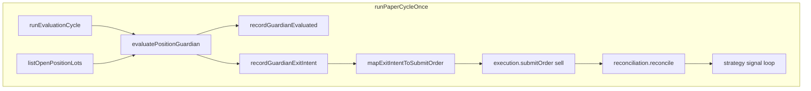

# M3 Position Guardian — DESIGN

**Linear:** DEE-378 · **Branch:** `dee-378-m3-position-guardian` · **Reason schema:** `waia.trader.guardian-reason.v1`

## Objective

Supervisory per-bar monitor for M1 open position lots. Emits auditable hold/exit decisions from permission/regime/structural rules only — **no ATR, SL, TP, or trailing math**. Exit intents become sell market orders via existing risk → mock execution → lifecycle sell-pairing.

## Architecture

## Core modules

| Module | Role |
|--------|------|
| `guardian.types.ts` | `GuardianDecision`, `ExitIntent`, evaluation/cycle result types |
| `guardian-reason-record.types.ts` | `GuardianReasonRecord` payload schema |
| `guardian-reason-codes.ts` | `GUARDIAN_*` codes + rule IDs |
| `guardian-run-config.types.ts` | Opt-in run config (`enabled`, `maxHoldBars`, `barIntervalMs`) |
| `guardian-decision-model.ts` | Pure `decideGuardianAction` — M3 rules only |
| `evaluate-position-guardian.ts` | Per-bar orchestrator over open lots |
| `map-exit-intent-to-submit-order.ts` | Close mapper bypassing strategy permission block |
| `guardian-order-keys.ts` | Deterministic idempotency keys per lot/cycle |
| `guardian-rule-provider.types.ts` | M4 composition hook (unused in M3 rules) |

## Decision rule table

| Rule ID | Input | Decision | Reason code |
|---------|-------|----------|-------------|
| `CLOSE_ONLY_PERMISSION` | `ONLY_CLOSE_POSITIONS` | EXIT_FULL | `GUARDIAN_CLOSE_ONLY_PERMISSION` |
| `STOP_TRADING_WITH_OPEN_RISK` | `STOP_TRADING` + open lot | EXIT_FULL | `GUARDIAN_STOP_TRADING_FLAT` |
| `STRATEGY_DISALLOWED` | strategy ∉ allowed list | EXIT_FULL | `GUARDIAN_STRATEGY_DISALLOWED` |
| `MAX_HOLD_BARS` | `barsHeld >= maxHoldBars` (when `maxHoldBars > 0`) | EXIT_FULL | `GUARDIAN_MAX_HOLD_BARS` |
| `DEFAULT_HOLD` | none of above | HOLD | `GUARDIAN_HOLD` |

## ExitIntent contract

- `kind`: `CLOSE_LONG`
- `side`: `sell`
- `quantity`: lot `remainingQty`
- `openingStrategySignalId`: from lot (M1 sell-pairing)
- `clientOrderId` / `idempotencyKey`: deterministic via `guardianOrderKeys(cycleId, lotId)`

## GuardianReasonRecord (`waia.trader.guardian-reason.v1`)

Persisted as JSON on lifecycle events `GUARDIAN_EVALUATED` and embedded in `ExitIntent.reason`. Fields include decision, reasonCode, ruleId, cycle context, lot/trade/strategy ids, regime, tradingPermission, mark/unrealized PnL, barsHeld. M3 placeholders: `slTpLevels`, `rMultiple`, `invalidation` = null; `patternRefs`, `signalRefs` = [].

## Lifecycle phases

| Phase | When | Payload |
|-------|------|---------|
| `GUARDIAN_EVALUATED` | Every open lot every enabled bar | `GuardianReasonRecord` |
| `GUARDIAN_EXIT_INTENT` | Before submit on EXIT_FULL | Full `ExitIntent` JSON |

## Integration contract

- **Opt-in:** `PaperCycleInput.guardian?.runConfig.enabled` + `PaperCycleDeps.lifecycleRepository`
- **Position truth:** M1 `PositionLotRow` only — not portfolio-derived inference
- **Account state:** passed to risk on submit; optional M2 refresh after fill
- **Worker boundary:** not wired in M3 — proven in `runPaperCycleOnce` only

## M3 ↔ M4 contract

M4 extends via `GuardianRuleProvider[]` injected into `decideGuardianAction` / `evaluatePositionGuardian`. M3 ships empty provider list; no M4 modules imported.

## Explicit non-goals (M3)

- No SL/TP/ATR/trailing
- No `lib/trader/exits/*` or `reason-records/*` tables
- No strategy file changes
- No backtest/research runner wiring
- No Worker / paper-loop production wiring
